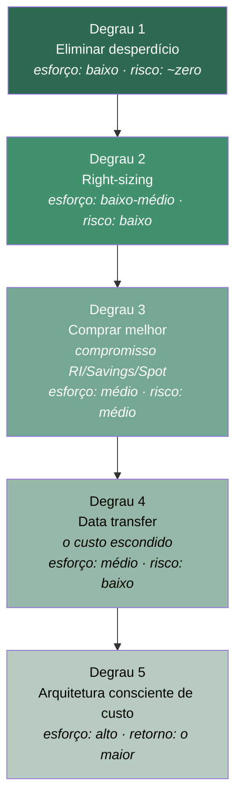
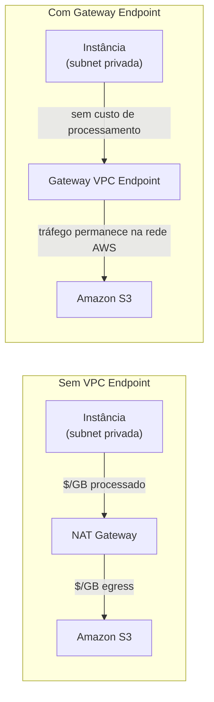

> [!abstract] TL;DR
> Visibilidade (nota anterior) diz *quanto* e *quem* gasta. Otimização diz *o que fazer* com essa informação. As alavancas formam uma escada de esforço crescente: primeiro elimine desperdício puro (recursos órfãos, ambientes ligados à toa) — custo zero, ganho imediato; depois ajuste o tamanho do que sobrou (right-sizing, guiado por dados de uso real); depois compre melhor o que você sabe que vai rodar (compromisso de longo prazo); e só então mexa na arquitetura, onde o retorno é maior mas o esforço também. Um vilão à parte, quase invisível, é a transferência de dados: NAT Gateway e egress cobram por byte e raramente aparecem no desenho da arquitetura. Na AWS há dezenas de alavancas — cada uma com um botão, um relatório, um serviço dedicado. Na DigitalOcean a lição é outra: o pricing simples elimina boa parte do desperdício por design, mas também tira do seu alcance boa parte das alavancas finas que a AWS oferece.

## O problema: você já sabe quanto gasta. E agora?

A nota anterior resolveu o problema da visibilidade: tags, contas, dashboards, um relatório que chega na mesa do gerente todo mês mostrando quanto cada time gastou. Ótimo. Mas visibilidade sozinha não corta um centavo da fatura — ela só aponta o dedo. Alguém ainda precisa decidir *o que fazer* com o número.

E aqui mora uma armadilha comum: a reação de pânico. A fatura veio 40% maior que o mês passado, o VP perguntou por quê, e o instinto é ligar pra tudo e cortar 20% de instâncias "porque sim". Isso é o oposto de FinOps. Otimização de custo bem-feita é disciplinada, orientada a dados, e — principalmente — ordenada por esforço. Você não vai reescrever a arquitetura de uma aplicação antes de checar se tem quinze volumes EBS órfãos custando dinheiro sem servir a ninguém.

Pense em otimização de custo como uma escada: cada degrau economiza mais, mas também custa mais esforço, risco e tempo de engenharia pra subir.



A ordem importa: subir a escada fora de ordem — por exemplo, comprar Reserved Instances (degrau 3) antes de eliminar desperdício (degrau 1) — significa comprometer dinheiro de longo prazo pra pagar por recursos que nem deveriam existir. Vamos descer degrau por degrau.

## Degrau 1 — Eliminar desperdício

Desperdício puro é dinheiro saindo pela porta sem nenhum benefício em troca. Não é sobre fazer menos com mais eficiência — é sobre parar de pagar por coisas que ninguém está usando. Três categorias concentram a maior parte do problema.

**Recursos órfãos.** Todo ambiente cloud que vive há mais de alguns meses acumula sobras: volumes EBS desanexados depois que a instância que os usava foi terminada, Elastic IPs alocados mas não associados a nada (a AWS cobra por IP elástico *não anexado*, ao contrário do IP público comum de uma instância rodando), snapshots antigos de volumes que já nem existem mais, load balancers sem nenhum target saudável atrás. Nenhum desses recursos aparece "quebrado" — eles simplesmente continuam sendo cobrados, silenciosamente, mês após mês. Uma varredura trimestral (ou um scanner automatizado) que cruza "isso está sendo cobrado" com "isso está anexado a algo que roda" costuma achar economia de dois dígitos percentuais em ambientes que nunca passaram por essa limpeza.

**Ambientes non-prod ligados fora do horário.** Um ambiente de desenvolvimento ou QA que só é usado em horário comercial, de segunda a sexta, está ligado — e sendo cobrado — cerca de 168 horas por semana quando só precisaria de ~45. Isso é quase 75% de desperdício puro em compute que ninguém está tocando às 2h de uma terça. A correção é mecânica: um scheduler que desliga instâncias por tag fora do horário e religa antes do primeiro humano chegar.

**Lifecycle de storage mal configurado (ou ausente).** Dados não têm o mesmo valor a vida inteira. Um log de aplicação de 90 dias atrás quase nunca é lido, mas se ele ainda está na classe de armazenamento mais cara — porque ninguém configurou uma regra de lifecycle — a conta paga o preço de "acesso instantâneo" por um dado que, na prática, está arquivado. O S3 Lifecycle resolve isso com regras declarativas: até 1.000 regras por bucket, cada uma dizendo "depois de N dias, transicione pra outra classe" ou "depois de N dias, expire (delete)". A [[03-Dominios/Tecnologia/Cloud/08 - Armazenamento (object, block e file)/index|nota de Armazenamento]] já cobriu as classes e o versionamento em detalhe — aqui a questão é operacional: a regra de lifecycle *existe* no seu bucket, ou os dados estão todos parados em Standard desde o dia 1?

> [!info] Verificado 2026-07-24 — via docs.aws.amazon.com/AmazonS3
> Por padrão, objetos menores que 128 KB **não** são transicionados por regras de lifecycle (o overhead de gerenciar a transição supera a economia); isso é ajustável via filtro de tamanho. Regras de expiração/transição podem ser filtradas por prefixo de chave, tags de objeto, ou faixa de tamanho, combinados com `<And>`.

```json
{
  "Rules": [
    {
      "ID": "logs-lifecycle",
      "Filter": { "Prefix": "logs/" },
      "Status": "Enabled",
      "Transitions": [
        { "Days": 30, "StorageClass": "STANDARD_IA" },
        { "Days": 90, "StorageClass": "GLACIER" }
      ],
      "Expiration": { "Days": 365 }
    }
  ]
}
```

Na DigitalOcean, o equivalente estrutural é o **Spaces Lifecycle Rules** — object storage compatível com S3 que também suporta regras de expiração e transição por prefixo. A diferença honesta: a DO tem menos classes de armazenamento (não existe um espectro Standard → IA → One Zone-IA → Glacier → Glacier Deep Archive; a granularidade de "temperatura" do dado que a AWS oferece simplesmente não existe do outro lado).

## Degrau 2 — Right-sizing

Right-sizing é a pergunta mais simples de todas: *este recurso está do tamanho certo pro que ele realmente faz?* Superdimensionar "pra garantir" é o padrão-ouro do desperdício disfarçado de prudência — e é surpreendentemente comum, porque ninguém revisita o tamanho de uma instância depois que ela entra em produção e "funciona".

O **AWS Compute Optimizer** existe exatamente pra tirar o palpite dessa decisão. Ele analisa as métricas reais de utilização — via CloudWatch — e as especificações do recurso, e devolve uma recomendação: mantenha, aumente, ou (o caso mais comum e mais lucrativo) diminua.

> [!info] Verificado 2026-07-24 — via docs.aws.amazon.com/compute-optimizer
> O Compute Optimizer analisa EC2, Auto Scaling Groups, volumes EBS, funções Lambda, serviços ECS no Fargate, bancos Aurora/RDS, NAT Gateway, DynamoDB, ElastiCache, MemoryDB, DocumentDB, WorkSpaces e SageMaker. É **opt-in** (você precisa habilitar o serviço). O lookback padrão de métricas é de **14 dias**; o recurso pago "enhanced infrastructure metrics" estende isso pra 93 dias. Também é possível ingerir métricas externas de memória (Datadog, Dynatrace) pra recomendações de EC2 mais precisas — CloudWatch sozinho não vê uso de memória por padrão.

```bash
# Listar recomendações de rightsizing para instâncias EC2
aws compute-optimizer get-ec2-instance-recommendations \
  --instance-arns arn:aws:ec2:us-east-1:123456789012:instance/i-0abcd1234 \
  --query 'instanceRecommendations[].{
    Atual: currentInstanceType,
    Recomendado: recommendationOptions[0].instanceType,
    Achado: finding
  }' --output table
```

Repare que Lambda está na lista — e ali "right-sizing" tem um sabor diferente do que parece. Alocar mais memória numa função Lambda também aumenta a CPU proporcionalmente (a AWS acopla os dois recursos), então uma função com pouca memória pode rodar mais *devagar*, gastando mais tempo de execução — e tempo de execução é exatamente o que a Lambda cobra. O ponto ótimo de memória, então, não é "o mínimo que funciona": é o ponto onde `memória × duração` é menor, o que às vezes significa *aumentar* a memória alocada. Esse é o mesmo raciocínio de power tuning discutido na nota de Lambda do galho de Computação Serverless — vale revisitar se você não configurou isso ainda.

Na DigitalOcean, o equivalente não existe como serviço dedicado. Não há um "Compute Optimizer da DO" analisando 14 dias de CloudWatch equivalente e recomendando trocar seu Droplet de tamanho. O que existe é o **resize manual de Droplets** — trocar CPU, RAM e opcionalmente disco, documentado como procedimento operacional, não como recomendação automatizada orientada por dados. Na prática: na AWS você recebe o palpite pronto; na DO você tem que olhar o próprio painel de monitoramento e decidir sozinho quando um Droplet está superdimensionado.

## Degrau 3 — Comprar melhor

Depois de eliminar desperdício e ajustar tamanho, o que sobra é a carga de trabalho real — e aqui entra a decisão de *como pagar* por ela, já coberta em profundidade na [[03-Dominios/Tecnologia/Cloud/19 - FinOps — a economia da cloud/02 - Modelos de precificação|nota de Modelos de precificação]] deste galho: Savings Plans e Reserved Instances pra baseline estável e previsível, Spot pra carga tolerante a interrupção, on-demand pra tudo que é imprevisível ou transitório. A alavanca aqui não é técnica — é de compromisso financeiro, e o pré-requisito é ter dados confiáveis de utilização (que só existem depois de você ter feito os degraus 1 e 2; comprar Reserved Instance pra cobrir uma instância superdimensionada é comprometer dinheiro de longo prazo com o problema errado).

## Degrau 4 — Data transfer: o custo escondido

Se tem um vilão nesta nota que a maioria dos times descobre tarde demais, é este. Transferência de dados não aparece no diagrama de arquitetura — ela não é um recurso, é uma *relação* entre recursos, e por isso é fácil de esquecer até a fatura chegar.

Três formas de custo escondido:

**Egress pra internet.** Dados saindo da cloud pra internet pública são cobrados por GB — e diferente de dados *entrando* na AWS (gratuito), sair custa, e escala junto com o sucesso do seu produto. Quanto mais usuários baixando conteúdo do seu bucket S3 direto, mais a conta cresce.

**Cross-AZ.** Tráfego entre Availability Zones dentro da mesma região é cobrado (em ambas as pontas, tipicamente), mesmo estando "na mesma cloud, na mesma região". Uma arquitetura que espalha réplicas de banco, caches e serviços entre múltiplas AZs pra alta disponibilidade — o que é a coisa certa a fazer — paga um preço contínuo por essa decisão de resiliência. É um trade-off real: HA custa em cross-AZ.

**NAT Gateway.** Este é o clássico. O NAT Gateway, coberto na nota de Redes do galho 7, existe pra dar acesso à internet a recursos numa subnet privada — mas ele cobra duas vezes: por hora ligado, e por GB processado através dele, *independente da origem ou destino do tráfego*.

> [!info] Verificado 2026-07-24 — via aws.amazon.com/vpc/pricing (região us-east-2, sujeito a variar por região)
> NAT Gateway: ~$0,045/hora + ~$0,045/GB processado. Uma instância que baixa pacotes, faz chamadas a APIs externas ou envia telemetria através do NAT Gateway 24/7 acumula esse custo por byte silenciosamente — e ele não aparece separado na fatura a menos que você olhe o Cost Explorer filtrado por serviço.

A mitigação estrutural, quando o destino do tráfego é um serviço AWS (não a internet de verdade), é **nunca passar pelo NAT Gateway pra isso**. É aqui que os VPC Endpoints — cobertos na [[03-Dominios/Tecnologia/Cloud/18 - Segurança na cloud a fundo/04 - Segurança de rede e perímetro|nota de Segurança de rede e perímetro]] como ferramenta de perímetro — reaparecem como ferramenta de *custo*.



> [!info] Verificado 2026-07-24 — via aws.amazon.com/vpc/pricing
> **Gateway VPC Endpoints** (S3 e DynamoDB, apenas estes dois serviços) não têm cobrança por hora nem por dado processado — são efetivamente gratuitos. **Interface Endpoints** (a maioria dos outros serviços AWS, via PrivateLink) têm cobrança por hora por AZ mais processamento por GB — mais barato que NAT pra volumes altos, mas não gratuito. Confirme o valor exato vigente na página de pricing do PrivateLink antes de dimensionar, pois esta nota não conseguiu extrair o número exato via fetch automatizado.

```bash
# Criar um Gateway VPC Endpoint para S3 (elimina o custo de NAT para esse tráfego)
aws ec2 create-vpc-endpoint \
  --vpc-id vpc-0123456789abcdef0 \
  --service-name com.amazonaws.us-east-1.s3 \
  --route-table-ids rtb-0123456789abcdef0 \
  --vpc-endpoint-type Gateway
```

Outras mitigações do mesmo problema: **CloudFront** (galho 10) na frente de um bucket S3 público reduz egress direto do S3, porque o CDN faz cache nas edges e absorve boa parte das requisições repetidas; e desenho de arquitetura **same-AZ** — colocar instância de aplicação e réplica de banco que ela mais consulta na mesma AZ quando a topologia permitir, sabendo que isso é uma troca deliberada contra parte da resiliência de multi-AZ.

Na DigitalOcean, o modelo de data transfer é estruturalmente mais simples e mais barato de prever: cada Droplet tem uma cota mensal de transferência de saída incluída no preço, e o excedente é cobrado a uma taxa fixa e baixa por GiB adicional — sem o emaranhado de NAT Gateway, cross-AZ e classes de endpoint que a AWS tem.

> [!info] Verificado 2026-07-24 — via docs.digitalocean.com/products/droplets/details/pricing
> Transferência de saída excedente na DO: $0,01 por GiB. Não há cobrança de "processamento por hora" equivalente a NAT Gateway — a DO não tem um serviço de tradução de endereço cobrado à parte; a simplicidade da topologia de rede da DO elimina essa categoria inteira de custo escondido, não apenas reduz o preço dela.

## Degrau 5 — Serverless, managed e arquitetura consciente de custo

Os dois últimos degraus são os mais estruturais — e os que exigem decisão de design, não configuração.

**Serverless e managed services** (Lambda, Fargate, DynamoDB on-demand — todos vistos no galho 11 e 12) trocam capacidade provisionada por pagamento-por-uso. Quando a carga é intermitente ou imprevisível, isso é economia pura: você não paga por horas ociosas de um servidor esperando requisição. Quando a carga é constante e alta, o cálculo se inverte — pagar por invocação pode custar mais que uma instância reservada rodando o tempo todo. A pergunta certa não é "serverless é mais barato?" — é "o perfil desta carga específica combina com pagamento por uso ou com capacidade reservada?".

**Arquitetura consciente de custo** é o degrau onde uma decisão de design economiza mais que qualquer configuração. O exemplo canônico, já visto no galho 9: um cache na frente de um banco de dados gerenciado não é só uma otimização de latência — é uma decisão de custo, porque cada leitura absorvida pelo cache é uma leitura (e às vezes um IOPS provisionado) que o banco gerenciado não precisa processar, e bancos gerenciados cobram por capacidade provisionada ou por IOPS consumido. A arquitetura que reduz a *carga* sobre o recurso caro reduz o custo mais estruturalmente do que qualquer ajuste fino de tamanho.

## Lente dupla: AWS tem mais alavancas, DO desperdiça menos por design

Vale nomear a inversão que este galho todo já vinha sinalizando. Em quase todo o resto da trilha, a lente dupla mostrava a AWS com mais recursos e a DO com menos, mas honesta sobre isso. Aqui a mesma assimetria aparece, só que o sinal de valor é ambíguo — depende do que você quer.

A AWS oferece uma escada de otimização rica: Compute Optimizer com recomendações orientadas por dados, dezenas de classes de storage e regras de lifecycle, Gateway e Interface Endpoints pra cortar NAT, um catálogo profundo de modelos de compra (RI, Savings Plans, Spot, com dúzias de variações). Isso é poder — mas cada alavanca é também uma peça a mais pra configurar errado, esquecer, ou nunca descobrir que existia. A superfície de otimização da AWS é do tamanho da superfície de complexidade da AWS.

A DigitalOcean tem menos alavancas porque tem menos onde desperdiçar: bandwidth previsível e incluso, menos classes de storage pra gerenciar mal, pricing flat que você calcula de cabeça antes de provisionar. Isso não é "otimização" no sentido ativo — é ausência de armadilha. Um time pequeno sem cultura de FinOps madura provavelmente desperdiça *menos* em termos relativos na DO, simplesmente porque há menos superfície pra desperdiçar. Mas um time que já otimizou tudo que dava pra otimizar na AWS tem, ainda assim, mais alavancas disponíveis pra continuar espremendo — a DO chega ao teto de otimização possível mais cedo.

| Alavanca | AWS | DigitalOcean |
|---|---|---|
| Recomendação automática de rightsizing | Compute Optimizer (opt-in, 14-93 dias) | Ausente — resize manual |
| Lifecycle de storage | S3 Lifecycle, até 1.000 regras/bucket, 5+ classes | Spaces Lifecycle Rules, menos classes |
| Cortar custo de NAT | Gateway Endpoints (grátis p/ S3/DynamoDB) + Interface Endpoints | Sem NAT Gateway cobrado à parte |
| Egress previsível | Cross-AZ e egress cobrados por camada, requer modelagem | Cota inclusa + $0,01/GiB excedente, flat |
| Compra de capacidade | RI, Savings Plans (Compute/EC2), Spot, múltiplas variações | Sem Reserved/Spot — só planos mensais fixos |

## Armadilhas

> [!warning] Comprar Reserved Instances antes de eliminar desperdício
> Se você compromete capacidade reservada com base no uso *atual*, e o uso atual inclui instâncias superdimensionadas ou recursos órfãos, você acabou de travar o desperdício por 1-3 anos. Sempre rode os degraus 1 e 2 antes do degrau 3.

> [!warning] Confiar cegamente na recomendação do Compute Optimizer sem contexto de negócio
> O Compute Optimizer olha métricas de utilização — ele não sabe que sua Black Friday acontece uma vez por ano, ou que aquele serviço precisa de headroom por razões de compliance, não de performance. Recomendações são ponto de partida, não ordem de execução automática.

> [!warning] Desligar ambiente non-prod sem checar dependências
> Um scheduler de shutdown que desliga um banco de dados non-prod às 20h pode quebrar um job noturno de outro time que depende dele. Mapeie dependências antes de automatizar desligamento — a economia de um lado não pode virar incidente do outro.

> [!warning] Tratar egress e cross-AZ como "custo de rede genérico"
> Sem separar a Custo e Uso Report por tipo de transferência (`aws:UsageType` distingue `DataTransfer-Out-Bytes` de `DataTransfer-Regional-Bytes`), você não sabe se o vilão é o tráfego pra internet ou o tráfego entre AZs — e a mitigação pra cada um é diferente (CloudFront resolve egress; redesenho de topologia resolve cross-AZ).

## Script de exemplo: scheduler de shutdown por tag

Um padrão simples e recorrente em times que praticam FinOps: instâncias non-prod marcadas com uma tag `Schedule=business-hours` são desligadas e religadas automaticamente.

```python
import boto3
from datetime import datetime

ec2 = boto3.client("ec2")

def desligar_fora_do_horario():
    agora = datetime.utcnow()
    fora_do_horario = agora.hour < 11 or agora.hour > 22  # UTC, ~horário comercial BRT
    fim_de_semana = agora.weekday() >= 5

    if not (fora_do_horario or fim_de_semana):
        return

    resposta = ec2.describe_instances(
        Filters=[
            {"Name": "tag:Schedule", "Values": ["business-hours"]},
            {"Name": "instance-state-name", "Values": ["running"]},
        ]
    )
    ids = [
        i["InstanceId"]
        for r in resposta["Reservations"]
        for i in r["Instances"]
    ]
    if ids:
        ec2.stop_instances(InstanceIds=ids)
        print(f"Desligadas {len(ids)} instâncias fora do horário comercial.")
```

Esse script (rodando numa Lambda agendada por EventBridge, por exemplo) é o tipo de automação que fecha o degrau 1 sem depender de disciplina manual de ninguém.

## O que vem a seguir

As alavancas técnicas desta nota só funcionam de verdade quando alguém é responsável por acioná-las continuamente — não é um projeto de uma vez, é um hábito. A próxima nota do galho olha pra esse lado humano: como FinOps vira prática de equipe (o framework da FinOps Foundation, os três papéis — Engenharia, Finanças, Negócio — e o ciclo Inform → Optimize → Operate), e como os degraus desta nota se tornam rotina em vez de apagar incêndio uma vez por trimestre.

## Fontes

- [AWS Compute Optimizer — What is Compute Optimizer](https://docs.aws.amazon.com/compute-optimizer/latest/ug/what-is-compute-optimizer.html)
- [Amazon S3 — Lifecycle configuration elements](https://docs.aws.amazon.com/AmazonS3/latest/userguide/intro-lifecycle-rules.html)
- [Amazon VPC Pricing (NAT Gateway, VPC Endpoints)](https://aws.amazon.com/vpc/pricing/)
- [AWS PrivateLink — Interface VPC Endpoints](https://docs.aws.amazon.com/vpc/latest/privatelink/vpce-interface.html)
- [DigitalOcean — Droplet Pricing](https://docs.digitalocean.com/products/droplets/details/pricing/)
- [DigitalOcean — Droplets overview](https://docs.digitalocean.com/products/droplets/)
- [AWS — Resizing Amazon EBS volumes / rightsizing guidance](https://docs.aws.amazon.com/compute-optimizer/latest/ug/view-ec2-recommendations.html)
