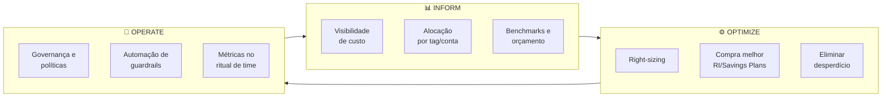
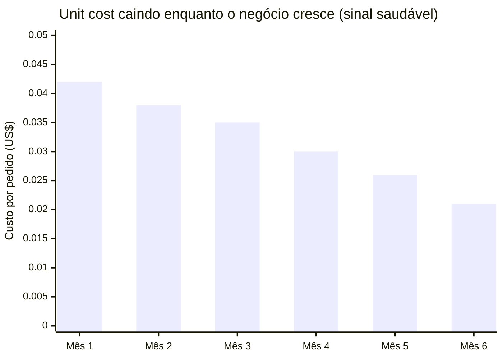
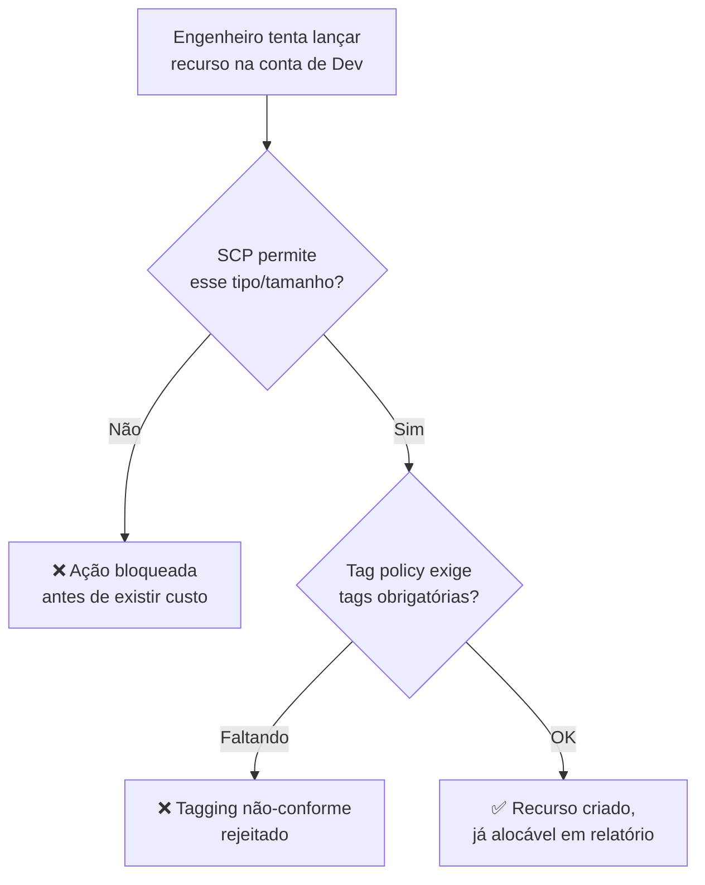
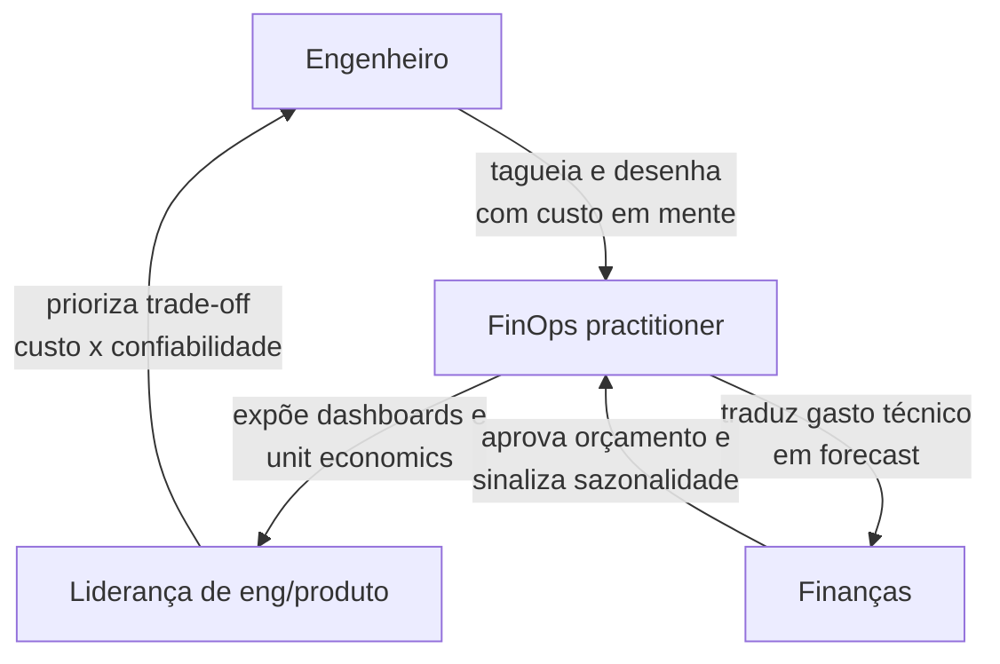

> [!abstract] TL;DR
> FinOps não é uma ferramenta nem um relatório mensal — é uma mudança de responsabilidade: engenharia passa a ser dona do próprio custo, com os mesmos dados e a mesma urgência com que é dona da própria disponibilidade. A disciplina roda em ciclo (**Inform → Optimize → Operate**, sempre se repetindo), mede o que importa em **unit economics** (custo por cliente, por pedido, por GB — não custo total absoluto) e trata custo como requisito não-funcional do design, não como surpresa de fim de mês. Governança (tags obrigatórias, guardrails, limites automáticos) é o que faz a cultura sobreviver ao crescimento do time. Na AWS a superfície de governança é rica e complexa; na DigitalOcean, o pricing simples e previsível reduz drasticamente a necessidade de aparato — e isso é uma vantagem real, não uma limitação.

## O dia em que a conta virou problema de todo mundo

Você já viu isso acontecer, mesmo que não trabalhasse em cloud: um projeto cresce, a fatura cresce junto, e em algum momento alguém de finanças manda uma planilha para a engenharia perguntando "o que é esse item de R$ 40 mil?". A resposta típica é constrangedora — ninguém sabe, porque ninguém *tinha* que saber. Custo era problema de outra área.

O Bloco 3 desta trilha te ensinou a desenhar arquiteturas de referência inteiras: VPC, subnets, load balancer, containers ou funções, banco gerenciado, cache, storage, CDN. Cada peça dessas tem um preço, e os galhos anteriores deste Bloco 4 já te mostraram de onde vêm os sustos — [[03-Dominios/Tecnologia/Cloud/19 - FinOps — a economia da cloud/01 - Por que a conta explodiu|por que a conta explode]], como os modelos de precificação escondem armadilhas, e como conseguir visibilidade sobre onde o dinheiro está indo. O que falta amarrar essas peças é a pergunta desta nota: **quem é dono disso, e como isso vira hábito em vez de crise trimestral?**

A resposta tem nome — **FinOps** (a contração de *Finance* + *DevOps*, cunhada e mantida pela [FinOps Foundation](https://www.finops.org/)) — e não é sobre planilha. É sobre mover a responsabilidade de custo para o mesmo lugar onde já está a responsabilidade de disponibilidade e de segurança: o time de engenharia que constrói e opera o sistema.

## O ciclo FinOps: Inform → Optimize → Operate

A FinOps Foundation formaliza a disciplina em um ciclo de três fases que se repete continuamente — não é um projeto com início, meio e fim, é uma rotina, como on-call ou como revisão de código.



**Inform** é a fase que os galhos anteriores já cobriram: você não pode gerenciar o que não vê. Tags, alocação de custo, dashboards, relatório de quem gasta o quê — isso já foi tratado em [[03-Dominios/Tecnologia/Cloud/19 - FinOps — a economia da cloud/03 - Visibilidade e alocação de custo|Visibilidade e alocação de custo]]. Sem essa fase, as outras duas são cegas: você não sabe o que otimizar, nem que política aplicar.

**Optimize** também já foi tratado — right-sizing, compra de capacidade reservada, eliminação de recursos ociosos — na nota sobre otimização de custo. É a fase mais "técnica" do ciclo, a que mais parece engenharia tradicional.

**Operate** é a fase que esta nota realmente aprofunda: transformar o que foi aprendido em Inform e o que foi corrigido em Optimize em **hábito institucionalizado** — políticas, automação, papéis, rituais. Sem Operate, você otimiza uma vez, comemora, e seis meses depois a conta voltou a explodir porque ninguém manteve a disciplina.

O ciclo nunca "termina". A cada sprint, a cada trimestre, você reentra em Inform com dados novos (a arquitetura mudou, o tráfego cresceu, um serviço novo apareceu) e o círculo gira de novo. É o mesmo raciocínio do ciclo de melhoria contínua que você já viu em observabilidade ou em segurança: não existe "pronto", existe "operando bem agora".

> [!info] Terminologia oficial (verificado 2026-07-24)
> O framework "Inform / Optimize / Operate" é a formulação canônica da FinOps Foundation (parte da Linux Foundation desde 2019) no seu *FinOps Framework*. A fundação também define seis princípios (times colaboram, decisões guiadas por valor de negócio, todos são donos do próprio uso de cloud, relatórios acessíveis e em tempo, o time central de FinOps impulsiona vantagens de escala, e aproveitar o modelo variável de custo da cloud). Fonte: finops.org/framework — confira a versão vigente, o framework é revisado periodicamente (a versão atual é a "FinOps Framework" 2024+, com adição de camadas de IA/ML).

> [!tip] Assista: The FinOps Framework
> **Canal:** Eddy Says Hi (#EddySaysHi) | **Duração:** ~6min | **Idioma:** EN
>
> Percorre as três fases na mesma ordem desta nota e reforça o ponto central: FinOps não é uma ferramenta, é "the social contract for how your company operates" — a cultura é o produto final, não o dashboard. Trecho de destaque [04:43]: *"First, you inform. This phase is (...) spending, you move on to optimize (...) operate. This is where you bake these"*
>
> 🎬 [Assistir no YouTube](https://www.youtube.com/watch?v=8Dz54waDj1Q)

## Modelo de maturidade: Crawl, Walk, Run

Nenhuma organização nasce em Operate. A FinOps Foundation descreve a progressão em três estágios — **Crawl, Walk, Run** — e o ponto importante é que maturidade não é sobre ter mais ferramenta, é sobre a disciplina virar reflexo em vez de esforço consciente.

| Estágio | Visibilidade (Inform) | Otimização (Optimize) | Governança (Operate) |
|---|---|---|---|
| **Crawl** | Fatura mensal revisada manualmente, alocação grosseira por conta | Ajustes reativos quando alguém percebe um gasto estranho | Nenhuma política automatizada; tudo depende de disciplina individual |
| **Walk** | Dashboards de custo por tag/serviço, revisão semanal ou quinzenal | Right-sizing programado, primeira rodada de RI/Savings Plans | Tags obrigatórias por convenção, alguns alertas de orçamento |
| **Run** | Unit economics em tempo quase real, anomaly detection automatizado | Otimização contínua integrada ao ciclo de deploy, forecast confiável | Guardrails automáticos (SCP, tag policy com enforcement), budget actions que bloqueiam gasto |

Times pequenos geralmente vivem em Crawl ou Walk — e isso não é um fracasso, é proporcional ao tamanho da conta e ao risco. O erro é tentar pular direto para o aparato de Run (SCPs elaboradas, dashboards sofisticados) antes de ter a disciplina de Crawl consolidada: governança sem visibilidade prévia vira bloqueio arbitrário que a engenharia aprende a contornar, não a respeitar.

> [!tip] Assista: Adotando FinOps
> **Canal:** Jornada FinOps | **Duração:** ~9min | **Idioma:** PT-BR
>
> Reforça, em português, que o objetivo não é ferramenta nem relatório — é construir uma cultura de responsabilidade, e que o ciclo Inform/Optimize/Operate precisa ser adaptado à maturidade e à cultura de cada empresa, não aplicado como receita de bolo. Trecho de destaque [05:45]: *"aquele modelo do Finops de informar, otimizar e operar não é uma receita de bolo, tem que adaptar pra realidade da sua empresa, pra maturidade, pra cultura"*
>
> 🎬 [Assistir no YouTube](https://www.youtube.com/watch?v=dLas0dHpKA0)

## Unit economics: a métrica que liga custo a valor

Aqui está o erro mais comum de quem começa em FinOps: olhar para o custo total da conta e tentar cortá-lo. Isso é como um restaurante cortar despesa de ingredientes sem olhar quantos pratos vende — pode estar economizando enquanto o negócio cresce, ou pode estar sangrando enquanto o negócio encolhe, e o número absoluto não te diz qual dos dois.

**Unit economics** resolve isso: em vez de "quanto gastamos em cloud este mês", a pergunta certa é "quanto custa entregar uma unidade de valor de negócio". Alguns exemplos de unidade, dependendo do seu produto:

| Tipo de negócio | Unidade de valor | Métrica de unit economics |
|---|---|---|
| SaaS B2B | Cliente ativo | Custo de infra por cliente/mês |
| E-commerce | Pedido processado | Custo de infra por pedido |
| Pipeline de dados | Volume processado | Custo por GB ingerido/transformado |
| API pública | Chamada de API | Custo por 1.000 requisições |
| Streaming de mídia | Hora assistida | Custo por hora de conteúdo entregue |

O cálculo em si é simples — o difícil é ter os dois lados da equação com a mesma granularidade temporal e a mesma fonte de verdade (o "numerador" vem do billing/Cost Explorer, o "denominador" vem do seu sistema de negócio, não da infra):

```
unit_cost = custo_total_do_periodo / unidades_de_negocio_no_periodo

exemplo:
  custo_total_mensal_infra = US$ 18.400
  pedidos_processados_no_mes = 920.000
  unit_cost_por_pedido = 18400 / 920000 = US$ 0,02 por pedido
```

O que essa métrica permite que o custo absoluto não permite: separar **crescimento saudável** de **vazamento de eficiência**. Se a receita cresce 40% e o custo de infra cresce 40% junto, você não ganhou nem perdeu eficiência — só cresceu no mesmo ritmo. O objetivo declarado do FinOps maduro é fazer o custo escalar **sub-linearmente** à receita: se o negócio dobra, o custo de infra deveria crescer bem menos que o dobro, porque economia de escala, cache mais eficiente, reserva de capacidade e amortização de custo fixo (o control plane de um cluster Kubernetes, por exemplo, não dobra de preço quando o tráfego dobra) começam a jogar a seu favor.



Sem essa métrica, um time pode reportar "reduzimos custo em 15%" enquanto na verdade a base de clientes caiu 25% — ou seja, ficou *menos* eficiente por cliente, só que ninguém percebeu porque olhou o número errado.

Antes de calcular o numerador, vale saber que a AWS oferece mais de uma definição de "custo" na mesma fatura — e escolher a errada distorce o unit cost. *Blended cost* mistura o preço pago por várias contas de uma organização em consolidated billing (útil para ver a média do grupo, ruim para responsabilizar uma conta específica); *unblended cost* é o custo real que aquela conta específica pagou, sem misturar com as outras; *amortized cost* espalha o custo de compromissos antecipados (como Reserved Instances pagas upfront) proporcionalmente ao longo do período de uso, em vez de jogar o custo inteiro no mês da compra. Para unit economics por cliente ou por time, **unblended** ou **amortized** costumam ser a escolha certa — blended esconde exatamente a granularidade que você precisa para saber quem gastou o quê.

Há uma armadilha adicional no numerador dessa conta: nem todo custo é atribuível a um cliente ou pedido específico. O control plane de um cluster Kubernetes, o custo fixo de um banco gerenciado multi-tenant, a licença de uma ferramenta de observabilidade — tudo isso é **custo compartilhado** (*shared cost*), que precisa ser ratado (dividido proporcionalmente) entre as unidades de negócio antes de entrar no unit cost. A prática mais comum é ratear por um critério de uso proporcional (por exemplo, CPU-hora consumida por tenant, ou número de requisições), documentado e estável — mudar o critério de rateio no meio do trimestre destrói a comparabilidade histórica da métrica.

## Custo como requisito não-funcional

Nos galhos de arquitetura você aprendeu que disponibilidade, latência e segurança são requisitos não-funcionais — coisas que o sistema precisa satisfazer independente da feature que está sendo construída, e que precisam entrar na conversa de design *antes* do código, não depois. Custo merece exatamente o mesmo tratamento, e a maioria dos times ainda não trata assim.

Na prática, isso significa perguntas concretas durante o design de uma feature, não só depois que ela está em produção e a fatura chegou:

- Esse endpoint novo vai gerar quantas chamadas por segundo, e cada chamada dispara quantas invocações de função ou queries de banco a jusante?
- Esse pipeline de dados vai mover quantos GB por dia entre regiões (lembrando do custo de egress que você já viu)?
- Esse serviço precisa mesmo de um banco gerenciado com read replica multi-AZ, ou o SLA real do produto tolera uma solução mais barata?
- Se esse recurso crescer 10x em seis meses, o custo cresce 10x junto, ou existe uma camada de cache/agregação que o segura?

Nenhuma dessas perguntas é sobre "gastar menos" — são sobre **desenhar com consciência de custo desde o primeiro rascunho**, do mesmo jeito que você desenha com consciência de disponibilidade desde o primeiro rascunho. O Well-Architected Framework formaliza isso no pilar de Cost Optimization (que este galho inteiro aprofunda), com um princípio de design chamado *"adote um modelo de consumo consciente"* — pagar pelo que usa, e desenhar para que o que se usa seja proporcional ao valor gerado.

## Caso prático: um time aplicando o ciclo pela primeira vez

Para tirar o ciclo do abstrato, acompanhe um cenário ilustrativo: um SaaS B2B de médio porte, rodando na AWS, com a fatura mensal subindo 12% ao mês há um trimestre — mais rápido que o crescimento de clientes pagantes (7% ao mês). Alguém finalmente pergunta "por quê?".

**Mês 1 — Inform.** O time habilita Cost Allocation Tags (que você já viu na nota de visibilidade) e descobre que 35% da fatura não tem tag de `team` — está em uma conta compartilhada de "infra" sem dono claro. Cost Explorer mostra que o maior item de crescimento não é compute, é um serviço gerenciado de banco de dados cuja instância foi dimensionada há um ano, para um volume de dados que já triplicou.

**Mês 2 — Optimize.** Right-sizing do banco (a instância estava superdimensionada em CPU, subdimensionada em IOPS — o padrão clássico de "escolher o tamanho errado da dimensão errada"). Compra de um Savings Plan de 1 ano para a camada de compute, que já era estável há seis meses. Resultado: -18% na fatura do mês seguinte.

**Mês 3 — Operate.** Aqui está o ponto que times imaturos pulam: sem essa fase, a otimização do mês 2 é um evento isolado, e a fatura volta a crescer 12% ao mês assim que o próximo serviço for lançado sem tag e sem revisão de tamanho. O time institucionaliza: tag policy com enforcement nas contas de produção, um budget na conta de dev com ação automática de negar instâncias grandes, e uma métrica de unit economics (custo por cliente ativo) reportada toda sexta-feira no ritual de engenharia — não escondida em uma planilha de finanças que só é aberta uma vez por trimestre.

O resultado prático, seis meses depois: a fatura ainda cresce, porque o negócio está crescendo — mas o **custo por cliente ativo** vem caindo mês a mês, porque a disciplina de Operate garante que todo recurso novo nasce tagueado, dimensionado com dado real e visível na métrica certa desde o primeiro dia. Esse é o sinal que separa uma organização em Crawl de uma organização em Walk: não é ausência de crescimento de custo, é presença de visibilidade sobre *por que* o custo cresce.

## Governança: da intenção ao guardrail automático

Cultura sem mecanismo é só boa vontade. Toda organização que já tentou "conscientizar a engenharia sobre custo" só com palestra e planilha sabe que isso não sobrevive à pressão de entregar uma feature no prazo. O que sobrevive é governança automatizada — regras que o sistema aplica sozinho, sem depender de disciplina manual de cada engenheiro.

Três camadas, da mais fraca (convenção) para a mais forte (bloqueio automático):

**1. Política documentada** — "todo recurso precisa ter as tags `team`, `env` e `cost-center`". Sozinha, essa regra é ignorada by default, porque nada impede alguém de esquecer.

**2. Enforcement automático de tag** — na AWS, *tag policies* do AWS Organizations permitem definir formato e valores aceitos para tags e, quando configuradas com enforcement, **bloqueiam operações de tagging não-conformes** em tipos de recurso especificados (confirmado na documentação oficial). Isso fecha o buraco mais comum de FinOps: recurso sem tag é recurso invisível para alocação de custo — ele aparece na fatura total, mas não aparece em nenhum relatório de "quem gastou". Na DigitalOcean, tags também existem e podem ser usadas para organizar e filtrar recursos, mas a plataforma não tem um mecanismo equivalente de enforcement organizacional obrigatório — a disciplina de tagueamento aqui é mais convenção de time do que trava de plataforma.

**3. Guardrail que nega a ação, não só a tag** — aqui entram as **Service Control Policies (SCPs)** do AWS Organizations, que você já viu em ação no [[03-Dominios/Tecnologia/Cloud/18 - Segurança na cloud a fundo/05 - Governança, auditoria e compliance|galho de segurança]] como mecanismo de guardrail geral. O mesmo mecanismo se aplica a custo: uma SCP anexada à conta de dev pode **negar** (não apenas alertar) o lançamento de instâncias acima de um determinado tamanho, ou negar regiões inteiras, ou negar serviços caros que não fazem sentido fora de produção. Vale reforçar um detalhe técnico confirmado na documentação da AWS: SCP nunca *concede* permissão — ela só define o teto do que é permitido; a permissão em si ainda precisa vir de uma policy IAM. E SCPs não afetam a conta de management da organização, só as contas-membro.



**4. Orçamento com ação automática** — o **AWS Budgets** permite ir além do alerta: você define um budget (mensal, por serviço, com meta fixa ou crescente) e configura *budget actions* — quando o gasto real ou o gasto **previsto** (forecast) ultrapassa um limiar (por exemplo, 80% do orçamento), a AWS pode disparar automaticamente uma ação, como aplicar uma IAM policy restritiva na conta ou parar instâncias específicas, sem esperar por intervenção humana (confirmado na documentação oficial da AWS). É a diferença entre "alguém recebe um e-mail e talvez leia" e "o sistema já reagiu". Vale registrar uma limitação documentada: o AWS Budgets atualiza os dados até três vezes por dia, com atraso típico de 8 a 12 horas em relação ao uso real — então a ação automática não é instantânea, é uma rede de segurança de curto prazo, não um circuit breaker de milissegundos.

```
# Exemplo conceitual de budget action (AWS Budgets)
# "se o gasto previsto do mês ultrapassar 80% do orçamento
#  da conta de Dev, aplicar policy que nega RunInstances
#  acima do tipo t3.medium"

budget: monthly-dev-account
  limit: US$ 2.000
  threshold: FORECASTED 80%
  action:
    type: IAM_POLICY
    policy: deny-large-instance-types
    approval: AUTOMATIC   # ou MANUAL, exigindo aprovação humana
```

Na DigitalOcean, o equivalente é bem mais simples: **billing alerts** por e-mail quando o gasto ultrapassa um valor configurado — não existe o conceito de ação automática (bloquear provisionamento, aplicar policy) disparada pelo próprio sistema de billing. De novo, a lente dupla se inverte: isso não é uma lacuna grave na DO, porque a superfície de custo é pequena o suficiente para um alerta simples já ser, na prática, suficiente.

> [!info] Verificar antes de operar (2026-07-24)
> A documentação de billing da DigitalOcean não estava acessível via fetch automatizado no momento da escrita desta nota. O comportamento de billing alerts descrito acima é conhecido publicamente como recurso da plataforma (alerta por e-mail configurável por valor de gasto), mas confirme a página vigente em `docs.digitalocean.com/platform/billing/` antes de desenhar um processo operacional em cima disso — plataformas menores mudam a superfície de billing com mais frequência que a AWS.

**Automação de cleanup** fecha o pacote de guardrails: rotinas agendadas (Lambda/EventBridge na AWS, um job simples num Droplet ou uma DigitalOcean Function na DO) que encontram e eliminam volumes órfãos, snapshots vencidos, load balancers sem target, IPs elásticos não associados — o tipo de desperdício que nenhuma política de tag pega, porque o recurso nem chega a ser "usado" por ninguém, só fica ali cobrando.

Há ainda uma camada que atua antes mesmo do budget: o **AWS Cost Anomaly Detection**, que usa modelos de machine learning para aprender o padrão normal de gasto (incluindo sazonalidade semanal ou mensal) e alertar quando o gasto foge desse padrão — sem exigir que alguém defina um limiar manual de antemão (confirmado na documentação oficial). Ele analisa o custo *net unblended* (custo líquido já com descontos aplicados) rodando cerca de três vezes ao dia, com atraso de até 24 horas, e um serviço novo precisa de 10 dias de histórico antes de gerar detecções confiáveis. É complementar ao Budget, não substituto: o Budget pega o "eu sei o limite e quero ser avisado quando passar"; o Anomaly Detection pega o "eu não sabia que isso ia acontecer, mas foi diferente do normal". Vale registrar uma exceção documentada: ele não monitora produtos de terceiros vendidos via AWS Marketplace (por exemplo, modelos de terceiros no Amazon Bedrock) — para esses, o caminho continua sendo AWS Budgets com filtro por *billing entity*.

Na DigitalOcean, esse aparato inteiro de governança organizacional (SCP, tag policy com enforcement, guardrails multi-conta) simplesmente não existe com a mesma profundidade — e é aqui que a lente dupla se inverte pela primeira vez nesta trilha. Não é que a DO seja "pior" em FinOps: é que a **superfície de risco é menor**. Preços flat por Droplet, sem centenas de dimensões de tarifação, sem NAT Gateway cobrando por GB, sem dezenas de tipos de instância — significa que há muito menos onde a conta pode escapar do controle, e portanto muito menos necessidade de um aparato de governança pesado para conter esse escape. Times pequenos ganham real vantagem prática nisso: a disciplina FinOps na DO tende a caber em uma planilha e uma revisão mensal, enquanto na AWS ela frequentemente exige uma prática dedicada.

## Tradução de nomes entre provedores

Os conceitos de governança FinOps existem nos quatro grandes provedores, com nomes diferentes. Esta tabela é só um mapa de vocabulário — não um roteiro de implementação (Azure e GCP ficam fora do hands-on desta trilha):

| Conceito | AWS | DigitalOcean | Azure | GCP |
|---|---|---|---|---|
| Orçamento com alerta | AWS Budgets | Billing alerts | Azure Cost Management Budgets | Budgets & alerts (Cloud Billing) |
| Guardrail que nega ação | Service Control Policies (SCP) | *(sem equivalente direto)* | Azure Policy | Organization Policy Service |
| Enforcement de tags | Tag policies (Organizations) | *(sem equivalente direto)* | Azure Policy (tag rules) | Organization Policy (label constraints) |
| Detecção de anomalia de custo | Cost Anomaly Detection | *(sem equivalente direto)* | Cost Management anomaly alerts | Cloud Billing anomaly detection |
| Relatório de alocação | Cost Explorer + Cost & Usage Report | Cloud usage/billing dashboard | Cost Management + Power BI connector | Cloud Billing reports + BigQuery export |

## Os papéis: quem faz o quê

FinOps maduro não é um departamento isolado — é uma prática que atravessa três grupos, cada um com uma pergunta diferente:

| Papel | Pergunta que faz | Contribuição |
|---|---|---|
| Engenheiro/time de produto | "Meu design gera custo proporcional ao valor?" | Decide arquitetura, aplica right-sizing, tagueia o que cria |
| FinOps practitioner (ou squad central) | "Onde está o desperdício, e que política resolve sem travar entrega?" | Mantém dashboards, define políticas de tag, negocia RI/Savings Plans, reporta unit economics |
| Finanças | "O gasto está dentro do orçamento e do forecast?" | Aprova budget, entende sazonalidade, traduz gasto técnico em linguagem de negócio |
| Liderança de engenharia/produto | "Estamos otimizando pela coisa certa?" | Prioriza entre performance/confiabilidade/custo quando eles competem, dá o mandato para os guardrails serem levados a sério |

O ponto central do princípio "todos são donos do próprio uso de cloud" (um dos seis princípios oficiais da FinOps Foundation) é que **nenhum desses papéis substitui o engenheiro**. O practitioner de FinOps não vai revisar cada Terraform apply — ele constrói o sistema de visibilidade e os guardrails para que o engenheiro tome a decisão certa no momento em que está desenhando, sem precisar de aprovação externa a cada linha de infraestrutura.



Times pequenos costumam não ter um practitioner dedicado — a função é acumulada por um tech lead ou por SRE, em part-time. Isso é aceitável em Crawl/Walk; em Run, o volume de decisão geralmente justifica dedicação, ao menos parcial.

## Armadilhas comuns

> [!warning] Otimizar sem medir primeiro
> Migrar tudo para instâncias reservadas ou aplicar right-sizing agressivo sem antes ter uma linha de base confiável de uso é apostar às cegas — você pode acabar comprando reserva para uma carga que vai mudar de forma no mês seguinte, ou reduzindo capacidade que na verdade tinha um pico legítimo que você não enxergou. Inform sempre vem antes de Optimize, nessa ordem, não em paralelo.

> [!warning] Cortar o que quebra produção
> A pressão de "reduzir custo 20% este trimestre" facilmente vira corte de réplica, de multi-AZ ou de retenção de backup sem avaliar o risco associado. Custo nunca é a única variável — ele compete com disponibilidade e com segurança, e cortar guardrails de resiliência para economizar é transferir o custo de infraestrutura para o custo (bem maior) de um incidente.

> [!warning] Ignorar egress no cálculo de unit economics
> Um pipeline que parece barato "por GB processado" pode estar escondendo um custo de transferência entre regiões ou para a internet que dobra a conta real — um ponto que a nota anterior sobre precificação já detalhou. Se o unit cost não inclui egress, ele está subestimado, e a decisão de arquitetura baseada nele vai estar errada.

> [!warning] Não taguear é custo invisível, não custo zero
> Recurso sem tag continua na fatura — ele só não aparece em nenhum relatório de alocação. Isso não reduz o gasto, apenas impede que alguém saiba de quem cobrar a explicação. Times que relaxam a disciplina de tagging "porque dá trabalho" só estão adiando a pergunta desconfortável de finanças para um mês em que será mais difícil reconstruir o histórico.

> [!warning] Pular direto para governança pesada sem maturidade de visibilidade
> Implantar SCPs restritivas ou budget actions automáticas antes de o time entender seus próprios padrões de uso (estágio Crawl) tende a gerar bloqueios que ninguém previu — um deploy legítimo de fim de sprint negado por uma policy criada sem considerar picos sazonais. O resultado é engenharia pedindo exceção toda semana, o que corrói a autoridade do próprio guardrail.

## O que vem a seguir

As quatro notas anteriores deste galho te deram o vocabulário (por que a conta explode), os modelos de precificação, a visibilidade e as técnicas de otimização. Esta nota amarrou tudo isso em disciplina contínua — o ciclo, a métrica certa, a governança que faz a cultura pegar. A próxima nota do galho é o capstone: pega a arquitetura de referência construída ao longo do Bloco 3 desta trilha e aplica FinOps de ponta a ponta nela — visibilidade, otimização e governança sobre um caso concreto, fechando o Bloco 4 e, com ele, o domínio inteiro de Cloud.

## Fontes

- FinOps Foundation. "FinOps Framework." https://www.finops.org/framework/
- FinOps Foundation. "What is FinOps?" https://www.finops.org/introduction/what-is-finops/
- AWS. "Service control policies (SCPs)." https://docs.aws.amazon.com/organizations/latest/userguide/orgs_manage_policies_scps.html
- AWS. "Tag policies." https://docs.aws.amazon.com/organizations/latest/userguide/orgs_manage_policies_tag-policies.html
- AWS. "Managing your costs with AWS Budgets." https://docs.aws.amazon.com/cost-management/latest/userguide/budgets-managing-costs.html
- AWS. "Detecting unusual spend with AWS Cost Anomaly Detection." https://docs.aws.amazon.com/cost-management/latest/userguide/manage-ad.html
- AWS Well-Architected Framework. "Cost Optimization Pillar." https://docs.aws.amazon.com/wellarchitected/latest/cost-optimization-pillar/welcome.html
- DigitalOcean. "How to Tag Resources." https://docs.digitalocean.com/platform/teams/
