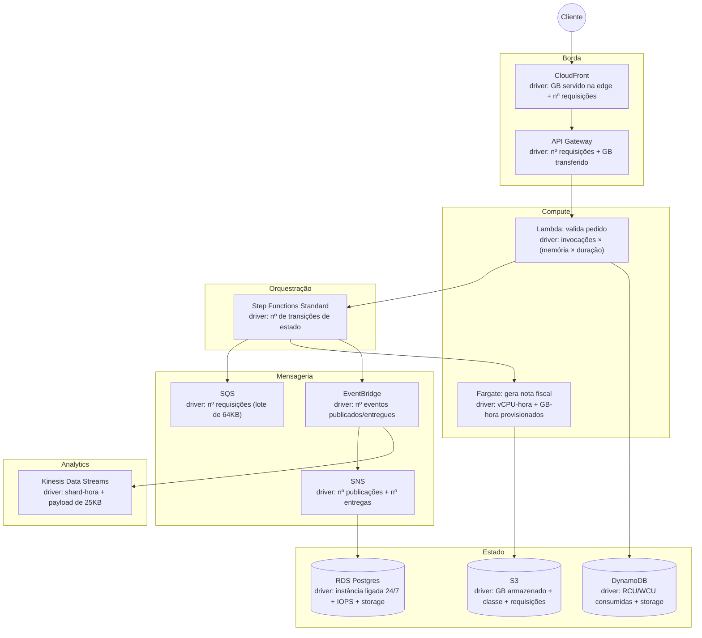
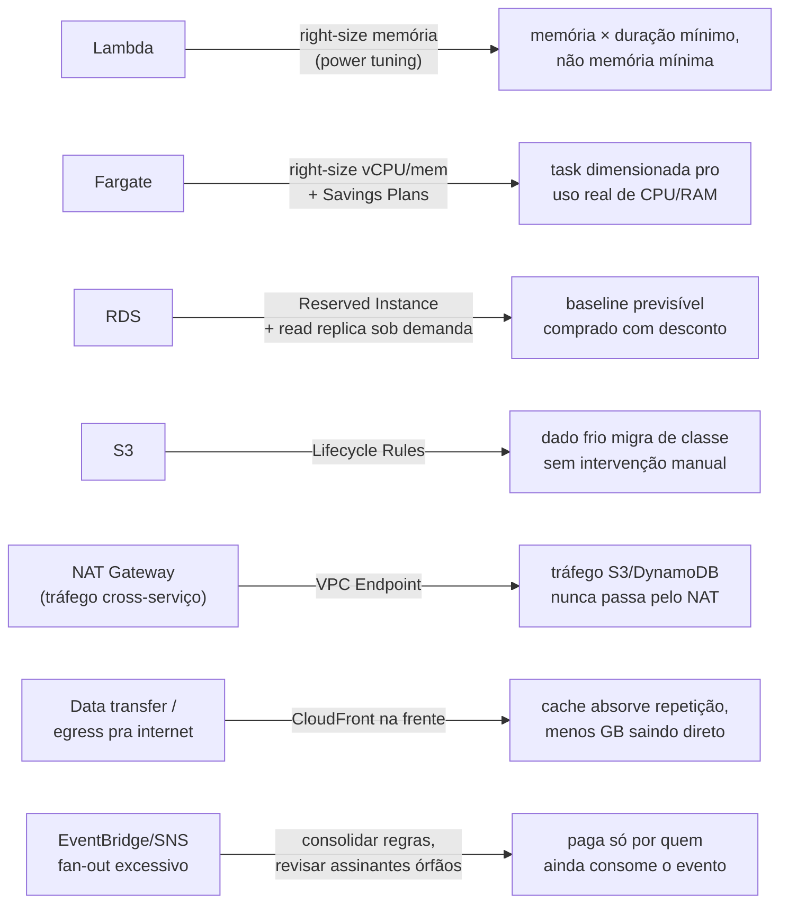

> [!abstract] TL;DR
> A [[03-Dominios/Tecnologia/Cloud/15 - Arquiteturas serverless e event-driven/06 - Arquitetura serverless de referência (capstone do Bloco 3)|arquitetura serverless de referência]] do Bloco 3 tem uma dúzia de peças — cada uma com seu próprio driver de custo, e nenhuma delas cobrando pelo mesmo motivo que a vizinha. Este capstone fecha o galho de FinOps aplicando as lentes das cinco notas anteriores nessa arquitetura específica: onde o dinheiro vai peça por peça, qual alavanca puxa cada uma, e por que otimizar demais quebra o próprio sistema que você está tentando baratear. A escolha "serverless" do Bloco 3 já era, disfarçada, uma decisão de custo — e a tensão que fecha este galho é a próxima: custo e resiliência empurram em direções opostas, e o Bloco 4 termina exatamente nesse cabo de guerra.

## O problema: o diagrama está pronto, a fatura não veio junto

Volte ao diagrama do capstone do Bloco 3: CloudFront na borda, API Gateway recebendo o pedido, uma Lambda validando em milissegundos, um Step Functions orquestrando cobrança e nota fiscal, uma Fargate task gerando o PDF, EventBridge e SNS espalhando o fato "pagamento aprovado", DynamoDB e RDS guardando estado, Kinesis alimentando o data lake. Ele responde muito bem à pergunta "isso atende o caso de negócio?". Ele não responde a outra pergunta, igualmente sênior: **quanto custa rodar isso, e o que acontece com a fatura quando o tráfego triplica numa sexta de liquidação?**

A resposta errada de quem nunca praticou FinOps é olhar pra doze serviços diferentes e pensar "doze contas pra somar". A resposta certa é perceber que cada peça já foi estudada nas cinco notas anteriores deste galho — o problema aqui não é aprender FinOps de novo, é *aplicá-lo* numa topologia real, peça por peça, com a disciplina da escada de otimização (nota 04) e a visibilidade por tag (nota 03) já rodando desde o dia 1.

## Onde o dinheiro vai: a fatura ilustrativa peça por peça

Antes de otimizar qualquer coisa, é preciso saber o que está sendo cobrado e por quê. Cada peça da arquitetura de referência tem um driver de custo dominante — a variável que, se ela dobrar, a fatura daquela peça dobra junto.

> [!info] Ilustrativo, não cotação — verificado 2026-07-24 via aws.amazon.com/lambda/pricing, aws.amazon.com/fargate/pricing, aws.amazon.com/eventbridge/pricing, aws.amazon.com/dynamodb/pricing/on-demand
> Números reais da AWS, us-east-1, standard tier x86: **Lambda** — $0,20 por milhão de requisições + $0,0000166667 por GB-segundo (free tier: 1M requisições e 400.000 GB-segundos/mês). **Fargate** — cerca de $0,0404/vCPU-hora + $0,00444/GB-hora (Linux/x86, cobrança por segundo com mínimo de 1 minuto). **EventBridge** (bus custom) — $1,00 por milhão de eventos ingeridos e $1,00 por milhão de eventos entregues a outro bus na mesma conta. **DynamoDB on-demand** — $0,625 por milhão de unidades de escrita e $0,125 por milhão de unidades de leitura. Estes são os números que compõem a fatura ilustrativa abaixo — o valor final de qualquer arquitetura real depende inteiramente do volume, não da contagem de componentes.

| Peça | Driver dominante | Por que ele domina |
|---|---|---|
| CloudFront | GB servido + nº de requisições na edge | Cache absorve requisições repetidas; o que sobra é o que a origem não conseguiu evitar |
| API Gateway | nº requisições + GB de dados transferidos | Cobra por chamada, não por tempo de processamento — a Lambda por trás é quem paga o tempo |
| Lambda | invocações × (memória alocada × duração) | Memória e CPU são acoplados; sub-alocar memória pode *aumentar* o custo (ver nota 04 deste galho) |
| Fargate | vCPU-hora + GB-hora provisionados | Cobra pelo que foi *reservado* na task, rodando ou não — diferente de Lambda, que só cobra invocação |
| Step Functions (Standard) | nº de transições de estado | Um workflow com muitos passos ou muito retry acumula transições silenciosamente |
| EventBridge | nº eventos publicados/entregues (bloco 64KB) | Barato por evento, mas um fan-out de regras multiplica "entregue" por assinante |
| SQS / SNS | nº requisições/publicações + nº entregas | Também cobrado em blocos de 64KB — payloads grandes custam proporcionalmente mais |
| DynamoDB (on-demand) | RCU/WCU consumidas + storage | Escrita custa 5x mais que leitura eventualmente consistente por unidade — hot partition dispara WCU |
| RDS | instância ligada 24/7 + IOPS + storage + backup | O único item da lista que cobra por *tempo ligado*, não por uso — é o mais parecido com "sempre-ligado" clássico |
| S3 | GB armazenado × classe + requisições | Classe errada (Standard pra dado frio) é o desperdício mais comum e mais fácil de corrigir (lifecycle, nota 04) |
| Kinesis Data Streams | shard-hora provisionada + payload de 25KB | Modo provisioned cobra pelo shard existir, não pelo volume de dados que passa por ele |

Repare no padrão: a maioria das peças serverless cobra por *uso* (Lambda, EventBridge, SQS/SNS, DynamoDB on-demand), mas duas peças — RDS e Kinesis provisioned — cobram por *capacidade reservada*, existindo ou não tráfego. Isso não é acidente de design da AWS: é a mesma tensão pagamento-por-uso-vs-capacidade-reservada da nota de Modelos de precificação, só que agora espalhada dentro de uma única arquitetura, peça por peça.

> [!tip] Assista: AWS re:Invent 2023 — Optimize costs by going serverless (IMP212)
> **Canal:** AWS Events | **Duração:** ~19min | **Idioma:** EN
>
> Um talk oficial de re:Invent que percorre exatamente a mesma pilha desta arquitetura — Lambda, Fargate, API Gateway, Step Functions — peça por peça, mostrando de onde vem o custo em cada uma antes de otimizar qualquer coisa. Trecho de destaque [05:08]: *"compute with Lambda serous storage with"*
>
> 🎬 [Assistir no YouTube](https://www.youtube.com/watch?v=pjzluTJVEQM)

## A árvore de otimização: uma alavanca por peça

Sabendo onde o dinheiro vai, a pergunta seguinte é qual alavanca da nota 04 deste galho se aplica a cada peça. Não é a mesma alavanca em todo lugar — puxar right-sizing numa peça que cobra por capacidade reservada (RDS) resolve; puxar a mesma alavanca numa peça que cobra por uso (Lambda) é a alavanca errada.

Quatro delas já apareceram, espalhadas, em galhos anteriores — o NAT Gateway no galho 7 (Rede), o Fargate no galho 12, a Lambda no galho 11, o Shield/CloudFront no galho 10. A disciplina de FinOps não inventa uma alavanca nova aqui: ela é o que *amarra* essas alavancas dispersas numa única prática, aplicada de propósito, e não descoberta por acaso quando a fatura já veio alta.

Duas notas sobre a árvore acima merecem destaque porque são específicas desta arquitetura, não genéricas:

**Step Functions Standard vs Express.** O capstone do Bloco 3 já registrou a diferença de comportamento (exatamente-uma-vez vs pelo-menos-uma-vez). Ela também é uma alavanca de custo: Standard cobra por transição de estado, Express cobra por execução e duração. Um workflow de "Processar Pedido" com poucas execuções por segundo mas necessidade de auditoria completa é mais barato em Standard; o mesmo padrão de orquestração aplicado a um stream de alto volume (enriquecer cada evento do Kinesis) explode em custo de transições se rodar em Standard — é Express que foi desenhado pra esse volume, e cobra por ele de forma mais barata.

**EventBridge e o fan-out invisível.** Cada regra nova que um time cria pra assinar `PagamentoAprovado` é, ao mesmo tempo, um ganho de desacoplamento (nenhum código do pedido muda) e uma linha a mais na fatura de entregas. Uma auditoria trimestral de regras — igual à varredura de recursos órfãos do degrau 1 da nota 04 — costuma achar assinantes que ninguém mais consome, herdados de um experimento antigo, ainda sendo entregues e cobrados.

> [!tip] Assista: Optimize AWS Costs — Developer Tools and Techniques (DEV318)
> **Canal:** AWS Events | **Duração:** ~45min | **Idioma:** EN
>
> Traz um caso real de otimização de Lambda migrando pra Graviton — a mesma lógica de "puxar a alavanca certa pra cada peça" que a árvore de otimização desta nota descreve, só que com números de antes/depois em produção. Trecho de destaque [19:00]: *"lambda was to change to graviton"*
>
> 🎬 [Assistir no YouTube](https://www.youtube.com/watch?v=vvdjlAHojY8)

## O trade-off: otimizar demais quebra coisa

Aqui mora a armadilha mais cara desta nota inteira. Cada alavanca da árvore acima tem um preço em outra dimensão — performance, resiliência ou simplicidade — e ignorar isso transforma economia em incidente.

- **Right-sizing agressivo em Lambda** pode empurrar a memória alocada abaixo do ponto ótimo real. A nota 04 já mostrou que memória e CPU são acopladas — cortar memória "pra economizar" pode *aumentar* a duração e, com ela, o `memória × duração` que a AWS cobra. Otimizado errado, o corte custa mais.
- **Consolidar Fargate tasks pra economizar vCPU-hora** reduz paralelismo — se a geração de nota fiscal já estava perto do teto de CPU, empacotar mais trabalho na mesma task degrada a latência que o cliente vê, trocando dólares por segundos de espera.
- **Reserved Instance no RDS** trava o compromisso num tamanho de instância por 1-3 anos. Se o padrão de tráfego mudar (mais escrita, menos leitura, ou vice-versa) antes do contrato acabar, você paga por capacidade que não serve mais o padrão real — a mesma armadilha nomeada como warning na nota 04: nunca comprar capacidade reservada antes de confirmar que o desperdício já foi eliminado.
- **Cortar Multi-AZ do RDS "porque cross-AZ custa"** é o exemplo mais perigoso desta lista: elimina o custo de replicação síncrona entre zonas, mas também elimina o failover automático que a Alta Disponibilidade do galho 9 e do galho 20 dependem — trocando uma linha da fatura por um ponto único de falha em produção.
- **Reduzir shards do Kinesis pra baratear** sem confirmar o volume de escrita real derruba throughput — eventos começam a ser rejeitados (`ProvisionedThroughputExceededException`) exatamente na hora de pico, quando o pipeline de analytics mais precisa estar de pé.

> [!warning] A régua certa não é "o mais barato", é "o mais barato que ainda cumpre o SLA"
> Toda alavanca desta árvore tem um ponto além do qual ela para de ser otimização e vira degradação disfarçada de economia. FinOps maduro (nota 05 deste galho) trata isso como decisão de negócio compartilhada entre Engenharia e Finanças — nunca como corte unilateral decidido só pelo tamanho da fatura.

> [!tip] Assista: The AWS Well-Architected Framework — Reliability, Performance, Cost & Sustainability Pillars
> **Canal:** AWS Explainers | **Duração:** ~8min | **Idioma:** EN
>
> Nomeia diretamente o trade-off que fecha esta seção — custo contra confiabilidade — como uma tensão estrutural do Well-Architected Framework, não uma armadilha exclusiva desta arquitetura. Trecho de destaque [06:06]: *"trade-off you will always face in the (...) cloud. Cost versus reliability"*
>
> 🎬 [Assistir no YouTube](https://www.youtube.com/watch?v=mSZumXun0fA)

## Serverless vs sempre-ligado: a decisão de arquitetura já era uma decisão de custo

Vale reler o Bloco 3 com os olhos do FinOps: a escolha entre Lambda/Fargate serverless e uma frota EC2 sempre-ligada, feita lá atrás nos galhos 11 e 12, não foi só uma decisão técnica — foi a primeira e maior alavanca de custo da arquitetura inteira, tomada antes mesmo de qualquer degrau da escada de otimização.

Pagamento-por-uso (Lambda, Fargate sob demanda, DynamoDB on-demand) é economicamente superior quando a carga é intermitente ou imprevisível: não existe hora ociosa sendo cobrada. Capacidade reservada (RDS, EC2 com Reserved Instance) é economicamente superior quando a carga é constante e alta: o desconto de comprometimento de longo prazo bate o preço por invocação. A arquitetura de referência do Bloco 3 mistura os dois modelos de propósito — Lambda e EventBridge pagam por uso porque o tráfego de pedidos varia; RDS fica sempre ligado porque o catálogo de produtos é consultado o tempo todo, inclusive de madrugada, ainda que em volume baixo.

Isso é o motivo pelo qual "serverless é sempre mais barato" é um mito perigoso: é mais barato *para o perfil de carga certo*. A mesma Lambda que economiza numa API de tráfego intermitente custaria mais, rodando o tempo inteiro em alto volume constante, do que uma instância reservada equivalente — o cálculo se inverte, e a arquitetura de referência já fez essa escolha peça por peça, não como regra geral.

## Anti-padrões de custo na arquitetura

Quatro erros recorrentes, específicos de uma arquitetura deste porte, que a disciplina das notas anteriores já nomeou de forma dispersa — aqui reunidos no contexto da topologia inteira:

> [!warning] Over-provisioning "pra garantir"
> Fargate tasks dimensionadas no dobro do necessário "porque a Black Friday pode vir" — sem autoscaling configurado para absorver o pico e voltar ao normal depois. O resultado é pagar o pico 365 dias por ano em vez de só nos dias em que ele acontece.

> [!warning] Egress descontrolado entre peças
> Um pipeline que lê de S3 e escreve em outro bucket, ou uma Lambda numa VPC chamando um serviço AWS sem VPC Endpoint, empurra tráfego pelo NAT Gateway (nota 04 deste galho) sem que ninguém perceba — o vilão invisível reaparece dentro da própria arquitetura de referência, não só entre ela e a internet.

> [!warning] Logs infinitos sem lifecycle
> CloudWatch Logs sem política de retenção acumula, por padrão, indefinidamente. Uma arquitetura com uma dúzia de Lambdas e uma Fargate task gerando logs verbosos sem TTL configurado transforma observabilidade (galho 17) em uma fatura de storage crescente e silenciosa — o mesmo problema do S3 sem lifecycle, só que em outro serviço.

> [!warning] Ambientes de staging esquecidos ligados
> Uma cópia inteira da arquitetura de referência — Step Functions, EventBridge, RDS, tudo — provisionada pra um teste de carga e nunca desmontada depois continua cobrando RDS 24/7 e Kinesis por shard-hora, exatamente o desperdício puro do degrau 1 da nota 04, só que numa escala de "arquitetura inteira" em vez de "uma instância órfã".

## Lente dupla: a mesma arquitetura, dois modelos de fatura

Aqui a lente dupla deste galho se inverte de vez, e vale fechar com ela nomeada com honestidade nos dois sentidos.

Na AWS, a arquitetura de referência inteira — API Gateway, Lambda, Step Functions, EventBridge, Fargate, DynamoDB, RDS, S3, Kinesis — tem uma escada de otimização rica: Compute Optimizer, Savings Plans, VPC Endpoints, S3 Lifecycle, tudo coberto na nota 04. Mas essa mesma riqueza é uma fatura com uma dúzia de dimensões de cobrança diferentes, cada uma com sua própria unidade (GB-segundo, vCPU-hora, transição de estado, RCU/WCU, shard-hora) — prever o custo total antes de rodar exige montar a conta peça por peça, e errar uma peça é comum.

Na DigitalOcean, a mesma topologia não existe ponta a ponta com paridade completa (a tabela de decisão do capstone do Bloco 3 já mostrou onde faltam peças — Step Functions e EventBridge, principalmente). Mas o que existe cobra de um jeito estruturalmente mais simples de prever: App Platform e Functions com preço por unidade de recurso e por invocação, Managed Databases com preço fixo por plano, Spaces com uma cota inclusa e excedente a taxa flat. Não é que a DO seja "mais barata" em todo cenário — é que o *risco de erro de estimativa* é menor, porque há menos dimensões de cobrança pra errar.

| Critério | AWS | DigitalOcean |
|---|---|---|
| Nº de dimensões de cobrança na arquitetura inteira | ~12 (uma por serviço, unidades diferentes) | ~4-5 (preço por plano/invocação/GB, mais uniforme) |
| Previsibilidade de fatura antes de rodar | Baixa sem ferramenta de estimativa (Pricing Calculator) | Alta — soma de planos fixos é calculável de cabeça |
| Teto de otimização possível | Alto (dezenas de alavancas, nota 04) | Baixo — chega ao teto de otimização mais cedo |
| Time pequeno sem cultura de FinOps madura | Risco real de desperdício por complexidade não observada | Risco menor — pricing simples elimina parte da superfície de erro |
| Time grande que já otimizou tudo que dava | Ainda tem alavancas pra espremer | Menos alavancas restantes pra continuar barateando |

A escolha entre os dois não é "qual é mais barato" — é "qual modelo de incerteza sua organização prefere carregar": a AWS troca previsibilidade por profundidade de otimização; a DigitalOcean troca profundidade por previsibilidade desde o primeiro dia. Um time que ainda não tem a disciplina de FinOps das cinco notas anteriores deste galho normalmente sai ganhando com a segunda troca — a otimização mais barata é a que você não precisa fazer porque a arquitetura não deixou espaço pra desperdício em primeiro lugar.

## O que vem a seguir

Este capstone fecha o galho de FinOps, mas deixa uma tensão em aberto de propósito: quase toda alavanca de resiliência desta arquitetura — Multi-AZ no RDS, réplicas cross-region, múltiplas zonas de disponibilidade para o compute — custa dinheiro, e custa mais quanto mais resiliente o desenho fica. O próximo galho, sobre resiliência e continuidade, encara essa tensão de frente: [[03-Dominios/Tecnologia/Cloud/20 - Resiliência e continuidade/04 - Multi-region a fundo|multi-region]] pode dobrar a fatura de infraestrutura, e a pergunta que fecha o Bloco 4 é a mesma que fecha esta nota, só que invertida — não "quanto custa otimizar", mas "quanto vale a pena pagar por sobreviver a uma falha que talvez nunca aconteça". FinOps e resiliência não são inimigos, mas empurram para lados opostos do mesmo orçamento, e um arquiteto sênior precisa decidir os dois ao mesmo tempo, não um depois do outro.

## Fontes

- [AWS Lambda Pricing](https://aws.amazon.com/lambda/pricing/)
- [AWS Fargate Pricing](https://aws.amazon.com/fargate/pricing/)
- [Amazon EventBridge Pricing](https://aws.amazon.com/eventbridge/pricing/)
- [Amazon DynamoDB Pricing — On-Demand](https://aws.amazon.com/dynamodb/pricing/on-demand/)
- [Amazon VPC Pricing (NAT Gateway, VPC Endpoints)](https://aws.amazon.com/vpc/pricing/)
- [AWS Step Functions — Standard vs Express workflows](https://docs.aws.amazon.com/step-functions/latest/dg/sfn-express-vs-standard.html)
- [DigitalOcean App Platform Pricing](https://docs.digitalocean.com/products/app-platform/details/pricing/)
- [DigitalOcean Managed Databases Pricing](https://docs.digitalocean.com/products/databases/pricing/)
- [DigitalOcean Spaces Pricing](https://docs.digitalocean.com/products/spaces/details/pricing/)
