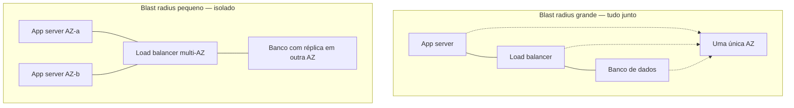
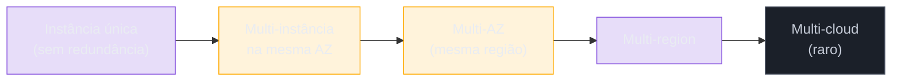
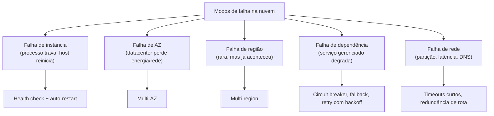

> [!abstract] TL;DR
> Na nuvem, falha não é hipótese — é estatística. Com milhares de discos, servidores e cabos de rede, algo vai quebrar hoje, e resiliência é a disciplina de projetar pra que essa quebra não vire um incidente que acorda você às 3h da manhã. O conceito central é **blast radius**: quanto menor o raio de uma falha, menos ela dói. Os provedores respondem com camadas de redundância — instância → zona de disponibilidade → região → (raramente) outro provedor — cada uma mais cara e mais resiliente que a anterior. E "disponível" não é binário: é uma escala de noves (99.9%, 99.99%, 99.999%) onde cada nove a mais custa desproporcionalmente mais caro.

## Tudo falha, o tempo todo

Em 2008, Werner Vogels — CTO da Amazon — resumiu a filosofia de engenharia que sustenta a AWS numa frase que virou princípio de design: *"everything fails, all the time"*. Não é pessimismo. É aritmética.

Pense num datacenter com dezenas de milhares de discos rígidos, servidores, switches e cabos. Cada componente individual tem uma taxa de falha baixíssima — digamos, um disco falha em média a cada alguns anos. Mas multiplique essa probabilidade minúscula por dezenas de milhares de componentes rodando simultaneamente, 24 horas por dia, e o que era "improvável" vira "estatisticamente certo, todo santo dia". Alguma coisa, em algum lugar da infraestrutura de um grande provedor, está falhando agora mesmo, enquanto você lê este parágrafo.

A pergunta que separa quem projeta para produção de quem projeta "no feliz" não é *"e se isso falhar?"*. É: *"quando isso falhar — porque vai —, o que acontece com o meu sistema?"*.

Esse é o pivô deste galho. Você já viu multi-AZ e Auto Scaling nos galhos de [[03-Dominios/Tecnologia/Cloud/06 - Compute II — elasticidade e balanceamento/index|Compute II]] como mecanismo de elasticidade. Agora a lente muda: a mesma redundância que absorve pico de tráfego também é a primeira linha de defesa contra falha. Este galho fecha o Bloco 4 da trilha Cloud tratando resiliência como disciplina — não um recurso que você liga, mas um conjunto de decisões de arquitetura, cada uma com um preço.

## Blast radius: o raio da explosão

Todo engenheiro de infraestrutura acaba aprendendo o termo **blast radius** (raio de impacto) — emprestado, sem ironia nenhuma, do vocabulário de explosivos. A pergunta que ele força é simples: *quando isso aqui falhar, o que mais falha junto?*

Uma instância EC2 travou. Só ela caiu, ou o balanceador de carga na frente dela também caiu porque rodava na mesma máquina? A zona de disponibilidade inteira perdeu energia. Isso derrubou só os servidores web, ou também o banco de dados primário que não tinha réplica em outro lugar?

Reduzir o blast radius é o fio condutor de tudo que vem depois neste galho: isolar falhas para que elas fiquem pequenas, contidas, e — o objetivo final — invisíveis para o usuário final. Um sistema resiliente não é um sistema que nunca falha. É um sistema onde a falha de uma peça pequena nunca vira a falha do todo.



Se a AZ do lado esquerdo cair, o sistema inteiro cai junto — blast radius = 100% da aplicação. Do lado direito, a perda de uma AZ tira metade da capacidade de compute, mas o balanceador redireciona tráfego pra AZ sobrevivente e o banco segue respondendo pela réplica. Blast radius contido.

> [!tip] Assista: Why Your Systems Fail — Understanding and Eliminating Single Points of Failure
> **Canal:** CyberCraft Lab | **Duração:** ~6min | **Idioma:** EN
>
> Narra apagões reais (kernel corrompido, load balancer mal configurado) pra mostrar como uma ferramenta desenhada pra *distribuir* risco vira, por um erro de configuração, o próprio ponto único de falha — o mesmo raciocínio de blast radius desta seção, só que com exemplos concretos de como ele se materializa. Trecho de destaque [3:36]: *"turns the very tool meant to distribute risk into a single point of failure"*
>
> 🎬 [Assistir no YouTube](https://www.youtube.com/watch?v=CNfKW5LcjYU)

## Os níveis de redundância

Resiliência na nuvem se constrói em camadas concêntricas, cada uma protegendo contra um tipo de falha maior — e cada uma custando mais caro que a anterior.



**Instância única → Multi-instância na mesma AZ.** O primeiro degrau de todos, e o mais barato: ter duas ou mais cópias do mesmo servidor, mesmo que dentro do mesmo datacenter. Já resolve o failure mode mais comum — o processo trava, o host reinicia, o disco corrompe — mas não protege contra nada que afete o datacenter inteiro. É melhor que nada, mas é o degrau mais frágil da escada.

**Multi-instância → Multi-AZ.** O salto que de fato importa: distribuir réplicas da mesma aplicação por duas ou mais Availability Zones dentro da mesma região. Uma AZ, segundo a própria AWS, é "um ou mais datacenters discretos com energia, rede e conectividade redundantes", fisicamente separados das outras AZs da região por uma distância significativa (dezenas de km) mas ainda dentro de ~100 km umas das outras — perto o bastante para latência de rede baixíssima entre elas, longe o bastante para não compartilharem a mesma falha de energia ou desastre físico local. É o degrau que a AWS reconhece formalmente no próprio SLA (veja adiante) e é o assunto central da próxima nota deste galho.

**AZ → Região (multi-region).** Protege contra o cenário em que a região inteira degrada — não é comum, mas já aconteceu (falhas de rede backbone, problemas em serviços de controle regionais). Multi-region significa ter capacidade de servir tráfego a partir de uma região geograficamente distante, geralmente com dados replicados entre elas. É bem mais caro e bem mais complexo — replicação de dados entre regiões esbarra em latência e, às vezes, em consistência — e ganha uma nota inteira mais adiante neste galho.

**Região → Provedor (multi-cloud).** O degrau mais raro e mais caro de todos: rodar em AWS *e* em outro provedor simultaneamente, como seguro contra a falha (ou saída do mercado, ou problema contratual) do provedor inteiro. Na prática, a maioria das empresas nunca chega nesse nível — o custo de manter duas pilhas de infraestrutura, dois times de expertise e integração entre APIs diferentes costuma superar o risco que ele mitiga. É mencionado aqui por completude; não é o foco operacional deste galho.

> [!info] Fronteira com System Design (verificado 2026-07-24)
> Multi-AZ e multi-region como **conceito de arquitetura** — o padrão abstrato de replicar estado e distribuir carga geograficamente, independente de provedor — pertencem ao domínio Engenharia/Arquitetura de Sistemas. Aqui, no domínio Cloud, tratamos a **encarnação concreta**: como cada provedor implementa isso, o que ele expõe pra você configurar, e quanto custa.

## Disponibilidade: os noves que custam caro

"Disponível" não é uma resposta de sim ou não. É uma porcentagem do tempo em que o sistema respondeu como esperado, medida ao longo de um ano — e cada nove adicional na casa decimal representa uma ordem de grandeza a mais de engenharia (e dinheiro).

| Disponibilidade | Downtime/ano | Downtime/mês | Downtime/semana |
|---|---|---|---|
| 99% ("dois noves") | ~3,65 dias | ~7,3 horas | ~1,68 horas |
| 99.9% ("três noves") | ~8,76 horas | ~43,8 minutos | ~10,1 minutos |
| 99.95% | ~4,38 horas | ~21,9 minutos | ~5 minutos |
| 99.99% ("quatro noves") | ~52,6 minutos | ~4,38 minutos | ~1,01 minutos |
| 99.999% ("cinco noves") | ~5,26 minutos | ~26,3 segundos | ~6,05 segundos |

> [!info] SLA real da AWS (verificado 2026-07-24 via docs oficiais)
> A AWS diferencia explicitamente os dois primeiros degraus da tabela de níveis de redundância na letra do próprio SLA de EC2: uma instância **única** (sem redundância) tem SLA de **99.5%** de uptime mensal; um deployment **multi-AZ** (duas ou mais AZs na mesma região, ou duas regiões se a região só tiver uma AZ) sobe para **99.99%**. É o contrato formal confirmando, em número, o que a seção anterior descreveu em conceito: cada camada de redundância compra um SLA mais alto. Fonte: [aws.amazon.com/compute/sla](https://aws.amazon.com/compute/sla/)

A diferença entre 99.9% e 99.99% parece pequena no papel — um "0" a mais depois do ponto — mas na prática é a diferença entre "posso reiniciar isso manualmente numa manhã de sábado" (8,7 horas de folga por ano) e "preciso de failover automático, sem intervenção humana, em segundos" (52 minutos de folga *no ano inteiro*, praticamente zero margem para manutenção manual). Subir de quatro para cinco noves geralmente significa multiplicar o custo de engenharia e infraestrutura, não somar — daí a importância de perguntar, antes de perseguir o próximo nove: *quanto vale, em dinheiro real, cada minuto de downtime evitado aqui?* É a mesma pergunta que perpassa o galho de FinOps: resiliência tem preço, e o preço certo depende do que está em jogo.

Faça a conta ao contrário para sentir o peso real do número: um e-commerce que fatura, digamos, R$ 600 mil por hora em pico perde cerca de R$ 10 mil por minuto de indisponibilidade nesse horário. Uma hora de downtime por ano (perto de 99.99%) já dói, mas é absorvível; um dia inteiro de downtime por ano (perto de 99.7%) pode representar uma fração relevante da receita anual do canal digital. É esse tipo de conta — não uma meta arbitrária de "queremos 5 noves porque soa bem" — que deveria decidir quanto investir em cada camada de redundância descrita neste capítulo. Redundância que custa mais do que o prejuízo que evita é desperdício disfarçado de disciplina.

> [!tip] Assista: Uptime and Availability Explained
> **Canal:** CodeLucky | **Duração:** ~6min | **Idioma:** EN
>
> Explicador curto e direto da fórmula por trás da tabela de noves acima — uptime dividido pelo tempo total — útil pra quem quer ver o cálculo isolado antes de aplicá-lo aos números de downtime por ano/mês/semana desta seção. Trecho de destaque [1:10]: *"simple formula. Availability percentage equals uptime divided by total time"*
>
> 🎬 [Assistir no YouTube](https://www.youtube.com/watch?v=40YrKGCw4s8)

## Failure modes: por onde a nuvem quebra

Não existe "a falha" genérica. Existem modos de falha distintos, cada um pedindo uma defesa diferente:



- **Falha de instância**: a mais comum e a mais barata de mitigar — health checks (visto no galho de Compute II) detectam e o Auto Scaling substitui a instância doente.
- **Falha de AZ**: menos frequente, mais impactante — energia, refrigeração ou rede de um datacenter inteiro degradam. Só multi-AZ genuíno protege contra isso.
- **Falha de região**: rara, mas com histórico real em todos os grandes provedores — geralmente ligada a um problema de rede backbone ou de um serviço de controle compartilhado por toda a região.
- **Falha de dependência**: o seu código está de pé, mas o serviço gerenciado do qual ele depende (um banco de dados, uma fila, uma API de terceiros) está degradado. Aqui entram padrões de resiliência de aplicação — circuit breaker, retry com backoff, fallback gracioso.
- **Falha de rede**: partições, perda de pacotes, DNS lento. Muitas vezes é a falha mais traiçoeira porque não é binária — o serviço "meio que" responde, devagar, e seu sistema precisa decidir se espera ou desiste.

> [!info] Fronteira com Operação (SRE)
> Detectar e responder a esses failure modes em tempo real — error budgets, alerting, runbooks, o processo de um incidente ao vivo — é disciplina de SRE, tratada em [[03-Dominios/Engenharia/Operação/index|Operação]]. Aqui em Cloud, o foco é a **arquitetura que você desenha antes** do incidente: que redundância existe, que RTO/RPO você prometeu, que estratégia de DR está no papel.

## Caso prático: a Black Friday e a AZ que caiu

Imagine um e-commerce rodando numa única região, com sua camada de aplicação distribuída em três Availability Zones atrás de um load balancer, e o banco de dados primário com uma réplica síncrona numa segunda AZ. É 23h de uma Black Friday, tráfego no pico, e uma das três AZs perde conectividade de rede por 40 minutos — um evento raro, mas real, e exatamente do tipo que a distância física entre AZs existe para conter.

O que acontece, passo a passo:

1. O health check do load balancer para de receber resposta das instâncias na AZ afetada em poucos segundos e para de rotear tráfego para elas — sem intervenção humana.
2. O Auto Scaling Group percebe que a capacidade caiu abaixo do desejado e sobe instâncias novas nas duas AZs saudáveis para compensar.
3. Se o banco primário estava na AZ que caiu, o mecanismo de failover gerenciado (RDS Multi-AZ, por exemplo) promove a réplica síncrona da AZ saudável a primária — tipicamente em menos de um ou dois minutos, sem intervenção manual.
4. O usuário final, na melhor das hipóteses, sente uma janela curta de latência elevada ou alguns pedidos que precisaram de retry. Não sente "o site caiu".

Compare com o mesmo cenário numa arquitetura single-AZ: a AZ cai, e junto dela caem 100% das instâncias de aplicação *e* o banco primário sem réplica em outro lugar. Não há para onde o load balancer rotear. O site fica fora do ar até alguém — um humano, de madrugada, numa Black Friday — perceber, provisionar capacidade nova numa AZ diferente e restaurar o banco de um backup. A diferença entre os dois cenários não é uma feature a mais: é a arquitetura pré-desenhada para absorver exatamente esse tipo de falha, decidida semanas antes do incidente, não durante ele.

Vale registrar, com honestidade, que esse não é um cenário hipotético isolado: falhas regionais e de zona já aconteceram publicamente em todos os grandes provedores — inclusive em regiões consideradas "carro-chefe" como `us-east-1` da AWS — o que reforça por que multi-AZ deixou de ser luxo arquitetural e virou baseline esperado para qualquer sistema que se pretenda de produção.

## Verificando a topologia: um primeiro contato com a CLI

Antes de desenhar redundância, você precisa saber o que o provedor te oferece na região escolhida. Os dois comandos abaixo são o primeiro passo prático — nenhuma automação ainda, só descoberta:

```bash
# AWS: listar as Availability Zones disponíveis numa região
aws ec2 describe-availability-zones \
  --region us-east-1 \
  --query 'AvailabilityZones[].{Zone:ZoneName,Status:State}' \
  --output table

# DigitalOcean: listar datacenters (regiões) disponíveis
doctl compute region list --format Slug,Name,Available
```

Na AWS, o retorno tipicamente mostra três ou mais zonas (`us-east-1a`, `us-east-1b`, `us-east-1c`...) já prontas para uso — a decisão de arquitetura é *quantas* usar, não *se* elas existem. Na DigitalOcean, o retorno mostra as regiões (`nyc1`, `nyc3`, `sfo3`...) como unidades independentes — a decisão é explicitamente *quais datacenters distintos* compor, porque não existe uma AZ "de graça" dentro da região escolhida.

## AWS e DigitalOcean: duas escalas de granularidade

A lente dupla deste galho fica particularmente nítida em resiliência, porque os dois provedores oferecem literalmente escalas diferentes de granularidade geográfica.

**AWS** opera, hoje, 39 regiões geográficas somando 123 Availability Zones — uma malha densa o bastante para que multi-AZ seja trivial em praticamente qualquer região (a grande maioria tem três ou mais AZs) e multi-region seja uma escolha real, não teórica, com dezenas de destinos possíveis em quase todo continente.

**DigitalOcean** opera numa escala deliberadamente mais enxuta: 15 datacenters distribuídos em 12 regiões (mais três datacenters adicionais via sua subsidiária Paperspace). E aqui vale uma honestidade importante: a DO **não tem o conceito explícito de "Availability Zone"** como a AWS. O que existe são datacenters individuais identificados por slug — `nyc1`, `nyc2`, `nyc3` em Nova York; `sfo2`, `sfo3` em São Francisco — e você escolhe um datacenter específico ao provisionar um Droplet, não uma "zona abstrata" dentro de uma região redundante por definição.

Isso não significa que a DO seja insegura ou pouco confiável — significa que a responsabilidade de projetar redundância entre datacenters recai mais diretamente sobre você, com menos automação embutida do que a AWS oferece nativamente através do conceito de região multi-AZ. Onde a AWS te dá "escolha a região, e ganhe 3+ AZs de graça", a DO te pede para escolher explicitamente que datacenters distintos você quer usar e como replicar entre eles manualmente (ou com serviços gerenciados que ela oferece, como load balancers regionais).

| Nível de falha | Mecanismo de proteção (AWS) | Mecanismo de proteção (DigitalOcean) | Custo relativo |
|---|---|---|---|
| Instância | Auto Scaling Group + health check | Droplet + health check no Load Balancer | Baixo |
| Zona/datacenter | Multi-AZ (região com 3+ AZs nativas) | Multi-datacenter manual (ex.: nyc1 + nyc3) | Médio |
| Região | Multi-region (réplicas entre regiões distantes) | Multi-region manual (menos regiões disponíveis) | Alto |
| Provedor | Multi-cloud (raro) | Multi-cloud (raro) | Muito alto |

## Armadilhas

> [!warning] "Multi-AZ" não é automático
> Só porque uma região *tem* três AZs não significa que sua aplicação está protegida. Se todas as suas instâncias estão hardcoded numa única subnet de uma única AZ, você tem os mesmos riscos de single-AZ — só que com uma falsa sensação de segurança porque "a região é multi-AZ". Redundância é uma escolha de arquitetura, não uma propriedade herdada do provedor.

> [!warning] O banco de dados costuma ser o elo esquecido
> É comum ver aplicações web bem distribuídas entre AZs — múltiplas instâncias, load balancer saudável — apoiadas num único banco de dados numa única AZ, sem réplica. O blast radius real do sistema inteiro é definido pelo componente *menos* redundante, não pelo mais redundante. Redundância parcial dá uma sensação de segurança que a arquitetura, na prática, não entrega.

> [!warning] Mais noves nem sempre valem o preço
> Perseguir 99.999% numa aplicação interna de baixo risco, usada por 5 pessoas em horário comercial, é queimar orçamento de engenharia que poderia ir para outro lugar. A pergunta certa não é "qual a disponibilidade máxima possível?" — é "qual o custo real, em dinheiro e reputação, de cada minuto fora do ar *deste* sistema específico?".

## O que vem a seguir

Este galho segue com quatro paradas: primeiro, **Alta disponibilidade** aprofunda multi-AZ na prática — como load balancers, Auto Scaling e bancos gerenciados se combinam para tornar a perda de uma zona inteira um não-evento para o usuário. Depois, **RTO/RPO e estratégias de DR** dá vocabulário preciso para responder "quanto tempo até voltar" e "quanto dado eu aceito perder" — e as quatro estratégias clássicas de disaster recovery, do backup frio ao multi-site ativo-ativo. Em seguida, **Multi-region a fundo** examina o degrau mais caro da escada deste capítulo: replicação de dados entre regiões, latência, e os trade-offs de consistência que vêm junto. E o galho fecha com **Backup, continuidade e teste** — porque um plano de disaster recovery que nunca foi testado é, na prática, uma esperança, não um plano — encerrando o Bloco 4 da trilha Cloud.

## Fontes

- Amazon S3 — Data protection and durability: https://docs.aws.amazon.com/AmazonS3/latest/userguide/DataDurability.html
- AWS Compute SLA (EC2): https://aws.amazon.com/compute/sla/
- AWS Global Infrastructure: https://aws.amazon.com/about-aws/global-infrastructure/
- DigitalOcean — Regional Availability Matrix: https://docs.digitalocean.com/platform/regional-availability/
- Werner Vogels, "Eventually Consistent" (ACM Queue, 2008) — origem do princípio "everything fails, all the time": https://queue.acm.org/detail.cfm?id=1466448
