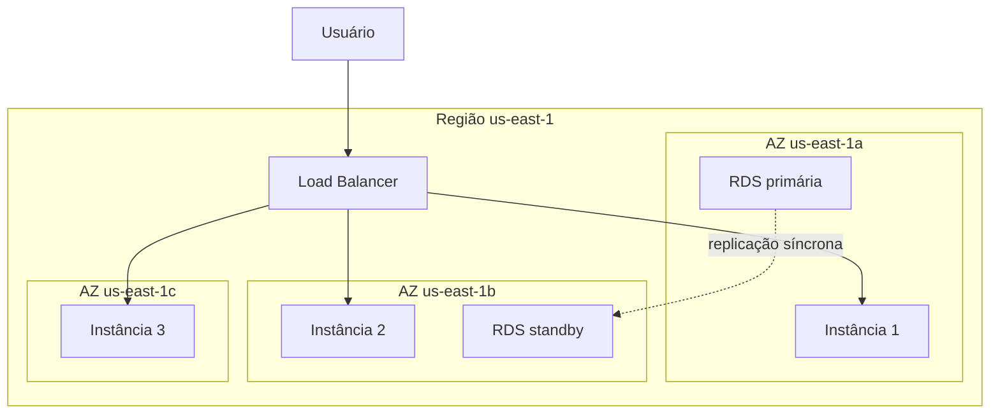
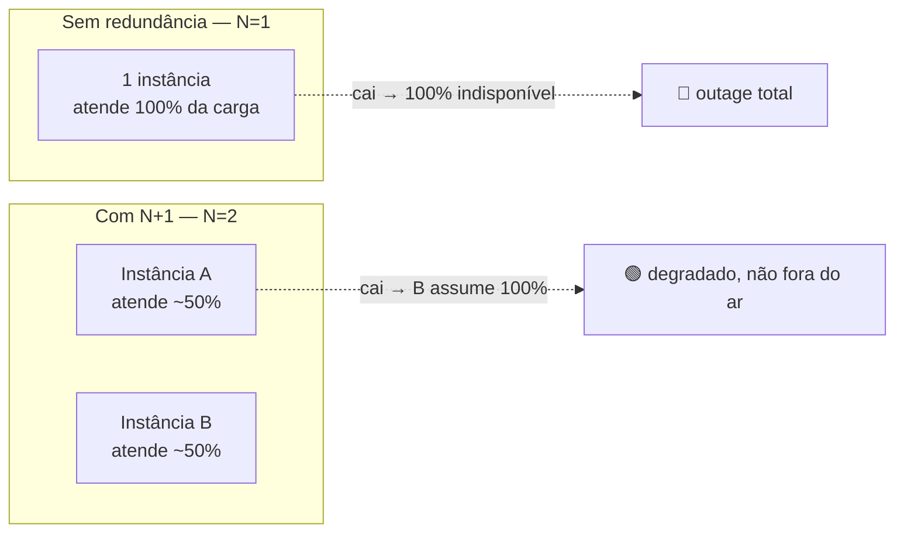
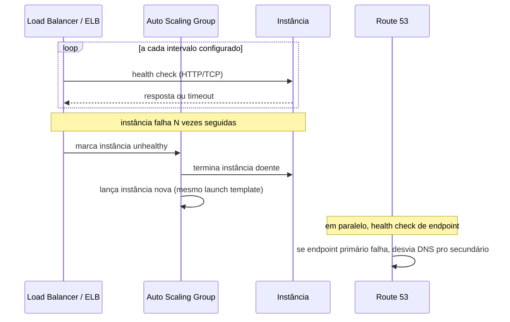

# Alta disponibilidade

> [!abstract] TL;DR
> **Alta disponibilidade (HA)** é a propriedade de um sistema continuar respondendo mesmo quando um componente individual falha — sem intervenção humana, dentro de uma única região. O mecanismo central é distribuir réplicas do mesmo serviço em múltiplas **zonas de disponibilidade** (AZs) — datacenters fisicamente isolados, com energia e rede independentes — e deixar um balanceador ou um Auto Scaling Group decidir, via **health check**, para onde mandar tráfego e quando substituir uma instância doente. HA não é sorte nem redundância genérica: é a disciplina de identificar todo **ponto único de falha (SPOF)** na arquitetura e ou eliminá-lo com redundância N+1, ou aceitar conscientemente que ele existe. Aplicações **stateless** tornam essa substituição trivial — qualquer instância nova atende qualquer requisição, porque o estado mora no banco ou no cache, não na memória da instância. E quando a falha não pode ser mascarada instantaneamente, **graceful degradation** (circuit breaker, fallback) evita que a falha de uma peça derrube o sistema inteiro. Na AWS isso é Multi-AZ nativo em quase todo serviço gerenciado; na DigitalOcean, o conceito de AZ é bem menos exposto — datacenters dentro de uma região existem, mas não há distribuição automática entre eles, e a honestidade sobre essa lacuna é parte desta nota.

## O problema: a pergunta que toda entrevista de arquitetura faz

"O que acontece se essa instância cair agora?" É a pergunta mais simples que existe, e a que mais gente erra na prática — não porque não saiba a resposta técnica, mas porque nunca parou para fazer a pergunta sobre a *própria* arquitetura. Uma única instância EC2 rodando a API de produção, um único Droplet servindo o site, um único banco sem réplica: cada um desses é um ponto único de falha esperando o momento errado para se manifestar. E o momento errado, por definição, é sempre o pior possível — a Black Friday, o lançamento do produto, as três da manhã de sexta-feira quando ninguém está de plantão olhando dashboard.

A resposta de quem já apanhou não é "a gente reage rápido". É "o sistema já sobreviveu antes de qualquer humano perceber que algo caiu". Essa é a linha que separa **alta disponibilidade** de **disaster recovery**: HA é o reflexo automático dentro de uma região, medido em segundos ou poucos minutos; DR é o plano para quando a região inteira desaparece, medido em minutos a horas e envolvendo decisão humana — assunto de uma nota adiante nesta trilha. Esta nota fica no primeiro território: como projetar para que a falha de *um* componente — uma instância, uma AZ, um processo — nunca vire indisponibilidade percebida pelo usuário.

## Zona de disponibilidade: a unidade de isolamento

Uma **região** de nuvem (`us-east-1`, `nyc3`) é uma área geográfica. Dentro dela, os grandes provedores dividem a infraestrutura em **zonas de disponibilidade (AZs)** — um ou mais datacenters fisicamente separados, com energia, refrigeração e rede independentes, conectados entre si por fibra de baixíssima latência. A AZ é a unidade de isolamento de falha: se um transformador de energia queima numa AZ, as outras AZs da mesma região continuam de pé, porque não compartilham a mesma infraestrutura física. É exatamente o que já apareceu nos galhos de Compute e de Bancos gerenciados desta trilha — agora formalizado como princípio de resiliência, não só como detalhe de provisionamento.



A regra prática de HA dentro de uma região é simples de enunciar e fácil de esquecer na hora de provisionar: **nunca faça deploy de tudo numa AZ só**. Instâncias de compute espalhadas em pelo menos duas AZs (idealmente três), atrás de um load balancer que já foi tema do galho de Compute II. Banco de dados com standby síncrono em outra AZ — o Multi-AZ que a nota [[03-Dominios/Tecnologia/Cloud/09 - Bancos gerenciados/03 - Alta disponibilidade e réplicas|Alta disponibilidade e réplicas]] do galho de Bancos gerenciados já detalhou a fundo, incluindo a distinção crítica com read replica. Esta nota recicla esse conhecimento sob uma lente diferente: não "como o RDS faz failover", mas "por que espalhar em múltiplas AZs é o mecanismo estrutural que sustenta HA em qualquer camada — compute, banco, cache, fila".

## SPOF e redundância N+1

Um **ponto único de falha (SPOF)** é qualquer componente cuja queda, sozinha, derruba o sistema inteiro — uma instância sem réplica, um banco sem standby, um NAT Gateway numa única AZ, até um certificado que expira sem ninguém saber. Caçar SPOFs é um exercício de desenhar o diagrama de arquitetura e perguntar, componente por componente: "se isso sumir agora, o resto continua funcionando?" Se a resposta for não, ali está um SPOF.

A correção padrão é a **redundância N+1**: se o sistema precisa de N unidades de capacidade para atender a carga normal, provisione N+1 (ou mais) — a unidade extra absorve a perda de qualquer uma das outras sem degradar o serviço. Duas instâncias atendendo uma carga que uma única já atenderia é N+1 com N=1; três instâncias numa carga que duas atendem é N+1 com N=2, e por aí vai. O erro comum é confundir "ter réplica" com "ter redundância de verdade": duas instâncias na mesma AZ compartilham o SPOF da própria AZ; duas instâncias em AZs diferentes, mas atrás de um único NAT Gateway numa AZ só, ainda têm um SPOF escondido na saída de rede.

SPOFs gostam de se esconder nas camadas que ninguém olha durante o design inicial — a lista abaixo é o roteiro mínimo de varredura antes de declarar uma arquitetura "altamente disponível":

| Camada | SPOF comum e escondido | Correção padrão |
|---|---|---|
| Compute | instâncias todas na mesma AZ | espalhar em ≥2 AZs via ASG/subnets |
| Rede de saída | um único NAT Gateway numa AZ | um NAT Gateway por AZ |
| Banco de dados | primária sem standby síncrono | Multi-AZ (RDS) / standby node (DO) |
| DNS/borda | um único endpoint sem health check | Route 53 failover / DO LB com múltiplos droplets |

> [!info] Verificado em 2026-07-24
> A AWS documenta AZs como "isoladas fisicamente" dentro de uma região, conectadas por redes de baixa latência e alta largura de banda, e recomenda explicitamente distribuir recursos em múltiplas AZs para tolerância a falha — fonte: AWS *Regions and Zones* (documentação de infraestrutura global). Preços e contagem exata de AZs por região variam e devem ser reconferidos antes de dimensionar capacidade.



A pergunta que separa redundância de verdade de redundância de fachada não é "quantas cópias eu tenho", mas "quantas cópias eu perco antes do sistema parar de atender": com N=1 (uma instância só), perder uma é perder tudo; com N+1 bem distribuído entre AZs, perder uma unidade deixa o resto absorvendo a carga, ainda que com menos folga. O mesmo raciocínio se aplica a qualquer camada — NAT Gateway, fila de mensagens, cluster de cache — não só à camada de compute que aparece mais nos exemplos.

## Health checks e auto-recovery: detectar e substituir

Redundância sozinha não é HA — alguém (ou algo) precisa **detectar** a falha e **agir** sobre ela em segundos, não em minutos. É aqui que os três mecanismos vistos no galho de Compute desta trilha se encaixam como peças de uma mesma máquina:



Três camadas, três granularidades: o **health check do load balancer** (já detalhado na nota [[03-Dominios/Tecnologia/Cloud/06 - Compute II — elasticidade e balanceamento/03 - Health checks|Health checks]] do galho de Compute II) decide para onde rotear tráfego *agora*, dentro de uma janela de segundos. O **Auto Scaling Group** (nota [[03-Dominios/Tecnologia/Cloud/06 - Compute II — elasticidade e balanceamento/04 - Auto Scaling Groups|Auto Scaling Groups]] do mesmo galho) decide se uma instância marcada unhealthy deve ser *substituída* — e faz isso lançando uma instância nova a partir do mesmo launch template, na mesma família de AZs configurada no grupo. E o **Route 53**, na borda do DNS, decide para qual *endpoint inteiro* (não instância — endpoint, que pode ser outra região) mandar o próximo lookup, via *failover routing policy*: um recurso primário e um secundário, cada um com seu próprio health check, e o DNS respondendo com o secundário assim que o primário falha o número de checagens consecutivas configurado.

> [!info] Verificado em 2026-07-24
> A documentação da AWS confirma que o EC2 Auto Scaling recebe sinais de saúde de múltiplas fontes (EC2, Elastic Load Balancing, VPC Lattice, EBS, health checks customizados) e, ao marcar uma instância `InService` como unhealthy, a substitui automaticamente lançando uma nova com as configurações correntes do launch template/launch configuration do grupo — fonte: *Health checks for instances in an Auto Scaling group* (AWS Auto Scaling User Guide). O período de graça (health check grace period) por padrão dá tempo para a instância inicializar antes das checagens valerem — o valor exato configurado deve ser conferido por grupo, porque frequentemente é ajustado para o tempo de boot da aplicação. Route 53 confirma o modelo de *failover routing* com health checks endereçando recurso primário/secundário — fonte: *Creating Amazon Route 53 health checks* (Route 53 Developer Guide).

> [!tip] Assista: AWS re:Invent 2025 - Global Resilient Apps: Guide to Multi-AZ/Region Architecture with ELB (NET311)
> **Canal:** AWS Events | **Duração:** ~55min | **Idioma:** EN
>
> Talk oficial de re:Invent que detalha, na prática, como o Elastic Load Balancing decide quando tirar uma AZ de circulação — o mesmo mecanismo de "failover automático dentro da região" que esta nota descreve, só que com os bastidores do ELB abertos. Trecho de destaque [4:46]: *"multi-AZ resiliency then and we are going to be focused on ELB here"*
>
> 🎬 [Assistir no YouTube](https://www.youtube.com/watch?v=_WFrt9ABrMM)

## Stateless design: por que a instância nova pode simplesmente assumir

A substituição automática só funciona sem fricção se qualquer instância nova conseguir atender qualquer requisição — e isso só é verdade se a aplicação for **stateless**: nenhuma sessão de usuário, nenhum arquivo de upload, nenhum carrinho de compras guardado só na memória ou no disco local da instância. Todo estado que precisa sobreviver além de uma requisição mora em algo externo e compartilhado — banco de dados, cache distribuído (Redis/Valkey, já visto no galho de Bancos gerenciados), object storage para arquivo.

O teste mental é direto: se você matar a instância *agora*, no meio de uma sessão de usuário, e o próximo request dessa mesma pessoa cair numa instância diferente, a experiência quebra? Se a resposta é sim — o carrinho sumiu, o login caiu, o upload em progresso se perdeu — a aplicação tem estado escondido em algum lugar que o Auto Scaling Group não pode proteger. Design stateless não é só boa prática de arquitetura distribuída; é o pré-requisito estrutural para que health check + auto-recovery + Multi-AZ realmente entreguem HA, em vez de apenas trocarem uma instância quebrada por outra que também vai quebrar a experiência do usuário atual.

Na prática, isso costuma significar mover a sessão de usuário — que "naturalmente" tentaria viver na memória do processo, pela conveniência de implementar assim primeiro — para um cache compartilhado que qualquer instância enxerga:

```python
# Sessão de usuário externalizada — qualquer instância pode ler/escrever
import redis

sessao_store = redis.Redis(host="cache-producao.abc123.cache.amazonaws.com", port=6379)

def carregar_carrinho(usuario_id):
    dados = sessao_store.get(f"carrinho:{usuario_id}")
    return json.loads(dados) if dados else {"itens": []}

def salvar_carrinho(usuario_id, carrinho):
    sessao_store.set(f"carrinho:{usuario_id}", json.dumps(carrinho), ex=3600)
```

Não importa qual das N instâncias atende a próxima requisição desse usuário — o carrinho está no Redis compartilhado, não na memória de nenhuma instância específica. É o mesmo cache gerenciado (ElastiCache/Valkey, ou o equivalente Managed Database da DigitalOcean) já coberto no galho de Bancos gerenciados, agora sob a ótica de resiliência, não de performance.

## Graceful degradation: falhar sem derrubar tudo

Nem toda falha pode ser mascarada por uma instância nova em segundos. Um serviço dependente fica lento, uma API de terceiro começa a dar timeout, um banco de recomendações fica indisponível — e a pergunta de design muda de "como eu substituo o componente" para "como eu degrado sem quebrar o resto". **Graceful degradation** é responder à falha de uma dependência entregando uma versão reduzida do serviço, em vez de propagar o erro e derrubar tudo: a página de produto carrega sem a seção de "recomendados para você", o checkout continua funcionando mesmo que o serviço de cupom esteja fora do ar, o app mostra dado em cache de alguns minutos atrás em vez de travar esperando dado fresco que não vem.

O mecanismo mais citado em entrevista para isso é o **circuit breaker**: um componente que monitora as chamadas a uma dependência e, depois de um número de falhas seguidas, "abre o circuito" — passa a rejeitar chamadas imediatamente (com um fallback), sem nem tentar a rede, dando tempo para a dependência se recuperar sem ser bombardeada por retries. É padrão de arquitetura distribuída, não recurso de nuvem — e já tem nota própria, com o mecanismo a fundo (estados closed/open/half-open, threshold, fallback), no domínio de System Design: [[03-Dominios/Engenharia/Arquitetura/System Design/3 - Padrões recorrentes/05 - Circuit Breaker e resiliência|Circuit Breaker e resiliência]]. O que importa aqui é o lugar que ele ocupa na disciplina de HA: health check e Auto Scaling Group resolvem "esta instância morreu, troque"; circuit breaker resolve "esta dependência está doente, mas não morta — pare de bater nela até ela respirar".

```python
# Circuit breaker minimalista — ilustrativo, não produção
class CircuitBreaker:
    def __init__(self, falhas_para_abrir=5, tempo_meio_aberto=30):
        self.falhas_para_abrir = falhas_para_abrir
        self.tempo_meio_aberto = tempo_meio_aberto
        self.falhas_consecutivas = 0
        self.estado = "closed"          # closed | open | half_open
        self.abriu_em = None

    def chamar(self, funcao_remota, fallback):
        if self.estado == "open":
            if time.time() - self.abriu_em > self.tempo_meio_aberto:
                self.estado = "half_open"    # tenta uma chamada de teste
            else:
                return fallback()            # nem tenta a rede

        try:
            resultado = funcao_remota()
            self.falhas_consecutivas = 0
            self.estado = "closed"
            return resultado
        except Exception:
            self.falhas_consecutivas += 1
            if self.falhas_consecutivas >= self.falhas_para_abrir:
                self.estado = "open"
                self.abriu_em = time.time()
            return fallback()
```

## Design para falha: retry, timeout, idempotência, bulkhead

Se a rede pode falhar a qualquer momento — e numa arquitetura distribuída ela vai falhar, é questão de quando —, o código de chamada precisa assumir isso desde a primeira linha, não tratar como exceção rara.

**Retry com backoff exponencial** tenta de novo em vez de propagar o erro na primeira falha — mas com espaçamento crescente entre tentativas (1s, 2s, 4s, 8s...) e um pouco de aleatoriedade (*jitter*), para não sincronizar um exército de clientes batendo na dependência recém-recuperada no mesmo instante exato, piorando a recaída.

```python
import random, time

def chamar_com_retry(funcao, max_tentativas=4, base=1.0):
    for tentativa in range(max_tentativas):
        try:
            return funcao()
        except TransientError:
            if tentativa == max_tentativas - 1:
                raise
            espera = base * (2 ** tentativa) + random.uniform(0, 0.5)
            time.sleep(espera)
```

**Timeout** garante que uma chamada travada não segure recursos (thread, conexão) para sempre esperando uma resposta que pode nunca vir — sem timeout, um único componente lento consegue esgotar o pool de conexões de quem chama, espalhando a falha por contágio.

**Idempotência** é o que torna retry seguro: se a mesma requisição pode chegar duas vezes (porque o retry disparou depois de uma resposta que só se perdeu no caminho de volta, não na operação em si), o efeito precisa ser o mesmo de rodar uma vez só — não cobrar o cartão duas vezes, não criar dois pedidos. É tema aprofundado, com o mecanismo de chave de idempotência a fundo, no domínio de Comunicação entre Sistemas: [[03-Dominios/Engenharia/Comunicação entre Sistemas/3 - Confiabilidade do contrato/01 - Idempotência|Idempotência]].

**Bulkhead** isola pools de recursos por dependência — como os compartimentos estanques de um navio, se um compartimento alaga, os outros continuam flutuando. Na prática, significa não deixar uma única dependência lenta (o serviço de recomendação, digamos) consumir o mesmo pool de threads/conexões usado pelo checkout: um pool de conexão dedicado e limitado por dependência garante que a degradação de uma não sangre para as outras.

| Mecanismo | O que resolve | Onde vive |
|---|---|---|
| Health check + Auto Scaling | instância morreu, substitua | Compute II (galho 6) |
| Multi-AZ (compute/banco) | AZ inteira caiu, outra assume | esta nota + galho 9 |
| Route 53 failover | endpoint/região inteira falhou | borda DNS |
| Retry com backoff + idempotência | chamada falhou, retry não duplica efeito | cliente da chamada |
| Timeout + bulkhead | dependência travada não contamina o resto | cliente da chamada |
| Circuit breaker | dependência doente, pare de bater | camada de chamada remota |

## Lente dupla: Multi-AZ na AWS vs. o que a DigitalOcean expõe

Na AWS, o conceito de AZ é de primeira classe e aparece explicitamente em quase toda API: uma sub-rede pertence a uma AZ, uma instância nasce numa AZ, um Auto Scaling Group recebe uma lista de subnets (uma por AZ) e distribui instâncias entre elas, o RDS Multi-AZ replica para uma AZ diferente por design.

```bash
# Auto Scaling Group distribuído em 3 subnets (3 AZs) — AWS CLI
$ aws autoscaling create-auto-scaling-group \
    --auto-scaling-group-name producao-api-asg \
    --launch-template LaunchTemplateName=producao-api-lt,Version='$Latest' \
    --min-size 3 --max-size 9 --desired-capacity 3 \
    --vpc-zone-identifier "subnet-az1a,subnet-az1b,subnet-az1c" \
    --health-check-type ELB \
    --health-check-grace-period 120
```

O mesmo desenho, como infraestrutura como código (Terraform), deixa a distribuição entre AZs explícita na lista de subnets — cada uma já provisionada numa AZ diferente da mesma VPC:

```hcl
resource "aws_autoscaling_group" "producao_api" {
  name                = "producao-api-asg"
  min_size            = 3
  max_size            = 9
  desired_capacity    = 3
  vpc_zone_identifier = [
    aws_subnet.privada_az1.id,
    aws_subnet.privada_az2.id,
    aws_subnet.privada_az3.id,
  ]
  health_check_type         = "ELB"
  health_check_grace_period = 120

  launch_template {
    id      = aws_launch_template.producao_api.id
    version = "$Latest"
  }
}
```

```bash
# Habilitar Multi-AZ numa instância RDS existente — AWS CLI
$ aws rds modify-db-instance \
    --db-instance-identifier producao-pedidos \
    --multi-az \
    --apply-immediately
```

A DigitalOcean, em contraste, **não expõe zona de disponibilidade como conceito de primeira classe**. Uma região como `nyc` tem, de fato, múltiplos datacenters fisicamente separados (`nyc1`, `nyc2`, `nyc3`) — mas cada um é selecionado explicitamente como destino de um recurso, não como uma zona transparente dentro de uma região unificada que o provedor distribui por você. Não existe um "Load Balancer multi-AZ automático" que espalhe Droplets entre `nyc1` e `nyc2` como o Auto Scaling Group da AWS espalha entre subnets de AZs diferentes dentro da mesma VPC — os datacenters de uma mesma região DO não são, por padrão, interconectados como AZs de uma região AWS. Redundância entre datacenters na DO é uma composição manual: Droplets em `nyc1` e `nyc3`, atrás de um Load Balancer, com VPC peering configurado explicitamente entre os dois — não um recurso automático oferecido pela plataforma.

> [!info] Verificado em 2026-07-24
> A documentação da DigitalOcean lista 15 datacenters distribuídos em 12 regiões, com múltiplos datacenters em algumas regiões (ex.: NYC tem três — `nyc1`, `nyc2`, `nyc3`), cada um com seu próprio slug de API selecionado explicitamente no provisionamento. Isso contrasta com o modelo AWS de AZs transparentes dentro de uma região, onde o Auto Scaling Group e o RDS distribuem automaticamente entre zonas passadas como parâmetro. Onde a DO tem paridade parcial é no **Managed Database**, com *standby nodes* (até dois) que dão failover automático — mecanismo equivalente em efeito ao RDS Multi-AZ, já coberto na nota [[03-Dominios/Tecnologia/Cloud/09 - Bancos gerenciados/03 - Alta disponibilidade e réplicas|Alta disponibilidade e réplicas]]. Para compute (Droplets/App Platform), a DO não tem um equivalente direto de "Multi-AZ automático" — a honestidade aqui é deliberada, não uma lacuna de pesquisa.

O Load Balancer da DigitalOcean, ainda assim, faz o que o ELB faz na sua própria camada: health check periódico contra os Droplets do pool, remoção automática de um Droplet que falha consecutivamente, e reintegração quando ele volta a responder — a peça de detecção-e-substituição da HA funciona, mesmo sem a distribuição automática entre datacenters que a AWS oferece nativamente.

```bash
# doctl — criar Load Balancer com health check configurado
$ doctl compute load-balancer create \
    --name producao-api-lb \
    --region nyc1 \
    --health-check protocol:http,port:8080,path:/health,check_interval_seconds:10,unhealthy_threshold:3 \
    --droplet-ids 111,222,333
```

Azure e GCP mapeiam o conceito de AZ de forma mais parecida com a AWS do que com a DigitalOcean — ambos com zonas transparentes dentro de uma região, escaláveis automaticamente:

| Conceito | AWS | Azure | GCP | DigitalOcean |
|---|---|---|---|---|
| Zona de disponibilidade | Availability Zone (AZ), transparente | Availability Zone, transparente | Zone, transparente | Datacenter explícito (ex.: `nyc1`), sem distribuição automática |
| Auto-distribuição entre zonas | Auto Scaling Group + subnets por AZ | Virtual Machine Scale Set zonal | Managed Instance Group regional | Não há equivalente automático |
| Failover de banco gerenciado | RDS/Aurora Multi-AZ | Zone-redundant HA (Flexible Server) | Regional HA (Cloud SQL) | Standby nodes (Managed DB) |
| Health check de LB | ELB health check | Azure Load Balancer health probe | Cloud Load Balancing health check | DO Load Balancer health check |
| Failover de DNS entre regiões | Route 53 failover routing | Azure Traffic Manager (priority routing) | Cloud DNS + health checks externos | Sem serviço nativo equivalente |

## Testar o failover antes que ele aconteça sozinho

Configurar Multi-AZ, Auto Scaling Group e circuit breaker e nunca ter visto nenhum deles disparar de verdade é confiar num mecanismo que ninguém do time observou funcionar. A primeira vez que um failover acontece não deveria ser durante um incidente real, com cliente já impactado — deveria ter acontecido antes, num teste deliberado: forçar o failover do RDS (`aws rds reboot-db-instance --force-failover`, já citado na nota de Bancos gerenciados), terminar manualmente uma instância do Auto Scaling Group e cronometrar quanto tempo até a substituição ficar `InService`, ou simular a dependência lenta que deveria abrir o circuit breaker e confirmar que o fallback realmente aparece, não só em teoria.

> [!info] Fronteira
> Testar failover pontualmente, como verificação de configuração, é parte desta nota. Formalizar isso como disciplina contínua — **chaos engineering**, *game days*, injeção de falha automatizada e recorrente em produção — é uma prática de maturidade operacional que pertence à disciplina de Operação, aprofundada em [[03-Dominios/Engenharia/Operação/4 - Observar e responder/06 - Debugging de produção e chaos engineering|Debugging de produção e chaos engineering]]. Aqui o objetivo é mais modesto: confirmar que o mecanismo que você acabou de configurar faz o que a documentação promete, antes de assinar embaixo dele.

## O preço da redundância: a tensão com FinOps

Nada disso é grátis. N+1 significa, por definição, capacidade ociosa em condição normal — a unidade extra existe justamente para não estar sempre 100% ocupada, senão não sobra folga quando uma falha reduz a capacidade disponível. Um Multi-AZ de banco custa o dobro de uma instância single-AZ (a standby é full-price, ociosa até o failover); três instâncias de compute em vez de duas custam 50% a mais em regime normal; um segundo endpoint pronto para failover de Route 53 é infraestrutura rodando sem tráfego a maior parte do tempo. A disciplina de custo de nuvem — [[03-Dominios/Tecnologia/Cloud/19 - FinOps — a economia da cloud/04 - Otimização de custo|Otimização de custo]], do galho de FinOps desta trilha — não é contraditória com HA, mas é a pergunta que sempre deveria vir logo depois de desenhar a redundância: **este SLA específico vale este custo específico?**

A resposta não é a mesma para toda parte do sistema. O checkout de um e-commerce, que perde receita direta a cada minuto fora do ar, justifica facilmente Multi-AZ e três instâncias. Um painel administrativo interno, usado por cinco pessoas do time financeiro uma vez por mês, provavelmente não justifica o mesmo investimento — uma instância única com backup automático pode ser a decisão certa, não uma economia irresponsável. HA bem-feita não maximiza redundância em todo lugar; aloca redundância onde o custo de uma falha é mais caro que o custo de preveni-la, e aceita risco calculado onde não é.

## Casos práticos

**A API que sobrevive à queda de uma AZ inteira sem ninguém acordar.** Um Auto Scaling Group com mínimo de 3 instâncias, espalhadas em 3 AZs, atrás de um Application Load Balancer. A AZ que hospeda uma das instâncias sofre uma falha de energia; o health check do ALB detecta a instância inacessível em segundos, para de rotear tráfego para ela, e o Auto Scaling Group a substitui automaticamente — mas mesmo antes da substituição terminar, as outras duas instâncias, em AZs saudáveis, seguem atendendo 100% do tráfego, porque a aplicação é stateless e o load balancer já redistribuiu a carga. O time descobre o incidente no dia seguinte, olhando o log do ASG — não porque um cliente reclamou.

**O checkout que continua vendendo mesmo com a recomendação de produtos fora do ar.** O serviço de "produtos recomendados" começa a responder devagar demais depois de uma migração malfeita. Sem circuit breaker, cada página de produto trava esperando essa resposta, e o efeito se espalha até derrubar o checkout inteiro — que nem depende da recomendação, mas compartilha o mesmo pool de threads da aplicação. Com um circuit breaker configurado especificamente na chamada de recomendação, e um bulkhead isolando o pool de conexão dessa dependência, o circuito abre depois de algumas falhas seguidas, a página de produto passa a carregar sem a seção de recomendados (fallback: lista vazia ou cache antigo), e o checkout — numa dependência separada — nunca percebe o problema.

**A migração que trocou "réplica" por "réplica de verdade".** Um time descobre, numa revisão de arquitetura, que as duas instâncias da API "redundantes" viviam na mesma AZ — decisão tomada sem intenção, porque o subnet padrão usado no deploy inicial só existia numa zona. A correção não muda uma linha de código da aplicação: é reconfigurar o Auto Scaling Group para usar subnets de três AZs diferentes. A capacidade nominal não mudou, mas o sistema deixou de ter um SPOF de datacenter escondido atrás de uma aparência de redundância.

**O retry que quase piorou o incidente, e o jitter que salvou.** Um serviço externo começa a degradar sob carga; centenas de clientes, todos com o mesmo retry de backoff fixo (sem aleatoriedade), tentam de novo exatamente no mesmo segundo, gerando picos sincronizados de tráfego que impedem o serviço de se recuperar — um efeito conhecido como *thundering herd*. A correção é adicionar jitter ao cálculo do backoff, espalhando as tentativas ao longo de uma janela em vez de concentrá-las num instante só, dando ao serviço degradado uma chance real de respirar entre picos.

**O painel interno que não precisava de Multi-AZ, e o time que percebeu isso a tempo.** Um squad estava prestes a replicar, por padrão de time, o mesmo desenho Multi-AZ + três instâncias usado no checkout para um painel administrativo interno de baixíssimo uso. Uma conversa de trinta minutos sobre o SLA real necessário — "se isso cair numa sexta à tarde, alguém percebe antes de segunda?" — bastou para decidir uma instância única com backup diário automático, redirecionando o orçamento de redundância para onde a falha realmente dói. A decisão de HA, nesse caso, foi decidir *não* investir — e documentar por quê, para a próxima pessoa não reabrir a discussão sem contexto.

## Armadilhas comuns

> [!warning] Redundância na mesma AZ, disfarçada de HA
> Duas instâncias existem, mas na mesma zona de disponibilidade — a aparência de redundância não protege contra o SPOF real, que é a própria AZ. Sempre confira a distribuição real entre zonas, não só a contagem de réplicas.

> [!warning] Stateful escondido numa aplicação "stateless"
> Sessão de usuário guardada em memória local, upload em progresso salvo em disco da instância, cache in-process que nenhuma outra instância enxerga — qualquer um desses quebra a promessa de que "qualquer instância atende qualquer request", mesmo que o resto do design pareça stateless. O teste é sempre: mate a instância no meio de uma sessão e veja o que quebra.

> [!warning] Retry sem idempotência multiplicando efeito
> Um cliente que faz retry automático numa operação que não é idempotente (cobrar cartão, criar pedido) pode duplicar o efeito assim que a rede engasgar — a resposta se perde no caminho de volta, o cliente acha que falhou e tenta de novo, e agora existem dois pedidos. Retry sem chave de idempotência na API é uma arma apontada para o próprio sistema.

> [!warning] Circuit breaker sem fallback definido
> Abrir o circuito e simplesmente propagar um erro genérico não é graceful degradation — é falha rápida disfarçada de resiliência. O ganho real do circuit breaker só aparece quando existe um fallback que degrada com sentido: cache antigo, resposta vazia, funcionalidade reduzida — não um 500 mais rápido.

> [!warning] Achar que Multi-AZ dentro de uma região é disaster recovery
> Multi-AZ protege contra a queda de um datacenter; não protege contra a perda de uma região inteira, nem contra um erro humano que se propaga pela própria replicação síncrona (um `DELETE` errado replica junto). Confundir os dois leva a subestimar o investimento real necessário em continuidade — assunto da próxima nota desta trilha.

> [!warning] Health check malformado que nunca marca nada como unhealthy
> Um health check apontando para uma rota que sempre responde 200 (por exemplo, `/` em vez de um endpoint que checa dependências reais como banco e cache) nunca detecta uma aplicação realmente quebrada por dentro — o processo está de pé, mas incapaz de servir requisição de verdade, e o load balancer segue mandando tráfego pra ela porque, do ponto de vista do health check raso, está tudo bem.

> [!warning] Redundância uniforme sem olhar o SLA real de cada parte
> Aplicar o mesmo nível de HA (Multi-AZ, N+1 generoso) em toda parte do sistema, sem diferenciar o que é crítico do que não é, gasta orçamento de infraestrutura em partes que nunca vão justificar o investimento — e, pior, tira foco e atenção de onde a redundância realmente importa. HA é uma alocação de risco, não um nível único aplicado por reflexo.

## O que vem a seguir

Alta disponibilidade resolve a queda de um componente, de uma instância, de uma AZ — dentro da mesma região, em segundos a poucos minutos, sem decisão humana. Mas ela não responde a duas perguntas que só ficam urgentes quando o incidente é grande demais para HA sozinha resolver: quanto tempo de indisponibilidade o negócio tolera, e quanto dado ele pode perder, se a região inteira falhar ou se um erro humano corromper o dado replicado em todas as réplicas ao mesmo tempo. Essas duas perguntas têm nome formal — RTO e RPO — e moldam toda estratégia de disaster recovery daqui pra frente. É o assunto da próxima nota desta trilha.

## Fontes

- [AWS — Regions and Zones](https://docs.aws.amazon.com/AWSEC2/latest/UserGuide/using-regions-availability-zones.html) — definição de AZ como datacenter isolado, conectividade de baixa latência entre AZs de uma região; acessado em 2026-07-24.
- [AWS Auto Scaling User Guide — Health checks for instances in an Auto Scaling group](https://docs.aws.amazon.com/autoscaling/ec2/userguide/ec2-auto-scaling-health-checks.html) — fontes de sinal de saúde (EC2, ELB, VPC Lattice, EBS, custom), substituição automática de instância unhealthy; acessado em 2026-07-24.
- [AWS Route 53 Developer Guide — Creating Amazon Route 53 health checks](https://docs.aws.amazon.com/Route53/latest/DeveloperGuide/dns-failover.html) — modelo de DNS failover, health check de endpoint, roteamento de tráfego de recurso não saudável para saudável; acessado em 2026-07-24.
- [AWS RDS — Multi-AZ deployments](https://docs.aws.amazon.com/AmazonRDS/latest/UserGuide/Concepts.MultiAZ.html) — replicação síncrona para standby em outra AZ, failover automático; acessado em 2026-07-24 (mesmo mecanismo já citado na nota de Bancos gerenciados).
- [DigitalOcean — Regional Availability](https://docs.digitalocean.com/platform/regional-availability/) — 15 datacenters em 12 regiões, múltiplos datacenters por região (ex. NYC1/NYC2/NYC3) selecionados explicitamente; acessado em 2026-07-24.
- [DigitalOcean — How to Add Standby Nodes to PostgreSQL Database Clusters](https://docs.digitalocean.com/products/databases/postgresql/how-to/add-standby-nodes/) — até 2 standby nodes com failover automático, paridade parcial com Multi-AZ; acessado em 2026-07-23 (reaproveitado da nota de Bancos gerenciados).
- [DigitalOcean — doctl compute load-balancer](https://docs.digitalocean.com/reference/doctl/reference/compute/load-balancer/) — sintaxe de criação de Load Balancer com health check via doctl; acessado em 2026-07-24.
