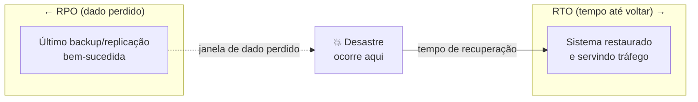
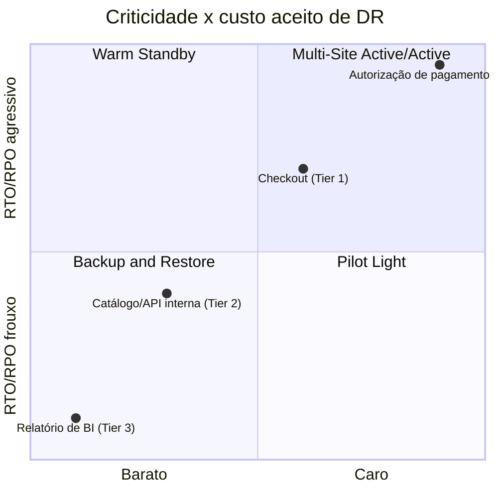
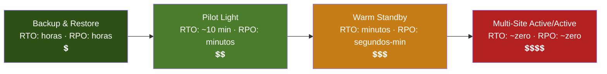

# RTO, RPO e estratégias de DR

> [!abstract] TL;DR
> Multi-AZ (nota anterior) resolve a queda de um data center: em um a dois minutos, uma standby síncrona assume. Mas e se a região inteira sumir — apagão, fibra cortada, ransomware que criptografa tudo, ou um erro humano que se propaga antes de qualquer failover acontecer? Isso é **disaster recovery (DR)**: o plano para quando a arquitetura de alta disponibilidade, sozinha, não é suficiente. Todo plano de DR se resume a duas perguntas e um trade-off: **RTO** (Recovery Time Objective — quanto tempo até o sistema voltar) e **RPO** (Recovery Point Objective — quanto dado, em tempo, você aceita perder). A AWS descreve quatro estratégias canônicas, em ordem crescente de custo e decrescente de RTO/RPO: **Backup & Restore** (horas, mais barato), **Pilot Light** (minutos, núcleo mínimo sempre ligado), **Warm Standby** (minutos, cópia reduzida rodando) e **Multi-Site Active/Active** (segundos a quase-zero, caro). Não existe estratégia "certa" — existe a estratégia que custa o que a criticidade do workload justifica. Na AWS esse espectro é rico e documentado; na DigitalOcean, backups automáticos ficam **no mesmo datacenter** do Droplet — DR multi-região ali é você quem constrói, não um produto de prateleira.

## O problema: quando o failover automático não dispara

Você já projetou tudo certo. RDS com Multi-AZ, réplicas de leitura, backups automáticos com PITR de 35 dias — tudo o que as duas notas anteriores deste galho cobriram. Numa quinta-feira de manhã, a região inteira da AWS onde seu workload roda tem um evento de correlação: um problema de rede interno derruba múltiplas Availability Zones ao mesmo tempo, algo raro mas que já aconteceu publicamente mais de uma vez nos últimos anos. Multi-AZ foi desenhado exatamente para o caso "uma AZ caiu" — ele promove a standby *na mesma região*, para outra AZ. Mas se a correlação de falha atinge a região como um todo, não há para onde promover: todas as AZs daquela região estão degradadas.

Este é o ponto exato onde a disciplina de **alta disponibilidade** (nota anterior) termina e a disciplina de **disaster recovery** começa. HA responde "como eu absorvo a perda de um componente sem downtime perceptível". DR responde uma pergunta mais desconfortável: "quando o desastre é grande demais para HA absorver sozinha — região inteira, corrupção que se replicou, ransomware, erro humano em escala — quanto tempo eu aceito ficar fora do ar, e quanto dado eu aceito ter perdido, até voltar?" Não é uma pergunta técnica no fundo — é uma pergunta de negócio disfarçada de arquitetura, e é por isso que ela precisa de dono e de número, não de intuição.

> [!info] Fronteira com a nota anterior
> Se você ainda não leu sobre Multi-AZ e réplicas síncronas, essa é a base sobre a qual esta nota constrói — aqui tratamos do degrau acima: quando a unidade de falha deixa de ser "uma zona" e passa a ser "a região inteira", ou quando a causa não é infraestrutura, mas dado corrompido ou deletado em escala.

## RTO e RPO: os dois números que definem tudo

**RTO (Recovery Time Objective)** é quanto tempo, no relógio, você aceita entre o desastre acontecer e o sistema voltar a atender. **RPO (Recovery Point Objective)** é quanto dado, medido em tempo, você aceita perder — se o RPO é de 15 minutos, e o desastre acontece às 14h32, a restauração pode legitimamente voltar com o estado das 14h17, e isso é um resultado *aceito*, não uma falha do plano.



Os dois números não vêm de uma tabela genérica de mercado — vêm de conversar com quem é dono do negócio sobre o custo real de cada minuto fora do ar e de cada minuto de dado perdido, e esse custo varia brutalmente por criticidade:

| Tier de criticidade | Exemplo de workload | RTO alvo | RPO alvo | Estratégia típica |
|---|---|---|---|---|
| Tier 0 — crítico de missão | Autorização de pagamento, trading | segundos | ~zero | Multi-Site Active/Active |
| Tier 1 — essencial | Checkout de e-commerce, autenticação | minutos | minutos | Warm Standby |
| Tier 2 — importante | API interna, catálogo de produto | dezenas de min. a 1h | ~1h | Pilot Light |
| Tier 3 — não crítico | Relatório de BI, ambiente de staging | horas | horas | Backup & Restore |



Chegar nesses dois números por workload não é um exercício técnico isolado — é uma conversa, de preferência recorrente, entre quem entende o custo de compute (engenharia) e quem entende o custo do minuto fora do ar (o dono do produto ou do negócio). A pergunta certa para abrir essa conversa não é "qual RTO você quer" — todo mundo responde "zero" se não houver um preço amarrado à resposta. A pergunta certa é "quanto custaria manter esse workload rodando em duas regiões, permanentemente, versus quanto custa um dia inteiro fora do ar" — e é só depois de ambos os números estarem na mesa que o RTO/RPO alvo vira uma decisão informada, e não um desejo.

Note a assimetria: um RTO de segundos não é "melhor" em abstrato — é **caro**, porque exige capacidade rodando ociosa em outra região o tempo todo, pronta pra assumir tráfego real a qualquer instante. Definir RTO/RPO agressivo para um workload Tier 3 é queimar orçamento de FinOps sem retorno; definir RTO/RPO frouxo para um Tier 0 é um incidente de reputação (ou pior) esperando para acontecer. O trabalho de definir esses dois números, por workload, é em si o produto final desta nota — as quatro estratégias a seguir são só o cardápio de como atingi-los.

## As quatro estratégias de DR (AWS)

A AWS descreve, no whitepaper oficial de disaster recovery, quatro estratégias — "variando do baixo custo e baixa complexidade de fazer backups até estratégias mais complexas usando múltiplas regiões ativas". Backup & Restore e Pilot Light são tipicamente **ativo/passivo**: um site ativo serve tráfego, o(s) outro(s) só existem para recuperação. Multi-Site Active/Active é, como o nome diz, todos os sites servindo tráfego real ao mesmo tempo.



### 1. Backup & Restore

A base do espectro: você replica dados (snapshots, backups) para outra região, mas **não** mantém infraestrutura provisionada lá. No desastre, você restaura os dados e **reimplanta** infraestrutura, configuração e código do zero na região de recuperação — e é exatamente por isso que o whitepaper insiste tanto em Infrastructure as Code aqui: "sem IaC, pode ser complexo restaurar workloads na região de recuperação, o que vai aumentar o tempo de recuperação e possivelmente estourar seu RTO". Os blocos que a nota anterior já cobriu — snapshot do RDS, backup do EBS, PITR — são literalmente os mesmos mecanismos usados aqui, só que copiados para outra região.

- RTO: horas (tempo de restaurar dados + redeploy de infra via IaC + subir aplicação)
- RPO: horas (janela entre backups — tipicamente o intervalo de snapshot, mitigado por PITR de transaction logs)
- Custo: o mais baixo — você paga por armazenamento de backup, não por compute ocioso

### 2. Pilot Light

Você replica dados **continuamente** (não só backups periódicos) e mantém o **núcleo mínimo** da infraestrutura sempre ligado na região de DR — tipicamente banco de dados e armazenamento — enquanto os servidores de aplicação ficam com código e configuração prontos, mas "desligados", só sendo provisionados/escalados no momento do failover. É o meio-termo: mais caro que Backup & Restore porque paga por réplica de dado sempre ativa, mais barato que Warm Standby porque não paga por servidores de aplicação ociosos.

- RTO: dezenas de minutos (ligar/escalar servidores de aplicação sobre um núcleo de dados já pronto)
- RPO: minutos (réplica contínua, quase em tempo real, via read replicas cross-region ou Aurora Global Database)
- Custo: médio-baixo

### 3. Warm Standby

Extensão do Pilot Light: além do núcleo de dados, uma versão **reduzida mas funcional** de toda a stack roda continuamente na região de DR — capaz de atender tráfego real, só que em escala menor. No failover, você só precisa **escalar** (Auto Scaling aumentando capacidade), não provisionar do zero. É aqui que a documentação da AWS introduz a distinção fina entre depender do Auto Scaling (control plane, mais barato, RTO um pouco maior) ou já manter capacidade de produção completa parada (chamado *hot standby*, mais caro, RTO menor).

- RTO: minutos (escalar capacidade já provisionada, sem repovoar infraestrutura)
- RPO: segundos a poucos minutos (replicação contínua ativa)
- Custo: médio-alto — parte da capacidade de produção já rodando o tempo todo

### 4. Multi-Site Active/Active

Todas as regiões rodam produção real, servindo tráfego real, ao mesmo tempo. Não existe "failover" no sentido tradicional — existe apenas redirecionar tráfego para longe da região com problema, porque as outras já estavam prontas e servindo. É a única estratégia capaz de RTO próximo de zero para a maioria dos desastres de infraestrutura. O próprio whitepaper da AWS é honesto sobre o limite dessa abordagem: mesmo aqui, "recuperação de um desastre de dado — corrupção, deleção — sempre será maior que zero, e o ponto de recuperação sempre estará em algum momento antes de o desastre ser descoberto". Multi-região resolve queda de infraestrutura quase perfeitamente; não resolve sozinho o `DROP TABLE` da nota anterior — para isso, você ainda depende de backup e PITR, rodando por baixo de tudo isso.

- RTO: segundos a poucos minutos (redirecionamento de tráfego, sem provisionamento)
- RPO: próximo de zero para infraestrutura; sempre maior que zero para corrupção de dado
- Custo: o mais alto — capacidade de produção completa multiplicada pelo número de regiões

| Estratégia | RTO típico | RPO típico | Custo relativo | Infra na região de DR |
|---|---|---|---|---|
| Backup & Restore | horas | horas | 💲 | nenhuma (redeploy no desastre) |
| Pilot Light | ~10s de min. | minutos | 💲💲 | núcleo de dados sempre ligado |
| Warm Standby | minutos | seg.–min. | 💲💲💲 | stack reduzida sempre rodando |
| Multi-Site Active/Active | ~zero | ~zero (infra) | 💲💲💲💲 | stack completa, tráfego real |

> [!warning] O custo não é linear — ele é multiplicativo por região
> Sair de Warm Standby para Multi-Site Active/Active não dobra o custo: você está multiplicando *toda* a capacidade de produção pelo número de regiões ativas, permanentemente, não só no dia do desastre. É comum uma empresa descobrir, na hora da fatura, que "só mais uma região" custou perto do dobro do orçamento de compute inteiro. Esta é exatamente a tensão que o galho de FinOps deste domínio nomeia: resiliência e economia puxam a decisão em direções opostas, e a escolha de estratégia de DR é, no fundo, uma decisão de FinOps disfarçada de decisão de arquitetura.

## Um caso prático: a mesma empresa, quatro tiers, quatro estratégias

Pra sair da abstração, vale seguir uma empresa fictícia de e-commerce médio decidindo DR para quatro pedaços do mesmo sistema, todos rodando na mesma conta AWS:

**O serviço de autorização de pagamento** processa o cartão no checkout. Se ele cair, todo pedido novo para — e cada minuto fora do ar é receita perdida na hora, sem chance de recuperar depois. É Tier 0: a empresa aceita o custo permanente de manter esse serviço replicado e servindo tráfego real em duas regiões ao mesmo tempo, com DynamoDB Global Tables guardando o estado da transação. É Multi-Site Active/Active — caro, mas o único desenho que entrega RTO perto de zero.

**A API de catálogo de produtos**, que alimenta busca e páginas de produto, é Tier 1: se cair, o site fica visualmente quebrado, mas o cliente não perde o carrinho — o RTO aceito é de poucos minutos. A empresa usa Warm Standby: uma cópia reduzida do serviço (metade da capacidade normal) roda 24/7 na região de DR, atrás de um Aurora Global Database replicando o catálogo quase em tempo real, e um Auto Scaling group pronto pra escalar a capacidade completa em minutos se o failover disparar.

**O serviço de recomendações personalizadas** ("quem comprou isso também comprou") é Tier 2: se sumir por uma hora, o site continua vendendo, só perde uma otimização de conversão. Pilot Light é suficiente — o banco de treinamento do modelo replica continuamente via read replica cross-region, mas os servidores que servem a inferência ficam desligados na região de DR, só sobem (e escalam) se o failover for de fato acionado.

**O painel de BI interno**, usado pelo time de operações para relatórios do dia anterior, é Tier 3: ninguém de fora percebe se ele cair por uma tarde inteira. Backup & Restore basta — snapshot diário do banco, template de CloudFormation guardado, e no desastre alguém aperta o botão de redeploy e espera as horas que levar.

O ponto de reunir os quatro lado a lado: a mesma empresa, o mesmo desastre regional hipotético, e quatro respostas de custo e velocidade completamente diferentes — porque a pergunta nunca foi "qual é a melhor estratégia de DR", foi "quanto essa parte específica do negócio vale por minuto fora do ar".

> [!tip] Assista: The Ultimate Guide to Disaster Recovery: RTO, RPO, & Failover!
> **Canal:** ByteMonk | **Duração:** ~11min | **Idioma:** EN
>
> Percorre exatamente a escada RTO/RPO → Backup & Restore → Pilot Light → Warm Standby → Multi-Site Active/Active nessa ordem, com a mesma lógica de trade-off de custo x velocidade que esta nota usa — bom pra fixar a sequência antes de entrar nos detalhes de cada degrau.
> Trecho de destaque [1:30]: *"recovery time objective. Think of RTO... as how fast can you get back on your feet"*
>
> 🎬 [Assistir no YouTube](https://www.youtube.com/watch?v=OmASCUJEVy8)

## Como a AWS materializa cada estratégia

A tabela abaixo amarra as estratégias aos serviços gerenciados que a trilha de Bancos gerenciados já cobriu, mais os mecanismos de roteamento que fazem o failover de fato acontecer:

| Estratégia | Replicação de dado | Roteamento de tráfego | Redeploy de infra |
|---|---|---|---|
| Backup & Restore | Snapshots RDS/EBS + AWS Backup cross-region | manual, após restore | CloudFormation/CDK do zero |
| Pilot Light | RDS Read Replica ou Aurora Global Database cross-region | Route 53 health check + failover | AMIs "golden" + Auto Scaling parado |
| Warm Standby | idem, sempre ativo | Route 53 / Global Accelerator | Auto Scaling já rodando, só escala |
| Multi-Site Active/Active | Aurora Global Database / DynamoDB Global Tables | Route 53 weighted/latency ou Global Accelerator traffic dial | já implantado nas N regiões |

O whitepaper chama atenção para um detalhe que separa DR "que parece pronto" de DR "que realmente funciona no dia": prefira operações de **data plane** (ex.: os health checks do Route 53, ou o AWS Application Recovery Controller, que documentadamente atua como um "interruptor" manual sobre esses health checks) a operações de **control plane** (trocar pesos de roteamento via API, redeployar CloudFormation) no momento do failover — porque o control plane historicamente tem uma meta de disponibilidade mais baixa que o data plane, e é exatamente na hora do desastre regional que o control plane tem mais chance de estar degradado junto.

Para Aurora especificamente, a documentação da AWS registra que o Aurora Global Database consegue promover uma região secundária para leitura/escrita em "menos de um minuto mesmo em caso de indisponibilidade completa da região primária" — um RTO de Pilot Light chegando perto de Warm Standby, graças à infraestrutura de replicação dedicada do Aurora (fora do caminho de I/O do banco primário).

Na prática, o failover de um Pilot Light com RDS (não-Aurora) é uma sequência de dois passos manuais ou automatizados via script — promover a réplica, depois redirecionar o tráfego:

```bash
# 1. Promover a read replica cross-region a instância independente,
#    capaz de aceitar escritas (processo leva minutos, inclui reboot)
$ aws rds promote-read-replica \
    --db-instance-identifier pedidos-replica-us-west-2 \
    --backup-retention-period 7

# 2. Apontar o DNS de aplicação para o novo endpoint primário —
#    operação de data plane via health check pré-configurado,
#    não uma troca manual de registro DNS
$ aws route53 update-health-check \
    --health-check-id abcd1234-healthcheck-primary \
    --inverted   # marca o endpoint primário como "não saudável",
                 # o que já dispara o failover configurado no
                 # routing policy do Route 53 para o secundário
```

O detalhe que separa um failover que funciona sob pressão de um que trava no dia: o segundo passo usa um *health check* que atua como interruptor manual (o papel do AWS Application Recovery Controller), não uma edição de registro DNS via console — porque a operação de "virar a chave" num health check já configurado é data plane, enquanto editar registros é control plane, com pior SLA justamente na hora em que você mais precisa dele.

## A lente DigitalOcean: DR aqui é você quem constrói

É neste ponto que a lente dupla precisa ser honesta em vez de forçar uma equivalência que não existe. Segundo a documentação oficial da DigitalOcean, os backups automáticos de Droplet rodam em intervalos configuráveis — de 6 em 6 horas até semanal, dependendo do plano — com retenção de 7 dias para backups diários e 4 semanas para semanais nos planos Basic (planos Usage-Based permitem retenção customizada de 3 dias a 6 meses). Isso cobre bem o cenário "Backup & Restore" **dentro da mesma região**.

> [!warning] O detalhe que muda tudo: mesmo datacenter
> A documentação de features de Backups da DigitalOcean é direta: "armazenamos backups no mesmo datacenter que o Droplet correspondente". Isso significa que o backup automático nativo da DO **não** protege contra a perda da região inteira — ele protege contra corrupção de disco, erro de configuração, ou um Droplet que você quer reverter, mas não contra "a região de Nova York inteira ficou inacessível". Para esse cenário, você precisa **copiar manualmente** snapshots para outra região (a própria DO recomenda snapshots manuais, que podem ser transferidos entre regiões, como complemento) e reconstruir a stack lá — o equivalente manual e sem automação nativa do "Backup & Restore" da AWS. *(Verificado em 2026-07-24 via docs.digitalocean.com/products/backups — reconfirme antes de basear um runbook de produção nisso, política de retenção e preço mudam.)*

Construir manualmente o equivalente de "Backup & Restore" cross-region na DO significa, na prática, tirar um snapshot manual e copiá-lo para outra região via `doctl` — o passo que a documentação recomenda como complemento aos backups automáticos:

```bash
# Snapshot manual do Droplet (não expira com retenção automática)
$ doctl compute droplet-action snapshot 12345678 \
    --snapshot-name "pedidos-prod-pre-dr-2026-07-24"

# Listar o snapshot recém-criado para pegar o ID
$ doctl compute snapshot list --resource droplet

# Transferir a imagem do snapshot para outra região —
# a DO trata isso como criar um novo Droplet na região de destino
# a partir da imagem do snapshot de origem
$ doctl compute droplet create pedidos-dr-nyc3 \
    --image 987654321 \
    --region nyc3 \
    --size s-4vcpu-8gb
```

Compare com o passo equivalente na AWS (um `aws ec2 copy-image --source-region ... --region ...` de uma AMI, ou `AWS Backup` copiando entre regiões de forma agendada e nativa): a DO exige que você mesmo orquestre o "copiar para outra região" e o "religar do snapshot" — não há um serviço central tipo AWS Backup fazendo isso em segundo plano, nem um agendador nativo pra rodar essa cópia todo dia sem intervenção.

Não existe, na DigitalOcean, um equivalente de prateleira para Pilot Light, Warm Standby ou Multi-Site Active/Active — não há um "Aurora Global Database" ou "Route 53 com Application Recovery Controller" pronto pra orquestrar failover cross-region com poucos cliques. O que existe:

- **Managed Databases** oferecem read replicas, inclusive cross-region, que você pode promover manualmente — o bloco de dado do Pilot Light, construído à mão.
- **Spaces** (object storage) não tem replicação cross-region automática nativa como o S3 CRR — replicar objetos entre regiões na DO é um pipeline que você mesmo escreve.
- Roteamento de tráfego multi-região precisa de uma camada externa — tipicamente um DNS com health check de terceiros, ou colocar a DO atrás de um CDN/proxy que sabe fazer failover (o papel que Route 53 + ARC cumprem na AWS).

A honestidade aqui importa mais que a semelhança de nomes: se seu workload é Tier 0 ou Tier 1 pela tabela de criticidade acima e você está na DigitalOcean, DR de verdade significa desenhar e testar esse pipeline de replicação e failover você mesmo — não assumir que existe um botão equivalente esperando para ser apertado.

## Azure e GCP — tradução de nomes

| Conceito | AWS | Azure | GCP |
|---|---|---|---|
| Backup gerenciado com PITR | AWS Backup / RDS snapshot | Azure Backup | Cloud SQL backups + PITR |
| Réplica de banco cross-region (baixo RPO) | Aurora Global Database / RDS Read Replica | Azure SQL Auto-failover groups | Cloud Spanner multi-region / Cloud SQL cross-region replica |
| Roteamento de failover ativo/passivo | Route 53 + Application Recovery Controller | Azure Traffic Manager | Cloud DNS + health checks |
| Orquestração de DR como serviço | AWS Elastic Disaster Recovery | Azure Site Recovery | (sem serviço de DR-as-a-service equivalente direto) |
| Replicação de objeto cross-region | S3 Cross-Region Replication | Azure Storage GRS/GZRS | Cloud Storage multi-region / dual-region buckets |

## Validando o plano, não só desenhando

Um ponto que o whitepaper da AWS frisa e que é fácil pular: definir RTO/RPO e escolher a estratégia é a metade fácil. A AWS oferece o **AWS Resilience Hub** especificamente para "validar e acompanhar continuamente a resiliência dos seus workloads, incluindo se você está no caminho de atingir suas metas de RTO e RPO" — ou seja, um serviço cuja função é simular o desastre contra a arquitetura real e apontar a distância entre o RTO que você *escreveu* no documento e o RTO que a arquitetura *de fato* entregaria hoje. Não é um detalhe cosmético: é comum uma equipe desenhar Warm Standby corretamente no papel e descobrir, só na hora do teste, que o Auto Scaling da região de DR está travado por uma cota de serviço (`service quota`) baixa demais para escalar até a capacidade de produção — o próprio whitepaper recomenda checar essas cotas antecipadamente por esse motivo exato.

A DigitalOcean não tem um serviço equivalente ao Resilience Hub — não existe validação automatizada de "seu RTO real é X" na plataforma. Isso reforça o mesmo ponto da seção anterior: na DO, tanto a estratégia quanto a validação dela são artesanais, e a disciplina de testar (não só desenhar) pesa proporcionalmente mais.

## Armadilhas comuns

> [!warning] RTO/RPO definido em reunião, nunca testado
> Um número de RTO que nunca foi cronometrado num teste de failover real é uma esperança, não um plano. A próxima nota deste galho trata de teste de DR como disciplina — mas o ponto vale desde já: se você nunca restaurou de fato um backup cross-region sob pressão de tempo, seu RTO real é desconhecido, não é o número no documento.

> [!warning] Confundir "backup existe" com "DR funciona"
> Ter backups automáticos habilitados não é ter uma estratégia de DR — é ter *um ingrediente* de Backup & Restore. Falta ainda: infraestrutura como código para reimplantar rápido, um runbook de quem faz o quê, e DNS/roteamento configurado para apontar para o lugar novo. Backup sem plano de restauração documentado é a ilusão de segurança mais comum deste tema.

> [!warning] Escolher a estratégia mais cara "porque sim"
> O impulso de "vamos fazer Multi-Site Active/Active em tudo, assim ficamos seguros" ignora que o custo é permanente e multiplicativo (ver acima). Escolha por workload, usando a tabela de criticidade — um catálogo de produto que pode ficar uma hora fora do ar não precisa do mesmo investimento que o serviço de autorização de pagamento.

> [!warning] Achar que replicação = backup
> Replicação contínua (Aurora Global Database, read replicas) protege contra perda de infraestrutura — ela propaga o dado quase em tempo real. Mas se o dado propagado é um dado **corrompido** ou **deletado por engano**, a replicação propaga o erro com a mesma eficiência que propagaria um dado correto, exatamente como a nota anterior mostrou para Multi-AZ dentro de uma região. Pilot Light, Warm Standby e Multi-Site Active/Active ainda precisam de backup com PITR rodando por baixo — nenhuma dessas estratégias substitui a outra.

## O que vem a seguir

Esta nota decidiu os números (RTO/RPO) e o cardápio de estratégias (as quatro categorias). A próxima nota deste galho aprofunda a implementação real de multi-region na AWS — Aurora Global Database, DynamoDB Global Tables, Route 53 e Global Accelerator em detalhe, e as armadilhas específicas de rodar dado consistente em mais de uma região ao mesmo tempo. Depois dela, a nota seguinte fecha o ciclo com backup, teste de restauração e continuidade como prática recorrente, não evento único — e o capstone do bloco junta tudo isso numa arquitetura de referência.

A disciplina de *quando* disparar o failover, *quem* aciona, e como testar isso regularmente sem quebrar produção (game days, chaos engineering, runbooks de incidente) pertence ao domínio de Operação — ver [[03-Dominios/Engenharia/Operação/Anatomia de um incidente de produção|Anatomia de um incidente de produção]] para o lado humano e processual do mesmo problema que esta nota tratou do lado da arquitetura.

## Fontes

- [Disaster Recovery Options in the Cloud — AWS Whitepaper](https://docs.aws.amazon.com/whitepapers/latest/disaster-recovery-workloads-on-aws/disaster-recovery-options-in-the-cloud.html)
- [Amazon Aurora Global Database — AWS Documentation](https://docs.aws.amazon.com/AmazonRDS/latest/AuroraUserGuide/aurora-global-database.html)
- [DynamoDB Global Tables — AWS Documentation](https://docs.aws.amazon.com/amazondynamodb/latest/developerguide/GlobalTables.html)
- [Amazon Application Recovery Controller — AWS](https://aws.amazon.com/route53/application-recovery-controller/)
- [Backups Features — DigitalOcean Documentation](https://docs.digitalocean.com/products/backups/details/features/)
- [Can I change my Droplet's backup schedule and frequency? — DigitalOcean Documentation](https://docs.digitalocean.com/support/can-i-change-my-droplets-backup-schedule-and-frequency/)
- [How do I set up automatic Droplet backups and are they enough for disaster recovery? — DigitalOcean Community](https://www.digitalocean.com/community/questions/how-do-i-set-up-automatic-droplet-backups-and-are-they-enough-for-disaster-recovery)
- [[03-Dominios/Tecnologia/Cloud/09 - Bancos gerenciados/04 - Backups, PITR e manutenção|Backups, PITR e manutenção]]
