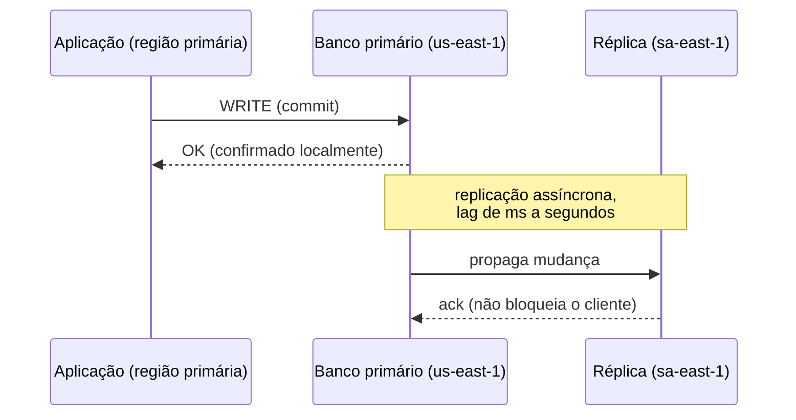
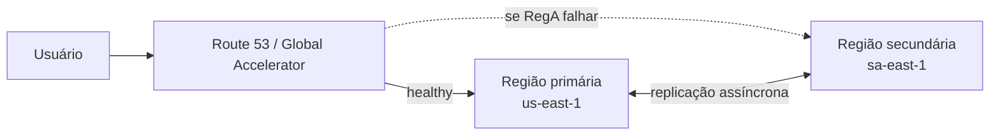
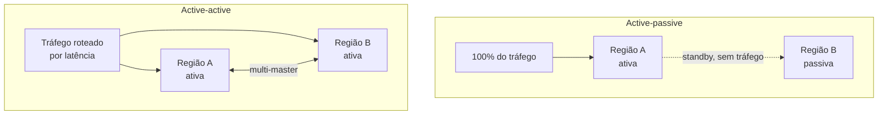

> [!abstract] TL;DR
> Multi-region é o último degrau da escada de resiliência: sobreviver não à queda de um servidor, nem de um datacenter, mas de uma **região inteira** — o continente elétrico e de rede que hospeda tudo. É o nível mais caro e mais complexo, e a maior parte das aplicações do mundo real não precisa dele. A AWS oferece um kit rico pra isso (DynamoDB Global Tables, Aurora Global Database, S3 CRR); a DigitalOcean, por desenho, não — e essa lacuna é ela mesma uma lição sobre o que "resiliência multi-region" custa de fato.

## O problema: quando a região inteira é o ponto único de falha

Nas notas anteriores deste galho você já fechou duas camadas de resiliência: [[03-Dominios/Tecnologia/Cloud/20 - Resiliência e continuidade/02 - Alta disponibilidade|Alta disponibilidade]] tratou de sobreviver à queda de uma instância ou de uma AZ inteira, e [[03-Dominios/Tecnologia/Cloud/20 - Resiliência e continuidade/03 - RTO, RPO e estratégias de DR|RTO, RPO e estratégias de DR]] te deu o vocabulário para decidir *quanto* de indisponibilidade e de perda de dados sua organização tolera. Multi-AZ já resolve a imensa maioria dos incidentes reais: disco que falha, host que trava, rack que perde energia. Mas existe uma categoria de falha que o Multi-AZ não cobre, porque ela atinge a região como um todo — o guarda-chuva sob o qual todas as AZs daquela localização vivem.

Pense na região como uma cidade grande com vários bairros bem isolados entre si (as AZs). Um incêndio num prédio (uma instância) não afeta o bairro vizinho. Um apagão que derruba um bairro inteiro (uma AZ) também não chega aos bairros vizinhos, que têm sua própria subestação elétrica. Mas existem sistemas que são compartilhados pela cidade inteira: a operadora de telecom que interliga os bairros, o serviço de despacho de emergência, o próprio governo municipal. Se um desses sistemas falha — ou se um evento grande o suficiente (terremoto, enchente) atinge a cidade toda —, todos os bairros são afetados ao mesmo tempo, e o fato de você ter réplicas em bairros diferentes não ajuda em nada.

Isso já aconteceu de verdade: interrupções de rede que afetaram múltiplas AZs de uma mesma região simultaneamente, falhas de control plane regional (o plano de controle que gerencia APIs, autoscaling, DNS interno) que tiraram do ar serviços cujo *dado* estava perfeitamente saudável em três AZs, mas cuja *orquestração* dependia de um componente regional único. Multi-AZ resolve "meu hardware falhou". Multi-region resolve "minha região inteira ficou inacessível ou seu control plane degradou".

A pergunta que separa quem precisa de multi-region de quem não precisa não é "seria bom ter?" — quase sempre a resposta é sim, mais resiliência é sempre "boa". A pergunta certa é: **o RTO/RPO que o negócio exige sobrevive a um evento regional, e a organização topa pagar o preço disso?** Porque o preço é real, e vem em quatro moedas: infraestrutura duplicada (2x ou mais o custo de compute e storage), transferência de dados entre regiões (que tem tarifa própria e não é trivial em volume), complexidade operacional (agora você opera *dois* ambientes de produção coordenados, não um), e a mais traiçoeira de todas: consistência de dados, que é o assunto do resto desta nota.

## O mecanismo: replicar dados entre regiões

Diferente do Multi-AZ — onde a replicação síncrona é viável porque as AZs estão a poucos quilômetros e milissegundos de distância —, entre regiões a distância física impõe uma lei da física que nenhuma engenharia contorna: a velocidade da luz. São-Paulo a Norte da Virgínia são ~7.500 km; mesmo em fibra ótica perfeita, isso já são dezenas de milissegundos de ida e volta. Exigir confirmação síncrona de escrita numa região remota, a cada transação, tornaria o banco de dados inutilizável para qualquer aplicação sensível a latência. Por isso, replicação multi-region é, na prática universal, **assíncrona**.



Essa assincronia tem uma consequência inescapável: existe uma **janela de dados não replicados** o tempo todo. Se a região primária cai nesse exato instante, os dados daquela janela — o seu RPO real — estão perdidos, a menos que a estratégia de DR use snapshots que capturem esse estado antes do desastre. É o mesmo raciocínio de RPO que você já viu na nota anterior, agora aplicado à distância entre regiões em vez de à distância entre AZs.

### S3 Cross-Region Replication (CRR)

O Amazon S3 replica objetos automaticamente entre buckets em regiões diferentes assim que a réplica é configurada — mas só objetos *novos ou atualizados* a partir dali (replicação "ao vivo"); objetos que já existiam antes da configuração exigem S3 Batch Replication, um job sob demanda separado. A replicação padrão não tem SLA de tempo; para isso existe o **S3 Replication Time Control (RTC)**, que garante contratualmente 99,9% dos objetos replicados em até 15 minutos.

> [!info] Verificado 2026-07-24 — docs.aws.amazon.com
> CRR exige **versionamento habilitado** em origem e destino. Sem RTC, a AWS estima 24-48h para a maior parte dos objetos em cenários de alto volume (sem SLA); com RTC, 99,9% em 15 minutos, com SLA. Também existe replicação bidirecional (two-way replication) para failover ativo entre buckets.

```bash
# Habilitar versionamento (pré-requisito) e configurar CRR via CLI
aws s3api put-bucket-versioning \
  --bucket meu-bucket-origem \
  --versioning-configuration Status=Enabled

aws s3api put-bucket-replication \
  --bucket meu-bucket-origem \
  --replication-configuration '{
    "Role": "arn:aws:iam::123456789012:role/s3-crr-role",
    "Rules": [{
      "ID": "replica-para-sa-east-1",
      "Status": "Enabled",
      "Priority": 1,
      "Filter": {},
      "Destination": {
        "Bucket": "arn:aws:s3:::meu-bucket-destino-sa-east-1",
        "StorageClass": "STANDARD"
      }
    }]
  }'
```

### DynamoDB Global Tables — multi-master de verdade

Aqui a AWS oferece algo qualitativamente diferente: **Global Tables** não é réplica de leitura, é replicação **multi-ativa** (multi-master) — qualquer réplica em qualquer região aceita leituras *e escritas*, e a AWS propaga as mudanças entre todas as regiões participantes automaticamente.

> [!info] Verificado 2026-07-24 — docs.aws.amazon.com
> Global Tables suporta dois modos de consistência: **MREC** (multi-region eventual consistency, padrão) e **MRSC** (multi-region strong consistency, só em configuração same-account). Conflitos entre escritas concorrentes em regiões diferentes são resolvidos por **last-writer-wins** baseado em timestamp. RPO pode chegar perto de zero porque você simplesmente redireciona tráfego de escrita pra outra região sem esperar promoção de réplica.

O ganho é enorme (RTO praticamente zero para failover de região — não há "promover uma réplica", porque todas já aceitam escrita), mas o preço é que você herda os problemas clássicos de sistemas multi-master: se dois clientes escreverem o mesmo item em regiões diferentes quase simultaneamente, o last-writer-wins descarta uma das escritas silenciosamente. Isso é aceitável para muitos modelos de dado (perfil de usuário, carrinho de compras eventualmente consistente) e perigoso para outros (saldo de conta, contagem de estoque exata) — a ponte natural aqui é o teorema CAP e consistência em sistemas distribuídos, que pertence à trilha de Comunicação entre Sistemas / System Design, não a esta nota.

```bash
# Criar uma Global Table (v2, "current") a partir de uma tabela já existente
aws dynamodb update-table \
  --table-name Pedidos \
  --replica-updates '[{"Create": {"RegionName": "sa-east-1"}}]'

# A tabela "Pedidos" agora aceita leitura/escrita tanto em us-east-1
# quanto em sa-east-1, replicando de forma assíncrona multi-ativa.
```

> [!tip] Assista: AWS DynamoDB Global Tables Demo — Active Active Model, Multi Regional
> **Canal:** Soumil Shah | **Duração:** ~7min | **Idioma:** EN
>
> Demonstração prática de criar uma Global Table e escrever nos dois lados (duas regiões diferentes) pra ver a replicação multi-ativa acontecendo de verdade — bom complemento pro comando `update-table` acima, que mostra a sintaxe mas não o "e depois, o que eu vejo na outra região?". Trecho de destaque [0:11]: *"when mission critical applications are involved which means they need sub second latency and the data has to be highly available"*
>
> 🎬 [Assistir no YouTube](https://www.youtube.com/watch?v=EvB--OgzKEU)

### Aurora Global Database — o meio-termo gerenciado

Aurora Global Database é o ponto intermediário entre "réplica cross-region simples" e "multi-master pleno": existe **um** cluster primário (aceita escrita) e até 10 clusters secundários (só leitura) em regiões diferentes, replicando pela camada de storage do Aurora — não pelo motor do banco — o que dá latência tipicamente **sub-segundo**.

> [!info] Verificado 2026-07-24 — docs.aws.amazon.com
> Aurora Global Database oferece dois mecanismos de mudança de região: **switchover** (antigo "managed planned failover", pra rotação planejada, sem perda de dados) e **failover** (pra recuperar de uma queda real da região primária). Write forwarding permite que clusters secundários encaminhem escritas ao primário sem o app precisar saber qual é o writer atual. Limitação real: não há garantia de zero RPO em failover não planejado — o secundário promovido pode estar alguns milissegundos a segundos atrás do primário no momento da queda.

```bash
# Criar um Aurora Global Database com cluster secundário
aws rds create-global-cluster \
  --global-cluster-identifier pedidos-global \
  --source-db-cluster-identifier arn:aws:rds:us-east-1:123456789012:cluster:pedidos-primary

aws rds create-db-cluster \
  --db-cluster-identifier pedidos-secondary \
  --engine aurora-postgresql \
  --global-cluster-identifier pedidos-global \
  --region sa-east-1
```

Isso conecta diretamente com o que você já viu em [[03-Dominios/Tecnologia/Cloud/09 - Bancos gerenciados/03 - Alta disponibilidade e réplicas|Alta disponibilidade e réplicas]]: lá o assunto era réplica dentro da mesma região (ou cross-region simples do RDS clássico); aqui é a versão *desenhada* para DR entre regiões, com switchover/failover como operação de primeira classe.

Um detalhe que costuma passar despercebido: **write forwarding**. Sem ele, uma aplicação rodando no cluster secundário (que é read-only) precisaria saber, na própria lógica, qual região é a primária pra enviar escritas até lá. Com write forwarding habilitado, o cluster secundário aceita a conexão de escrita normalmente e a encaminha internamente pro primário — a aplicação não precisa saber onde fica o writer real. Isso tem um custo: cada escrita forwarded paga a latência extra da viagem até a região primária e volta, então não é "escrita local" de verdade, é conveniência de conexão.

### Comparando os três mecanismos de dado

A tabela abaixo resume o que cada serviço realmente entrega em termos de RPO, RTO e modelo de consistência — os três eixos que importam pra decidir qual usar em cada camada da sua arquitetura.

| Serviço | Modelo | Escrita em qual região | RPO típico | RTO em failover | Resolução de conflito |
| --- | --- | --- | --- | --- | --- |
| S3 CRR (padrão) | Réplica assíncrona | Só origem | Minutos a ~48h (sem SLA) | Manual (repontar app pro bucket destino) | N/A (write-once por chave) |
| S3 CRR + RTC | Réplica assíncrona com SLA | Só origem | ≤ 15 min (99,9%, com SLA) | Manual | N/A |
| DynamoDB Global Tables | Multi-master (multi-ativo) | Qualquer réplica | Segundos (near-zero) | ~Zero (nenhuma promoção necessária) | Last-writer-wins |
| Aurora Global Database (padrão) | Réplica assíncrona por storage | Só primário (ou via write forwarding) | Sub-segundo, mas não garantido em queda não planejada | Minutos (failover gerenciado) | N/A (single writer) |
| Aurora Global Database (switchover) | Réplica assíncrona por storage | Só primário | Zero (rotação planejada, sem perda) | Minutos, planejado | N/A |

Note o padrão: quanto mais próximo de RPO/RTO zero, mais o serviço precisa ser desenhado como multi-master (Global Tables) — e mais você herda a complexidade de resolução de conflito que isso implica. Não existe almoço grátis: a AWS não eliminou o trade-off CAP, só empacotou cada ponto da curva num produto gerenciado diferente.

## Roteando o tráfego entre regiões

Replicar o dado é metade do problema; a outra metade é fazer o tráfego do usuário chegar na região certa, na hora certa. Isso já foi coberto em profundidade em [[03-Dominios/Tecnologia/Cloud/10 - DNS, CDN e borda/02 - Roteamento DNS avançado|Roteamento DNS avançado]] — aqui vale só o recap aplicado a DR:

- **Failover routing** (Route 53): associa um health check a cada endpoint regional; se o primário fica não-saudável, o DNS passa a responder o IP do secundário. O tempo real de failover soma o intervalo do health check (padrão 30s, configurável para 10s) mais o TTL do registro DNS — clientes com cache de DNS vencido continuam batendo na região morta até o TTL expirar.
- **Latency-based routing**: direciona cada usuário pra região mais próxima — serve tanto para performance (active-active) quanto, combinado a health checks, para resiliência.
- **AWS Global Accelerator**: em vez de depender de propagação de DNS, usa IPs anycast fixos e a própria rede backbone da AWS pra redirecionar tráfego entre regiões em segundos, contornando o problema de TTL de DNS.



Na prática, montar o failover routing acima é declarar um health check apontando pro endpoint da região primária e dois registros de recurso (primário e secundário) referenciando esse health check:

```bash
# 1. Criar o health check que monitora o endpoint da região primária
aws route53 create-health-check \
  --caller-reference "healthcheck-app-primary-2026-07-24" \
  --health-check-config '{
    "IPAddress": "203.0.113.10",
    "Port": 443,
    "Type": "HTTPS",
    "ResourcePath": "/health",
    "RequestInterval": 10,
    "FailureThreshold": 3
  }'

# 2. Registro primário: falha se o health check falhar
aws route53 change-resource-record-sets \
  --hosted-zone-id Z1234567890ABC \
  --change-batch '{
    "Changes": [{
      "Action": "UPSERT",
      "ResourceRecordSet": {
        "Name": "app.exemplo.com",
        "Type": "A",
        "SetIdentifier": "primary",
        "Failover": "PRIMARY",
        "TTL": 30,
        "ResourceRecords": [{"Value": "203.0.113.10"}],
        "HealthCheckId": "abcd1234-health-check-id"
      }
    }]
  }'
```

Repare no `TTL: 30` — é a alavanca que você controla diretamente: TTL baixo (30-60s) encurta o tempo até que clientes com cache expirado passem a resolver pro secundário, mas aumenta o volume de queries de DNS (e, na AWS, o custo de Route 53 é por consulta). `FailureThreshold: 3` com `RequestInterval: 10` significa que o health check só declara a região não-saudável depois de 3 falhas consecutivas em janelas de 10s — ou seja, ~30s de detecção antes mesmo de começar a propagar o failover. Some isso ao TTL e você tem o RTO real de um failover DNS-based, tipicamente na casa de 1-2 minutos, nunca instantâneo.

> [!tip] Assista: Amazon Route 53 — DNS, Routing Policies, Hybrid DNS e ARC (SOA-C03, Seção 21)
> **Canal:** Jean Diogo | **Duração:** ~30min | **Idioma:** PT-BR
>
> Aula completa em português que passa pelos mesmos health checks e failover routing que o bloco de comandos acima materializa — útil pra ver o mesmo conceito explicado com outras palavras antes de aplicar a sintaxe da AWS CLI. Trecho de destaque [17:52]: *"failover a passive, que é um destino... health check do primeiro passa, todo o [tráfego vai pra ele]"*
>
> 🎬 [Assistir no YouTube](https://www.youtube.com/watch?v=bAqJhv6AkI4)

## Active-passive vs. active-active

Como já foi adiantado em [[03-Dominios/Tecnologia/Cloud/20 - Resiliência e continuidade/03 - RTO, RPO e estratégias de DR|RTO, RPO e estratégias de DR]], multi-region pode ser implementado em dois espíritos bem diferentes:

- **Active-passive**: uma região serve todo o tráfego; a outra fica de prontidão (pilot light, warm standby ou hot standby, conforme o quanto já está rodando lá). Mais simples de raciocinar — sempre há uma "fonte da verdade" única — mas a região secundária é, por definição, capacidade paga e ociosa na maior parte do tempo.
- **Active-active**: as duas regiões servem tráfego real simultaneamente, geralmente roteado por proximidade geográfica (latency-based routing). RTO praticamente zero — a região secundária já está "quente" e recebendo tráfego —, mas exige que seu banco de dados suporte multi-master (Global Tables, ou aplicações desenhadas com particionamento por região) e que sua aplicação tolere a divergência eventual entre regiões.

Não existe "o certo" aqui — é uma escolha de arquitetura amarrada ao RTO/RPO que o negócio exige e ao quanto a equipe consegue operar. Ambientes active-active multi-master são poderosos e caros de operar corretamente; a maioria das empresas que afirma precisar de active-active na verdade precisa de um active-passive bem testado.



### Caso prático: um e-commerce decidindo o nível de multi-region

Vale amarrar tudo isso a uma decisão concreta. Imagine um e-commerce de médio porte, hoje operando Multi-AZ numa única região, avaliando se vale a pena ir multi-region. A equipe levanta três cenários de dado:

1. **Catálogo de produtos** (leitura pesada, escrita rara, tolera alguns segundos de defasagem): candidato natural a **DynamoDB Global Tables** ou a réplicas de leitura cross-region simples — o catálogo pode ser servido localmente em cada região sem risco real de conflito, já que a escrita (atualização de produto) é rara e vem de um único sistema administrativo.
2. **Carrinho de compras e sessão** (escrita frequente, tolera eventual consistency, conflito raro e de baixo impacto se resolvido por last-writer-wins): também bom candidato a Global Tables — se dois dispositivos do mesmo usuário escreverem o carrinho quase ao mesmo tempo em regiões diferentes, perder a menor das duas escritas é um incômodo, não um incidente.
3. **Pedidos e pagamento** (escrita crítica, exige consistência forte, conflito é inaceitável — não pode "perder" um pagamento por last-writer-wins): aqui a equipe conclui que multi-master é a escolha errada. A decisão é **active-passive** com Aurora Global Database: um cluster primário único aceita todas as escritas de pedido, o secundário fica em standby pronto pra switchover, e o RPO aceito (poucos segundos, o lag sub-segundo do Aurora Global Database) é coberto pelo processo de reconciliação pós-failover já descrito na nota de RTO/RPO.

O resultado não é "tudo multi-master" nem "tudo active-passive" — é uma decisão *por domínio de dado*, orientada pelo quanto cada um tolera de divergência. Essa é a pergunta que toda decisão multi-region real acaba fazendo: não "qual tecnologia é mais moderna", mas "o que esse dado específico pode tolerar perder ou divergir".

## Compliance e residência de dados como motor

Nem toda decisão multi-region nasce de resiliência. Regulações como GDPR (Europa), LGPD (Brasil) ou exigências setoriais podem obrigar que dados de cidadãos de certa jurisdição *nunca saiam* daquela região geográfica — isso é **data residency**, e é abordado com mais profundidade no domínio de Segurança e Compliance deste vault. Quando esse é o motivador, a arquitetura multi-region não é sobre DR: é sobre **particionamento de dados por região**, com cada região servindo exclusivamente os usuários daquela jurisdição, sem replicação cruzada de dados pessoais — um desenho bem diferente do "réplica de tudo em todo lugar" que buscamos em DR pura.

## A lente DigitalOcean: honestidade sobre a lacuna

Esta é a nota do galho onde a diferença entre os dois provedores é mais gritante, e vale nomear isso sem meio-termo: a DigitalOcean **não tem** um equivalente de DynamoDB Global Tables, nem de Aurora Global Database, nem de S3 Cross-Region Replication nativo.

> [!info] Verificado 2026-07-24 — docs.digitalocean.com
> A documentação de Spaces (o object storage compatível com S3 da DO) não descreve nenhum recurso nativo de replicação entre regiões; a orientação oficial é usar ferramentas de terceiros como **rclone** para mover/sincronizar dados entre regiões de Spaces manualmente. Não há um recurso "Global Tables" para os bancos gerenciados da DO — réplicas de leitura existem, mas o modelo de DR cross-region documentado pela AWS (switchover gerenciado, write forwarding, multi-master automático) simplesmente não tem paralelo na DO.

O que isso significa na prática para quem constrói sobre DigitalOcean e precisa de resiliência multi-region:

- **Storage (Spaces)**: replicação cross-region é um script seu, rodando rclone (ou similar) em algum agendamento, sem garantia de SLA, sem replicação "ao vivo" nativa. Você constrói e opera essa peça.
- **Bancos gerenciados**: réplicas de leitura existem, mas o cenário de failover completo entre datacenters (promover réplica, redirecionar app, garantir consistência) é uma orquestração manual sua — não um botão "switchover" gerenciado como no Aurora Global Database.
- **Roteamento**: a DO tem DNS com registros de failover básicos, mas não tem um equivalente direto ao Global Accelerator com rede backbone própria contornando TTL de DNS.

Concretamente, "replicar Spaces entre regiões" na DO significa algo deste tipo, agendado como cron job ou pipeline, sem SLA de tempo e sem os metadados de replicação que o S3 mantém nativamente (status por objeto, métricas de replicação no CloudWatch):

```bash
# Sincronizar (não "replicar ao vivo") um Space nyc3 para um Space sgp1
# usando rclone — a via oficialmente recomendada pela DO
rclone sync \
  do-nyc3:meu-bucket-origem \
  do-sgp1:meu-bucket-destino-sgp1 \
  --transfers 8 \
  --checkers 16

# Isso precisa ser reagendado (cron, GitHub Actions, etc.) — não há
# gatilho nativo "a cada escrita nova, replicar", como no S3 CRR.
```

Isso não é "a DO é pior" em abstrato — é que multi-region de verdade, com RPO baixo e failover rápido, é um problema que a AWS resolveu na investe em construir produtos gerenciados dedicados, enquanto a DO manteve seu catálogo deliberadamente mais simples e mais barato. Se sua organização precisa de DR multi-region rigoroso (RPO em segundos, RTO em minutos), isso pesa concretamente na escolha de provedor — ou te obriga a construir e operar você mesmo a camada de replicação que a AWS te vende pronta.

### Tabela de tradução: nomes equivalentes em Azure e GCP

Só pra orientação de vocabulário — sem hands-on nestas duas, o foco deste vault continua sendo a lente AWS ↔ DigitalOcean:

| Conceito | AWS | Azure | GCP | DigitalOcean |
| --- | --- | --- | --- | --- |
| Replicação de objeto entre regiões | S3 Cross-Region Replication | Azure Storage GRS/GZRS (geo-redundant) | GCS Dual-region / Multi-region buckets | Sem nativo (rclone manual) |
| Banco relacional multi-região gerenciado | Aurora Global Database | Azure SQL Auto-failover groups | Cloud Spanner (multi-region nativo) | Sem equivalente direto |
| NoSQL multi-master | DynamoDB Global Tables | Cosmos DB multi-region write | Cloud Spanner / Firestore multi-region | Sem equivalente |
| DNS com failover/latência | Route 53 | Azure Traffic Manager | Cloud DNS + Load Balancing | DNS com failover básico |
| Aceleração de rede global | Global Accelerator | Azure Front Door | Cloud CDN + Premium Tier Network | Sem equivalente direto |

> [!warning] Armadilhas reais de multi-region
> - **Split-brain em active-active mal desenhado**: duas regiões aceitando escritas conflitantes no mesmo registro sem estratégia de resolução de conflito clara é a receita pra corrupção de dado silenciosa — descoberta semanas depois, em auditoria.
> - **Custo de transferência entre regiões subestimado**: replicar terabytes por dia entre regiões tem tarifa de transferência de dados que cresce rápido e raramente aparece na estimativa inicial de custo.
> - **Testar o failover só na cabeça**: um plano de DR multi-region nunca testado é uma hipótese, não uma capacidade. A nota seguinte deste galho trata exatamente de como testar isso na prática.
> - **Confundir "eu tenho dados em duas regiões" com "eu tenho DR"**: ter uma réplica não é a mesma coisa que ter um runbook testado de promoção, DNS, e validação pós-failover.
> - **Ignorar a tensão com FinOps**: cada camada de resiliência multi-region citada aqui dobra (ou mais) a fatura de infraestrutura — a decisão de ir multi-region é, goste ou não, também uma decisão de orçamento, tema do galho anterior deste domínio.

## Quando multi-region é a escolha errada

Depois de duas seções inteiras de "como fazer", vale a pena um contrapeso deliberado: pra maioria das aplicações, multi-region é over-engineering. Os sinais de que sua organização provavelmente **não** precisa disso agora:

- O RTO/RPO que o negócio realmente exige (não o que soa impressionante numa reunião) já é atendido por Multi-AZ mais um plano de DR bem testado dentro da mesma região — a nota anterior deste galho cobriu exatamente esse leque de estratégias (backup/restore, pilot light, warm standby dentro da própria região).
- A base de usuários está concentrada geograficamente — não há ganho de latência por servir de duas regiões, só o custo de operar duas.
- A equipe de operação ainda não tem maturidade pra rodar *um* ambiente de produção com folga — multiplicar isso por dois antes de dominar o primeiro é multiplicar o risco operacional, não reduzi-lo.
- Não existe exigência regulatória de residência de dados forçando a decisão.

Multi-region resolve um problema real (perda de região inteira, ou exigência de residência de dados), mas é fácil confundir "seria tecnicamente impressionante" com "é necessário". A disciplina de FinOps do galho anterior deste domínio existe exatamente pra essa conversa: cada região adicional citada nesta nota dobra (no mínimo) a fatura de infraestrutura, e vale perguntar sempre — dobrar o RTO/RPO restante justifica dobrar o custo?

## O que vem a seguir

A próxima nota deste galho fecha o ciclo prático: backup como disciplina operacional, e sobretudo o hábito — frequentemente negligenciado — de *testar* a restauração e o failover antes que um desastre real force o teste. Depois dela, o capstone do Bloco 4 aplica tudo (Multi-AZ, RTO/RPO, DR, multi-region, backup testado) contra a arquitetura de referência construída ao longo da trilha, decidindo com honestidade o que ela de fato precisa.

## Fontes

- [DynamoDB Global Tables — Developer Guide](https://docs.aws.amazon.com/amazondynamodb/latest/developerguide/GlobalTables.html)
- [Amazon Aurora Global Database — User Guide](https://docs.aws.amazon.com/AmazonRDS/latest/AuroraUserGuide/aurora-global-database.html)
- [Replicating objects within and across Regions (S3)](https://docs.aws.amazon.com/AmazonS3/latest/userguide/replication.html)
- [Creating Amazon Route 53 health checks (DNS failover)](https://docs.aws.amazon.com/Route53/latest/DeveloperGuide/dns-failover.html)
- [DigitalOcean Spaces documentation](https://docs.digitalocean.com/products/spaces/)
- [AWS Global Accelerator — How it works](https://docs.aws.amazon.com/global-accelerator/latest/dg/introduction-how-it-works.html)
