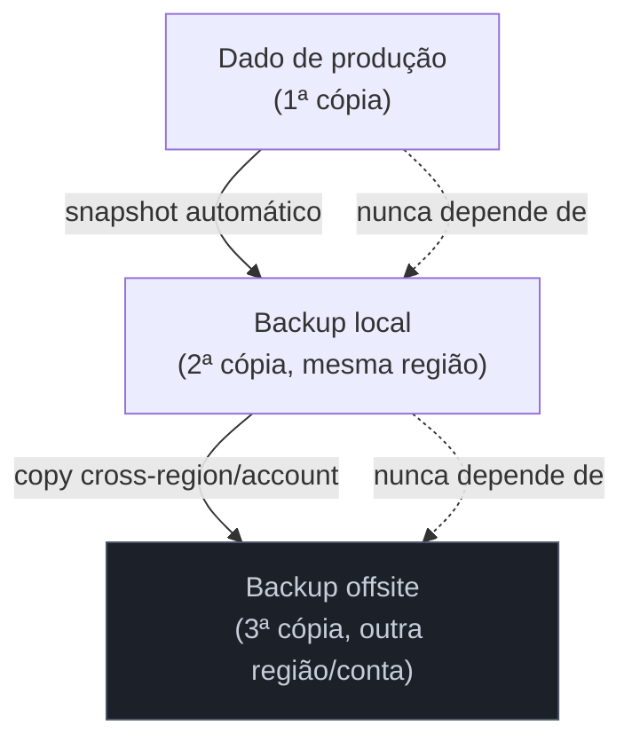
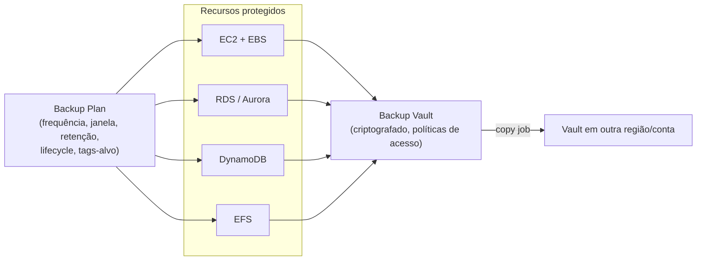
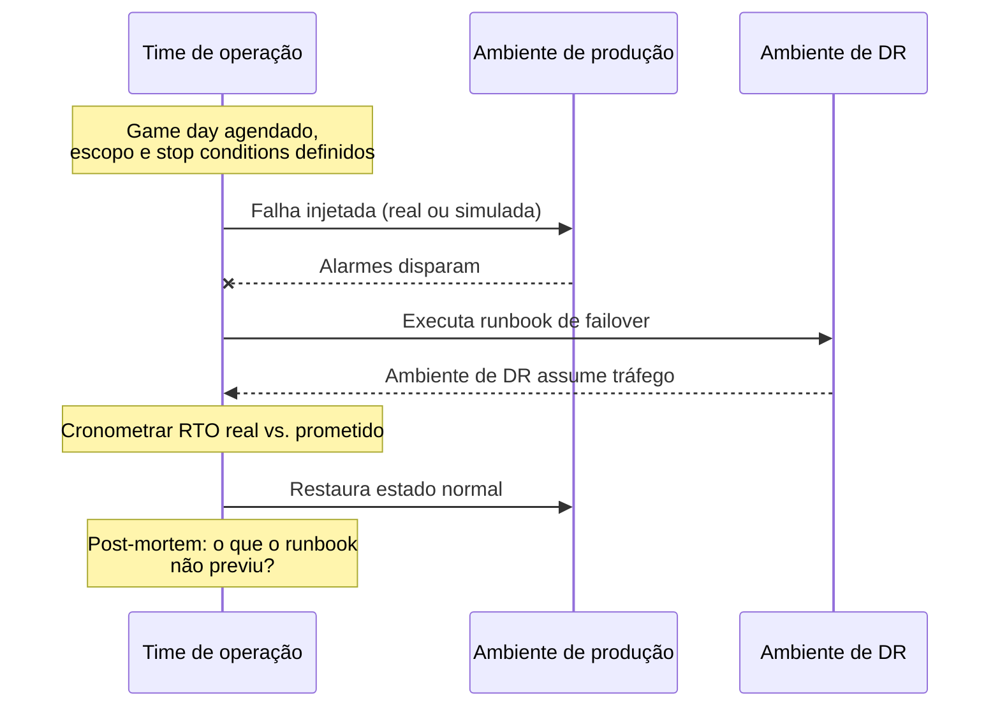

# Backup, continuidade e teste

> [!abstract] TL;DR
> As três notas anteriores deste galho resolveram "o que acontece quando uma zona, uma região ou um componente inteiro cai" — réplicas, failover, Multi-AZ, multi-region. Esta nota fecha o Bloco 4 respondendo a pergunta que sobra depois de toda essa arquitetura: **e se o dado em si estiver errado, apagado ou sequestrado?** Nenhuma réplica síncrona ajuda contra isso — ela replica o erro com a mesma fidelidade que replicaria uma escrita legítima, exatamente como a nota 04 do galho de Bancos gerenciados já mostrou para um único `DROP COLUMN`. Backup é a resposta a essa segunda metade do problema, e esta nota trata três camadas que se empilham: **estratégia de backup** (3-2-1, automação, retenção, AWS Backup como orquestrador central), **imutabilidade** (Vault Lock, a defesa que nem o root consegue burlar) e — a peça mais frequentemente ignorada — **testar** que tudo isso de fato restaura e falha da forma esperada, seja via drill manual de DR, seja injetando falha de propósito com AWS Fault Injection Service. Um backup nunca restaurado, e um plano de DR nunca exercitado, não são garantias: são suposições vestidas de garantia.

## O problema: o backup que existia, mas não voltava

Uma manutenção noturna descobre, sete meses depois de configurada, uma política de exclusão automática que apaga logs "antigos" de um bucket — só que o filtro usado por engano também capturava os dumps de banco de dados guardados ali como backup de longo prazo. Não houve alarme: cada `DELETE` foi bem-sucedido, exatamente como o serviço deveria se comportar. Na manhã seguinte, um incidente de corrupção de dado em produção exige restaurar de um desses dumps — e não existe mais nenhum. A empresa tinha "backup" no sentido de que um processo rodava e gerava arquivos; não tinha proteção real, porque nunca havia testado se conseguiria de fato recuperar algo daquele processo, e nunca havia isolado esses arquivos de exclusão acidental (ou maliciosa).

Esse cenário concentra três falhas distintas que esta nota separa uma da outra: falta de **estratégia** (backup disperso, sem orquestração central, sem cópia isolada); falta de **imutabilidade** (nada impedia a exclusão, seja por engano seja por invasor); e falta de **teste** (ninguém jamais tinha restaurado daquele conjunto de arquivos para confirmar que o processo funcionava fim a fim). Ter um `cron` rodando `pg_dump` todo dia não é uma estratégia de backup — é um script sem dono, sem SLA de retenção, sem proteção contra deleção e sem prova de que restaura.

> [!info] Onde backup automatizado por serviço gerenciado já foi tratado
> Backup automático, PITR e snapshot manual de um banco gerenciado específico (RDS/Managed Databases) já foram cobertos em profundidade mecânica em [[03-Dominios/Tecnologia/Cloud/09 - Bancos gerenciados/04 - Backups, PITR e manutenção|Backups, PITR e manutenção]]. Esta nota não repete aquela mecânica — ela sobe um nível de abstração: como orquestrar backup *através* de múltiplos serviços (não só um banco), como proteger esse backup contra exclusão deliberada, e como saber se ele de fato funciona quando chega a hora.

## A regra 3-2-1 e o que ela força a decidir

A regra 3-2-1 é o ponto de partida canônico de qualquer estratégia de backup, e vale porque força três perguntas que sozinhas já eliminam a maioria dos desastres de "eu tinha backup, mas": manter **3 cópias** do dado (a original mais duas cópias — porque uma única cópia extra ainda é um ponto único de falha), em **2 mídias/locais diferentes** (não adianta ter três cópias no mesmo disco, ou três snapshots na mesma região), e **1 cópia fora do site** (offsite — outra região, outra conta, idealmente outro provedor para o cenário mais extremo).



Na nuvem, "2 mídias diferentes" costuma virar "2 serviços/mecanismos diferentes" (snapshot de bloco + export para object storage, por exemplo), e "offsite" vira cross-region ou cross-account — exatamente o mecanismo que a nota 04 de Bancos gerenciados já mostrou para `copy-db-snapshot`. O ponto que a regra força é simples de enunciar e fácil de pular: **se as três cópias moram na mesma conta AWS, uma credencial de root comprometida ameaça as três ao mesmo tempo**. Isolamento de conta (ou de provedor) é o que transforma "3-2-1" de checklist burocrática em proteção real contra o cenário mais sério — uma conta inteira comprometida.

## AWS Backup: orquestração central sobre serviços que já fazem backup sozinhos

Antes de existir um serviço dedicado, cada serviço AWS fazia backup do seu próprio jeito — RDS com seu ciclo de snapshot+log, EBS com snapshots próprios, DynamoDB com seu mecanismo de point-in-time recovery isolado. Cada um funcionava, mas cada um exigia configurar, monitorar e auditar separadamente — o tipo de fragmentação operacional que faz um time descobrir, só na hora do incidente, que um dos quinze bancos da conta nunca teve backup habilitado porque ninguém tinha revisado aquela configuração específica.

**AWS Backup** existe para fechar exatamente essa lacuna: um serviço gerenciado que centraliza e automatiza proteção de dado através de múltiplos serviços AWS — EC2/EBS, S3, RDS e Aurora, DynamoDB, EFS, FSx, DocumentDB, Neptune, Redshift, entre outros — a partir de um único console, uma única API, e um conceito central chamado **backup plan**: uma política que define frequência, janela, retenção e regras de lifecycle, aplicada a recursos por tag ou seleção explícita, de forma consistente através de toda a conta (ou de toda a organização, via AWS Organizations).



Segundo a documentação oficial da AWS, o serviço permite aplicar **políticas baseadas em tag**, transicionar backups automaticamente para armazenamento frio via **lifecycle policies** (reduzindo custo sem intervenção manual), copiar backups entre regiões (**cross-Region**) e entre contas dentro de uma AWS Organization (**cross-account**, no padrão "fan-in/fan-out": consolidar backups de várias contas numa conta-repositório, e depois distribuir cópias de volta para maior resiliência), e monitorar tudo isso via um dashboard central integrado a CloudWatch, EventBridge, CloudTrail e SNS. Recursos com **full AWS Backup management** ganham ainda criptografia independente (chave KMS do vault, não a mesma do recurso de origem) e ARNs próprios (`arn:aws:backup:...`) que permitem políticas de acesso específicas para o backup, separadas das políticas do recurso original.

Criar um plano que cobre todos os recursos com uma tag `backup: diario`, com retenção de 35 dias e cópia cross-region automática:

```bash
$ aws backup create-backup-plan --backup-plan '{
  "BackupPlanName": "plano-producao-diario",
  "Rules": [{
    "RuleName": "regra-diaria",
    "TargetBackupVaultName": "vault-producao",
    "ScheduleExpression": "cron(0 5 * * ? *)",
    "Lifecycle": { "DeleteAfterDays": 35 },
    "CopyActions": [{
      "DestinationBackupVaultArn": "arn:aws:backup:sa-east-1:123456789012:backup-vault:vault-dr",
      "Lifecycle": { "DeleteAfterDays": 90 }
    }]
  }]
}'

$ aws backup create-backup-selection \
    --backup-plan-id plan-a1b2c3d4-e5f6-7890 \
    --backup-selection '{
      "SelectionName": "recursos-tag-diario",
      "IamRoleArn": "arn:aws:iam::123456789012:role/AWSBackupDefaultServiceRole",
      "ListOfTags": [{ "ConditionType": "STRINGEQUALS", "ConditionKey": "backup", "ConditionValue": "diario" }]
    }'
```

| Camada | Sem AWS Backup | Com AWS Backup |
|---|---|---|
| Configuração de retenção | Por serviço, individualmente | Centralizada num backup plan |
| Cross-region/cross-account | Comando manual por recurso | `CopyActions` automático no plano |
| Auditoria de "o que está protegido" | Consultar cada serviço separadamente | Dashboard e Backup Audit Manager central |
| Billing | Espalhado pelo custo de cada serviço | Consolidado sob "Backup" no Cost Explorer |
| Cobertura de novo recurso | Exige configurar backup de novo, manualmente | Tag na criação já entra no plano existente |

## Imutabilidade: Vault Lock contra ransomware e exclusão (mesmo por acidente)

Um backup plan bem configurado ainda tem um ponto cego: nada, por si só, impede que alguém com credenciais de administrador — legítimas ou roubadas — delete o backup inteiro. Contra esse cenário específico, a AWS Backup oferece **Vault Lock**, que aplica um modelo write-once-read-many (WORM) ao vault inteiro, em dois modos com garantias muito diferentes entre si.

Em **modo Governance**, o lock pode ser removido por usuários com permissão IAM suficiente — protege contra erro operacional comum, mas não contra um invasor que já tem acesso administrativo. Em **modo Compliance**, depois que o período de carência (*grace time*, no mínimo 72 horas) expira, o vault e seu lock se tornam **imutáveis para sempre** — segundo a documentação oficial, nenhum usuário, "incluindo o usuário root", e nem a própria AWS, conseguem alterá-lo ou excluí-lo enquanto houver recovery points dentro. É o mesmo princípio do Object Lock em modo Compliance do S3, já tratado na trilha de Armazenamento — aqui aplicado ao vault de backup como um todo, não a um objeto individual.

```bash
# Bloquear um vault em modo Compliance, com 3 dias de carência
# e retenção mínima/máxima obrigatória para qualquer backup que entrar nele
$ aws backup put-backup-vault-lock-configuration \
    --backup-vault-name vault-producao \
    --changeable-for-days 3 \
    --min-retention-days 7 \
    --max-retention-days 365
```

> [!warning] Compliance mode não tem botão de desfazer
> Assim como o Object Lock do S3, uma vez que o grace time expira, não existe comando, permissão ou intervenção de suporte AWS que reverta o lock — mesmo que alguém descubra, meses depois, que configurou `MaxRetentionDays` errado por uma ordem de grandeza. A prática recomendada da própria documentação é testar a configuração em Governance mode primeiro, e só migrar para Compliance depois de validar os números.

## Continuidade de negócio: o plano além da infraestrutura

Tudo até aqui — backup, replicação, Multi-AZ, multi-region — é a camada técnica. Um **Business Continuity Plan (BCP)** é mais amplo: cobre quem decide declarar um desastre, qual canal de comunicação a empresa usa quando o Slack normal também está fora do ar, qual fornecedor terceiro precisa ser acionado, e qual processo manual substitui temporariamente um sistema fora do ar (um restaurante que volta a anotar pedido em papel quando o PDV cai, por exemplo). RTO e RPO — já definidos na nota 03 deste galho — são os números técnicos que um BCP herda e usa para prometer um SLA de recuperação ao negócio; o BCP em si é o documento e o treinamento humano por trás desses números, não outra ferramenta de nuvem. Esta nota não aprofunda BCP como disciplina — ele pertence mais a gestão de risco corporativo do que a arquitetura de nuvem — mas ignorá-lo por completo é o erro mais caro que um time técnico comete: um DR tecnicamente perfeito, sem ninguém sabendo quem aperta o botão às três da manhã de um feriado, ainda falha.

## Testar o DR: o restore nunca exercitado não é backup

Esta é a seção que devolve à prática o alerta da abertura. Um plano de disaster recovery, por mais bem desenhado que esteja no papel — runbooks, RTO/RPO definidos, réplicas cross-region prontas — só vale alguma coisa depois de ser **exercitado de verdade**, sob condição próxima da real. A indústria chama esse exercício de **game day** (ou **DR drill**): um evento agendado, com escopo e blast radius controlados, em que o time deliberadamente falha um componente real (ou simula fielmente essa falha) e observa se o processo de recuperação funciona como o runbook promete — dentro do RTO prometido, sem dependência esquecida, sem security group que não foi recriado, sem certificado que expirou na réplica fria.



O tipo mais básico e mais frequentemente pulado é o **restore test**: pegar um backup de produção — o mesmo que a seção anterior configurou — e de fato restaurá-lo, periodicamente, num ambiente isolado, confirmando que o dado vem íntegro e que o processo de restore completa dentro do tempo esperado. A própria AWS Backup cobra separadamente por essa prática (**restore testing**, listado na página de pricing do serviço) precisamente porque reconhece que times pulam esse passo quando ele exige esforço manual — automatizar o restore test regular é o que transforma "acho que meu backup funciona" em "sei que meu backup funciona, porque testei semana passada".

> [!warning] Backup nunca restaurado é uma suposição, não uma garantia
> É a mesma armadilha central da nota 04 de Bancos gerenciados, generalizada: parameter group customizado, security group específico, certificado, configuração de rede — nada disso necessariamente acompanha um backup restaurado automaticamente. A primeira vez que alguém descobre uma dessas lacunas não deveria ser durante o incidente real de produção.

## Chaos engineering: injetar a falha antes que ela escolha o pior momento

Game days costumam ser eventos manuais, agendados, de escopo amplo. **Chaos engineering** é a versão sistemática e frequentemente automatizada da mesma ideia: injetar falhas controladas — deliberadamente, em produção ou em pré-produção — para descobrir fraquezas de resiliência antes que um incidente real as exponha no pior momento possível. A AWS oferece essa capacidade como serviço gerenciado: **AWS Fault Injection Service (FIS)**.

Segundo a documentação oficial, o FIS é "baseado nos princípios de chaos engineering" e organiza um experimento em torno de três conceitos: **actions** (o que fazer — parar uma instância, injetar latência de rede, aumentar uso de CPU, forçar failover de um cluster RDS), **targets** (em quais recursos — selecionados por ID ou por critério, como tag ou estado), e **stop conditions** (um alarme do CloudWatch que, se disparado, interrompe o experimento automaticamente — o mecanismo que torna seguro rodar isso mesmo em produção). A própria documentação recomenda com ênfase: planeje e rode primeiro em pré-produção antes de levar um experimento novo para produção.

```bash
$ aws fis create-experiment-template --cli-input-json '{
  "description": "Simular perda de uma instância RDS Multi-AZ",
  "targets": {
    "rdsInstance": {
      "resourceType": "aws:rds:cluster",
      "resourceArns": ["arn:aws:rds:us-east-1:123456789012:cluster:producao-pedidos"],
      "selectionMode": "ALL"
    }
  },
  "actions": {
    "forcarFailover": {
      "actionId": "aws:rds:failover-db-cluster",
      "targets": { "Clusters": "rdsInstance" }
    }
  },
  "stopConditions": [{
    "source": "aws:cloudwatch:alarm",
    "value": "arn:aws:cloudwatch:us-east-1:123456789012:alarm:latencia-alta-pedidos"
  }],
  "roleArn": "arn:aws:iam::123456789012:role/FISExperimentRole"
}'

$ aws fis start-experiment --experiment-template-id EXT12ab34cd56ef
```

Esse comando específico de failover forçado é, na prática, um teste automatizado do mesmo Multi-AZ tratado na nota 02 deste galho — a diferença é que em vez de esperar uma falha real acontecer para descobrir se o failover funciona dentro do tempo prometido, o time provoca essa falha de propósito, num horário controlado, com stop condition pronta para abortar se algo sair muito errado.

> [!tip] Assista: Teste de Caos explicado em 10 minutos
> **Canal:** Alan Void | **Duração:** ~10min | **Idioma:** PT-BR
>
> Explica o "porquê" por trás do comando FIS acima: teste de caos não é sobre quebrar produção por esporte, é sobre provar resiliência e confiabilidade de forma controlada, antes que uma falha real escolha o pior momento pra acontecer sozinha. Trecho de destaque [0:57]: *"forma a resiliência e a confiabilidade"*
>
> 🎬 [Assistir no YouTube](https://www.youtube.com/watch?v=LLhXiYWQqdU)

> [!info] Fronteira forte com Operação
> Chaos engineering, game days e a disciplina de resposta a incidente (quem é acionado, como se comunica, como se conduz um post-mortem sem culpa) são práticas centrais de SRE — e vivem, como disciplina, no domínio Engenharia/Operação deste vault (ver [[03-Dominios/Engenharia/Operação/index|Operação]]). Esta nota cobre a ferramenta gerenciada que a AWS oferece para executar essa prática (FIS) — não a disciplina inteira de como um time de operação estrutura seu programa de resiliência ao longo do tempo.

### Lente dupla: a DigitalOcean, com honestidade sobre o que falta

A DigitalOcean cobre bem a camada de backup do dia a dia, mas não tem hoje um serviço equivalente a AWS Backup (orquestração centralizada cross-serviço) nem a AWS FIS (chaos engineering gerenciado) — é importante marcar essa ausência com clareza, em vez de forçar uma equivalência que não existe.

Para **Droplets**, a DO oferece duas camadas distintas, com nomes que merecem atenção porque não significam a mesma coisa: **backups automáticos** (semanais ou diários, tirados pela própria plataforma, com retenção fixa curta) e **snapshots** (sob demanda, retidos até deleção explícita — o mesmo papel do snapshot manual do RDS).

| Opção | Frequência | Retenção | Custo |
|---|---|---|---|
| Backup diário | 7 backups | 7 dias | 30% do custo do Droplet |
| Backup semanal | 4 backups | 4 semanas | 20% do custo do Droplet |
| Snapshot sob demanda | Manual | Até deleção explícita | Cobrado por GB armazenado/mês |

> [!info] Caducidade
> Percentuais de custo de backup de Droplet (30% diário / 20% semanal) e a estrutura de retenção verificados na página oficial de pricing da DigitalOcean em 2026-07-24. Confirme o valor vigente antes de orçar — políticas de preço de infraestrutura tendem a mudar com mais frequência que mecânica de produto.

Para **Managed Databases**, a mecânica de backup diário + PITR de 7 dias e o conceito de *fork* (restaurar sempre criando um cluster novo) já foram tratados em detalhe na nota 04 de Bancos gerenciados — vale reler aquela nota para a mecânica, esta apenas recorda o fato para a lente dupla.

Sobre imutabilidade: assim como a nota de Versioning e proteção do galho de Armazenamento já registrou para o DigitalOcean Spaces, a documentação pública da DO **não descreve** um mecanismo equivalente a Vault Lock ou Object Lock para backups de Droplet ou de banco gerenciado — não existe hoje um "modo Compliance" nativo que torne um backup da DO impossível de apagar antes de um prazo, nem para o próprio dono da conta. Quem precisa dessa garantia regulatória específica, operando primariamente na DO, precisa somar uma camada própria (exportar backups para um destino com imutabilidade nativa, por exemplo).

Sobre chaos engineering: a DO não oferece um serviço gerenciado equivalente ao FIS. Um time operando ali que queira praticar chaos engineering precisa recorrer a ferramenta open source rodando por conta própria (como Chaos Mesh ou Litmus, tipicamente sobre Kubernetes) — a prática é possível, mas exige montar e operar a ferramenta, não vem como um botão do provedor.

| Capacidade | AWS | DigitalOcean |
|---|---|---|
| Backup de compute | Snapshot de EBS/EC2, orquestrado via AWS Backup | Backup de Droplet (diário/semanal) + snapshot sob demanda |
| Orquestração central cross-serviço | AWS Backup (plans, tags, um console) | Não existe — cada recurso configurado separadamente |
| Cross-region/cross-account nativo | Sim, `CopyActions` no backup plan | Snapshot pode ser copiado manualmente para outra região |
| Imutabilidade (WORM) | Vault Lock (Governance/Compliance) | Não documentado — ausente |
| Chaos engineering gerenciado | AWS FIS | Não existe — requer ferramenta própria/open source |

### Tabela de tradução: Azure e GCP

| Conceito | AWS | Azure | GCP |
|---|---|---|---|
| Orquestração central de backup | AWS Backup | Azure Backup | Backup and DR Service |
| Imutabilidade de backup | Backup Vault Lock (Governance/Compliance) | Immutable vaults (soft delete + immutability) | Backup Vault com bucket lock |
| Chaos engineering gerenciado | AWS Fault Injection Service (FIS) | Azure Chaos Studio | Não há serviço gerenciado equivalente direto (comum usar ferramentas open source sobre GKE) |
| Cross-region backup | Copy actions no backup plan | Geo-redundant storage (GRS) para o vault | Backups multi-region no Backup Vault |

> [!info] Caducidade
> Nomes de produto de Azure e GCP para orquestração de backup e chaos engineering verificados via pesquisa em documentação pública em 2026-07-24; sem hands-on nesta nota — confirme a documentação vigente do provedor específico antes de qualquer decisão de arquitetura.

## Casos práticos

**O ransomware que não conseguiu apagar o backup.** Um invasor obtém credenciais de administrador de uma conta AWS através de uma chave de API vazada em um repositório público, e começa a criptografar volumes EBS de produção. O time detecta o incidente via alarme de atividade anômala e restaura os volumes a partir de snapshots recentes, geridos por um AWS Backup plan com vault em modo Compliance — o invasor, mesmo com credenciais de administrador, nunca conseguiu apagar ou alterar os backups, porque o Vault Lock em modo Compliance não reconhece nenhuma credencial, nem a root, como suficiente para isso antes do prazo de retenção vencer.

**O game day que revelou uma dependência esquecida.** Um time roda um game day trimestral simulando queda total da região primária. O failover para a região de DR funciona dentro do RTO prometido para o banco de dados e para as instâncias de aplicação — mas o processo trava porque um serviço de terceiros (gateway de pagamento) só tinha IP allowlist configurado para o CIDR da região primária, nunca replicado para a secundária. O game day custou um trimestre de esforço de planejamento; descobrir esse detalhe durante um incidente real teria custado o SLA de RTO inteiro, na frente do cliente.

**O experimento de FIS que provou o auto-scaling.** Antes de um evento de tráfego alto conhecido com antecedência (Black Friday, por exemplo), um time roda um experimento de FIS que termina abruptamente 30% das instâncias de um Auto Scaling Group em produção, com uma stop condition atrelada à latência p99 da aplicação. O objetivo não é simular um desastre aleatório — é confirmar, com uma prova concreta e recente, que o Auto Scaling de fato substitui as instâncias perdidas dentro do tempo esperado, antes que o evento real force essa mesma pergunta sem uma janela de teste controlada.

## Armadilhas comuns

> [!warning] Confundir "ter um script de backup" com "ter uma estratégia de backup"
> Um `cron` isolado, sem retenção definida, sem cópia offsite, sem dono, e nunca restaurado é o cenário de abertura desta nota. Regra 3-2-1 e um orquestrador central (AWS Backup, ou equivalente) existem justamente para impedir que "backup" vire sinônimo de "um processo que roda e ninguém audita".

> [!warning] Todas as cópias na mesma conta ou no mesmo provedor
> 3-2-1 cobre mídia e local físico, mas não cobre isolamento de credencial. Se as três cópias vivem na mesma conta AWS, uma única credencial de root comprometida ameaça as três ao mesmo tempo — cross-account (ou cross-provider, no caso mais extremo) é o que fecha esse gap.

> [!warning] Vault Lock em modo Compliance sem validar antes em Governance
> Um valor errado de retenção — uma ordem de grandeza a mais, por exemplo — se torna permanente e irreversível assim que o grace time expira em modo Compliance. Testar a configuração em Governance mode primeiro, onde ainda dá para corrigir, é o passo que a própria documentação da AWS recomenda e que é fácil de pular por pressa.

> [!warning] DR no papel, nunca exercitado
> Um runbook de disaster recovery nunca testado carrega os mesmos riscos ocultos de um backup nunca restaurado — dependência de terceiro esquecida, security group não recriado, certificado expirado na réplica fria. Game days e restore tests regulares são o que transforma "temos um plano de DR" em "sabemos que nosso plano de DR funciona".

> [!warning] Rodar o primeiro experimento de chaos engineering direto em produção
> A própria documentação da AWS recomenda completar uma fase de planejamento e rodar em pré-produção antes de levar um experimento novo para produção — mesmo com stop conditions configuradas. Um experimento mal calibrado (blast radius maior que o esperado, action que afeta mais recursos que o pretendido) pode causar exatamente o incidente que o exercício deveria prevenir, sem o benefício de ter sido testado primeiro num ambiente de menor risco.

## O que vem a seguir

Esta nota fecha o Bloco 4 na sua dimensão de mecanismo — o que existe para sobreviver, recuperar e testar a resiliência de uma arquitetura de nuvem. A próxima nota do galho é o capstone: pegar a arquitetura de referência construída ao longo da trilha e revisitá-la inteira sob a lente de resiliência — onde ela já é resiliente por design, onde carrega um ponto único de falha que as notas deste bloco identificariam, e como as decisões de RTO/RPO, Multi-AZ, multi-region e backup se equilibram (ou tensionam, como a nota 01 já antecipou) contra o orçamento de FinOps do galho anterior.

## Fontes

- [AWS Backup — What is AWS Backup?](https://docs.aws.amazon.com/aws-backup/latest/devguide/whatisbackup.html) — visão geral do serviço, backup plans, políticas baseadas em tag, lifecycle, cross-region e cross-account, full AWS Backup management; acessado em 2026-07-24.
- [AWS Backup — AWS Backup Vault Lock](https://docs.aws.amazon.com/aws-backup/latest/devguide/vault-lock.html) — modos Governance e Compliance, grace time mínimo de 72 horas, imutabilidade após expiração, `PutBackupVaultLockConfiguration`; acessado em 2026-07-24.
- [AWS Fault Injection Service — What is AWS Fault Injection Service?](https://docs.aws.amazon.com/fis/latest/userguide/what-is.html) — conceitos de experiment template, actions, targets, stop conditions, recomendação de testar em pré-produção antes de produção; acessado em 2026-07-24.
- [DigitalOcean — Droplet Backups Pricing](https://www.digitalocean.com/pricing/backups) — backup diário (30% do custo, 7 backups/7 dias) e semanal (20% do custo, 4 backups/4 semanas); acessado em 2026-07-24.
- [[03-Dominios/Tecnologia/Cloud/09 - Bancos gerenciados/04 - Backups, PITR e manutenção|Backups, PITR e manutenção]] — mecânica detalhada de backup automático, PITR e snapshot manual em bancos gerenciados (RDS e DigitalOcean Managed Databases), reaproveitada nesta nota por referência.
- Verificação de ausência de Object Lock/versioning/imutabilidade equivalente na DigitalOcean Spaces, já registrada em [[03-Dominios/Tecnologia/Cloud/08 - Armazenamento (object, block e file)/04 - Versioning, durabilidade e proteção|Versioning, durabilidade e proteção]] (verificado contra docs.digitalocean.com/products/spaces/ em 2026-07-23) — extrapolada nesta nota para backup de Droplet/banco gerenciado, sem paridade de feature documentada.
- Nomes de produto Azure Backup, Azure Chaos Studio, GCP Backup and DR Service e Backup Vault — verificados via pesquisa em documentação pública em 2026-07-24; sem hands-on, apenas tradução de vocabulário.
