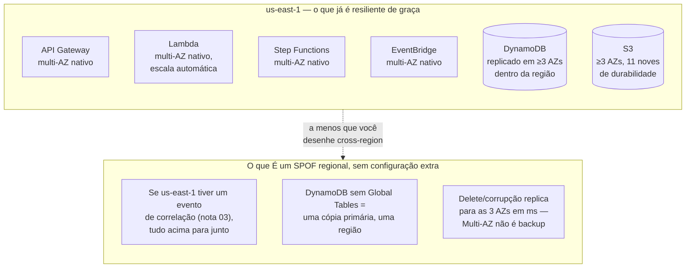
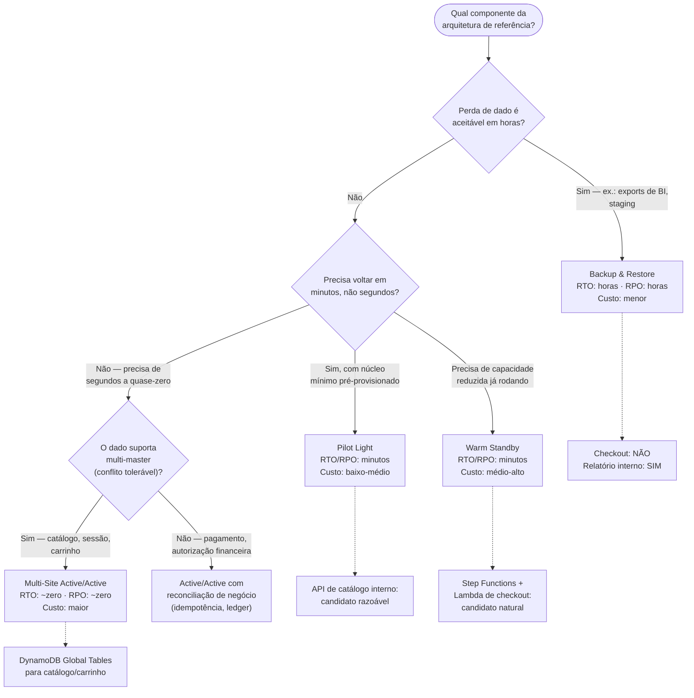
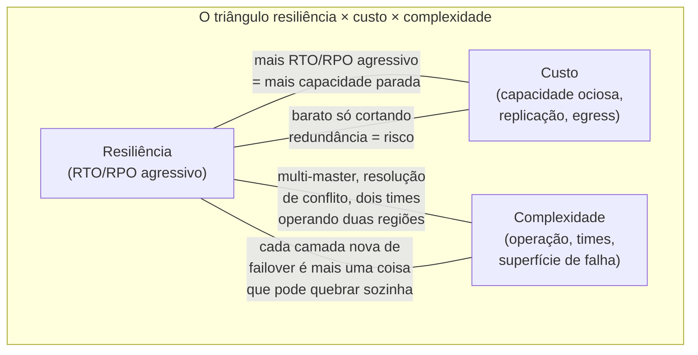

# Resiliência da arquitetura de referência

> [!abstract] TL;DR
> A [[03-Dominios/Tecnologia/Cloud/15 - Arquiteturas serverless e event-driven/06 - Arquitetura serverless de referência (capstone do Bloco 3)|arquitetura serverless de referência]] já nasceu com um pedaço de resiliência de graça — Lambda distribuída entre AZs, S3 com 11 noves de durabilidade, DynamoDB replicado dentro da região — porque a AWS constrói esses serviços gerenciados sobre a mesma disciplina Multi-AZ das duas primeiras notas deste galho. Mas "de graça" tem limite: sobreviver a uma região inteira caindo, a uma tabela apagada por engano, ou a um pico de demanda que dobra o SLA de disponibilidade exige uma decisão consciente de RTO/RPO, e essa decisão custa dinheiro em proporção direta à ambição. Este capstone fecha o galho aplicando as cinco notas anteriores à arquitetura de referência inteira — o que ela ganha de graça, onde ela ainda tem um ponto único de falha, que estratégia de DR (Backup & Restore, Pilot Light, Warm Standby, Active-Active) cada camada merece — e fecha o Bloco 4 inteiro amarrando IaC, Observabilidade, Segurança, FinOps e Resiliência na única frase que resume "operar em produção": desenhar não basta, é preciso declarar, enxergar, proteger, pagar certo e sobreviver.

## O problema: o diagrama bonito tinha um SPOF escondido

Volte ao diagrama do capstone do Bloco 3. Um pedido de e-commerce entra pelo API Gateway, uma Lambda valida, o Step Functions orquestra pagamento e estoque, o EventBridge avisa quem precisa saber, o resultado pousa no DynamoDB e no S3. Peça por peça, cada componente parece robusto — afinal, são todos serviços gerenciados da AWS. Mas "gerenciado" não é sinônimo de "resiliente a qualquer coisa", e é fácil confundir os dois.

Pergunte, camada por camada: e se a região `us-east-1` inteira tiver um evento de correlação — a mesma classe de incidente que a nota 03 deste galho descreveu, onde múltiplas AZs degradam juntas por uma causa comum de rede? O API Gateway daquela região para de aceitar requisições. O Step Functions não tem para onde promover — ele não existe fora da região onde foi definido. O DynamoDB, a menos que você tenha explicitamente configurado Global Tables, tem uma única cópia primária regional. E o pior cenário nem precisa de uma região inteira cair: um `DeleteTable` acidental, ou um deploy que apaga o bucket errado, replica sua própria destruição para toda AZ da região em milissegundos — porque a replicação síncrona que salva contra falha de hardware não distingue "hardware quebrou" de "humano cometeu um erro".

Este é o ponto exato em que o capstone do Bloco 3 parou de propósito: ele nomeou resiliência como uma das cinco perguntas em aberto e disse "o galho 20 responde". Chegou a hora de responder.

> [!info] Fronteira com as cinco notas anteriores
> Se você não leu as notas 01-05 deste galho, este capstone pressupõe o vocabulário delas: Multi-AZ e HA (notas 01-02), RTO/RPO e as quatro estratégias de DR (nota 03), replicação cross-region e DynamoDB Global Tables (nota 04), backup/PITR e teste de recuperação (nota 05). Aqui a aplicação é ponta a ponta, não um mecanismo novo.

## O que a arquitetura de referência já ganha de graça

Antes de desenhar o que falta, é preciso separar honestamente o que os serviços gerenciados já entregam sem nenhuma configuração extra — porque gastar esforço redesenhando algo que já está resolvido é o oposto de julgamento sênior.

- **Lambda**: cada invocação roda dentro da infraestrutura gerenciada da própria Lambda, distribuída pelas AZs da região automaticamente — você não escolhe uma AZ para sua função, a Lambda escolhe por você e reparte a carga. Se você conectar a função a uma VPC própria (para acessar um RDS privado, por exemplo), a prática recomendada pela AWS é fornecer sub-redes em pelo menos duas AZs — a resiliência aqui já é responsabilidade compartilhada, mas o piso é alto.
- **S3**: a documentação oficial da AWS declara que S3 Standard e a maioria das classes de armazenamento replicam objetos redundantemente em **no mínimo três Availability Zones** dentro da região, com durabilidade projetada de **99.999999999% (11 noves)** e disponibilidade de **99.99%** ao ano — e são desenhados para sobreviver à perda de uma AZ inteira sem intervenção.
- **DynamoDB**: cada tabela replica automaticamente entre múltiplas AZs da região por padrão — isso é o "Multi-AZ" do DynamoDB, sempre ligado, sem nenhum toggle. O que **não** vem de graça é a réplica cross-region (Global Tables, nota 04) — essa é opt-in e paga à parte.
- **API Gateway e EventBridge**: como serviços totalmente gerenciados, operam com redundância multi-AZ nativa dentro da região onde o recurso foi criado — de novo, dentro da região, não entre regiões.

> [!warning] "Serverless" não é sinônimo de "sem ponto único de falha"
> O erro mais comum de quem aprendeu compute serverless é achar que, por não gerenciar servidor, também não precisa pensar em resiliência — a AWS "já cuida disso". Ela cuida da resiliência *dentro da região*. A resiliência *entre regiões* é uma decisão de arquitetura que você precisa tomar e pagar, exatamente como seria com EC2. O serverless move o piso de resiliência para cima; não remove o teto que falta desenhar.

## A árvore de decisão: RTO/RPO até a estratégia de DR

A nota 03 já deu as quatro estratégias canônicas da AWS. O trabalho de arquitetura real é decidir, camada por camada da arquitetura de referência, qual delas se aplica — e a decisão nasce da mesma pergunta de sempre: **quanto custa, por minuto, esse componente estar fora do ar ou perder dado?**

Aplicando essa árvore à arquitetura de referência do Bloco 3, camada por camada:

| Camada | Criticidade | RTO/RPO alvo | Estratégia | Por quê |
|---|---|---|---|---|
| API Gateway + Lambda de validação de pedido | Tier 1 — essencial | minutos / minutos | Warm Standby (stack replicada via IaC noutra região, tráfego frio até failover) | Stateless, fácil de reimplantar; o gargalo é o dado, não o compute |
| Step Functions "Processar Pedido" | Tier 1 — essencial | minutos / minutos | Warm Standby (definição do workflow versionada via IaC nas duas regiões) | Definição de workflow é declarativa — reimplantar é rápido se já está no repositório |
| DynamoDB (pedidos, carrinho) | Tier 0-1, depende do dado | segundos-minutos / ~zero | Global Tables (Active/Active) para carrinho/catálogo; Warm Standby + backup para pedidos financeiros | Carrinho tolera last-writer-wins; pedido financeiro exige reconciliação, não apenas replicação |
| S3 (recibos, notas fiscais) | Tier 2 — importante | horas / minutos | Cross-Region Replication (S3 CRR) + versionamento | Já é durável dentro da região; CRR cobre perda de região a custo relativamente baixo |
| EventBridge (fan-out de notificação) | Tier 2-3 | horas / minutos | Backup & Restore (regra recriada via IaC, replay de eventos perdidos aceitável) | Perder alguns minutos de eventos de notificação é inconveniente, não catastrófico |
| Fargate (geração de PDF) | Tier 2 | dezenas de min. / minutos | Pilot Light (cluster mínimo definido, escala sob demanda no failover) | Processo assíncrono, atraso tolerável se a fila (SQS) absorver o backlog |

> [!info] Verificado 2026-07-24
> A tabela de nines de S3 (99.999999999% durabilidade, 99.99% disponibilidade, redundância em no mínimo 3 AZs por região) vem diretamente de docs.aws.amazon.com/AmazonS3/latest/userguide/DataDurability.html. Confirme antes de reusar em contexto de SLA contratual — "designed to provide" é o texto oficial, não uma garantia contratual formal (a SLA contratual de disponibilidade é um documento separado, com créditos de serviço).

## O triângulo: custo × resiliência × complexidade

A nota 03 do galho de FinOps já avisou: multi-região dobra a conta, e resiliência compete com custo pelo mesmo orçamento. Vale nomear isso como triângulo, porque as três pontas puxam em direções opostas e nenhuma solução otimiza as três ao mesmo tempo.

Warm Standby de uma região secundária inteira não é só o custo de infraestrutura parada — é o custo de manter duas cópias de tudo sincronizadas via IaC (galho 16), observadas nas duas regiões (galho 17), com a mesma superfície de segurança duplicada (galho 18). Active/Active com Global Tables multiplica isso: agora você tem resolução de conflito por last-writer-wins rodando em produção, um vetor de bug que Backup & Restore nunca teria.

A decisão certa nunca é "o máximo de resiliência que dá pra comprar" — é o ponto do triângulo que a criticidade real do workload justifica, e nem toda camada da mesma arquitetura fica no mesmo ponto. O exemplo da nota 02 se repete aqui em escala de arquitetura inteira: o checkout financeiro e o painel de relatório interno da mesma aplicação legitimamente vivem em pontos diferentes desse triângulo, e forçá-los ao mesmo padrão é desperdício de orçamento numa ponta e risco inaceitável na outra.

> [!warning] A armadilha do "já que estamos migrando, vamos fazer active-active em tudo"
> Um projeto de DR costuma nascer depois de um susto real — uma queda de região, uma auditoria de compliance, um cliente grande perguntando sobre RTO no contrato. A resposta de pânico é superdimensionar: active-active em toda a arquitetura, porque "nunca mais". Isso costuma dobrar o custo de infraestrutura permanentemente (galho 19) e adicionar uma superfície de complexidade operacional (dois ambientes vivos, resolução de conflito, dobro de superfície de IAM) que o time não tinha antes — trocando o risco de "região cair" pelo risco, maior no dia a dia, de "operar dois ambientes ativos mal entendidos". A árvore de decisão desta nota existe para conter esse impulso: workload por workload, não arquitetura inteira de uma vez.

> [!tip] Assista: 6 Pillars of the AWS Well-Architected Framework (you should really know this)
> **Canal:** Be A Better Dev | **Duração:** ~19min | **Idioma:** EN
>
> Situa o pilar de Reliability (o motor por trás do triângulo desta nota) ao lado do pilar de Cost Optimization — dá o pano de fundo do framework inteiro que justifica por que a AWS documenta resiliência e custo como forças competindo pelo mesmo orçamento, e não como dois assuntos separados. Trecho de destaque [8:10]: *"all of application building is for nothing if we can't ensure their application remain stable"*
>
> 🎬 [Assistir no YouTube](https://www.youtube.com/watch?v=5odtVlORq_w)

> [!tip] Assista: AWS Summit DC 2021 — Increase resiliency with cloud-based disaster recovery
> **Canal:** AWS Events | **Duração:** ~42min | **Idioma:** EN
>
> Talk oficial da AWS que percorre o mesmo espectro de estratégias de DR desta trilha (backup simples até multi-site) sempre amarrando cada nível a seu overhead de custo — o mesmo raciocínio "quanto mais RTO/RPO agressivo, mais capacidade parada" que o triângulo desta nota formaliza em diagrama. Trecho de destaque [4:04]: *"recover quickly but there's a trade-off, there's usually larger overhead costs"*
>
> 🎬 [Assistir no YouTube](https://www.youtube.com/watch?v=AdEncgHdHTM)

## Lente dupla: a resiliência completa da AWS vs a mais simples da DigitalOcean

Esta é a nota do galho onde a distância entre os dois provedores fica mais visível em escala de sistema inteiro — e vale nomeá-la sem meio-termo, como as notas anteriores já fizeram peça por peça.

Na AWS, a arquitetura de referência inteira tem um caminho documentado para cada ponta do triângulo: Global Tables para dado multi-master, Aurora Global Database para relacional cross-region, S3 CRR para objeto, Route 53 health-check-based failover para roteamento, Step Functions e EventBridge redeployáveis via IaC em segundos. O prêmio inteiro do Well-Architected Framework em Reliability foi desenhado em cima desse kit.

Na DigitalOcean, a mesma arquitetura — App Platform, Functions, Managed Databases, Spaces, Managed Kafka — tem Multi-AZ *dentro* de uma região só parcialmente (standby nodes em bancos gerenciados, já coberto no galho 9 e na nota 02 deste galho), e **nenhuma** primitiva nativa de replicação multi-região automática: sem Global Tables, sem CRR nativo pro Spaces (a orientação oficial é `rclone` manual, como a nota 04 já documentou), sem orquestrador de workflow pra reimplantar via IaC em segundos. Um plano de DR cross-region na DO é inteiramente construído pela sua equipe — infraestrutura replicada por Terraform, sincronização de dado por job próprio, roteamento de failover por um DNS provider terceiro com health check.

Isso não é a DO "perdendo" a comparação — é a DO sendo honesta sobre o que ela é: uma plataforma que entrega excelente HA *dentro* de uma região a um custo e complexidade muito menores, e deixa explicitamente de fora o produto gerenciado de DR cross-region que a AWS cobra caro para oferecer. Para a maioria dos workloads Tier 2-3 desta própria tabela — o catálogo de baixa criticidade, o painel interno — a DO com backup automático diário já é suficiente, e forçar uma arquitetura multi-região sobre ela seria construir, do zero, algo que a AWS já vende pronto. A pergunta certa nunca é "qual provedor é mais resiliente" — é "qual workload precisa de qual nível, e qual provedor entrega esse nível ao menor custo total".

| Necessidade de DR | AWS | DigitalOcean | Honestidade |
|---|---|---|---|
| Multi-master cross-region (dado) | DynamoDB Global Tables / Aurora Global DB | Sem paridade — replicação manual | AWS tem produto; DO exige engenharia própria |
| Objeto cross-region | S3 Cross-Region Replication (nativo) | `rclone` manual entre Spaces | AWS automatiza; DO documenta workaround |
| Failover de DNS por health check | Route 53 | DNS gerenciado sem failover nativo documentado — provider terceiro | Lacuna real, não hipótese |
| Reimplantação de stack inteira noutra região via IaC | Terraform/CloudFormation com provider AWS maduro, multi-região trivial | Terraform com provider DO, multi-região possível mas sem produto de orquestração | Ambos suportam IaC; AWS tem mais peças pra orquestrar automaticamente |
| Backup automático dentro da região | RDS/Aurora backup + PITR até 35 dias | Backups automáticos diários, mesmo datacenter | Paridade real dentro da região (nota 05) |

## Azure e GCP — só nomenclatura

| Conceito | AWS | Azure | GCP |
|---|---|---|---|
| Réplica multi-master cross-region | DynamoDB Global Tables | Cosmos DB multi-region write | Cloud Spanner / Firestore multi-region |
| Objeto replicado cross-region | S3 Cross-Region Replication | Geo-redundant Storage (GRS) | Multi-region buckets (Cloud Storage) |
| Failover de DNS por health check | Route 53 | Traffic Manager | Cloud DNS + Load Balancing |
| Orquestração de DR (runbook automatizado) | AWS Elastic Disaster Recovery (DRS) | Azure Site Recovery | Não há produto direto equivalente — orquestração via scripts/Deployment Manager |

## Síntese do Bloco 4: cinco disciplinas, um único objetivo

O Bloco 3 desenhou a arquitetura. Este bloco a fez sobreviver em produção, e vale nomear como as cinco peças se encaixam, porque nenhuma isolada resolve "operar":

- **IaC (galho 16)** declara a arquitetura como código — sem isso, replicar a stack de Warm Standby numa segunda região seria recriar tudo manualmente no console, algo que nenhum RTO de minutos sobrevive.
- **Observabilidade (galho 17)** enxerga o sistema — sem métricas e alarmes, um health check de Route 53 não teria o que monitorar, e você descobriria a queda de região pelo cliente reclamando, não pelo alarme.
- **Segurança (galho 18)** protege cada camada — uma segunda região replicada é uma segunda superfície de IAM, VPC e segredo que precisa da mesma disciplina de profundidade da primeira, ou você dobrou o risco junto com a resiliência.
- **FinOps (galho 19)** controla o custo — é a disciplina que impede o triângulo desta nota de virar "resiliência sem teto", perguntando sempre se o SLA justifica o gasto.
- **Resiliência (este galho)** garante que, quando as quatro disciplinas acima falharem juntas — código com bug, alarme silencioso, credencial vazada, orçamento estourado — ainda existe um plano de RTO/RPO para o pior dia.

Nenhuma das cinco substitui as outras. IaC sem observabilidade é infraestrutura cega. Segurança sem FinOps é um cofre caro demais para manter. Resiliência sem as quatro anteriores é um plano de papel que ninguém testou (nota 05) e ninguém paga para manter vivo. Operar em produção é a interseção das cinco, não a soma.

## O que vem a seguir

Este capstone fecha o galho 20 e, com ele, o **Bloco 4 inteiro** desta trilha — os cinco galhos que ensinaram a manter uma arquitetura viva depois de desenhada. O **Bloco 5 (Provedores e maestria)** é onde a trilha para de tratar AWS e DigitalOcean como lentes paralelas e mergulha fundo em cada um: consolidação AWS, consolidação DigitalOcean, o panorama de multi-cloud e portabilidade real (o que significa, de fato, não ficar preso a um provedor), e finalmente a preparação para a certificação AWS Solutions Architect Associate — o exame que valida, formalmente, que todo esse conhecimento também é reconhecido pelo mercado.

## Fontes

- AWS. "Data protection in Amazon S3" (durabilidade 99.999999999%, disponibilidade 99.99%, redundância em ≥3 AZs). https://docs.aws.amazon.com/AmazonS3/latest/userguide/DataDurability.html
- AWS. "Giving Lambda functions access to resources in an Amazon VPC" (Lambda roda numa VPC gerenciada pela própria AWS; melhores práticas recomendam sub-redes em múltiplas AZs quando conectado a VPC própria). https://docs.aws.amazon.com/lambda/latest/dg/foundation-networking.html
- AWS. "Global Tables — multi-master, multi-Region replication" (DynamoDB Developer Guide). https://docs.aws.amazon.com/amazondynamodb/latest/developerguide/GlobalTables.html
- AWS. "Amazon S3 Cross-Region Replication (CRR)." https://docs.aws.amazon.com/AmazonS3/latest/userguide/replication.html
- AWS Well-Architected Framework — Reliability Pillar. https://docs.aws.amazon.com/wellarchitected/latest/reliability-pillar/welcome.html
- AWS. "Disaster recovery options in the cloud" (Backup & Restore, Pilot Light, Warm Standby, Multi-Site Active/Active). https://docs.aws.amazon.com/whitepapers/latest/disaster-recovery-workloads-on-aws/disaster-recovery-options-in-the-cloud.html
- DigitalOcean. "Spaces Object Storage" (sem replicação nativa cross-region documentada). https://docs.digitalocean.com/products/spaces/
- DigitalOcean. "How to Add Standby Nodes to PostgreSQL Database Clusters." https://docs.digitalocean.com/products/databases/postgresql/how-to/add-standby-nodes/
