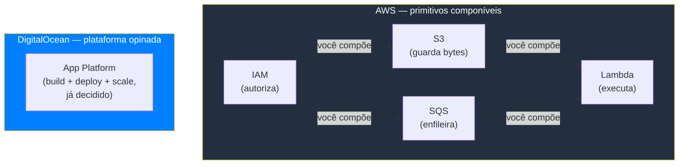
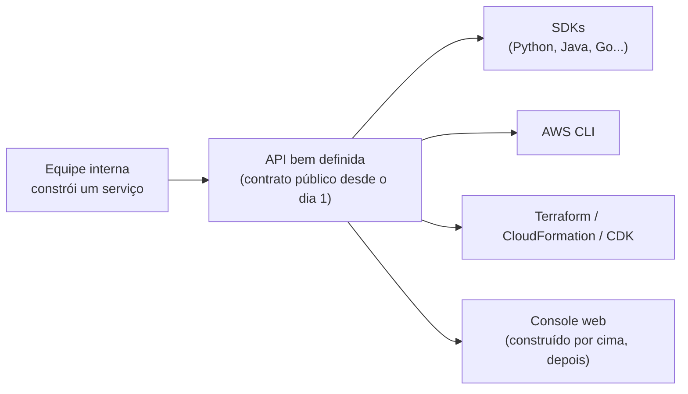
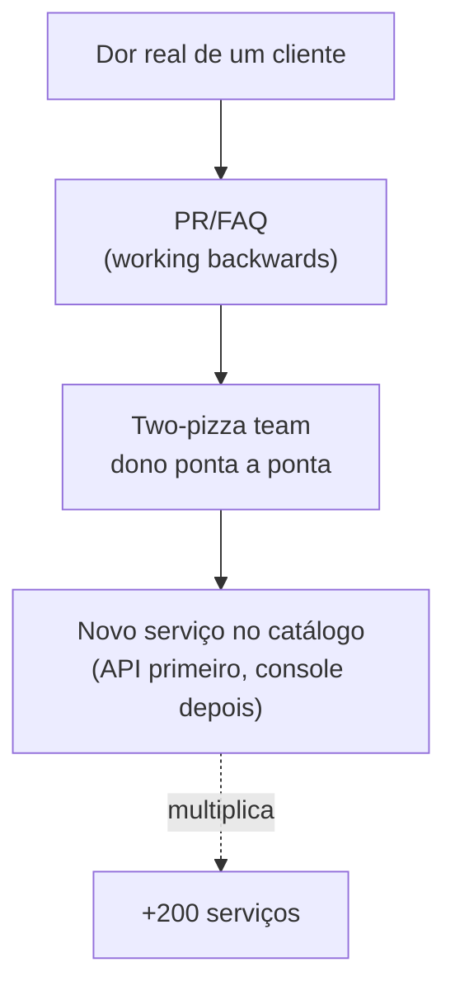
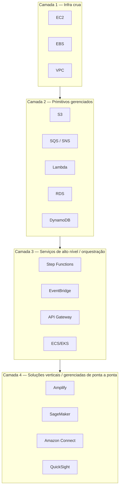
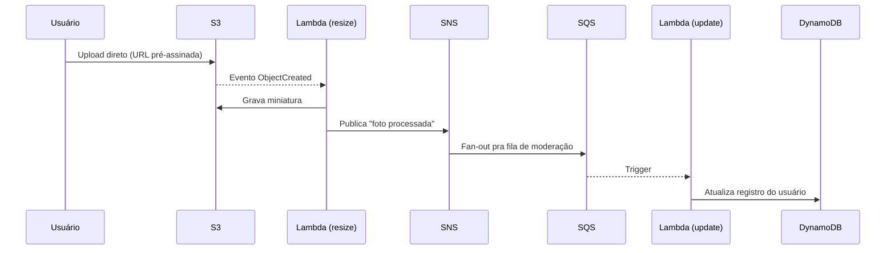

> [!abstract] TL;DR
> O console da AWS lista mais de 200 serviços — um número que assusta antes de ensinar qualquer coisa. Mas essa amplitude não é bagunça acumulada: é a consequência direta de três decisões de engenharia organizacional tomadas nos anos 2000. A AWS prefere **primitivos pequenos e componíveis** a soluções monolíticas fechadas; todo serviço nasce como **API antes de ter console**, o que torna automação um cidadão de primeira classe; e a cultura de **two-pizza teams** trabalhando "de trás pra frente" a partir do cliente multiplica squads autônomos — cada um dono de um serviço, cada serviço um novo item no catálogo. O preço é o paradoxo da escolha: cinco formas de resolver o mesmo problema, e a responsabilidade de escolher cai sobre você. A DigitalOcean resolveu o mesmo problema na direção oposta — curadoria em vez de amplitude — e esse contraste é o fio que atravessa este galho inteiro.

## O susto do console

Primeira vez que você abre o console da AWS depois de terminar os primeiros vinte galhos desta trilha, a reação costuma ser física: um aperto no peito. Ali, na barra de busca de serviços, está uma lista que passa de duzentas entradas — EC2, S3, Lambda, sim, você já conhece esses. Mas também Ground Station (antenas de satélite como serviço), DeepRacer (carrinhos autônomos de brinquedo pra treinar reinforcement learning), Braket (computação quântica sob demanda), Snowmobile (um caminhão-baú pra migrar exabytes de dados fisicamente). A sensação é de estar num supermercado do tamanho de uma cidade quando você só queria comprar pão.

Esse é o fenômeno que vale nomear antes de seguir: **ansiedade de amplitude**. Não é medo de um serviço específico ser difícil — é o medo de que exista um serviço "certo" pra cada problema, escondido em algum canto do catálogo, e que você vai escolher errado por não saber que ele existia. É uma forma de impostor syndrome induzida por menu.

A pergunta que este galho inteiro tenta responder é: isso é um bug da AWS ou é o produto? Spoiler — é o produto. E entender por que é o produto muda completamente como você navega esse catálogo pelo resto da carreira.

> [!abstract] O que este galho NÃO é
> Este não é um catálogo enciclopédico dos 200+ serviços da AWS — isso já existe, chama-se documentação oficial, e reproduzi-lo aqui seria desperdício de tinta digital. Você já aprendeu os primitivos que sustentam 80% de qualquer arquitetura real nos galhos 1 a 20: [[03-Dominios/Tecnologia/Cloud/04 - Identidade e acesso (IAM)/index|IAM]], [[03-Dominios/Tecnologia/Cloud/08 - Armazenamento (object, block e file)/index|S3/EBS]], [[03-Dominios/Tecnologia/Cloud/11 - Serverless e FaaS — Lambda a fundo/index|Lambda]], [[03-Dominios/Tecnologia/Cloud/13 - Mensageria e eventos gerenciados/index|SQS/SNS]], entre outros. Este galho de consolidação ensina a **lente meta**: por que a AWS existe do jeito que existe, como separar sinal de ruído no catálogo, e como pensar como arquiteto AWS — não a reexplicar os primitivos.

## Primitivo componível vs. plataforma opinada

Existem, grosso modo, duas filosofias possíveis pra desenhar uma plataforma de nuvem.

A primeira: você constrói **peças pequenas, ortogonais, que fazem uma coisa bem feita** e deixa o cliente combiná-las como blocos de Lego. S3 guarda bytes. SQS enfileira mensagens. Lambda executa código sob evento. Nenhum dos três sabe da existência do outro — mas você pode plugar S3 → evento → Lambda → SQS numa arquitetura inteira sem que a AWS tenha "lançado" essa combinação como produto. A combinação é sua para inventar.

A segunda: você constrói uma **plataforma opinada** — um número menor de serviços, cada um já resolvendo um problema de ponta a ponta, com decisões de design já tomadas por você. Menos peças, menos combinações possíveis, mas também menos decisões pra tomar e uma curva de aprendizado mais curta.

A AWS escolheu a primeira, deliberadamente, desde o lançamento do S3 e do EC2 em 2006. Você já viu isso na prática nos galhos anteriores sem necessariamente nomear o padrão: quando aprendeu que S3 não sabe processar imagem, mas pode disparar Lambda que processa; que SQS não sabe rotear por tipo de evento, mas EventBridge faz isso por cima; que EC2 não vem com balanceamento embutido, você anexa um ALB. Cada peça é deliberadamente burra sobre as outras — a inteligência de composição é sua, o arquiteto.

Esse contraste não é acidente de tamanho de empresa — é filosofia de produto, e ele reaparece em praticamente toda decisão de design da AWS. Cada vez que você se pergunta "por que a AWS não tem um serviço que já faz X, Y e Z junto?", a resposta quase sempre é: porque a aposta da AWS é que você, arquiteto, sabe compor X, Y e Z melhor do que qualquer decisão genérica que a AWS pudesse tomar por você. É uma aposta na sua competência — e também, sejamos honestos, uma forma de vender mais SKUs.

## Tudo é uma API primeiro

Em 2002, um memorando interno de Jeff Bezos — hoje folclore de engenharia de software, citado por ex-funcionários como Steve Yegge num post público que circulou amplamente depois — estabeleceu uma regra que reformatou a Amazon inteira: toda equipe deveria expor suas funcionalidades **exclusivamente por interface de serviço** (o que hoje chamaríamos de API), sem acesso direto a banco de dados ou memória de outra equipe, e essas interfaces deveriam ser desenhadas desde o primeiro dia como se fossem, um dia, expostas externamente.

Essa regra é a raiz técnica da AWS. Não é coincidência que toda funcionalidade que você usou nos vinte galhos anteriores — criar uma instância EC2, subir um objeto no S3, invocar uma Lambda — tem, por baixo do console bonito, uma chamada de API REST equivalente. O console não é o produto primário. É uma camada de conveniência construída *em cima* da API, quase sempre anos depois do lançamento do serviço.

A consequência prática disso é enorme e você já sentiu na pele nos galhos de [[03-Dominios/Tecnologia/Cloud/16 - Infrastructure as Code/index|Infrastructure as Code]]: automação, CLI, SDK e Terraform não são "extras" de segunda classe — são o caminho principal, e o console é o desvio pra quem está aprendendo ou depurando visualmente. Quando um serviço novo é lançado, ele já nasce com API estável (às vezes o console demora meses para acompanhar). Isso muda o tipo de organização que consegue construir sobre AWS: qualquer coisa que você faz manualmente no console, em teoria, você pode escriptar — porque a API sempre existiu primeiro.

> [!info] Verificado 2026-07-24
> O memorando de Bezos de 2002 não foi publicado oficialmente pela Amazon — a versão mais citada vem de um post de blog de Steve Yegge (ex-engenheiro da Amazon e Google) de 2011, reproduzindo a regra de memória. É folclore de engenharia amplamente aceito no setor, não um documento primário da AWS; trate como "origem provável", não certeza documental.

## Working backwards e o two-pizza team

A segunda engrenagem cultural por trás da amplitude é como a Amazon decide o que construir. O processo se chama **working backwards** (trabalhar de trás pra frente): antes de escrever uma linha de código, a equipe escreve um comunicado de imprensa fictício — como se o produto já estivesse pronto e fosse anunciado hoje — junto de um documento de perguntas e respostas (o PR/FAQ) que antecipa as dúvidas de clientes e stakeholders. Só depois de o documento sobreviver a rodadas de revisão crítica é que a equipe começa a construir.

O efeito prático: cada serviço da AWS nasce como resposta a uma dor de cliente específica, documentada antes da primeira linha de código — não como uma feature genérica "porque seria legal ter". EventBridge Pipes, Step Functions, Aurora Serverless v2 — cada um tem, nos bastidores, um PR/FAQ que descreve um cliente real batendo a cabeça num problema real.

A terceira engrenagem é organizacional: o **two-pizza team**. A regra, também atribuída a Bezos, é que nenhuma equipe deveria ser grande demais para ser alimentada por duas pizzas — na prática, times de até dez pessoas. Cada two-pizza team é dono de ponta a ponta de um serviço ou de um pedaço bem delimitado dele: escreve o código, opera em produção, atende chamado de madrugada se cair. Não existe um "time de infraestrutura central" que aprova o roadmap de todo mundo — cada squad tem autonomia pra decidir, lançar e evoluir o que é seu.

Junte as três engrenagens e o resultado é matemático: mais times autônomos, cada um lançando produtos independentes em resposta a dores específicas de clientes, sem um comitê central limitando quantos serviços podem existir ao mesmo tempo. A amplitude do catálogo não é falta de curadoria — é a **consequência estrutural direta** de como a Amazon organiza pessoas e decide o que construir. Duzentos e poucos serviços não são duzentos experimentos aleatórios; são duzentos two-pizza teams que, em algum momento, convenceram um comitê interno de que existia um cliente real esperando aquele PR/FAQ virar produto.

> [!tip] Assista: AWS re:Invent 2020: Working backwards: Amazon's approach to innovation
> **Canal:** AWS Events | **Duração:** ~17min | **Idioma:** EN
>
> Dois executivos da Amazon (Richard e Rayford) detalham o mecanismo de working backwards passo a passo — inclusive por que o "documento central" é o PR/FAQ e não um roadmap técnico. Complementa a nota mostrando o processo de dentro, não só o resultado. Trecho de destaque [06:58]: *"The central artifact of working backwards is what we call a working backwards document, commonly referred to as a PR FAQ. This document includes three elements: a press release, the PR, a frequently asked questions document, the FAQ, and the visual representation of what the customer experience looks like."*
>
> 🎬 [Assistir no YouTube](https://www.youtube.com/watch?v=aFdpBqmDpzM)

> [!tip] Assista: AWS re:Invent 2020: Two-pizza teams: Organizing for innovation
> **Canal:** AWS Events | **Duração:** ~29min | **Idioma:** EN
>
> Explica de onde vem o número "seis a oito pessoas" e por que a Amazon amarrou tamanho de equipe a autonomia de decisão — o pedaço que fecha o raciocínio de por que 200+ serviços não é acidente, é estrutura organizacional virando catálogo. Trecho de destaque [08:47]: *"The name 'two-pizza team' comes from a meeting where we were heavily debating how big does a service team need to be, what's the optimal size, and someone very cleverly said, 'The team should be no bigger than what you can feed with two pizzas.'"*
>
> 🎬 [Assistir no YouTube](https://www.youtube.com/watch?v=XavPl5t9dS8)

## O mapa de camadas: onde cada peça mora

Uma forma útil de organizar mentalmente a amplitude — em vez de encarar duzentos itens como uma lista plana — é pensar em camadas de abstração crescente. Quanto mais alto na pilha, menos você controla e mais a AWS decide por você; quanto mais baixo, mais trabalho manual, mais controle.

Você já viveu integralmente as camadas 1 e 2 nos galhos anteriores — são o esqueleto de qualquer arquitetura AWS séria e o que a próxima nota deste galho vai chamar de **sinal**, os poucos dezenas de serviços que carregam 80% do peso real de qualquer sistema em produção. A camada 3 é onde você compõe os primitivos em fluxos maiores. A camada 4 — SageMaker pra ML, Connect pra call center, QuickSight pra BI — é onde mora boa parte do que engorda o número "200+": soluções verticais pra domínios de negócio específicos, que você provavelmente nunca vai tocar a menos que seu trabalho seja literalmente aquele domínio.

## Lente dupla: amplitude AWS vs. curadoria DigitalOcean

A DigitalOcean, historicamente, fez a aposta oposta — e não por incompetência ou tamanho menor, mas por proposta de valor deliberada. Onde a AWS aposta que você quer compor primitivos, a DO aposta que você quer uma decisão já tomada. O catálogo público de produtos da DO organiza-se em torno de meia dúzia de categorias centrais — Compute (Droplets, App Platform, Kubernetes), Storage, Managed Databases, Networking, Containers e, mais recentemente, uma vertical de IA (Inference Engine, GPU Droplets) — em vez de duzentas entradas dispersas.

| Dimensão | AWS | DigitalOcean |
|---|---|---|
| Filosofia | Primitivos componíveis | Plataforma opinada |
| Nº de serviços | Mais de 200 (whitepaper oficial AWS) | Dezenas, organizados em ~8 categorias core |
| Onde nasce o serviço | API, depois console | Produto integrado, console primeiro |
| Curva de aprendizado inicial | Alta (paradoxo da escolha) | Baixa (menos decisões) |
| Composição de peças | Você monta (Lego) | Já vem montado (eletrodoméstico) |
| Cultura de origem | Two-pizza teams + working backwards | Foco em simplicidade pra devs/times pequenos |
| Caso de uso ideal | Empresa que precisa de controle fino, escala extrema, compliance específico | Startup/time pequeno que quer produtividade imediata |

> [!info] Verificado 2026-07-24 — mais de 200 serviços
> O número "mais de 200 serviços" vem do whitepaper oficial *Overview of Amazon Web Services* (docs.aws.amazon.com), atualizado em junho de 2026: *"From data warehousing to deployment tools, directories to content delivery, over 200 AWS services are available."* O número "~240", citado informalmente em blogs e talks de reInvent, é uma estimativa não-oficial que costuma variar de fonte pra fonte — trate o "200+" oficial como o piso confiável e qualquer número mais preciso como aproximação de terceiros, sujeita a mudar a cada lançamento.

Vale anunciar aqui, com honestidade, pra onde este contraste vai: o galho 22 desta trilha (DigitalOcean a fundo) vai defender o lado oposto da moeda — não como "AWS é melhor, DO é o backup mais barato", mas como duas filosofias de produto igualmente válidas, cada uma certa para um contexto diferente. Amplitude não é superioridade automática; é uma troca (trade-off) que custa caro em alguns cenários e vale muito em outros.

## Caso prático: subir uma foto de perfil

Abstração é fácil de aceitar em teoria e difícil de sentir na pele. Então trabalhe um exemplo concreto: um usuário sobe uma foto de perfil no seu app, e você precisa (1) guardar o arquivo original, (2) gerar uma miniatura redimensionada, (3) notificar o time de moderação de conteúdo, e (4) atualizar o registro do usuário no banco.

No jeito AWS, essa funcionalidade não existe como produto único — você a *monta* a partir de primitivos que você já domina dos galhos anteriores:

1. O front-end pede uma URL pré-assinada de upload direto pro [[03-Dominios/Tecnologia/Cloud/08 - Armazenamento (object, block e file)/02 - Object storage a fundo|S3]] — sem passar pelo seu backend.
2. O evento `ObjectCreated` do S3 dispara uma função [[03-Dominios/Tecnologia/Cloud/11 - Serverless e FaaS — Lambda a fundo/03 - O modelo de eventos: triggers e integrações|Lambda]] (galho 11), que redimensiona a imagem e grava a miniatura de volta no S3, num prefixo diferente.
3. A mesma Lambda publica uma mensagem no [[03-Dominios/Tecnologia/Cloud/13 - Mensageria e eventos gerenciados/03 - SNS e pub-sub|SNS]] (galho 13), que distribui pra uma fila SQS do time de moderação e, em paralelo, pra um tópico de auditoria.
4. Uma segunda Lambda, disparada pela fila, atualiza o registro do usuário no DynamoDB ou RDS.
5. [[03-Dominios/Tecnologia/Cloud/04 - Identidade e acesso (IAM)/03 - Políticas — como uma permissão é avaliada|IAM]] (galho 04) amarra tudo: a role da primeira Lambda só pode ler daquele bucket específico e escrever naquele prefixo; a role da segunda só pode escrever naquela tabela.

Nenhum desses cinco passos é um "serviço de upload de foto de perfil" — a AWS nunca vendeu esse produto, e provavelmente nunca vai. O que ela vendeu foram cinco primitivos ortogonais e um sistema de permissões fino o bastante pra você amarrar cada um deles com o mínimo de privilégio necessário. A funcionalidade inteira é sua composição, documentável em IaC, versionável, testável peça por peça.

No jeito DigitalOcean, o mesmo problema tenderia a ser resolvido com menos peças móveis e mais decisões já tomadas por você: um App Platform hospedando o backend, que grava direto num bucket Spaces (S3-compatible) e chama um endpoint interno da própria aplicação para redimensionar e notificar — sem um EventBridge ou um SNS equivalente de primeira classe amarrando os passos por evento. Funciona, é mais rápido de montar no dia 1, mas empurra a orquestração pra dentro do seu código de aplicação em vez de externalizá-la em serviços gerenciados. Essa é a troca, nua e crua: a AWS te dá peças pra orquestrar de fora do código; a DO te dá menos peças e espera que a orquestração viva dentro dele.

Repare: cada seta desse diagrama é uma decisão de composição que **você** tomou, não a AWS. Troque SNS por EventBridge e ganha roteamento por regra de conteúdo. Troque a fila SQS padrão por uma FIFO e ganha ordenação garantida. Troque Lambda por Fargate e ganha tempo de execução maior. Nenhuma dessas trocas exige esperar um lançamento de produto novo — os primitivos já existem, prontos pra recombinar.

## O preço da amplitude

Nenhuma filosofia de design vem de graça, e a amplitude da AWS cobra um preço real, em três frentes.

**Paradoxo da escolha.** O psicólogo Barry Schwartz cunhou o termo pra descrever como excesso de opções, paradoxalmente, reduz satisfação e aumenta ansiedade de decisão — mais opções, mais medo de escolher errado. No contexto AWS, isso se manifesta literalmente: você quer rodar um container. Precisa ser ECS ou EKS? Fargate ou EC2 por baixo? App Runner resolveria mais rápido? Lambda com container image seria overkill ou exatamente certo? Cinco caminhos válidos pro mesmo destino, e a AWS não vai escolher por você.

**Curva de aprendizado íngreme.** Cada serviço novo tem seu próprio modelo de precificação, seus próprios limites, sua própria superfície de configuração no IAM. Dominar a AWS não é dominar "a nuvem" — é dominar dezenas de mini-produtos, cada um com curva própria.

**Cinco formas de fazer a mesma coisa.** Quer processar eventos assíncronos? SQS, SNS, EventBridge, Kinesis e Step Functions resolvem pedaços sobrepostos desse problema, cada um com nuance de ordenação, latência, fan-out e custo que só fica óbvia depois que você já escolheu errado uma vez. Isso não é bug — é o preço de primitivos ortogonais construídos por times independentes ao longo de quinze anos, sem um comitê central forçando consolidação.

> [!warning] A armadilha mais cara: achar que "ter" é "precisar usar"
> O erro mais comum de quem sai dos primeiros galhos desta trilha e entra em contato com o catálogo completo é confundir *a AWS ter um serviço pra tudo* com *você precisar usar tudo*. Ver duzentos serviços no console não é uma lista de compras obrigatória — é um catálogo de opções das quais, numa arquitetura real, você vai tocar talvez quinze a vinte, de forma recorrente, pelo resto da carreira. Currículos e arquiteturas inflados de serviços exóticos ("usei Ground Station nesse projeto de e-commerce!") não impressionam — sinalizam alguém que confundiu amplitude de catálogo com sofisticação de design. A pergunta certa nunca é "que serviço novo posso usar aqui?" — é "qual primitivo, dos que eu já domino, resolve isso com menos peças móveis?".

## A amplitude não é só custo — também é vantagem

Vale a pena resistir à tentação de tratar essa nota como um manifesto anti-AWS. A mesma amplitude que assusta no dia 1 é o motivo pelo qual empresas com requisitos regulatórios pesados — bancos, saúde, governo — frequentemente escolhem AWS sobre alternativas mais enxutas: quando você precisa de um serviço de computação quântica gerenciada (Braket), de transferência de exabytes fora da rede (Snow Family) ou de um data lake com controle de acesso em nível de coluna (Lake Formation), o fato de a AWS já ter construído e testado esse primitivo específico — em vez de você ter que montá-lo do zero sobre uma plataforma mais genérica — é, literalmente, meses de engenharia economizados.

O princípio de fundo é o mesmo em qualquer escala: quanto mais específico o seu problema, maior a chance de a AWS já ter um two-pizza team que resolveu exatamente aquilo pra outro cliente antes de você. É o efeito de rede do catálogo — cada serviço novo aumenta a chance de o próximo problema exótico que você tiver já estar coberto.

> [!info] Verificado 2026-07-24 — a fractalidade da amplitude
> A própria amplitude se repete dentro de cada serviço individual. Segundo a Wikipédia (sourced a partir de comunicações públicas da AWS), o S3 nasceu em 2006 composto por apenas 8 microsserviços internos e, por volta de 2022, já operava com mais de 300 microsserviços por trás da mesma API pública e estável. Ou seja: mesmo um único "item" do catálogo de 200+ é, por dentro, outro exemplo do mesmo princípio — primitivos pequenos, compostos, evoluindo independentemente, sem que o cliente externo perceba a mudança porque o contrato de API nunca quebrou.

## O que vem a seguir

Este galho abriu com a pergunta "por que" — por que a AWS é assim, ampla, dispersa, cheia de opções concorrentes para o mesmo problema. A próxima nota vira a pergunta pro lado prático: **como, na prática, separar sinal de ruído** nesse catálogo de duzentos e poucos itens — que critérios usar pra decidir, em segundos, se um serviço desconhecido no console merece dez minutos de atenção ou pode ser ignorado com segurança. Depois disso, o galho segue pra como operar essa amplitude (console, CLI, SDK, IaC), pros "big rocks" que a trilha ainda não cobriu, e fecha com o "jeito AWS" de arquitetar de ponta a ponta.

## Fontes

- AWS. *Overview of Amazon Web Services* (whitepaper). https://docs.aws.amazon.com/whitepapers/latest/aws-overview/introduction.html
- AWS Executive Insights. *The Amazon Two-Pizza Team*. https://aws.amazon.com/executive-insights/content/amazon-two-pizza-team/
- AWS. *AWS Products*. https://aws.amazon.com/products/
- DigitalOcean. *Products*. https://www.digitalocean.com/products
- DigitalOcean Docs. https://docs.digitalocean.com/products/
- Yegge, Steve. *Stevey's Google Platforms Rant* (reproduz o memorando de Bezos de 2002 sobre APIs), 2011 — amplamente citado, não documento oficial da Amazon.
- Schwartz, Barry. *The Paradox of Choice: Why More Is Less*, 2004.
- Wikipedia. *Amazon Web Services* (crescimento interno de microsserviços do S3). https://en.wikipedia.org/wiki/Amazon_Web_Services
