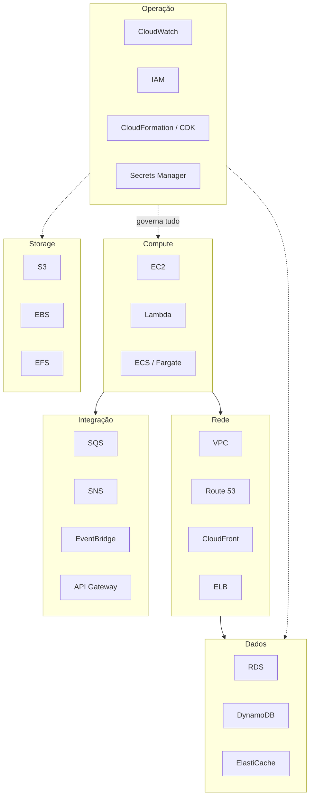
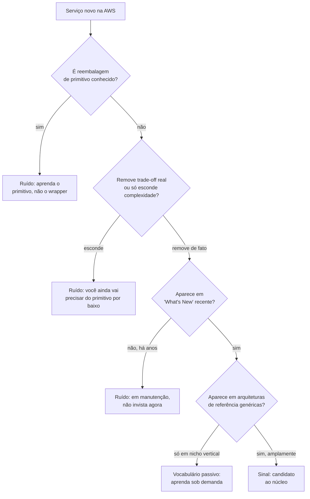

> [!abstract] TL;DR
> A AWS tem perto de 240 serviços listados no console, mas um núcleo de **~25** resolve a esmagadora maioria dos sistemas reais — os mesmos primitivos que este vault já ensinou nos galhos 1 a 20. O resto é nicho vertical, "me-too" competitivo, camada de conveniência sobre um primitivo que você já conhece, ou produto que existe porque um cliente enterprise específico pediu. Esta nota ensina o **framework** para separar sinal de ruído em qualquer serviço novo que a AWS anunciar — e mostra que o catálogo enxuto da DigitalOcean é, em essência, "só o núcleo" já pré-filtrado.

## O problema: 240 nomes, um cérebro que só aguenta 25

Abra o console da AWS e clique em "Services". A lista rola. E rola. Machine Learning tem uns 20 itens. Analytics, outros 20. Business Applications, mais uma dúzia. É fácil sair de lá com a sensação de que dominar a AWS significa memorizar centenas de siglas — e essa sensação é exatamente o que a nota anterior deste galho, [[03-Dominios/Tecnologia/Cloud/21 - AWS a fundo/01 - A filosofia da amplitude|A filosofia da amplitude]], nomeou como o efeito colateral inevitável de uma estratégia deliberada de amplitude: cobrir toda superfície de necessidade antes que um concorrente o faça.

Mas pense em como você realmente usa uma língua. O português tem mais de 300 mil palavras registradas em dicionário. Você não precisa de nenhuma fração relevante disso para ler este parágrafo, escrever um e-mail, discutir uma arquitetura com seu time ou dar uma entrevista técnica. Um vocabulário ativo de duas a três mil palavras já cobre a esmagadora maioria da comunicação cotidiana — o resto é vocabulário passivo (você reconhece quando vê) ou é simplesmente jargão de nicho que você aprende sob demanda, quando o contexto específico exige.

A AWS funciona do mesmo jeito. Existe um "vocabulário ativo" — os serviços que aparecem em praticamente toda arquitetura séria, que este vault já ensinou nos vinte galhos anteriores — e existe um "vocabulário passivo", muito maior, que você aprende quando (e só quando) um problema específico o exigir. Esse desequilíbrio entre catálogo e uso real é justamente o que a primeira nota deste galho, sobre a filosofia da amplitude da AWS, deixou como pergunta em aberto: por que uma empresa constrói 240 serviços sabendo que a maioria dos clientes só vai usar uma fração pequena deles. O erro de quem está começando não é não conhecer os 240; é não saber **qual pergunta fazer** para descobrir, diante de um serviço novo, se ele pertence ao vocabulário ativo de qualquer arquiteto ou é jargão de nicho que só importa em um contexto muito específico.

Essa é a habilidade que separa "conhecer a AWS" de "ter decorado a AWS": não é memorizar mais nomes, é ter um filtro confiável para o que memorizar.

## O núcleo: ~25 serviços, oito categorias

O núcleo que resolve a maioria dos sistemas reais se organiza nas mesmas categorias que estruturaram este domínio inteiro — o que não é coincidência: os galhos 1-20 foram desenhados justamente em torno desse núcleo, não do catálogo inteiro.

Repare que esse diagrama não tem nenhuma surpresa: é essencialmente o mapa dos galhos 5 a 18 redesenhado como catálogo. Isso é o ponto. Você já domina o núcleo — esta nota só nomeia explicitamente que ele *é* o núcleo, e te dá a tabela de referência para navegar de volta a cada peça.

| Serviço | Categoria | Galho da trilha | Quando alcançar |
| --- | --- | --- | --- |
| EC2 | Compute | [[03-Dominios/Tecnologia/Cloud/05 - Compute I — máquinas virtuais/01 - Anatomia de uma máquina virtual na nuvem\|Compute I]] | Precisa de controle total sobre o SO, ou carga que não encaixa em serverless/container |
| Lambda | Compute | [[03-Dominios/Tecnologia/Cloud/11 - Serverless e FaaS — Lambda a fundo/02 - Anatomia de uma função Lambda\|Serverless]] | Evento discreto, curta duração, escala imprevisível |
| ECS / Fargate | Compute | [[03-Dominios/Tecnologia/Cloud/12 - Containers gerenciados/02 - ECS e o modelo de tarefas\|Containers]] | Workload containerizado, quer PaaS-like sem gerenciar cluster |
| S3 | Storage | [[03-Dominios/Tecnologia/Cloud/08 - Armazenamento (object, block e file)/02 - Object storage a fundo\|Armazenamento]] | Qualquer objeto — arquivo, asset, backup, data lake |
| EBS | Storage | [[03-Dominios/Tecnologia/Cloud/08 - Armazenamento (object, block e file)/05 - Block storage — EBS e Volumes\|Armazenamento]] | Disco persistente anexado a uma instância |
| EFS | Storage | [[03-Dominios/Tecnologia/Cloud/08 - Armazenamento (object, block e file)/06 - File storage e a escolha do armazenamento\|Armazenamento]] | Sistema de arquivos compartilhado entre várias instâncias |
| VPC | Rede | [[03-Dominios/Tecnologia/Cloud/07 - Rede na nuvem (VPC)/01 - A VPC e o endereçamento\|Rede]] | Sempre — é o chão de qualquer coisa que roda na AWS |
| Route 53 | Rede | [[03-Dominios/Tecnologia/Cloud/10 - DNS, CDN e borda/01 - DNS na nuvem\|DNS, CDN e borda]] | DNS gerenciado, roteamento por latência/failover |
| CloudFront | Rede | [[03-Dominios/Tecnologia/Cloud/10 - DNS, CDN e borda/03 - CDN e cache de borda\|DNS, CDN e borda]] | Conteúdo estático ou dinâmico precisando de borda global |
| ELB | Rede | [[03-Dominios/Tecnologia/Cloud/06 - Compute II — elasticidade e balanceamento/02 - Balanceamento de carga na nuvem\|Compute II]] | Mais de uma instância/task atrás de um endpoint único |
| RDS | Dados | [[03-Dominios/Tecnologia/Cloud/09 - Bancos gerenciados/02 - RDS e Managed Databases a fundo\|Bancos gerenciados]] | Dado relacional, transacional, consultas com joins |
| DynamoDB | Dados | [[03-Dominios/Tecnologia/Cloud/09 - Bancos gerenciados/05 - NoSQL gerenciado (DynamoDB)\|Bancos gerenciados]] | Acesso por chave, escala massiva previsível, schema flexível |
| ElastiCache | Dados | [[03-Dominios/Tecnologia/Cloud/09 - Bancos gerenciados/06 - Cache gerenciado e a grande escolha\|Bancos gerenciados]] | Cache de sessão, rate limiting, hot data em memória |
| SQS | Integração | [[03-Dominios/Tecnologia/Cloud/13 - Mensageria e eventos gerenciados/02 - SQS a fundo\|Mensageria]] | Fila ponto-a-ponto, desacoplar produtor de consumidor |
| SNS | Integração | [[03-Dominios/Tecnologia/Cloud/13 - Mensageria e eventos gerenciados/03 - SNS e pub-sub\|Mensageria]] | Fan-out — um evento, vários assinantes |
| EventBridge | Integração | [[03-Dominios/Tecnologia/Cloud/13 - Mensageria e eventos gerenciados/04 - EventBridge e o event bus\|Mensageria]] | Roteamento de eventos por regra, integração entre sistemas desacoplados |
| API Gateway | Integração | [[03-Dominios/Tecnologia/Cloud/14 - API Gateway e edge de aplicação/01 - Por que um API Gateway\|API Gateway]] | Borda HTTP gerenciada na frente de Lambda/backend |
| CloudWatch | Operação | [[03-Dominios/Tecnologia/Cloud/17 - Observabilidade na cloud/02 - CloudWatch a fundo\|Observabilidade]] | Sempre — logs, métricas e alarmes de qualquer workload |
| IAM | Operação | [[03-Dominios/Tecnologia/Cloud/04 - Identidade e acesso (IAM)/01 - Por que identidade é o primeiro serviço\|IAM]] | Sempre — é o primeiro serviço que você toca em qualquer conta |
| CloudFormation / CDK | Operação | [[03-Dominios/Tecnologia/Cloud/16 - Infrastructure as Code/04 - IaC nativo — CloudFormation e CDK\|Infrastructure as Code]] | Provisionamento repetível, ambientes versionados |
| Secrets Manager | Operação | [[03-Dominios/Tecnologia/Cloud/18 - Segurança na cloud a fundo/03 - Segredos — Secrets Manager e Parameter Store\|Segurança]] | Credencial que precisa de rotação automática |

Vinte e uma linhas, oito categorias. Some a isso mais três ou quatro que aparecem com frequência mas não ganharam galho dedicado por não terem primitivo próprio — CloudTrail (auditoria, tratado dentro do galho de Segurança), Systems Manager (operação de frota, tangencial ao galho de Compute I), X-Ray (tracing distribuído, tratado dentro do galho de Observabilidade) — e você chega perto de 25. Esse é o vocabulário ativo. Ele resolve o backend de um SaaS, o pipeline de dados de uma fintech, o site de conteúdo de uma mídia, o app mobile de um marketplace. A imensa maioria dos sistemas que você vai projetar na carreira usa uma combinação desses ~25 nomes — não um subconjunto exótico dos outros 215.

## Os quatro sinais de ruído

Se o núcleo é ~25, o que são os outros ~215? Não é "lixo" — muitos resolvem problemas reais, para quem tem exatamente aquele problema. O que os separa do núcleo é que eles falham em pelo menos um destes quatro testes.

### 1. Nome de marketing sobre primitivo conhecido

Alguns serviços são, tecnicamente, uma reembalagem de um primitivo que você já domina, vendida com um nome que soa mais novo ou mais específico de indústria. Isso não é necessariamente ruim — às vezes o empacotamento economiza trabalho real —, mas o sinal de alerta é quando o nome promete uma categoria nova e a implementação, ao ler a documentação, revela um EC2 com uma AMI pré-configurada, ou um Lambda com um template pronto. Um exemplo didático: vários serviços da categoria "End User Computing" ou de analytics vertical, ao abrir o diagrama de arquitetura na documentação, revelam-se composições de EC2/Lambda/S3 por trás de um console dedicado — o produto novo é a interface de gestão, não um primitivo de infraestrutura novo. O teste aqui é sempre o mesmo: **abra a seção "How it works" da documentação e pergunte se o diagrama de arquitetura usa peças que você já reconhece**. Se sim, você não está aprendendo um primitivo novo — está aprendendo uma configuração de primitivos antigos, o que é útil saber que existe, mas não muda seu modelo mental da AWS.

### 2. Duplicação "com IA" ou "com mais mágica"

A AWS lança, com frequência, uma segunda (ou terceira) versão de um serviço que já existe, prometendo menos configuração manual — geralmente com "Intelligent", "Managed", ou "AI" no nome. Às vezes é genuinamente melhor (a segunda tentativa aprendeu com a primeira: foi assim que Fargate melhorou sobre operar EC2 cru para containers, e por isso Fargate está no núcleo, não no ruído). Às vezes é uma camada de abstração que remove controle que você precisava, sem eliminar a complexidade de fato — só a empurra para trás de uma API mais bonita, e ela reaparece no primeiro incidente de produção. O teste: **o serviço novo remove um trade-off real, ou só esconde a complexidade que ainda existe por baixo?** Se você ainda vai precisar entender o comportamento do primitivo original quando algo der errado — e quase sempre vai —, o serviço "mais fácil" só adicionou uma camada de tradução entre você e o problema real, não eliminou o problema.

### 3. Descontinuado ou em modo manutenção

A AWS raramente desliga um serviço publicamente (o compromisso de retrocompatibilidade é parte do contrato de confiança que sustenta a estratégia de amplitude), mas alguns entram silenciosamente em modo manutenção: sem feature nova há anos, documentação que não recebe atualização, e um serviço "irmão" mais novo que a própria AWS empurra em toda a documentação recente. O teste: **busque a data do último "What's New" desse serviço**. Se o histórico de anúncios está vazio há dois, três anos, e existe um substituto claro sendo promovido, você está olhando para um serviço em fim de vida silencioso — não é ruído no sentido de "nunca importou", é ruído no sentido de "não vale aprender agora, mesmo que ainda funcione". Vale o contraponto de honestidade: isso é raro no núcleo — EC2, S3, IAM e RDS têm décadas de retrocompatibilidade garantida —, e é comum na cauda longa do catálogo, onde a AWS testa apostas de produto com menos compromisso de longo prazo.

### 4. Existe por causa de um cliente enterprise específico

Boa parte do catálogo de "Business Applications", parte de "End User Computing" e vários serviços verticais (saúde, governo, mídia, setor público) nasceram porque um cliente grande da AWS — muitas vezes com contrato de milhões de dólares — precisava de algo muito específico, e a AWS decidiu produtizar aquela necessidade em vez de resolvê-la só para aquele cliente. Isso é racional do ponto de vista da AWS (amortiza o investimento, e ainda ganha um segundo cliente eventual), mas o resultado é um serviço genuinamente de nicho: resolve perfeitamente um problema que quase nenhum outro cliente tem. O teste: **o serviço aparece em arquiteturas de referência genéricas, ou só em estudos de caso de uma indústria muito específica?** Se é a segunda, ele pertence ao vocabulário passivo — você aprende quando (e se) seu contexto for aquele, e não antes.

## O framework de avaliação rápida

Junte os quatro testes acima numa sequência de quatro perguntas que você pode aplicar a *qualquer* serviço novo que a AWS anunciar — no keynote do re:Invent, num e-mail de "What's New", numa sugestão de um colega. Leva menos de cinco minutos por serviço.

1. **Qual primitivo isso encapsula?** Leia a arquitetura de referência na documentação. Se a resposta é "nenhum, é um primitivo genuinamente novo" (raro, mas acontece — Lambda foi isso em 2014, Fargate foi isso em 2017), preste atenção de verdade. Se a resposta é "EC2 com uma configuração específica" ou "um Step Functions com um template", você já sabe o suficiente sem se aprofundar mais.
2. **Qual o lock-in?** Todo serviço gerenciado tem algum grau de lock-in — isso não é, por si, um motivo para evitar (o galho de [[03-Dominios/Tecnologia/Cloud/03 - Well-Architected Framework/06 - Otimização de custo|Otimização de custo]] e o pilar de confiabilidade já discutiram esse trade-off). Mas vale perguntar: dá para migrar os dados/lógica para outro provedor com esforço razoável, ou o serviço te prende à API proprietária de um jeito que praticamente exige reescrita? Serviços de nicho tendem a ter lock-in mais alto justamente porque não têm equivalente em nenhum outro lugar — nem em outro provedor, nem open source.
3. **Existe alternativa gerenciada mais simples que já resolve 90% do problema?** Muito serviço de nicho existe para resolver os últimos 10% de um problema que um serviço do núcleo já resolve nos primeiros 90%. Se você ainda não tem esse problema resolvido nem nos 90%, comece pelo núcleo — o serviço de nicho é otimização prematura.
4. **Isso é GA (general availability) ou ainda preview?** Serviços em preview mudam de API, de preço, e às vezes desaparecem sem aviso — não é a base sobre a qual construir produção. Verifique o status explicitamente na página do serviço antes de investir tempo aprendendo os detalhes.

> [!info] Verificado 2026-07-24 — docs.aws.amazon.com
> A AWS documenta formalmente o ciclo "Preview → General Availability (GA)" para a maioria dos serviços novos, com aviso explícito de que funcionalidades em preview "podem mudar ou ser descontinuadas sem aviso prévio" e não têm as mesmas garantias de SLA que serviços GA. Isso está documentado em cada página de release notes que anuncia um serviço em preview — vale sempre checar o rodapé do anúncio antes de adotar algo recém-lançado em produção.

Se um serviço passa nos quatro testes — encapsula algo genuinamente novo, o lock-in é aceitável para o seu contexto, não existe alternativa mais simples que já resolve o problema, e está em GA — ele merece seu tempo de estudo. Se falha em qualquer um, ele não é "inútil"; é só **não prioritário agora**, e fica arquivado no seu vocabulário passivo até o dia em que o contexto específico o trouxer à tona.

## Caso prático: avaliando um serviço fictício de "recomendação de produtos"

Imagine que a AWS anuncia, num keynote de re:Invent, o "Amazon ProductGenius" — "recomendações de produto personalizadas com um clique, sem precisar de expertise em machine learning". Passa pelo framework:

1. *Qual primitivo isso encapsula?* A documentação revela: é um modelo de embeddings rodando sobre SageMaker, com dados armazenados em... DynamoDB, exposto via API Gateway, invocado por Lambda. Ou seja: o produto é uma composição de peças do núcleo que você já entende, com um modelo de ML pré-treinado por cima.
2. *Qual o lock-in?* Alto — o modelo de recomendação é proprietário, e migrar para outro provedor significa treinar um modelo do zero em outro lugar, não só mover dados.
3. *Existe alternativa mais simples que resolve 90%?* Depende do estágio do produto. Um catálogo pequeno com poucas centenas de itens frequentemente se sai bem com regra simples ("quem comprou X também comprou Y", calculada com uma query SQL agregada num RDS) — sem nenhum serviço de ML. Só em escala, com catálogo grande e sinal de comportamento rico, o ganho marginal de um modelo dedicado supera a complexidade de adotá-lo.
4. *GA ou preview?* Supondo GA: ainda assim, para a maioria dos times, a resposta correta na hora zero é "não agora" — comece com a query SQL, meça se a recomendação simples já move a métrica que importa, e só then avalie se o ganho justifica adotar um serviço vertical com lock-in alto.

Esse é o raciocínio que separa quem navega os 240 serviços com confiança de quem se afoga neles: a pergunta nunca é "esse serviço existe e resolve meu problema?" — quase qualquer serviço, olhado com otimismo suficiente, "resolve" alguma coisa. A pergunta é "esse serviço resolve *melhor* do que compor primitivos do núcleo que já domino, dado o lock-in e a complexidade que ele adiciona?".

## A lente DigitalOcean: o catálogo enxuto é o núcleo, pré-filtrado

Aqui a comparação entre os dois provedores ilumina o próprio argumento desta nota. A DigitalOcean tem, em ordem de grandeza, uma dúzia e meia de produtos principais no seu catálogo — não 240.

> [!info] Verificado 2026-07-24 — docs.digitalocean.com
> A documentação da DigitalOcean organiza o catálogo em categorias enxutas: Compute (Droplets, App Platform, Kubernetes, Functions), Storage (Spaces, Volumes), Databases (Managed Databases — Postgres, MySQL, Redis/Valkey, MongoDB, Kafka), Networking (VPC, Load Balancers, DNS, CDN), e um punhado de serviços de plataforma (Container Registry, Monitoring). Não há categorias equivalentes a "Business Applications", "End User Computing", "Quantum Technologies" ou dezenas de serviços verticais de indústria que compõem boa parte do volume do catálogo AWS.

Compare isso ao diagrama do núcleo AWS no início desta nota: a sobreposição é quase total. Droplet é EC2. Spaces é S3. Managed Databases é RDS/DynamoDB (ainda que sem o NoSQL de chave-valor nativo — DynamoDB não tem paralelo direto na DO, como este vault já discutiu em [[03-Dominios/Tecnologia/Cloud/09 - Bancos gerenciados/05 - NoSQL gerenciado (DynamoDB)|NoSQL gerenciado]]). App Platform e Functions cobrem o espaço de Fargate/Lambda com menos configuração. VPC, Load Balancers e DNS cobrem a camada de rede do núcleo quase peça por peça.

A diferença não é que a DO "não tem" o resto do catálogo AWS — é que ela nunca tentou construí-lo. Enquanto a AWS aposta que cobrir os 215 serviços de nicho eventualmente captura algum cliente que precisa exatamente daquilo, a DO aposta no argumento oposto: a maioria dos times nunca vai precisar de nada além do núcleo, então vale mais a pena tornar o núcleo excelente e simples de operar do que espalhar investimento em produtos de cauda longa. É essa aposta — "o catálogo enxuto basta para a maioria" — que o próximo galho deste domínio, dedicado inteiramente à DigitalOcean, vai desenvolver a fundo.

Isso também explica por que "migrar de AWS para DO" é, na prática, muito mais tranquilo quando sua arquitetura já usa só o núcleo: você está trocando Droplet por EC2, Spaces por S3, Managed Database por RDS — um mapeamento quase 1:1. É quando sua arquitetura depende de algo fora do núcleo — Global Tables, Aurora Global Database, um serviço vertical de nicho — que a migração deixa de ser tradução de nomes e vira reescrita real, como a nota de multi-region deste domínio já discutiu para o caso específico de resiliência entre regiões.

### Tabela de tradução: nomes equivalentes em Azure e GCP

Só para orientação de vocabulário — sem hands-on nestas duas, o foco deste vault continua sendo a lente AWS ↔ DigitalOcean:

| Categoria | AWS | Azure | GCP | DigitalOcean |
| --- | --- | --- | --- | --- |
| Compute geral | EC2 | Azure Virtual Machines | Compute Engine | Droplets |
| Serverless / FaaS | Lambda | Azure Functions | Cloud Functions / Cloud Run | Functions |
| Container gerenciado | ECS / Fargate | Azure Container Apps / AKS | Cloud Run / GKE | App Platform / DOKS |
| Object storage | S3 | Azure Blob Storage | Cloud Storage | Spaces |
| Banco relacional gerenciado | RDS | Azure SQL Database | Cloud SQL | Managed Databases (Postgres/MySQL) |

> [!warning] A armadilha do cargo-culting arquitetural
> A palestra de re:Invent que resolve um problema de escala de bilhões de usuários usando quinze serviços coordenados é conteúdo excelente — e é também a fonte mais comum de over-engineering em times pequenos. Um CRUD simples, com algumas centenas de usuários, **não precisa** de EventBridge, Step Functions, DynamoDB Global Tables e um API Gateway com autorizador Lambda customizado só porque foi assim que uma empresa de bilhões de dólares resolveu um problema numa escala completamente diferente. O sintoma clássico: uma arquitetura com mais serviços do que desenvolvedores no time, cada um exigindo conhecimento operacional próprio, para um sistema que um RDS, um ECS/Fargate e um Load Balancer resolveriam com uma fração da complexidade. A régua certa nunca é "quantos serviços AWS eu usei" — é "quantos serviços eu precisei usar para o RTO/RPO, a escala e o orçamento reais do meu contexto". Compor o núcleo com disciplina é, na esmagadora maioria dos casos, sinal de maturidade arquitetural — não de falta de ambição.

## O que vem a seguir

Você agora tem tanto o núcleo mapeado quanto o filtro para avaliar qualquer serviço fora dele. A próxima nota deste galho muda de eixo: em vez de "o quê" (quais serviços), o assunto é "como" — as quatro portas de operar a AWS (console, CLI, SDK e Infrastructure as Code) e quando cada uma é a ferramenta certa para o trabalho.

## Fontes

- [AWS Services overview](https://aws.amazon.com/products/)
- [AWS What's New — release notes e anúncios](https://aws.amazon.com/new/)
- [AWS Prescriptive Guidance — reference architectures](https://docs.aws.amazon.com/prescriptive-guidance/latest/architecture-icons/welcome.html)
- [DigitalOcean Products documentation](https://docs.digitalocean.com/products/)
- [DigitalOcean Managed Databases documentation](https://docs.digitalocean.com/products/databases/)
