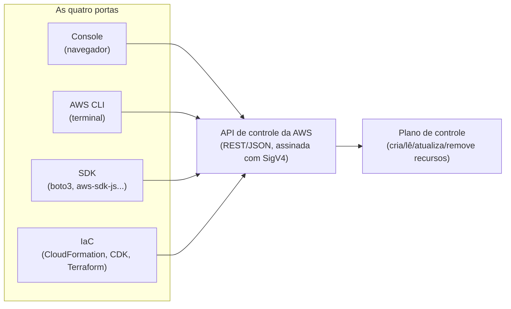
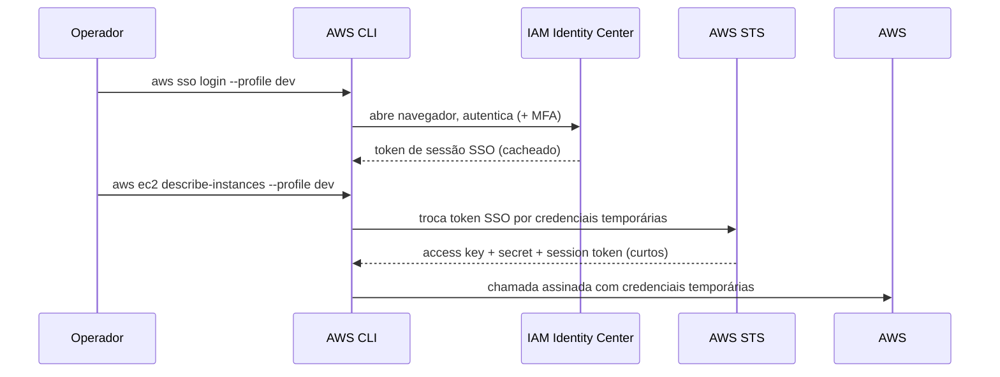
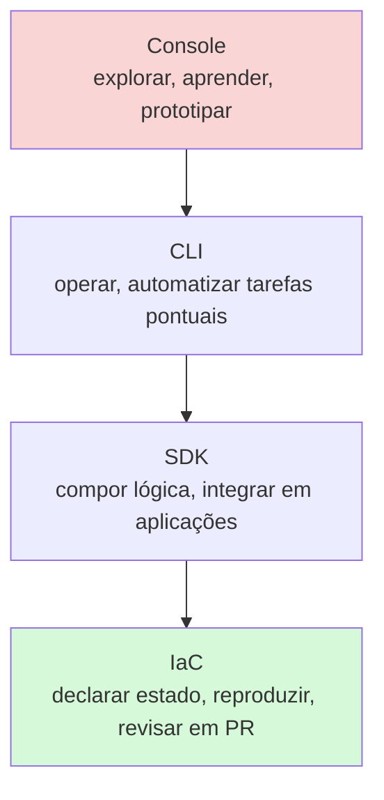

> [!abstract] TL;DR
> "Tudo é uma API" na AWS — o console, a CLI, os SDKs e as ferramentas de IaC são só quatro portas diferentes pra chamar exatamente a mesma API de controle. A maturidade sênior não é decorar comandos: é saber qual porta usar em cada momento. Console pra explorar e depurar visualmente (nunca pra reproduzir). CLI pra operar rápido e escriptar tarefas pontuais, com IAM Identity Center (SSO) fornecendo credenciais temporárias em vez de chaves de longa duração. SDK quando o script cresce e vira lógica de aplicação. IaC quando o resultado precisa ser reproduzível, revisável e versionado — é aí que mora produção. A escada console → CLI → IaC é, literalmente, uma escada de maturidade operacional.

## O problema: quatro jeitos de fazer a mesma coisa

Imagine que você acabou de herdar o acesso a uma conta AWS de um cliente. Precisa saber quantas instâncias EC2 estão rodando. Você tem, ao menos, quatro caminhos:

1. Abrir o console, navegar até EC2, olhar a lista.
2. Rodar `aws ec2 describe-instances` no terminal.
3. Escrever um script Python com `boto3.client("ec2").describe_instances()`.
4. Escrever um bloco Terraform ou CDK que declara o estado desejado e deixa a ferramenta reconciliar.

As quatro chamam **a mesma API HTTP** por baixo — a AWS não tem "API do console" e "API da CLI" separadas. O console é, ele mesmo, um cliente dessa API (é por isso que, historicamente, algumas features apareciam primeiro na API/CLI e só depois ganhavam tela no console, e às vezes o inverso). Entender isso resolve uma pergunta comum de quem chega de outros provedores mais simples: por que a AWS parece ter "várias AWS's diferentes" dependendo de como você acessa. Não tem. Tem uma API de controle, e quatro portas de entrada com propósitos, fricções e garantias bem diferentes.



Isso muda como você lê qualquer tutorial da AWS: quando a doc mostra um passo-a-passo no console, ela está descrevendo *uma* forma de emitir chamadas de API — não *a* forma canônica. A galho [[03-Dominios/Tecnologia/Cloud/21 - AWS a fundo/01 - A filosofia da amplitude|01 - A filosofia da amplitude]] já tratou por que a AWS tem esse volume de serviços; aqui a pergunta é operacional: dado esse catálogo enorme, como você efetivamente *toca* nele no dia a dia.

## Porta 1 — Console: bom pra aprender e depurar, péssimo pra reproduzir

O console AWS é ótimo em três situações específicas:

- **Exploração**: você não sabe que serviço resolve seu problema, então navega, lê descrições, vê o que cada tela oferece.
- **Aprendizado**: ver os campos de um formulário de criação de recurso ensina, de forma visual, quais parâmetros existem — muitas vezes mais rápido que ler a referência da CLI.
- **Debug visual**: gráficos de métricas, árvores de recursos relacionados, mensagens de erro contextualizadas — coisas que o terminal expõe de forma mais crua.

O problema aparece quando o console vira o *único* jeito de operar em produção. Isso tem nome: **ClickOps**. É o antipadrão de configurar infraestrutura clicando em telas, sem deixar rastro de como aquele estado foi alcançado. Os sintomas:

- Ninguém sabe reproduzir o ambiente de staging em outra conta, porque ele foi montado por 40 cliques ao longo de meses.
- Um recurso crítico existe porque alguém clicou "criar" numa sexta-feira às 18h, sem revisão de ninguém.
- Auditoria vira arqueologia: você precisa reconstruir o histórico de mudanças olhando CloudTrail em vez de ler um diff de código.
- Drift silencioso: alguém "só ajusta uma coisinha" no console de um recurso que também é gerenciado por Terraform, e agora o state mente.

> [!warning] ClickOps não é pecado — é dívida técnica não reconhecida
> Usar o console pra prototipar ou aprender é saudável. O problema é quando aquele protótipo "clicado" vira produção sem nunca ser convertido em código. Se você não consegue responder "como eu recrio isso do zero, em outra conta, em 10 minutos?", você tem ClickOps — mesmo que o ambiente esteja funcionando perfeitamente agora.

A régua prática: console pra decidir *o quê* construir; CLI ou IaC pra efetivamente construir.

## Porta 2 — AWS CLI: a ferramenta de trabalho do dia a dia

A CLI é o ponto de partida de quase todo fluxo operacional sério. Instalar é simples — a AWS distribui um instalador nativo por SO (o pacote `awscli` v2 é o padrão atual; a v1, baseada em Python, está em manutenção legada). Depois de instalada, o primeiro passo é configurar credenciais.

### `aws configure` clássico vs. perfis nomeados

O jeito mais simples é `aws configure`, que grava um `access key id` e `secret access key` direto em `~/.aws/credentials`, e região/formato de saída em `~/.aws/config`. Isso funciona, mas cria exatamente o problema que o galho [[03-Dominios/Tecnologia/Cloud/04 - Identidade e acesso (IAM)/02 - Usuários, grupos e o problema da credencial de longa duração|04/02 - Usuários, grupos e o problema da credencial de longa duração]] já trabalhou: uma chave de acesso de longa duração, sentada num arquivo texto, sem expiração automática.

Perfis nomeados resolvem a organização (você trabalha com várias contas — dev, staging, produção, contas de clientes), mas por si só não resolvem a segurança da credencial. Um `~/.aws/config` com perfis nomeados típico:

```ini
[profile dev]
region = us-east-1
output = json

[profile prod]
region = sa-east-1
output = json
```

E o `~/.aws/credentials` correspondente (modelo de chave estática — evite isto para uso diário):

```ini
[dev]
aws_access_key_id = AKIA...
aws_secret_access_key = ...

[prod]
aws_access_key_id = AKIA...
aws_secret_access_key = ...
```

Qualquer comando aceita `--profile <nome>` pra escolher qual identidade usar:

```bash
aws s3 ls --profile dev
aws ec2 describe-instances --profile prod --region sa-east-1
```

### O jeito certo: IAM Identity Center (SSO)

> [!info] Verificado em 2026-07-24 na doc oficial da AWS CLI
> A partir da CLI v2.22.0, o fluxo padrão de `aws configure sso` usa PKCE (Proof Key for Code Exchange) em vez do fluxo de device code mais antigo — o navegador abre automaticamente na mesma máquina. O flag `--use-device-code` força o fluxo legado (útil em ambientes sem browser local, tipo SSH remoto). Como CLIs mudam de versão com frequência, vale reconferir `aws --version` e a doc antes de reproduzir passo a passo.

O caminho recomendado hoje é configurar um perfil ligado ao **AWS IAM Identity Center** (o antigo AWS SSO), que emite credenciais **temporárias** em vez de chaves estáticas. O assistente interativo:

```bash
aws configure sso
```

Pede a URL de start do Identity Center, a região onde ele vive, e então abre o navegador pra você autenticar (com MFA, se sua organização exigir — o que deveria ser sempre). Depois de escolher a conta e a role (permission set) disponíveis, ele grava algo assim em `~/.aws/config`:

```ini
[profile my-dev-profile]
sso_session = my-sso
sso_account_id = 123456789011
sso_role_name = ReadOnly
region = us-east-1
output = json

[sso-session my-sso]
sso_region = us-east-1
sso_start_url = https://my-sso-portal.awsapps.com/start
sso_registration_scopes = sso:account:access
```

Note: não há `secret_access_key` gravado em disco. As credenciais reais são obtidas sob demanda, via um token de sessão cacheado em `~/.aws/sso/cache/`, e **expiram** — por padrão, o tempo de vida de sessão é definido pela política do Identity Center (tipicamente horas, não meses). Pra autenticar (ou renovar quando expira):

```bash
aws sso login --profile my-dev-profile
```

E pra confirmar quem você é, antes de qualquer operação destrutiva:

```bash
aws sts get-caller-identity --profile my-dev-profile
```

Isso devolve o ARN da identidade ativa — o primeiro comando que qualquer operador sênior roda ao trocar de contexto, porque `--profile` errado num comando de `terminate-instances` é o tipo de erro que vira post-mortem.



Isso é o mesmo padrão de **assumir role** que o galho [[03-Dominios/Tecnologia/Cloud/04 - Identidade e acesso (IAM)/04 - Roles e credenciais temporárias|04/04 - Roles e credenciais temporárias]] explicou em profundidade — o Identity Center é só uma camada de conveniência em cima de STS, que troca autenticação humana (com MFA) por credenciais efêmeras de curta duração.

> [!tip] Assista: AWS CLI com Single Sign-On: O Passo a Passo que Todo Dev/DevOps Precisa Saber
> **Canal:** Carlos Biagolini | **Duração:** ~34min | **Idioma:** PT-BR
>
> Passo a passo prático de configurar `aws configure sso` de ponta a ponta, com o argumento de segurança que esta nota só resume: por que revogar acesso via Identity Center é instantâneo, enquanto uma access key estática de um ex-colaborador continua válida até alguém lembrar de apagá-la manualmente.
> Trecho de destaque [00:49]: *"Ele tem chaves de acesso... em algum momento a pessoa é desligada da empresa. Se você utilizar o access key ID... essa pessoa vai continuar tendo acesso àquela máquina, àquela conta, a não ser que você vá lá e remova o usuário — no caso do SSO [a revogação é automática]."*
>
> 🎬 [Assistir no YouTube](https://www.youtube.com/watch?v=Ytr5B8sfbFk)

### Comandos que você vai digitar toda semana

```bash
# Quem eu sou agora?
aws sts get-caller-identity

# Listar buckets S3
aws s3 ls

# Ver conteúdo de um bucket
aws s3 ls s3://meu-bucket/caminho/

# Listar instâncias EC2, filtrando por estado
aws ec2 describe-instances \
  --filters "Name=instance-state-name,Values=running" \
  --query "Reservations[].Instances[].[InstanceId,InstanceType]" \
  --output table

# Trocar de conta/role sem editar nada, só apontando o profile
aws s3 ls --profile prod
```

O flag `--query` (JMESPath) e `--output table|json|yaml|text` são o que separam quem usa a CLI casualmente de quem a usa como ferramenta de produtividade real — vale investir meia hora aprendendo a sintaxe do JMESPath.

## Porta 3 — SDK: quando o script vira lógica

A CLI é ótima para comandos pontuais e para scripts de shell simples (um `for` com `aws ec2 ...` dentro, por exemplo). Mas ela tem limites naturais: parsing de JSON em bash é frágil, tratamento de erro é rudimentar, e não dá pra compor lógica complexa (retries com backoff customizado, paginação programática, orquestração condicional) sem sair do shell.

É aí que entra o SDK — `boto3` em Python, `aws-sdk-js`/`@aws-sdk/client-*` em JavaScript/TypeScript, SDKs equivalentes em Java, Go, .NET, Ruby. O SDK expõe a **mesma API** que a CLI e o console usam, mas como objetos e métodos nativos da linguagem, com tipos, exceções estruturadas e paginação automática.

```python
import boto3

session = boto3.Session(profile_name="dev")
ec2 = session.client("ec2")

response = ec2.describe_instances(
    Filters=[{"Name": "instance-state-name", "Values": ["running"]}]
)

for reservation in response["Reservations"]:
    for instance in reservation["Instances"]:
        print(instance["InstanceId"], instance["InstanceType"])
```

A regra prática pra escolher CLI vs. SDK: se o que você precisa cabe numa linha (ou num pipe de duas), CLI. Se você precisa de laço, condicional, tratamento de erro específico, ou o script vai ser reexecutado como parte de uma aplicação (uma Lambda, um job de CI, um backend que consulta a AWS em runtime), SDK. Muita automação de infraestrutura madura usa os dois: CLI para operação manual/debug, SDK para código que roda de verdade em produção.

## Porta 4 — IaC: quando o resultado precisa ser reproduzível

Console, CLI e SDK têm algo em comum: todos são **imperativos** — você diz *o que fazer* (crie esta instância, delete este bucket), e a AWS executa. IaC inverte isso: você declara *o estado desejado*, e a ferramenta calcula o diff e reconcilia.

O galho [[03-Dominios/Tecnologia/Cloud/16 - Infrastructure as Code/02 - Terraform a fundo|16 - Infrastructure as Code]] já cobriu Terraform em profundidade — modelo de state, providers, plan/apply. Aqui o foco é o que é **específico da AWS**: CloudFormation e o CDK.

**CloudFormation** é o IaC nativo da AWS: você escreve um template YAML ou JSON declarando recursos, a AWS gerencia o *stack* inteiro (criação, atualização via changesets, rollback automático em falha) sem precisar de state file externo — o estado vive dentro do serviço CloudFormation.

```yaml
Resources:
  MeuBucket:
    Type: AWS::S3::Bucket
    Properties:
      BucketName: meu-bucket-exemplo-2026
      VersioningConfiguration:
        Status: Enabled
```

**CDK (Cloud Development Kit)** resolve o principal incômodo de escrever YAML/JSON à mão: você escreve infraestrutura em uma linguagem de programação real (TypeScript, Python, Java, C#, Go), com loops, funções, classes, e o CDK **compila isso para um template CloudFormation** por baixo. Você ganha autocomplete, tipos, testes unitários de infraestrutura — mas o motor de execução continua sendo CloudFormation.

```python
from aws_cdk import Stack, aws_s3 as s3
from constructs import Construct

class MinhaStack(Stack):
    def __init__(self, scope: Construct, id: str, **kwargs):
        super().__init__(scope, id, **kwargs)
        s3.Bucket(self, "MeuBucket", versioned=True)
```

O modelo mental do CDK é de **stacks** compostas por **constructs** (blocos reutilizáveis, desde um bucket individual até um padrão de arquitetura inteiro empacotado por um time de plataforma). Isso é diferente do modelo de módulos do Terraform, mas resolve o mesmo problema: reuso e composição.

Onde cada um brilha:

- **CloudFormation puro**: quando você quer o motor nativo, sem dependências externas, e o YAML/JSON declarativo é suficiente.
- **CDK**: quando a equipe já pensa em código (não config) e quer lógica de programação real sobre a infraestrutura, ficando 100% dentro do ecossistema AWS.
- **Terraform**: quando a infraestrutura é multi-cloud, multi-provider (DNS, SaaS, Kubernetes, e AWS ao mesmo tempo), ou quando o time já padronizou nele antes de decidir por provedor.

> [!tip] Assista: Terraform, AWS CloudFormation, CDK ou Crossplane?
> **Canal:** Douglas Mugnos | **Duração:** ~13min | **Idioma:** PT-BR
>
> Compara as mesmas três ferramentas desta nota e ainda entra em Crossplane/ACK como alternativas emergentes — o detalhe que mais acrescenta é confirmar, sem rodeio, que o CDK não é um motor de execução próprio: ele compila para CloudFormation por baixo, exatamente como esta nota descreve.
> Trecho de destaque [02:03]: *"Ele basicamente usa o CDK, usa CloudFormation por trás dos panos. E quando você executa um código, você abre [o console CloudFormation e vê o stack sendo criado]."*
>
> 🎬 [Assistir no YouTube](https://www.youtube.com/watch?v=agciBgF61-U)

## A escada de maturidade



Não é uma escada que você sobe uma vez e nunca desce — um operador sênior transita entre as quatro o dia inteiro. A maturidade está em **saber para que serve cada degrau**: console pra debugar um incidente às 3h da manhã (você não vai escrever Terraform sob pressão), CLI pra verificar rapidamente um estado, SDK pra automação que vira produto, IaC pra qualquer coisa que precisa sobreviver ao próximo deploy e ao próximo funcionário que herdar a conta.

## A lente DigitalOcean: as mesmas quatro portas, muito mais enxutas

A DigitalOcean segue exatamente o mesmo padrão de "tudo é API" — só que com uma superfície drasticamente menor, o que muda a experiência prática.

- **Console**: o painel DO é conhecidamente mais simples e direto que o da AWS — reflexo de ter uma fração do catálogo de serviços (ver [[03-Dominios/Tecnologia/Cloud/21 - AWS a fundo/02 - Sinal e ruído no catálogo|02 - Sinal e ruído no catálogo]] sobre o tamanho do catálogo AWS). ClickOps na DO dói menos, mas o princípio — não deixar produção depender só de cliques — continua valendo.
- **CLI — `doctl`**: o equivalente funcional da AWS CLI. Autenticação é mais simples: `doctl auth init --context <nome>` pede um token de API pessoal (gerado no painel) e grava um contexto nomeado localmente — o equivalente a um perfil. Trocar de conta é `doctl auth switch --context <nome>`.

```bash
doctl auth init --context prod
doctl compute droplet list
doctl apps list
```

> [!info] Verificado em 2026-07-24 na doc oficial do doctl
> A DO **não tem** um equivalente direto ao IAM Identity Center/SSO com credenciais temporárias federadas — o modelo de `doctl` é token de API pessoal, mais próximo do `aws configure` clássico da AWS do que do fluxo SSO. Se sua organização precisa de rotação automática e MFA corporativo, isso é uma lacuna real de paridade, não um detalhe de nomenclatura — trate como tal ao migrar processos de uma nuvem pra outra.

- **SDK**: a DO mantém SDKs oficiais (Go, Python, e outros da comunidade) que espelham a mesma API REST usada pelo `doctl` e pelo console — o mesmo princípio de "uma API, várias portas".
- **IaC**: o Terraform provider da DigitalOcean é o caminho dominante pra IaC "de verdade" — não existe um "CloudFormation da DO". Mas a DO tem um artefato interessante e específico da plataforma: o **App Spec**, um YAML que declara toda a configuração de uma aplicação no App Platform (serviços, variáveis de ambiente, bancos, domínios) de forma muito mais compacta que um stack CloudFormation equivalente:

```yaml
name: minha-app
region: nyc
services:
  - name: api
    github:
      repo: usuario/repositorio
      branch: main
    environment_slug: node-js
    http_port: 3000
    instance_count: 1
```

```bash
doctl apps create --spec app.yaml
```

Esse contraste é didático: o App Spec resolve, em ~10 linhas, o que no mundo AWS envolveria compor várias peças (ECS ou App Runner, um load balancer, variáveis de ambiente via Secrets Manager ou Parameter Store, roteamento). Não é que a DO seja "melhor" — é que ela resolve um subconjunto do problema, com muito menos partes móveis, ao custo de menos controle fino.

## Tabela comparativa: as portas AWS ↔ DigitalOcean

| Porta | AWS | DigitalOcean | Observação |
|---|---|---|---|
| Console | AWS Management Console | Painel DigitalOcean | DO é objetivamente mais simples — catálogo menor |
| CLI | `aws` (AWS CLI v2) | `doctl` | Mesma filosofia; DO tem bem menos subcomandos |
| Autenticação CLI | IAM Identity Center (SSO) + STS, credenciais temporárias | Token de API pessoal via `doctl auth init` | AWS tem paridade superior aqui — sem SSO nativo na DO |
| Perfis/contextos | `--profile` (`~/.aws/config`) | `--context` (`doctl auth switch`) | Conceito equivalente, granularidade AWS é maior (roles, contas, permission sets) |
| SDK | boto3, aws-sdk-js, e dezenas de outros | SDKs oficiais Go/Python + comunidade | AWS tem cobertura de linguagem muito mais ampla |
| IaC nativo | CloudFormation / CDK | Não existe equivalente nativo | DO depende do Terraform provider da comunidade/DO |
| IaC de aplicação | (composição manual de vários serviços) | App Spec YAML (App Platform) | DO oferece um artefato de app inteira; AWS não tem equivalente de 1 arquivo |
| Verificação de identidade | `aws sts get-caller-identity` | `doctl account get` | Ambos confirmam "quem sou eu agora" antes de operar |

## Azure e GCP: só os nomes, pra reconhecer em outra sala

| Conceito | AWS | Azure | GCP | Observação |
|---|---|---|---|---|
| CLI oficial | AWS CLI (`aws`) | Azure CLI (`az`) | gcloud CLI (`gcloud`) | Todas seguem o mesmo padrão de "porta pra mesma API" |
| Autenticação federada/SSO | IAM Identity Center | Microsoft Entra ID (login `az login`) | Workload Identity Federation / `gcloud auth login` | Todas oferecem credenciais temporárias via SSO corporativo |
| SDK | boto3 e afins | Azure SDK (`azure-*`) | Google Cloud Client Libraries | Mesma filosofia, ecossistemas de linguagem próprios |
| IaC nativo | CloudFormation / CDK | ARM templates / Bicep | Deployment Manager (legado) / infra via Terraform | Azure tem o Bicep como sucessor moderno do ARM; GCP se apoia mais em Terraform |

## O que vem a seguir

Esta nota resolveu o *como* tocar a AWS — as portas. A próxima nota do galho (04) muda de eixo: depois de entender que existem ~240 serviços e quatro formas de operá-los, falta cobrir os **big rocks** que ainda não apareceram nos galhos 1-20 — serviços grandes o suficiente pra merecer nome próprio, mas que não couberam nos primitivos já ensinados. É aí que o catálogo apresentado no galho 02 ganha peso concreto: quais desses blocos realmente importam pra quem projeta sistemas em produção.

## Fontes

- AWS CLI User Guide — Configuring IAM Identity Center authentication: https://docs.aws.amazon.com/cli/latest/userguide/cli-configure-sso.html
- AWS CLI Reference — `aws sts get-caller-identity`: https://docs.aws.amazon.com/cli/latest/reference/sts/get-caller-identity.html
- AWS CLI User Guide — Configuration and credential file settings: https://docs.aws.amazon.com/cli/latest/userguide/cli-configure-files.html
- AWS CDK Developer Guide — Home: https://docs.aws.amazon.com/cdk/v2/guide/home.html
- AWS CloudFormation User Guide — Template anatomy: https://docs.aws.amazon.com/AWSCloudFormation/latest/UserGuide/template-anatomy.html
- DigitalOcean — doctl reference: https://docs.digitalocean.com/reference/doctl/
- DigitalOcean — How to Install and Configure doctl: https://docs.digitalocean.com/reference/doctl/how-to/install/
- DigitalOcean — App Platform App Spec reference: https://docs.digitalocean.com/products/app-platform/reference/app-spec/
