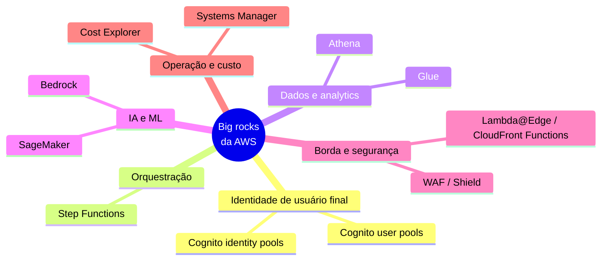
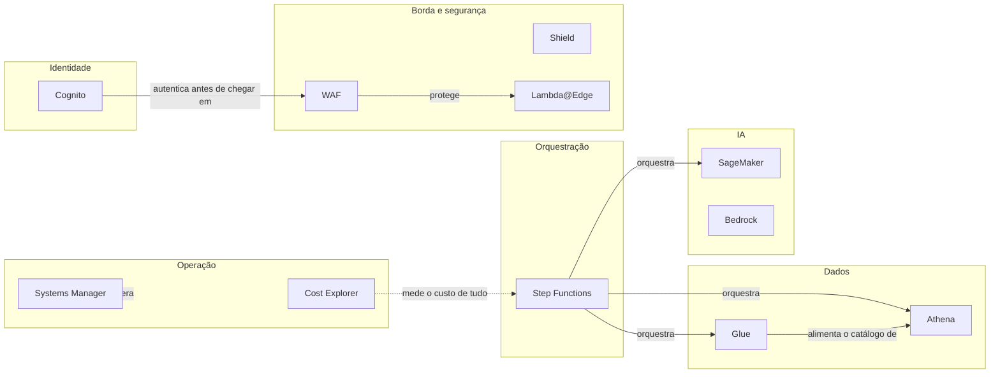

> [!abstract] TL;DR
> Vinte galhos te deram os primitivos — computação, rede, armazenamento, banco, identidade de máquina, serverless, mensageria, borda. Mas a AWS tem quase 250 serviços, e uma dúzia deles são "big rocks": grandes o bastante pra você precisar reconhecer o nome quando aparecer numa arquitetura, mesmo sem dominar a fundo. Esta nota é um mapa de reconhecimento — o que cada um é, que problema resolve, quando você vai esbarrar nele — não um tutorial. A régua honesta: a maioria não tem equivalente na DigitalOcean, e é exatamente aí que a amplitude da AWS compra a complexidade.

## O problema: você não pode ser T-shaped em tudo

Imagina que você acabou de fechar os vinte galhos anteriores. Você sabe montar uma VPC, subir um Lambda, desenhar uma política IAM least-privilege, escolher entre SQS e EventBridge, calcular RTO/RPO pra um plano de DR. Você tem, com justiça, a sensação de que entende a AWS.

Aí você entra numa reunião de arquitetura e alguém diz: "isso aqui a gente resolve com Step Functions orquestrando uma Athena query e um pipeline no Glue, com autenticação via Cognito user pool". Quatro nomes próprios, zero explicação, e o resto da sala assentindo. Você não precisa saber operar os quatro — mas precisa saber, em menos de cinco segundos, que categoria de problema cada um resolve, senão a conversa passa por cima de você.

Esse é o buraco que esta nota tapa. Não é profundidade — é *nomenclatura com propósito*. A régua de "o que merece um mapa mental aqui" é simples: o serviço aparece com frequência em arquiteturas de referência, resolve uma categoria de problema que os primitivos não resolvem sozinhos, e tem massa crítica suficiente pra ser um substantivo próprio na cabeça de qualquer arquiteto AWS sênior.



## Cognito — identidade para quem usa o seu produto, não para quem opera a AWS

O galho 4 te ensinou IAM: roles, políticas, credenciais temporárias, least privilege. Mas IAM responde a uma pergunta específica — "esta máquina, este operador, este pipeline de CI pode chamar esta API da AWS?". IAM é identidade *de dentro pra dentro*: quem opera a infraestrutura.

Cognito responde a uma pergunta diferente: "este usuário final do meu app consegue provar quem é, e depois disso, consegue acessar recursos da minha aplicação (não da AWS)?". É identidade *de fora pra dentro* — B2C, o usuário do seu SaaS, do seu app mobile, do seu e-commerce.

A documentação oficial da AWS separa Cognito em dois componentes que operam de forma independente ou em conjunto:

- **User pools** são um diretório de usuários com autenticação embutida. Você cria um user pool quando quer autenticar e autorizar usuários no seu app ou API — cadastro, login, MFA (TOTP ou SMS), fluxos customizados, federação com IdPs de terceiros (Google, Facebook, Apple) ou corporativos (SAML, OIDC). Um user pool é, sozinho, um IdP OIDC completo: ele emite JWTs (ID token, access token) direto pro seu app, sem precisar de mais nada.
- **Identity pools** resolvem um problema diferente: dado um usuário já autenticado (por um user pool, por um SAML IdP, por login social, ou até anônimo), como esse usuário troca essa prova de identidade por credenciais AWS temporárias — via AWS STS — pra acessar recursos AWS de verdade (um bucket S3, uma tabela DynamoDB)? Identity pools fazem RBAC (papel IAM por grupo de claims) ou ABAC (tags de sessão a partir de atributos do usuário).

O fluxo canônico dos dois juntos: usuário loga no user pool → recebe tokens OAuth 2.0 → app troca o token do user pool por credenciais temporárias no identity pool → app usa essas credenciais pra chamar S3 ou DynamoDB diretamente do cliente, sem expor nenhuma chave de longa duração.

Se este tema te interessa de verdade — protocolos, OAuth 2.1, o "porquê" por trás de user pools vs identity pools, os trade-offs de cada padrão de federação — o domínio Auth e Identidade do vault cobre isso em profundidade tool-neutra; Cognito é a encarnação AWS de conceitos que já foram destrinchados lá.

**DigitalOcean**: não tem um serviço equivalente a Cognito. Não existe um "DO Identity" gerenciado com user pools, MFA embutido e federação social pronta. Se você precisa disso na DO, você monta com uma ferramenta de terceiros (Auth0, Keycloak self-hosted, Supabase Auth) rodando em cima dos primitivos de compute da DO. É uma lacuna real de amplitude, não uma equivalência escondida.

> [!tip] Assista: Amazon Cognito: User Pools vs. Identity Pools Explained
> **Canal:** AWS Explainers | **Duração:** ~9min | **Idioma:** EN
>
> Fecha exatamente a distinção que esta seção traça — "quem é meu usuário" (user pool) vs. "o que meu usuário pode fazer dentro da AWS" (identity pool) — com a analogia de identity pool como uma "máquina de vender credenciais temporárias" que ajuda a fixar o modelo mental.
> Trecho de destaque [03:19]: *"If user pools answer 'who is my user', identity pools answer a totally different question: what can my user do inside of AWS? ...Think of it more like a credential vending machine. You feed it a trusted token... and in return it spits out temporary AWS credentials."*
>
> 🎬 [Assistir no YouTube](https://www.youtube.com/watch?v=Q65JhVBoV44)

## Step Functions — quando "chamar uma função depois da outra" vira um workflow de verdade

O galho 15 (arquiteturas serverless e event-driven) já te apresentou Step Functions de raspão, na nota sobre orquestração vs coreografia, e tem uma nota inteira dedicada — "03 - Step Functions a fundo" — cobrindo estados, ASL, padrões de integração e error handling em detalhe. Não vou reexplicar aqui; o que importa nesta nota-mapa é você fixar *quando* esse nome aparece na sua cabeça.

A pergunta que Step Functions responde: você tem uma sequência de passos — chamar um Lambda, esperar um job do Glue terminar, decidir um caminho baseado no resultado, tentar de novo se falhar, esperar aprovação humana — e precisa disso **visível, auditável e resiliente**, sem escrever você mesmo a lógica de retry/estado/timeout espalhada em código. Step Functions modela isso como uma máquina de estados declarativa (Amazon States Language, um JSON) que a AWS executa e visualiza pra você.

Segundo a documentação oficial, existem dois tipos de workflow com trade-offs opostos:

| Característica | Standard | Express |
|---|---|---|
| Semântica de execução | exactly-once | at-least-once |
| Duração máxima | até 1 ano | até 5 minutos |
| Taxa de execução | 2.000/s | 100.000/s |
| Cobrança | por transição de estado | por número e duração de execuções |
| Uso típico | workflows longos, auditáveis, humanos no loop | alto volume, streaming, IoT |

Step Functions integra nativamente com mais de 200 serviços AWS via SDK integrations, e tem integrações "otimizadas" (com padrões de espera/callback prontos) para um conjunto menor — Lambda, Glue, Athena, SageMaker, ECS/EKS, DynamoDB, SNS/SQS, EventBridge, entre outros. É o cimento que conecta os big rocks desta nota entre si: um workflow típico de dados pode chamar Glue pra transformar, Athena pra consultar, e SageMaker pra inferir, tudo orquestrado por uma única máquina de estados.

**DigitalOcean**: sem equivalente gerenciado. Orquestração de workflow na DO é "monte você mesmo" — um cron job, uma fila (o produto de mensageria gerenciada da DO é limitado comparado a SQS/EventBridge), ou uma ferramenta externa tipo Temporal ou Airflow rodando num Droplet ou App Platform.

> [!tip] Assista: What are AWS Step Functions? (and why you should love them)
> **Canal:** Be A Better Dev | **Duração:** ~14min | **Idioma:** EN
>
> Detalha o retry policy configurável (linear vs. exponential backoff) que a tabela Standard/Express desta nota só menciona por cima — útil pra visualizar por que Step Functions substitui a lógica de retry espalhada em código que esta nota descreve como o problema original.
> Trecho de destaque [01:16]: *"It's almost as if Step Functions are an orchestration for an application — something that's really great about them... is that they have built-in retry functionality, and you can set this up however you want: retry three times, no retry policy, exponential back-off or linear."*
>
> 🎬 [Assistir no YouTube](https://www.youtube.com/watch?v=zCIpWFYDJ8s)

## Athena e Glue — SQL direto sobre o data lake, sem subir banco nenhum

Imagina que você tem terabytes de logs, eventos ou exports acumulados em buckets S3 — o padrão *data lake*: dados brutos, formatos variados (JSON, Parquet, CSV), sem schema rígido de banco relacional. Como você faz uma pergunta analítica ad-hoc — "quantos usuários fizeram X no mês passado" — sem primeiro montar um pipeline de ETL completo e carregar tudo num data warehouse?

**Athena** é a resposta da AWS: um serviço de query interativo que aponta direto pro S3 e deixa você rodar SQL padrão contra esses arquivos, sem provisionar nenhum servidor. A documentação oficial é explícita — Athena é serverless, você paga só pelas queries que roda, e ele escala automaticamente rodando queries em paralelo. Além de SQL, Athena também roda notebooks Apache Spark gerenciados, pro caso de você precisar de processamento além de SQL puro.

**Glue** é o parceiro de Athena que resolve o problema anterior na cadeia: antes de consultar, alguém precisa saber *o que* tem no S3 — schema, formato, partições. O Glue Data Catalog é esse metastore centralizado, e o Glue ETL é o serviço gerenciado (baseado em Spark) pra transformar dados brutos em formatos otimizados pra consulta (tipicamente Parquet particionado). Na prática, o par Athena+Glue é a dupla "consulta SQL serverless sobre data lake" da AWS — Athena lê o catálogo que o Glue mantém.

Esse território — data lake, ETL, catálogo de metadados, formatos colunares — é o domínio de Dados do vault, tratado ali de forma tool-neutra (o "porquê" arquitetural de um data lake, governança, contratos de dados). Athena e Glue são só a encarnação AWS desses conceitos.

**DigitalOcean**: sem equivalente direto. A DO tem bancos gerenciados (Postgres, MySQL, Redis, MongoDB via managed databases) e object storage (Spaces, compatível com a API do S3), mas não tem um serviço de query SQL serverless sobre object storage nem um catálogo de metadados gerenciado. Se você quer esse padrão na DO, provavelmente está rodando Presto/Trino ou DuckDB você mesmo em cima de um Droplet apontando pro Spaces.

## SageMaker e Bedrock — ML e IA generativa gerenciadas, de bem longe

Dois nomes que você vai ouvir cada vez mais, tratados aqui só como reconhecimento de fronteira — o domínio IA do vault é onde eles merecem profundidade de verdade.

**SageMaker** é a plataforma de ML "clássico" da AWS: notebooks gerenciados, treino distribuído, tuning de hiperparâmetros, registro de modelos, endpoints de inferência gerenciados. Resolve o problema de "eu tenho dados e quero treinar/servir um modelo próprio sem montar infraestrutura de GPU e MLOps do zero".

**Bedrock** é mais recente e resolve um problema diferente: acesso gerenciado a modelos de fundação de terceiros (e da própria AWS) via API, sem você treinar nada — você escolhe entre modelos de vários fornecedores (Anthropic, Meta, Amazon, entre outros) atrás de uma API unificada, com guardrails, RAG gerenciado e agentes. É a resposta AWS ao padrão "consumir um LLM como serviço".

A diferença de proposta importa: SageMaker é pra quem constrói modelo; Bedrock é pra quem consome modelo pronto. Muita arquitetura moderna usa os dois — SageMaker pra fine-tuning ou modelos proprietários pequenos, Bedrock pra orquestrar LLMs de propósito geral.

> [!info] Verificado em 2026-07-24
> A tabela de integrações otimizadas do Step Functions confirma Athena, Glue, SageMaker AI e Bedrock como serviços com integração nativa — reforçando que esses big rocks tipicamente aparecem *compostos*, não isolados, numa arquitetura de dados/ML real.

**DigitalOcean**: parcial. A DO tem uma oferta de plataforma de IA (batizada de tempos em tempos como GenAI Platform / Gradient AI Platform) com acesso a modelos de terceiros via API e GPU Droplets pra quem quer treinar/servir modelo próprio. Não é o mesmo catálogo de modelos nem a mesma profundidade de tooling gerenciado (guardrails, registro de modelo, pipelines de treino) que SageMaker+Bedrock oferecem juntos — mas não é uma lacuna total como Cognito ou Step Functions. Trate como "existe, mas é mais raso"; confirme o nome e o escopo atual na documentação da DO antes de citar em produção, porque esse produto muda de nome com frequência.

## Os menores, mas que valem o nome

Alguns big rocks menores, cobertos de raspão porque já apareceram (ou quase apareceram) em galhos anteriores:

**Lambda@Edge e CloudFront Functions** rodam código nos pontos de presença da CDN, perto do usuário, antes da requisição chegar na origem. O galho 10 (DNS, CDN e borda) já tratou isso nas notas sobre cache de borda e "a borda como camada" — a diferença prática é que CloudFront Functions é mais leve e barato (JavaScript puro, latência sub-milissegundo) e Lambda@Edge suporta runtimes completos e mais poder de processamento, ao custo de mais latência.

**Systems Manager (SSM)** é o canivete suíço de operação de frota — Session Manager (acesso a instâncias sem SSH aberto), Parameter Store (que o galho 18 já usou pra segredos), Patch Manager, Run Command. Você provavelmente já usou o Parameter Store sem pensar em SSM como o "guarda-chuva" que o contém.

**Cost Explorer** é a ferramenta de visibilidade de custo que o galho 19 (FinOps) tratou na nota sobre visibilidade e alocação — vale só fixar o nome próprio aqui, porque em conversa de arquitetura "olha no Cost Explorer" é tão comum quanto "olha no CloudWatch".

**WAF e Shield** são a dupla de proteção de borda que o galho 18 (segurança na cloud) cobriu na nota de segurança de rede e perímetro — WAF filtra requisições por regra (SQL injection, rate limiting, geo-bloqueio), Shield protege contra DDoS volumétrico. Vale reconhecer os dois nomes juntos: eles quase sempre aparecem em par numa arquitetura pública.

| Serviço | Categoria | Problema que resolve | Onde aprofundar no vault | Maturidade |
|---|---|---|---|---|
| Cognito | Identidade de usuário final | Login/cadastro de usuários do seu app + credenciais AWS temporárias | Auth e Identidade (tool-neutro); galho 4 pro contraste com IAM | GA |
| Step Functions | Orquestração | Sequenciar/coordenar passos com estado, retry e visibilidade | Cloud/15 nota 03 (a fundo) | GA |
| Athena | Query analítica | SQL ad-hoc sobre dados brutos no S3, sem servidor | Dados (tool-neutro) | GA |
| Glue | Catálogo + ETL | Schema/metadados do data lake + transformação em lote | Dados (tool-neutro) | GA |
| SageMaker | ML gerenciado | Treinar, ajustar e servir modelos próprios | IA (tool-neutro) | GA |
| Bedrock | IA generativa gerenciada | Consumir LLMs de terceiros via API unificada | IA (tool-neutro) | GA |
| Lambda@Edge | Compute de borda | Código na CDN, mais poder, mais latência | Cloud/10 nota 05 | GA |
| CloudFront Functions | Compute de borda | Código na CDN, leve, latência mínima | Cloud/10 nota 03 | GA |
| Systems Manager | Operação de frota | Acesso, patch, parâmetros, automação sem SSH aberto | Cloud/18 (Parameter Store) | GA |
| Cost Explorer | FinOps | Visibilidade e análise de custo histórico/projetado | Cloud/19 nota 03 | GA |
| WAF | Segurança de borda | Filtragem de requisições por regra (L7) | Cloud/18 nota 04 | GA |
| Shield | Segurança de borda | Proteção contra DDoS (Standard é grátis; Advanced pago) | Cloud/18 nota 04 | GA |
| EventBridge Pipes | Integração de eventos | Conectar origem a destino de evento com transformação, sem Lambda de cola | Cloud/13 (mensageria) | GA |
| Macie | Governança de dados | Descoberta automática de PII/dados sensíveis no S3 | Cloud/18 nota 05 (governança) | GA |
| QuickSight | BI gerenciado | Dashboards e visualização sobre dados AWS | Dados (tool-neutro) | GA |



## Como decidir: compor primitivos ou alcançar o big rock

Nem todo problema que "parece" pedir um big rock precisa de um. A pergunta certa não é "existe um serviço pra isso?" — quase sempre existe — mas "o custo de operar esse serviço supera o custo de montar a versão simples com o que eu já sei?". Um jeito prático de calibrar essa decisão:

1. **A categoria de problema é rara na sua arquitetura, ou recorrente?** Se você vai orquestrar workflows complexos toda semana, Step Functions paga o aprendizado. Se é uma sequência de dois passos que só roda uma vez por mês, um EventBridge Scheduler chamando um Lambda que chama outro já resolve, sem introduzir ASL, um novo console e uma nova superfície de billing.
2. **Você precisa da garantia que o serviço oferece, ou só da conveniência?** Athena entrega paralelismo automático e cobrança por byte escaneado — isso importa quando o dataset é genuinamente grande. Pra uma tabela de alguns milhares de linhas, uma query direta num Postgres gerenciado (RDS, galho 9) é mais simples e mais barata.
3. **O time vai reusar esse serviço em outros projetos?** Cognito tem custo de setup real (configurar pools, fluxos, MFA, domínios customizados). Se é a primeira de muitas aplicações B2C da empresa, o investimento se paga rápido. Se é um protótipo descartável, autenticação simples com JWT emitido por um Lambda pode bastar por enquanto.
4. **Existe um caminho de saída se o serviço não performar como esperado?** Bedrock trocar de modelo é uma linha de configuração; trocar de provedor de IA generativa inteiro (sair da AWS) é retrabalho real. Vale medir o lock-in embutido em cada "sim" antes de comprometer a arquitetura.

O antipadrão mais comum em quem está aprendendo é inverter essa ordem: ver o nome bonito no console, sentir que "profissional usa isso", e alcançar o big rock antes de checar se o problema de fato pede a garantia que ele oferece. O antipadrão oposto — também real, e mais raro de se falar — é a alergia a serviço gerenciado por purismo ("vou montar minha própria orquestração porque quero controle total"), que costuma custar meses de manutenção de um sistema que a AWS já mantém, testa e corrige pra você.

## Onde essa amplitude cobra o preço

> [!warning] Alcançar o serviço mágico antes de entender o primitivo
> É tentador, ao ver Step Functions resolver "orquestração" com um clique, pular direto pra ele sem entender o que uma máquina de estados está escondendo: retry, idempotência, timeout, semântica de entrega. Se você não sabe *por que* at-least-once existe (Express workflows) ou o que "exactly-once" custa (Standard workflows, limitado a 2.000 execuções/s), você vai escolher o tipo errado e descobrir o motivo em produção. O mesmo vale pra Bedrock escondendo prompt engineering ruim atrás de uma API bonita, ou Cognito escondendo um modelo de token mal entendido. Big rocks são atalhos de produtividade pra quem já sabe o que está por baixo — não substitutos do entendimento.

A lição maior desta nota, e do galho inteiro: a AWS não vence por ter "mais serviços" no sentido bruto — vence porque, quando seu problema tem um contorno específico (SQL serverless sobre S3, orquestração auditável, identidade B2C), existe um serviço gerenciado desenhado exatamente pra esse contorno, testado em escala planetária. A DigitalOcean, com seu catálogo enxuto, força você a montar essas peças você mesmo — o que é ótimo pra aprender o mecanismo por baixo, mas vira atrito real quando o problema é "eu preciso disso funcionando essa semana, com suporte, com SLA".

## Um cenário composto — como os big rocks se encaixam na prática

Pra fixar que esses serviços quase nunca aparecem sozinhos, imagina um caso concreto: uma equipe de dados precisa expor um endpoint interno onde analistas logam com conta corporativa, disparam uma análise ad-hoc sobre logs de eventos acumulados no S3, e recebem um resumo gerado por um LLM sobre o resultado.

A composição típica:

1. **Cognito user pool** federado com o IdP corporativo (SAML) autentica o analista e emite um JWT.
2. Um **API Gateway** (galho 14) na frente valida esse JWT e aciona uma **Step Functions** state machine.
3. A state machine chama **Athena** (via integração otimizada, padrão *Run a Job*) pra rodar a query SQL sobre o catálogo que o **Glue** mantém do bucket S3.
4. Quando a query termina, a state machine passa o resultado pro **Bedrock**, pedindo um resumo em linguagem natural.
5. O resultado volta pro analista via o mesmo API Gateway.

Nenhum desses passos, isolado, é complicado. A composição é onde a AWS ganha: cada um dos cinco serviços tem uma integração otimizada com os vizinhos, documentada, testada, com padrões de espera prontos (o *Run a Job* do passo 3 é literalmente um dos três padrões de integração do Step Functions listados na tabela de integrações otimizadas). Montar esse mesmo fluxo com ferramentas soltas — um scheduler, um cliente HTTP pra cada serviço, retry manual — é fazer na mão o que esses cinco nomes já resolvem prontos.

Um fragmento simplificado da definição ASL (Amazon States Language) que orquestra os passos 3 e 4 ilustra a forma — não é executável como está, mas mostra a mecânica declarativa central de Step Functions:

```json
{
  "StartAt": "RunAthenaQuery",
  "States": {
    "RunAthenaQuery": {
      "Type": "Task",
      "Resource": "arn:aws:states:::athena:startQueryExecution.sync",
      "Parameters": {
        "QueryString.$": "$.sql",
        "WorkGroup": "analistas-workgroup"
      },
      "Next": "SummarizeWithBedrock"
    },
    "SummarizeWithBedrock": {
      "Type": "Task",
      "Resource": "arn:aws:states:::bedrock:invokeModel",
      "Parameters": {
        "ModelId": "anthropic.claude-3-5-sonnet",
        "Body": {
          "prompt.$": "States.Format('Resuma este resultado: {}', $.queryResult)"
        }
      },
      "End": true
    }
  }
}
```

O `.sync` no ARN do primeiro passo é o padrão *Run a Job* — Step Functions espera a query do Athena terminar antes de avançar, em vez de só disparar e seguir (esse é exatamente o tipo de detalhe que separa "eu sei que Step Functions existe" de "eu sei operar Step Functions", e é o que a nota 03 do galho 15 aprofunda).

Do lado da query em si, uma chamada equivalente via AWS CLI mostra a superfície mínima de Athena:

```bash
aws athena start-query-execution \
  --query-string "SELECT user_id, COUNT(*) AS eventos \
                   FROM logs_particionados \
                   WHERE dt = '2026-07-24' \
                   GROUP BY user_id \
                   ORDER BY eventos DESC LIMIT 10" \
  --work-group "analistas-workgroup" \
  --result-configuration OutputLocation=s3://meu-bucket-resultados/athena/
```

E do lado da autenticação, criar um user pool minimamente configurado via CLI dá uma ideia da superfície de Cognito:

```bash
aws cognito-idp create-user-pool \
  --pool-name "analistas-corp" \
  --policies '{"PasswordPolicy":{"MinimumLength":12,"RequireUppercase":true}}' \
  --mfa-configuration OPTIONAL
```

Nenhum desses três comandos te torna operador desses serviços — mas te dá a superfície mínima pra reconhecer o formato quando aparecer num README, num pipeline de CI ou numa arquitetura de referência.

## Tradução de nomes — Azure e GCP

Você não vai operar esses serviços na Azure ou no GCP nesta trilha — mas reconhecer o nome equivalente evita a armadilha de achar que "essa categoria de problema só existe na AWS". Cada nuvem grande tem sua versão do mesmo conceito, com detalhes de implementação diferentes:

| Categoria | AWS | Azure | GCP | Observação |
|---|---|---|---|---|
| Identidade de usuário final | Cognito | Azure AD B2C (Entra External ID) | Identity Platform | Todos separam identidade de workforce vs cliente final |
| Orquestração de workflow | Step Functions | Logic Apps / Durable Functions | Workflows | Logic Apps é mais low-code; Durable Functions é code-first |
| Query SQL serverless sobre lake | Athena | Synapse Serverless SQL | BigQuery | BigQuery é o mais "batteries-included" dos três |
| Catálogo + ETL gerenciado | Glue | Data Factory + Purview | Dataflow + Data Catalog | Nenhum par é 1:1 exato |
| ML gerenciado (treino/serving) | SageMaker | Azure Machine Learning | Vertex AI | Os três cobrem o ciclo completo de MLOps |
| IA generativa gerenciada | Bedrock | Azure OpenAI Service | Vertex AI (Gemini) | Azure OpenAI é o mais focado num único fornecedor |
| WAF / proteção DDoS | WAF + Shield | Azure WAF + DDoS Protection | Cloud Armor | Convergem bastante nos três provedores |
| Systems Manager (SSM) | Systems Manager | Azure Automation / Arc | Ops Agent / OS Config | GCP fragmenta mais entre ferramentas |

## O que vem a seguir

A próxima nota deste galho — "05 - O jeito AWS de arquitetar" — junta os big rocks desta nota com os primitivos dos galhos 1-20 numa lente só: como um arquiteto AWS sênior de fato *pensa* quando desenha um sistema do zero, decidindo entre "componho primitivos" e "chamo o serviço gerenciado que já resolve isso".

## Fontes

- AWS. "What is Amazon Cognito?" — https://docs.aws.amazon.com/cognito/latest/developerguide/what-is-amazon-cognito.html
- AWS. "What is Step Functions?" — https://docs.aws.amazon.com/step-functions/latest/dg/welcome.html
- AWS. "What is Amazon Athena?" — https://docs.aws.amazon.com/athena/latest/ug/what-is.html
- AWS. "AWS Glue" (product page) — https://aws.amazon.com/glue/
- AWS. "Amazon SageMaker" (product page) — https://aws.amazon.com/sagemaker/
- AWS. "Amazon Bedrock" (product page) — https://aws.amazon.com/bedrock/
- DigitalOcean. "Products" — https://docs.digitalocean.com/products/
