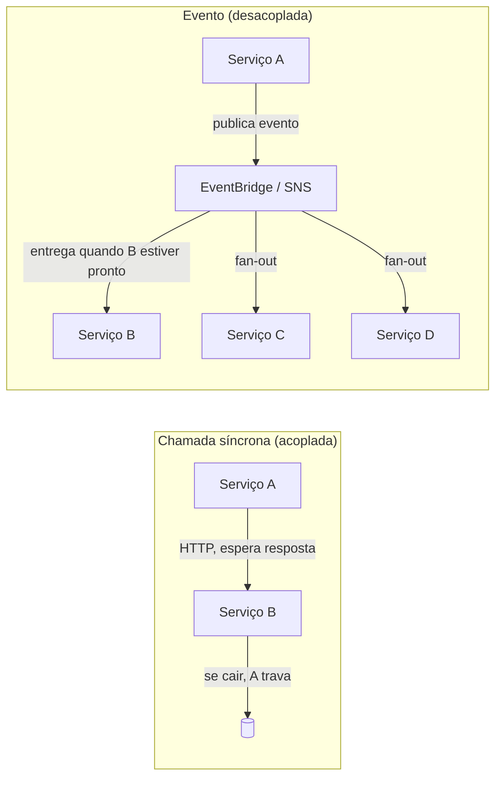
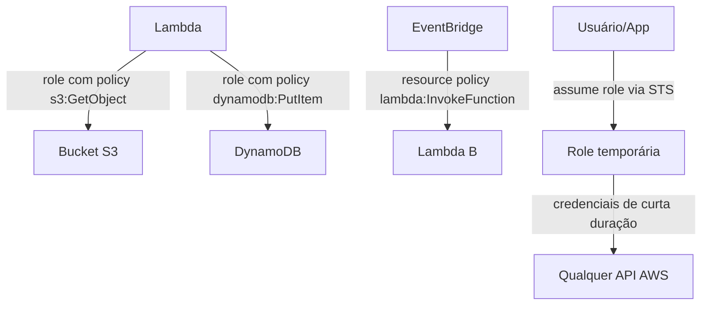
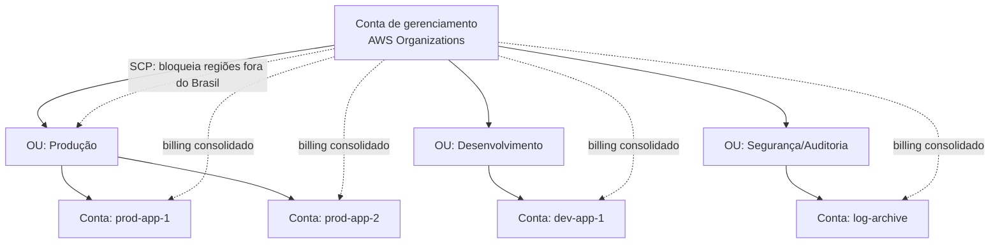
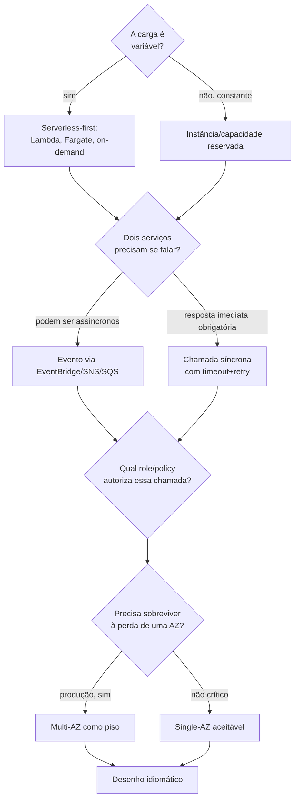
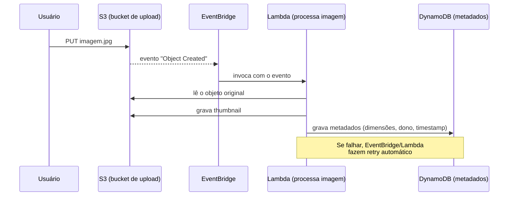
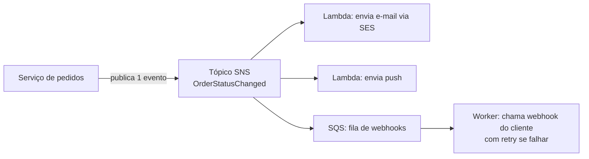

> [!abstract] TL;DR
> Toda plataforma de nuvem tem um "jeito idiomático" — não é regra escrita, é a direção pra onde o atrito é menor. Na AWS esse jeito tem sete marcas: comunicação por eventos em vez de chamada síncrona, serverless como default pra carga variável, IAM permeando cada interação serviço-a-serviço, multi-AZ como piso e multi-region como exceção cara, múltiplas contas como fronteira de blast radius e de billing, tags como espinha dorsal de custo e governança, e o Well-Architected Framework como bússola de "o que a AWS considera certo". Arquitetar contra essa corrente funciona — mas cada peça vira trabalho manual que a plataforma já oferecia de graça.

## O problema: você pode construir de qualquer jeito, mas nem todo jeito é barato

Aqui está uma coisa que ninguém te conta quando você começa na AWS: o console deixa você fazer *qualquer coisa*. Você pode subir uma EC2, instalar um cron, fazer polling num bucket S3 a cada minuto, e escrever isso tudo em bash. Vai funcionar. A AWS não vai impedir você.

Mas também não vai te ajudar.

Toda plataforma — não só nuvem, qualquer framework, qualquer linguagem — tem um "jeito certo" implícito. Não é uma regra no manual, é uma direção de menor resistência: as primitivas que existem, os serviços que se integram nativamente, os limites que empurram você pra um certo formato de solução. Rails tem "o jeito Rails". React tem "o jeito React". A AWS tem o jeito AWS.

Ignorar esse jeito não é proibido. É caro. Cada peça que a plataforma te dá de graça — retry automático, desacoplamento, escala elástica, isolamento de falha — vira código que você tem que escrever, testar e manter, se você decidir remar contra a corrente.

Esta nota destila sete correntes que a AWS empurra com mais força, com um pé nos primitivos que os galhos anteriores já ensinaram (IAM, Lambda, EventBridge, Well-Architected) e o outro na pergunta meta: *por que a plataforma foi desenhada assim?*

Pense numa correnteza de rio. Você pode nadar contra ela — é fisicamente possível, ninguém te prende — mas cada braçada gasta energia que a correnteza teria te dado de graça se você tivesse nadado a favor. As sete correntes desta nota são a correnteza da AWS: a direção que centenas de engenheiros de produto da AWS já otimizaram, documentaram e integraram entre si. Nadar contra não é errado. É só mais braçada.

> [!info] Uma ressalva antes de começar
> "Jeito idiomático" não é sinônimo de "sempre certo". Uma das armadilhas mais caras em AWS é aplicar o padrão idiomático (serverless, event-driven, multi-conta) em situações onde ele é over-engineering. Isso volta lá na frente, na seção de armadilhas.

## Corrente 1 — Comunicação por eventos, não por chamada síncrona

Quando dois serviços da AWS precisam conversar, a plataforma empurra você pra um barramento de eventos (EventBridge, SNS, SQS) em vez de uma chamada HTTP direta de serviço A pra serviço B.

Por quê? Porque chamada síncrona acopla disponibilidade: se B cai, A trava esperando resposta, e a falha se propaga pra trás na cadeia inteira. Um evento publicado num tópico SNS ou barramento EventBridge não exige que o consumidor esteja de pé no exato instante da publicação — a mensagem espera. Isso é a diferença entre uma corrente (falha em qualquer elo quebra tudo) e uma rede de pescador (um nó rompido, o resto segura).



A nota [[03-Dominios/Tecnologia/Cloud/13 - Mensageria e eventos gerenciados/05 - Padrões event-driven na cloud|Padrões event-driven na cloud]] já cobriu a mecânica de SQS, SNS e EventBridge um a um. O que importa aqui é o motivo estrutural: a AWS tem serviços gerenciados de mensageria de graça (sem servidor pra você operar), então o custo de adotar event-driven é baixo — e o ganho de resiliência e de fan-out (um evento, N consumidores) é alto. É um caso raro onde o caminho idiomático e o caminho barato coincidem.

Um detalhe que só aparece quando você olha de perto: quase todo serviço gerenciado da AWS já *emite* eventos nativamente, sem você escrever uma linha de código pra isso. Um objeto criado no S3, um item alterado numa tabela DynamoDB (via Streams), uma instância EC2 que muda de estado, um pipeline do CodePipeline que termina uma etapa — tudo isso já é um evento pronto pra ser roteado. A regra de um EventBridge que filtra esses eventos é só um padrão de correspondência, algo como:

```json
{
  "source": ["aws.s3"],
  "detail-type": ["Object Created"],
  "detail": {
    "bucket": { "name": ["uploads-producao"] }
  }
}
```

Isso significa que, na maior parte das vezes, "desenhar event-driven" na AWS não é "construir um sistema de eventos" — é *ligar um roteador* entre eventos que já existem e consumidores que você escreve. A parte cara (emitir o evento de forma confiável) já vem de fábrica.

## Corrente 2 — Serverless como default de custo/escala pra carga variável

A segunda corrente: quando a carga de trabalho é imprevisível — picos, vales, tráfego que varia por hora do dia ou por sazonalidade — a AWS empurra pra Lambda, Fargate, API Gateway, DynamoDB on-demand. Serviços que cobram pelo que você *usa*, não pelo que você *provisionou*.

Isso não é acidente de marketing. É a lógica econômica da nuvem levada ao extremo: se a AWS já opera o hardware físico de qualquer forma, ela prefere multiplexar sua carga variável entre milhares de clientes (do jeito que só um serviço gerenciado multi-tenant consegue) a te vender uma instância dedicada que fica 80% ociosa. Você paga menos, a AWS utiliza melhor a capacidade física — todo mundo ganha, exceto quando a carga não é variável (mais sobre isso na armadilha lá embaixo).

Os galhos [[03-Dominios/Tecnologia/Cloud/11 - Serverless e FaaS — Lambda a fundo/01 - O que é serverless, de verdade|Serverless e FaaS]] e [[03-Dominios/Tecnologia/Cloud/15 - Arquiteturas serverless e event-driven/01 - O paradigma event-driven completo|Arquiteturas serverless e event-driven]] já construíram a mecânica completa — cold start, concurrency, pricing, quando serverless faz e não faz sentido. O que essa nota acrescenta é o "porquê da plataforma": Lambda, Fargate e API Gateway não são só "mais uma opção de compute" no catálogo — são o destino que a AWS quer que você chegue quando a carga não é constante, porque é ali que o modelo de negócio dela (multiplexação de capacidade ociosa) fica mais eficiente.

Repare também no efeito cascata: uma vez que você adota serverless-first pra compute, o resto da pilha idiomática tende a seguir na mesma direção — DynamoDB on-demand em vez de capacidade provisionada, API Gateway em vez de um load balancer fixo, Step Functions em vez de um orquestrador que você mesmo hospeda. Cada peça da pilha "serverless" foi desenhada pra encaixar nas outras sem servidor nenhum no meio — é um conjunto coerente, não serviços isolados que por acaso não usam servidor.

## Corrente 3 — IAM permeia tudo

Aqui está uma coisa que surpreende quem vem de infraestrutura tradicional: na AWS, não existe interação serviço-a-serviço que não passe por uma política IAM. Uma Lambda que lê de um bucket S3 precisa de uma role com permissão `s3:GetObject`. Um EventBridge que invoca outra Lambda precisa de uma resource policy. Um RDS que autentica via IAM (em vez de senha) precisa de uma policy de `rds-db:connect`.

Isso não é burocracia — é o design fundamental da plataforma. Cada chamada de API na AWS, seja ela feita por um humano no console ou por um serviço no meio da noite, passa pelo mesmo motor de avaliação de permissões. Não existe "modo confiança implícita entre serviços internos" como em muita infra on-premises, onde tudo dentro da rede interna conversa livremente.



O galho [[03-Dominios/Tecnologia/Cloud/04 - Identidade e acesso (IAM)/04 - Roles e credenciais temporárias|Roles e credenciais temporárias]] já ensinou a mecânica — como uma role é assumida, como a credencial temporária circula. O ponto arquitetural aqui é: se você está desenhando um sistema AWS e a pergunta "qual role isso vai usar?" surge só no fim, você já está arquitetando contra a corrente. Na AWS idiomática, a role é parte do desenho desde o primeiro rascunho, porque é ela que define o que cada peça *pode* fazer — e portanto o que pode dar errado.

Uma execution role de Lambda idiomática, seguindo least privilege (já ensinado em [[03-Dominios/Tecnologia/Cloud/04 - Identidade e acesso (IAM)/05 - Least privilege na prática|Least privilege na prática]]), não diz "acesso total ao S3" — diz exatamente qual ação, em qual recurso:

```json
{
  "Version": "2012-10-17",
  "Statement": [
    {
      "Effect": "Allow",
      "Action": ["s3:GetObject", "s3:PutObject"],
      "Resource": "arn:aws:s3:::uploads-producao/*"
    },
    {
      "Effect": "Allow",
      "Action": ["dynamodb:PutItem"],
      "Resource": "arn:aws:dynamodb:sa-east-1:111122223333:table/metadados-imagens"
    }
  ]
}
```

Note o que essa policy *não* permite: deletar objetos, listar outros buckets, escrever em outras tabelas. Uma Lambda comprometida (por uma dependência maliciosa, por exemplo) só consegue causar o dano que a policy autoriza — o "blast radius" de uma falha de segurança fica do tamanho da role, não do tamanho da conta inteira.

## Corrente 4 — Multi-AZ como piso, multi-region como exceção cara

A AWS constrói cada região com múltiplas *Availability Zones* — data centers fisicamente separados, com energia e rede independentes, mas conectados por links de baixíssima latência. O padrão idiomático é: qualquer coisa que precisa estar no ar sempre roda em pelo menos duas AZs. RDS Multi-AZ, Auto Scaling Group espalhado em três zonas, ALB distribuindo tráfego entre elas.

Multi-region é outra história. Replicar uma arquitetura inteira pra uma segunda região geográfica resolve um problema que multi-AZ não resolve (a região inteira caindo, ou exigência regulatória de residência de dados) — mas custa em latência de replicação, complexidade operacional e, frequentemente, dobro de infraestrutura. A AWS não empurra multi-region como default; ela empurra multi-AZ como piso e reserva multi-region pra quando o RTO/RPO do negócio realmente exige.

A nota [[03-Dominios/Tecnologia/Cloud/20 - Resiliência e continuidade/04 - Multi-region a fundo|Multi-region a fundo]] já detalhou os padrões (pilot light, warm standby, active-active) e seus custos. O que vale reforçar aqui: multi-AZ é barato o suficiente pra ser padrão em produção; multi-region é caro o suficiente pra ser decisão de negócio, não decisão de arquitetura por reflexo.

O sinal de que a AWS trata isso como piso, não como opção premium: serviços centrais como RDS, ElastiCache e Auto Scaling oferecem Multi-AZ como um checkbox na criação do recurso, com custo incremental relativamente modesto (tipicamente uma segunda réplica em standby). Já multi-region não tem checkbox — exige você desenhar replicação de dados, roteamento com Route 53 ou Global Accelerator, e um plano de failover inteiro, porque não é um recurso, é uma arquitetura.

## Corrente 5 — Múltiplas contas como fronteira de blast radius e billing

Quem vem de outros mundos de infraestrutura estranha isso no começo: a unidade organizacional idiomática na AWS não é "um projeto dentro de uma conta" — é "uma conta por ambiente, por time, ou por nível de risco". AWS Organizations existe pra orquestrar dezenas ou centenas dessas contas sob uma hierarquia única, com faturamento consolidado.

Confirmei a razão oficial na documentação: contas AWS são "fronteiras naturais de permissão, segurança, custo e workload", e usar um ambiente multi-conta é "prática recomendada ao escalar seu ambiente de nuvem" — porque uma *service control policy* (SCP) aplicada a uma organizational unit barra ações inteiras pra todas as contas ali dentro, e um incidente de segurança numa conta de desenvolvimento não vaza pra produção porque são, literalmente, contas AWS diferentes com credenciais diferentes.



A referência oficial é `docs.aws.amazon.com/organizations` (verificado 2026-07-24): Organizations permite criar contas, agrupá-las em OUs, aplicar políticas (SCPs pra bloquear ações, RCPs pra prevenir uso indevido de recursos) e consolidar o billing num único método de pagamento. O padrão "landing zone" — muitas vezes provisionado via AWS Control Tower — é essa estrutura de múltiplas contas já vindo pronta com governança de base.

Isso conecta com dois galhos já cobertos: [[03-Dominios/Tecnologia/Cloud/04 - Identidade e acesso (IAM)/06 - Identidade entre contas e federação|Identidade entre contas e federação]] explicou como um usuário assume role entre contas sem precisar de credencial duplicada em cada uma, e [[03-Dominios/Tecnologia/Cloud/19 - FinOps — a economia da cloud/03 - Visibilidade e alocação de custo|Visibilidade e alocação de custo]] mostrou como o billing consolidado vira a base pra alocar custo por time ou produto.

Uma SCP típica de organização madura bloqueia, na raiz, ações que nenhuma conta deveria fazer — por exemplo, sair da Organization sozinha, ou desligar o CloudTrail:

```json
{
  "Version": "2012-10-17",
  "Statement": [
    {
      "Effect": "Deny",
      "Action": [
        "organizations:LeaveOrganization",
        "cloudtrail:StopLogging",
        "cloudtrail:DeleteTrail"
      ],
      "Resource": "*"
    }
  ]
}
```

O detalhe conceitual que costuma confundir quem chega da IAM tradicional: uma SCP nunca *concede* permissão — ela só define o teto do que uma policy IAM dentro daquela conta pode conceder. Mesmo um usuário root numa conta membro não consegue `cloudtrail:StopLogging` se a SCP da OU bloqueia isso. É uma cerca em volta da cerca.

> [!tip] Assista: Set Up a Multi-Account AWS Environment that Uses Best Practices for AWS Organizations
> **Canal:** Amazon Web Services | **Duração:** ~6min | **Idioma:** EN
>
> Vídeo curto e oficial mostrando a criação da hierarquia de OUs (Security, Sandbox, Workloads) dentro do console do AWS Organizations — visualiza exatamente a estrutura em árvore que o diagrama desta seção descreve, com a "root" gerando automaticamente as contas e a organização.
> Trecho de destaque [00:08]: *"With this service you can centrally manage multiple accounts, reduce organizational overhead, and adapt the structure of your organizational units, or OUs, to meet your business's needs."*
>
> 🎬 [Assistir no YouTube](https://www.youtube.com/watch?v=uOrq8ZUuaAQ)

## Corrente 6 — Tags como espinha dorsal de custo e governança

Uma vez que você tem dezenas de contas e centenas de recursos, como você sabe qual custo pertence a qual time, qual bucket pertence a qual projeto? A resposta idiomática da AWS é: tags.

Um recurso AWS aceita metadados na forma de pares chave-valor — `Team: pagamentos`, `Environment: production`, `CostCenter: CC-4471`. A documentação (whitepaper de tagging, verificado 2026-07-24) é explícita: numa organização que cresce pra muitos tipos de recurso espalhados por múltiplas aplicações, tags são o mecanismo que substitui — de forma nativa na plataforma — o que antes vivia em wikis internos ou CMDBs on-premises. Elas alimentam Cost Explorer (custo por tag), Config (compliance por tag) e políticas de acesso baseadas em atributo (ABAC).

O galho [[03-Dominios/Tecnologia/Cloud/19 - FinOps — a economia da cloud/03 - Visibilidade e alocação de custo|Visibilidade e alocação de custo]] já tratou tags como mecanismo de *cost allocation*. O ponto arquitetural aqui: se a estratégia de tags não é decidida no dia 1 (antes do primeiro recurso subir), ela vira uma dívida técnica retroativa — milhares de recursos legados sem `CostCenter`, sem `Owner`, e ninguém sabe quem pode desligar o quê.

Um conjunto mínimo de tags que a maioria das organizações maduras padroniza (e aplica via Tag Policies do Organizations, ou via Service Catalog na hora do provisionamento):

| Tag | Exemplo de valor | Pra que serve |
|---|---|---|
| `Environment` | `production`, `staging`, `dev` | separar custo e permissão por estágio |
| `Owner` / `Team` | `time-pagamentos` | achar responsável quando algo quebra |
| `CostCenter` | `CC-4471` | alocar custo no financeiro |
| `Project` / `Application` | `checkout-api` | agrupar recursos de uma mesma aplicação |
| `DataClassification` | `confidential`, `public` | orientar política de acesso e criptografia |

Sem esse mínimo, o relatório de custo do Cost Explorer mostra "R$ 40.000 em EC2" sem dizer de quem é — e cada auditoria de segurança vira uma investigação arqueológica.

## Corrente 7 — Well-Architected como bússola de "design for failure"

A última corrente não é um serviço, é uma postura: a AWS constrói (e espera que você construa) partindo do princípio de que tudo vai falhar em algum momento — um disco, uma AZ, uma dependência externa — e o desenho tem que sobreviver a isso sem drama. É o mantra "design for failure" que atravessa os seis pilares do Well-Architected Framework.

Isso não é filosofia abstrata: é a razão de existir de coisas como Auto Scaling Groups que substituem instância doente automaticamente, health checks de ELB que tiram nó ruim de circulação, e retry com backoff exponencial embutido nos SDKs. A plataforma pressupõe falha parcial constante e te dá as primitivas pra absorver isso sem página de operação acordando ninguém às 3h.

A nota [[03-Dominios/Tecnologia/Cloud/03 - Well-Architected Framework/01 - Por que existe um framework de arquitetura|Por que existe um framework de arquitetura]] já apresentou o WAF como um todo. O que vale reforçar aqui, na síntese: cada uma das seis correntes anteriores — eventos, serverless, IAM granular, multi-AZ, multi-conta, tags — é, de um jeito ou de outro, uma expressão prática do mesmo princípio: assuma que algo vai quebrar, e desenhe pra que a quebra fique pequena e contida.

Pense nas sete correntes como uma árvore de decisão que qualquer arquiteto AWS experiente roda quase sem perceber, na hora de desenhar algo novo:



Nem toda decisão segue esse fluxo à risca — a ordem real depende do contexto — mas o formato da pergunta é sempre o mesmo: "o que quebra, e o que eu já tenho de graça pra absorver isso?"

## Exemplo trabalhado: "processar uploads de imagem"

Vamos pegar um requisito simples e comum — usuário sobe uma foto, o sistema precisa gerar um thumbnail e salvar metadados — e desenhar dois jeitos: o idiomático AWS e o que rema contra a corrente.

**Desenho contra a corrente**: uma instância EC2 rodando 24/7, com um cron job que faz polling num bucket S3 a cada minuto perguntando "tem arquivo novo?", processa a imagem com uma lib qualquer, e escreve num banco relacional que também vive numa instância dedicada.

Isso paga por compute ocioso a maior parte do tempo (a maioria dos minutos não tem upload novo), tem um atraso inerente de até um minuto (o intervalo do polling), exige que você mesmo escreva retry se o processamento falhar no meio, e cada camada de acesso (S3, banco) provavelmente está usando credencial de longa duração fixada em variável de ambiente na instância — o oposto do que o galho de IAM ensinou.

**Desenho idiomático AWS**: o upload no S3 *já é o evento*. S3 dispara uma notificação (via EventBridge) no instante em que o objeto é gravado. Essa notificação invoca uma Lambda, que roda apenas quando há trabalho de verdade — sem servidor ocioso, sem polling, sem atraso de minuto. A Lambda processa a imagem, grava o thumbnail de volta no S3 e os metadados no DynamoDB, e tudo isso com uma execution role IAM escopada só pro que aquela função específica precisa fazer.



Repare no que sumiu: não há servidor pra corrigir patch, não há polling, não há credencial fixa, não há capacidade provisionada pra um pico que talvez nunca venha. E o que apareceu de graça: retry automático em caso de falha (comportamento padrão de invocações assíncronas via EventBridge), escala de zero a milhares de uploads simultâneos sem intervenção, e uma trilha de auditoria de quem fez o quê via CloudTrail, porque tudo passou por IAM.

### Um segundo exemplo: notificar o cliente quando o pedido muda de status

O mesmo raciocínio aparece num requisito diferente: um e-commerce precisa avisar o cliente — por e-mail, por push notification e, se ele tiver conectado um webhook próprio, também por webhook — toda vez que o status de um pedido muda.

**Contra a corrente**: o serviço de pedidos, no código que atualiza o status, chama diretamente a API de e-mail, depois a API de push, depois itera sobre os webhooks cadastrados fazendo uma chamada HTTP síncrona pra cada um. Se a API de push estiver lenta, a atualização do pedido fica lenta. Se um webhook de cliente estiver fora do ar, a exceção pode derrubar a transação inteira — ou exigir que você escreva, à mão, lógica de "ignorar erro de terceiro e seguir em frente".

**Idiomático AWS**: o serviço de pedidos publica um único evento `OrderStatusChanged` num tópico SNS. Três assinantes independentes reagem: uma Lambda que dispara e-mail via SES, uma Lambda que dispara push via um serviço de notificação, e uma fila SQS que alimenta o worker de webhooks de terceiros (com fila, porque webhook de cliente pode estar fora do ar, e você não quer perder a notificação — só atrasá-la). O serviço de pedidos não sabe, e não precisa saber, quantos consumidores existem hoje ou existirão amanhã.



Adicionar um quarto canal de notificação no futuro — SMS, por exemplo — não toca uma linha do serviço de pedidos. Só se inscreve mais um consumidor no mesmo tópico. Essa é a economia real do fan-out: o custo de adicionar um consumidor cai pra quase zero.

> [!tip] Assista: Event Driven Architectures vs Workflows (with AWS Services!)
> **Canal:** Be A Better Dev | **Duração:** ~16min | **Idioma:** EN
>
> Constrói, passo a passo, um pipeline de processamento de pedido em e-commerce quase idêntico ao segundo exemplo desta nota — Lambda grava no DynamoDB, o change stream dispara outra Lambda, que faz broadcast via SNS pra quem quiser escutar. Bom pra ver o fan-out event-driven sendo montado peça por peça, não só descrito.
> Trecho de destaque [02:16]: *"That DynamoDB table may trigger another Lambda function as a result of change events, and it's going to broadcast the fact that an order was placed out to other services that may want to listen, using an SNS topic — we're done so far with the placing of the order."*
>
> 🎬 [Assistir no YouTube](https://www.youtube.com/watch?v=Q_QCu6OP2mQ)

## A lente DigitalOcean: o jeito oposto — menos peças

Se o jeito AWS é "componha muitos serviços gerenciados pequenos, conectados por eventos e IAM granular", o jeito DigitalOcean é quase o oposto: menos peças, superfície menor, glue mais implícito.

Não existe um equivalente direto ao AWS Organizations com SCPs — a DO tem *Teams* pra agrupamento de projetos e billing, mas sem a granularidade de políticas hierárquicas por organizational unit. Não existe um EventBridge com centenas de fontes de evento nativas — a integração "evento dispara função" no ecossistema DO normalmente é feita à mão (webhook chamando uma Function) em vez de vir de um barramento central. E o App Platform da DO absorve parte do que na AWS seriam peças separadas (build, deploy, roteamento, TLS, scaling simples) numa única superfície mais opinativa e com menos botões pra girar.

Isso não é "pior" — é outra filosofia de produto, coerente com a tese do domínio de que DO é a nuvem pra quem quer menos peças pra montar. A nota final do galho 22 (DigitalOcean a fundo) vai aprofundar esse "jeito DO" em detalhe — aqui fica só o contraste: onde a AWS te dá 240 serviços pra você compor o desenho perfeito, a DO te dá um conjunto menor e já parcialmente pré-composto, trocando flexibilidade por simplicidade operacional.

Refazendo o exemplo do upload de imagem no "jeito DO": você ainda pode chegar num resultado parecido — um Space (o object storage da DO) recebe o upload, uma Function processa. Mas o gatilho automático "objeto criado dispara Function" não tem, na documentação pública da DO, a mesma profundidade de integração nativa que S3 → EventBridge tem na AWS — em muitos casos o glue é você quem escreve, via webhook do lado do app que fez o upload, chamando a Function diretamente. O resultado funcional é parecido; o caminho até lá tem menos automação de fábrica e mais responsabilidade sua.

## Tabela de tradução — o "jeito idiomático" em cada nuvem

| Corrente AWS | Serviço/mecanismo AWS | Azure | GCP | DigitalOcean |
|---|---|---|---|---|
| Event-driven por padrão | EventBridge, SNS, SQS | Event Grid, Service Bus | Pub/Sub, Eventarc | sem barramento central nativo — webhooks manuais |
| Serverless-first | Lambda, Fargate | Azure Functions, Container Apps | Cloud Functions, Cloud Run | Functions (DO), App Platform |
| IAM permeando tudo | IAM roles/policies | Azure RBAC + Managed Identity | Cloud IAM | API tokens + (limitado) Teams |
| Multi-conta/blast radius | AWS Organizations + SCPs | Management Groups + Azure Policy | Resource Manager + Organization Policy | Teams (sem SCP equivalente) |
| Tags como espinha de custo | Resource tags + Cost Explorer | Azure Tags + Cost Management | Labels + Cloud Billing | Tags (mais simples, sem ABAC) |

> [!info] Verificado 2026-07-24
> AWS Organizations (features, SCPs, RCPs, billing consolidado) e o whitepaper de tagging foram confirmados via `docs.aws.amazon.com` nesta data. Os nomes de Azure/GCP na tabela são mapeamento de categoria — não claim de paridade funcional exata.

## Armadilha: over-engineering serverless em carga constante

> [!warning] Serverless não é sempre mais barato
> A corrente 2 (serverless-first) tem uma exceção importante que o galho [[03-Dominios/Tecnologia/Cloud/11 - Serverless e FaaS — Lambda a fundo/06 - Quando serverless faz (e não faz) sentido|Quando serverless faz (e não faz) sentido]] já tratou em profundidade: pra uma carga *previsível e constante* — um worker que processa fila 24 horas por dia, sete dias por semana, sem variação relevante — uma instância dedicada (ou um Fargate com capacidade reservada) costuma sair mais barata que Lambda cobrando por invocação e por milissegundo. O modelo de precificação da Lambda foi desenhado pra premiar variação; contra carga chata e constante, ele perde pra uma instância que você já pagou antecipadamente. Seguir o "jeito AWS" por reflexo — colocar tudo em Lambda porque é o idiomático — sem checar se a carga é realmente variável é a armadilha inversa: over-engineering serverless onde uma VM simples resolveria com menos partes móveis e menos custo.

O mesmo raciocínio vale pra outras correntes desta nota: multi-conta tem custo de complexidade operacional que só se paga em escala; event-driven adiciona uma camada de indireção que, pra dois serviços que sempre vão junto na mesma implantação, pode ser overhead sem benefício real. O "jeito idiomático" é o caminho de menor atrito na *maioria* dos casos — não uma lei universal.

> [!warning] Multi-conta antes da hora
> AWS Organizations recomenda multi-conta como prática de escala — mas uma equipe de três pessoas rodando um MVP não precisa de dez contas com SCPs cruzadas. A landing zone bem-feita leva dias de setup e exige alguém cuidando dela; pra um time pequeno, esse esforço pode consumir mais tempo do que o problema (isolamento de blast radius entre times que ainda nem existem) justifica. O padrão idiomático é escalável, não é obrigatoriamente o ponto de partida.

> [!warning] IAM granular também tem custo de fricção
> Least privilege bem aplicado significa que, toda vez que uma Lambda nova precisa acessar um recurso novo, alguém escreve e testa uma permissão nova. Em times sem prática de IaC madura, isso vira gargalo — desenvolvedor espera ticket de infraestrutura pra cada policy. A resposta idiomática não é "abrir mão de least privilege", é automatizar a criação de policies via IaC (o galho [[03-Dominios/Tecnologia/Cloud/16 - Infrastructure as Code/01 - Por que Infrastructure as Code|Infrastructure as Code]] cobriu isso) — mas vale nomear a fricção real antes de prescrever a cura.

## O que vem a seguir

Esta nota destilou os padrões que a AWS empurra — a lógica por trás de por que a plataforma tem essa forma. A próxima nota deste galho fecha o Bloco 5 com um capstone: um exercício de "pensar como arquiteto AWS" de ponta a ponta, aplicando essas sete correntes (e sabendo quando quebrá-las) num desenho completo.

## Fontes

- AWS. "What is AWS Organizations?" — https://docs.aws.amazon.com/organizations/latest/userguide/orgs_introduction.html (verificado 2026-07-24)
- AWS Whitepapers. "Best Practices for Tagging AWS Resources" — https://docs.aws.amazon.com/whitepapers/latest/tagging-best-practices/tagging-best-practices.html (verificado 2026-07-24)
- AWS. "AWS Well-Architected Framework" — https://aws.amazon.com/architecture/well-architected/
- AWS. "Amazon EventBridge — What Is Amazon EventBridge?" — https://docs.aws.amazon.com/eventbridge/latest/userguide/eb-what-is.html
- DigitalOcean. "App Platform Overview" — https://docs.digitalocean.com/products/app-platform/
- DigitalOcean. "Teams" — https://docs.digitalocean.com/platform/teams/
