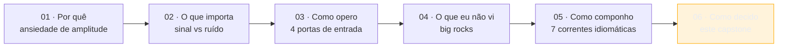
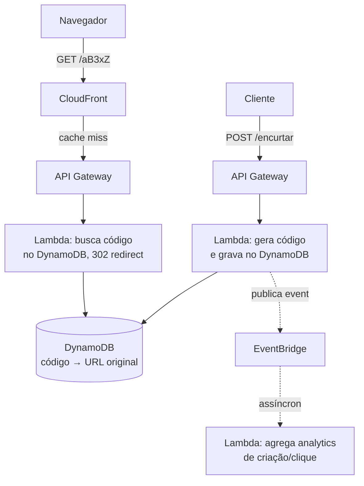

> [!abstract] TL;DR
> Este capstone amarra as cinco notas do galho num modelo mental único. Você começou com **ansiedade de amplitude** diante de 240 serviços; aprendeu a filtrar **sinal de ruído** no catálogo; viu as **quatro portas** de operação (console, CLI, SDK, IaC); conheceu os **big rocks** que ninguém te apresenta no básico (Cognito, Step Functions, Athena, Bedrock); e nomeou as **sete correntes** que a AWS empurra por baixo do capô. Aqui isso vira um checklist mental de 7 perguntas pra usar diante de qualquer problema novo, e um caso de entrevista trabalhado de ponta a ponta — desenhar um encurtador de URL — mostrando as escolhas e verbalizando os trade-offs. Fecha com uma dose de honestidade: nem todo problema precisa da AWS, e saber a hora de dizer "isso cabe inteiro num droplet" também é pensar como arquiteto.

## A jornada até aqui, num parágrafo cada

Vale reconstituir o caminho antes de sintetizar, porque cada nota resolveu um problema diferente e juntas formam uma progressão lógica.

A nota [[03-Dominios/Tecnologia/Cloud/21 - AWS a fundo/01 - A filosofia da amplitude|01 — A filosofia da amplitude]] respondeu "por que a AWS tem 240 serviços" com três forças históricas: primitivos pequenos e componíveis, API-first desde o dia zero, e two-pizza teams multiplicando squads autônomos. A conclusão prática: a amplitude não é acidente, é o produto — e o preço do produto é o paradoxo da escolha recair sobre você.

A nota [[03-Dominios/Tecnologia/Cloud/21 - AWS a fundo/02 - Sinal e ruído no catálogo|02 — Sinal e ruído no catálogo]] deu ferramenta pra lidar com esse preço: quatro sinais de ruído (nome de marketing sobre primitivo conhecido, duplicação "com IA", serviço em modo manutenção, serviço nicho de cliente enterprise) e um framework de avaliação rápida. A tese: ~25 serviços em oito categorias cobrem 80% de qualquer arquitetura real; o resto é cauda longa que você consulta sob demanda, não que memoriza.

A nota [[03-Dominios/Tecnologia/Cloud/21 - AWS a fundo/03 - Operar a AWS — console, CLI, SDK e IaC|03 — Operar a AWS]] tirou o catálogo do papel e colocou na mão: as quatro portas de entrada (console pra aprender e depurar, CLI pro dia a dia, SDK quando o script vira lógica, IaC quando o resultado precisa ser reproduzível) e a escada de maturidade que uma equipe sobe entre elas — geralmente nessa ordem, geralmente sem pular degrau.

A nota [[03-Dominios/Tecnologia/Cloud/21 - AWS a fundo/04 - Os big rocks que faltaram|04 — Os big rocks que faltaram]] preencheu o ponto cego mais caro de todos: os serviços que resolvem uma classe inteira de problema (identidade de usuário final com Cognito, orquestração de workflow com Step Functions, SQL sobre data lake com Athena/Glue, IA generativa gerenciada com Bedrock) e que ninguém te apresenta no básico porque não são "core compute/storage/network" — mas cuja ausência do seu radar te faz reinventar, mal, o que a AWS já resolveu bem.

A nota [[03-Dominios/Tecnologia/Cloud/21 - AWS a fundo/05 - O jeito AWS de arquitetar|05 — O jeito AWS de arquitetar]] nomeou as sete correntes que atravessam praticamente todo desenho idiomático na plataforma: eventos em vez de chamada síncrona, serverless como default de custo pra carga variável, IAM permeando tudo, multi-AZ como piso, múltiplas contas como fronteira de blast radius, tags como espinha de custo, e Well-Architected como bússola. E terminou com a advertência que este capstone retoma: seguir a corrente por reflexo, sem checar se ela se aplica, é a armadilha inversa do over-engineering.

Cinco notas, uma progressão: **por quê** (01) → **o que importa** (02) → **como opero** (03) → **o que eu não vi** (04) → **como eu componho** (05). Este capstone é o sexto passo: **como eu decido**, sob pressão, num problema que nunca vi antes.

## O checklist mental do arquiteto AWS

Diante de um problema novo — em produção, numa entrevista, num RFC — as sete perguntas abaixo não são um algoritmo determinístico, são um roteiro de atenção. A ordem importa: cada resposta restringe a seguinte.

1. **Qual é o primitivo certo, e ele já existe?** Antes de desenhar algo customizado, pergunte se um dos ~25 serviços centrais (a lista que a nota 02 chamou de sinal) já resolve isso — ou se um dos big rocks da nota 04 (Cognito pra auth de usuário final, Step Functions pra orquestração, Athena pra query ad-hoc) resolve de fábrica o que você ia reconstruir com Lambda + banco.
2. **Gerenciado ou cru?** RDS/Aurora ou EC2 rodando Postgres você mesmo; Fargate ou EC2 nu; SQS ou uma fila que você opera. O gerenciado custa mais por unidade e entrega menos controle fino — mas tira operação (patch, backup, failover) da sua lista de responsabilidades. Pra times pequenos, isso quase sempre pesa a favor do gerenciado.
3. **Event-driven ou síncrono?** Se dois componentes sempre precisam da resposta um do outro na mesma requisição (ex.: autenticar antes de servir), síncrono é mais simples e mais correto. Se o consumidor pode processar depois, ou se você quer múltiplos consumidores independentes reagindo ao mesmo fato, é a Corrente 1 da nota 05: SNS/SQS/EventBridge.
4. **IAM e least privilege desde o desenho, não depois.** Cada recurso novo pede: quem precisa acessar isso, e com qual verbo (read, write, invoke)? Desenhar a policy junto com o recurso é mais barato que retrofitar least privilege numa arquitetura já em produção com permissões `*` espalhadas.
5. **Multi-AZ é o piso — multi-region é a exceção que você justifica.** Qualquer coisa com estado (banco, fila persistente) nasce multi-AZ por padrão hoje em dia; multi-region só entra se o RTO/RPO do negócio exigir, porque o custo de coordenação cresce rápido (o galho [[03-Dominios/Tecnologia/Cloud/20 - Resiliência e continuidade/index|Resiliência e continuidade]] tratou RTO/RPO e DR em profundidade).
6. **Onde entra spot, onde entra serverless, pra baratear sem quebrar SLA?** Carga tolerante a interrupção (batch, processamento assíncrono, workers que reenfileiram em falha) é candidata natural a Spot Instances; carga variável e imprevisível é candidata a Lambda/Fargate; carga constante 24/7 geralmente perde pra instância reservada — a armadilha que a nota 05 já nomeou.
7. **Qual pilar do Well-Architected estou otimizando agora — e o que estou sacrificando?** Confiabilidade e custo puxam em direções opostas quase sempre; segurança e velocidade de entrega também. Nomear explicitamente qual pilar está ganhando nesta decisão específica é o que separa uma escolha deliberada de um acidente de arquitetura.

> [!info] Verificado 2026-07-24
> Os seis pilares do AWS Well-Architected Framework são: Operational Excellence, Security, Reliability, Performance Efficiency, Cost Optimization e Sustainability — confirmados via `docs.aws.amazon.com/wellarchitected/latest/framework/the-pillars-of-the-framework.html` nesta data. O sexto pilar (Sustainability) foi adicionado ao framework em dezembro de 2021 — se você aprendeu "cinco pilares" há alguns anos, essa é a diferença.

> [!tip] Assista: 6 Pillars of the AWS Well Architected Framework (you should really know this)
> **Canal:** Be A Better Dev | **Duração:** ~19min | **Idioma:** EN
>
> Passa pelos seis pilares um a um com exemplos concretos de serviço AWS em cada — inclusive confirma, na fala, que Sustainability é "relativamente novo" no framework, o mesmo detalhe que o callout de verificação acima destaca. Trecho de destaque [14:56]: *"Let's move on to the next pillar here, which is in terms of sustainability. This is a relatively new pillar, and it is in terms of being more sustainable, both in terms of cost and the environment."*
>
> 🎬 [Assistir no YouTube](https://www.youtube.com/watch?v=5odtVlORq_w)

## Caso de entrevista, de ponta a ponta: "desenhe um encurtador de URL na AWS"

Este é um clássico de loop de system design — e um bom teste do checklist acima, porque força você a passar pelas sete perguntas em quinze minutos, verbalizando cada escolha em voz alta como faria numa entrevista de verdade.

**O problema, resumido pelo entrevistador:** usuário manda uma URL longa, o sistema devolve uma URL curta (`ex.co/aB3xZ`); quando alguém acessa a URL curta, o sistema redireciona pra original. Precisa aguentar leitura muito mais frequente que escrita (padrão típico: 100:1 ou mais), e não pode perder o mapeamento.

**Pergunta 1 — qual primitivo?** O núcleo é: gerar um código curto único, gravar `{código → URL original}`, e servir leitura rápida por chave. Isso é um key-value lookup de baixíssima latência com fanout de leitura enorme. DynamoDB é o candidato natural — chave de partição = código curto, sem necessidade de query relacional complexa.

**Pergunta 2 — gerenciado ou cru?** DynamoDB gerenciado, sem hesitação: não há ganho em rodar seu próprio KV store pra esse padrão de acesso, e o serviço gerenciado já resolve replicação e escala horizontal de fábrica.

**Pergunta 3 — event-driven ou síncrono?** O caminho de escrita (criar encurtamento) e o caminho de leitura (redirecionar) são ambos naturalmente síncronos — o usuário espera resposta imediata nos dois casos. Não há motivo pra meter uma fila no meio do redirect: isso só adicionaria latência a um caminho que precisa ser rápido. Onde *cabe* assíncrono é em trabalho de apoio que não bloqueia o usuário: agregação de analytics de cliques, por exemplo, pode publicar num tópico SNS/EventBridge e ser processada depois, sem atrasar o redirect.

**Pergunta 4 — IAM.** O serviço de escrita (criar encurtamento) e o serviço de leitura (redirecionar) recebem roles separadas: a role de leitura só tem `dynamodb:GetItem` na tabela; a role de escrita tem `PutItem`/`UpdateItem`. Least privilege por função, não uma role genérica compartilhada pros dois Lambdas.

**Pergunta 5 — multi-AZ?** DynamoDB já é multi-AZ por padrão dentro de uma região — essa pergunta praticamente se resolve sozinha ao escolher o serviço certo na pergunta 1. Multi-region só entraria se o requisito fosse "sobreviver à perda de uma região inteira", o que raramente aparece no escopo de um encurtador de URL numa entrevista de 45 minutos — mas vale mencionar em voz alta que você sabe que a opção existe (DynamoDB Global Tables) e por que você está conscientemente não escolhendo ela agora.

**Pergunta 6 — custo (spot/serverless)?** O tráfego de um encurtador é tipicamente disparado (viral em picos, quase zero fora deles) — perfil clássico de serverless. Lambda atrás de API Gateway pro caminho de escrita e leitura, com CloudFront na frente cacheando os redirects mais quentes (um código encurtado popular não precisa bater no Lambda a cada clique).

**Pergunta 7 — qual pilar estou otimizando?** Aqui a resposta explícita, verbalizada: "estou otimizando performance efficiency no caminho de leitura (cache agressivo, KV de baixa latência) e cost optimization no geral (serverless puro, sem capacidade ociosa) — e estou conscientemente aceitando menos controle fino sobre latência de cauda em troca de zero operação de infraestrutura."

O ponto de verbalizar trade-offs num loop de entrevista não é "acertar" a arquitetura única correta — não existe uma. É mostrar que cada escolha foi feita conscientemente contra as alternativas descartadas: por que DynamoDB e não RDS (padrão de acesso não-relacional, escala de leitura); por que serverless e não Fargate fixo (tráfego disparado, não constante); por que CloudFront na frente do redirect (o hot path de um encurtador é dominado por poucos códigos muito clicados — cache resolve isso sem tocar o backend). Um bom entrevistador está avaliando o *raciocínio*, não decorando se você mencionou DynamoDB.

> [!tip] Assista: System Design: How to Build a Scalable URL Shortener (Like Bitly)
> **Canal:** Sandeep Vaid | **Duração:** ~12min | **Idioma:** EN
>
> Chega na mesma escolha de DynamoDB por um caminho quase idêntico ao das Perguntas 1 e 2 desta nota — nomeia explicitamente que o sistema é "read heavy" (muito mais leitura que escrita) antes de justificar por que um NoSQL de chave-valor com sharding automático vence uma alternativa relacional. Trecho de destaque [05:24]: *"So if you think [about] some hashmap, obviously the... NoSQL DB, DynamoDB, is one of the best DB. There are some reasons for that: we can easily do sharding, and the system is very serverless and scalable. AWS DynamoDB automatically does this sharding."*
>
> 🎬 [Assistir no YouTube](https://www.youtube.com/watch?v=Xb0J6MyDBtg)

> [!tip] A variante "pipeline de processamento de imagens"
> O mesmo checklist, aplicado a um problema de forma diferente, chega numa arquitetura de outra família: upload vai pro S3 (pergunta 1 — primitivo certo é object storage, não um servidor recebendo bytes), o evento `ObjectCreated` do S3 dispara Lambda direto ou via SQS se o processamento for mais pesado que o timeout do Lambda permite (pergunta 3 — aqui sim event-driven é o caminho natural, porque processamento de imagem é assíncrono por natureza — o usuário não espera o thumbnail na mesma requisição do upload), e o resultado processado volta pro S3 num prefixo separado. Vale o exercício mental de rodar as sete perguntas você mesmo nesse segundo caso — a resposta muda em quase todas.

## Quando NÃO usar a AWS

Pensar como arquiteto AWS inclui saber quando a resposta certa é não usar a AWS — e isso não é traição à trilha, é o objetivo dela.

O encurtador de URL do exemplo acima, hospedado inteiro num App Platform da DigitalOcean com um Managed Database Postgres por trás, resolve o mesmo problema de negócio com uma fração da superfície de decisão: sem escolher entre quatro portas de operação, sem siete correntes pra aprender, sem custo de aprendizado de IAM granular. Pra um MVP, um projeto pessoal, ou um time de duas pessoas validando hipótese de produto, isso não é uma versão "menos boa" da solução AWS — é frequentemente a solução *melhor*, porque o custo real de um sistema não é só a fatura de infraestrutura, é o tempo do time gasto operando a plataforma em vez de construir produto.

A nota [[03-Dominios/Tecnologia/Cloud/22 - DigitalOcean a fundo/05 - Quando o DO basta e quando cresce pra AWS|05 — Quando o DO basta e quando cresce pra AWS]], no próximo galho, é a continuação natural desta linha de raciocínio: ela trata com honestidade os sinais concretos que indicam "ainda cabe no DO" versus "chegou a hora de migrar pra AWS" — não como duas ligas diferentes, mas como dois pontos na mesma curva de crescimento de um produto. Amplitude é uma ferramenta poderosa quando você já tem a escala e a equipe que justificam administrá-la; antes disso, ela é puro overhead cognitivo pago à toa.

> [!warning] O erro mais caro deste galho inteiro
> Não é escolher o serviço errado dentro da AWS. É escolher a AWS quando o problema não pedia essa amplitude — carregar sete correntes idiomáticas, IAM granular, e um catálogo de 240 serviços pra um sistema que um único droplet de $12/mês resolveria com sobra. A disciplina de "pensar como arquiteto" corta nos dois sentidos: dentro da AWS, e na decisão de entrar nela.

## Onde continuar depois deste galho

Este capstone fecha o galho 21, não o domínio Cloud inteiro — a trilha segue com o galho 22 (DigitalOcean a fundo), que aplica a mesma lente de amplitude/simplicidade ao lado oposto do espectro.

Pra quem quiser aprofundar o "pensar como arquiteto" além do que este galho cobriu, dois recursos valem a pena, fora do vault:

- **AWS Well-Architected Labs** (wellarchitectedlabs.com) — workshops práticos e hands-on organizados pelos seis pilares, com exercícios de nível 100 a 300 que colocam a mão na massa em cada pilar isoladamente.
- **Talks de arquitetura do AWS re:Invent** — as sessões de "architecture deep dive" e "lessons learned" de times internos da Amazon (geralmente sob as trilhas ARC e API) são o material mais próximo de ver arquitetos sênior verbalizando trade-offs reais, em produção, sob as mesmas sete perguntas deste capstone.

## Fontes

- AWS. "The pillars of the framework" — https://docs.aws.amazon.com/wellarchitected/latest/framework/the-pillars-of-the-framework.html (verificado 2026-07-24)
- AWS. "AWS Well-Architected Framework" — https://aws.amazon.com/architecture/well-architected/
- AWS Well-Architected Labs — https://wellarchitectedlabs.com/ (verificado 2026-07-24)
- AWS. "Amazon DynamoDB Global Tables" — https://docs.aws.amazon.com/amazondynamodb/latest/developerguide/GlobalTables.html
- AWS. "Amazon S3 Event Notifications" — https://docs.aws.amazon.com/AmazonS3/latest/userguide/EventNotifications.html
- DigitalOcean. "App Platform Overview" — https://docs.digitalocean.com/products/app-platform/
