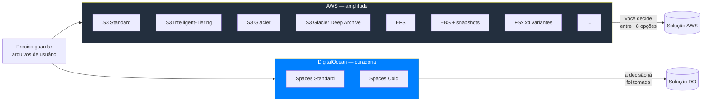
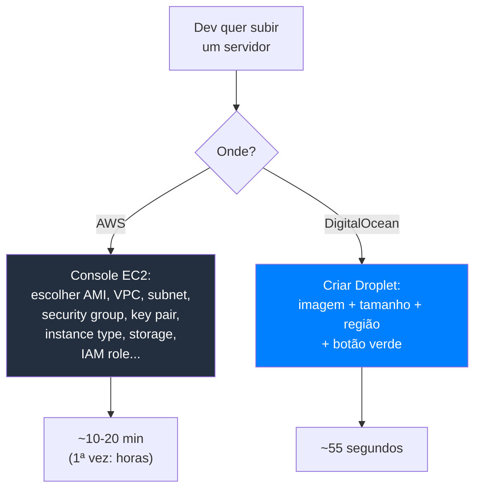

> [!abstract] TL;DR
> A AWS te entrega 240+ peças de Lego e um catálogo de 10 mil páginas: você monta a solução. O DigitalOcean te entrega um kit curado — já decidiu por você qual é *o* jeito de fazer object storage, banco gerenciado, deploy. Essa simplicidade não é falta de recursos técnicos: é uma **estratégia de produto** deliberada, nascida pra devs que querem subir algo funcionando em minutos, não semanas. O preço dessa curadoria é um teto mais baixo — menos flexibilidade, menos serviços de nicho, menos profundidade enterprise. Pra grande parte dos SaaS pequenos e médios, esse teto nunca aparece no horizonte.

## O problema: 240 peças de Lego na sua mesa

Você acabou de sair do galho 21. Se levou a sério a lição de lá, sabe que a AWS tem mais de 240 serviços totalmente funcionais — sem contar variações e sub-produtos, que passam de 500. Isso é extraordinário como catálogo de capacidades. É também, para uma fração enorme dos times do mundo, um problema de outra natureza: **qual desses 240 eu uso?**

Pense num cenário banal: você precisa de object storage. Na AWS, a resposta é "S3" — mas S3 sozinho já tem storage classes (Standard, Intelligent-Tiering, Glacier, Glacier Deep Archive...), políticas de lifecycle, versionamento, replicação cross-region, criptografia com KMS gerenciado por você ou pela AWS, controle de acesso via IAM policies *e* bucket policies *e* ACLs (três camadas sobrepostas!), e por aí vai. A resposta certa existe — mas você precisa construí-la, decisão por decisão, entre dezenas de configurações válidas.

Agora pense no mesmo cenário no DigitalOcean. Object storage é "Spaces". Ponto. Um serviço, compatível com a API do S3 (então tudo que você já sabe de S3 client funciona), com CDN integrada de fábrica, e duas classes de storage (Standard e Cold, para dados raramente acessados). Não existe a pergunta "qual das 6 opções eu escolho" — existe uma opção, já boa o suficiente pra 95% dos casos.

Esse é o contraste que abre este galho. E ele não é acidental — é uma tese de produto que a DigitalOcean carrega desde a fundação: entre oferecer *poder* e oferecer *clareza*, ela escolheu clareza, conscientemente, sabendo o que isso custa em casos de borda.

> [!info] Verificado 2026-07-24
> Contagem de serviços AWS (240+ full-featured) conferida via busca de mercado 2026; história de fundação da DigitalOcean conferida via múltiplas fontes secundárias (Wikipedia, imprensa) — ver seção Fontes.

## Origem: nascida da dor de quem já operava servidor

A DigitalOcean foi fundada em 24 de junho de 2011, por Ben Uretsky, Moisey Uretsky, Jeff Carr, Alec Hartman e Mitch Wainer. O detalhe que explica a filosofia inteira do produto está no que os irmãos Uretsky faziam antes: em 2003, já tinham fundado a ServerStack, uma empresa de *managed hosting* — ou seja, passaram uma década resolvendo, manualmente, o problema de infraestrutura pra clientes que não queriam pensar em servidor. Eles não chegaram à nuvem como acadêmicos de sistemas distribuídos; chegaram como gente cansada de responder o mesmo ticket de suporte pela centésima vez.

Isso importa porque explica *para quem* o produto foi desenhado desde o dia zero: não para o time de plataforma de uma Fortune 500 decidindo entre 6 storage classes, mas para o desenvolvedor sozinho que só quer o servidor rodando. A empresa passou pelo acelerador TechStars em Boulder, Colorado, em 2012 — e ao final do programa, com apenas alguns meses de produto, já tinha 400 clientes e cerca de 10.000 instâncias de Droplet no ar. O pricing de lançamento começava em **$5/mês**, com a meta explícita de colocar um Droplet no ar em menos de um minuto — a mesma meta que, mais de uma década depois, ainda aparece nos "55 segundos" que abrem esta nota.

Não é coincidência que a AWS tenha nascido dentro da Amazon, para resolver o problema de escala interna de um varejista gigante, e a DigitalOcean tenha nascido de uma consultoria de hosting cansada de tickets repetitivos. Os DNAs de origem se refletem no produto até hoje: a AWS herdou a mentalidade de infraestrutura como plataforma para outras equipes de engenharia construírem sobre ela; o DO herdou a mentalidade de suporte técnico que aprendeu, na marra, o que trava um desenvolvedor sozinho às 2h da manhã.

## Mecanismo: curadoria como decisão de produto, não como limitação

A forma mais fácil de errar aqui é achar que "o DO é simples porque tem menos gente/menos dinheiro/menos maturidade técnica pra construir mais coisa". Isso é falso, e é importante entender por quê — porque a implicação errada ("logo, um dia o DO vai ficar tão grande quanto a AWS") também é falsa.

A DigitalOcean **escolhe não construir** a maior parte do que a AWS constrói. Ela decidiu, como princípio de produto, entregar **uma** solução boa para cada problema comum, em vez de **N** soluções configuráveis para cada problema. Isso é uma forma de trabalho de curadoria: alguém, na DO, já tomou por você as decisões de "qual storage class faz sentido pra 95% dos casos", "qual configuração de rede é segura por padrão", "qual runtime de banco gerenciado vale a pena manter". Você não escolhe entre seis jeitos de fazer a coisa certa — você recebe o jeito certo.



Esse padrão se repete serviço a serviço, e você vai ver isso de perto nas próximas notas do galho: um único jeito de fazer banco gerenciado (Managed Databases, poucos motores, poucas variações de plano), um único jeito de fazer deploy gerenciado (App Platform — que "faz o build, o deploy e a escala automaticamente, cuidando da infraestrutura por baixo", nas palavras da própria documentação), um único jeito de fazer Kubernetes gerenciado (DOKS, sem a floresta de add-ons que o EKS oferece).

### O paradoxo da escolha, invertido

Existe um fenômeno bem estudado em psicologia do consumidor, o *paradoxo da escolha*: mais opções não geram mais satisfação — geram mais ansiedade de decisão, mais tempo perdido comparando, mais arrependimento pós-escolha. Um supermercado com 3 marcas de geleia vende mais que um com 30, porque o comprador consegue decidir.

A AWS opera no regime de 30 geleias: profissionalmente sofisticado, tecnicamente correto, e cognitivamente caro. Cada escolha de arquitetura vira uma pesquisa: qual store, qual classe, qual limite de IOPS, qual tier de rede. Isso tem valor real — engenheiros seniores em times grandes *querem* esse controle fino, porque a diferença de custo ou desempenho entre as opções é dinheiro real em escala.

A DigitalOcean aposta no oposto: **a restrição bem escolhida é, ela mesma, um produto**. Ao remover 29 das 30 geleias, ela não empobrece sua prateleira — ela elimina o custo cognitivo de decidir, e devolve esse tempo para o que realmente diferencia o seu produto (o código da sua aplicação, não a topologia da sua VPC). Isso não é "menos cloud" — é uma aposta de que, para a maioria dos times, a decisão de arquitetura mais cara não é qual serviço escolher, é *quanto tempo* se leva escolhendo.

> [!tip] Assista: Interview With DigitalOcean
> **Canal:** TFiR | **Duração:** ~21min | **Idioma:** EN
>
> Nessa entrevista, um executivo da própria DigitalOcean explica a curadoria não como limitação técnica, mas como decisão deliberada de foco: a empresa escolhe conscientemente NÃO perseguir contratos enterprise multimilionários pra manter o catálogo enxuto e alinhado às necessidades reais de startups e SMBs. Trecho de destaque [07:40]: *"this allows us to stay focused and build those limited set of products but curate them to the needs of specific customers that we're trying to serve"*
>
> 🎬 [Assistir no YouTube](https://www.youtube.com/watch?v=t_2tz52vXIA)

## DX como diferencial competitivo, não como acessório

Se você já passeou pelo console da AWS e depois pelo painel da DigitalOcean, sentiu a diferença na pele antes de conseguir nomeá-la. O console AWS é uma central de controle de usina nuclear: centenas de opções, breadcrumbs profundos, terminologia que muda de serviço para serviço (é "bucket" no S3, é "table" no DynamoDB, é "function" no Lambda — cada um com seu próprio modelo mental). O painel do DO é limpo, com poucos cliques até qualquer ação comum, terminologia consistente entre produtos.

Essa diferença é **DX — developer experience** — e a DigitalOcean trata DX como vantagem competitiva central, não como polimento de UI feito depois que a engenharia "de verdade" acabou. Três pilares sustentam isso:

1. **Documentação como produto de primeira classe.** A documentação da DigitalOcean é escrita para ser lida do início ao fim por alguém aprendendo, não só consultada por quem já sabe o que procura — um estilo bem mais próximo de tutorial do que de referência de API.
2. **A Community como motor de aquisição.** A DigitalOcean afirma manter mais de 8.000 tutoriais de desenvolvimento e administração de sistemas na sua seção Community — um acervo que qualquer dev encontra no Google ao pesquisar "how to install nginx on ubuntu" ou "how to configure postgres replication", esteja ou não hospedado no DO. É content marketing, sim — mas também é genuinamente instrução técnica de qualidade, e vira uma porta de entrada natural: você chega pelo tutorial, fica pela infraestrutura.
3. **UI que não exige treinamento.** Criar um Droplet (a VM do DO) é literalmente clicar num botão verde, escolher imagem e tamanho, e esperar — a própria DigitalOcean promove esse fluxo como "**sob 55 segundos**" do clique ao servidor pronto. Não existe assistente de configuração de 12 telas.



> [!info] Verificado 2026-07-24
> "55 segundos" e "8.000+ tutoriais" são números de marketing publicados pela própria DigitalOcean (blog/produto e página da Community) — não medições independentes de terceiros. O tempo real de boot varia por imagem e região; trate como ordem de grandeza, não benchmark controlado.

Isso não é enfeite. Para um time pequeno sem SRE dedicado, o tempo entre "preciso de um servidor" e "servidor rodando" é custo de oportunidade puro — e nesse eixo específico o DO ganha da AWS, quase sempre, sem disputa.

## Curadoria em código: o mesmo servidor, dois caminhos

A melhor forma de sentir a diferença entre amplitude e curadoria não é ler sobre ela — é ver o mesmo objetivo banal ("me dê uma VM Ubuntu rodando") atravessar as duas interfaces de linha de comando.

No `aws-cli`, subir uma instância EC2 exige que você já tenha resolvido, de antemão, uma cadeia de dependências: uma AMI válida pra região, um Security Group existente, uma subnet dentro de uma VPC, um par de chaves já importado. Nenhuma dessas coisas vem de graça — cada uma é, ela mesma, outro comando, outro recurso, outra decisão:

```bash
# AWS: a instância depende de recursos que você já deve ter criado antes
aws ec2 run-instances \
  --image-id ami-0abcdef1234567890 \
  --instance-type t3.micro \
  --key-name minha-chave \
  --security-group-ids sg-0123456789abcdef0 \
  --subnet-id subnet-0123456789abcdef0 \
  --region us-east-1
```

No `doctl`, o CLI oficial do DigitalOcean, o mesmo pedido não tem essas dependências prévias — a região tem um default de conta, a rede é resolvida automaticamente, e "imagem" é só um slug memorável (`ubuntu-22-04-x64`), não um ID opaco que muda por região e precisa ser buscado num catálogo à parte:

```bash
# DigitalOcean: o Droplet não depende de nada que você precise ter criado antes
doctl compute droplet create meu-servidor \
  --size s-1vcpu-1gb \
  --image ubuntu-22-04-x64 \
  --region nyc1 \
  --ssh-keys minha-chave
```

Os dois comandos fazem, no fundo, a mesma coisa: alocam uma VM Linux. Mas o primeiro pressupõe um grafo de recursos prévios que só faz sentido se você já modelou sua rede (VPC, subnets, security groups) como parte de um projeto maior. O segundo assume que, na esmagadora maioria dos casos, você só quer o servidor — e resolve a rede com um default sensato que você pode sobrescrever depois, se precisar. Essa é a curadoria acontecendo em tempo real, comando por comando: a AWS te dá os primitivos e espera que você monte o grafo; o DO já monta um grafo razoável e te deixa customizar a partir dele.

## As decisões que a DO já tomou por você

Esse padrão do exemplo acima — "a rede já vem resolvida" — se repete em praticamente todo canto do catálogo DO. Vale nomear explicitamente algumas dessas decisões pré-tomadas, porque elas formam o esqueleto da curadoria:

- **Rede padrão sensata.** Todo Droplet nasce com uma rede privada VPC dentro da mesma região, sem você precisar desenhar CIDR blocks, tabelas de rota ou peering — a AWS exige que você pense nisso desde o primeiro recurso; o DO assume um desenho razoável e só pede que você intervenha se quiser algo diferente.
- **Um motor por categoria de banco, não uma prateleira.** O Managed Databases do DO cobre um conjunto pequeno e deliberado de motores (PostgreSQL, MySQL, Redis/Valkey, MongoDB, Kafka) — não a dezena de variantes que a AWS oferece só dentro da família RDS/Aurora, cada uma com seu próprio manual de tuning.
- **Um jeito de fazer deploy gerenciado.** App Platform não te pergunta "Lambda, Fargate, Elastic Beanstalk, App Runner ou EC2 com Auto Scaling?" — pergunta só "qual é o seu repositório Git?", e resolve o resto.
- **Preço por recurso, não por 50 dimensões de cobrança.** Cada Droplet, banco ou Space tem um preço mensal único e visível na hora da criação — nada de reconciliar EC2 + EBS + transferência de dados + Elastic IP ocioso em quatro linhas separadas da fatura no fim do mês (a nota 03 deste galho aprofunda esse ponto).

Nenhuma dessas decisões é "a única forma tecnicamente correta" de fazer a coisa — são escolhas de produto, feitas uma vez pela DO, para poupar você de fazê-las de novo a cada projeto.

## Tabela: duas filosofias de produto

| Eixo | AWS | DigitalOcean |
|---|---|---|
| Princípio de catálogo | Amplitude — 240+ serviços, cobre quase todo caso de uso | Curadoria — um punhado de serviços, cada um cobrindo o caso comum |
| Ponto de entrada | API-first — console é uma camada sobre a API, pensada para automação em escala | UI-first — painel pensado pra humano decidir rápido; API existe, mas não é a experiência primária de descoberta |
| Unidade de composição | Primitivos — você monta a solução combinando peças (IAM + VPC + S3 + Lambda...) | Soluções — o serviço já entrega o resultado (App Platform já builda, já deploya, já escala) |
| Público-alvo original | Enterprise e times de plataforma com engenharia dedicada de infra | Desenvolvedores individuais e times pequenos sem SRE dedicado |
| Custo cognitivo por decisão | Alto — múltiplas opções válidas, cada uma com trade-offs próprios | Baixo — poucas opções, decisão já pré-filtrada pela DO |
| Onde o poder mora | No usuário, via configuração fina | No provedor, via decisão de default |
| Modelo de rede | VPC explícita desde o primeiro recurso — CIDR, subnets, rotas, peering | VPC privada por região com default sensato, sem configuração obrigatória |
| Catálogo de bancos gerenciados | Dezenas de combinações entre RDS, Aurora, DynamoDB, DocumentDB, Neptune, Keyspaces... | Um punhado de motores: PostgreSQL, MySQL, Redis/Valkey, MongoDB, Kafka |
| Onde o preço aparece | Espalhado em múltiplas linhas por recurso (compute + storage + transferência + IP ocioso) | Preço único e visível por recurso, no momento da criação |
| Superfície de compliance | Dezenas de certificações regionais e setoriais (FedRAMP, HIPAA por serviço, etc.) | Conjunto mais restrito de certificações — suficiente pra maioria, insuficiente pra reguladas pesadas |
| Curva de aprendizado até o primeiro deploy | Dias a semanas, mesmo com tutorial guiado | Minutos, com o próprio painel guiando o clique seguinte |

## Onde essa filosofia se paga — e onde ela cobra a conta

Vale ser honesto nos dois sentidos, porque este galho existe para defender o DO sem vender ele como bala de prata.

**Onde a curadoria se paga:** para um dev fullstack tocando um SaaS pequeno ou médio sozinho ou com um time enxuto — o perfil que provavelmente é o seu — o DigitalOcean costuma ser a escolha certa. Você não precisa de 6 storage classes se seu produto tem 3 mil usuários. Você não precisa de multi-account com Organizations e SCPs se seu time inteiro cabe numa sala. A energia que você gastaria decidindo entre opções da AWS, no DO, sobra para escrever features. Pricing previsível (que a nota 03 deste galho aprofunda) e um App Platform que builda a partir do seu repositório Git (nota 04) tornam o caminho do "tenho uma ideia" ao "está em produção" absurdamente mais curto.

**Onde a curadoria cobra a conta:** a mesma decisão que elimina 29 geleias também elimina a geleia que, um dia, você especificamente precisava. Não existe equivalente do AWS Organizations com Service Control Policies granulares para multi-conta enterprise. Não existe um serviço de streaming de eventos no nível do Kinesis, nem um catálogo de bancos analíticos como Redshift, nem a profundidade de compliance (FedRAMP, HIPAA em todos os serviços, dezenas de certificações regionais) que grandes reguladas exigem. Quando o seu produto cresce até precisar dessas peças específicas, o DO simplesmente não as tem — e a nota 05 deste galho mapeia exatamente esse ponto de virada, de quando "o DO basta" para "preciso somar ou migrar pra AWS".

> [!warning] Simples não é de brinquedo
> É tentador ler "curadoria" como "menos sério" — como se o DigitalOcean fosse uma plataforma de hobby pra side project, e produção de verdade exigisse a AWS. Isso é um erro categórico. Times processam volumes reais de tráfego de produção, com SLA de negócio de verdade, inteiramente sobre DigitalOcean — Droplets, Managed Databases, App Platform, Spaces. "Simples" descreve a *superfície de decisão*, não a *seriedade da carga de trabalho*. Confundir os dois leva a subestimar o DO exatamente nos casos onde ele mais se encaixa: um SaaS em produção, rodando bem, sem precisar de 240 peças pra fazer isso.

## De relance: onde Azure e GCP ficam nesse espectro

Este galho é hands-on só em AWS e DigitalOcean — os dois provedores que você realmente usa. Mas vale situar Azure e GCP no mesmo espectro amplitude↔curadoria, ainda que só como tradução de nomes, pra você reconhecer o vocabulário se cruzar com eles em entrevista ou em documentação de terceiros. Nenhuma das duas é tão curada quanto o DO — ambas competem historicamente pelo mesmo público enterprise que a AWS, só que com ênfases distintas (Azure em integração com o mundo Microsoft, GCP em dados e IA).

| Conceito | AWS | Azure | GCP | DigitalOcean |
|---|---|---|---|---|
| VM sob demanda | EC2 | Virtual Machines | Compute Engine | Droplets |
| Object storage | S3 | Blob Storage | Cloud Storage | Spaces |
| Kubernetes gerenciado | EKS | AKS | GKE | DOKS |
| Banco relacional gerenciado | RDS | Azure SQL Database | Cloud SQL | Managed Databases |
| Deploy gerenciado (PaaS) | App Runner / Elastic Beanstalk | App Service | App Engine / Cloud Run | App Platform |

Repare que, mesmo nas colunas de Azure e GCP, cada linha tem só *uma* opção enterprise citada — mas ambos os provedores têm, como a AWS, múltiplas variações por baixo de cada linha (Azure tem Azure SQL Database *e* SQL Managed Instance *e* SQL Server on VMs; GCP tem Cloud Run *e* App Engine *e* GKE Autopilot, todos concorrendo pelo mesmo caso de uso "rodar meu container"). A curadoria de fato — reduzir a uma opção por categoria — continua sendo uma característica distintiva do DigitalOcean entre os quatro.

## Para quem isso importa na prática

Imagine três times diferentes com o mesmo objetivo: colocar um SaaS B2B em produção.

**Time A** é um dev solo, bootstrapando um produto de nicho, sem CTO, sem SRE, orçamento de infraestrutura de duas dígitos por mês. Para esse time, cada hora gasta decidindo entre storage classes da AWS é uma hora não gasta validando se alguém paga pelo produto. O DigitalOcean elimina essa decisão inteira — Droplet + Managed Postgres + Spaces + App Platform cobre o produto inteiro, com uma fatura que cabe numa linha de extrato de cartão.

**Time B** é uma scale-up de 40 pessoas, com um time de plataforma de 3 engenheiros dedicados a infraestrutura, processando dados sensíveis que exigem certificação setorial específica. Esse time *precisa* de profundidade de compliance, de controle fino de rede multi-conta, de serviços de nicho que só a AWS (ou Azure/GCP) oferece. Para o Time B, a curadoria do DO não é alívio — é limitação real, e a nota 05 deste galho detalha exatamente quando esse ponto de virada chega.

**Time C** é o meio-termo mais comum: um SaaS pequeno-médio que já tem tração, um ou dois engenheiros seniores, sem time de plataforma dedicado, mas com carga real de produção. Esse é o perfil onde o DigitalOcean mais brilha — carga séria o bastante para justificar infraestrutura gerenciada de verdade, mas pequena o bastante para que a curadoria do DO ainda cubra 100% das necessidades, sem faltar nenhuma peça.

Se você é um dev fullstack tocando um SaaS pequeno ou médio — o perfil descrito no Time C acima — vale internalizar isto: a pergunta certa não é "o DigitalOcean é bom o bastante?", é "eu realmente preciso de alguma das 200+ peças que ele não tem?". Na maioria dos casos reais desse perfil, a resposta é não, e a curadoria vira ganho puro — menos decisão, menos operação, mais tempo no produto.

## Curadoria não é imutável — mas continua sendo escolha

Vale uma nuance final antes de seguir adiante: "curadoria" não significa "catálogo congelado". A DigitalOcean adicionou, nos últimos anos, Kubernetes gerenciado (DOKS), GPU Droplets voltados a cargas de IA, um mecanismo de inferência de modelos e bancos vetoriais gerenciados (Managed Weaviate) — sinal de que o catálogo cresce onde a demanda dos devs justifica. A diferença para a AWS não é a direção do crescimento, é o *filtro*: a AWS tende a lançar múltiplas variações do mesmo conceito lado a lado (deixando o mercado decidir qual pega), enquanto a DO tende a esperar, observar qual padrão o mercado já convergiu, e lançar **uma** versão curada dele. É uma aposta editorial contínua, não uma decisão tomada uma vez em 2012 e nunca mais revisitada — mas o princípio por trás dela (uma solução boa em vez de seis solução configuráveis) permanece o mesmo a cada novo produto.

Essa disciplina também é estratégia de retenção, não só de simpatia com o desenvolvedor: um catálogo pequeno e coeso é mais barato de manter documentado, suportado e testado internamente do que um catálogo de centenas de serviços com interações combinatórias entre si — o que, por sua vez, é parte de como a DO sustenta o pricing previsível que a nota 03 deste galho vai explorar.

## O que vem a seguir

Esta nota ficou no nível da filosofia — o *porquê* por trás das escolhas de produto do DO. A próxima nota deste galho desce ao concreto: o catálogo enxuto do DigitalOcean, serviço por serviço, com a lente dupla que abriu aqui — o que existe, o que não existe, e onde cada peça do DO ecoa (ou não) um primitivo que você já estudou nos galhos 1 a 20.

## Fontes

- [DigitalOcean — About](https://www.digitalocean.com/about) — missão e valores centrais (Love, Simplicity, Community, Accountability)
- [DigitalOcean — Wikipedia](https://en.wikipedia.org/wiki/DigitalOcean) — fundação em 24/06/2011, fundadores, passagem pelo TechStars 2012, pricing inicial de $5/mês
- [DigitalOcean Droplets — página de produto](https://www.digitalocean.com/products/droplets) — reivindicação de criação de Droplet em até 55 segundos
- [DigitalOcean Community — Tutorials](https://www.digitalocean.com/community/tutorials) — acervo de 8.000+ tutoriais de desenvolvimento e sysadmin
- [DigitalOcean Docs — Spaces Object Storage overview](https://docs.digitalocean.com/products/spaces/) — descrição do serviço, storage classes (Standard/Cold) e CDN integrada
- [DigitalOcean Docs — App Platform overview](https://docs.digitalocean.com/products/app-platform/) — deploy a partir de Git ou imagem de container, build/deploy/scale gerenciados
- [DigitalOcean — Products overview](https://www.digitalocean.com/products) — categorias de produto (Core Cloud, Data & Learning, Inference Engine etc.)
- Contagem de serviços AWS (240+ full-featured, 500+ contando sub-produtos) — consolidada a partir de múltiplas fontes de mercado de 2026 sobre o catálogo AWS
