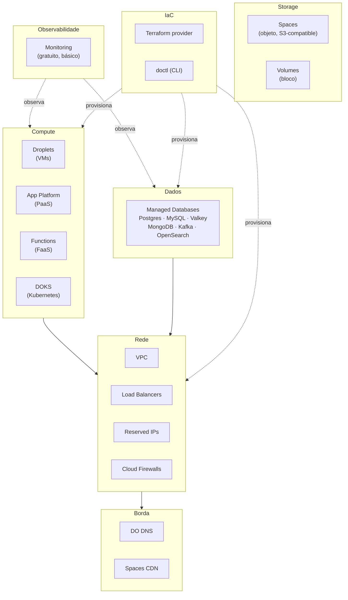
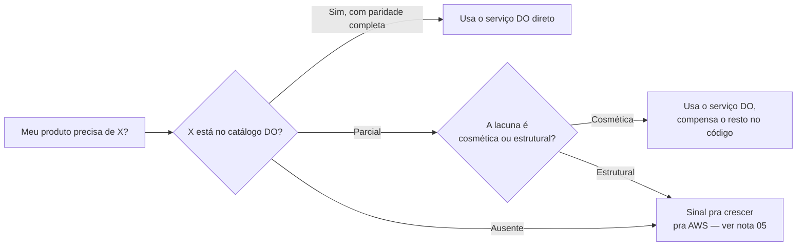

> [!abstract] TL;DR
> O catálogo inteiro do DigitalOcean cabe numa tabela de uma tela — e isso não é pobreza, é decisão de produto. Compute (Droplets, App Platform, Functions, DOKS), storage (Spaces, Volumes), Managed Databases (seis engines), rede (VPC, Load Balancers, Firewalls), borda (DNS, CDN) e observabilidade básica cobrem talvez 80% dos casos de uso reais de uma equipe pequena a média. O que falta é deliberado: sem orquestração serverless tipo Step Functions, sem NoSQL serverless tipo DynamoDB, sem IAM federado tipo Cognito, sem data lake tipo Athena. Este mapa mostra cada peça, sua equivalente na AWS, e onde a lacuna é honesta — não um "quase igual" disfarçado.

## O problema: catálogo grande vira ansiedade de escolha

Depois do galho 21 (AWS a fundo), você já sabe que a AWS tem mais de 200 serviços catalogados. Isso é poder — mas também é um tipo específico de fricção que a experiência já te ensinou: toda vez que você precisa resolver algo na AWS, a primeira pergunta não é "como resolvo isso?", é "qual dos 12 serviços candidatos eu deveria usar pra resolver isso?". Fila de mensagens? SQS, SNS, EventBridge, MSK, Kinesis — todos fazem parte de "mensageria", cada um com um recorte diferente. Bom pra quem precisa da ferramenta exata. Caro em tempo cognitivo pra quem só quer publicar um evento e seguir em frente.

O DigitalOcean resolve esse problema por eliminação. Não tem 12 opções de mensageria — tem zero serviço de mensageria gerenciado dedicado (você roda Kafka como Managed Database, ou publica webhooks, e ponto). Não tem 5 tipos de storage — tem dois: objeto (Spaces) e bloco (Volumes). A pergunta "qual serviço eu uso?" quase nunca aparece, porque quase sempre só existe um candidato.

A tese desta nota é literal: você consegue segurar o catálogo inteiro do DO na cabeça, de memória, depois de uma tarde de leitura. Não existe isso pra AWS. E pra grande parte dos produtos que uma equipe pequena constrói, essa limitação é uma feature — ela elimina uma classe inteira de decisões de arquitetura que não agregam valor ao produto.

## O mapa por categoria



Seis blocos, dezoito serviços contáveis nos dedos de duas mãos. Compare mentalmente com a nota "Sinal e ruído no catálogo" do galho 21 — lá cada bloco desse diagrama vira uma família com 5 a 15 serviços dentro, e a nota inteira é sobre como filtrar sinal de ruído dentro de uma única família. Aqui não existe esse problema: cada bloco tem, no máximo, uma meia dúzia de nomes — e você já sabe o que cada um faz antes mesmo de abrir o console, porque o nome não deixa margem pra ambiguidade.

Vale destrinchar cada bloco por um instante, não pra reexplicar o primitivo (isso já foi feito nos galhos 05 a 20), mas pra mostrar como o DO decidiu encarnar cada peça.

### Compute — quatro formas de rodar código

Droplet é a VM crua: você escolhe tamanho, imagem, região, e o resto é seu. App Platform é a camada gerenciada em cima disso — você entrega um repositório Git ou uma imagem de container, e a plataforma cuida de build, deploy, TLS e scaling horizontal por HTTP. Functions é a camada mais fina: código que roda sob demanda, cobrado por invocação, sem servidor visível. E DOKS é Kubernetes gerenciado pra quem já decidiu que quer a complexidade de orquestração de containers em troca do controle que ela traz.

Repare na progressão: da VM nua (controle total, operação manual) até a função efêmera (zero controle de infraestrutura, operação zero). É a mesma escada que você já viu no [[03-Dominios/Tecnologia/Cloud/06 - Compute II — elasticidade e balanceamento/index|galho 06]] e no [[03-Dominios/Tecnologia/Cloud/11 - Serverless e FaaS — Lambda a fundo/index|galho 11]] — só que aqui são quatro degraus, não doze.

```bash
# Um Droplet via doctl — a CLI oficial do DO
doctl compute droplet create meu-app \
  --region nyc3 \
  --image ubuntu-24-04-x64 \
  --size s-1vcpu-1gb \
  --ssh-keys <fingerprint-da-chave>

# Um app inteiro via App Platform, a partir de um app spec declarativo
doctl apps create --spec app-spec.yaml

# Um cluster Kubernetes gerenciado
doctl kubernetes cluster create meu-cluster \
  --region nyc3 \
  --node-pool "name=pool-padrao;size=s-2vcpu-4gb;count=3"
```

Três comandos, três camadas de abstração — e nenhuma delas exige aprender um SDK novo. `doctl` fala com o catálogo inteiro do DO.

### Storage — objeto e bloco, só isso

Spaces guarda objetos (imagens, backups, arquivos estáticos) com uma API compatível com S3 — o mesmo SDK, os mesmos comandos `aws s3 cp` funcionam apontando pro endpoint do DO, trocando só a credencial e o endpoint. Volumes é block storage anexável a um Droplet, o equivalente direto a um disco de rede.

O que não existe é a terceira perna que você tem na AWS: um serviço de file storage gerenciado (NFS) tipo EFS, compartilhável entre múltiplas instâncias ao mesmo tempo. Se seu desenho depende disso — várias VMs escrevendo no mesmo filesystem simultâneo —, o DO não te dá isso de fábrica.

### Dados — seis engines, sem serverless nativo

Managed Databases cobre PostgreSQL, MySQL, Kafka, MongoDB, Valkey e OpenSearch — cada um provisionado como cluster com HA, backup automático e patching gerenciado, o mesmo modelo mental do [[03-Dominios/Tecnologia/Cloud/09 - Bancos gerenciados/index|galho 09]]. A diferença pra AWS não é a lista de engines (ela é comparável, RDS também cobre Postgres/MySQL e ElastiCache cobre cache in-memory) — é a ausência de uma opção *serverless* de billing por request, o buraco que o DynamoDB ocupa na AWS. No DO você provisiona um cluster e paga por ele estar de pé, ponto.

### Rede — o quarteto que sustenta tudo

VPC isola a rede privada, Load Balancers distribuem tráfego entre Droplets ou App Platform components, Reserved IPs dão um IP público estável que sobrevive à destruição de um Droplet, e Cloud Firewalls filtram tráfego por porta/origem. É literalmente o mesmo conjunto de primitivos do [[03-Dominios/Tecnologia/Cloud/07 - Rede na nuvem (VPC)/index|galho 07]] — só que a superfície de configuração de cada um é uma fração da AWS. Um Cloud Firewall não tem a granularidade de NACLs + Security Groups em camadas; é uma lista de regras, direto.

### Borda — DNS e CDN, sem produto autônomo de edge

DO DNS hospeda zonas e registros de graça, sem cobrança por consulta (diferente do Route 53, que cobra por zona hospedada e por milhão de consultas). O CDN vem embutido no Spaces — não existe um produto de CDN independente que você aponte pra uma origem arbitrária fora do DO, o que é a limitação real frente ao CloudFront.

### Observabilidade e IaC — o básico, de graça

Monitoring é gratuito e cobre métricas de infraestrutura (CPU, memória, disco, rede, e desde o fim de 2025 também GPU) com alertas por limiar. Não faz logs estruturados nem tracing distribuído — pra isso você integra uma ferramenta terceira, o mesmo dilema do [[03-Dominios/Tecnologia/Cloud/17 - Observabilidade na cloud/index|galho 17]], só que sem a opção "nativa mais robusta" que a AWS oferece via X-Ray e CloudWatch Logs Insights.

Do lado de IaC, o provider oficial do Terraform cobre a maior parte do catálogo (Droplets, DOKS, App Platform, Databases, VPC, DNS, Spaces), e o `doctl` serve tanto pra automação quanto pra uso interativo — o par funcional do combo Terraform + AWS CLI do [[03-Dominios/Tecnologia/Cloud/16 - Infrastructure as Code/index|galho 16]].

## A tabela grande: serviço por serviço

A coluna "galho da trilha" aponta pra onde você já estudou o primitivo — essa nota não reexplica o conceito, só mostra a encarnação DO dele. A coluna "paridade" é o veredito de honestidade: completa, parcial ou ausente.

| Serviço DO | Categoria | Equivalente AWS | Galho da trilha | Paridade |
|---|---|---|---|---|
| Droplets | Compute (VM) | EC2 | [[03-Dominios/Tecnologia/Cloud/05 - Compute I — máquinas virtuais/index\|galho 05]] | Completa — mais simples, menos tipos de instância |
| App Platform | Compute (PaaS) | App Runner / Elastic Beanstalk | [[03-Dominios/Tecnologia/Cloud/06 - Compute II — elasticidade e balanceamento/index\|galho 06]] | Completa pro caso comum — ver nota 04 deste galho |
| Functions | Compute (FaaS) | Lambda | [[03-Dominios/Tecnologia/Cloud/11 - Serverless e FaaS — Lambda a fundo/index\|galho 11]] | Parcial — cobertura de linguagens e limites bem mais estreitos |
| DOKS | Compute (Kubernetes) | EKS | [[03-Dominios/Tecnologia/Cloud/12 - Containers gerenciados/index\|galho 12]] | Completa — e o control plane é gratuito (verificado 2026-07-24) |
| Container Registry | Compute (apoio) | ECR | galho 12 | Completa, escopo menor |
| Spaces | Storage (objeto) | S3 | [[03-Dominios/Tecnologia/Cloud/08 - Armazenamento (object, block e file)/index\|galho 08]] | Completa — API S3-compatível, CDN embutido |
| Volumes | Storage (bloco) | EBS | galho 08 | Completa |
| — | Storage (arquivo/NFS) | EFS | galho 08 | **Ausente** — sem serviço de file storage gerenciado equivalente a EFS |
| Managed Postgres | Dados (relacional) | RDS (Postgres) | [[03-Dominios/Tecnologia/Cloud/09 - Bancos gerenciados/index\|galho 09]] | Completa |
| Managed MySQL | Dados (relacional) | RDS (MySQL) | galho 09 | Completa |
| Managed Valkey | Dados (cache/KV) | ElastiCache | galho 09 | Completa — DO migrou de Redis pra Valkey (fork open-source); ver [!info] abaixo |
| Managed MongoDB | Dados (documento) | DocumentDB | galho 09 | Completa |
| Managed Kafka | Dados (streaming) | MSK | [[03-Dominios/Tecnologia/Cloud/13 - Mensageria e eventos gerenciados/index\|galho 13]] | Completa como broker; sem Kinesis/Firehose equivalente |
| Managed OpenSearch | Dados (busca/logs) | OpenSearch Service | galho 09 / galho 17 | Completa |
| — | Dados (NoSQL serverless) | DynamoDB | galho 09 | **Ausente** — nenhum key-value serverless nativo com billing por request |
| VPC | Rede | VPC | [[03-Dominios/Tecnologia/Cloud/07 - Rede na nuvem (VPC)/index\|galho 07]] | Completa, modelo mais simples (uma VPC por região por padrão) |
| Load Balancers | Rede | ELB (ALB/NLB) | galho 06 / galho 07 | Completa, menos camadas de configuração |
| Reserved IPs | Rede | Elastic IP | galho 07 | Completa |
| Cloud Firewalls | Rede | Security Groups | galho 07 / [[03-Dominios/Tecnologia/Cloud/18 - Segurança na cloud a fundo/index\|galho 18]] | Completa |
| DO DNS | Borda | Route 53 | [[03-Dominios/Tecnologia/Cloud/10 - DNS, CDN e borda/index\|galho 10]] | Completa como DNS autoritativo; sem roteamento avançado (latency/geo routing policies) |
| Spaces CDN | Borda | CloudFront | galho 10 | Parcial — CDN embutido no Spaces, sem produto de CDN standalone para origens arbitrárias |
| Monitoring | Observabilidade | CloudWatch | [[03-Dominios/Tecnologia/Cloud/17 - Observabilidade na cloud/index\|galho 17]] | Parcial — gratuito, mas métricas rasas (sem logs estruturados nativos, sem tracing) |
| Terraform provider | IaC | CloudFormation / CDK | [[03-Dominios/Tecnologia/Cloud/16 - Infrastructure as Code/index\|galho 16]] | Completa — provider oficial mantido pela DO, cobre a maior parte do catálogo |
| doctl (CLI) | IaC / operação | AWS CLI | galho 16 | Completa pro escopo do DO |

Dezoito linhas de conteúdo real. É o catálogo inteiro — não uma amostra.

## O que não existe (e por que isso importa)



> [!warning] O que o DO não tem — e você precisa saber disso antes de precisar disso
> Nenhuma dessas ausências é bug. São recortes de produto. Mas se você assumir paridade onde não existe, o projeto quebra em produção, não em planejamento.
>
> - **Orquestração de workflow gerenciada.** Não existe nada como o Step Functions. Se você precisa coordenar uma cadeia de passos com retry, branching e estado durável, você mesmo constrói isso (fila + workers, ou uma lib de orquestração rodando num Droplet/App Platform).
> - **Identidade federada gerenciada.** Não existe um Cognito. Auth de usuário final é responsabilidade sua (Auth0, Clerk, Keycloak self-hosted, ou código próprio) — o DO não entra nessa camada.
> - **Data lake / query federada.** Não existe um Athena. Não há um jeito nativo de rodar SQL ad-hoc sobre arquivos no Spaces.
> - **Barramento de eventos maduro.** Não existe um EventBridge. Você tem Managed Kafka como o mecanismo de streaming mais próximo, mas sem roteamento por regra, sem schema registry nativo, sem integração de centenas de fontes SaaS.
> - **ML gerenciado full-stack.** Não existe um SageMaker clássico. O DO lançou uma camada de "GenAI/AI-Native" (inferência de modelos, agentes) nos últimos ciclos — mas é uma oferta recente e mais estreita, fora do escopo hands-on desta trilha.
> - **Serverless NoSQL com billing por request.** Sem DynamoDB. O mais perto é Managed MongoDB ou Valkey, mas ambos são cluster provisionado, não serverless de verdade.
> - **File storage gerenciado tipo NFS.** Sem EFS. Se seu app precisa de um filesystem compartilhado entre múltiplas instâncias, a solução no DO é rodar seu próprio NFS num Droplet, ou repensar a arquitetura pra usar Spaces.
>
> Cada um desses "não tem" é uma pergunta que você deveria fazer antes de escolher DO pra um projeto: "meu produto precisa de alguma dessas peças?" Se a resposta é sim de forma estrutural (não incidental), o DO sozinho provavelmente não é a casa certa — e é exatamente esse ponto que a nota 05 deste galho vai explorar em detalhe.

> [!info] Fatos verificados em 2026-07-24 — conferir se mudar
> - Managed Databases hoje tem seis engines: **PostgreSQL, MySQL, Kafka, MongoDB, Valkey, OpenSearch**. O DO migrou a oferta de "Redis" para **Valkey** (o fork open-source mantido pela Linux Foundation depois da mudança de licença do Redis) — se você usou DO há um ou dois anos, o produto que você conhecia como "Managed Redis" hoje é Valkey.
> - O control plane do DOKS é **gratuito**; você paga só pelos nós (Droplets), block storage e load balancers anexados ao cluster.
> - DigitalOcean Monitoring é **gratuito** e cobre métricas de CPU, memória, disco e rede de Droplets (incluindo observabilidade de GPU desde novembro de 2025) — mas não é um substituto de logs estruturados ou tracing distribuído.
> - Spaces tem CDN embutido nativamente — não é um add-on separado, vem junto do bucket.
> - A camada de "AI-Native Cloud" / inferência de modelos é produto novo do DO (lançado nos últimos ciclos) — cite-a como existente, mas não trate como madura ou comparável ao portfólio de ML da AWS.

## E se eu leio Azure ou GCP em vez de AWS?

Esta trilha usa a AWS como referência principal porque é o dialeto mais comum no mercado, mas se o seu ponto de partida mental é Azure ou GCP, a tradução de nomes ajuda a ancorar rápido. Esta tabela é só isso — tradução de rótulo, não roteiro hands-on (a trilha não cobre Azure/GCP em profundidade):

| Categoria | DigitalOcean | AWS | Azure | GCP |
|---|---|---|---|---|
| VM | Droplets | EC2 | Virtual Machines | Compute Engine |
| PaaS | App Platform | App Runner | App Service | Cloud Run / App Engine |
| FaaS | Functions | Lambda | Azure Functions | Cloud Functions |
| Kubernetes gerenciado | DOKS | EKS | AKS | GKE |
| Storage de objeto | Spaces | S3 | Blob Storage | Cloud Storage |
| Storage de bloco | Volumes | EBS | Managed Disks | Persistent Disk |
| Banco relacional gerenciado | Managed Postgres/MySQL | RDS | Azure Database for PostgreSQL/MySQL | Cloud SQL |
| Rede privada | VPC | VPC | Virtual Network (VNet) | VPC |
| Load balancer | Load Balancers | ELB | Azure Load Balancer | Cloud Load Balancing |
| DNS gerenciado | DO DNS | Route 53 | Azure DNS | Cloud DNS |

Note que a linha "PaaS" e a linha "FaaS" da Azure e do GCP não são um-pra-um perfeitas entre si (Cloud Run é mais container-first, App Engine é mais buildpack-first) — o mesmo tipo de nuance que você já viu vale pra cada canto dessa tabela. Trate-a como bússola, não como dicionário exato.

## Como ler essa tabela na prática

Um exemplo concreto: você está desenhando o backend de um app de fotos. Na AWS, esse desenho tocaria S3 (storage), CloudFront (CDN), Lambda ou App Runner (processamento de thumbnail), RDS (metadados), talvez SQS (fila de jobs de processamento) e Cognito (auth de usuário). Seis a sete serviços, seis a sete decisões de "qual variante escolher dentro do serviço".

No DO, o mesmo desenho: Spaces (storage + CDN, um produto só), App Platform ou Functions (processamento), Managed Postgres (metadados), e para a fila de jobs você provavelmente usa uma tabela no Postgres com locking, ou roda um worker simples consumindo do próprio Spaces via webhook — porque não tem SQS gerenciado dedicado. Auth você resolve com uma lib (Devise, NextAuth, Passport) rodando dentro da sua própria aplicação, porque não tem Cognito.

Repare no padrão: onde o DO tem paridade completa (compute, storage, banco relacional, rede), a escolha é direta e você ganha tempo. Onde falta (mensageria robusta, auth federada, NoSQL serverless), você não perde a capacidade de construir — você perde a opção de comprar a peça pronta, e reconstrói com o que tem à mão. Pra grande parte dos produtos de equipe pequena, essa troca compensa. Pra sistemas que dependem estruturalmente dessas peças ausentes, ela não compensa — e é melhor descobrir isso na mesa de desenho do que em produção.

Um segundo exemplo, mais próximo de plataforma de dados: você precisa de um pipeline que recebe eventos de clique, agrega métricas em near-real-time e alimenta um dashboard. Na AWS, esse é o terreno clássico do Kinesis (ingestão), Lambda (transformação), talvez um Firehose entregando pro S3, e Athena ou Redshift pra query analítica — um desenho inteiro de dados em movimento, coberto pelo [[03-Dominios/Tecnologia/Cloud/13 - Mensageria e eventos gerenciados/index|galho 13]] e pelo [[03-Dominios/Tecnologia/Cloud/15 - Arquiteturas serverless e event-driven/index|galho 15]].

No DO, você tem Managed Kafka como ingestão (funciona bem, é o mesmo protocolo), mas dali em diante o desenho muda de forma: sem Firehose pra entrega automática, sem Athena pra query ad-hoc sobre arquivos brutos, você processa os eventos com um worker consumindo do Kafka direto (rodando em App Platform ou Droplet) e grava o agregado já pronto em Managed Postgres ou OpenSearch, que aí sim você consulta. Funciona — mas é um desenho que você monta peça por peça, não um pipeline de dados que a plataforma já entende de ponta a ponta. Se "pipeline de dados analítico" é o *core* do seu produto, isso pesa na balança de decisão que a nota 05 deste galho vai formalizar.

## O que vem a seguir

O catálogo mapeado aqui tem um atributo que ainda não apareceu explicitamente: o preço de cada peça é fácil de prever antes de rodar um centavo. A próxima nota deste galho mergulha nisso — como o pricing do DO (por Droplet, por cluster, sem taxa de saída surpresa na maioria dos casos) funciona como um diferencial de produto tão real quanto o catálogo enxuto, e onde essa previsibilidade tem limite.

## Fontes

- DigitalOcean — Products overview: https://docs.digitalocean.com/products/
- DigitalOcean — Databases (Managed Databases): https://docs.digitalocean.com/products/databases/
- DigitalOcean — Functions: https://docs.digitalocean.com/products/functions/
- DigitalOcean — Kubernetes (DOKS): https://docs.digitalocean.com/products/kubernetes/
- DigitalOcean — Kubernetes pricing: https://www.digitalocean.com/pricing/kubernetes
- DigitalOcean — App Platform: https://docs.digitalocean.com/products/app-platform/
- DigitalOcean — Spaces: https://docs.digitalocean.com/products/spaces/
- DigitalOcean — DNS: https://docs.digitalocean.com/products/networking/dns/
- DigitalOcean — Monitoring: https://docs.digitalocean.com/products/monitoring/
- Terraform Registry — DigitalOcean provider: https://registry.terraform.io/providers/digitalocean/digitalocean/latest/docs
