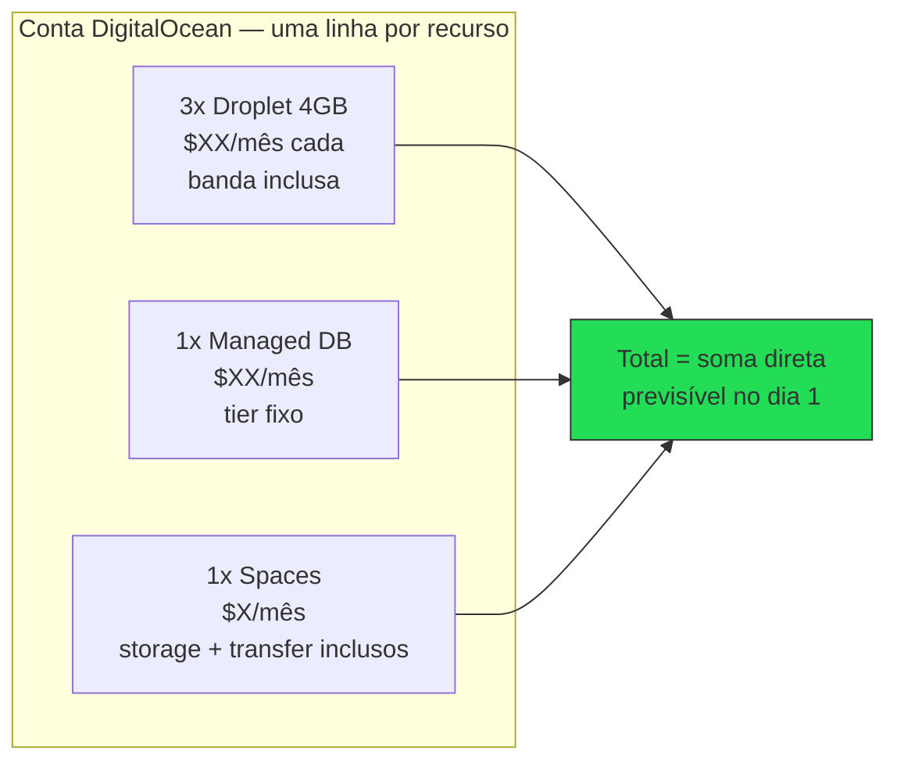
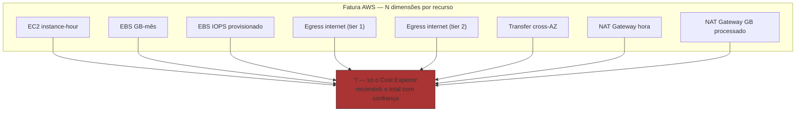
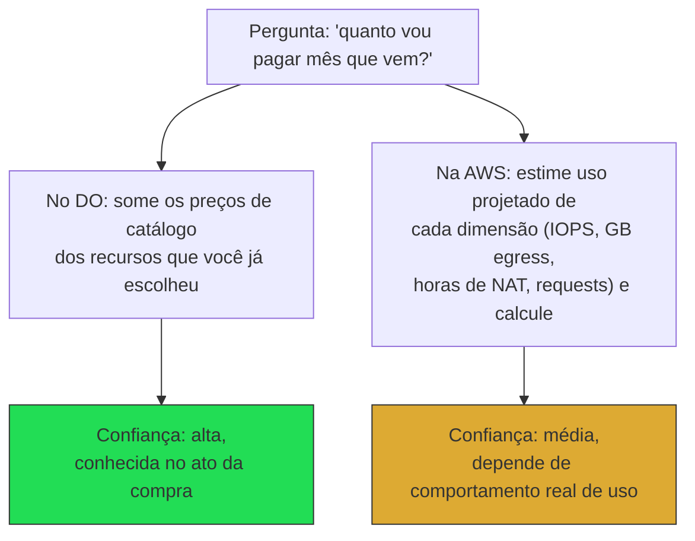
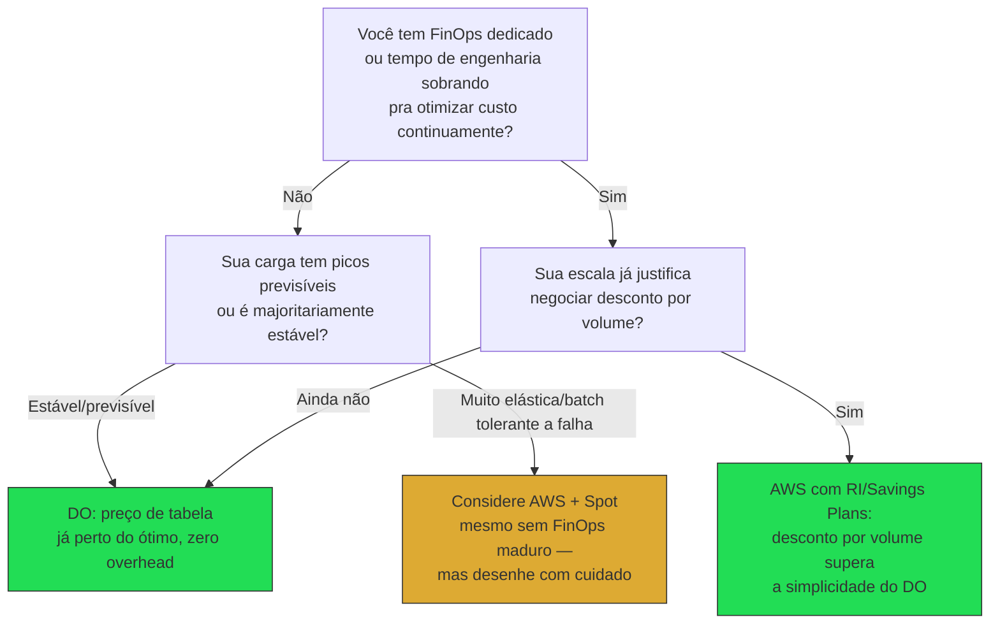

> [!abstract] TL;DR
> O maior diferencial do DigitalOcean não é técnico — é econômico e cognitivo. Na AWS, "quanto vou pagar?" é uma pergunta que só um FinOps analyst treinado responde com confiança, porque a conta tem dezenas de dimensões de cobrança (compute, storage, IOPS, requests, NAT Gateway, egress por destino, cross-AZ...). No DO, a resposta cabe numa frase: "$X por Droplet, por mês, com banda incluída." Essa previsibilidade não é feature de marketing — é a diferença entre conseguir orçar seis meses à frente com confiança e viver refazendo planilha de custo toda sexta-feira. A lente se inverte aqui: onde a AWS ganha em profundidade de otimização, o DO ganha em simplicidade de previsão — e para a maioria dos times pequenos e médios, previsibilidade vale mais do que a possibilidade teórica de espremer mais 12% de desconto com Savings Plans.

## O problema: você sabe quanto vai pagar mês que vem?

Faça um teste mental. Você está rodando uma API REST simples, com um banco gerenciado, um pouco de armazenamento de objetos para uploads de usuário, e um CDN na frente. Pergunta: quanto essa arquitetura vai custar mês que vem?

Se a resposta for "depende — deixa eu abrir o Cost Explorer e checar", você está descrevendo a experiência AWS. Não porque você fez algo errado, mas porque a AWS **cobra por dimensão**, não por serviço. Um único EC2 rodando 24/7 já tem três linhas de fatura possíveis: a instância em si, o EBS anexado, e o data transfer — cada uma com sua própria unidade de cobrança (instance-hour, GB-mês, GB transferido). Multiplique isso por RDS, S3, CloudFront, NAT Gateway, e a fatura de uma arquitetura "simples" facilmente passa de 15-20 linhas.

Se a resposta for "R$ tal, porque eu tenho 3 Droplets de tal tamanho e um banco gerenciado de tal tier", você está descrevendo a experiência DigitalOcean. O preço do Droplet já inclui compute, disco e uma cota de banda — você paga o que está no catálogo, ponto. É esse contraste que a nota anterior deste galho, sobre o catálogo enxuto do DO, já insinuava: menos peças móveis no catálogo produz menos peças móveis na fatura. Aqui vamos além da superfície e mostramos por que essa previsibilidade é, ela mesma, um ativo de engenharia — não apenas conforto administrativo.

> [!info] Preços mudam. Os valores citados nesta nota são ordinais e aproximados, verificados em 2026-07-24 via a documentação oficial de billing do DigitalOcean (`docs.digitalocean.com/products/droplets/details/pricing/`) e a página de pricing do EC2 (`aws.amazon.com/ec2/pricing/on-demand/`). Antes de tomar decisão de arquitetura baseada em preço, confira `digitalocean.com/pricing` e a calculadora oficial da AWS (`calculator.aws`) para os números do dia.

## O modelo DO: preço de tabela, banda inclusa, fatura de uma linha por recurso

O Droplet — a unidade central do catálogo DO — é cobrado por segundo (mínimo de 60 segundos ou $0.01, o que for maior), mas o número que importa na prática é o **preço mensal do plano**, que já embute compute, disco SSD local e uma cota de transferência de saída ("outbound data transfer"). A entrada não é cobrada. Enquanto o Droplet existe — mesmo desligado, porque o recurso continua reservado no hipervisor — ele acumula custo previsível dentro do plano contratado.

O detalhe que fecha essa previsibilidade: a cota de banda não é por Droplet isolado, ela é **agregada em pool no nível da conta/time**. Se você tem cinco Droplets pequenos e um deles teve um pico de tráfego, ele consome do pool coletivo antes de gerar cobrança extra — em vez de cada recurso individual estourar seu próprio limite de forma independente e imprevisível. Quando o pool estoura, o excedente é cobrado a uma taxa simples por GiB (na ordem de centavos de dólar), sem tiers, sem cobrança diferenciada por região de destino, sem taxa diferente para "primeiros X GB" vs "próximos Y GB". Uma taxa. Um número.

O mesmo padrão de "preço de tabela previsível" se repete nos outros serviços gerenciados do catálogo enxuto: Managed Databases tem preço fixo por tier (vCPU/RAM/disco definidos), Spaces (object storage) tem um preço-base que já inclui uma cota generosa de armazenamento e transferência, com overage simples acima disso. Você não precisa somar seis linhas de fatura para saber quanto uma peça custa — você olha o preço do plano no catálogo e é isso.

Para tirar isso do abstrato, alguns planos Basic Droplet reais (verificados em 2026-07-24, sujeitos a mudança):

| Plano | Preço/mês | vCPU | RAM | Banda inclusa |
|---|---|---|---|---|
| Menor (Smallest) | $4.00 | 1 | 512 MiB | 500 GiB |
| Intermediário | $12.00 | 1 | 2 GiB | 2.000 GiB |
| Maior (nesta faixa) | $48.00 | 4 | 8 GiB | 5.000 GiB |

Repare no padrão: a banda inclusa cresce junto com o tamanho do plano, e em nenhuma linha dessa tabela existe uma segunda linha de fatura para "transferência". O número de banda já está embutido no mesmo preço fixo — e como vimos, esses números de banda se somam num pool de conta, então três Droplets do plano intermediário juntos têm 6.000 GiB de cota agregada antes de qualquer cobrança extra aparecer.

## O terror do egress AWS: mil dimensões, uma fatura ilegível

A [[03-Dominios/Tecnologia/Cloud/19 - FinOps — a economia da cloud/01 - Por que a conta explodiu|nota que abriu o galho de FinOps]] já contou essa história em detalhe: a conta AWS explode porque o modelo de cobrança é granular por design — cada dimensão de uso (compute, storage, IOPS, requests, transferência entre AZs, transferência entre regiões, transferência para a internet, NAT Gateway por hora **e** por GB processado...) tem seu próprio medidor, e esses medidores se somam de forma não-óbvia.

O caso mais didático é o egress. Data transfer *para dentro* da AWS é gratuito. Data transfer *entre serviços na mesma região* costuma ser gratuito ou muito barato. Mas data transfer *para fora* — para a internet, para o usuário final — é cobrado em GB, com uma faixa gratuita mensal (na ordem de dezenas de GB, agregada entre serviços e regiões) e depois tiers progressivos que variam por volume. Some a isso o fato de que tráfego cross-AZ dentro da própria região também é cobrado (uma pegadinha clássica para quem monta arquitetura multi-AZ sem saber), e o resultado é uma fatura onde a mesma "transferência de dados" aparece fatiada em quatro ou cinco linhas diferentes, cada uma com preço distinto dependendo de origem, destino e volume acumulado no mês.

Nenhuma dessas linhas é cobrança "errada" ou abusiva — cada uma reflete um custo real de infraestrutura que a AWS está repassando de forma granular. O ponto não é que a AWS é desonesta, é que **granularidade de cobrança é o preço que você paga pela granularidade de controle**. Você pode, em tese, escolher exatamente quanto IOPS provisionar, exatamente qual classe de storage usar por objeto, exatamente que tier de NAT evitar. Essa liberdade de ajuste fino é real e valiosa — mas ela tem como contrapartida uma fatura que exige instrumentação para ser entendida.

> [!tip] Assista: Comparing Cloud Egress Costs - Azure vs Digital Ocean vs Google Cloud vs Railway
> **Canal:** HAMY LABS | **Duração:** ~3min | **Idioma:** EN
>
> Um teste prático e rápido: mesma carga de 100 GB de egress, quatro provedores, fatura lado a lado. O número fala sozinho — dá pra ver na prática por que a nota chama o egress previsível do DO de "diferencial", não só de discurso de marketing. Trecho de destaque [02:06]: *"for digital ocean to be paying $1 their egress costs are quite low"*
>
> 🎬 [Assistir no YouTube](https://www.youtube.com/watch?v=hx_bJiURsf8)

## O custo real da "otimização": FinOps não é grátis

Aqui está o argumento que costuma ficar invisível em comparação de preço de tabela: **o preço-lista da AWS raramente é o preço que você paga sem esforço**. Para chegar perto do custo ótimo na AWS você precisa, no mínimo, do que a trilha de FinOps deste domínio já cobriu:

- **Tagueamento disciplinado** de todo recurso, para que o custo seja atribuível por time/produto/ambiente — sem isso, o Cost Explorer devolve um bolo indiferenciado.
- **Cost Explorer e dashboards de visibilidade** rodando continuamente, e alguém revisando esses dashboards com regularidade — visibilidade não é um relatório mensal, é um hábito operacional.
- **Right-sizing recorrente**, porque instâncias super-provisionadas "por segurança" no dia do deploy raramente são revisadas depois.
- **Reserved Instances ou Savings Plans** comprometidos com 1-3 anos de antecedência para captar desconto — o que exige previsão de capacidade que nem todo time em fase de crescimento consegue fazer com confiança.
- Em arquiteturas mais agressivas, **Spot Instances** com tolerância a interrupção, que exigem desenho de aplicação (checkpointing, filas, retries) para não virar risco operacional.

Cada um desses itens é trabalho — trabalho de pessoa, trabalho de processo, trabalho de cultura organizacional. A [[03-Dominios/Tecnologia/Cloud/19 - FinOps — a economia da cloud/05 - FinOps na prática e cultura|nota sobre cultura FinOps]] deste vault chama isso de "prática contínua", não projeto pontual — e times pequenos raramente têm a massa crítica de spend (ou de headcount) para justificar dedicar uma pessoa a isso em tempo parcial, quanto mais em tempo integral.

O DigitalOcean, por comparação, entrega um **preço de tabela já competitivo sem esse overhead cognitivo**. Você não precisa de tag strategy, de Cost Explorer, de comitê de right-sizing, para saber quanto sua infraestrutura custa — o preço do Droplet no catálogo já é, para a maioria dos perfis de carga, próximo do melhor preço que você conseguiria arrancar. Isso não é o DO sendo "mais barato por unidade de compute" em abstrato — é o DO eliminando a *distância* entre o preço de tabela e o preço real que você paga no dia a dia, distância essa que na AWS só se fecha com trabalho de FinOps.

Vale nomear o efeito com precisão: o custo total de operar na AWS de forma barata inclui o custo do trabalho de otimização. Se esse trabalho não é feito — o que é o caso da maioria dos times pequenos, que não têm FinOps dedicado — a AWS na prática cobra o preço de tabela sem desconto, que costuma ser mais caro do que a alternativa DO equivalente. A vantagem de preço da AWS é *condicional* a você investir em capturá-la.

## Honestidade: onde a AWS ainda ganha

A lente não pode ser unilateral. Em pelo menos dois cenários, a matemática vira a favor da AWS:

**Escala muito grande.** Quando o volume de compute e storage passa de determinado patamar, o desconto por comprometimento (Savings Plans, Reserved Instances de 1-3 anos, Enterprise Discount Programs negociados diretamente com a AWS) começa a superar qualquer vantagem de simplicidade do DO. Um time com FinOps maduro, spend previsível e capacidade de negociação direta com a AWS consegue, em escala, preços por unidade de compute mais baixos do que o preço de tabela do DO — porque a AWS efetivamente "vende no atacado" para quem compra volume e se compromete com prazo.

**Cargas tolerantes a interrupção.** Spot Instances na AWS podem custar uma fração pequena do preço on-demand para cargas batch, processamento assíncrono, ou workloads que toleram ser interrompidos e retomados — a AWS anuncia desconto de **até 90% sobre o preço on-demand** (verificado 2026-07-24 em `aws.amazon.com/ec2/spot/`; o desconto real varia por tipo de instância, região e disponibilidade de capacidade ociosa no momento). O DigitalOcean **não tem equivalente de Spot nem de Savings Plans** — não existe um "Droplet com desconto por tolerar interrupção" nem um "desconto por comprometimento de 1-3 anos" no catálogo DO. Isso é uma lacuna estrutural real, não um detalhe: se sua carga é elástica, batch, e tolerante a falha, a AWS com Spot bem desenhado provavelmente vence em custo por unidade de trabalho de forma clara — mesmo um desconto de metade disso já supera qualquer margem que o preço de tabela do DO consiga oferecer.

Vale uma correção fina antes de seguir: dizer que o DO "não tem nenhum desconto por comprometimento" não é 100% exato. Para GPU Droplets especificamente, o DO oferece preço reduzido mediante "compromisso contratual multi-mês" (verificado 2026-07-24 em `digitalocean.com/pricing`) — e para prepagamento de recursos em geral, a orientação é falar com o time comercial, o que sugere que arranjos customizados existem fora do self-service. Mas isso é a exceção que confirma a regra: não existe um mecanismo self-service, catalogado, aplicável a Droplets de propósito geral, equivalente a Reserved Instances ou Savings Plans. Você não entra no painel do DO e reserva capacidade de compute genérica por 1-3 anos em troca de desconto — o que existe é uma janela estreita (GPU) e uma porta de negociação manual (contato comercial), não um produto de self-service amplo como o da AWS.

Vale detalhar por que essa vantagem da AWS não é trivial de capturar, reforçando o argumento da seção anterior: Spot não é um botão que você aperta, é uma família de decisão de arquitetura. Savings Plans (Compute Savings Plans, mais flexíveis entre família de instância e região, ou EC2 Instance Savings Plans, mais restritos e com desconto maior) exigem comprometimento de 1 ou 3 anos, pagos sem upfront, com upfront parcial ou com upfront total — cada modalidade trocando desconto por rigidez de caixa. Spot Instances exigem que a aplicação tolere ser interrompida com aviso de poucos minutos, o que na prática significa desenhar para checkpointing, filas de retry, ou arquitetura stateless desde o início. Nenhuma dessas duas ferramentas é "ligar e esquecer" — ambas são disciplina de engenharia que o time precisa adotar deliberadamente, e ambas têm risco: comprometer-se com um Savings Plan de 3 anos em capacidade que depois fica ociosa é dinheiro perdido, e uma carga mal desenhada para Spot pode cair em produção no pior momento possível.

O ponto não é "DO sempre ganha" — é que a vantagem de preço da AWS exige duas coisas que nem todo time tem: **escala** para negociar desconto, e **maturidade de engenharia** para desenhar em torno de Spot sem virar risco de produção. Na ausência dessas duas condições — que descreve a maioria dos SaaS pequenos e médios — o preço de tabela previsível do DO tende a vencer na prática, mesmo sem nenhuma otimização.

## O que a previsibilidade compra além de dinheiro

Vale separar dois eixos que costumam ficar misturados numa comparação de preço: **quanto custa** e **quão bem você consegue prever quanto vai custar**. Um provedor pode ser mais barato por unidade e ainda assim pior em previsibilidade — é exatamente o caso da AWS otimizada versus DO de tabela, dependendo do cenário. E previsibilidade, isolada, tem valor próprio que não aparece direto na fatura:

- **Velocidade de aprovação de orçamento.** Quando um fundador ou gestor financeiro pergunta "quanto essa nova feature vai custar de infra", responder "R$ X fixo, já sei porque é um Droplet a mais" fecha a conversa em um turno. Responder "depende de tráfego, vou monitorar no Cost Explorer nos primeiros dois meses" abre uma negociação de risco que nem toda liderança de negócio tem paciência para ter.
- **Onboarding de gente nova.** Um engenheiro júnior consegue olhar o catálogo do DO e estimar custo de uma mudança de arquitetura sozinho, no primeiro dia. Estimar custo de uma mudança na AWS com confiança exige entender IAM, entender como tags fluem para o Cost Explorer, e geralmente exige perguntar para alguém que já "aprendeu na marra" onde estão as armadilhas de billing.
- **Sono tranquilo no fim de semana.** Ninguém acorda de madrugada assustado com uma fatura DO que triplicou porque alguém esqueceu um NAT Gateway ligado ou um bucket S3 público sendo raspado por um bot — não porque o DO seja infalível, mas porque a superfície de "coisas que podem gerar cobrança surpresa" é estruturalmente menor.
- **Auditoria e compliance financeira simplificados.** Reconciliar a fatura DO com o orçamento planejado é comparação direta, linha a linha. Reconciliar a fatura AWS costuma exigir uma ferramenta de terceiros (CloudHealth, Vantage, Kubecost, ou o próprio Cost Explorer com relatórios customizados) — outra peça de ferramental que é, ela mesma, mais um custo (de licença, de tempo de configuração, de curva de aprendizado).

Esse último ponto merece ênfase: o mercado inteiro de ferramentas de terceiros para "explicar a fatura da nuvem" (Vantage, CloudZero, Kubecost, entre outras) existe porque a granularidade nativa da AWS, Azure e GCP é difícil demais de interpretar sem ferramenta dedicada. Não existe um mercado equivalente de "ferramentas para explicar a fatura do DigitalOcean" — porque não há o que explicar além do óbvio.

## Um exemplo trabalhado: a mesma arquitetura, duas faturas

Vamos tornar isso concreto sem inventar números exatos — porque preço muda, e o que importa aqui é a *forma* da fatura, não o dígito específico. Imagine uma arquitetura modesta: 3 servidores de aplicação, 1 banco relacional gerenciado, um pouco de object storage para uploads, e tráfego de saída moderado (a maior parte do consumo vindo de respostas de API, não de streaming pesado).

No DigitalOcean, montar essa arquitetura é um exercício de catálogo: você escolhe o tamanho de Droplet para os 3 servidores, o tier do Managed Database, e um plano de Spaces. Cada escolha já mostra o preço mensal completo antes de você clicar em "criar". Se o tráfego de saída ficar dentro da cota agregada dos três Droplets — o que, para uma API que majoritariamente devolve JSON, costuma acontecer — a fatura do mês é a soma direta dos três preços de catálogo. Sem surpresa.

Na AWS, a mesma arquitetura — 3 instâncias EC2, 1 RDS, um bucket S3 — nasce com a mesma clareza de *preço por hora de cada peça*, mas a fatura final depende de decisões que só aparecem depois: quanto IOPS o RDS realmente consumiu, quanto tráfego saiu para a internet vs ficou dentro da VPC, se você colocou um NAT Gateway na frente (e quanto ele processou), se as instâncias estão em Reserved ou On-Demand. O preço por hora de cada peça é conhecido de antemão; o **total do mês** só é conhecido com confiança depois de fechar o mês — ou depois de instrumentar tudo com o rigor que a trilha de FinOps descreve.

Isso não significa que a AWS é imprevisível por incompetência de design — o modelo dela é granular *de propósito*, porque diferentes times têm perfis de uso muito diferentes e granularidade permite que cada um pague só pelo que usa em cada dimensão. O DO, por outro lado, escolheu empacotar essas dimensões em planos fixos, aceitando que alguns clientes vão "pagar um pouco a mais" por capacidade não usada em troca de nunca precisar calcular a fatura com antecedência. É uma troca de design — granularidade por previsibilidade — não um erro de um lado.

Para fechar o exemplo com números reais de catálogo (verificados 2026-07-24, sujeitos a mudança — confira `digitalocean.com/pricing`), a peça de banco de dados e a peça de object storage da nossa arquitetura hipotética têm preço tão direto quanto o Droplet:

| Peça | Plano | Preço/mês | O que já inclui |
|---|---|---|---|
| Managed Database (PostgreSQL, entrada) | 1 vCPU, 10-30 GiB storage | $15.15 | Backups, failover, patching |
| Managed Database (PostgreSQL, meio) | 2 vCPU, 60-120 GiB storage | $60.90 | Idem, mais capacidade |
| Spaces (object storage) | Base | $5.00 | 250 GiB storage + 1 TiB de transferência de saída |

Repare que o Spaces já inclui 1 TiB de transferência de saída dentro dos $5/mês base — para a maioria dos SaaS pequenos servindo uploads de usuário, isso é folga suficiente para nunca aparecer overage na fatura. O overage, quando aparece, é $0.02/GiB de storage extra e $0.01/GiB de transferência extra — de novo, uma taxa, não uma tabela de tiers.

## Tradução de nomes: Azure e GCP

Este vault não cobre Azure e GCP como plataforma hands-on (essa lente já foi estabelecida nas notas anteriores da trilha Cloud), mas vale mapear o vocabulário de precificação para reconhecer os conceitos equivalentes em conversas e documentação cross-provider:

| Conceito | AWS | DigitalOcean | Azure | GCP |
|---|---|---|---|---|
| Compute sob demanda | EC2 On-Demand | Droplet (preço de plano) | Azure VM Pay-as-you-go | Compute Engine On-Demand |
| Desconto por comprometimento | Reserved Instances / Savings Plans | *(sem equivalente)* | Reserved VM Instances / Savings Plan | Committed Use Discounts |
| Capacidade com desconto por interrupção | Spot Instances | *(sem equivalente)* | Spot Virtual Machines | Spot VMs |
| Ferramenta de análise de custo | Cost Explorer | Billing/Usage no painel (sem análise avançada) | Cost Management + Billing | Cloud Billing Reports |
| Cobrança de saída de dados | Data Transfer OUT (por GB, tiered) | Banda inclusa no plano + overage simples | Bandwidth (egress, tiered) | Network Egress (tiered) |
| Orçamento e alertas | AWS Budgets | Billing alerts (limite simples) | Azure Budgets | Budgets & Alerts |

O padrão se repete nos quatro provedores full-featured (AWS, Azure, GCP): todos oferecem desconto por comprometimento e capacidade spot/preemptível, porque todos competem pelo mesmo perfil de cliente enterprise que otimiza em escala. O DigitalOcean é o outlier deliberado — ele não compete nesse jogo de granularidade, compete no jogo de simplicidade previsível.

## Como decidir: um fluxo prático

Juntando os fios da nota, o critério de decisão sobre qual modelo de precificação combina melhor com um time pode ser resumido num fluxo simples — não como substituto de análise real, mas como ponto de partida honesto:

O nó que mais times pequenos subestimam é o primeiro: "FinOps dedicado ou tempo sobrando" não significa "alguém vai olhar a fatura de vez em quando" — significa capacidade de instrumentação contínua. Se a resposta honesta é não, o fluxo colapsa rapidamente para DO, exceto no caso específico de carga elástica tolerante a falha, onde vale o risco calculado de usar Spot mesmo sem maturidade de FinOps plena (o desconto de até 90% compensa até um desenho imperfeito).

## Cenários comparados

| Cenário | Perfil de carga | AWS sem FinOps dedicado | AWS com FinOps maduro | DO preço de tabela | Quem ganha na prática |
|---|---|---|---|---|---|
| SaaS pequeno (1-3 devs, tráfego baixo/médio, sem time de plataforma) | Compute estável, pouco pico | Caro (sem desconto capturado) | Raramente viável (sem headcount pra FinOps) | Competitivo, sem esforço | **DO** |
| SaaS médio (10-30 devs, tráfego variável, sem FinOps dedicado) | Compute + storage crescendo, algum pico | Caro, overhead cognitivo alto | Possível mas custoso em atenção | Competitivo, previsível | **DO na maioria dos casos** |
| SaaS grande (100+ devs, FinOps dedicado, spend alto) | Escala, batch tolerante a falha, RIs negociáveis | — | Vence em custo por unidade | Sem paridade de desconto por volume | **AWS** |
| Workload batch elástico e tolerante a interrupção | Processamento assíncrono, picos, pode reiniciar | Spot pode custar uma fração do on-demand | Vence com folga | Sem equivalente a Spot | **AWS** |

> [!warning] Armadilha do "preço de tabela é tudo"
> Comparar só o preço de tabela do DO com o preço de tabela on-demand da AWS é injusto nos dois sentidos. É injusto com a AWS porque ignora que quase ninguém paga preço on-demand puro em produção séria — RIs e Savings Plans são o caminho padrão para spend relevante. E é injusto com o DO porque ignora que a "otimização" da AWS tem custo de trabalho embutido que raramente entra na conta de quem está comparando só números de catálogo. A pergunta certa não é "qual catálogo é mais barato", é "qual modelo de cobrança combina com a maturidade operacional e o perfil de carga do meu time, hoje".

> [!warning] Egress ainda existe no DO, só é mais simples
> O DO não é imune a cobrança de banda — ele só embute uma cota generosa no preço do plano e cobra o excedente numa taxa única e simples. Cargas com tráfego de saída muito acima da média (streaming pesado, distribuição massiva de arquivos grandes) ainda vão gerar cobrança extra — a diferença é que essa cobrança é uma linha, não seis.

## O que vem a seguir

Pricing previsível resolve "quanto vou pagar", mas não resolve "como eu deployo sem operar servidor". A próxima nota deste galho olha para o App Platform — a resposta do DigitalOcean ao PaaS, e a peça que mais aproxima a experiência de deploy do DO da simplicidade de um Heroku, com o mesmo modelo de preço previsível carregado adiante.

## Fontes

- DigitalOcean. "Pricing — CPU Droplets." https://docs.digitalocean.com/products/droplets/details/pricing/
- DigitalOcean. "Pricing." https://www.digitalocean.com/pricing
- Amazon Web Services. "Amazon EC2 On-Demand Pricing." https://aws.amazon.com/ec2/pricing/on-demand/
- Amazon Web Services. "AWS Pricing Calculator." https://calculator.aws
- Amazon Web Services. "Data Transfer within AWS." https://aws.amazon.com/blogs/architecture/overview-of-data-transfer-costs-for-common-architectures/

