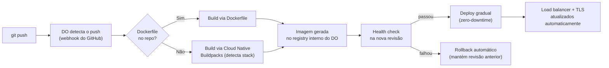
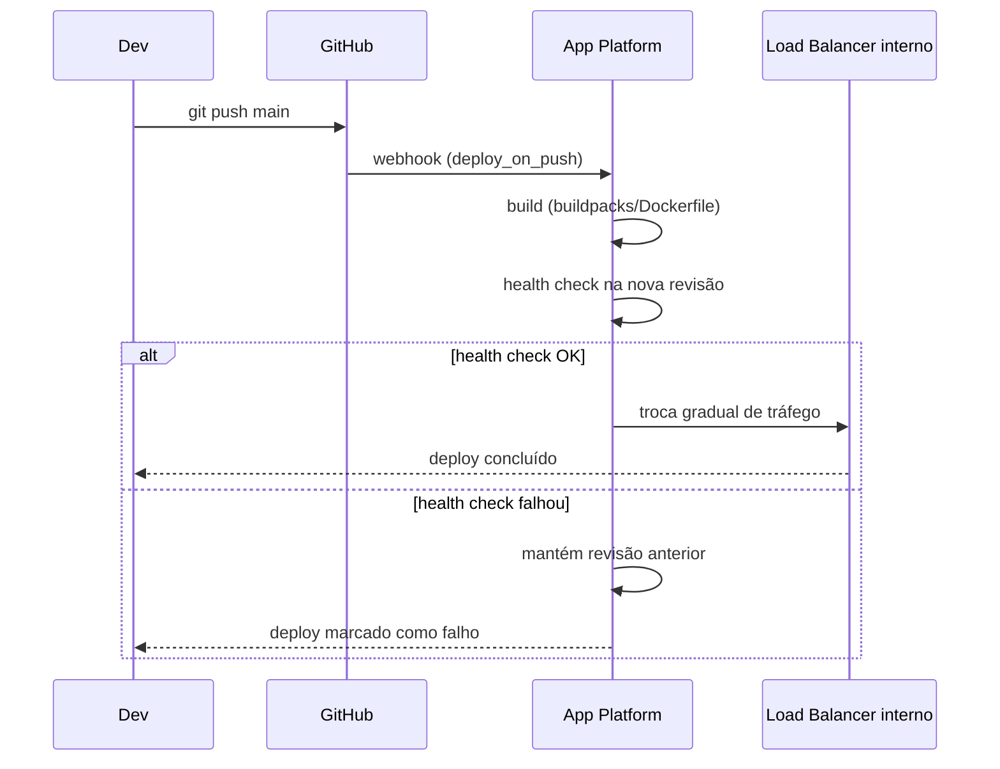

> [!abstract] TL;DR
> App Platform é o PaaS git-connected do DigitalOcean: você aponta pra um repositório, o DO detecta a stack, builda (buildpacks ou Dockerfile) e faz deploy — sem você tocar em load balancer, target group ou task definition. Enquanto a AWS te dá dezenas de primitivos pra montar essa experiência (ECS + ALB + CodePipeline, ou Lambda + API Gateway), o DO te entrega a experiência pronta. É a prova mais nítida da tese do galho: o DO vende curadoria, não amplitude. E tem teto — quando o app cresce além de "web + worker + banco", você desce pra Droplets ou DOKS.

## O problema que o App Platform resolve

Pensa no que você precisa decidir pra colocar uma aplicação web no ar na AWS "do jeito certo": qual serviço de compute (EC2? ECS? Fargate? Lambda?), como fazer build da imagem, onde guardar a imagem (ECR), como configurar o load balancer, como fazer rolling deploy sem downtime, onde ficam os certificados TLS, como automatizar tudo isso num pipeline. Cada uma dessas perguntas tem resposta certa — mas são *seis perguntas*. O galho 12 (Containers gerenciados) já te mostrou ECS/Fargate a fundo: task definitions, service discovery, scaling policies. É poderoso, e é trabalho.

O App Platform começa de uma pergunta só: "qual repositório?" Você conecta o GitHub (ou GitLab), aponta pra uma branch, e o resto — build, imagem, load balancer, TLS, deploy — é decisão do DO, não sua. Isso não é "AWS com menos features". É um produto desenhado pra um público diferente: o time que quer *rodar* a aplicação, não operar a plataforma que roda a aplicação.

O nome revela a intenção. Não é "Container Service" nem "Compute Service" — é *App* Platform. A unidade de trabalho não é uma instância ou um container: é a aplicação inteira, com todos os componentes que ela precisa (web, worker, job, banco) descritos junto.

Vale reler com essa lente a nota [[03-Dominios/Tecnologia/Cloud/12 - Containers gerenciados/04 - App Platform e o caminho PaaS|App Platform e o caminho PaaS]] do galho 12 — ela introduziu o serviço como *uma alternativa entre outras* dentro do panorama de containers gerenciados (ao lado de ECS, Fargate e Kubernetes). Aqui a lente inverte: dentro do universo DO, o App Platform não é "uma opção a mais" — é *o* caminho default, o primeiro lugar pra onde qualquer app nova é empurrada, do mesmo jeito que Lambda e o modelo event-driven são o caminho default da AWS moderna.

## O que é, de fato: PaaS git-connected

Mecanicamente, o fluxo é sempre o mesmo, não importa a stack:



Duas rotas de build:

- **Buildpacks** (Cloud Native Buildpacks, o mesmo padrão que a Heroku popularizou e que virou projeto CNCF): o DO olha pro repo, detecta a linguagem (Node, Python, Go, Ruby, PHP, Java, `.NET`, Hugo, static HTML) e aplica um builder pronto. Você não escreve Dockerfile nenhum — só declara `run_command` se o default não servir.
- **Dockerfile**: se o repo tem um `Dockerfile` na raiz (ou em `dockerfile_path` customizado), o App Platform builda a partir dele. Isso te dá controle total sobre o ambiente, ao custo de manter o Dockerfile você mesmo.

Um Dockerfile mínimo que o App Platform builda sem drama (Node/Express, por exemplo):

```dockerfile
FROM node:20-slim
WORKDIR /app
COPY package*.json ./
RUN npm ci --omit=dev
COPY . .
EXPOSE 8080
CMD ["node", "server.js"]
```

Repare: nenhuma linha aqui é "DigitalOcean-specific". É um Dockerfile comum — o App Platform não exige extensões proprietárias, ele só builda e injeta as variáveis de ambiente/porta que o app spec declarar.

## O app spec: a aplicação inteira em um YAML

O app spec é o coração declarativo do App Platform — o equivalente ao `docker-compose.yml` ou ao Terraform, mas escopado só pra sua aplicação. Ele descreve *todos* os componentes que compõem o app: serviços web, workers, jobs, sites estáticos e bancos atrelados, num único arquivo.

```yaml
# app.yaml — App Platform spec
name: pedidos-api
region: nyc

# services: componentes que expõem HTTP publicamente
services:
  - name: api
    github:
      repo: minha-org/pedidos-api
      branch: main
      deploy_on_push: true          # git push → deploy automático
    dockerfile_path: Dockerfile
    http_port: 8080
    instance_size_slug: apps-s-1vcpu-1gb
    instance_count: 2               # HA mínima recomendada = 2
    health_check:
      http_path: /healthz
      initial_delay_seconds: 10
      period_seconds: 10
    routes:
      - path: /
    envs:
      - key: DATABASE_URL
        scope: RUN_TIME
        value: ${db.DATABASE_URL}   # referência ao banco declarado abaixo

# workers: mesma lógica de deploy, sem endpoint HTTP público
workers:
  - name: fila-emails
    github:
      repo: minha-org/pedidos-api
      branch: main
    dockerfile_path: worker.Dockerfile
    instance_size_slug: apps-s-1vcpu-1gb
    instance_count: 1

# jobs: roda uma vez (ou por schedule), não fica residente
jobs:
  - name: migracoes
    github:
      repo: minha-org/pedidos-api
      branch: main
    dockerfile_path: Dockerfile
    run_command: npm run migrate
    kind: PRE_DEPLOY               # roda antes de cada deploy do serviço

# static_sites: front-end servido direto do CDN do DO
static_sites:
  - name: painel
    github:
      repo: minha-org/pedidos-painel
      branch: main
    build_command: npm run build
    output_dir: dist

# databases: banco gerenciado atrelado ao app (dev database ou produção)
databases:
  - name: db
    engine: PG
    production: true
```

> [!info] Verificado em 2026-07-24 nos docs oficiais (`docs.digitalocean.com/products/app-platform`)
> Campos confirmados na documentação: top-level `services` / `workers` / `jobs` / `static_sites` / `databases` / `domains` / `envs` / `alerts` / `ingress` / `vpc`; dentro de `services`, fonte via `github` (`repo`, `branch`, `deploy_on_push`) ou `image`/`git`, build via `dockerfile_path` (senão buildpacks + `environment_slug`), `run_command`, `http_port` (default 8080), `instance_size_slug`, `instance_count`, `health_check` e `liveness_health_check`. Confira o app spec de referência antes de copiar campos pra produção — a API evolui.

Note a linha `value: ${db.DATABASE_URL}` — o App Platform injeta credenciais de bancos atrelados como variáveis interpoladas, sem você jamais copiar host/senha manualmente. Isso é o mesmo espírito de "menos passos manuais" que a nota 02 (catálogo enxuto) descreveu para o Managed Databases do DO.

## doctl: o mesmo spec, linha de comando

Assim como a AWS tem o `aws` CLI, o DO tem o `doctl`. Criar um app a partir do spec acima:

```bash
# autentica (uma vez)
doctl auth init

# cria o app a partir do app.yaml
doctl apps create --spec app.yaml

# lista apps e pega o ID
doctl apps list

# atualiza um app existente com um spec novo
doctl apps update <app-id> --spec app.yaml

# acompanha o deploy em andamento
doctl apps list-deployments <app-id>

# rollback pra uma revisão anterior (sem editar spec)
doctl apps create-deployment <app-id> --force-rebuild=false
```

Na prática, boa parte dos times nem usa `doctl apps create` diretamente — configuram o repo pela interface web uma vez (o DO gera o app spec sozinho a partir de defaults detectados), e daí em diante é só `git push`. O `doctl` entra quando você quer versionar o spec no repo (infra-as-code leve) ou automatizar em CI.

## Escalonamento, health checks, deploy e domínio

**Escalonamento**: `instance_count` fixo, ou autoscaling baseado em CPU (para componentes com CPU dedicada) ou em número de requisições. Cada revisão de deploy é testada via `health_check` antes de receber tráfego — se a nova revisão não passa no health check, o App Platform mantém a revisão anterior no ar e marca o deploy como falho. Isso é rollback automático embutido, sem você escrever pipeline nenhum pra isso (compare com o esforço equivalente em ECS: circuit breaker de deployment, que existe mas você precisa configurar).

**Domínios e TLS**: todo app ganha um subdomínio `*.ondigitalocean.app` com HTTPS automático no primeiro deploy. Domínio customizado é adicionar o registro DNS e declarar em `domains:` no spec — o certificado TLS (Let's Encrypt, renovado automaticamente) é provisionado pelo próprio App Platform, sem ACM, sem CloudFront, sem passo separado.



## O modelo mental "Heroku-like"

Se você já usou Heroku (ou lembra da fama dela nos anos 2010), o App Platform vai parecer familiar de propósito: `git push` → build automático → app no ar, com buildpacks como mecanismo de detecção de stack. Não é coincidência — Cloud Native Buildpacks é o sucessor open-source direto dos buildpacks que a Heroku inventou, hoje mantido como projeto CNCF, e tanto DO quanto outras plataformas (Google Cloud Run, Fly.io) usam a mesma spec.

A AWS *sabe* que esse modelo mental é valioso — é por isso que ela lançou o App Runner, tentando entregar exatamente essa experiência ("conecta o repo, a gente cuida do resto") dentro do ecossistema AWS. Mas o App Runner nunca virou a espinha da AWS do jeito que o App Platform é a espinha do DO — a galho 21 nota 05 (serverless AWS) tratou App Runner como coadjuvante do portfólio compute, não como a porta de entrada default.

> [!info] Verificado em 2026-07-24 (`docs.aws.amazon.com/apprunner`)
> "AWS App Runner is no longer open to new customers. Existing customers can continue to use the service as normal." A AWS fechou o App Runner para contas novas — o próprio fabricante do serviço mais parecido com o App Platform recuou da aposta. Isso reforça a tese do galho: coerência de plataforma git-connected não é o forte histórico da AWS, é o forte do DO.

O Elastic Beanstalk (mais antigo, ainda ativo) é a outra tentativa da AWS nesse território — mas Beanstalk é mais "wrapper em cima de EC2 + Auto Scaling + ELB que você ainda pode abrir o capô e mexer" do que um PaaS opinativo fim-a-fim. Nenhum dos dois virou o caminho idiomático de deploy na AWS, ao contrário do App Platform no DO.

> [!tip] Assista: A Heroku Alternative - DigitalOcean App Platform
> **Canal:** DigitalOcean | **Duração:** ~16min | **Idioma:** EN
>
> Vídeo oficial do próprio DO nomeando a comparação que esta nota faz na cara: App Platform como sucessor espiritual do Heroku, mostrando na prática o fluxo de migrar um app Heroku pro App Platform sem reescrever a arquitetura.
> Trecho de destaque [01:48]: *"deploy and migrate our existing Heroku apps to digital ocean's app platform"*
>
> 🎬 [Assistir no YouTube](https://www.youtube.com/watch?v=NPRT8LfAQ90)

## Tamanhos de instância e o que custam

O `instance_size_slug` do app spec escolhe o tier de compute — e aqui a nota 03 (pricing previsível) se conecta direto: você sabe o custo mensal *antes* de fazer deploy, sem simular uma fatura.

| Slug | vCPU | RAM | Tipo | Preço/mês |
|---|---|---|---|---|
| `basic-xxs` | 1 compartilhado | 512 MiB | shared | $5 |
| `basic-xs` | 1 compartilhado | 1 GiB | shared | $10 |
| `basic-s` | 1 compartilhado | 2 GiB | shared | $20 |
| `basic-m` | 2 compartilhados | 4 GiB | shared | $40 |
| `professional-xs` | 1 compartilhado | 1 GiB | shared | $12 |
| `professional-s` | 1 compartilhado | 2 GiB | shared | $25 |
| `professional-1l` | 1 dedicado | 4 GiB | dedicado | $75 |
| `professional-l` | 2 dedicados | 8 GiB | dedicado | $150 |
| `professional-xl` | 4 dedicados | 16 GiB | dedicado | $300 |

> [!info] Verificado em 2026-07-24 (`docs.digitalocean.com/products/app-platform/details/pricing/`)
> Os docs rotulam essa tabela como "Legacy Plans" — os slugs `apps-s-1vcpu-1gb` usados nos exemplos de app spec ao longo desta nota seguem uma nomenclatura mais nova (`apps-<tier>-<vcpu>vcpu-<ram>gb`). O DO está em transição de esquema de slugs; confira o slug vigente na página de pricing antes de fixar num app spec de produção. Autoscaling por CPU só está disponível em instâncias com CPU *dedicada* (tier professional `-l`/`-xl` pra cima), não nas compartilhadas.
>
> Development databases (banco de dev atrelado ao app, não redundante) custam $7/mês por 512 MiB — outra âncora de preço previsível, no mesmo espírito da nota 03. Sites estáticos têm tier gratuito para até 3 apps só-estáticos; a partir daí, $3/mês por app adicional.

## Quando o App Platform basta

Ele basta enquanto sua arquitetura cabe no vocabulário do spec: um ou mais serviços web, workers de background, jobs pontuais (migração, seed), um site estático, e um banco gerenciado atrelado. Isso cobre a esmagadora maioria de SaaS de estágio inicial a médio — API + worker de fila + Postgres é o esqueleto de metade dos produtos que existem.

Casos concretos onde App Platform é a escolha certa:

- MVP ou produto em fase de validação: zero tempo gasto em infra, 100% em produto.
- API + worker de background (emails, processamento assíncrono) + Postgres gerenciado — o trio clássico.
- Front-end estático (site institucional, painel React/Vue) com deploy automático a cada push.
- Times pequenos sem SRE dedicado: ninguém precisa saber o que é um target group.

Os sinais concretos de que chegou a hora de descer pra Droplets ou pra Kubernetes gerenciado (DOKS, coberto na nota [[03-Dominios/Tecnologia/Cloud/12 - Containers gerenciados/05 - Kubernetes gerenciado de raspão|Kubernetes gerenciado de raspão]] do galho 12 em contexto AWS/EKS) não são "o app cresceu" em abstrato — são coisas específicas que o vocabulário do app spec simplesmente não expressa:

- Você precisa de múltiplos serviços coordenados com dependências de deploy explícitas (serviço B só sobe depois que A está saudável, com rollback conjunto) — o App Platform trata cada componente como independente.
- Você precisa de sidecars (proxy de observabilidade, agente de segurança rodando junto do container principal) — não existe conceito de pod multi-container aqui.
- Você precisa de rede privada avançada (VPC peering entre múltiplas contas, controle fino de security groups por porta/protocolo) além do VPC único que o App Platform oferece.
- Seu tráfego se aproxima dos tetos de instância (250 containers fixos / 100 em autoscaling por requisição) e você precisa de headroom real, não just-in-case.

## Traduzindo pra Azure e GCP (só nomenclatura, não hands-on)

| Conceito | AWS | DigitalOcean | Azure | GCP |
|---|---|---|---|---|
| PaaS git-connected | App Runner (fechado p/ novos clientes) | App Platform | Azure App Service | Cloud Run |
| PaaS "abre o capô" (EC2 gerenciado) | Elastic Beanstalk | — (sem equivalente direto) | Azure App Service (plano dedicado) | App Engine (flex) |
| Deploy source-to-container | CodeBuild + ECR + ECS | Build nativo do App Platform | Azure Container Apps | Cloud Build + Cloud Run |
| Job pontual/agendado | Fargate task agendada via EventBridge | `jobs` no app spec | Azure Container Apps Jobs | Cloud Run Jobs |
| Site estático + CDN | S3 + CloudFront | `static_sites` no App Platform | Azure Static Web Apps | Firebase Hosting |

## Caso prático: saindo do Fargate pro App Platform

Vale ver o contraste na prática. Se você já rodou um serviço em ECS/Fargate (como a nota 03 do galho 12 detalhou), a checklist de deploy costumava ser assim:

1. Escrever/versionar a task definition (CPU, memória, imagem, variáveis de ambiente, mapeamento de portas).
2. Publicar a imagem no ECR (`docker build` → `docker push`).
3. Criar/atualizar o ECS Service, apontando pra task definition nova.
4. Configurar (ou já ter configurado) o Application Load Balancer e o target group.
5. Definir a deployment configuration (mínimo saudável, circuit breaker) pra evitar downtime.
6. Automatizar os passos 1-5 num pipeline (CodePipeline/CodeBuild ou GitHub Actions chamando a AWS CLI).

A mesma aplicação, movendo pro App Platform, reduz pra:

1. Escrever o app spec (uma vez) com `dockerfile_path` e `http_port`.
2. `doctl apps create --spec app.yaml` (uma vez).
3. `git push` daí em diante.

Os passos 2 a 5 do fluxo ECS — ECR, ALB, target group, deployment config — não desaparecem: o App Platform os executa *por baixo*, de forma implícita. Isso é exatamente a troca que a nota 01 deste galho (filosofia da simplicidade) descreveu em abstrato: você não ganha controle nenhum a mais rodando no App Platform, você abre mão de controle em troca de não precisar exercê-lo.

## As armadilhas

> [!warning] "App Platform escala infinito" — não escala
> Existe teto documentado: 250 containers por app em escalonamento fixo ou autoscaling por CPU, e 100 instâncias no máximo para autoscaling por requisição. Pra maioria dos produtos isso nunca vira problema — mas se seu app é candidato a tráfego de escala AWS-grande (picos multi-milhão de requisições, fan-out geográfico complexo), o App Platform não foi desenhado pra esse teto, e você vai descobrir o limite em produção se não pesquisar antes.

> [!warning] Perda de controle é o preço da simplicidade
> O App Platform não te dá acesso a rede privada avançada (peering complexo, múltiplas VPCs), não te deixa escolher tipo de load balancer, não expõe configuração fina de scaling que o Kubernetes exporia. Se seu app precisa de sidecars, service mesh, ou orquestração de múltiplos serviços com dependências de deploy coreografadas, você já passou do ponto em que "conectar o repo" resolve — é hora de DOKS (Kubernetes gerenciado do DO) ou Droplets com orquestração própria.

> [!warning] Build via buildpacks pode surpreender em stacks incomuns
> Buildpacks detectam bem as stacks mainstream (Node, Python, Go, Ruby, PHP, Java, .NET, Hugo/static). Stack exótica ou pipeline de build customizado (multi-stage complexo, dependências de sistema fora do padrão) geralmente força a migração pra `dockerfile_path` — o que é simples de fazer, mas é bom saber que a mágica automática tem limite antes de apostar o projeto nela.

## O que vem a seguir

O App Platform resolve bem o retângulo "web + worker + job + banco". A próxima nota deste galho traça a linha divisória com mais precisão: quando o catálogo enxuto do DO — App Platform incluído — de fato basta pra sustentar um produto em produção, e em que sinais concretos (não em medo genérico de vendor lock-in) você reconhece a hora de subir a complexidade pra AWS, seja migrando de vez ou operando os dois em paralelo.

## Fontes

- DigitalOcean — App Platform overview: https://docs.digitalocean.com/products/app-platform/
- DigitalOcean — App Spec Reference: https://docs.digitalocean.com/products/app-platform/reference/app-spec/
- DigitalOcean — App Platform limits: https://docs.digitalocean.com/products/app-platform/details/limits/
- DigitalOcean — doctl apps command reference: https://docs.digitalocean.com/reference/doctl/reference/apps/
- AWS — What is AWS App Runner: https://docs.aws.amazon.com/apprunner/latest/dg/what-is-apprunner.html
- AWS — App Runner availability change: https://docs.aws.amazon.com/apprunner/latest/dg/apprunner-availability-change.html
- AWS — Elastic Beanstalk overview: https://docs.aws.amazon.com/elasticbeanstalk/latest/dg/Welcome.html
- Cloud Native Buildpacks: https://buildpacks.io/

