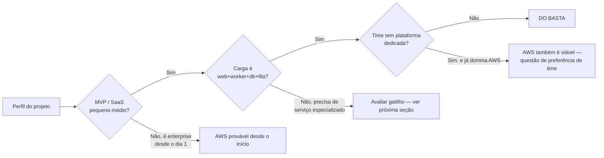
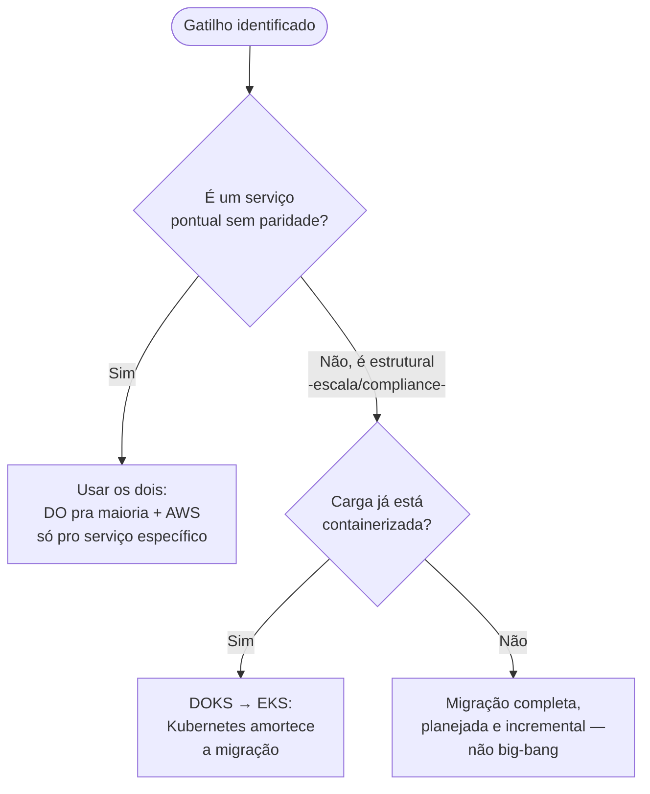

> [!abstract] TL;DR
> "DO vs AWS" não é uma questão de fé — é uma questão de forma. O DO basta (e sobra) para a imensa maioria dos SaaS pequenos e médios, MVPs e side-projects: catálogo enxuto, pricing previsível, DX que não exige um time de plataforma. A hora de crescer pra AWS chega quando um GATILHO OBJETIVO aparece — um serviço que o DO simplesmente não tem, uma exigência de escala/multi-region que ultrapassa a geografia do DO, um requisito de compliance corporativo, ou uma escala de custo em que otimização agressiva (spot, RIs, Savings Plans) começa a valer o esforço. Fora desses gatilhos, migrar por hype é trocar simplicidade testada por complexidade não paga.

## O problema: a pergunta errada

Existe uma conversa que se repete em quase todo time que já rodou os dois provedores: "a gente devia migrar pra AWS?" Ela quase sempre chega errada — como se fosse uma escolha de identidade ("somos um time AWS" ou "somos um time DO"), não uma escolha de engenharia. E escolha de identidade não tem critério de parada: sempre dá pra justificar migrar, porque a AWS sempre vai ter *algo* que o DO não tem.

A pergunta certa é outra: **o problema que eu tenho hoje precisa de alguma coisa que o DO não oferece?** Se a resposta é não, migrar é custo puro — semanas de engenharia, uma curva de aprendizado nova, uma superfície de configuração que passa de dezenas de produtos pra centenas — sem ganho correspondente. Se a resposta é sim, a pergunta vira "eu preciso migrar tudo, ou só essa peça?" — e aí o meio-termo (que a última seção desta nota cobre) costuma ser mais barato que a migração completa.

Esta nota fecha o galho assumindo uma posição: depois de quatro notas mostrando onde o DO brilha — filosofia da simplicidade, catálogo enxuto, pricing previsível, App Platform como espinha —, é hora de ser honesto sobre onde ele para. Não é venda de nenhum dos dois lados. É mapa de decisão.

> [!info] Ancoragem
> Esta nota assume produção real: o autor deste vault opera cargas em produção no DigitalOcean há aproximadamente dois anos. O que segue não é teoria de blog — é o que efetivamente segurou (e o que efetivamente não teria segurado) nesse tempo.

## O perfil onde o DO basta — e sobra

Recapitulando o que as notas anteriores deste galho já estabeleceram peça por peça: o DO ganha em pricing sem sustos (droplets e managed databases com preço fixo por hora/mês, sem a superfície combinatória de SKUs da AWS — ver a nota "03 - Pricing previsível como diferencial" deste galho), em DX (App Platform abstrai deploy, TLS, scaling e observabilidade básica num único produto — nota "04 - App Platform como espinha"), e em superfície cognitiva (o catálogo cabe na cabeça de uma pessoa — nota "02 - O catálogo enxuto do DO"). Esses três eixos convergem num perfil bem definido de time que se beneficia deles:

**Estágio do produto.** MVP, side-project, SaaS em fase de achar product-market fit. Nesse estágio a variável que mais importa não é "quanto essa arquitetura escala daqui a três anos" — é "quantas horas de engenharia eu gasto hoje em infraestrutura em vez de em produto". Cada hora configurando IAM policies da AWS é uma hora que não vai pra feature. O DO devolve essas horas.

**Forma da carga.** Web + worker + banco relacional + fila simples + object storage — o padrão que 80% dos SaaS B2B e B2C realmente têm. Não é peso pejorativo: é reconhecer que a maioria dos produtos não é a Netflix, não precisa de service mesh, não tem petabytes de dados de treinamento de ML pra mover. Esse padrão o App Platform + Managed Databases + Spaces cobre inteiro, sem sair do DO.

**Forma do time.** Time pequeno (1 a ~15 engenheiros), sem plataforma dedicada — ou seja, sem alguém cujo trabalho em tempo integral é "ser o especialista em nuvem". Quando não existe essa função, cada primitivo extra da AWS (mais um serviço, mais um jeito de fazer a mesma coisa) é dívida cognitiva que ninguém paga de propósito. O DO estruturalmente limita essa dívida: o catálogo pequeno é uma feature, não uma limitação — força a decisão a ser rápida porque as opções são poucas.

**Sensibilidade a surpresa no budget.** Startups em estágio inicial, agências cobrando projeto fechado de cliente, produtos com margem apertada — todos têm uma coisa em comum: uma fatura de nuvem que varia 40% mês a mês por causa de egress não previsto, ou de um serviço mal dimensionado, é um problema real, não um detalhe. O modelo de preço fixo do DO elimina essa classe inteira de risco financeiro.

Note o nó `F`: ter plataforma dedicada e já dominar AWS não é gatilho de migração — é apenas um contexto em que a AWS deixa de custar a fricção que custaria pra um time sem essa expertise. A decisão nesse caso vira preferência informada, não necessidade.

> [!tip] Assista: Are cloud providers like Digital Ocean better than AWS?
> **Canal:** Code The Web | **Duração:** ~15min | **Idioma:** EN
>
> Um dev conta a própria jornada saindo do "AWS por padrão" pra questionar quando isso realmente vale a pena — e chega em alternativas como o DigitalOcean pelo mesmo caminho desta nota: pricing mais simples de entender, sem o catálogo de 200+ produtos como ruído.
> Trecho de destaque [00:26]: *"times where AWS is not the right way to go and some alternatives that you can use instead"*
>
> 🎬 [Assistir no YouTube](https://www.youtube.com/watch?v=63p6kkoBjuw)

## Os gatilhos objetivos — não vibe, sinal concreto

Migrar de provedor "porque a AWS é mais robusta" é vibe. Migrar porque um destes quatro sinais apareceu é engenharia. Cada gatilho abaixo é uma pergunta que se responde com sim/não a partir de um requisito real do produto — não de uma sensação de que "deveríamos estar num provedor mais sério".

### Gatilho 1 — Falta um serviço que o DO não tem

O catálogo enxuto do DO (nota 02 deste galho) é uma escolha deliberada: cobre o essencial e para aí. Isso significa que existem classes inteiras de problema pras quais o DO não tem produto gerenciado nenhum:

- **Arquiteturas event-driven maduras.** A AWS tem EventBridge (roteamento de eventos com regras e schema registry), SNS/SQS como dupla pub/sub + fila desacoplada de padrão de produção, e Step Functions para orquestração de workflows — o conjunto inteiro que a nota "15 - Arquiteturas serverless e event-driven" deste domínio detalha. O DO tem fila via Managed Redis/Valkey e mensageria básica dentro do App Platform, mas não tem um equivalente gerenciado ao EventBridge nem a um barramento de eventos com contrato de schema. Se a arquitetura do produto é genuinamente orientada a eventos — múltiplos serviços reagindo a um fluxo de eventos de domínio, com replay, DLQ madura e roteamento por regra — esse é um "não" estrutural do DO, não uma limitação de configuração.
- **Data lake e analytics em escala.** S3 + Glue + Athena + Redshift formam um pipeline de dados que vai de object storage bruto a data warehouse consultável via SQL federado. O DO tem Spaces (object storage compatível com S3) e Managed PostgreSQL, mas não tem um Glue (catálogo de dados/ETL serverless) nem um Athena (query engine serverless sobre object storage) nativos.
- **ML gerenciado.** SageMaker cobre o ciclo inteiro — treino, tuning, deploy, monitoramento de modelo — como plataforma dedicada. O DO tem GPU Droplets (máquinas com GPU pra quem quer rodar workload de ML por conta própria) e um serviço de "GenAI Platform" mais recente e mais restrito em escopo; não tem uma plataforma de MLOps completa equivalente ao SageMaker.
- **Serverless NoSQL de alta escala.** DynamoDB é banco chave-valor/documento totalmente gerenciado, com escala automática por partição e sem provisionamento de capacidade — um serviço fundamentalmente serverless. O DO não tem produto equivalente; o mais próximo é Managed Databases (PostgreSQL, MySQL, Redis/Valkey, MongoDB via parceiro), todos com modelo de provisionamento mais tradicional, não serverless-nativo no sentido do DynamoDB.

> [!warning] Sem paridade forçada
> É tentador simular esses serviços no DO com uma fila no Redis fazendo o papel de EventBridge, ou um cron rodando Athena-like queries num Postgres grande. Funciona até certo ponto, mas cada simulação é dívida técnica: código de infraestrutura que o time escreve e mantém, em vez de configuração de um serviço gerenciado. Se o produto genuinamente precisa da robustez do serviço nativo, simular é adiar o custo, não eliminá-lo.

### Gatilho 2 — Escala ou geografia além do que o DO oferece

Verificado em 2026-07-24: a AWS opera **39 regiões geográficas com 123 zonas de disponibilidade** no mundo. O DigitalOcean opera **15 datacenters em 12 regiões** — números de uma ordem de grandeza menor, e sem o conceito de múltiplas zonas de disponibilidade independentes dentro de cada região que a AWS oferece como padrão em praticamente toda região madura.

> [!info] Verificado 2026-07-24
> Contagem de regiões/AZs da AWS via `aws.amazon.com/about-aws/global-infrastructure`; contagem de datacenters do DO via `docs.digitalocean.com/platform/regional-availability`. Ambos os números crescem com o tempo — reconferir antes de usar em decisão real.

Isso importa concretamente pra dois cenários, ambos já cobertos em profundidade na nota "04 - Multi-region a fundo" do galho 20 (Resiliência e continuidade) deste domínio:

- **Latência global fina.** Se o produto precisa de presença em regiões específicas que o DO não cobre (grande parte da América Latina fora de dados servidos via CDN, Oriente Médio, várias regiões da Ásia além de Singapura e Bangalore), a AWS resolve por cobertura geográfica pura — o DO não tem o ponto de presença.
- **Disaster recovery multi-region sério.** Estratégias de DR como pilot light, warm standby ou multi-site ativo-ativo (a escala de RTO/RPO decrescente que a nota 03 do galho 20 mapeia) dependem de replicação entre regiões com controle fino de topologia de rede, peering entre VPCs de regiões diferentes, e serviços de banco com replicação cross-region nativa (Aurora Global Database, por exemplo). O DO tem menos regiões pra escolher e menos ferramentas nativas de replicação cross-region madura — o que não inviabiliza DR no DO, mas estreita as opções de topologia.

### Gatilho 3 — Compliance e exigência enterprise

O DO tem Teams com SSO, papéis de time e billing separado por organização — o suficiente pra colaboração de equipes pequenas e médias. O que ele não tem é o aparato de controle fino que compliance corporativo pesado exige: **AWS Organizations** com contas separadas por unidade de negócio e Service Control Policies aplicadas na raiz da hierarquia, **IAM** com granularidade de política por recurso/ação/condição (a "gramática" que as notas 03 a 06 do galho 04 — Identidade e acesso — detalham: como uma permissão é avaliada, roles e credenciais temporárias, least privilege, identidade entre contas e federação), certificações formais específicas de setor com escopo por serviço individual, e uma superfície de auditoria (CloudTrail, Config) desenhada para times de segurança dedicados.

Se o cliente do produto é um banco, uma seguradora, um hospital, ou qualquer organização que exige prova formal de segregação de contas e controle de acesso auditável linha a linha — esse é o momento em que a simplicidade do DO deixa de ser vantagem e vira lacuna. Não é que o DO seja inseguro; é que o aparato de *prova* de segurança que compliance enterprise exige tem profundidade que o DO não constrói pra esse público.

### Gatilho 4 — Otimização de custo agressiva em escala

Aqui a lógica se inverte em relação à nota 03 deste galho. Pricing fixo é vantagem quando a carga é pequena/média e previsibilidade importa mais que o último centavo. Mas em escala grande — milhares de instâncias, picos e vales de tráfego bem conhecidos, orçamento de engenharia dedicado a FinOps —, o jogo muda: a AWS oferece Spot Instances (capacidade ociosa com desconto profundo, pra carga tolerante a interrupção), Reserved Instances e Savings Plans (desconto por compromisso de uso, de 1 ou 3 anos), e um conjunto de ferramentas de alocação e otimização de custo (Cost Explorer, Compute Optimizer, Trusted Advisor) que a nota "04 - Otimização de custo" do galho 19 (FinOps) detalha. Nessa escala, o esforço de configurar e operar essas otimizações compensa — e o teto de economia possível supera o que o modelo fixo do DO consegue oferecer.

O ponto de inflexão não é um número universal de dólares por mês — é o ponto em que **o time tem capacidade de dedicar esforço de engenharia a otimização de custo E a carga tem escala suficiente pra esse esforço valer a pena**. Abaixo desse ponto, a simplicidade do preço fixo do DO ainda ganha: o esforço de configurar RIs e Savings Plans numa carga pequena consome mais tempo de engenheiro do que economiza em fatura.

## Tabela de sinais

| Sinal | Fica no DO | Hora de considerar AWS |
|---|---|---|
| Estágio do produto | MVP, side-project, SaaS pequeno/médio | Enterprise desde o dia 1, ou escala já grande |
| Forma da carga | Web + worker + banco relacional + fila simples | Event-driven maduro, data lake, ML em produção |
| Time | Sem plataforma dedicada | Tem/terá plataforma dedicada |
| Geografia | 1-3 regiões, dentro da cobertura do DO | Presença global fina, DR multi-region sério |
| Compliance | Sem exigência formal de auditoria por conta/ação | Certificação setorial, IAM granular exigido por cliente |
| Sensibilidade a custo | Preço previsível importa mais que o teto de economia | Escala grande + capacidade de FinOps dedicado |
| Serviço específico | Coberto pelo catálogo enxuto (droplet, DB gerenciado, Spaces, App Platform, Functions) | Exige serviço sem paridade no DO (ver Gatilho 1) |

## Casos práticos

Três cenários compostos — nenhum é um cliente real, são perfis genéricos que servem pra testar o framework contra situação concreta.

**Caso A — SaaS de gestão para pequenas clínicas.** Web app + API + Postgres + fila de e-mails transacionais + storage de anexos (PDFs de exame, imagens). 200 clínicas clientes, tráfego previsível, sem picos sazonais fortes, time de 4 engenheiros sem ninguém dedicado a infra. Rodando o framework: estágio pequeno-médio, carga é exatamente o padrão web+worker+db+storage, sem plataforma dedicada, geografia é um país só, sem exigência formal de certificação setorial ainda. Nenhum gatilho aceso. **Decisão: DO basta**, com App Platform + Managed PostgreSQL + Spaces cobrindo o produto inteiro — o mesmo padrão que a nota 04 deste galho detalhou.

**Caso B — Mesmo produto, dois anos depois, agora vendendo pra rede hospitalar.** O produto não mudou de forma — ainda é web+worker+db+storage — mas o cliente mudou: a rede hospitalar exige, em contrato, prova de segregação de acesso por unidade de negócio e trilha de auditoria linha a linha assinável para certificação do setor. Isso é o Gatilho 3 puro: nenhum outro gatilho está aceso (a carga continua pequena/média, a geografia não mudou, não há necessidade de serviço sem paridade). **Decisão: meio-termo** — não é preciso mover tudo. A estratégia mais barata é abrir uma conta AWS só pra reconstruir a camada de IAM/auditoria com Organizations + IAM granular, enquanto a carga de aplicação continua rodando no DO, com o tráfego de dados sensíveis passando pela camada nova. Migração completa só se o contrato exigir que a infraestrutura toda esteja sob o guarda-chuva de auditoria — o que costuma ser negociável.

**Caso C — Plataforma de analytics que ingere eventos de clique em tempo real de 50 milhões de usuários.** Aqui a forma do problema já não é o padrão web+worker+db: é ingestão de eventos em alto volume, pipeline de streaming, agregação em data warehouse consultável, e provavelmente um componente de ML pra scoring em tempo real. Dois gatilhos acesos ao mesmo tempo — Gatilho 1 (falta arquitetura event-driven madura e data lake) e, dependendo do volume, Gatilho 4 (escala grande o suficiente pra Spot/RIs valerem o esforço). **Decisão: AWS desde o desenho**, não como migração — o problema em si já nasce na forma que o catálogo enxuto do DO não cobre.

O padrão que os três casos revelam: a decisão nunca é sobre o provedor "ser melhor" em abstrato — é sobre o gatilho estar aceso ou não pra *aquele* produto, naquele estágio, com aquele cliente.

## Meio-termo: nem tudo é tudo-ou-nada

A decisão real raramente é binária. Três estratégias intermediárias cobrem a maioria dos casos em que um gatilho aparece sem justificar uma migração completa:

**Começar no DO e migrar depois.** É o caminho mais comum pra startup: validar o produto no DO, onde o custo de errar é baixo e a velocidade de iteração é alta, e migrar componentes específicos pra AWS conforme os gatilhos aparecem — não o produto inteiro de uma vez. Migração incremental (um serviço por vez, começando pelo que tem o gatilho mais forte) é sempre mais barata e menos arriscada que big-bang.

**Usar os dois ao mesmo tempo.** Nada impede rodar a maior parte da carga no DO (onde ela é barata e simples) e usar um serviço específico da AWS só pra cobrir o que o DO não tem — por exemplo, um pipeline de ML no SageMaker alimentado por dados que moram no DO, ou um fluxo de eventos que passa por EventBridge antes de voltar pro DO. Isso exige rede entre provedores (VPN site-to-site ou peering, egress de ambos os lados) e adiciona uma camada de complexidade operacional, mas evita reescrever tudo.

**Kubernetes como camada de portabilidade.** Se a carga já roda em containers orquestrados — DOKS no DigitalOcean, EKS na AWS —, boa parte da aplicação (os manifests, os Helm charts, a lógica de deploy) é portável entre os dois. Não é portabilidade total: coisas amarradas ao provedor (LoadBalancer específico, StorageClass, integração com IAM nativo) ainda precisam de adaptação. Mas o Kubernetes amortece o lock-in de aplicação o suficiente pra que migrar o cluster de DOKS pra EKS — ou operar os dois em paralelo — seja um projeto de semanas, não de meses. Esse tema — como pensar em portabilidade e multi-cloud como estratégia deliberada, não como acidente — é o assunto do próximo galho do domínio, que trata especificamente de portabilidade entre provedores.

> [!warning] O custo real de migrar
> Migração de provedor não é "trocar de fornecedor" — é reescrever integração com serviços gerenciados (cada chamada de SDK específica do provedor), retreinar o time, requalificar compliance, e frequentemente reconstruir observabilidade do zero. Trocar de provedor por hype — porque "todo mundo sério usa AWS" — sem um gatilho objetivo por trás é pagar esse custo real por um ganho que não existe. O teste honesto: se você não consegue apontar qual gatilho concreto da tabela acima está disparando, a resposta é "ainda não é hora".

## De relance: onde Azure e GCP encaixam nesse mapa

Este galho é deliberadamente DO ↔ AWS — os dois provedores que o vault trata com profundidade hands-on. Mas vale registrar, só como tradução de nomes, que o mesmo eixo "catálogo enxuto e previsível" vs "catálogo vasto e granular" se repete nos outros dois grandes provedores, cada um com sua própria versão dos serviços citados nesta nota:

| Conceito | AWS | Azure | GCP | DigitalOcean |
|---|---|---|---|---|
| Barramento de eventos | EventBridge | Event Grid | Eventarc | Sem equivalente nativo |
| Data warehouse serverless | Athena + Redshift | Synapse Analytics | BigQuery | Sem equivalente nativo |
| ML gerenciado (ciclo completo) | SageMaker | Azure Machine Learning | Vertex AI | GPU Droplets (infra crua) |
| NoSQL serverless | DynamoDB | Cosmos DB | Firestore / Bigtable | Sem equivalente nativo |
| Governança multi-conta | Organizations + SCPs | Management Groups + Azure Policy | Resource Manager + Org Policy | Teams (sem hierarquia de contas) |

O padrão se repete: os três hyperscalers (AWS, Azure, GCP) competem em profundidade de catálogo entre si; o DO compete em outro eixo inteiramente — simplicidade e previsibilidade — e por isso não tenta ter um produto pra cada linha dessa tabela.

## O que vem a seguir

Esta nota fecha a decisão de provedor com um framework, não com um veredito — porque o veredito certo depende do projeto, não da ideologia. A próxima nota deste galho é o capstone: pega a arquitetura de referência que atravessou o domínio inteiro (a mesma que os capstones dos blocos anteriores de Resiliência e FinOps otimizaram) e pensa como um arquiteto que escolheu o DO — quais decisões mudam, quais permanecem, e onde os gatilhos desta nota já estariam acesos nesse projeto específico.

## Fontes

- AWS Global Infrastructure — regiões e zonas de disponibilidade: https://aws.amazon.com/about-aws/global-infrastructure/
- DigitalOcean — Regional Availability: https://docs.digitalocean.com/platform/regional-availability/
- DigitalOcean — Teams (SSO, papéis, billing por organização): https://docs.digitalocean.com/platform/teams/
- DigitalOcean — Functions (FaaS, sem equivalente nativo a EventBridge/DynamoDB): https://docs.digitalocean.com/products/functions/
- AWS — EventBridge: https://docs.aws.amazon.com/eventbridge/
- AWS — DynamoDB: https://docs.aws.amazon.com/amazondynamodb/
- AWS — SageMaker: https://docs.aws.amazon.com/sagemaker/
- AWS — Organizations: https://docs.aws.amazon.com/organizations/

