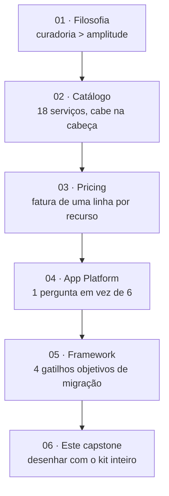
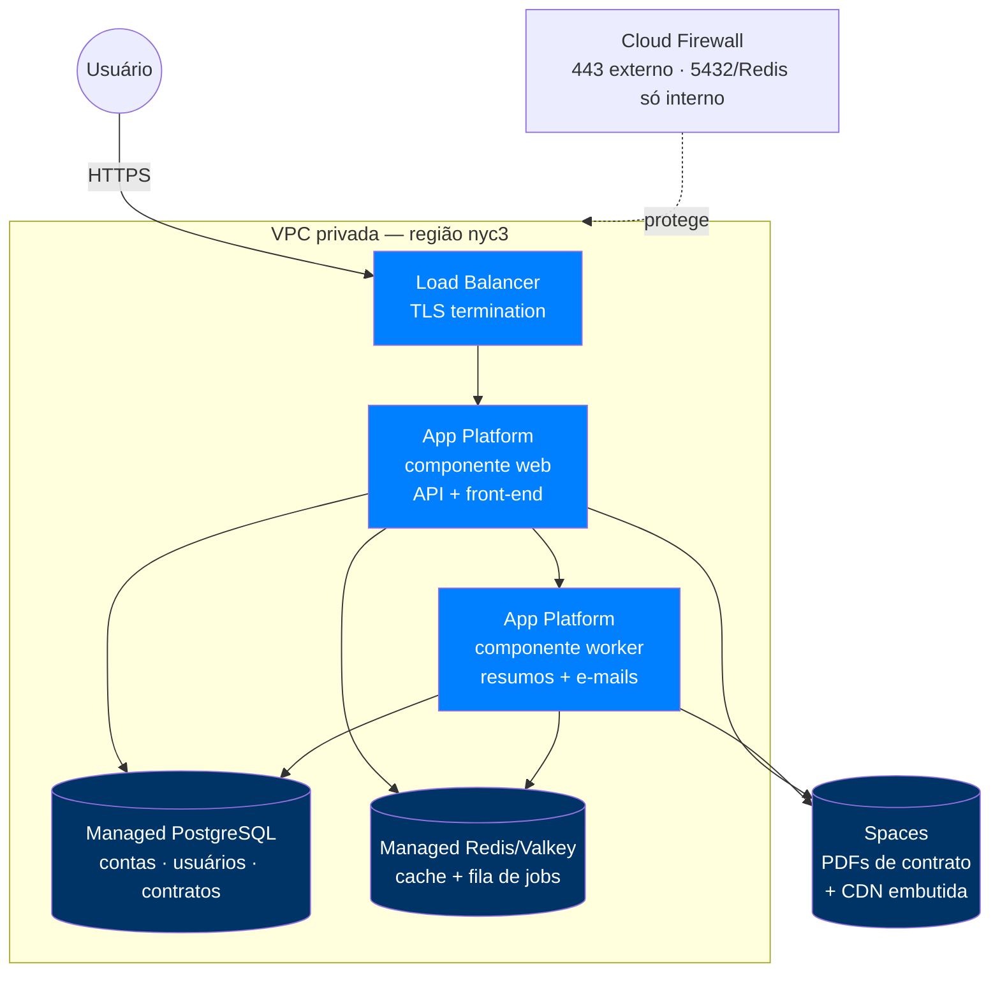
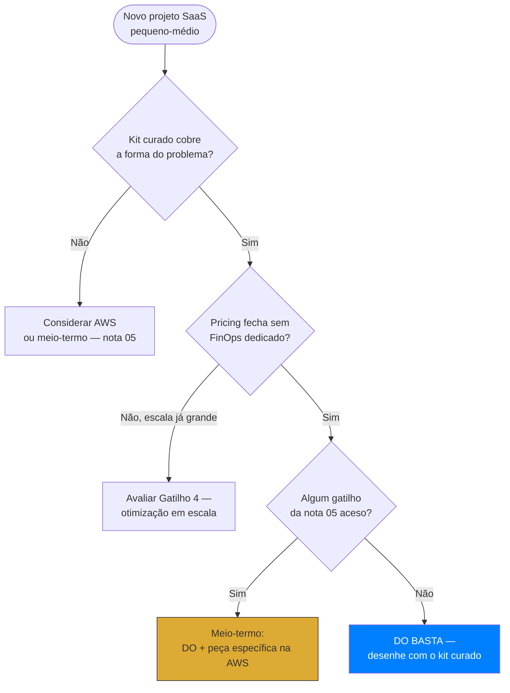
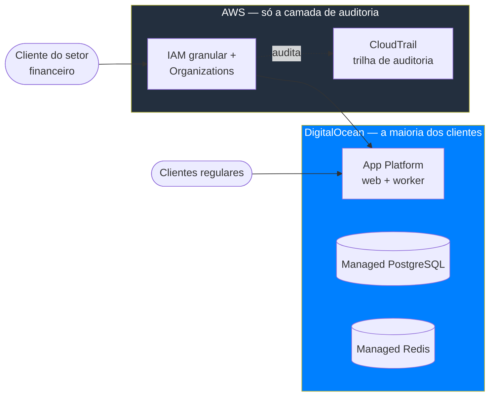

> [!abstract] TL;DR
> As cinco notas deste galho contaram a mesma história de cinco ângulos: curadoria em vez de amplitude (01), um catálogo que cabe numa tarde de leitura (02), pricing que você soma de cabeça (03), um PaaS que resolve o retângulo "web + worker + banco" sem você abrir o capô (04), e um framework de quatro gatilhos pra saber quando isso deixa de bastar (05). Este capstone amarra os cinco fios num exercício só: desenhar um SaaS B2B pequeno-médio do zero, inteiramente no DigitalOcean, e mostrar por que sete peças resolvem o que a AWS resolveria com o dobro ou o triplo de serviços — e o dobro ou triplo de decisões. Fecha o galho 22, não o domínio: o próximo passo do domínio é pensar em portabilidade entre provedores, não em mais um provedor.

## Recapitulando o arco: cinco notas, uma tese

Vale reler o arco antes de desenhar qualquer coisa, porque o capstone só faz sentido como síntese, não como nota nova.

A [[03-Dominios/Tecnologia/Cloud/22 - DigitalOcean a fundo/01 - A filosofia da simplicidade|nota 01]] estabeleceu a tese-mãe: a DigitalOcean nasceu de gente que passou uma década respondendo ticket de suporte de infraestrutura, e construiu um produto que decide por você — um storage, um jeito de fazer deploy gerenciado, um jeito de fazer rede — em vez de te entregar o catálogo de opções e a responsabilidade de escolher. Isso não é limitação técnica, é aposta de produto: a restrição bem escolhida é, ela mesma, um produto.

A [[03-Dominios/Tecnologia/Cloud/22 - DigitalOcean a fundo/02 - O catálogo enxuto do DO|nota 02]] tirou essa tese do abstrato e desenhou o mapa: dezoito serviços contáveis nos dedos de duas mãos, cobrindo compute, storage, dados, rede, borda e observabilidade básica — com paridade completa em boa parte, parcial em algumas peças (Functions, DNS, CDN, Monitoring), e ausência honesta em outras (orquestração de workflow, identidade federada, data lake, barramento de eventos maduro, NoSQL serverless, file storage tipo NFS).

A [[03-Dominios/Tecnologia/Cloud/22 - DigitalOcean a fundo/03 - Pricing previsível como diferencial|nota 03]] mostrou onde essa curadoria vira vantagem econômica real: menos peças móveis no catálogo produz menos peças móveis na fatura. Um Droplet, um Managed Database, um plano de Spaces — cada um com preço de tabela fixo, banda agregada num pool de conta, sem a granularidade combinatória (IOPS, egress por destino, cross-AZ, NAT Gateway por hora e por GB) que torna a fatura AWS um exercício de instrumentação.

A [[03-Dominios/Tecnologia/Cloud/22 - DigitalOcean a fundo/04 - App Platform como espinha|nota 04]] desceu ao produto que mais concretiza essa filosofia: App Platform resolve deploy, build, TLS, scaling e rollback com uma pergunta só — "qual repositório?" — em vez das seis perguntas que ECS/Fargate exigem. É a espinha do DO porque é o primeiro lugar pra onde qualquer app nova é empurrada.

A [[03-Dominios/Tecnologia/Cloud/22 - DigitalOcean a fundo/05 - Quando o DO basta e quando cresce pra AWS|nota 05]] fechou o arco com honestidade: quatro gatilhos objetivos — falta de serviço, escala/geografia, compliance enterprise, otimização de custo agressiva em escala — e não vibe, decidem quando migrar. Fora desses gatilhos, migrar por hype é trocar simplicidade testada por complexidade não paga.



## O caso trabalhado: um SaaS B2B pequeno-médio, do zero, no DO

Vamos usar o mesmo perfil que a nota 05 já validou no Caso A — um SaaS B2B com tráfego previsível, sem picos sazonais fortes, time pequeno sem plataforma dedicada. Para tornar o exercício mais completo que o Caso A (que cobriu só web+worker+db+storage), este capstone acrescenta duas peças que ainda não apareceram juntas nas notas anteriores: cache/fila com Managed Redis (Valkey) e a camada de rede explícita (Load Balancer, VPC, Cloud Firewall) — fechando o kit que qualquer SaaS de produção precisa, não só o esqueleto de aplicação.

**O produto**: uma plataforma de gestão de contratos para escritórios de advocacia pequenos — múltiplos usuários por conta, upload de PDFs de contrato, geração assíncrona de resumos e lembretes por e-mail, um plano free e um plano pago por assento. Tráfego moderado e previsível: picos leves no início do mês (renovação de assinatura), sem sazonalidade extrema.

### As sete peças e por que cada uma

1. **App Platform — componente `web`**: a API REST + o front-end (se for SSR/Next.js, o mesmo componente; se for SPA separada, um `static_sites` adicional). Resolve build, deploy, TLS automático em `*.ondigitalocean.app` (ou domínio próprio), health check e rollback sem você tocar em load balancer nenhum na camada de aplicação.
2. **App Platform — componente `worker`**: processa fila de geração de resumo de contrato (chamada a um modelo de IA ou pipeline de parsing) e envio de e-mails transacionais. Mesmo app spec, componente `workers`, escalando independente do `web`.
3. **Managed PostgreSQL**: dados relacionais — contas, usuários, contratos, assinaturas. HA, backup automático e patching gerenciado, o mesmo modelo mental do [[03-Dominios/Tecnologia/Cloud/09 - Bancos gerenciados/index|galho 09]], só que sem você provisionar réplica ou configurar failover manualmente.
4. **Spaces**: armazena os PDFs de contrato enviados pelos usuários, com CDN embutida na frente pra servir anexos e assets estáticos rápido, sem CloudFront separado.
5. **Managed Redis (Valkey)**: duas funções ao mesmo tempo — cache de sessão/consulta frequente (reduz carga no Postgres) e backend de fila para os jobs que o `worker` consome (geração de resumo, envio de e-mail). Um serviço, dois papéis — o mesmo espírito de "uma peça cobre o que a AWS cobriria com duas ou três" que a nota 02 já mapeou.
6. **Load Balancer + VPC + Cloud Firewall**: a camada de rede. Load Balancer na frente do componente `web` (o App Platform já provisiona um internamente para tráfego HTTP padrão, mas cenários com múltiplos serviços, WebSocket persistente ou necessidade de IP dedicado justificam um Load Balancer explícito); VPC isola Postgres, Redis e os componentes de App Platform numa rede privada por região, sem tráfego de banco de dados exposto à internet; Cloud Firewall restringe quem fala com quem — só o Load Balancer aceita tráfego externo na porta 443, só os componentes de app falam com Postgres na porta 5432 e com Redis na porta padrão.



### Por que sete peças bastam

Repare no que não apareceu neste diagrama: nenhum API Gateway separado (o Load Balancer + App Platform cobrem isso), nenhum serviço de fila dedicado tipo SQS (Redis faz o papel — para o volume desse produto, uma fila baseada em lista/stream do Valkey é suficiente; não é o desenho que você escolheria pra throughput de milhões de mensagens/segundo, mas está bem dentro do que um SaaS de contratos jurídicos gera), nenhum serviço de CDN separado (embutido no Spaces), nenhum IAM granular por recurso (Cloud Firewall + VPC resolvem o perímetro de rede que o produto precisa nesse estágio). Cada peça que "faltou" é uma decisão que a nota 02 já cravou como catálogo enxuto — e aqui ela aparece na prática, não na tabela.

O app spec que amarra `web` e `worker` seria uma extensão direta do exemplo já mostrado na nota 04 — só que agora com `databases` fixado em produção e os componentes falando com Redis via variável de ambiente injetada da mesma forma que `DATABASE_URL`:

```yaml
name: gestao-contratos
region: nyc

services:
  - name: web
    github:
      repo: escritorio/gestao-contratos
      branch: main
      deploy_on_push: true
    dockerfile_path: Dockerfile
    http_port: 8080
    instance_size_slug: apps-s-1vcpu-1gb
    instance_count: 2
    envs:
      - key: DATABASE_URL
        value: ${db.DATABASE_URL}
      - key: REDIS_URL
        value: ${cache.REDIS_URL}

workers:
  - name: worker-resumos
    github:
      repo: escritorio/gestao-contratos
      branch: main
    dockerfile_path: worker.Dockerfile
    instance_size_slug: apps-s-1vcpu-1gb
    instance_count: 1
    envs:
      - key: DATABASE_URL
        value: ${db.DATABASE_URL}
      - key: REDIS_URL
        value: ${cache.REDIS_URL}

databases:
  - name: db
    engine: PG
    production: true
```

> [!info] Verificado 2026-07-24
> Preços de catálogo aproximados pra montar essa arquitetura (sujeitos a mudança — conferir `digitalocean.com/pricing` antes de orçar de verdade): App Platform `basic-xs` (1 vCPU compartilhado, 1 GiB) $10/mês por componente; Managed PostgreSQL entrada (1 vCPU, 10-30 GiB) $15.15/mês; Spaces base $5/mês (250 GiB + 1 TiB de transferência); Managed Redis/Valkey entrada (1 vCPU, 1 GiB, 10 GiB disco) **$15.00/mês** (via `digitalocean.com/pricing/managed-databases`); Load Balancer regional HTTP **$12.00/mês por node** (via `docs.digitalocean.com/products/networking/load-balancers/details/pricing/`); VPC é **gratuita** dentro da mesma região/datacenter (peering entre datacenters cobra $0.01/GiB); Cloud Firewalls são **gratuitos** (`docs.digitalocean.com/products/networking/firewalls/`). Uma arquitetura como essa (2x web + 1x worker + Postgres entrada + Redis entrada + Spaces + 1 Load Balancer) fica na faixa de **$70-80/mês** de infraestrutura antes de escalar instância — um número que você calcula de cabeça, exatamente o ponto da nota 03.

### O mesmo sistema, visto pela lente AWS

Vale o contraste de leve — não pra reconstruir o desenho inteiro (isso é papel do galho 21, não deste capstone), mas pra sentir a diferença de forma. Na AWS, o mesmo produto tocaria: ALB (load balancer), ECS/Fargate ou App Runner (compute do `web` e do `worker`, dois services separados com suas próprias task definitions), RDS Postgres, ElastiCache ou SQS (fila — provavelmente as duas, uma pra cache e outra pra fila, porque ElastiCache não é fila e SQS não é cache), S3 + CloudFront (storage + CDN, dois produtos), VPC com subnets públicas/privadas desenhadas à mão, Security Groups em camadas, e possivelmente Secrets Manager pra credenciais que no DO vêm injetadas automaticamente pelo app spec.

Não é que a AWS "não consiga" fazer esse SaaS pequeno — consegue, e com mais headroom de escala se o produto crescer 50x. É que o mesmo resultado final custa mais decisões de arquitetura (qual variante de cada serviço, como conectar as peças, como nomear e taguear cada recurso pra rastrear custo) e mais superfície operacional (mais consoles, mais IAM roles, mais dashboards de billing pra reconciliar). A [[03-Dominios/Tecnologia/Cloud/21 - AWS a fundo/05 - O jeito AWS de arquitetar|nota "O jeito AWS de arquitetar"]] do galho 21 mostrou esse mesmo tipo de composição do lado da amplitude — os primitivos que compõem a solução, os trade-offs de cada escolha. Aqui, o ponto não é que um lado "ganhe": é que o custo cognitivo de montar o mesmo resultado é estruturalmente diferente, e para o perfil deste produto (SaaS B2B pequeno-médio, time enxuto, sem SRE dedicado), esse custo cognitivo é a variável que mais importa — exatamente a tese que a nota 01 abriu.

| Peça funcional | No DO | Na AWS |
|---|---|---|
| Deploy de app | App Platform (1 spec, 2 componentes) | ECS/Fargate ou App Runner (2 services, task definitions separadas) |
| Load balancing | 1 Load Balancer regional | ALB + target groups (1 por service) |
| Banco relacional | Managed PostgreSQL | RDS Postgres |
| Cache + fila | Managed Redis/Valkey (as duas funções) | ElastiCache (cache) + SQS (fila) — dois produtos |
| Storage + CDN | Spaces (os dois num produto) | S3 + CloudFront — dois produtos |
| Rede privada | VPC com default sensato | VPC com subnets públicas/privadas desenhadas à mão |
| Segredos/credenciais | Injetados automaticamente pelo app spec | Secrets Manager (produto à parte) |
| Serviços gerenciados distintos no total | 6 | 8-9 |

### Day 2: operar essa arquitetura, não só ligá-la

Desenhar o diagrama é a parte fácil. A pergunta que separa um exercício de tutorial de uma decisão de arquiteto sênior é: o que acontece na segunda-feira depois do lançamento, quando algo dá errado? Vale passar rápido pelas quatro preocupações de "day 2" que qualquer SaaS em produção enfrenta, e mostrar como o kit escolhido já as resolve — ou não.

- **Backup e recuperação.** Managed PostgreSQL do DO faz backup automático diário com retenção configurável e point-in-time recovery dentro da janela de retenção — o mesmo modelo mental do [[03-Dominios/Tecnologia/Cloud/09 - Bancos gerenciados/index|galho 09]], só que ativado por padrão, sem você configurar um job de snapshot. Spaces, por ser object storage, já é durável por design (múltiplas cópias dentro da região); versionamento de objeto pode ser ligado se o produto precisar de proteção contra sobrescrita acidental de PDF.
- **Alta disponibilidade.** O plano de banco "com HA" do Managed PostgreSQL provisiona um standby que assume em caso de falha do nó primário — o [[03-Dominios/Tecnologia/Cloud/20 - Resiliência e continuidade/02 - Alta disponibilidade|conceito de alta disponibilidade]] do galho 20 aplicado sem você orquestrar failover manual. `instance_count: 2` no componente `web` do app spec já é a forma mais simples de eliminar ponto único de falha na camada de aplicação — o Load Balancer distribui entre as duas réplicas automaticamente.
- **Observabilidade.** DigitalOcean Monitoring (gratuito) cobre métricas de infraestrutura — CPU, memória, disco — dos componentes de App Platform e do banco. O que ele não cobre — logs estruturados centralizados, tracing distribuído entre `web` e `worker` — é o mesmo gap que a nota 02 já sinalizou: pra esse SaaS específico, geralmente basta os logs nativos do App Platform (acessíveis via `doctl apps logs`) mais um serviço de log agregation de terceiro se o volume justificar. Não é um gatilho de migração pra AWS — é uma peça que se resolve fora do catálogo core, do mesmo jeito que auth (Devise/NextAuth) já se resolve fora dele.
- **Segurança de rede.** O trio VPC + Cloud Firewall + TLS automático do App Platform cobre o que esse produto precisa: banco e cache nunca expostos publicamente, tráfego externo só entra por HTTPS na porta 443. Não há necessidade de WAF dedicado ou de inspeção de payload em camada 7 pra um SaaS B2B desse porte — se precisasse (por exemplo, se o produto processasse pagamento diretamente em vez de delegar a um gateway terceiro), isso já seria um sinal a mais pra reavaliar o framework da nota 05.

### Evoluindo dentro do DO antes de cogitar migrar

Um erro comum é tratar "o DO não basta mais" como sinônimo de "o produto cresceu". Na prática, boa parte do crescimento de um SaaS como esse é absorvida *dentro* do próprio catálogo DO, sem acender nenhum dos quatro gatilhos da nota 05:

| Sintoma de crescimento | Resposta ainda dentro do DO |
|---|---|
| CPU do componente `web` satura nos picos de início de mês | Subir `instance_size_slug` (de `basic-xs` pra `professional-s` ou além) ou aumentar `instance_count` — autoscaling por CPU exige tier dedicado (`professional`), como a nota 04 já registrou |
| Postgres começa a gargalar em leitura | Managed PostgreSQL suporta réplicas de leitura — mesmo padrão de escalonamento horizontal do galho 09, sem trocar de motor |
| Fila de jobs do `worker` cresce mais rápido do que o worker consome | Subir `instance_count` do componente `workers` — cada instância consome da mesma fila Redis em paralelo |
| Precisa de múltiplos ambientes (staging, produção) isolados | Múltiplos apps App Platform, cada um com seu app spec e seu banco — nenhuma peça nova de catálogo, só mais instâncias das mesmas peças |
| A aplicação cresce pra dezenas de componentes coordenados com dependência de deploy explícita | Esse é o teto real do App Platform (nota 04) — sinal de considerar DOKS *dentro do próprio DO*, não necessariamente migrar pra AWS |

Repare que a última linha da tabela é o único caso que aproxima de um gatilho — e mesmo assim, o próximo passo natural é DOKS (Kubernetes gerenciado do DO), não um salto direto pra AWS. A migração pra AWS só entra em cena quando o sintoma bate especificamente em um dos quatro gatilhos estruturais da nota 05 (falta de serviço, geografia/escala, compliance, otimização agressiva) — não quando o produto simplesmente fica maior dentro da mesma forma.

## O checklist mental do arquiteto DO

Depois de desenhar o caso acima, vale extrair o checklist que um arquiteto sênior roda de cabeça antes de bater o martelo em DO para um projeto novo — não como burocracia, como os três testes que resumem as cinco notas deste galho:

1. **O kit curado cobre a forma do problema?** Web + worker + banco relacional + cache/fila + storage de objeto é o padrão que 80% dos SaaS B2B/B2C realmente têm (nota 05). Se o seu produto se desenha nesse vocabulário, a resposta é sim antes mesmo de abrir o console.
2. **O pricing fecha sem precisar de FinOps dedicado?** Se você consegue somar os preços de catálogo de cabeça e chegar num número que bate com o que a fatura real vai mostrar — sem precisar de Cost Explorer, sem precisar de tag strategy — o modelo de preço do DO está fazendo o trabalho que ele promete (nota 03).
3. **Algum dos quatro gatilhos da nota 05 já acendeu?** Falta um serviço estrutural (event-driven maduro, data lake, ML full-stack, NoSQL serverless)? A geografia ou a escala de DR exigida passa do que o DO cobre? Existe exigência formal de compliance corporativo (Organizations, IAM granular, certificação setorial)? A escala já justifica o esforço de Spot/RIs? Se nenhum gatilho está aceso, ficar no DO não é conformismo — é a decisão de engenharia correta pro estágio do produto.



## Um segundo caso: quando um gatilho acende no meio do caminho

O caso trabalhado acima assume que nenhum gatilho está aceso — mas vale estender o exercício um passo além, porque é aí que a maioria das decisões reais de arquitetura acontece: não no dia 1, quando tudo é limpo, mas dois anos depois, quando o produto já tem tração e um cliente novo muda a equação.

Imagine que a plataforma de gestão de contratos, dois anos depois de lançada com a arquitetura de sete peças acima, fecha contrato com uma associação de bancos regionais — clientes que exigem, contratualmente, prova de segregação de acesso por unidade de negócio e trilha de auditoria linha a linha assinável para certificação do setor financeiro. É exatamente o Caso B que a nota 05 já descreveu em abstrato: o produto não mudou de forma (ainda é web+worker+db+cache+storage), mas o cliente acendeu o Gatilho 3 (compliance).

A resposta não é "reescrever tudo em AWS". Seguindo o framework de meio-termo da nota 05, a estratégia mais barata é:

1. **Manter a arquitetura de sete peças no DO** para a maioria dos clientes (o produto continua sendo majoritariamente um SaaS pequeno-médio sem exigência formal de auditoria).
2. **Abrir uma conta AWS separada** só para hospedar a camada de identidade e auditoria que o cliente bancário exige — Organizations com conta dedicada, IAM com políticas granulares por ação/recurso, CloudTrail registrando cada acesso.
3. **Rotear o tráfego desse cliente específico** através dessa camada nova antes de tocar nos mesmos componentes de App Platform/Postgres que já existem — o dado ainda mora majoritariamente no DO, só o *perímetro de prova de acesso* passa pela AWS.



Migração completa só entraria em cena se o contrato exigisse que a infraestrutura *inteira* estivesse sob o guarda-chuva de auditoria da AWS — o que, na prática, costuma ser negociável com o time jurídico do cliente antes de virar exigência técnica literal. O ponto deste segundo caso não é o desenho específico — é o hábito mental: um gatilho aceso pede uma resposta do tamanho do gatilho, não do tamanho do medo de "não ser sério o bastante" num provedor só.

### Provisionando o kit inteiro como código

O app spec já cobre a parte de aplicação, mas um arquiteto sênior não provisiona rede, banco e cache clicando no painel em produção — versiona isso, do mesmo jeito que o [[03-Dominios/Tecnologia/Cloud/16 - Infrastructure as Code/index|galho 16]] já defendeu para AWS. O provider oficial do Terraform pra DigitalOcean cobre exatamente as sete peças deste desenho, com uma superfície de recursos pequena o bastante pra caber num único arquivo legível:

```hcl
resource "digitalocean_vpc" "principal" {
  name   = "gestao-contratos-vpc"
  region = "nyc3"
}

resource "digitalocean_database_cluster" "postgres" {
  name       = "gestao-contratos-db"
  engine     = "pg"
  version    = "16"
  size       = "db-s-1vcpu-1gb"
  region     = "nyc3"
  node_count = 1
  private_network_uuid = digitalocean_vpc.principal.id
}

resource "digitalocean_database_cluster" "redis" {
  name       = "gestao-contratos-cache"
  engine     = "valkey"
  version    = "8"
  size       = "db-s-1vcpu-1gb"
  region     = "nyc3"
  node_count = 1
  private_network_uuid = digitalocean_vpc.principal.id
}

resource "digitalocean_spaces_bucket" "anexos" {
  name   = "gestao-contratos-anexos"
  region = "nyc3"
  acl    = "private"
}

resource "digitalocean_app" "principal" {
  spec {
    name   = "gestao-contratos"
    region = "nyc"
    # services / workers / databases conforme o app.yaml já mostrado acima
  }
}

resource "digitalocean_firewall" "perimetro" {
  name = "gestao-contratos-fw"
  droplet_ids = []  # App Platform gerencia a própria exposição; firewall aqui cobre recursos anexos

  inbound_rule {
    protocol         = "tcp"
    port_range       = "443"
    source_addresses = ["0.0.0.0/0", "::/0"]
  }
}
```

> [!info] Verificado 2026-07-24
> Recursos confirmados no provider oficial (`registry.terraform.io/providers/digitalocean/digitalocean/latest/docs`): `digitalocean_vpc`, `digitalocean_database_cluster` (engine `pg`/`redis`/`valkey`/`mysql`/`mongodb`/`kafka`/`opensearch`), `digitalocean_spaces_bucket`, `digitalocean_app`, `digitalocean_firewall`, `digitalocean_loadbalancer`. O snippet acima é ilustrativo — confira a versão vigente do provider e os argumentos obrigatórios de cada recurso antes de aplicar em produção.

Repare no tamanho: sete recursos, um arquivo, sem módulo de rede separado, sem camada de abstração pra esconder complexidade de VPC peering ou de IAM. É o mesmo argumento da nota 01 (curadoria em código) aplicado à camada de IaC — o Terraform pra AWS do mesmo sistema teria fatalmente mais recursos (subnets públicas e privadas explícitas, route tables, IAM roles e policies, security group rules por porta) para descrever a mesma topologia final.

## O checklist mental do arquiteto DO, em detalhe

O checklist de três perguntas da seção anterior é o resumo executivo. Cada pergunta, porém, se desdobra em critérios concretos que vale ter na cabeça na hora de aplicar o framework a um projeto real — não como burocracia de formulário, mas como a lista mental que evita o erro mais caro (assumir paridade onde ela não existe, ou migrar por medo onde ela não faz falta).

| Pergunta do checklist | Critério concreto | Onde este galho já respondeu |
|---|---|---|
| O kit curado cobre a forma do problema? | A carga é web + worker + banco relacional + cache/fila + storage de objeto? | Nota 02 (catálogo) e nota 05 (perfil de carga) |
| | Existe algum requisito de orquestração de workflow complexa, barramento de eventos com schema registry, ou NoSQL serverless nativo? | Nota 02, seção "O que não existe" |
| O pricing fecha sem FinOps dedicado? | Você consegue somar o preço de catálogo de cabeça e chegar num número confiável? | Nota 03, seção "O modelo DO" |
| | A carga é majoritariamente estável, ou depende de picos elásticos tolerantes a interrupção que se beneficiariam de Spot? | Nota 03, seção "Honestidade: onde a AWS ainda ganha" |
| Algum gatilho da nota 05 já acendeu? | Falta um serviço estrutural que o produto genuinamente precisa (não simula)? | Nota 05, Gatilho 1 |
| | A geografia/escala de DR exigida passa da cobertura de 12 regiões do DO? | Nota 05, Gatilho 2 |
| | Existe exigência formal de compliance corporativo por parte de um cliente ou regulador? | Nota 05, Gatilho 3 |
| | A escala já justifica o esforço de configurar e manter RIs/Savings Plans/Spot? | Nota 05, Gatilho 4 |

Rodar essa tabela mentalmente antes de bater o martelo custa poucos minutos — e evita os dois erros simétricos que este galho tentou blindar: forçar o DO num problema que ele não cobre (dívida técnica disfarçada de simplicidade), ou fugir pra AWS num problema que o DO resolveria com um décimo do esforço (complexidade paga sem retorno).

## Onde o DO não serve — reafirmando com honestidade

Vale fechar reafirmando, sem suavizar, os quatro cenários da nota 05 onde este mesmo exercício de capstone teria dado errado se o produto fosse outro:

- Se o produto de gestão de contratos precisasse de um pipeline de ingestão de eventos em tempo real (por exemplo, monitorar em streaming o status de assinatura digital de centenas de milhares de documentos por minuto), o Gatilho 1 (falta de arquitetura event-driven madura) acenderia — Redis-como-fila não segura esse volume com a robustez de EventBridge + SQS + DLQ madura.
- Se o cliente-alvo fosse uma rede de escritórios com presença em múltiplos continentes exigindo latência baixa em cada um, o Gatilho 2 (geografia) acenderia — o DO cobre 12 regiões, a AWS cobre 39.
- Se o cliente fosse um banco ou seguradora exigindo prova formal de segregação de conta e trilha de auditoria linha a linha, o Gatilho 3 (compliance) acenderia — Teams não substitui Organizations + IAM granular.
- Se o produto escalasse para milhares de instâncias com padrão de tráfego elástico e tolerante a interrupção, o Gatilho 4 (otimização em escala) acenderia — nenhum desconto do DO chega perto do que Spot Instances oferecem nesse regime.

Nenhum desses cenários descreve o produto do caso trabalhado acima. É exatamente por isso que o caso trabalhado escolheu DO — não porque DO "vence" em abstrato, mas porque nenhum gatilho estava aceso pra essa forma específica de problema.

> [!warning] O erro mais comum: escolher pelo nome do provedor, não pela forma do problema
> O erro que este galho inteiro tentou blindar não é "escolher o provedor errado" — é escolher um provedor *antes* de olhar pra forma do problema. Um time que decide "somos AWS" ou "somos DO" como identidade, e só depois desenha a arquitetura, geralmente paga um preço: complexidade não paga (se forçar DO num problema que precisa de AWS) ou custo cognitivo não paga (se forçar AWS num problema que o DO resolveria com um décimo do esforço). A pergunta certa, nos dois sentidos, é sempre a mesma: essa arquitetura, para esse produto, nesse estágio — o que ela realmente precisa?

## O que a experiência prolongada em produção ensina, e a teoria não

Vale fechar o exercício com uma camada que nenhuma das cinco notas anteriores cobriu isoladamente: o que muda quando você não está desenhando essa arquitetura no papel, mas operando algo parecido com ela por um tempo longo, com clientes reais dependendo dela.

A primeira lição é que a previsibilidade de preço da nota 03 se sente mais forte com o tempo, não menos. No primeiro mês, "eu sei quanto vou pagar" é conforto abstrato. No vigésimo quarto mês, é a diferença entre uma reunião de orçamento de dez minutos e uma de duas horas — porque a fatura não teve nenhuma surpresa acumulada ao longo do caminho pra explicar.

A segunda lição é que o teto do App Platform (250 containers, autoscaling limitado a instâncias dedicadas) raramente é o teto que você bate primeiro. O teto que você bate primeiro, na prática, costuma ser de *design de aplicação* — uma query N+1 no Postgres, um worker que não pagina direito ao consumir a fila do Redis — não de limite de infraestrutura do provedor. Isso é uma lição de arquitetura mais geral (o gargalo raramente é onde você preparou pra ele estar), mas o catálogo enxuto do DO a torna mais visível: com menos peças móveis pra culpar, o problema real de aplicação fica mais difícil de esconder atrás de configuração de infraestrutura mal ajustada.

A terceira lição é sobre os "não tem" da nota 02: eles doem menos do que parecem no papel, na maioria dos casos, porque a maior parte do software de produto não precisa da robustez de nível-plataforma que o "não tem" descreve. Fila de e-mail transacional não precisa de EventBridge com schema registry; precisa de "isso rodou, e se falhou eu sei e tento de novo" — um Redis com retry na aplicação resolve isso na prática há anos, para volumes que não são o de uma bolsa de valores. A ausência dói de verdade só quando o produto genuinamente cresce pro território dos quatro gatilhos — e é exatamente aí que a nota 05 pede pra você prestar atenção, não antes.

A quarta lição, mais sutil: operar os dois provedores ao longo do tempo (mesmo que um domine e o outro apareça em projetos pontuais) ensina a reconhecer os dois vocabulários com fluência — e essa fluência, não a lealdade a um provedor, é o que realmente separa um arquiteto sênior de alguém que só sabe apertar o botão de deploy no ambiente que aprendeu primeiro. Um "DO evangelist" que nunca tocou AWS de verdade não consegue reconhecer o Gatilho 1 quando ele aparece; um "AWS evangelist" que nunca operou DO em produção subestima sistematicamente quanto tempo de engenharia a curadoria devolve pra um time pequeno. As duas cegueiras custam caro, de formas diferentes.

## Fechamento do arco: duas lentes, uma decisão de engenharia

Este galho foi o par deliberado do [[03-Dominios/Tecnologia/Cloud/21 - AWS a fundo/01 - A filosofia da amplitude|galho 21]]. Lá, a lente celebrou amplitude — 240+ serviços como resposta a qualquer problema que apareça, ao custo de uma curva de decisão íngreme. Aqui, a lente celebrou curadoria — um kit pequeno que resolve rápido, ao custo de um teto que aparece quando o problema muda de forma. Nenhuma das duas lentes é "a certa" fora de contexto — cada uma é certa para um perfil de produto, de time e de estágio.

O que separa um arquiteto sênior de alguém que só sabe operar um provedor não é saber mais serviços — é saber trocar de lente conforme o problema muda de forma, sem apego de identidade a nenhum dos dois lados. Você já opera DigitalOcean em produção há cerca de dois anos; a AWS a fundo (galho 21) te deu a lente da amplitude. Este galho fechou a lente que faltava: a da curadoria, com os mesmos critérios de honestidade — onde cada uma ganha, onde cada uma cobra a conta.

O domínio Cloud continua depois deste galho, mas o próximo passo não é conhecer um terceiro provedor — é aprender a evitar prender-se a qualquer um deles: como pensar portabilidade entre nuvens como estratégia deliberada, não como acidente de arquitetura. Esse é o tema que a nota "meio-termo" da nota 05 deste galho já cutucou de leve, ao mencionar Kubernetes como camada de portabilidade — e é dali que o próximo galho do domínio parte.

Como resumo final, vale colocar lado a lado o que cada galho-par deste Bloco 5 defendeu — não como veredito, mas como o par de lentes que um arquiteto sênior carrega ao mesmo tempo:

| Eixo | Galho 21 — AWS a fundo | Galho 22 — DigitalOcean a fundo |
|---|---|---|
| Tese central | Amplitude é poder — 240+ serviços cobrem quase qualquer caso de uso | Curadoria é produto — um kit pequeno resolve rápido o caso comum |
| Onde ganha | Escala grande, serviços de nicho, compliance profunda, otimização de custo agressiva | Time pequeno, produto em validação, previsibilidade de orçamento, velocidade até produção |
| Onde cobra o preço | Curva de decisão íngreme, fatura granular difícil de prever sem FinOps | Teto de catálogo — falta o serviço de nicho quando o produto genuinamente precisa dele |
| Pergunta que resolve | "Como resolvo isso com o primitivo certo, entre muitas opções?" | "Qual é a única forma boa de resolver isso?" |
| Papel na trilha | Referência de profundidade técnica e vocabulário de mercado | Referência de simplicidade operável, testada em produção real |

Nenhuma das duas linhas dessa tabela é o "veredito certo" fora de um projeto específico. É por isso que este galho, como o 21, termina em framework — não em recomendação universal.

## Fontes

- DigitalOcean — Pricing: https://www.digitalocean.com/pricing
- DigitalOcean — Managed Databases pricing (Valkey/Redis): https://www.digitalocean.com/pricing/managed-databases
- DigitalOcean — Load Balancers pricing: https://docs.digitalocean.com/products/networking/load-balancers/details/pricing/
- DigitalOcean — VPC pricing: https://docs.digitalocean.com/products/networking/vpc/details/pricing/
- DigitalOcean — Cloud Firewalls: https://docs.digitalocean.com/products/networking/firewalls/
- DigitalOcean — App Platform overview: https://docs.digitalocean.com/products/app-platform/
- DigitalOcean — App Spec Reference: https://docs.digitalocean.com/products/app-platform/reference/app-spec/
- DigitalOcean — Spaces: https://docs.digitalocean.com/products/spaces/
