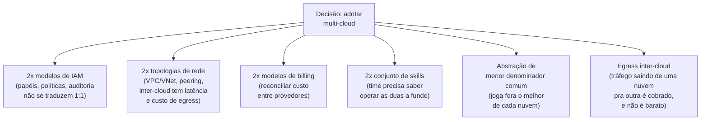

> [!abstract] TL;DR
> "Multi-cloud" promete resiliência e poder de barganha, mas na prática quase sempre entrega o oposto: duas superfícies operacionais pra manter, duas contas-fantasma de skills, e uma abstração de menor-denominador-comum que joga fora o que cada nuvem tem de melhor. Existem razões legítimas pra rodar em mais de um provedor — regulação, best-of-breed pontual, M&A, DR cross-provider — mas elas são específicas e mensuráveis, não um princípio genérico de "não colocar os ovos numa cesta só". A pergunta certa não é "devemos ser multi-cloud?", é "qual problema concreto essa segunda nuvem resolve, e o custo de mantê-la é menor que esse problema?".

## O mito que todo mundo repete

Se você já sentou numa reunião de arquitetura, provavelmente já ouviu a frase: "a gente devia ser multi-cloud, pra não ficar refém de um fornecedor só". Soa prudente. Soa como o tipo de coisa que um arquiteto sênior diria. E é, na maioria das vezes, um erro caro disfarçado de sabedoria.

O raciocínio por trás da frase é uma analogia mal aplicada. Diversificar investimentos financeiros é uma boa ideia porque ativos financeiros são, em grande parte, intercambiáveis — um dólar em ações vale o mesmo que um dólar em títulos, e você pode rebalancear a carteira em segundos. Nuvens não são assim. A AWS e a DigitalOcean não são dois lugares fungíveis pra rodar a mesma carga; são dois ecossistemas com primitivas, APIs, modelos de IAM, redes e catálogos de serviço *diferentes*. "Diversificar" entre eles não reduz risco proporcionalmente ao esforço — ele *multiplica* a superfície que sua equipe precisa entender, operar e proteger.

Isso não quer dizer que multi-cloud é sempre errado. Quer dizer que é uma decisão de trade-off, não um princípio de segurança grátis. E a maioria das empresas que se descreve como "multi-cloud" não é, na prática — é uma coisa bem mais modesta e bem mais defensável.

## O espectro: da nuvem única ao ativo-ativo

Antes de julgar se "multi-cloud" é bom ou ruim, vale separar o que as pessoas realmente chamam de multi-cloud. Existe um espectro, e ele importa porque o custo cresce muito mais rápido que a "quantidade de nuvem":

Repare no gradiente de cor: verde é barato e comum, vermelho é caro e raro. A esmagadora maioria das empresas que dizem "somos multi-cloud" estão no ponto B — uma nuvem principal (digamos, AWS) rodando 95% da carga, mais um serviço específico de outro provedor (BigQuery no GCP pra analytics, por exemplo) porque ele é objetivamente melhor naquele nicho. Isso é ótimo. É pragmático, tem escopo limitado, e o custo operacional extra é contido — você mantém uma conta, um pipeline de dados, talvez uma VPN ou peering, e pronto.

O ponto E — ativo-ativo de verdade, com a mesma aplicação rodando em produção simultaneamente na AWS e no Azure, roteando tráfego real pras duas — é raríssimo fora de um punhado de empresas com times de plataforma gigantescos (pense em bancos globais, ou empresas que foram *forçadas* a isso por regulação). E é caro de um jeito que poucas empresas médias conseguem justificar: você paga o dobro de tudo — IAM, rede, observabilidade, times de plantão que sabem operar as duas nuvens — pra reduzir um risco (a nuvem inteira cair) que, na prática, acontece com uma frequência muito menor do que os riscos que essa complexidade *introduz* (bugs de configuração, drift entre ambientes, um deploy que funciona numa nuvem e quebra na outra).

## As razões legítimas

Existem casos reais onde multi-cloud não é capricho — é resposta a uma restrição concreta que você não escolheu:

**Regulação e soberania de dados.** Alguns setores (bancário, saúde, governo) ou países exigem que dados fiquem em jurisdição específica, e às vezes o provedor dominante numa região não é o mesmo que você já usa em outra. Uma empresa europeia pode ser obrigada por regulação local a manter dados de cidadãos da UE numa nuvem com presença de datacenter local — e se sua nuvem principal não tem essa região, você herda uma segunda nuvem por lei, não por escolha.

**Requisito de cliente ou compliance contratual.** Grandes clientes enterprise, especialmente governo, às vezes exigem no contrato que o fornecedor não dependa de um único hyperscaler, ou que rode na nuvem que *eles* já usam internamente. Isso não é uma decisão técnica sua — é uma cláusula que você aceitou pra fechar o negócio.

**Best-of-breed pontual e isolado.** O caso do BigQuery é o exemplo canônico: você roda a aplicação inteira na AWS, mas o motor de analytics de dados do GCP é significativamente melhor pro seu caso de uso (consultas ad-hoc gigantes sobre dados semi-estruturados), então você exporta dados pra lá só pra essa função. O escopo é estreito — um pipeline de dados, não a aplicação inteira — e o ganho é mensurável.

**M&A — você herdou duas nuvens.** Comprou uma empresa que já rodava tudo no Azure enquanto a sua roda na AWS. Agora você é "multi-cloud" não porque decidiu ser, mas porque duas empresas com stacks diferentes se fundiram. A pergunta de arquitetura aqui não é "devemos ser multi-cloud", é "quanto tempo faz sentido manter as duas antes de consolidar numa só" — e a resposta quase sempre é: consolidar, eventualmente, a menos que o custo de migração supere o custo de manter as duas.

**Disaster recovery cross-provider.** Se o requisito de continuidade do negócio é sobreviver não só a uma zona de disponibilidade caindo, mas ao provedor inteiro tendo um apagão de plano de controle global (já aconteceu com os três grandes), a única defesa real é ter capacidade de recuperação numa nuvem diferente. Isso é diferente de "rodar em duas nuvens o tempo todo" — é ter um plano de DR frio ou morno testado, não produção ativa duplicada. Este tema conecta diretamente com o que o galho de resiliência já cobriu sobre RTO/RPO e estratégias de disaster recovery — a única mudança aqui é que o "site B" é um provedor diferente, não só uma região diferente do mesmo provedor.

## As razões ruins

E aqui estão as desculpas que soam bem em slide de arquitetura mas não resistem a uma pergunta de "quanto isso custa, de verdade?":

**"Não colocar os ovos numa cesta só", sem medir nada.** Essa é a mais comum e a mais perigosa, porque soa como prudência. O problema é que ninguém que usa essa frase calculou: qual é a probabilidade real de uma nuvem inteira cair globalmente (baixíssima — hyperscalers têm SLAs de altíssima disponibilidade regional)? Qual é o custo de manter duas nuvens operando (alto e contínuo)? Qual é a chance de um erro humano na *própria* infraestrutura multi-cloud causar um incidente pior do que o que ela deveria prevenir (na prática, mais alta do que se admite)? Resiliência genuína contra falha de provedor quase sempre é mais barata e mais eficaz dentro da própria nuvem — múltiplas zonas de disponibilidade, múltiplas regiões do mesmo provedor — do que espalhando pra um provedor totalmente diferente.

**Negociação de preço fantasiosa.** A ideia de "vamos ficar em duas nuvens pra ter poder de barganha" raramente funciona como imaginado. Hyperscalers negociam desconto por *volume comprometido* (committed use / reserved), não por ameaça de sair. Dividir sua carga entre duas nuvens tipicamente reduz o volume que você compromete em cada uma, o que *piora* seu desconto por volume nas duas — o oposto do que a tese prometia.

**Resiliência que na prática vira fragilidade.** A intuição diz que duas nuvines = duas chances de continuar no ar. A realidade operacional costuma inverter isso: cada camada nova de abstração (pra fazer o app "rodar em qualquer nuvem") é mais uma coisa que pode ter bug, mais um lugar pra configuração driftar entre ambientes, mais complexidade cognitiva pro time de plantão às 3 da manhã. Sistemas complexos falham de formas complexas — e multi-cloud ativo-ativo malfeito tende a *reduzir* a confiabilidade percebida, não aumentar.

> [!warning] A armadilha do "por portabilidade"
> A armadilha mais cara de todas: adotar multi-cloud "por portabilidade" — pra "nunca ficar preso" — e então nunca de fato migrar nada. Você paga o imposto completo (abstrair tudo pro menor denominador comum entre provedores, manter duas contas, treinar o time nas duas) só pra manter uma *opção* de migrar que, anos depois, ninguém exerceu. Enquanto isso, você perdeu anos de acesso aos serviços gerenciados de ponta de cada nuvem — porque para ser portável, você evitou usar o que cada uma tem de mais avançado (e mais proprietário) — e pagou caro pela sensação abstrata de liberdade. Se a portabilidade nunca é exercida, ela não foi uma opção real: foi um custo afundado com nome bonito.

## O custo real, decomposto

Vale nomear explicitamente onde o custo de multi-cloud aparece, porque ele raramente entra na planilha de decisão original:

Dois pontos merecem destaque:

**A abstração de menor denominador comum** é o custo mais silencioso e mais caro no longo prazo. Se você constrói uma camada própria (ou adota uma ferramenta terceira) pra "rodar igual em qualquer nuvem", essa camada só pode usar as funcionalidades que existem *nas duas* nuvens ao mesmo tempo. Isso descarta, por construção, os serviços gerenciados mais avançados — os que dão a maior parte do valor de estar na nuvem em primeiro lugar. Você acaba usando cada provedor como se fosse um datacenter genérico com API diferente, pagando preço de nuvem gerenciada pelo valor de infraestrutura crua.

**O egress inter-cloud** é um custo estrutural, não incidental. Tanto a AWS quanto a DigitalOcean cobram por dados saindo de sua rede — e tráfego indo de uma nuvem pra outra conta como egress total, sem os descontos que existem para tráfego dentro da mesma nuvem ou pra CDN própria do provedor. Arquiteturas multi-cloud ativo-ativo, que trocam dados constantemente entre as duas nuvens (replicação, sincronização de estado), acumulam esse custo continuamente — é o tipo de linha de fatura que só aparece grande depois de meses em produção.

> [!info] Verificado 2026-07-24
> Ambos os provedores cobram por tráfego de saída (egress) da sua rede — os valores exatos por GB e as faixas gratuitas mudam com frequência e variam por região/produto em ambos, então não cravo números aqui: confira a página de pricing vigente de cada provedor (`aws.amazon.com/ec2/pricing/on-demand` para data transfer da AWS, e a página de pricing de bandwidth da DigitalOcean) antes de orçar uma arquitetura cross-cloud real.

> [!tip] Assista: Why Your Multicloud Strategy Is Wrong
> **Canal:** Cloud Computing Insider | **Duração:** ~13min | **Idioma:** EN
>
> David Linthicum (analista de cloud de longa data) destrincha os erros mais comuns de quem já está em multi-cloud: subestimar o custo de mover dados entre nuvens (data gravity) antes de escolher os provedores, e não calcular a fatura de egress na hora de migrar workloads. Trecho de destaque [04:13]: *"if you don't do that, there's a hidden tax of moving data between clouds that can destroy your ROI"*
>
> 🎬 [Assistir no YouTube](https://www.youtube.com/watch?v=9k4DnFeSIsM)

> [!tip] Assista: Why you're addicted to cloud computing
> **Canal:** Fireship | **Duração:** ~5min | **Idioma:** EN
>
> Em ritmo acelerado, mostra como as nuvens usam egress fees como trava de saída de fato — com o caso real da 37signals (Basecamp/HEY), que enfrentou uma fatura de até $400 mil só para tirar os dados do S3 ao sair da AWS. Trecho de destaque [02:21]: *"they were looking at [up] to $400,000 S3 bill just to move the data"*
>
> 🎬 [Assistir no YouTube](https://www.youtube.com/watch?v=4Wa5DivljOM)

## Onde a lente dupla ajuda a enxergar isso

Depois de estudar AWS e DigitalOcean a fundo nos dois galhos anteriores, fica mais fácil ver *por que* multi-cloud entre eles especificamente seria estranho: são filosofias opostas. A AWS compete em profundidade de catálogo — centenas de serviços gerenciados, cada um com nuances próprias de IAM, rede e billing. A DigitalOcean compete em simplicidade — um catálogo deliberadamente pequeno, precificação previsível, superfície cognitiva mínima. Somar as duas não soma os pontos fortes; a integração entre elas exige que você trate a DO como "AWS com menos features" ou a AWS como "DO com complexidade desnecessária" — nenhuma leitura captura o motivo real de cada uma existir.

Isso não invalida um caso legítimo (best-of-breed pontual, DR, M&A) — só reforça que a decisão precisa ser tomada olhando o caso concreto, não um princípio genérico de diversificação.

## Motivo → é legítimo? → custo

| Motivo alegado | Legítimo? | Custo típico | Por quê |
|---|---|---|---|
| Regulação/soberania de dados | Sim | Baixo-médio (escopo definido pela lei) | Não é escolha — é restrição externa, escopo geralmente limitado a uma carga específica |
| Requisito contratual de cliente/governo | Sim | Médio (negociado) | Cláusula aceita para fechar negócio; escopo limitado ao que o contrato exige |
| Best-of-breed pontual (ex.: BigQuery) | Sim | Baixo (escopo estreito) | Um serviço específico, não a aplicação inteira; ganho mensurável e localizado |
| M&A (herdou duas nuvens) | Sim, temporariamente | Alto até consolidar | Não foi escolhida; a decisão real é *quando* consolidar, não *se* deve existir |
| DR cross-provider (apagão de plano de controle) | Sim, com escopo | Médio (DR frio/morno, não ativo-ativo) | Defende contra falha de provedor inteiro, não substitui HA dentro da nuvem |
| "Não colocar ovos numa cesta", sem medir | Não | Alto e contínuo | Risco de queda global do provedor é baixo; custo de manter duas nuvens é alto e certo |
| Poder de barganha na negociação | Não | Alto (perde desconto por volume) | Hyperscalers descontam por volume comprometido, não por ameaça de saída |
| Resiliência "genérica" via ativo-ativo | Raramente | Muito alto | Mais camadas = mais pontos de falha; HA multi-AZ/multi-região já resolve a maioria dos casos |
| Portabilidade "por via das dúvidas" | Raramente | Alto e permanente | Se a portabilidade nunca é exercida, foi custo afundado, não opção real |

## Um caso trabalhado: a pergunta que deveria ter sido feita antes

Imagine uma fintech de porte médio, hoje inteiramente na AWS: aplicação em ECS, banco em RDS, filas em SQS, tudo dentro de uma VPC bem desenhada. O time de arquitetura propõe migrar parte da carga pro Azure "pra reduzir dependência de um único fornecedor". A proposta chega bonita: dois ambientes, replicação de dados entre nuvens, roteamento de tráfego dividido entre AWS e Azure via DNS com peso.

Antes de aprovar, a pergunta que faltou fazer é simples: *qual falha específica esse desenho evita, que multi-AZ e multi-região dentro da própria AWS não evitariam?* A resposta, na maioria dos casos, é "a AWS inteira cair" — um evento que acontece com frequência extremamente baixa e que, historicamente, quando acontece, dura horas, não dias. Comparado a isso, o custo de manter dois ambientes de produção espelhados — dois pipelines de CI/CD, duas configurações de IAM auditadas separadamente, um time que precisa saber depurar problema de rede tanto na VPC da AWS quanto na VNet do Azure — é um custo *garantido e permanente*, pago todo mês, contra um risco *raro e temporário*.

O que normalmente acontece depois de um exercício honesto desses é que a fintech decide por uma versão muito mais barata do mesmo objetivo: reforçar a resiliência dentro da própria AWS (múltiplas zonas de disponibilidade, um plano de DR bem testado pra uma segunda região da própria AWS, backups automatizados e verificados) e reservar o Azure só pro cenário em que ele realmente é necessário — por exemplo, se um cliente institucional grande exige, contratualmente, que os dados dele fiquem numa nuvem específica. Nesse caso, o Azure entra pra atender *aquele* cliente, com escopo estreito e justificativa registrada — não como uma segunda cópia de tudo "por precaução".

Esse é o padrão que se repete: quando alguém pergunta "qual problema concreto essa segunda nuvem resolve, e quanto custa resolvê-lo assim comparado à alternativa dentro da própria nuvem?", a resposta correta quase sempre empurra a decisão de volta pro ponto B do espectro — nuvem principal mais um serviço ou uma exceção pontual — e raramente sustenta o ponto E.

## O que vem a seguir

Este galho segue com um mapa de outros dois grandes provedores — Azure e GCP — em nível de filosofia e tradução de nomes, sem hands-on (você já tem AWS e DigitalOcean a fundo; essas notas servem pra você reconhecer o terreno quando encontrar esses provedores num job, numa vaga ou numa arquitetura herdada). Depois vem a tabela de tradução consolidada dos quatro provedores lado a lado, e uma nota específica sobre o tema que fica embaixo de toda essa conversa de multi-cloud: lock-in — o que é real, o que é medo infundado, e como o Kubernetes funciona (ou não) como camada de portabilidade genuína.

## Fontes

- https://docs.aws.amazon.com/whitepapers/latest/aws-overview/introduction.html
- https://aws.amazon.com/ec2/pricing/on-demand/
- https://docs.digitalocean.com/products/billing/bandwidth/
- https://aws.amazon.com/blogs/enterprise-strategy/using-a-cloud-operating-model-to-govern-multicloud/
