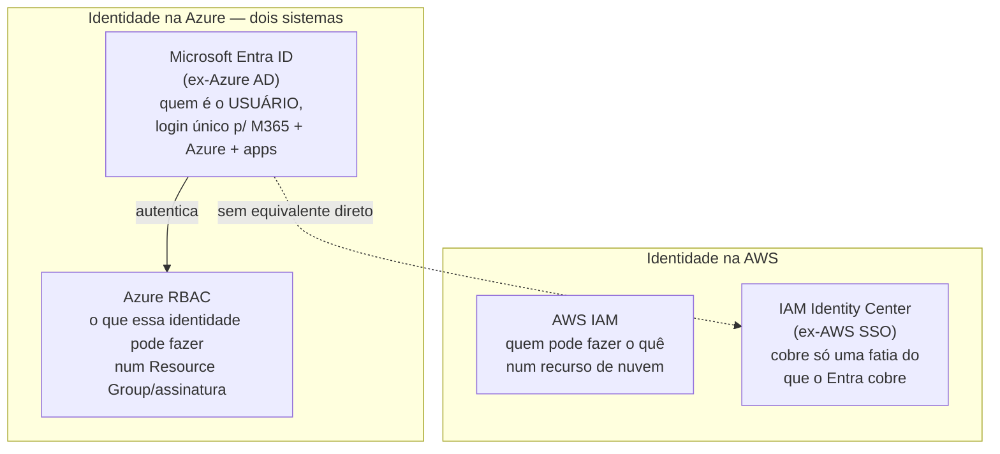
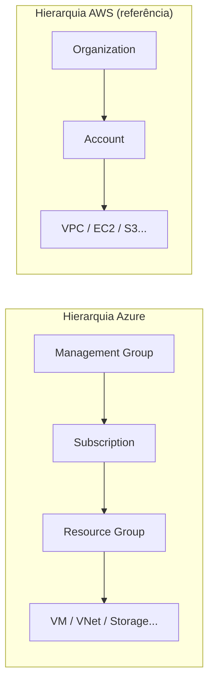

> [!abstract] TL;DR
> A Azure não compete com a AWS oferecendo "os mesmos serviços, só que da Microsoft". Ela compete vendendo uma coisa que a AWS não tem de fábrica: décadas de relacionamento com o mundo corporativo via Windows Server, Active Directory, Office e .NET. A joia da coroa é o **Microsoft Entra ID** (ex-Azure AD) — identidade de usuário corporativa, não identidade de recursos de nuvem. Quem já é "casa Microsoft" ganha atrito zero indo pra Azure; quem não é, sente a curva de nomes estranhos (Resource Group em vez de conta, App Service em vez de EC2+Elastic Beanstalk). A DigitalOcean não tem equivalente pra quase nada disso — este é o ponto exato onde a lente dupla vira lente única.

## O problema que a Azure resolve (e pra quem)

Imagine uma seguradora com 40 mil funcionários. Todo mundo já tem login corporativo — usuário e senha que abrem o e-mail no Outlook, o Excel, o Teams, o VPN da empresa. Esse login vive num Active Directory rodando em algum datacenter há 15 anos. Agora essa seguradora decide migrar sistemas pra nuvem.

Pergunta: ela quer recriar 40 mil identidades do zero num provedor novo, ensinar todo mundo a usar um login diferente pra sistemas cloud, e manter dois mundos de identidade sincronizados manualmente pro resto da eternidade? Ou ela quer um provedor que já fala a língua do Active Directory, estende esse mesmo diretório pra nuvem, e deixa o funcionário logar com a mesma senha de sempre em tudo — e-mail, Office, VPN, aplicações cloud?

A resposta óbvia é a segunda. E é exatamente essa promessa que fez a Azure crescer tão rápido dentro de empresas que já eram "casa Microsoft" antes da nuvem existir. Não é sobre VM ser mais rápida ou storage ser mais barato — é sobre a Azure ser uma **extensão natural de uma infraestrutura de identidade que já existia**.

Esse é o fio condutor da nota: a Azure é, antes de tudo, um produto de identidade e integração enterprise que por acaso também vende VM, storage e banco de dados. A AWS nasceu pra rodar aplicações web na infraestrutura do Amazon.com; a Azure nasceu pra estender o Windows Server que já rodava dentro de toda grande empresa do planeta. Filosofias de nascimento diferentes, arquiteturas de produto diferentes até hoje.

## Entra ID: identidade de gente, não identidade de recursos

Isso merece destaque antes de qualquer outra coisa, porque é a fonte mais comum de confusão de quem já conhece [[03-Dominios/Tecnologia/Cloud/04 - Identidade e acesso (IAM)/index|IAM na AWS]].

No mundo AWS/DO, "identidade" quase sempre significa **IAM** — quem (uma role, um usuário técnico, um serviço) pode fazer o quê num recurso de nuvem (rodar uma VM, ler um bucket, deletar uma tabela). É identidade de *máquina para recurso*.

No mundo Azure, o produto mais importante do catálogo inteiro chama **Microsoft Entra ID** (nome desde a reformulação de marca de 2023; antes disso, e ainda em boa parte da documentação e do jargão do mercado, é chamado **Azure AD**). Segundo a própria Microsoft, Entra ID é "o serviço de gerenciamento de identidade e acesso baseado em nuvem que fornece autenticação, aplicação de políticas e proteção para usuários, dispositivos, apps e recursos" — e a frase-chave é "para usuários": é identidade de *gente*, primeiro. Todo tenant Microsoft 365, Azure ou Dynamics já é automaticamente um tenant Entra ID.

> [!info] Verificado 2026-07-24 via learn.microsoft.com
> Entra ID é hoje o "produto fundacional" de uma família maior chamada **Microsoft Entra**, que também inclui Entra Domain Services (LDAP/Kerberos gerenciado pra apps legadas), Entra ID Governance, Entra ID Protection, Entra External ID (identidade de clientes/parceiros), Entra Workload ID (identidade de aplicações/serviços — o mais próximo do IAM-de-recursos) e, desde 2025-2026, Entra Agent ID (identidade pra agentes de IA). O rebranding de "Azure AD" pra "Microsoft Entra ID" aconteceu em 2023; a documentação e boa parte do mercado ainda alternam os dois nomes.

Ou seja: a Azure tem *dois* sistemas de identidade que respondem por coisas diferentes — Entra ID pra "quem é esse funcionário/usuário e o que ele pode acessar" (equivalente funcional mais próximo, na cabeça, de um SSO corporativo tipo Okta) e RBAC do Azure (Azure Role-Based Access Control) pra "o que essa identidade pode fazer dentro de um Resource Group ou assinatura", que aí sim é o parente mais direto do IAM da AWS. A AWS não tem produto equivalente ao Entra ID — o IAM Identity Center (ex-AWS SSO) cobre um pedaço do problema, mas não carrega o peso histórico de "sou o diretório da empresa inteira há 20 anos" que o Active Directory/Entra carrega.

> [!tip] Assista: Azure AD Is GONE, Entra ID Explained
> **Canal:** Azure Academy | **Duração:** ~3min | **Idioma:** EN
>
> Vídeo curto e direto sobre a troca de nome Azure AD → Microsoft Entra ID: explica por que a Microsoft rebatizou o serviço (Entra virou uma família inteira de produtos de identidade, não só um diretório) e o que muda (ou não) pra quem já tinha ambiente configurado. Trecho de destaque [00:00]: *"there's a new identity service in town, Microsoft Entra ID, and it's replacing Azure Active Directory"*
>
> 🎬 [Assistir no YouTube](https://www.youtube.com/watch?v=ZVs9FWjXFMU)

## Híbrido é o nome do jogo: Azure Arc e Azure Stack

A segunda marca registrada da Azure é levar a paisagem de gerenciamento da nuvem pra dentro do datacenter do cliente — não migrar tudo pra nuvem, mas gerenciar tudo (nuvem e on-premises) com as mesmas ferramentas.

O produto que carrega essa bandeira é o **Azure Arc**. Segundo a documentação oficial, o Arc "projeta" servidores, clusters Kubernetes e bancos de dados que rodam fora da Azure — em outro datacenter, em outra nuvem, na borda — para dentro do Azure Resource Manager, de forma que você gerencia esses recursos como se estivessem na Azure: mesmas políticas, mesmo RBAC, mesma malha de monitoramento, mesma superfície de automação via IaC (ARM, Bicep, Terraform).

> [!info] Verificado 2026-07-24 via learn.microsoft.com
> O Azure Arc cobre hoje quatro famílias de recursos fora da Azure: servidores/VMs (Windows e Linux, físicos ou em VMware vCenter/SCVMM/Azure Local), clusters Kubernetes de qualquer distribuição, serviços de dados Azure (SQL Managed Instance rodando em Kubernetes on-prem/edge/outra nuvem) e instâncias SQL Server fora da Azure. O modo "indirectly connected" foi aposentado em setembro de 2025 — hoje o Arc opera só em modo diretamente conectado.

Existe ainda o **Azure Stack**, uma família de produtos que leva hardware/software da Azure literalmente pra dentro do datacenter do cliente (Azure Stack Hub, Azure Stack HCI/Azure Local), pra cenários de latência zero, requisito regulatório de dado não sair do país, ou conectividade intermitente (navio, plataforma de petróleo, base militar).

Nem a AWS nem a DigitalOcean têm proposta de valor equivalente nesse nível. A AWS tem o **AWS Outposts** (hardware AWS dentro do seu datacenter) — mais parecido com Azure Stack do que com Arc, mas sem a amplitude de "gerenciar qualquer coisa fora da AWS como se fosse dentro". A DigitalOcean **não tem produto de híbrido/multi-nuvem gerenciada** — ela nem tenta competir nesse território. Esse é o ponto em que a lente dupla da nota vira, honestamente, "AWS tem parente distante, DO não joga esse jogo".

## O núcleo traduzido: o que já é familiar, com nome diferente

Fora identidade e híbrido, o núcleo da Azure é reconhecível pra quem já viu a AWS a fundo. A tabela abaixo é o mapa mental — não decoreba, referência de leitura.

| Categoria | Azure | AWS (equivalente) | DigitalOcean (equivalente) |
|---|---|---|---|
| Compute (VM) | Virtual Machines | EC2 | Droplets |
| Compute (PaaS gerenciado) | App Service | Elastic Beanstalk / App Runner | App Platform |
| Compute (função) | Azure Functions | Lambda | Functions (DO) |
| Containers orquestrados | Azure Kubernetes Service (AKS) | Elastic Kubernetes Service (EKS) | DOKS |
| Container isolado (sem servidor) | Azure Container Instances | Fargate | — (sem paridade direta) |
| Object storage | Blob Storage | S3 | Spaces |
| Block storage | Managed Disks | EBS | Volumes |
| Banco relacional gerenciado | Azure SQL Database / Database for PostgreSQL | RDS | Managed Databases |
| Banco NoSQL multi-modelo | Cosmos DB | DynamoDB (chave-valor) + outros | — (sem paridade; DO não tem NoSQL gerenciado nativo) |
| Rede isolada | Virtual Network (VNet) | VPC | VPC (DO) |
| Identidade de usuário/corporativa | Microsoft Entra ID | IAM Identity Center (parcial) | — (sem produto equivalente) |
| Identidade de recursos | Azure RBAC | IAM | Teams + API tokens (bem mais simples) |
| Gerenciamento híbrido | Azure Arc | AWS Outposts (parcial) | — (sem produto equivalente) |
| Data warehouse | Synapse Analytics | Redshift | — (sem paridade nativa) |
| DNS gerenciado | Azure DNS | Route 53 | DO DNS |
| CDN | Azure CDN / Front Door | CloudFront | Spaces CDN |
| IaC nativo do provedor | Bicep / ARM Templates | CloudFormation | — (Terraform third-party é o padrão) |

Repare no padrão: até a linha "Rede isolada" a tradução é quase 1:1 — [[03-Dominios/Tecnologia/Cloud/07 - Rede na nuvem (VPC)/index|VPC]] já é o mesmo conceito com nome diferente em qualquer provedor. A partir da linha de identidade, a Azure passa a ter categorias inteiras (Entra ID, Arc) sem equivalente honesto na AWS e nenhum equivalente na DO.

Um detalhe que vale registrar sobre nomenclatura de organização: onde a AWS usa "conta" (Account) como unidade isolada de cobrança/recursos, e a DO usa "Team/Project", a Azure usa **Subscription** (assinatura) dentro de um **Resource Group** — a assinatura é a unidade de cobrança e limite, o Resource Group é a pasta lógica onde os recursos de um mesmo ciclo de vida ficam juntos. Não é wrong nem right, é só outro vocabulário pro mesmo problema de organização que qualquer provedor de nuvem grande precisa resolver.

> [!tip] Assista: Azure Essentials — Microsoft Azure for AWS Professionals
> **Canal:** Microsoft Mechanics | **Duração:** ~6min | **Idioma:** EN
>
> Vídeo oficial da Microsoft que percorre a mesma tradução AWS↔Azure feita na tabela acima — mas narrando, serviço por serviço (VM, storage, banco, container), com o vocabulário da própria Microsoft. Bom pra ouvir os nomes "Resource Manager", "Blob Storage" e "Cosmos DB" no contexto de quem já fala AWS fluentemente. Trecho de destaque [01:01]: *"let's take a look at core services across compute, storage, and management — compute options are very similar between AWS and Azure"*
>
> 🎬 [Assistir no YouTube](https://www.youtube.com/watch?v=QT7d6gCYMCc)

## Três casos práticos, pra tirar do abstrato

**Caso 1 — a empresa que já é Microsoft.** Uma fabricante de peças automotivas roda ERP em SQL Server on-premises, e-mail em Exchange, arquivos em file server Windows, e autenticação inteira num Active Directory que existe desde 2008. Ela decide levar o ERP pra nuvem. Na Azure, o caminho é: instalar o Entra Connect pra sincronizar o AD existente com o Entra ID (sem recriar usuário nenhum), migrar o SQL Server pra uma VM ou pro Azure SQL Managed Instance usando o Azure Hybrid Benefit (aproveitando a licença que já tem), e manter o file server acessível via Azure File Sync enquanto migra aos poucos. Ninguém na empresa troca de senha, ninguém aprende um novo IdP. Na AWS, o mesmo projeto existe — RDS for SQL Server, AD Connector pro Directory Service — mas cada peça é integração de terceira parte adaptada pro mundo Windows, não um produto que nasceu pra isso.

**Caso 2 — a fintech que nasceu na nuvem, sem histórico Microsoft.** Um time greenfield decide construir a stack inteira em containers, sem VM Windows, sem SQL Server, sem AD nenhum pra herdar. Pra esse time, a vantagem estrutural da Azure simplesmente não se aplica — o AKS é competente, mas não é obviamente melhor que o EKS da AWS ou o DOKS da DigitalOcean pra esse cenário; a escolha vira questão de preço, familiaridade do time e ecossistema de add-ons, não de integração legada. É o caso em que a "lente Azure" perde força e o provedor vira commodity de fato.

**Caso 3 — a agência de governo com requisito de compliance.** Um órgão público federal precisa hospedar um sistema com certificação específica de segurança e residência de dado garantida por contrato, além de suporte formal de longuíssimo prazo. Aqui o histórico de décadas da Microsoft vendendo pra governo, junto com regiões dedicadas de compliance (Azure Government nos EUA é o exemplo mais citado, com certificações como FedRAMP High e DoD IL5), pesa de um jeito que nem toda nuvem "cloud-native" consegue replicar rápido — não por limitação técnica, mas por trilha de auditoria e relacionamento contratual construído ao longo de anos.

## Onde a Azure é notavelmente forte

Três frentes em que a Azure não é "só mais uma nuvem" — é a escolha racional, não a escolha por inércia:

**Identidade corporativa e Zero Trust.** Entra ID não é só um diretório — é hoje uma família inteira de produtos (Governance, ID Protection, Verified ID, Workload ID, Agent ID) construída em torno de uma estratégia de Zero Trust: verificar identidade, validar condição de acesso, checar permissão, criptografar canal, monitorar comprometimento, em todo o ambiente. Pra uma empresa que já roda Active Directory on-prem, estender esse mesmo diretório pra nuvem via Entra Connect é operação de dias, não de meses.

**Integração .NET e Office/Microsoft 365.** Uma aplicação .NET escrita pra rodar em IIS num Windows Server tem caminho de migração quase direto pro App Service ou pra uma VM Windows na Azure — inclusive licenciamento de Windows Server e SQL Server com desconto via Azure Hybrid Benefit pra quem já tem licença on-prem. Integrações nativas com Power BI, SharePoint, Teams e o resto do ecossistema Office 365 são, previsivelmente, mais suaves na Azure do que em qualquer concorrente.

**Governo e grandes corporações reguladas.** A Azure tem regiões dedicadas de governo (Azure Government nos EUA, por exemplo) com certificações de compliance que muitas agências públicas exigem por lei, e um histórico de décadas vendendo pra CIOs corporativos que já confiam na Microsoft como fornecedora de infraestrutura crítica (Windows Server, Exchange, SQL Server). Esse relacionamento de confiança pré-existente pesa em decisões de procurement que uma nuvem "cloud-native" mais jovem simplesmente não tem como replicar rápido.

> [!warning] Onde a analogia AWS→Azure quebra
> Não trate a tabela de tradução como bula. Alguns pontos de atrito reais: (1) **Resource Group** não tem equivalente 1:1 na AWS — é uma unidade de agrupamento lógico que a AWS resolve com tags e Organizational Units, não com um contêiner de primeira classe. (2) **App Service** é mais opinativo que Elastic Beanstalk — plataforma gerenciada de verdade (não infraestrutura auto-gerenciada por trás de um wrapper), o que é ótimo até você precisar de algo fora do trilho. (3) A superfície de portal/CLI da Azure historicamente cresce muito rápido e a nomenclatura muda com frequência (a própria renomeação Azure AD → Entra ID é exemplo disso) — documentação e cursos antigos citam nomes que já não existem mais no portal atual.

## O que vem a seguir

A próxima nota do galho faz o mesmo exercício de mapa mental pra GCP — a nuvem que nasceu de dentro do Google, com filosofia de novo bem diferente (rede global própria, cultura data/ML-first, Kubernetes como produto nativo, não importado). Depois disso, a nota seguinte cruza AWS, DigitalOcean, Azure e GCP numa única tabela de tradução de quatro colunas, e a nota final do galho encara de frente o tema que atravessa a trilha inteira desde o começo: lock-in, portabilidade, e até que ponto o Kubernetes resolve isso de verdade.

## Fontes

- Microsoft Learn — What is Microsoft Entra?: https://learn.microsoft.com/en-us/entra/fundamentals/what-is-entra
- Microsoft Learn — Azure Arc overview: https://learn.microsoft.com/en-us/azure/azure-arc/overview
- Microsoft Learn — Microsoft Entra ID documentation: https://learn.microsoft.com/en-us/entra/identity/
- Microsoft Learn — What is Azure role-based access control (Azure RBAC): https://learn.microsoft.com/en-us/azure/role-based-access-control/overview
- Microsoft Learn — Azure Hybrid Benefit: https://learn.microsoft.com/en-us/azure/cost-management-billing/scope-level/azure-hybrid-benefit
- Microsoft Learn — Organize your Azure resources effectively (management groups, subscriptions, resource groups): https://learn.microsoft.com/en-us/azure/cloud-adoption-framework/ready/azure-setup-guide/organize-resources
- Microsoft Azure — Azure Government: https://azure.microsoft.com/en-us/global-infrastructure/government/
