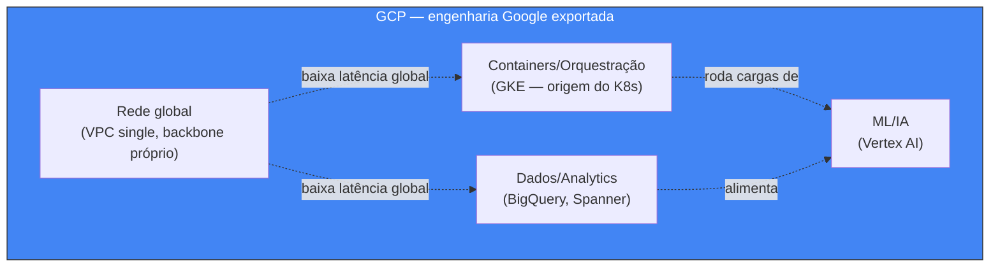
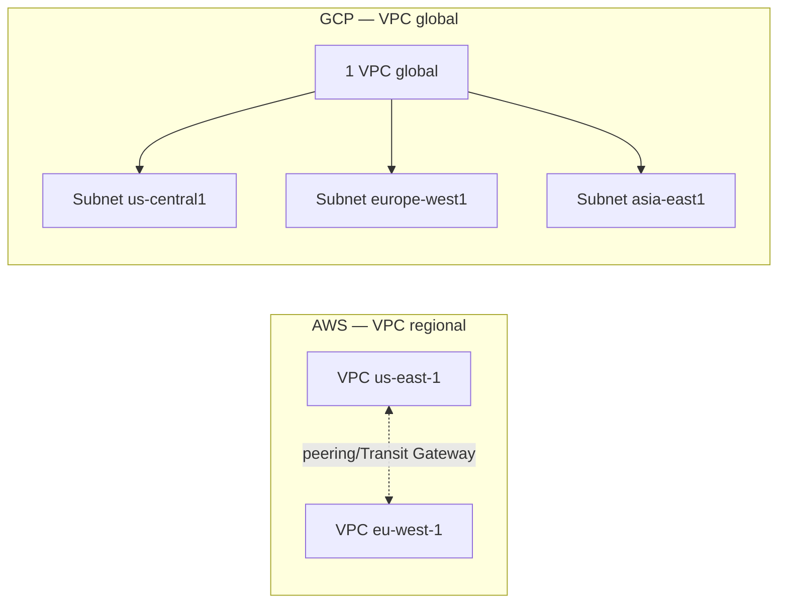

> [!abstract] TL;DR
> O GCP não tenta ser a AWS com sotaque diferente. Ele vende a engenharia interna do Google: uma rede privada global que liga datacenters em todos os continentes, um data warehouse (BigQuery) que faz em segundos o que outros levam minutos, e Kubernetes — que o Google inventou e ainda opera como referência via GKE. Menos serviços que a AWS, DX mais limpa, opinião mais forte sobre "o jeito certo" de fazer as coisas. Onde o GCP brilha, brilha muito: dados, rede, containers, ML. Onde não é o foco, a amplitude de opções é visivelmente menor.

## O problema: por que existe um terceiro nome na mesa

Você já passou pelo catálogo quase infinito da AWS (nota 21) e pela simplicidade opinativa da DigitalOcean (nota 22). Duas filosofias opostas: "tudo para todo mundo" contra "o essencial, bem feito, sem ruído". Cabe uma terceira pergunta natural: existe um meio-termo — um provedor grande o bastante para competir de igual para igual com a AWS, mas que também tenha uma opinião forte sobre como as coisas devem ser feitas?

Existe, e é o Google Cloud Platform (GCP).

A história ajuda a entender a personalidade do produto. A AWS nasceu de dentro para fora: a Amazon precisava escalar sua própria loja, construiu a infraestrutura, e em 2006 percebeu que podia vender pedaços dela. O GCP nasceu de um movimento parecido, mas com um ingrediente diferente: o Google já era, havia anos, a empresa que resolvia problemas de escala planetária em busca, e-mail e vídeo — e que, no caminho, **inventou boa parte da infraestrutura moderna de dados e orquestração de containers antes de qualquer concorrente**. O paper do MapReduce (2004) é do Google. O paper do Bigtable (2006) é do Google. O sistema interno de orquestração de containers chamado Borg, que rodava o Google inteiro desde os anos 2000, foi a inspiração direta para o Kubernetes — que o Google abriu como projeto open source em 2014 e depois doou para a CNCF.

Isso não é trivialidade histórica. É a chave para entender por que o GCP parece "menos AWS" em amplitude e "mais Google" em profundidade num punhado de áreas muito específicas: dados/analytics, rede global e orquestração de containers. O GCP não está tentando ser bom em tudo. Está exportando, como produto comercial, a engenharia que o Google já usava internamente para se manter de pé.

## A filosofia: data-first, network-first, opinião forte

Três traços definem a personalidade do GCP frente aos outros grandes provedores.

**Data-first.** Enquanto a AWS oferece um leque de bancos gerenciados para cada padrão de acesso (RDS, DynamoDB, Redshift, Neptune, Timestream...), o GCP concentra grande parte do seu diferencial em um único produto de peso pesado: o BigQuery. É o serviço que mais frequentemente aparece como razão decisiva para uma empresa escolher GCP mesmo já tendo infraestrutura em outro provedor — "todo o resto pode ficar onde está, mas os dados analíticos vão para o BigQuery".

**Network-first.** A rede privada do Google — os cabos submarinos que ela mesma possui e opera, os pontos de presença espalhados pelo planeta — é um dos maiores ativos de infraestrutura física do mundo, historicamente construído para servir a Busca, o YouTube e o Gmail a bilhões de usuários com baixa latência. O GCP expõe essa rede aos clientes de um jeito estruturalmente diferente da AWS, como você vai ver na seção de rede abaixo.

**Opinião forte, catálogo menor.** O GCP tem visivelmente menos serviços que a AWS — e isso é proposital, não deficiência. Cada serviço tende a ter um "jeito certo" de ser usado, com menos parâmetros de configuração e menos SKUs concorrentes fazendo a mesma coisa. Isso se traduz numa experiência de desenvolvedor (DX) frequentemente elogiada como mais limpa: console mais coeso, CLI (`gcloud`) mais consistente, IAM mais simples de raciocinar do ponto de vista de hierarquia (Organização → Pasta → Projeto, sem a profusão de contas separadas que a AWS incentiva via Organizations).

O trade-off é real: se você precisa de um nicho muito específico — um serviço de blockchain gerenciado, um marketplace de dados de terceiros gigantesco, uma variedade absurda de tipos de instância otimizados para cada workload imaginável — a AWS tem mais chance de já ter construído exatamente aquilo. O GCP aposta em fazer menos coisas, mas fazê-las com a profundidade de quem já resolveu aquele problema internamente em escala Google.

## O núcleo traduzido: compute, storage, dados, rede

Você já domina os primitivos (compute, storage, rede, bancos gerenciados) das notas 05 a 09 do galho principal, e viu como a DigitalOcean simplifica cada um deles. Aqui, a mesma lógica: nomes diferentes, mesmos conceitos — com destaques onde o GCP realmente inova.

### Compute

| Conceito | AWS | GCP | Nota |
|---|---|---|---|
| VM sob demanda | EC2 | Compute Engine | Equivalentes diretos; Compute Engine tem "live migration" de VM entre hosts físicos sem downtime, algo que a AWS não oferece do mesmo jeito |
| Serverless containers | App Runner / Fargate | **Cloud Run** | Ver destaque abaixo — é a joia da coroa serverless do GCP |
| Kubernetes gerenciado | EKS | **GKE** | GKE é o Kubernetes gerenciado mais maduro do mercado — o Google literalmente inventou a coisa |
| Function-as-a-Service | Lambda | Cloud Functions (hoje unificado sob Cloud Run functions) | Conceito idêntico ao visto na nota 11 (Lambda a fundo) |

**Cloud Run merece destaque especial.** Ele ocupa um nicho que nenhum outro grande provedor cobre tão bem: você entrega um container Docker comum — sem framework proprietário, sem runtime específico — e o Cloud Run cuida de tudo: build (opcionalmente, a partir do código-fonte via buildpacks), deploy, TLS, roteamento, e o mais importante, **scale-to-zero real**. Se ninguém está chamando o serviço, você paga zero pela computação — só pelo que efetivamente processou. Comparado à Lambda (que tem limites de runtime e empacotamento), o Cloud Run aceita literalmente qualquer coisa que rode num container, com tempo de execução de até 60 minutos por requisição. É o meio-termo entre "container gerenciado tradicional" (como o visto na nota 12) e "função serverless pura" (nota 11) — e por isso é frequentemente citado como o melhor produto serverless do mercado, ponto.

> [!info] Verificado 2026-07-24 em cloud.google.com/run: Cloud Run tem scale-to-zero, cold start tipicamente sub-segundo e tempo máximo de execução de 60 minutos por requisição. Limites específicos (CPU, memória, concorrência por instância) mudam com frequência — conferir a página oficial antes de dimensionar produção.

> [!tip] Assista: GCP Cloud Run Explained | Serverless Containers & Use Cases
> **Canal:** 3 Byte | **Duração:** ~13min | **Idioma:** EN
>
> Explica na prática o que essa nota descreve em teoria: o modelo de cold start do Cloud Run, o limite de 60 minutos por requisição, e por que ele ocupa o meio-termo entre container gerenciado tradicional e FaaS puro. Trecho de destaque [10:34]: *"once it's something is running for 60 minutes and doesn't [get killed]..."* (sobre o limite de execução por requisição)
>
> 🎬 [Assistir no YouTube](https://www.youtube.com/watch?v=b4VYEuCWEp8)

### Storage

| Conceito | AWS | GCP |
|---|---|---|
| Object storage | S3 | Cloud Storage |
| Block storage (disco de VM) | EBS | Persistent Disk |

Mapeamento direto, sem grandes surpresas conceituais — os primitivos de object e block storage vistos na nota 08 se aplicam igual.

### Dados

| Conceito | AWS | GCP |
|---|---|---|
| Banco relacional gerenciado | RDS / Aurora | Cloud SQL |
| Relacional distribuído global | Aurora Global Database (aproximação) | **Cloud Spanner** |
| NoSQL documento | DynamoDB | Firestore |
| **Data warehouse analítico** | Redshift | **BigQuery** |

**BigQuery é o diferencial de verdade.** É um data warehouse serverless: você não provisiona cluster, não dimensiona nós, não gerencia índices manualmente. Escreve SQL padrão contra tabelas de terabytes ou petabytes, e o BigQuery paraleliza a execução automaticamente atrás dos panos, separando compute de storage — a mesma arquitetura conceitual que você já viu ser importante na nota sobre bancos gerenciados (09), levada ao extremo em escala analítica. O modelo de precificação típico é por dados escaneados (cobrança por TB processado numa query), com um nível gratuito mensal, e existe também um modelo de capacidade reservada ("slots") para cargas previsíveis de alto volume.

> [!info] Verificado 2026-07-24 (cloud.google.com/bigquery): BigQuery oferece precificação on-demand (por volume de dados escaneado por query, com nível gratuito mensal) e precificação por slots reservados (compromisso mensal/anual). O valor exato do preço por TB e do free tier muda ocasionalmente — o número usualmente citado é próximo de US$ 6,25/TB no modelo on-demand, mas esse dígito específico não pôde ser confirmado diretamente na página oficial neste momento (conteúdo truncado na busca); confira cloud.google.com/bigquery/pricing antes de orçar algo real.

**Cloud Spanner** é outra peça sem equivalente direto fácil: um banco relacional com SQL e transações ACID que ao mesmo tempo escala horizontalmente e replica com **consistência externa** através de múltiplas regiões — usando uma tecnologia interna do Google chamada TrueTime (relógios atômicos sincronizados nos datacenters) para ordenar transações globalmente sem o trade-off clássico de "ou forte, ou distribuído" que você provavelmente já encontrou em teoria de sistemas distribuídos. A AWS tem produtos que se aproximam (Aurora Global Database para replicação multi-região, DynamoDB Global Tables para NoSQL), mas nenhum reproduz exatamente essa combinação de SQL relacional + consistência forte + escala global do Spanner.

> [!tip] Assista: O que é BigQuery? Como utilizar o BigQuery na prática?
> **Canal:** Letis Pires | **Duração:** ~12min | **Idioma:** PT-BR
>
> Demonstração prática em português do que essa nota descreve: BigQuery como data warehouse gerenciado, sem servidor, que escala pra petabytes e aceita SQL padrão direto — sem provisionar cluster nem dimensionar nó. Trecho de destaque [01:31]: *"escala de petabytes... totalmente gerenciado e sem servidor"*
>
> 🎬 [Assistir no YouTube](https://www.youtube.com/watch?v=pMXk1-LHHQM)

### Rede: a VPC global

Aqui está uma das diferenças arquiteturais mais importantes entre os dois provedores, e vale desacelerar.

Na AWS (nota 07), uma VPC é um recurso **regional**: você cria uma VPC dentro de uma região específica, e se quiser presença em múltiplas regiões, precisa de VPCs separadas conectadas por peering ou Transit Gateway.

No GCP, a **rede VPC (Virtual Private Cloud) em si é um recurso global**. Você cria uma única VPC para o seu projeto, e dentro dela cria sub-redes (subnets) regionais — cada uma vive numa região específica, mas todas fazem parte da mesma VPC global, e instâncias em sub-redes de regiões diferentes podem se comunicar nativamente através dela, sem peering, sem gateway extra, trafegando pelo backbone privado do Google entre continentes.

> [!info] Verificado 2026-07-24 em docs.cloud.google.com/vpc/docs/vpc: "VPC networks, including their associated routes and firewall rules, are global resources. They are not associated with any particular region or zone." Subnets, por outro lado, são recursos regionais.

Na prática, isso simplifica bastante arquiteturas multi-região: você não está costurando redes separadas, está distribuindo sub-redes de uma rede só. É um reflexo direto da filosofia network-first — o Google constrói a partir do pressuposto de que a rede global já existe e é confiável, porque é a mesma rede que sustenta a Busca há duas décadas.

## Onde o GCP brilha

Reunindo o que já foi dito, quatro áreas onde o GCP costuma ser a escolha natural ou pelo menos merece disputa séria com a AWS:

- **BigQuery e analytics.** Times de dados que já usam SQL avançado, dashboards de BI e pipelines de ETL/ELT em volume costumam preferir BigQuery pela combinação de performance, ausência de gerenciamento de cluster e integração nativa com o resto do ecossistema de dados do Google (Looker, Dataflow, Pub/Sub).
- **GKE e Cloud Run.** Se sua organização já pensa em Kubernetes como padrão de orquestração, GKE é frequentemente citado como a experiência gerenciada mais madura — afinal, o time que mantém o Kubernetes upstream trabalha dentro do Google. E se você quer containers sem o overhead operacional de um cluster, Cloud Run é difícil de bater.
- **Rede global de baixa latência.** Aplicações genuinamente distribuídas por continentes — onde usuários no Brasil, Europa e Ásia precisam de latência baixa e consistente — se beneficiam estruturalmente da VPC global e do backbone privado do Google.
- **Machine Learning (Vertex AI).** O Google constrói TPUs (chips próprios para treinamento e inferência de modelos de ML) e mantém uma pesquisa de ponta em IA internamente; o Vertex AI é a porta de entrada gerenciada para treinar, hospedar e servir modelos nessa infraestrutura. Não é o foco central desta nota — merece um domínio próprio — mas é um diferencial competitivo real frente a AWS SageMaker e ao Azure AI.

> [!warning] Onde o catálogo é mais raso
> Fora dessas áreas de força, o GCP tende a ter menos opções por categoria. Menos tipos de instância especializados, menos serviços de nicho (não existe, por exemplo, um equivalente direto e maduro a cada serviço obscuro de compliance/governança da AWS), e um marketplace de terceiros historicamente menor. Se sua arquitetura depende de um serviço muito específico que só a AWS tem, migrar "porque o GCP é mais bonito" pode custar caro em retrabalho.

## Tabela de tradução — GCP ↔ AWS

| Categoria | AWS | GCP |
|---|---|---|
| VM sob demanda | EC2 | Compute Engine |
| Serverless containers | App Runner / Fargate | Cloud Run |
| Kubernetes gerenciado | EKS | GKE |
| Function-as-a-Service | Lambda | Cloud Functions |
| Object storage | S3 | Cloud Storage |
| Block storage | EBS | Persistent Disk |
| Banco relacional gerenciado | RDS / Aurora | Cloud SQL |
| Relacional distribuído global | Aurora Global Database | Cloud Spanner |
| NoSQL documento | DynamoDB | Firestore |
| Data warehouse | Redshift | BigQuery |
| Rede virtual privada | VPC (regional) | VPC (global) |
| CDN/edge | CloudFront | Cloud CDN |
| IAM / hierarquia de contas | Organizations + Accounts | Organização → Pasta → Projeto |
| IaC nativo | CloudFormation | Deployment Manager / Terraform (padrão de facto) |
| ML gerenciado | SageMaker | Vertex AI |
| Fila/pub-sub gerenciado | SQS / SNS | Pub/Sub |

## Azure e GCP no mesmo mapa

Como ponte para a nota seguinte, vale já cravar que Azure e GCP não competem só com a AWS — competem também entre si por filantropia de nicho diferente: Azure pela integração profunda com o mundo Microsoft corporativo (Active Directory, .NET, Office 365), GCP pela engenharia de dados/rede/containers herdada do próprio Google. A tabela de tradução dos quatro grandes provedores lado a lado — incluindo os nomes do Azure — fica reservada para a próxima nota deste galho, que consolida tudo num único mapa de referência.

## O que vem a seguir

Você viu AWS (a fundo), DigitalOcean (a fundo) e agora GCP (em mapa mental). A peça que falta neste galho antes da tabela consolidada é o Azure — o provedor que fala a língua corporativa do Windows Server, Active Directory e .NET nativamente, e que costuma entrar pela porta de trás em empresas que já são clientes Microsoft havia décadas. Depois dele, a nota seguinte junta os quatro numa única tabela de tradução, e a nota final do galho ataca a pergunta que dá nome a ele: lock-in é inevitável, ou o Kubernetes (que você acabou de ver nascer dentro do próprio GCP) é de fato uma camada de portabilidade real entre nuvens?

## Fontes

- Cloud Run overview — https://cloud.google.com/run
- VPC network overview — https://cloud.google.com/vpc/docs/vpc
- BigQuery overview — https://cloud.google.com/bigquery
- BigQuery pricing — https://cloud.google.com/bigquery/pricing
- Cloud Spanner overview — https://cloud.google.com/spanner
- Kubernetes — origins and Google's Borg lineage — https://kubernetes.io/blog/2015/04/borg-predecessor-to-kubernetes/
