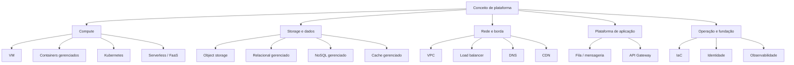

> [!abstract] TL;DR
> Compute, object storage, load balancer, fila, banco gerenciado, Kubernetes — os conceitos são os mesmos em qualquer nuvem. O que muda é só o nome do rótulo na caixa. Esta nota é o dicionário: para cada categoria de serviço, os nomes que AWS, Azure, GCP e DigitalOcean dão à mesma ideia — e, honestamente, onde um provedor simplesmente não tem aquela peça.

## O problema: você já sabe cloud, só não sabe o sotaque

Imagine que você domina fluentemente "banco de dados relacional gerenciado" — sabe o que é replicação síncrona, failover automático, read replica, backup point-in-time. Você aprendeu isso a fundo estudando o RDS da AWS (veja a nota sobre [[03-Dominios/Tecnologia/Cloud/09 - Bancos gerenciados|bancos gerenciados]]). Agora um recrutador te pergunta: "você já trabalhou com Azure SQL Database?" Você trava — não porque não sabe o conceito, mas porque não sabe que "Azure SQL Database" é RDS com sotaque de Redmond.

Esse é o problema que multi-cloud resolve mal e tradução resolve bem. Trocar de nuvem não é reaprender arquitetura distribuída do zero. É abrir um dicionário. VM continua sendo VM, seja ela chamada de EC2 Instance, Azure Virtual Machine, Compute Engine Instance ou Droplet. O hypervisor por baixo muda, o SLA muda, a UI muda — mas o modelo mental que você construiu estudando [[03-Dominios/Tecnologia/Cloud/05 - Compute I — máquinas virtuais|Compute I]] e [[03-Dominios/Tecnologia/Cloud/06 - Compute II — elasticidade e balanceamento|Compute II]] atravessa a fronteira inteiro.

Por isso esta nota não ensina nenhum conceito novo — ela pressupõe que você já andou pelo galho principal da trilha (notas 01 a 20) e sabe o que cada categoria de serviço *faz*. O que ela entrega é a tabela de bolso: você aprendeu o conceito no galho X, e agora, quando precisar falar com um cluster Azure ou um pipeline GCP, traduz o nome em segundos em vez de procurar do zero.

**Como usar esta tabela**: cada seção abaixo é uma categoria de serviço. A coluna "conceito" linka de volta para a nota da trilha que explica o *o quê* e o *por quê*. As colunas AWS/Azure/GCP/DO dão o *como se chama aqui*. Onde aparece um travessão (`—`), o provedor genuinamente não tem produto equivalente — não é preguiça de pesquisa, é a realidade do catálogo.

> [!info] Verificado em 2026-07-24
> Nomes de produtos cloud mudam com frequência incômoda (a Microsoft já renomeou serviços de Identity três vezes em poucos anos — Azure AD virou Microsoft Entra ID em 2023). Os nomes abaixo foram checados nesta data contra a documentação oficial de cada provedor. Se você está lendo isso meses depois, desconfie e confira a fonte antes de citar em entrevista.

## Compute: a peça mais antiga do catálogo

A máquina virtual é o primitivo original de toda nuvem pública — o que a AWS lançou em 2006 com o EC2. Todo provedor tem uma, porque sem isso não existe "nuvem".

| Conceito | AWS | Azure | GCP | DigitalOcean |
|---|---|---|---|---|
| VM sob demanda ([[03-Dominios/Tecnologia/Cloud/05 - Compute I — máquinas virtuais\|Compute I]]) | EC2 Instance | Azure Virtual Machine | Compute Engine (VM Instance) | Droplet |
| Auto scaling de VMs ([[03-Dominios/Tecnologia/Cloud/06 - Compute II — elasticidade e balanceamento\|Compute II]]) | EC2 Auto Scaling Group | Virtual Machine Scale Set (VMSS) | Managed Instance Group (MIG) | — (DO não tem auto scaling nativo de Droplets; escala-se App Platform ou usa-se Kubernetes) |
| VM "sob spot"/preemptível | Spot Instance | Spot Virtual Machine | Spot VM / Preemptible VM | — |

## Containers gerenciados e Kubernetes

Aqui o mercado convergiu de um jeito raro: Kubernetes venceu como padrão de orquestração, e os quatro provedores oferecem um controle plane gerenciado dele — a maior ilha de portabilidade real da cloud (mais sobre isso na próxima nota do galho, sobre lock-in).

| Conceito | AWS | Azure | GCP | DigitalOcean |
|---|---|---|---|---|
| Kubernetes gerenciado ([[03-Dominios/Tecnologia/Cloud/12 - Containers gerenciados\|Containers gerenciados]]) | EKS (Elastic Kubernetes Service) | AKS (Azure Kubernetes Service) | GKE (Google Kubernetes Engine) | DOKS (DigitalOcean Kubernetes) |
| Container "sem gerenciar cluster" (rodar imagem direto) | ECS + Fargate / App Runner | Azure Container Apps / Container Instances | Cloud Run | App Platform (Docker deploy) |
| Registro de imagens de container | ECR (Elastic Container Registry) | Azure Container Registry | Artifact Registry | Container Registry (DOCR) |

> [!info] Verificado em 2026-07-24
> GKE foi pioneiro (2014/2015) e ainda tem a reputação de operação mais madura de Kubernetes — faz sentido, o Kubernetes nasceu de projeto interno do Google (Borg). Isso é reputação de mercado, não uma medição objetiva desta nota.

## Serverless / FaaS

O modelo "function as a service" — pague por invocação, sem servidor visível — nasceu com o AWS Lambda em 2014 e hoje todo provedor grande tem seu clone.

| Conceito | AWS | Azure | GCP | DigitalOcean |
|---|---|---|---|---|
| Function as a Service ([[03-Dominios/Tecnologia/Cloud/11 - Serverless e FaaS — Lambda a fundo\|Serverless e FaaS]]) | Lambda | Azure Functions | Cloud Functions (2ª geração roda sobre Cloud Run) | Functions (DigitalOcean Functions, baseado em Apache OpenWhisk) |
| Orquestração de workflow serverless | Step Functions | Durable Functions / Logic Apps | Workflows | — |

## Plataforma de aplicação (PaaS)

Um degrau acima do FaaS: você entrega código-fonte ou um Dockerfile, a plataforma cuida de build, deploy, TLS e escala. É a categoria onde a DigitalOcean, historicamente focada em VM simples, ganhou competitividade real.

| Conceito | AWS | Azure | GCP | DigitalOcean |
|---|---|---|---|---|
| PaaS de aplicação (git push → app rodando) | App Runner / Elastic Beanstalk | Azure App Service | App Engine / Cloud Run | App Platform |

## Storage: object, block, file

Object storage é hoje o denominador comum de toda arquitetura cloud — do backup ao data lake. Foi a AWS que definiu o padrão de fato com o S3, a ponto de "compatível com S3" virar critério de venda para concorrentes.

| Conceito | AWS | Azure | GCP | DigitalOcean |
|---|---|---|---|---|
| Object storage ([[03-Dominios/Tecnologia/Cloud/08 - Armazenamento (object, block e file)\|Armazenamento]]) | S3 | Azure Blob Storage | Cloud Storage | Spaces Object Storage (API compatível com S3) |
| Block storage (disco de VM) | EBS (Elastic Block Store) | Azure Managed Disks | Persistent Disk | Volumes Block Storage |
| File storage compartilhado (NFS/SMB) | EFS (Elastic File System) | Azure Files | Filestore | Network File Storage (NFS-based) |

> [!tip] Assista: 4 Cloud Giants Compared in One Chart! AWS vs Azure vs GCP vs Oracle
> **Canal:** TheCloudIO | **Duração:** ~9min | **Idioma:** EN
>
> Percorre em vídeo o mesmo exercício de tradução desta nota — compute, storage de objeto/bloco/arquivo, Kubernetes gerenciado — categoria por categoria, com os nomes de cada provedor lado a lado (aqui trocando DigitalOcean por Oracle, mas o método de leitura da tabela é idêntico). Trecho de destaque [03:08]: *"[S3's] direct equivalent over on Azure is blob storage. For GCP, it's just called cloud storage."*
>
> 🎬 [Assistir no YouTube](https://www.youtube.com/watch?v=-gfbXDPTY0c)

## Bancos de dados relacionais gerenciados

| Conceito | AWS | Azure | GCP | DigitalOcean |
|---|---|---|---|---|
| Relacional gerenciado (Postgres/MySQL) ([[03-Dominios/Tecnologia/Cloud/09 - Bancos gerenciados\|Bancos gerenciados]]) | RDS | Azure SQL Database / Azure Database for PostgreSQL / MySQL | Cloud SQL | Managed Databases (Postgres, MySQL) |
| Postgres compatível de alta performance ("cloud-native") | Aurora (Postgres/MySQL compatible) | — (não há clone proprietário do Aurora) | AlloyDB for PostgreSQL | — |
| Data warehouse analítico | Redshift | Azure Synapse Analytics | BigQuery | — |

## NoSQL gerenciado

| Conceito | AWS | Azure | GCP | DigitalOcean |
|---|---|---|---|---|
| Documento/chave-valor gerenciado | DynamoDB | Cosmos DB | Firestore | MongoDB gerenciado (via Managed Databases) |
| Wide-column em escala massiva | Keyspaces (compatível com Cassandra) | Cosmos DB (API Cassandra) | Bigtable | — |

## Cache gerenciado

| Conceito | AWS | Azure | GCP | DigitalOcean |
|---|---|---|---|---|
| Redis/Valkey gerenciado | ElastiCache | Azure Cache for Redis | Memorystore | Managed Databases (Redis / Valkey) |

## Rede: VPC, load balancer, DNS, CDN

A camada de rede é onde a filosofia dos quatro mais diverge em complexidade — mesmo cobrindo o mesmo conceito de [[03-Dominios/Tecnologia/Cloud/07 - Rede na nuvem (VPC)|VPC]].

| Conceito | AWS | Azure | GCP | DigitalOcean |
|---|---|---|---|---|
| Rede virtual isolada (VPC) | VPC | Virtual Network (VNet) | VPC | VPC |
| Load balancer L4/L7 ([[03-Dominios/Tecnologia/Cloud/06 - Compute II — elasticidade e balanceamento\|Compute II]]) | ALB / NLB | Azure Load Balancer / Application Gateway | Cloud Load Balancing | Load Balancer |
| DNS gerenciado ([[03-Dominios/Tecnologia/Cloud/10 - DNS, CDN e borda\|DNS, CDN e borda]]) | Route 53 | Azure DNS | Cloud DNS | DNS (parte do painel, sem produto separado) |
| CDN ([[03-Dominios/Tecnologia/Cloud/10 - DNS, CDN e borda\|DNS, CDN e borda]]) | CloudFront | Azure Front Door / Azure CDN | Cloud CDN | CDN embutido no Spaces (não é produto CDN standalone) |

## Fila e mensageria

| Conceito | AWS | Azure | GCP | DigitalOcean |
|---|---|---|---|---|
| Fila simples ([[03-Dominios/Tecnologia/Cloud/13 - Mensageria e eventos gerenciados\|Mensageria e eventos]]) | SQS | Azure Queue Storage / Service Bus | Cloud Tasks / Pub/Sub | — |
| Pub/sub e streaming de eventos | SNS + Kinesis / MSK (Kafka gerenciado) | Event Grid + Event Hubs | Pub/Sub | — (sem serviço de mensageria gerenciado nativo) |

> [!warning] A maior lacuna da DigitalOcean é aqui
> Fila e streaming de eventos gerenciados é a categoria onde a DO simplesmente não compete. Se sua arquitetura depende de mensageria assíncrona pesada, você roda seu próprio Kafka/RabbitMQ num Droplet ou DOKS — ou aceita que esse pedaço da arquitetura vive em outro provedor. Isso não é acidente: é o motivo pelo qual a DO nunca tenta ser um substituto 1:1 de AWS/Azure/GCP, e sim uma nuvem para workload mais simples.

## API Gateway e edge de aplicação

| Conceito | AWS | Azure | GCP | DigitalOcean |
|---|---|---|---|---|
| API Gateway gerenciado ([[03-Dominios/Tecnologia/Cloud/14 - API Gateway e edge de aplicação\|API Gateway]]) | API Gateway | Azure API Management | Apigee / API Gateway | — (App Platform tem roteamento básico, não é API Gateway completo) |
| WAF (firewall de aplicação web) | AWS WAF | Azure Web Application Firewall | Cloud Armor | — |

## Infrastructure as Code

| Conceito | AWS | Azure | GCP | DigitalOcean |
|---|---|---|---|---|
| IaC declarativo nativo do provedor ([[03-Dominios/Tecnologia/Cloud/16 - Infrastructure as Code\|Infrastructure as Code]]) | CloudFormation / CDK | ARM Templates / Bicep | Deployment Manager (legado) / Config Connector | — (sem IaC nativo; usa-se Terraform provider oficial) |
| Terraform provider oficial | `hashicorp/aws` | `hashicorp/azurerm` | `hashicorp/google` | `digitalocean/digitalocean` |

Terraform é, na prática, o denominador comum das quatro colunas — é por isso que o galho de [[03-Dominios/Tecnologia/Cloud/16 - Infrastructure as Code|IaC]] da trilha usou Terraform como ferramenta neutra em vez do CloudFormation.

## Identidade e acesso

| Conceito | AWS | Azure | GCP | DigitalOcean |
|---|---|---|---|---|
| Gestão de identidade e permissão ([[03-Dominios/Tecnologia/Cloud/04 - Identidade e acesso (IAM)\|Identidade e acesso]]) | IAM | Microsoft Entra ID (ex-Azure AD) + Azure RBAC | Cloud IAM | Times/Projetos + API Tokens (modelo bem mais simples, sem RBAC granular por recurso) |
| Cofre de segredos/chaves | KMS + Secrets Manager | Azure Key Vault | Cloud KMS + Secret Manager | — (sem serviço gerenciado dedicado; usa-se Vault de terceiros ou variáveis de ambiente do App Platform) |

## Observabilidade

| Conceito | AWS | Azure | GCP | DigitalOcean |
|---|---|---|---|---|
| Métricas e logs centralizados ([[03-Dominios/Tecnologia/Cloud/17 - Observabilidade na cloud\|Observabilidade]]) | CloudWatch | Azure Monitor (+ Application Insights) | Cloud Monitoring + Cloud Logging (ex-Stackdriver) | Monitoring (métricas básicas de infra, sem APM completo) |
| Rastreamento distribuído (tracing) | X-Ray | Application Insights (parte do Azure Monitor) | Cloud Trace | — (integra-se com ferramenta de terceiros, ex.: Datadog, Honeycomb) |

## O padrão que emerge

Reparou no formato? Nas categorias "de commodity" — VM, object storage, Kubernetes, Postgres gerenciado — os quatro provedores têm equivalente direto, porque são conceitos que todo mundo precisa e o mercado já padronizou a expectativa. Nas categorias "de plataforma diferenciada" — mensageria gerenciada pesada, API Gateway completo, cofre de segredos dedicado — a DigitalOcean fica de fora, porque esses são produtos caros de manter e o público-alvo dela (startups, devs solo, times pequenos) raramente precisa deles no dia 1.

Isso não é DO "perdendo" para AWS — é DO escolhendo deliberadamente um catálogo mais enxuto para manter preço e simplicidade previsíveis. É uma decisão de produto, não uma limitação técnica escondida. E é exatamente esse tipo de trade-off que a próxima nota do galho examina de frente.

## O que vem a seguir

Essa tabela resolve o problema de *vocabulário* — mas não resolve o problema de *arquitetura*. Saber que EKS e GKE são "o mesmo conceito" não significa que migrar workload de um pro outro é trivial: há APIs proprietárias, IAM amarrado a cada nuvem, serviços gerenciados sem equivalente (como você acabou de ver na fila e no API Gateway) que prendem sua aplicação num provedor mesmo que o Kubernetes por baixo seja "portável". A próxima nota do galho encara esse tema de frente: lock-in é inevitável ou é escolha de arquitetura? E até que ponto o Kubernetes funciona de fato como camada de abstração entre nuvens.

## Fontes

- [AWS for Azure Professionals — comparação oficial de serviços](https://learn.microsoft.com/en-us/azure/architecture/aws-professional/services)
- [Azure for AWS Professionals — visão geral](https://learn.microsoft.com/en-us/azure/architecture/aws-professional/)
- [Google Cloud — mapa de produtos e comparação AWS/Azure/GCP](https://cloud.google.com/docs/get-started/aws-azure-gcp-service-comparison)
- [DigitalOcean — Products overview](https://docs.digitalocean.com/products/)
- [DigitalOcean App Platform — documentação](https://docs.digitalocean.com/products/app-platform/)
- [DigitalOcean Kubernetes (DOKS) — documentação](https://docs.digitalocean.com/products/kubernetes/)
- [DigitalOcean Functions — documentação](https://docs.digitalocean.com/products/functions/)
- [AWS EC2 — documentação oficial](https://docs.aws.amazon.com/ec2/)
- [Google Cloud Compute Engine — documentação oficial](https://cloud.google.com/compute/docs)
