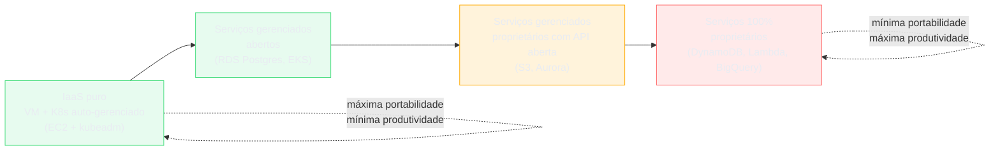
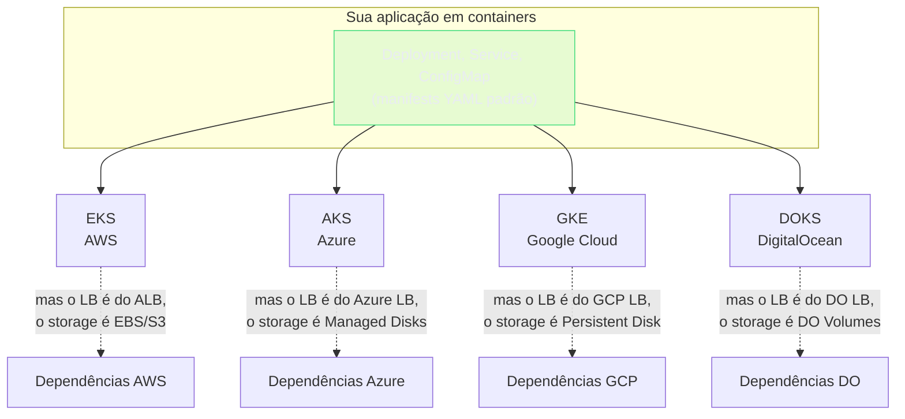
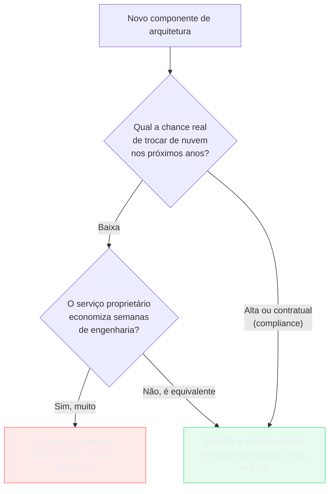

> [!abstract] TL;DR
> Lock-in não é um vício a ser evitado a qualquer custo — é o preço que você paga por alavanca. Um IaaS puro (VM + Kubernetes) é portável, mas você opera tudo. Um serviço proprietário como DynamoDB ou Lambda te prende, mas te devolve produtividade que você não teria construindo aquilo à mão. Kubernetes virou a camada de portabilidade dominante porque roda de forma quase idêntica em EKS, AKS, GKE e DOKS — mas ele só porta o *compute*. O load balancer, o object storage, o banco gerenciado e a fila continuam sendo do provedor. A decisão madura não é "fugir do lock-in": é escolher, nota por nota da arquitetura, onde a troca é provável e barata (minimize lock-in) e onde a alavanca compensa o risco de ficar preso (abrace o lock-in).

## O problema: portabilidade tem preço, e ninguém fala disso em voz alta

Todo arquiteto sênior já ouviu a frase "vamos evitar lock-in" numa reunião de kickoff. Ela soa prudente. Soa como disciplina de engenharia. E é, quase sempre, dita por alguém que nunca operou um Kafka self-managed em produção às três da manhã.

O problema é que "evitar lock-in" tem um custo que raramente é contabilizado no mesmo fôlego em que a frase é dita. Se você recusa DynamoDB e monta seu próprio cluster de banco distribuído em Kubernetes para "manter a portabilidade", você não eliminou uma dependência — você trocou uma dependência de contrato (a API do DynamoDB) por uma dependência de capacidade operacional (seu time sabendo operar um banco distribuído, com todos os incidentes que isso implica). Portabilidade não é grátis. Ela se paga em engenharia de plataforma, em horas de operação, em complexidade que alguém no seu time carrega para sempre.

A pergunta certa não é "isso me prende?". É: **"se eu precisar trocar, quanto vai doer — e qual é a chance real de eu precisar trocar?"** A resposta muda serviço por serviço, e é exatamente essa granularidade que a próxima seção tenta dar forma.

> [!tip] Assista: Vendor Lock-In: Nobody Cares.
> **Canal:** Theo - t3.gg | **Duração:** ~6min | **Idioma:** EN
>
> Reforça, de um ângulo provocador, a mesma virada de chave que esta nota propõe: a diferença entre lock-in (trabalho que você precisa *remover* pra sair) e built-in (trabalho que alguém já fez *por* você, e que você teria que *adicionar* de volta se saísse). Cita DynamoDB e Aurora como exemplos exatos de lock-in "de verdade" — o mesmo caso desta nota. Trecho de destaque [02:45]: *"if you're using Dynamo DB or Aurora on AWS, good luck moving"*
>
> 🎬 [Assistir no YouTube](https://www.youtube.com/watch?v=rtgjFEJaFI8)

## O espectro: de "tudo seu" a "tudo do provedor"

Pensa em lock-in como um espectro, não como uma dicotomia binária. Numa ponta, você opera literalmente tudo — só usa a nuvem como fornecedora de ferro (CPU, disco, rede). Na outra ponta, você delega tudo — o provedor cuida de disponibilidade, escala, patch, backup — e em troca você aceita falar a língua proprietária dele.

Repara na progressão:

- **IaaS puro** (EC2 nu + Kubernetes que você instala e opera, ou um droplet DigitalOcean com Docker Compose): você pode migrar essa carga para qualquer nuvem, ou até para um datacenter próprio, trocando pouco além das credenciais. O preço: você é responsável por patch de kernel, upgrade de versão do K8s, tuning de rede, todo o ciclo operacional que um serviço gerenciado absorveria por você.
- **Serviços gerenciados abertos**: um RDS PostgreSQL é "gerenciado" (a AWS cuida de backup, failover, patch), mas fala Postgres puro — o mesmo protocolo que roda num Postgres self-hosted ou num DigitalOcean Managed Database. Migrar significa fazer `pg_dump`/`pg_restore` (ou replicação lógica) para outro Postgres gerenciado. Dói, mas é um caminho conhecido, com ferramentas maduras.
- **Serviços proprietários com API que virou padrão de facto**: a API S3 é tecnicamente proprietária da AWS, mas tantos outros produtos a implementaram (MinIO, DigitalOcean Spaces, Cloudflare R2, Backblaze B2) que ela funciona quase como um padrão aberto na prática. Migrar dados é reescrever pouco código de aplicação — o verbo `PUT object` é quase universal.
- **Serviços 100% proprietários**: DynamoDB tem um modelo de dados (item, partition key, sort key, GSI) e um comportamento de consistência que não existe em nenhum outro produto sem reescrita significativa. Lambda tem um modelo de invocação, empacotamento e limites (timeout, payload, cold start) que não é portável para outro FaaS sem adaptação de código. BigQuery tem um dialeto SQL e um modelo de storage colunar que não migra para Redshift sem reescrever queries. Aqui a migração é, de fato, um projeto — não uma tarefa.

## A tabela: serviço, grau de lock-in, esforço real de migração

| Serviço | Grau de lock-in | O que precisa acontecer numa migração | Esforço |
|---|---|---|---|
| EC2 / Droplet (VM nua) | Muito baixo | Recriar a VM na outra nuvem, reapontar IP/DNS | Horas |
| Kubernetes (EKS/AKS/GKE/DOKS) | Baixo | Trocar o control plane gerenciado, reaplicar manifests | Dias |
| RDS PostgreSQL / DO Managed Postgres | Baixo–médio | Dump/restore ou replicação lógica para Postgres no destino | Dias a semanas |
| S3 / DO Spaces (API S3) | Baixo–médio | Copiar objetos (`s3 sync`/rclone); código muda pouco | Dias |
| SQS (fila gerenciada) | Médio | Reescrever cliente para a fila do novo provedor (semântica de visibility timeout difere) | Semanas |
| Aurora (Postgres/MySQL compatível) | Médio | Compatível no protocolo, mas performance e failover dependem do storage proprietário da Aurora | Semanas |
| ALB / Load Balancer gerenciado | Médio | Reconfigurar regras de roteamento e health check no equivalente do destino | Dias a semanas |
| Lambda (FaaS) | Alto | Reescrever handler, empacotamento e integração de eventos para o FaaS de destino | Semanas a meses |
| DynamoDB | Muito alto | Redesenhar modelo de dados (não existe GSI/LSI equivalente 1:1 em outro produto) | Meses |
| BigQuery | Muito alto | Reescrever pipeline de dados e dialeto SQL analítico | Meses |

> [!info] Verificado 2026-07-24
> Os graus de lock-in e esforços de migração acima são avaliação qualitativa de arquitetura, não números de um benchmark publicado — trate como heurística de conversa de design, não como métrica auditável.

Olha o padrão: os serviços no topo da tabela (baixo lock-in) são justamente os que exigem mais operação sua. Os do fim (alto lock-in) são os que te devolvem mais tempo de engenharia — DynamoDB escala para milhões de requisições por segundo sem você tocar em capacity planning; Lambda elimina servidor por completo. Essa correlação inversa entre lock-in e esforço operacional não é coincidência: é o próprio motivo pelo qual a nuvem vende serviços proprietários. Você não está pagando só pelo compute — está pagando para não precisar construir e operar aquela camada de software sozinho.

## Kubernetes como a camada de portabilidade — com limites honestos

Se existe uma tecnologia que ganhou fama de "solução para lock-in", é Kubernetes. E a fama é, em boa parte, merecida: um Deployment, um Service, um ConfigMap — os mesmos manifests YAML — rodam praticamente sem alteração em EKS (AWS), AKS (Azure), GKE (Google Cloud) ou DOKS (DigitalOcean Kubernetes). A API do Kubernetes é uma especificação aberta mantida pela CNCF, e todo provedor de Kubernetes gerenciado se compromete a implementar essa API de forma conforme — é o que permite que o mesmo `kubectl apply -f deployment.yaml` funcione nos quatro.

Repara no detalhe do diagrama: a caixa verde (seus manifests) é portável. As caixas pontilhadas (dependências) não são. Um Deployment que expõe um Service do tipo `LoadBalancer` dispara a criação de um Application Load Balancer na AWS, um Azure Load Balancer no Azure, um Google Cloud Load Balancer no GCP, ou o Load Balancer da DigitalOcean — quatro produtos diferentes, com quirks, limites e modelos de precificação diferentes, escondidos atrás da mesma primitiva Kubernetes. O mesmo vale para `PersistentVolumeClaim`: o volume que ele provisiona por trás é EBS, Azure Disk, GCP Persistent Disk ou um DO Volume — cada um com seu próprio ciclo de vida e limites de IOPS.

Isso não invalida o valor de Kubernetes como camada de portabilidade — significa que a portabilidade que ele entrega é de **compute e orquestração**, não de infraestrutura completa. Se sua aplicação é majoritariamente stateless e fala com serviços gerenciados via rede (o padrão mais comum), migrar o compute entre nuvens costuma ser o passo mais fácil da migração inteira. O que dói é tudo em volta: banco de dados, fila, storage, DNS, certificados, secrets — cada um amarrado ao provedor de origem.

Vale registrar também que Kubernetes em si tem um custo de entrada considerável: você está trocando o lock-in de provedor por uma complexidade operacional própria — quem gerencia o cluster ainda precisa entender scheduling, RBAC, networking (CNI), autoscaling, upgrades de versão. O domínio de Operação trata Kubernetes como disciplina própria, com seu contrato de produção (probes, graceful shutdown, resource requests/limits) — vale a nota [[03-Dominios/Engenharia/Operação/3 - Rodar em produção/02 - O contrato de produção do Kubernetes|O contrato de produção do Kubernetes]] para quem quiser esse aprofundamento operacional. Aqui na trilha Cloud, a primeira aproximação a Kubernetes gerenciado foi feita na nota "Kubernetes gerenciado de raspão", dentro do galho de Containers gerenciados.

> [!tip] Assista: Kubernetes & The Myth of Multi-cloud
> **Canal:** Devoxx | **Duração:** ~38min | **Idioma:** EN
>
> Talk de conferência que faz, ao vivo, o experimento que esta seção descreve: migra uma aplicação de EKS pra GKE e mostra exatamente onde o "Kubernetes é portável" quebra — a chamada de storage funciona até descobrir que "Google Cloud Storage não é S3-compatible", forçando escolher entre trazer dependências pra dentro do cluster (mais manutenção) ou trocar o endpoint (menos portabilidade real). Trecho de destaque [16:55]: *"somebody said Google Cloud Storage is not S3 compatible"*
>
> 🎬 [Assistir no YouTube](https://www.youtube.com/watch?v=xS7wSUCrllA)

## Outras camadas neutras: IaC, padrões abertos, containers

Kubernetes não é a única ferramenta que compra portabilidade. Existem pelo menos três outras camadas que valem o mesmo raciocínio:

**Infrastructure as Code multi-cloud.** Terraform (ou OpenTofu, seu fork open-source) descreve infraestrutura em HCL de forma declarativa, com providers para AWS, Azure, GCP e DigitalOcean — o mesmo fluxo `terraform plan`/`terraform apply` funciona nos quatro, ainda que os *recursos* dentro do código (`aws_instance`, `digitalocean_droplet`) sejam específicos de cada provider. Isso não te dá portabilidade automática (trocar de nuvem ainda exige reescrever os blocos de recurso), mas te dá um **processo** portável: a disciplina de versionar, revisar e aplicar infraestrutura via pull request é a mesma, independente de onde ela roda. Essa camada foi tratada a fundo na nota "Terraform a fundo", dentro do galho de Infrastructure as Code.

**Padrões abertos de dados e observabilidade.** A API S3 (como já vimos), o protocolo PostgreSQL, e o padrão OpenTelemetry para telemetria (traces, métricas, logs) são três exemplos de convenções que, por adoção massiva, funcionam como portabilidade de fato mesmo sem ser um padrão formal ISO. Instrumentar sua aplicação com OpenTelemetry, por exemplo, significa que trocar o backend de observabilidade (de CloudWatch para outro produto) é trocar um exportador de configuração, não reescrever a instrumentação inteira do código. O tema de tracing distribuído e os padrões de instrumentação foram cobertos na nota "Tracing distribuído", dentro do galho de Observabilidade na cloud.

**Containers e a especificação OCI.** A Open Container Initiative define o formato de imagem de container e o runtime que todo mundo implementa — Docker, containerd, o runtime usado por ECS, Fargate, Cloud Run, App Platform da DigitalOcean. Uma imagem de container construída uma vez roda em qualquer um desses ambientes sem alteração. É, provavelmente, a camada de portabilidade mais bem-sucedida e menos discutida da computação em nuvem moderna — silenciosa porque já é dado como certo.

## Casos práticos: a mesma pergunta, três respostas diferentes

A teoria do espectro fica mais concreta quando você aplica ela a decisões reais. Três cenários, três respostas — porque a resposta certa depende do contexto, não de uma regra universal.

**Caso 1 — startup em busca de product-market fit.** Aqui a variável que importa não é portabilidade, é velocidade. Um time de quatro pessoas que escolhe montar seu próprio Postgres em Kubernetes "para não depender do RDS" está queimando semanas de engenharia numa aposta que ninguém vai cobrar — porque se o produto não decolar, a nuvem escolhida nunca vai importar, e se decolar, o time vai ter caixa para lidar com a migração depois. Nesse estágio, a escolha racional é abraçar o lock-in de propósito: RDS, DynamoDB, Lambda, o que for mais rápido de colocar em produção. O curto prazo compra o médio prazo.

**Caso 2 — fintech regulada, obrigada por contrato a ter plano de saída.** Bancos e fintechs frequentemente assinam cláusulas contratuais (com reguladores ou com parceiros B2B) que exigem uma estratégia de saída demonstrável de qualquer fornecedor crítico, incluindo o provedor de nuvem. Aqui o cálculo muda: a probabilidade de "precisar migrar" não é hipotética, é uma cláusula de compliance. Faz sentido, nesse caso, pagar o imposto de portabilidade deliberadamente em componentes core — rodar o processamento transacional em Kubernetes com um banco Postgres gerenciado (portável), evitando DynamoDB e Lambda nos caminhos críticos, mesmo perdendo produtividade. A diferença para o Caso 1 não é técnica, é regulatória: a probabilidade de troca deixou de ser próxima de zero.

**Caso 3 — empresa data-heavy com pipeline analítico maduro em BigQuery.** Depois de dois anos construindo dashboards, modelos de ML e relatórios executivos em cima do BigQuery, a pergunta "e se precisarmos trocar para Redshift?" já não faz mais sentido prático — o custo de reescrever tudo seria maior que qualquer economia hipotética de troca de provedor. Aqui a estratégia madura é o oposto da intuição de "evitar lock-in": é ir fundo nos recursos proprietários do BigQuery (BQML, particionamento nativo, streaming inserts) porque a decisão de ficar já foi tomada implicitamente pelo histórico acumulado. Tentar manter uma camada de abstração "neutra" em cima disso só adicionaria complexidade sem opção real de uso.

O padrão comum aos três casos: a decisão certa não vem de uma regra ("sempre evite lock-in" ou "sempre abrace o mais gerenciado"), vem de responder, para aquele componente específico, naquele momento da empresa, a pergunta da seção anterior — qual a chance real de troca, e quanto custa manter a opção aberta.

## GitOps e multi-cluster: onde a portabilidade de Kubernetes se prova (ou não)

Uma forma de testar, na prática, quanto de portabilidade seu uso de Kubernetes realmente tem é perguntar: "se eu apontasse meu pipeline de deploy para um cluster em outro provedor amanhã, o que quebraria?" Ferramentas de GitOps como Argo CD ou Flux reforçam essa disciplina — o estado desejado do cluster vive em manifests versionados no Git, e o controller de GitOps converge o cluster real para esse estado, seja ele EKS, AKS, GKE ou DOKS.

O teste é revelador na prática: times que rodam GitOps limpo, com manifests que não referenciam nada específico do provedor (sem `annotations` de LoadBalancer proprietárias hardcoded, sem `StorageClass` amarrada a um único CSI driver), descobrem que a portabilidade de compute é real — o cluster de destino sobe, os manifests aplicam, a aplicação roda. Times que acumularam anos de customizações específicas de provedor dentro dos manifests (o que é extremamente comum, porque é o caminho de menor resistência no dia a dia) descobrem, geralmente tarde demais, que a portabilidade que achavam ter era teórica.

Isso não é motivo para nunca usar recursos específicos de provedor dentro do Kubernetes — um `Ingress` com anotações do ALB Controller da AWS é, com frequência, a escolha certa de engenharia. É motivo para saber, conscientemente, que cada anotação dessas é um fio de lock-in a mais, e decidir se ele vale a pena com os olhos abertos — exatamente o mesmo raciocínio do resto desta nota, só que dentro do próprio cluster.

## A estratégia madura: lock-in seletivo, não lock-in zero

Juntando o espectro, a tabela e as camadas neutras, a decisão estratégica fica mais nítida. Não existe "sem lock-in" — existe **onde você escolhe pagar o preço da portabilidade e onde você escolhe pagar o preço da operação**. Um jeito prático de decidir, componente por componente da arquitetura:

1. **Qual a probabilidade real de troca de provedor nos próximos 3-5 anos?** Se a resposta é "baixíssima" (você já escolheu a nuvem por motivos estratégicos sólidos — presença regional, compliance, contrato negociado), o custo de manter portabilidade universal é puro desperdício.
2. **Qual o ganho de produtividade do serviço proprietário versus a alternativa portável?** DynamoDB versus "montar um Cassandra em Kubernetes" não é uma escolha neutra — é meses de diferença em tempo de engenharia.
3. **Onde a troca é barata, deixe barata.** Compute em Kubernetes, dados em Postgres gerenciado, objetos via API S3 — aqui o custo de manter portabilidade é baixo o suficiente para valer a pena por padrão, mesmo sem plano concreto de migração.
4. **Onde a troca é impraticável de qualquer forma, abrace o lock-in de propósito.** Se sua arquitetura de dados já é BigQuery de ponta a ponta, fingir que você pode trocar para Redshift "se precisar" é uma ilusão cara — melhor investir o esforço em explorar bem os recursos proprietários do BigQuery do que em manter uma abstração que nunca vai ser usada.

## Lock-in não é só técnico: contrato, skills e dados também prendem

Até aqui o foco foi lock-in de API — a dificuldade de trocar o código que fala com um serviço. Mas existem pelo menos três outras formas de lock-in que raramente entram na conversa e que, na prática, pesam tanto quanto ou mais que a compatibilidade técnica:

- **Lock-in contratual.** Compromissos de gasto mínimo anual (os *committed use discounts* da AWS, Azure ou GCP, ou os planos de reserva da DigitalOcean) trocam desconto por compromisso de permanência. Um Reserved Instance de três anos na AWS é, na prática, uma cláusula de saída cara embutida no contrato — sair antes do prazo significa desperdiçar o desconto já negociado. Esse tipo de lock-in é decidido pelo time financeiro, não pelo time de engenharia, e frequentemente contradiz a estratégia técnica de portabilidade sem que ninguém perceba a tensão.
- **Lock-in de conhecimento (skills).** Um time que dominou profundamente a operação de EKS — IAM roles para service accounts, VPC CNI, integração com CloudWatch — carrega esse conhecimento como um ativo real. Migrar para GKE não é só reescrever manifests: é retreinar pessoas, perder a intuição operacional acumulada sobre "o que costuma dar errado" naquele ambiente específico. Esse custo é invisível numa planilha de comparação de preços, mas é, com frequência, o maior custo de uma migração de nuvem.
- **Lock-in de dados (gravitação).** Dados têm massa: uma vez que terabytes de histórico transacional, logs e backups vivem no object storage de um provedor, movê-los tem custo direto (taxas de egress, cobertas na nota de armazenamento deste domínio) e custo de tempo (transferências grandes levam dias). Esse é o motivo pelo qual o dado tende a "puxar" o resto da arquitetura para perto dele — um pipeline analítico que já processa dados no BigQuery cria gravidade para que o resto do stack de dados também fique no GCP.

Reconhecer essas três camadas evita uma ilusão comum: achar que, por ter escolhido serviços com API aberta, você está livre de lock-in. Você pode ter zero lock-in de API e ainda assim estar profundamente preso por contrato, por conhecimento acumulado do time, ou pela gravidade dos seus próprios dados.

## Armadilha: o imposto de portabilidade pago para um evento que nunca vem

> [!warning] O "e se precisarmos migrar algum dia" é a pior justificativa de arquitetura
> É comum ver times rodando *tudo* em Kubernetes genérico — inclusive filas, bancos e cache, todos auto-hospedados dentro do cluster — só para "manter a opção de trocar de nuvem" algum dia. O problema: esse "algum dia" quase nunca chega, e enquanto isso o time paga, todo santo dia, o custo de operar RabbitMQ, Postgres e Redis dentro do cluster em vez de usar os equivalentes gerenciados. É o imposto de portabilidade — e como todo imposto pago sem necessidade, ele drena orçamento de engenharia que poderia ir para o produto. A pergunta que desmonta essa armadilha é simples: "quando foi a última vez que essa empresa trocou de provedor de nuvem?" Na maioria dos casos, a resposta é "nunca" — e a arquitetura já vem pagando o preço da portabilidade há anos, para um evento hipotético.
>
> A versão saudável dessa cautela não é "evitar todo lock-in" — é isolar as poucas dependências proprietárias atrás de uma interface própria (um repositório de dados, uma abstração de fila) só nos pontos onde a probabilidade de troca é genuinamente alta, e aceitar o acoplamento direto em todo o resto.

## O que vem a seguir

Este galho reuniu o panorama dos quatro grandes provedores e a lente estratégica sobre lock-in. A peça que falta é aplicar tudo isso a uma decisão concreta: dado um cenário de produto real, qual provedor escolher, e quanto lock-in aceitar conscientemente em cada camada da arquitetura. Essa síntese fecha o galho no capstone de decisão de provedor.

## Fontes

- Kubernetes — conformidade e portabilidade entre provedores: https://kubernetes.io/docs/concepts/overview/
- Amazon EKS — visão geral: https://docs.aws.amazon.com/eks/latest/userguide/what-is-eks.html
- Amazon DynamoDB — modelo de dados e limites: https://docs.aws.amazon.com/amazondynamodb/latest/developerguide/Introduction.html
- Amazon Aurora — arquitetura de storage: https://docs.aws.amazon.com/AmazonRDS/latest/AuroraUserGuide/Aurora.Overview.html
- DigitalOcean Kubernetes (DOKS) — documentação: https://docs.digitalocean.com/products/kubernetes/
- DigitalOcean Spaces — compatibilidade com a API S3: https://docs.digitalocean.com/products/spaces/reference/s3-compatibility/
- Terraform — providers oficiais (AWS, Azure, GCP, DigitalOcean): https://registry.terraform.io/browse/providers
- OpenTelemetry — especificação e adoção: https://opentelemetry.io/docs/what-is-opentelemetry/
- Open Container Initiative — especificação de imagem: https://opencontainers.org/
