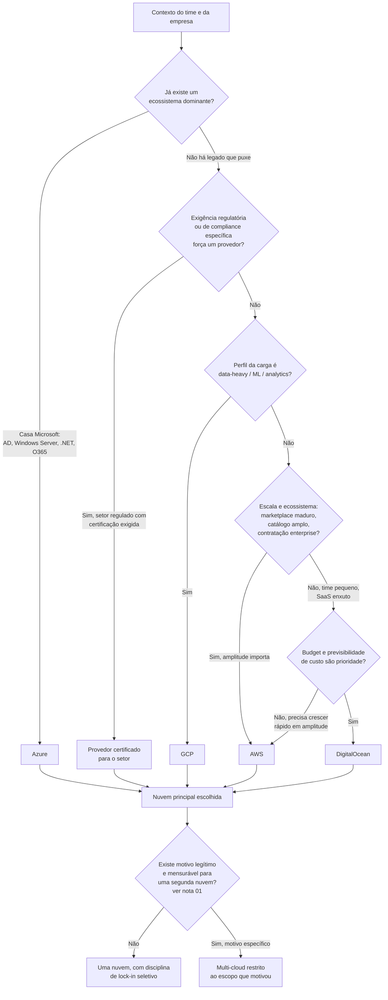

> [!abstract] TL;DR
> As cinco notas deste galho contam a mesma história de ângulos diferentes: nuvem não é commodity, é filosofia. AWS vende amplitude, Azure vende identidade corporativa, GCP vende dados e rede, DigitalOcean vende simplicidade previsível. Multi-cloud raramente é a resposta certa — é caro, dobra a superfície operacional, e só se justifica por um motivo concreto e mensurável. Este capstone amarra tudo num framework: dado o contexto do seu time (stack, compliance, escala, budget, tolerância a lock-in), qual nuvem principal escolher, e onde vale a pena pagar o preço da portabilidade. O valor de um arquiteto sênior não é saber decorar o catálogo de uma nuvem — é saber escolher a certa e traduzir entre elas quando o contexto muda.

## Recapitulando o galho em quatro movimentos

Antes do framework, vale reconstruir o argumento que as cinco notas anteriores foram construindo, porque o capstone só faz sentido como síntese delas.

A [[03-Dominios/Tecnologia/Cloud/23 - Panorama multi-cloud e portabilidade/01 - Por que (e por que não) multi-cloud|primeira nota]] desmontou o mito mais repetido em reunião de arquitetura: "vamos ser multi-cloud pra não ficar reféns de um fornecedor". A analogia com diversificação financeira é sedutora e falsa — ativos financeiros são fungíveis, nuvens não são. Rodar em duas nuvens não reduz risco proporcionalmente ao esforço; multiplica a superfície que o time precisa entender, operar e proteger. Existem motivos legítimos (regulação setorial, best-of-breed pontual, M&A que herdou duas contas, DR cross-provider para um punhado de sistemas críticos), mas eles são específicos e têm um custo mensurável do outro lado da balança — não um princípio genérico de prudência.

As duas notas seguintes abriram o zoom para os dois grandes provedores que este galho ainda não tinha tratado a fundo. A [[03-Dominios/Tecnologia/Cloud/23 - Panorama multi-cloud e portabilidade/02 - Azure em uma nota|Azure]] não compete com "os mesmos serviços, mais um fornecedor" — ela vende décadas de relacionamento com o mundo corporativo via Active Directory, Windows Server e Office. O Microsoft Entra ID é identidade de *usuário* corporativo, não identidade de recursos de nuvem, e é o ponto exato onde a DigitalOcean simplesmente não tem equivalente — a lente dupla deste galho vira lente única quando a Azure entra na conversa. O [[03-Dominios/Tecnologia/Cloud/23 - Panorama multi-cloud e portabilidade/03 - GCP em uma nota|GCP]], por sua vez, não tenta ser "AWS com sotaque diferente": vende a engenharia interna do Google — uma rede privada global, o BigQuery como data warehouse de referência, e Kubernetes, que o Google inventou e ainda opera como padrão-ouro via GKE. Menos amplitude que a AWS, mas opinião mais forte sobre "o jeito certo" de resolver dados, rede e containers.

A [[03-Dominios/Tecnologia/Cloud/23 - Panorama multi-cloud e portabilidade/04 - A tabela de tradução dos quatro|quarta nota]] tratou o resto do trabalho como tradução, não reaprendizado: VM continua sendo VM, seja EC2, Azure VM, Compute Engine ou Droplet. O conceito atravessa a fronteira; só o rótulo muda — e, honestamente, às vezes nem o rótulo existe do outro lado, porque nem todo provedor tem toda peça do catálogo.

E a [[03-Dominios/Tecnologia/Cloud/23 - Panorama multi-cloud e portabilidade/05 - Lock-in e portabilidade — Kubernetes como camada|quinta nota]] atacou o tabu do lock-in de frente: ele não é um vício, é o preço de alavanca. DynamoDB prende, mas devolve produtividade que ninguém constrói do zero sem custo. Kubernetes é a camada de portabilidade dominante porque roda quase idêntico em EKS, AKS, GKE e DOKS — mas só porta o *compute*; load balancer, object storage, banco gerenciado e fila continuam sendo do provedor. A decisão madura não é fugir do lock-in em bloco: é decidir, componente por componente, onde a troca é provável (minimizar lock-in) e onde a alavanca compensa o risco (abraçar o lock-in).

Juntando os quatro movimentos, sobra uma pergunta prática que nenhuma das cinco notas respondeu sozinha: dado o contexto de um time real, qual nuvem escolher como principal?

## O framework: do contexto à recomendação

Um framework de decisão de provedor não é uma tabela de pontos onde quem soma mais vence — é um funil de perguntas, cada uma eliminando ou reforçando candidatos, até sobrar uma recomendação defensável (não a única resposta certa, mas a que qualquer arquiteto sênior conseguiria justificar em voz alta numa reunião de stakeholders).

Repare no que o fluxograma *não* faz: ele não pergunta "qual nuvem é a melhor?" em abstrato — pergunta "o que o seu contexto específico está pedindo?". É a mesma disciplina do [[03-Dominios/Tecnologia/Cloud/03 - Well-Architected Framework/01 - Por que existe um framework de arquitetura|Well-Architected Framework]]: trade-offs, não respostas universais. Cada pilar do Well-Architected (custo, confiabilidade, performance, segurança) pesa diferente dependendo de quem pergunta, e a escolha de provedor é o mesmo exercício aplicado uma camada acima — antes mesmo de desenhar a arquitetura dentro da nuvem, você está escolhendo em qual conjunto de primitivas ela vai ser desenhada.

Vale destrinchar o peso de cada ramo:

- **AWS** ganha quando amplitude importa mais que simplicidade: catálogo de centenas de serviços, marketplace maduro de parceiros e integrações, contratação enterprise (SSO corporativo com AWS Organizations, suporte Enterprise, compliance FedRAMP/HIPAA/PCI documentado para praticamente qualquer setor), e um ecossistema de profissionais e consultorias do tamanho do mercado inteiro. É a escolha padrão quando não há um motivo forte para desviar.
- **Azure** ganha quando o legado corporativo já existe: Active Directory on-premises, licenciamento Microsoft, times que já vivem em .NET e Windows Server. A migração de identidade sozinha — Entra ID estendendo o AD existente em vez de recriar 40 mil contas do zero — já paga a decisão.
- **GCP** ganha quando a carga é sobre dados: BigQuery como motor analítico, pipelines de ML, e uma opinião forte sobre Kubernetes que reduz a distância entre "o jeito certo de operar containers" e "o jeito que o GCP facilita".
- **DigitalOcean** ganha quando o time é pequeno, o produto é um SaaS direto (web app + banco + fila, sem exigência regulatória pesada), e previsibilidade de custo/operação importa mais que profundidade de catálogo.

## Cenários trabalhados

Framework em abstrato é fácil de concordar e difícil de aplicar. Quatro cenários curtos, com a decisão e o porquê:

**Startup SaaS enxuta, 4 engenheiros, ainda validando product-market fit.** Recomendação: DigitalOcean (ou GCP com Cloud Run, se o time já tem familiaridade com containers e quer manter a porta aberta para escalar dentro do GCP depois). O argumento não é preço por hora de instância — é custo cognitivo. Um time de quatro pessoas não tem orçamento de atenção para aprender IAM da AWS, VPC peering, e um catálogo de 300 serviços enquanto ainda está descobrindo se o produto tem mercado. App Platform da DO ou Cloud Run do GCP entregam deploy de container com HTTPS, autoscaling e banco gerenciado sem exigir um especialista em plataforma no time.

**Enterprise que já é "casa Microsoft".** Recomendação: Azure, sem hesitação. Se a empresa já roda Active Directory, Office 365 e aplicações .NET internas, qualquer outra escolha significa recriar identidade do zero e manter dois mundos sincronizados manualmente — o custo descrito na nota 02 não é hipotético, é o primeiro projeto de migração que vai consumir seis meses do time de plataforma.

**Produto data-heavy: analytics, ML, pipelines de eventos em escala.** Recomendação: GCP. BigQuery resolve em segundos consultas que exigiriam um cluster Redshift dimensionado e ajustado à mão; se o roadmap inclui ML como parte central do produto (não um recurso lateral), a integração nativa entre BigQuery, Vertex AI e o resto do stack de dados do GCP economiza meses de engenharia de integração.

**Empresa que precisa de amplitude — marketplace, parceiros, ecossistema maduro, contratação enterprise multi-setor.** Recomendação: AWS. Quando o produto precisa se integrar com dezenas de sistemas de terceiros, quando a venda B2B exige certificações de compliance específicas por setor, ou quando a escala já ultrapassou o que qualquer catálogo enxuto sustenta, a amplitude deixa de ser ruído e vira a própria proposta de valor.

Nenhum desses quatro cenários é uma regra fixa — são o resultado de rodar o fluxograma acima com um contexto concreto. Troque uma premissa (o "enterprise casa Microsoft" na verdade já tem um time forte em Kubernetes e nenhum vínculo com AD) e a recomendação muda.

## A regra de ouro

Depois de cinco notas e um framework, a conclusão prática cabe em uma frase: **escolha uma nuvem principal, evite multi-cloud a menos que um motivo legítimo e mensurável force a mão, e minimize lock-in seletivamente — só onde a troca é realisticamente provável.**

Isso não é conservadorismo por preguiça. É reconhecer que cada nuvem adicional que o time precisa operar não soma linearmente ao esforço — ela multiplica. Duas nuvens não são "o dobro do trabalho de uma"; são um sistema com duas superfícies de IAM, duas topologias de rede, dois modelos de billing, dois catálogos de observabilidade, e um número finito de horas do time para dominar tudo isso. A pergunta que a nota 01 deixou plantada — "qual problema concreto essa segunda nuvem resolve, e o custo de mantê-la é menor que esse problema?" — é o filtro que sobrevive a qualquer atualização de catálogo, qualquer lançamento de serviço novo, qualquer promessa de vendor.

E quanto ao lock-in: a nota 05 já argumentou que ele é alavanca, não pecado. A regra de ouro aqui é a mesma que se aplica a qualquer trade-off de arquitetura — minimize onde a reversibilidade é barata e provável (compute, orquestração via Kubernetes), abrace onde a alavanca compensa (banco gerenciado, serviços serverless, filas proprietárias) e nunca trate portabilidade como valor absoluto desconectado do que ela custa em engenharia de plataforma.

## O que vem a seguir

Este capstone fecha o galho 23, não o domínio Cloud inteiro. As três notas de provedor a fundo já estão escritas — AWS (galho 21, com a filosofia da amplitude e capstone de "pensar como arquiteto AWS") e DigitalOcean (galho 22, com a filosofia da simplicidade e capstone equivalente) — e este galho preencheu a lacuna entre elas: o resto do mapa (Azure, GCP), a tradução entre os quatro, e o critério para decidir. Quem quiser aprofundar Azure ou GCP em nível hands-on — não apenas filosofia — vai precisar de galhos próprios que este panorama deliberadamente não cobriu; a nota 02 e a nota 03 foram desenhadas como mapa mental, não tutorial.

O Bloco 5 (Provedores e maestria) do domínio Cloud continua depois deste galho — a numeração e o próximo passo do tronco ficam registrados no roadmap do domínio, não aqui.

## Fontes

- AWS Well-Architected Framework — https://docs.aws.amazon.com/wellarchitected/latest/framework/welcome.html
- AWS Organizations — https://docs.aws.amazon.com/organizations/latest/userguide/orgs_introduction.html
- Microsoft Entra ID — visão geral — https://learn.microsoft.com/en-us/entra/fundamentals/whatis
- Google Cloud — BigQuery overview — https://cloud.google.com/bigquery/docs/introduction
- Google Kubernetes Engine — overview — https://cloud.google.com/kubernetes-engine/docs/concepts/kubernetes-engine-overview
- DigitalOcean App Platform — https://docs.digitalocean.com/products/app-platform/
- Kubernetes — Cloud Controller Manager (portabilidade entre provedores) — https://kubernetes.io/docs/concepts/architecture/cloud-controller/
