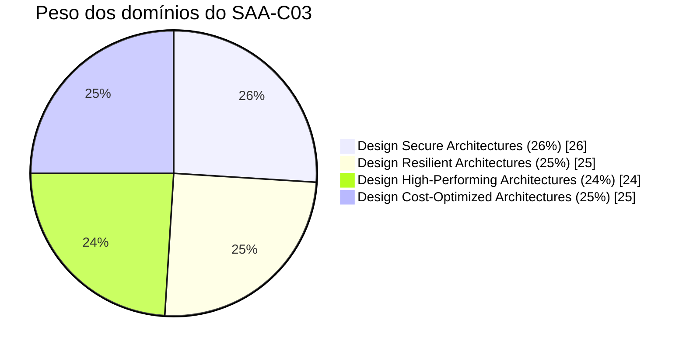
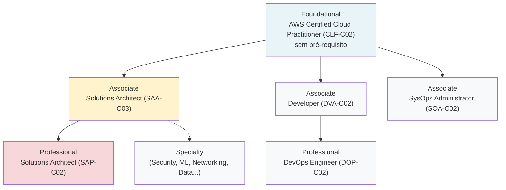

> [!abstract] TL;DR
> O SAA-C03 (AWS Certified Solutions Architect — Associate) é a certificação de arquitetura mais procurada do mercado cloud. Ela vale por dois motivos distintos: **sinaliza** pra recrutadores e ATS que você domina os conceitos fundamentais de arquitetura AWS, e o **blueprint do exame** — os quatro domínios que ele cobra — é essencialmente um currículo bem desenhado de arquitetura de nuvem. Não substitui experiência real, mas é o degrau natural pra quem já percorreu os galhos 1-23 desta trilha e quer consolidar e provar esse conhecimento.

## Certificação vale a pena?

Essa pergunta paira sobre qualquer pessoa que estuda cloud sério, e a resposta honesta é "depende do que você já fez até aqui". Se você chegou a esta nota tendo passado pelos 23 galhos anteriores — provedores, IAM, compute, rede, storage, bancos, serverless, containers, mensageria, IaC, observabilidade, segurança, FinOps, resiliência —, a pergunta muda de figura. Não é mais "devo aprender AWS pra tirar uma prova". É "devo formalizar, numa hora e meia de exame, o que eu já sei fazer".

Essa distinção importa porque a certificação tem má fama em alguns círculos, e por um motivo real: existe gente que decora dumps de prova, passa no SAA-C03 sem nunca ter aberto o console da AWS, e chega numa entrevista técnica sem saber explicar por que um Auto Scaling Group precisa de um health check customizado antes de escalar atrás de um Application Load Balancer. Essa pessoa tem o certificado e não tem a competência — e qualquer entrevistador técnico decente descobre isso em cinco minutos de perguntas de profundidade.

Mas o inverso também é verdade, e é o caso que interessa aqui: alguém que estudou a arquitetura de verdade, que sabe por que escolher DynamoDB em vez de RDS pra um caso de uso de alto throughput e baixa latência, que entende os trade-offs de Multi-AZ vs Multi-Region — essa pessoa tira a certificação quase de brinde, porque ela é *o produto natural* do estudo, não o objetivo dele. E aí a certificação cumpre sua função real: ela é um sinal barato de verificar, pra quem não tem tempo de te entrevistar por três horas, de que você atravessa um blueprint amplo de arquitetura AWS.

O valor, então, é duplo e precisa ser separado:

1. **Sinalização de carreira.** Recrutadores técnicos e sistemas de triagem automatizada (ATS) filtram vagas por certificações — é um critério objetivo, fácil de buscar num currículo ou LinkedIn, numa pilha de centenas de candidatos. Não abre a porta sozinha, mas evita que ela feche antes de você conseguir bater nela.
2. **Blueprint como currículo.** Os quatro domínios do exame — que a próxima nota desta trilha detalha — não são uma lista arbitrária. São, na prática, um resumo curado do que uma arquitetura AWS "correta" precisa considerar: segurança, resiliência, performance e custo. Estudar pra passar é, please note, estudar arquitetura de verdade.

> [!warning] O que a certificação NÃO é
> Ela não é prova de experiência prática, não é prova de que você já operou um sistema em produção sob carga real, e não é substituto pra portfólio ou histórico de trabalho. Um SAA-C03 na mão de quem nunca debugou um incidente em produção vale menos numa entrevista técnica do que dois anos de experiência sem certificado nenhum. Trate-a como *acelerador de sinalização*, não como *substituto de competência*.

> [!tip] Assista: Is the AWS Solutions Architect Certification ACTUALLY worth it?
> **Canal:** Tech With Soleyman | **Duração:** ~9min | **Idioma:** EN
>
> O autor entrevista candidatos que têm o SAA-C03 mas travam quando pedem pra explicar um projeto real — a mesma advertência desta nota, vinda do lado de quem contrata. Complementa o "vale a pena" com o contraponto de "vale a pena pra quem". Trecho de destaque [05:36]: *"think having this certification can also give you a false sense of expertise. I've interviewed so many candidates who have this certification, but when I asked them to talk me through a project that they've built (...) they freeze."*
>
> 🎬 [Assistir no YouTube](https://www.youtube.com/watch?v=xkLuZpmn09s)

## Por que um pedaço de papel importa: a economia da sinalização

Vale parar um segundo na palavra "sinalização", porque ela não é retórica vazia — é um conceito da economia da informação que explica por que certificações existem em qualquer mercado de trabalho técnico. Quando duas partes negociam (você e um recrutador) e uma delas tem informação que a outra não consegue verificar diretamente (sua competência real), surgem mecanismos de sinalização: credenciais baratas de emitir e caras de falsificar, que comunicam algo sobre a parte que as possui. Um diploma universitário é o exemplo clássico; uma certificação técnica é a versão mais rápida e mais barata do mesmo mecanismo.

Isso explica duas coisas ao mesmo tempo. Primeiro, por que a certificação *funciona* como filtro: ela é assíncrona, verificável (a AWS tem um portal de validação pública), e cara o bastante em tempo de estudo pra desencorajar quem não tem interesse real em arquitetura AWS. Segundo, por que ela *não é suficiente sozinha*: sinalização reduz incerteza, não a elimina. Um recrutador técnico que sabe o que está fazendo sempre vai complementar o filtro de certificação com perguntas de profundidade na entrevista — porque ele sabe que sinalização tem ruído.

Na prática, isso se traduz em três canais onde o SAA-C03 pesa:

- **Sistemas de rastreamento de candidatos (ATS).** Muitas plataformas de recrutamento (Greenhouse, Lever, Workday, entre outras) permitem que recrutadores configurem buscas ou filtros por palavras-chave, e "AWS Certified Solutions Architect" é uma das mais comuns em vagas de arquitetura, backend sênior e DevOps. Não ter a keyword não te desqualifica automaticamente em todo lugar, mas em processos de alto volume — centenas de candidatos pra uma vaga — reduz a chance de um humano sequer abrir seu currículo.
- **Requisitos formais de contrato.** Empresas que são AWS Partners (Consulting Partner, principalmente) frequentemente precisam manter uma cota mínima de certificados AWS entre os funcionários pra manter o nível do parceiro (Select, Advanced, Premier) — o que dá às certificações valor direto de negócio, não só de currículo.
- **Sinal em entrevista técnica.** Mesmo quando não é requisito formal, ver o SAA-C03 no currículo dá ao entrevistador um ponto de partida comum: ele sabe que pode perguntar sobre trade-offs entre serviços gerenciados sem precisar explicar o vocabulário básico primeiro. Isso acelera a conversa — não substitui ela.

## Custo-benefício, em números honestos

Vale fazer a conta, porque "vale a pena" sem números é só opinião. O custo direto é baixo: US$ 150 de taxa de exame, e se você reprovar, precisa esperar 14 dias e pagar de novo — a AWS não oferece retentativa gratuita. O custo real está no tempo de estudo, e aqui a honestidade importa: para quem já percorreu esta trilha inteira (galhos 1-23), o tempo adicional de preparação específica pra prova — simulados, revisão de pegadinhas, prática de gerenciamento de tempo em 130 minutos — costuma ficar na casa de 20 a 40 horas, não meses. Para quem está começando do zero em cloud, esse número sobe muito, porque a preparação passa a incluir aprender os serviços em si, não só a lente de exame.

Do lado do retorno, não existe fórmula universal — mercados e cargos variam demais —, mas o padrão qualitativo é consistente: a certificação raramente é o fator decisivo isolado numa contratação, mas reduz atrito em pelo menos dois pontos do funil (passar no filtro de ATS/triagem, e abrir a conversa técnica num nível mais avançado). Pensar nela como "seguro barato contra ser descartado antes da entrevista" é um enquadramento mais honesto do que "vai dobrar seu salário" — porque a segunda promessa é a que sustenta a má fama que certificações têm em certos círculos.

## O formato do exame

> [!info] Verificado em 2026-07-24 via [aws.amazon.com/certification/certified-solutions-architect-associate](https://aws.amazon.com/certification/certified-solutions-architect-associate/) e o Exam Guide oficial (PDF). O código atual é **SAA-C03** — não há sinal público de um SAA-C04 em preparação até a data desta nota. Preço, formato e política de reagendamento mudam com alguma frequência; confira a página oficial antes de agendar.

| Atributo | Valor |
|---|---|
| Código do exame | SAA-C03 |
| Número de questões | 65 (múltipla escolha e múltipla resposta) |
| Duração | 130 minutos |
| Custo | US$ 150 |
| Formato | Centro de testes Pearson VUE ou exame online com proctoring remoto |
| Idiomas | Inglês, e várias traduções (japonês, coreano, mandarim simplificado, entre outras) |
| Validade | 3 anos |
| Pré-requisito formal | Nenhum |
| Experiência recomendada | ~1 ano de experiência prática desenhando soluções em AWS (a própria AWS reconhece que 1-3 anos de TI já preparam candidatos) |
| Passing score | Escala de 100 a 1000; corte não divulgado oficialmente |

Dois pontos dessa tabela merecem nuance, porque a fonte oficial é deliberadamente vaga neles:

**Passing score.** A AWS afirma, na própria FAQ de certificação, que "AWS Certification passing scores are set by using statistical analysis and are subject to change. AWS does not publish exam passing scores". Ou seja: a escala de 100-1000 é documentada, mas o corte exato de aprovação não é público — e pode variar entre formas diferentes do exame, porque a AWS recalibra estatisticamente com base na dificuldade real de cada conjunto de questões. O número "720" que circula amplamente em cursos preparatórios e comunidades é uma estimativa consolidada ao longo dos anos, não um valor oficial confirmado pela AWS.

**Questões não pontuadas.** É prática comum da AWS incluir algumas questões experimentais (não pontuadas) misturadas às 65, usadas para calibrar futuras versões do exame — mas essa contagem específica também não está documentada nas fontes oficiais consultadas para esta nota. Se você ver materiais de terceiros citando "50 pontuadas + 15 não pontuadas", trate como estimativa de mercado, não como dado confirmado pela AWS.

> [!tip] Assista: AWS Solutions Architect Associate (SAA-C03) – Guia Completo da Certificação Mais Procurada
> **Canal:** Cloud For All | Democratizando Cloud, IA e Tech | **Duração:** ~12min | **Idioma:** PT-BR
>
> Confirma em PT-BR o mesmo formato desta nota (130 min, 65 questões, US$150, validade de 3 anos) e reforça por que essa é "uma das certificações que mais vão impactar no salário" — o mesmo argumento de sinalização de carreira desenvolvido acima. Trecho de destaque [01:14]: *"A prova ela tem 130 minutos de duração, 65 questões. O investimento é de 150. A validade é de 3 anos."*
>
> 🎬 [Assistir no YouTube](https://www.youtube.com/watch?v=MNY9IP1hxwo)

> [!info] Verificado em 2026-07-24 — passing score e contagem exata de questões não pontuadas não são divulgados oficialmente pela AWS; os números citados acima (~720, ~15 não pontuadas) circulam amplamente em cursos preparatórios mas não têm confirmação em fonte primária. Reconfira antes de se planejar em cima deles.

## Centro de testes ou proctoring online: qual escolher

A tabela acima já cravou que o exame acontece de duas formas — centro de testes Pearson VUE presencial, ou exame online com proctoring remoto —, mas vale desembrulhar essa escolha porque ela afeta o dia da prova de verdade.

**Centro de testes.** Você vai fisicamente até um local credenciado, geralmente compartilhado com outras certificações (TOEFL, certificações de TI de outros fornecedores). O ambiente já é controlado pelo próprio centro — sem risco de reprovar por causa de iluminação ruim ou barulho de fundo em casa. Em compensação, exige agendar horário compatível com a agenda do centro, e normalmente fica mais restrito a grandes cidades.

**Online proctored.** Você faz o exame de qualquer lugar com internet estável e uma webcam, sob supervisão remota via software (Pearson OnVUE). A logística exige preparação prévia real: mesa limpa, sem outro monitor ligado, celular fora de alcance, e um scan de 360° do ambiente antes de começar — muita gente reprova o *check-in*, não a prova, por não ter lido os requisitos com antecedência. A vantagem é flexibilidade de horário (inclusive fins de semana e madrugada, dependendo do fuso) e eliminar o deslocamento.

Nenhuma das duas modalidades altera o conteúdo ou a dificuldade do exame — é puramente uma escolha logística. Quem já fez outras certificações online proctored geralmente prefere manter o padrão; quem nunca fez, ou tem ambiente doméstico difícil de isolar (casa cheia, sem cômodo fechado), tende a preferir o centro físico pra eliminar essa variável.

## O equivalente nas outras nuvens

Esta trilha trata Azure e GCP como tabela de tradução de nomes, não como hands-on — e certificação não é exceção. Se você algum dia migrar de foco de provedor, vale saber como o mesmo conceito de "certificação de arquitetura de nível intermediário" se chama em cada um:

| Conceito | AWS | Azure | GCP | Observação |
|---|---|---|---|---|
| Certificação de arquitetura, nível intermediário | Solutions Architect — Associate (SAA-C03) | Azure Solutions Architect Expert (AZ-305) | Professional Cloud Architect | A Azure rotula este nível como "Expert", não "Associate" — nomenclatura não é 1:1 entre provedores |
| Certificação introdutória / fundamentos | Cloud Practitioner (CLF-C02) | Azure Fundamentals (AZ-900) | Cloud Digital Leader | Todas sem pré-requisito formal |
| Validade típica | 3 anos | 1 ano (recertificação gratuita via exame de renovação) | 2 anos | Políticas de renovação variam bastante — confira a fonte oficial de cada provedor antes de se planejar |
| Certificação de nível avançado / profissional | Solutions Architect — Professional (SAP-C02) | Azure Solutions Architect Expert já é o teto de arquitetura da Azure | Professional Cloud Architect já é o teto de arquitetura do GCP | A AWS é a única das três com um nível "Professional" distinto acima do "Associate" pra arquitetura |
| Portal de verificação pública | AWS Certified Global Community / Credly | Microsoft Certification Dashboard / Credly | Google Cloud Certified Directory | Todos permitem que terceiros validem se o certificado é genuíno |

> [!info] Verificado em 2026-07-24 por conhecimento consolidado de mercado — nomenclatura e políticas de validade da Azure e GCP não foram reconfirmadas via WebFetch nesta nota (fora do escopo desta trilha, que é AWS-first). Se a validade exata importar pra sua decisão, confira learn.microsoft.com/certifications e cloud.google.com/certification diretamente.

## Os quatro domínios, em peso

O exame guide oficial divide o conteúdo em quatro domínios, cada um com um peso relativo na nota final:

> [!info] Verificado em 2026-07-24 via o Exam Guide oficial (PDF em d1.awsstatic.com/training-and-certification). Pesos: Domain 1 (Design Secure Architectures) 26%, Domain 2 (Design Resilient Architectures) 25%, Domain 3 (Design High-Performing Architectures) 24%, Domain 4 (Design Cost-Optimized Architectures) 25%. Note que os pesos são quase equilibrados entre os quatro — nenhum domínio domina sozinho, o que reflete a filosofia do Well-Architected Framework de tratar segurança, resiliência, performance e custo como pilares interdependentes, não uma hierarquia.

A próxima nota desta trilha (02 — Os quatro domínios do blueprint) abre cada um desses domínios em detalhe, com os tópicos que caem dentro de cada um e o mapeamento pros galhos 1-23 que você já percorreu.

## Onde o SAA se encaixa na escada de certificações AWS

A AWS organiza suas certificações em quatro níveis, e entender essa escada ajuda a calibrar expectativa: o SAA-C03 não é o topo, é o degrau intermediário mais valorizado do mercado.

Nenhum desses níveis exige o anterior como pré-requisito formal — você pode, tecnicamente, sentar direto na prova Professional sem nunca ter tirado a Associate. Mas isso é raro e pouco recomendável: o SAA-C03 cobre o vocabulário e os padrões de decisão que a prova Professional (SAP-C02) assume como dados, só que aprofundados e combinados em cenários mais complexos, multi-conta, multi-região. Fazer o SAA primeiro não é burocracia, é sequenciamento pedagógico sensato — o mesmo princípio que estrutura esta trilha inteira, galho por galho.

Vale notar que o **Cloud Practitioner (CLF-C02)**, o nível Foundational, é opcional pra quem já vem de uma trilha técnica como esta: ele cobre conceitos de negócio e visão geral de nuvem que, se você percorreu os galhos 1-3 desta trilha (nuvem de verdade, anatomia de um provedor, Well-Architected Framework), você já absorveu com bem mais profundidade do que o CLF exige. Pular direto pro SAA-C03 é a rota natural pra quem estudou tecnicamente antes de pensar em certificar.

## Quem deve fazer, e quando

A certificação rende mais quando ela é *consolidação*, não *ponto de partida*. Alguns sinais de que é a hora certa:

- Você já passou pelos galhos de compute, rede, storage, bancos, serverless e segurança desta trilha (ou equivalente) e consegue explicar, sem consultar nada, por que escolheria um NAT Gateway em vez de uma NAT Instance, ou quando um Multi-AZ RDS não é suficiente e você precisa de read replicas cross-region.
- Você está buscando uma vaga onde o filtro de ATS ou o recrutador pede "certificação AWS" como critério — mesmo informal — de corte.
- Você quer uma meta concreta e datada pra forçar revisão ativa do que estudou de forma dispersa ao longo de meses.

E alguns sinais de que talvez seja cedo demais:

- Você ainda não abriu o console da AWS pra construir nada de verdade — a prova cobra cenários aplicados, não definições de dicionário.
- Você está estudando os galhos 1-20 pela primeira vez e ainda não fechou o panorama de segurança (galho 18), FinOps (galho 19) ou resiliência (galho 20) — esses três alimentam diretamente três dos quatro domínios do exame.

O paralelo mais próximo dentro deste próprio vault é o galho de Certificação OCP em Java: ali também a certificação não reensina a linguagem do zero, ela mapeia o que você já estudou contra um blueprint oficial e afia a estratégia de prova. O SAA-C03 cumpre o mesmo papel para a trilha Cloud — é o galho Magus que fecha o Bloco 5, não um curso de arquitetura disfarçado de prova.

## Depois de passar: os 3 anos de validade

Vale já internalizar que o SAA-C03 não é uma conquista de "passou e esqueceu". A validade de 3 anos existe porque a AWS lança serviços novos e muda comportamento de serviços antigos numa cadência que tornaria uma certificação vitalícia obsoleta em pouco tempo — e o exame guide em si já passou por várias revisões de código (o "C03" no nome indica que este é pelo menos a terceira geração do exame, sucedendo versões anteriores com blueprints diferentes).

Ao final da validade, você tem duas rotas de recertificação: refazer o exame do zero, ou (quando disponível) um exame de recertificação mais curto oferecido gratuitamente perto do vencimento. A AWS também opera um programa de créditos — passar num exame de nível Professional ou Specialty recertifica automaticamente as certificações Associate e Foundational relacionadas, o que é outro motivo prático pra tratar o SAA-C03 como degrau, não como destino final: se sua carreira for na direção de arquitetura, o próximo destino natural é o SAP-C02, e passar nele resolve a renovação do SAA de brinde.

## O que vem a seguir

A próxima nota (02 — Os quatro domínios do blueprint) abre cada um dos quatro domínios — Design Secure Architectures, Design Resilient Architectures, Design High-Performing Architectures e Design Cost-Optimized Architectures — detalhando os tópicos que cada um cobra e como eles se conectam ao Well-Architected Framework que abriu esta trilha lá no galho 3. De lá, a nota 03 traça o mapa completo dos galhos 1-23 contra esse blueprint, mostrando exatamente onde cada domínio já foi coberto — e onde ainda falta reforço antes do dia da prova.

## Fontes

- AWS. "AWS Certified Solutions Architect - Associate." https://aws.amazon.com/certification/certified-solutions-architect-associate/ (acessado 2026-07-24)
- AWS. "AWS Certified Solutions Architect - Associate (SAA-C03) Exam Guide" (PDF). https://d1.awsstatic.com/training-and-certification/docs-sa-assoc/AWS-Certified-Solutions-Architect-Associate_Exam-Guide.pdf (acessado 2026-07-24)
- AWS. "AWS Certification FAQs." https://aws.amazon.com/certification/faqs/ (acessado 2026-07-24)
