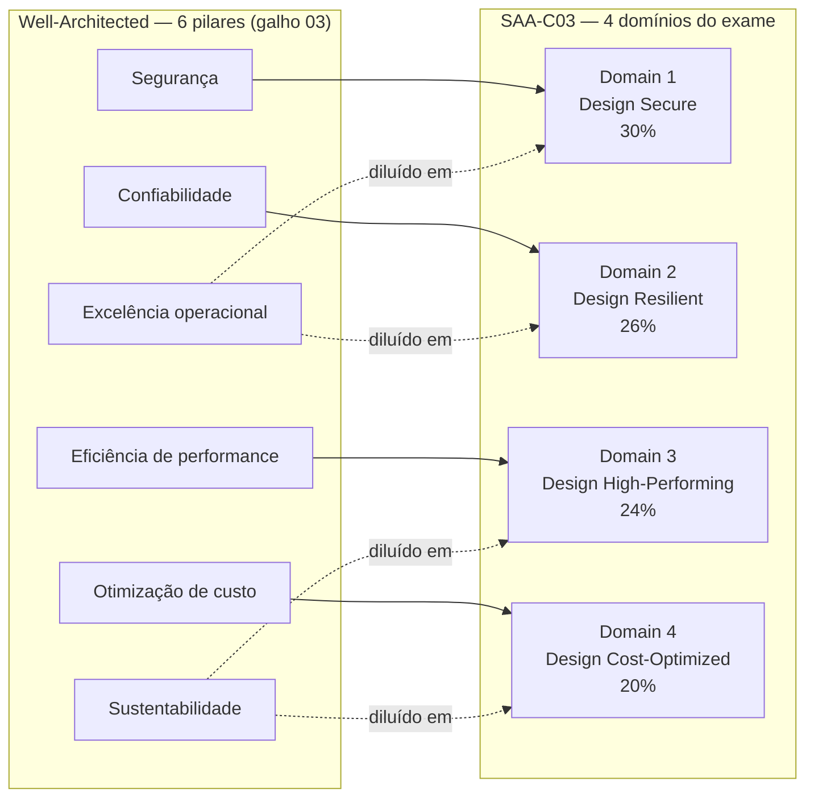
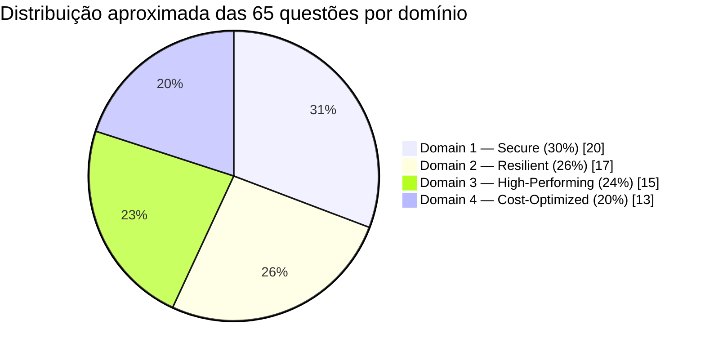

# Os quatro domínios do blueprint — o que o exame cobra e com que peso

> [!abstract] TL;DR
> O exam guide do SAA-C03 divide a prova em quatro domínios — Design Secure Architectures (30%), Design Resilient Architectures (26%), Design High-Performing Architectures (24%) e Design Cost-Optimized Architectures (20%). Não é uma lista nova para decorar: é o Well-Architected Framework (galho 03) reagrupado em quatro categorias práticas, com segurança puxando o peso maior. Quem entende os seis pilares — e sabe em que domínio cada um cai — já tem o mapa da prova antes de abrir a primeira questão.

## O problema: um blueprint sem rótulo nos itens

Pega qualquer edital de concurso, prova de residência médica ou certificação profissional séria, e ele vem com uma tabela de pesos. Ninguém estuda "tudo igual" — quem sabe que Direito Constitucional vale 25% da prova e Direito Tributário vale 5% aloca o tempo de estudo de forma correspondente. O SAA-C03 não é diferente, mas o documento que carrega essa tabela — o **Exam Guide** — é um PDF de oito páginas que a maioria dos candidatos nunca abre. Eles vão direto para o curso em vídeo, decoram serviços, e descobrem tarde demais que a prova pesa muito mais em desenho seguro do que em desenho performático.

> [!info] Verificado 2026-07-24 via Exam Guide oficial (SAA-C03)
> Os quatro domínios e pesos abaixo foram conferidos no PDF oficial `AWS-Certified-Solutions-Architect-Associate_Exam-Guide.pdf` (d1.awsstatic.com, versão vigente em 2026-07-24). Detalhes de prova: 65 questões, 130 minutos, nota de corte 720/1000, custo USD 150, validade de 3 anos. Esses números têm histórico de mudar entre revisões do exame — reconfirme no [Exam Guide oficial](https://aws.amazon.com/certification/certified-solutions-architect-associate/) antes de agendar.

A pergunta que esta nota responde não é "quais serviços a AWS tem" — isso a trilha inteira (galhos 01-23) já ensinou. É: **como os quatro domínios do blueprint se relacionam com o que você já sabe, e onde focar o tempo que sobra antes da prova.**

E há uma segunda camada nessa pergunta, mais sutil: o Exam Guide não é só uma tabela de pesos — é uma declaração de *escopo*. Cada domínio vem, no documento oficial, quebrado em "task statements" (afirmações de tarefa — coisas como "projetar arquiteturas seguras para acesso a recursos AWS" ou "projetar arquiteturas resilientes de alta disponibilidade"), e cada task statement lista os grupos de serviço considerados "no escopo" e, às vezes, o que fica *fora*. Isso importa porque a AWS tem, hoje, mais de 200 serviços catalogados — e o exame não testa 200 serviços. Ele testa uma fatia deliberada, e o Exam Guide é o documento que diz qual fatia é essa. Decorar o guia inteiro não é o objetivo desta nota (a nota 04 do galho faz esse trabalho serviço a serviço); o objetivo aqui é entender a *forma* do exame antes de mergulhar no conteúdo.

## O mecanismo: quatro domínios, seis pilares, uma sobreposição quase perfeita

O Well-Architected Framework tem seis pilares: excelência operacional, segurança, confiabilidade, eficiência de performance, otimização de custo e sustentabilidade. O SAA-C03 tem quatro domínios. Fazer a costura entre os dois não é coincidência de nomenclatura — é o mesmo framework, reagrupado para caber num exame de arquiteto júnior/pleno que ainda não opera produção em escala (por isso excelência operacional e sustentabilidade não viram domínios próprios; aparecem diluídas dentro dos outros quatro).

> [!tip] Assista: 6 Pillars of the AWS Well Architected Framework (you should really know this)
> **Canal:** Be A Better Dev | **Duração:** ~19min | **Idioma:** EN
>
> Percorre os seis pilares um a um, com comentário de experiência real — inclusive Excelência Operacional, o pilar "diluído" que esta nota menciona mas não detalha, porque ele não vira domínio próprio no exame.
> Trecho de destaque [00:42]: *"we're going to talk about the first pillar which is in terms of operational excellence and operational excellence is the idea of running, monitoring and continuously improving your application"*
>
> 🎬 [Assistir no YouTube](https://www.youtube.com/watch?v=5odtVlORq_w)

A tradução direta funciona bem: Segurança vira Domain 1 quase sem perda, Confiabilidade vira Domain 2, Eficiência de performance vira Domain 3, Otimização de custo vira Domain 4. Excelência operacional (deploy seguro, observabilidade, runbooks) e Sustentabilidade (right-sizing, escolha de região) não desaparecem — elas se espalham como *sub-tema* dentro dos quatro domínios grandes, porque a prova testa decisão de design, não operação do dia a dia.

Vale traduzir o peso percentual para algo mais tangível: número de questões. A AWS não divulga quantas das 65 questões são "não pontuadas" (questões-piloto testadas para futuras revisões, misturadas sem identificação — prática comum a certificações grandes) nem em qual domínio elas caem, então o candidato trata as 65 como valendo igual. Aplicando os percentuais de peso às 65 questões, dá para estimar quantas caem, aproximadamente, em cada domínio:

Vinte questões de segurança numa prova de 65 é quase um terço do exame inteiro dedicado a um único domínio — número grande o bastante para decidir, sozinho, se o candidato passa ou reprova. É esse peso concreto, e não a abstração "30%", que deveria orientar quanto tempo dedicar a cada revisão.

> [!tip] Assista: SAA-C03 AWS Certified Solutions Architect Associate Exam Overview and Exam Domains
> **Canal:** Tutorials Dojo | **Duração:** ~8min | **Idioma:** EN
>
> Percorre os quatro domínios oficiais na mesma ordem e com os mesmos pesos desta nota (30/26/24/20%), citando os task statements de cada um direto do Exam Guide — bom cross-check pra quem quer ouvir a fonte em vez de só ler a tabela.
> Trecho de destaque [04:43]: *"the first domain covers the big chunk of the exam at 30 percent followed by the second domain which covers 26, the third is 24 while the last one covers 20 of the exam"*
>
> 🎬 [Assistir no YouTube](https://www.youtube.com/watch?v=6kJ0JhnptlQ)

### Domain 1 — Design Secure Architectures (~30%)

O domínio de maior peso, e o mais fácil de subestimar por quem vem de uma trajetória mais voltada a performance ou custo. Cobre controle de acesso (quem pode fazer o quê), proteção de dados (em repouso e em trânsito), e segurança de infraestrutura (perímetro de rede). Na prática, as questões giram em torno de:

- **IAM**: políticas, roles, least privilege, federação, credenciais temporárias vs. de longa duração — o núcleo do galho [[03-Dominios/Tecnologia/Cloud/04 - Identidade e acesso (IAM)/index|04 — Identidade e acesso (IAM)]].
- **Criptografia gerenciada**: KMS, chaves gerenciadas pelo cliente vs. pela AWS, criptografia em trânsito (TLS) e em repouso — aprofundado no galho [[03-Dominios/Tecnologia/Cloud/18 - Segurança na cloud a fundo/index|18 — Segurança na cloud a fundo]].
- **Segurança de VPC**: security groups, NACLs, subnets públicas/privadas, VPC endpoints — coberto no galho [[03-Dominios/Tecnologia/Cloud/07 - Rede na nuvem (VPC)/index|07 — Rede na nuvem (VPC)]].
- **WAF/Shield** e defesa em profundidade na borda — tratado tanto no galho 10 (borda) quanto no galho 18, que costura as duas visões numa cadeia única de camadas.

O exame adora um padrão específico aqui: a questão descreve um cenário ("um app precisa acessar S3 sem passar pela internet pública") e pede o serviço certo (VPC endpoint, não uma NAT Gateway; role de instância, não access key hardcoded). Quem já internalizou "least privilege" e "nunca credencial de longa duração numa instância" do galho 04 reconhece o padrão na hora. Outros cenários recorrentes: "como restringir acesso a um bucket S3 só a uma VPC específica" (bucket policy com condição `aws:SourceVpce`), "como dar acesso cross-account sem compartilhar credencial" (assume role), "como auditar quem fez o quê" (CloudTrail, tratado no galho 18 dentro de governança e auditoria).

**DigitalOcean, honestamente:** a DO cobre bem o essencial de identidade (Teams, API tokens com escopo) e criptografia em repouso (volumes e Spaces criptografados por padrão), mas não tem um serviço de gerenciamento de chaves com a granularidade do KMS, nem um equivalente direto de políticas condicionais do IAM. Isso não é uma lacuna que a certificação testa — o SAA-C03 é 100% AWS —, mas é relevante para quem usa a lente dupla da trilha: o domínio de segurança é onde a distância entre os dois provedores é mais visível.

### Domain 2 — Design Resilient Architectures (~26%)

O segundo maior peso, e o domínio onde "decorar serviço" falha mais rápido — a prova testa a *combinação* de mecanismos, não o mecanismo isolado. Os temas centrais:

- **Alta disponibilidade multi-AZ**: distribuir carga e dados por zonas de disponibilidade para sobreviver à queda de uma AZ inteira, sem downtime perceptível — núcleo do galho [[03-Dominios/Tecnologia/Cloud/06 - Compute II — elasticidade e balanceamento/index|06 — Compute II]] (load balancer + Auto Scaling Group cruzando AZs).
- **Multi-region e disaster recovery**: RTO/RPO, estratégias de DR (backup-restore, pilot light, warm standby, multi-site ativo-ativo) — tema central do galho [[03-Dominios/Tecnologia/Cloud/20 - Resiliência e continuidade/index|20 — Resiliência e continuidade]].
- **Desacoplamento**: filas e tópicos entre componentes para que a falha de um serviço não derrube a cadeia inteira — coberto no galho [[03-Dominios/Tecnologia/Cloud/13 - Mensageria e eventos gerenciados/index|13 — Mensageria e eventos gerenciados]].
- **Backup e continuidade**: snapshots automatizados, point-in-time recovery, teste de restore — também no galho 20.

Uma pegadinha recorrente: o exame gosta de cenários onde a resposta "óbvia" (mais instâncias, servidor maior) está errada porque o gargalo real é acoplamento síncrono entre dois serviços. A resposta certa costuma ser "insira uma fila" — o mesmo argumento central do galho 13. Outro padrão clássico: a diferença entre "alta disponibilidade" (o sistema continua respondendo, talvez degradado, durante uma falha) e "durabilidade" (o dado não se perde, mesmo que o serviço fique indisponível por um tempo) — S3 tem durabilidade de 11 noves mas isso não é a mesma coisa que disponibilidade de 99,99%, e o exame testa essa distinção deliberadamente.

**DigitalOcean, honestamente:** a DO cobre bem alta disponibilidade dentro de uma região (Load Balancers distribuindo entre múltiplos Droplets, snapshots automatizados de volumes e bancos gerenciados), mas não tem um serviço nativo de DR multi-region orquestrado como o AWS Elastic Disaster Recovery, nem um equivalente do Route 53 com failover de DNS automatizado entre regiões — replicar a estratégia pilot-light ou warm-standby na DO é possível, mas exige montagem manual, não um botão gerenciado.

### Domain 3 — Design High-Performing Architectures (~24%)

O domínio mais próximo do que a maioria dos cursos ensina primeiro — compute, storage, banco de dados e rede otimizados para uma carga específica. Cobre:

- **Compute performático**: escolha de família de instância, right-sizing, Auto Scaling reagindo a métricas — galhos [[03-Dominios/Tecnologia/Cloud/05 - Compute I — máquinas virtuais/index|05 — Compute I]] e [[03-Dominios/Tecnologia/Cloud/06 - Compute II — elasticidade e balanceamento/index|06 — Compute II]].
- **Storage performático**: classes de acesso, tipos de volume EBS (IOPS vs. throughput), escolha entre object/block/file — galho [[03-Dominios/Tecnologia/Cloud/08 - Armazenamento (object, block e file)/index|08 — Armazenamento]].
- **Banco de dados performático**: réplicas de leitura, cache gerenciado (ElastiCache), escolha entre relacional e NoSQL conforme padrão de acesso — galho [[03-Dominios/Tecnologia/Cloud/09 - Bancos gerenciados/index|09 — Bancos gerenciados]].
- **Rede e cache de borda**: CDN, roteamento de DNS orientado a latência, cache na borda para reduzir round-trip — galho [[03-Dominios/Tecnologia/Cloud/10 - DNS, CDN e borda/index|10 — DNS, CDN e borda]].

Aqui o exame costuma testar "qual mecanismo de cache/escala resolve este sintoma" — leitura excessiva num banco relacional pede réplica de leitura ou ElastiCache, não uma instância maior; latência global de usuários pede CDN e roteamento por latência, não mais capacidade na região de origem. Um segundo padrão comum: escolher a família de instância certa para o perfil de carga (compute-optimized para processamento intenso de CPU, memory-optimized para cache em memória ou banco in-memory, storage-optimized para I/O de disco pesado) — errar a família é um distrator recorrente entre as alternativas de uma questão.

**DigitalOcean, honestamente:** a DO cobre bem o essencial de performance dentro de uma região — Droplets otimizados para CPU/memória, volumes NVMe, bancos gerenciados com réplicas de leitura, e uma CDN própria integrada ao Spaces. Falta paridade em serviços mais especializados: não há um equivalente do DAX (cache dedicado para DynamoDB) nem uma malha de edge computing tão distribuída quanto o CloudFront + Lambda@Edge da AWS.

### Domain 4 — Design Cost-Optimized Architectures (~20%)

O menor peso dos quatro, mas ainda um quinto da prova — e o domínio mais fácil de zerar por quem nunca calculou uma fatura AWS de verdade. Cobre:

- **Modelos de precificação**: on-demand vs. Reserved Instances vs. Savings Plans vs. Spot — decidir qual encaixa em carga previsível, comprometida ou tolerante a interrupção.
- **Right-sizing e storage tiering**: mover dado frio para classes de armazenamento mais baratas (lifecycle policies), redimensionar instância superdimensionada.
- **Arquitetura serverless como alavanca de custo**: pagar por invocação em vez de por hora ociosa, quando a carga é esparsa ou imprevisível.

O tema inteiro é aprofundado no galho [[03-Dominios/Tecnologia/Cloud/19 - FinOps — a economia da cloud/index|19 — FinOps — a economia da cloud]], que cobre precificação, visibilidade de custo e otimização com o mesmo raciocínio que o exame cobra.

Um padrão de questão comum: o enunciado descreve uma carga com característica temporal específica ("roda 24/7 por 3 anos", "picos previsíveis de Black Friday", "processamento em lote que pode ser interrompido e retomado") e pede o modelo de compra certo. Carga constante e previsível por anos → Reserved Instance ou Savings Plan. Carga tolerante a interrupção e sensível a custo → Spot. Carga imprevisível e esparsa → on-demand ou serverless. Confundir esses três perfis é o erro mais comum do domínio.

**DigitalOcean, honestamente:** a proposta de valor inteira da DO é simplicidade de precificação — preços fixos e previsíveis por Droplet, sem a matriz de descontos por compromisso da AWS (não há equivalente direto de Reserved Instances ou Savings Plans, e o mercado de Spot da DO é bem mais limitado). Isso não é uma lacuna a ser "compensada" — é uma filosofia de produto diferente, e a trilha já tratou essa diferença a fundo no galho 19.

## Tabela — os quatro domínios e onde a trilha já cobriu cada um

| Domínio | Peso | Temas centrais | Galhos da trilha |
|---|---|---|---|
| 1 — Design Secure Architectures | ~30% | IAM, least privilege, criptografia (KMS), segurança de rede (SG/NACL/VPC endpoints), WAF/Shield | 04, 07, 18 |
| 2 — Design Resilient Architectures | ~26% | Multi-AZ, Auto Scaling, multi-region, RTO/RPO, DR, desacoplamento (filas), backup | 06, 13, 20 |
| 3 — Design High-Performing Architectures | ~24% | Escolha de instância, right-sizing, storage performático, réplicas, cache, CDN | 05, 06, 08, 09, 10 |
| 4 — Design Cost-Optimized Architectures | ~20% | Pricing models (on-demand/RI/Savings Plans/Spot), storage tiering, serverless para custo | 19 |

| Pilar Well-Architected (galho 03) | Domínio(s) do exame correspondente(s) |
|---|---|
| Segurança | Domain 1 (quase 1:1) |
| Confiabilidade | Domain 2 (quase 1:1) |
| Eficiência de performance | Domain 3 (quase 1:1) |
| Otimização de custo | Domain 4 (quase 1:1) |
| Excelência operacional | Diluído em Domain 1 e 2 |
| Sustentabilidade | Diluído em Domain 3 e 4 |

| Domínio | Questões estimadas (de 65) | Serviços que mais aparecem |
|---|---|---|
| 1 — Design Secure | ~20 | IAM, KMS, Security Groups/NACLs, VPC endpoints, WAF/Shield, Secrets Manager |
| 2 — Design Resilient | ~17 | Auto Scaling, ELB, Route 53, S3 (durabilidade), RDS Multi-AZ, SQS/SNS |
| 3 — Design High-Performing | ~15 | EC2 (famílias), EBS, ElastiCache, DynamoDB, CloudFront |
| 4 — Design Cost-Optimized | ~13 | Savings Plans, Reserved Instances, Spot, S3 Lifecycle, Lambda |

## Caso prático: como essa tabela muda o plano de estudo

Imagine dois candidatos com o mesmo nível de conhecimento técnico. O candidato A estuda os 23 galhos anteriores na ordem em que foram escritos e considera que "já viu tudo". O candidato B olha a tabela acima antes de revisar e percebe que os galhos 04, 07 e 18 (Domain 1, 30%) merecem uma segunda passada mais lenta do que o galho 19 (Domain 4, 20%) — não porque FinOps seja menos importante na vida real, mas porque a prova, especificamente, pesa mais em segurança.

Isso não significa ignorar o Domain 4. Significa alocar tempo proporcional ao peso: se sobrarem 10 horas de revisão antes da prova, o candidato B distribui aproximadamente 3h em Domain 1, 2,5h em Domain 2, 2,5h em Domain 3 e 2h em Domain 4 — em vez de dividir igualmente por quatro, ou pior, gastar o dobro do tempo no domínio que "acha mais interessante".

Essa alocação também explica por que a trilha inteira — 23 galhos antes deste — não foi desenhada em função da prova, e ainda assim serve tão bem para ela. Os galhos 04, 07 e 18 (Domain 1) somam mais notas e mais profundidade do que qualquer outro cluster temático da trilha, não porque alguém planejou "vou escrever mais sobre segurança para o exame", mas porque segurança é, estruturalmente, um assunto mais largo: tem mais superfícies de decisão (identidade, rede, dado em repouso, dado em trânsito, auditoria) do que, digamos, escolha de modelo de precificação. O exame reflete essa realidade estrutural em vez de criá-la.

> [!warning] Peso não é a única variável — cuidado com o efeito "ignorar 20%"
> É tentador ler "Domain 4 é só 20%, o menor peso" e relaxar demais na revisão de custo. Isso é um erro por dois motivos. Primeiro, 20% de 65 questões ainda são 13 questões — mais que suficiente para decidir entre passar com 720 e ficar em 680. Segundo, a nota de corte (720/1000) não é calculada por domínio: um candidato que zera Domain 4 mas vai muito bem nos outros três pode, na prática, ainda passar — mas é uma aposta arriscada, porque a AWS não divulga publicamente a fórmula exata de conversão de acertos para pontuação escalada. Tratar qualquer domínio como "descartável" é otimizar para um modelo de pontuação que ninguém, fora da AWS, conhece em detalhe.

> [!warning] A armadilha mais comum: tratar segurança como "assunto chato de revisar por último"
> Segurança é o domínio de maior peso (30%, quase um terço da prova) e o que mais gente subestima — porque parece menos "arquitetural" do que escolher o tipo certo de instância ou desenhar multi-region. Na prática, é o oposto: as questões de segurança do SAA-C03 são as que mais testam raciocínio de design (least privilege, defesa em profundidade, criptografia por padrão) em vez de decoreba de nome de serviço. Quem chega à prova achando que "segurança é só IAM básico" costuma errar um bloco inteiro de questões sobre KMS, VPC endpoints e políticas com condições — o tipo de questão que separa quem estudou o galho 18 a fundo de quem só leu o índice.

## A pegadinha estrutural: questões que cruzam domínios

Uma coisa que a tabela de pesos esconde: o Exam Guide classifica cada *questão* num domínio, mas nem toda questão testa um único conceito. É comum o enunciado descrever uma arquitetura inteira — um app web com banco relacional, fila de processamento assíncrono e usuários globais — e pedir para identificar o *único* problema no desenho. Se a arquitetura descrita já está correta em segurança e performance, mas tem um single point of failure óbvio (banco numa única AZ, sem réplica), a questão é classificada como Domain 2 mesmo citando serviços de todos os domínios na descrição. Isso significa que estudar os domínios em compartimentos estanques — "hoje só segurança, amanhã só performance" — prepara mal para o formato real da prova, que espera que o candidato reconheça o domínio *certo* dentro de um cenário que menciona vários.

É por isso que a trilha completa (galhos 01-23), estudada de ponta a ponta, prepara melhor para o SAA-C03 do que um curso que ensina "os quatro domínios" como quatro módulos isolados. A arquitetura de referência que fecha cada bloco da trilha — os capstones dos galhos 10, 15, 18, 19 e 20 — já treina exatamente essa habilidade: olhar um sistema inteiro e apontar o que está errado ou poderia melhorar, sem que ninguém precise dizer antecipadamente "isso é uma questão de segurança" ou "isso é uma questão de custo".

## O que vem a seguir

Esta nota mapeou os quatro domínios em abstrato — peso e temas. A próxima nota do galho fecha o mapa em concreto: percorre os 23 galhos anteriores da trilha um a um e diz, para cada um, em qual domínio do blueprint ele cai e com que prioridade revisar. Depois dela, a trilha segue para os serviços específicos que o exame mais cobra (e as pegadinhas clássicas de cada um) e, por fim, a estratégia de prova propriamente dita — como ler o enunciado, eliminar distratores e gerenciar os 130 minutos.

## Fontes

- AWS. *AWS Certified Solutions Architect – Associate (SAA-C03) Exam Guide*. https://d1.awsstatic.com/training-and-certification/docs-sa-assoc/AWS-Certified-Solutions-Architect-Associate_Exam-Guide.pdf (verificado 2026-07-24)
- AWS. *AWS Certified Solutions Architect – Associate*. https://aws.amazon.com/certification/certified-solutions-architect-associate/
- AWS. *AWS Well-Architected Framework*. https://docs.aws.amazon.com/wellarchitected/latest/framework/welcome.html
