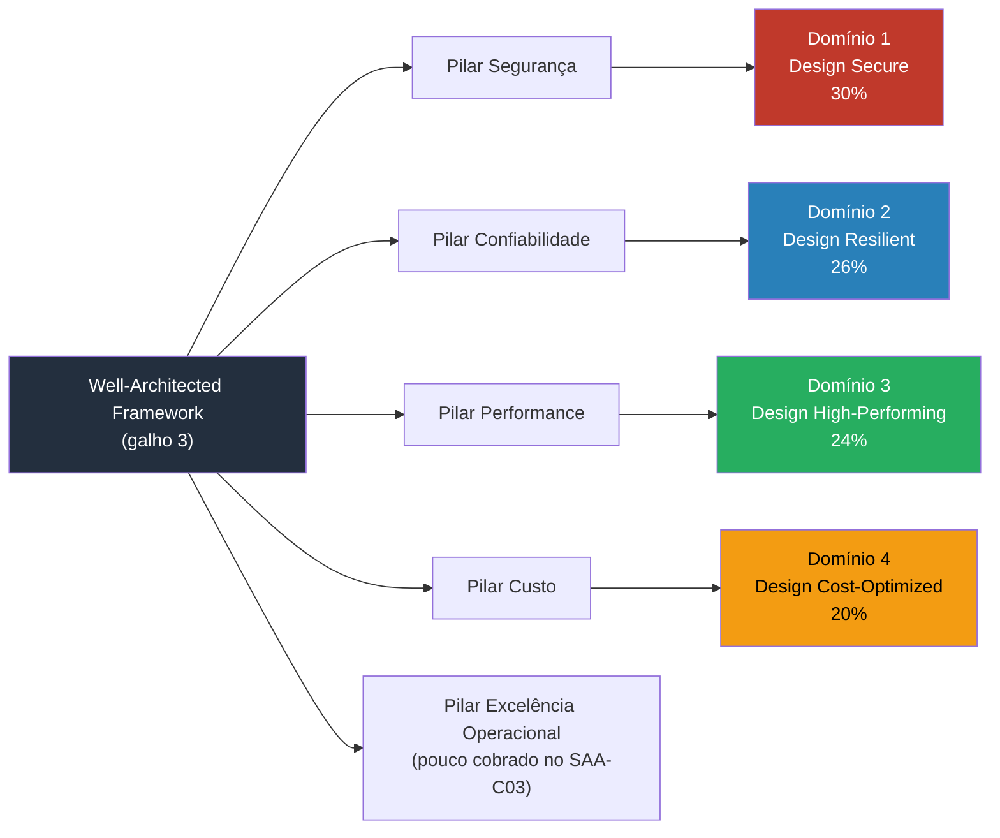
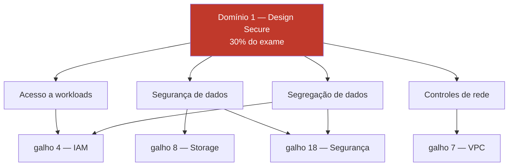

> [!abstract] TL;DR
> Abra o guia oficial do SAA-C03 pela primeira vez e a reação natural é achar que falta tudo — quatro domínios, dezenas de task statements, uma lista de serviços "in scope" que parece um livro à parte. Mas se você fez os 23 galhos anteriores desta trilha, você não está começando do zero: você já cobriu a espinha dorsal dos quatro domínios do exame — Secure, Resilient, High-Performing e Cost-Optimized — através do [[03-Dominios/Tecnologia/Cloud/03 - Well-Architected Framework/index|Well-Architected Framework]], do [[03-Dominios/Tecnologia/Cloud/04 - Identidade e acesso (IAM)/index|IAM]], das notas de compute, rede, storage, bancos, serverless, observabilidade, segurança, FinOps e resiliência. Esta nota é o mapa reverso: uma tabela-mestra galho→domínio→cobertura que prova que a distância entre "terminei a trilha" e "pronto pra prova" é bem menor do que parece — e aponta com honestidade as lacunas reais que sobram: profundidade em storage classes, tipos de load balancer, routing policies do Route 53, a árvore de decisão RDS/Aurora/DynamoDB, a escolha SQS/SNS/Kinesis e os serviços de migração, que a trilha tocou de raspão.

## O medo do guia de exame

Você termina o galho 23, fecha o notebook, e decide que é hora de ir atrás da certificação. Abre o [exam guide oficial do SAA-C03](https://docs.aws.amazon.com/aws-certification/latest/solutions-architect-associate-03/solutions-architect-associate-03.html) pela primeira vez — e a primeira reação é de vertigem. Quatro "content domains", cada um com uma lista de "task statements", cada task statement com uma lista de "knowledge" e "skills" esperadas. Depois vem a lista de serviços "in scope" — dezenas de siglas, algumas que você reconhece de cor, outras que nunca ouviu.

A pergunta que se instala é simples e um pouco cruel: *isso tudo é matéria nova?*

Não é. E a forma de provar isso não é reler o guia mais uma vez tentando decorar — é fazer o exercício inverso: pegar cada um dos 23 galhos que você já andou e perguntar, um a um, "onde isso aparece no blueprint do exame?". Quando você faz esse exercício até o fim, descobre um padrão que muda completamente o resto da preparação: a trilha inteira foi desenhada, sem que isso tenha sido anunciado explicitamente, em torno dos mesmos quatro eixos que a AWS usa pra avaliar um arquiteto de soluções. Não por coincidência — porque "arquitetar bem" e "passar no SAA-C03" são, em grande parte, a mesma competência vista de dois ângulos.

> [!info] Verificado em 2026-07-24
> Código do exame confirmado como **SAA-C03** (sem sinal de sucessor C04 anunciado). Pesos dos quatro domínios confirmados na página oficial do exam guide: **Design Secure Architectures 30%**, **Design Resilient Architectures 26%**, **Design High-Performing Architectures 24%**, **Design Cost-Optimized Architectures 20%**. Fonte: [AWS Certification — SAA-C03 exam guide](https://docs.aws.amazon.com/aws-certification/latest/solutions-architect-associate-03/solutions-architect-associate-03.html).

## O mecanismo: por que a trilha já mapeia o blueprint

Não é acaso. O [[03-Dominios/Tecnologia/Cloud/03 - Well-Architected Framework/index|galho 3 (Well-Architected Framework)]] introduziu, lá no início do Bloco 1, os pilares de Segurança, Confiabilidade, Excelência Operacional, Performance e Otimização de Custos — e os quatro domínios do SAA-C03 são, essencialmente, quatro desses pilares reagrupados numa lente de exame:

Todo o resto da trilha — IAM, compute, rede, storage, bancos, DNS/CDN, serverless, observabilidade, segurança, FinOps, resiliência — é a aplicação concreta desses pilares serviço por serviço. Ler o guia de exame é reler o mesmo mapa com nomes de task statement em vez de nomes de pilar.

## A tabela-mestra: galho → domínio → cobertura

Aqui está o exercício completo. "Cobertura" usa três níveis: **completa** (o galho te dá o que o exame pede sobre esse tópico, sem lacuna relevante), **parcial** (o galho ensinou o conceito, mas o exame cobra um nível de detalhe — uma tabela de decisão, um catálogo de opções — que a trilha não esgotou) e **fora do escopo** (o galho existe por outro motivo que não o exame, ou cobre território que o SAA-C03 não avalia).

| # | Galho | Domínio(s) do exame | Cobertura | Lacuna, se houver |
|--:|-------|---------------------|-----------|--------------------|
| 1 | O que é a nuvem, de verdade | (pré-requisito, todos) | completa | — |
| 2 | Anatomia de um provedor | (pré-requisito, todos) | completa | — |
| 3 | Well-Architected Framework | **todos** | completa | — |
| 4 | Identidade e acesso (IAM) | Secure | completa | detalhes finos de policy JSON, condition keys |
| 5 | Compute I — máquinas virtuais | High-Performing | parcial | famílias de instância além das citadas, Savings Plans vs RI (ver galho 19) |
| 6 | Compute II — elasticidade e balanceamento | High-Performing, Resilient | parcial | **tipos de ELB e quando usar cada um** |
| 7 | Rede na nuvem (VPC) | Secure, High-Performing | completa | — |
| 8 | Armazenamento (object, block, file) | High-Performing, Cost-Optimized | parcial | **S3 storage classes e lifecycle rules** |
| 9 | Bancos gerenciados | High-Performing, Resilient | parcial | **RDS vs Aurora vs DynamoDB, decisão** |
| 10 | DNS, CDN e borda | High-Performing | parcial | **Route 53 routing policies** |
| 11 | Serverless e FaaS — Lambda a fundo | Resilient, High-Performing | completa | — |
| 12 | Containers gerenciados | High-Performing, Resilient | parcial | ECS vs EKS vs Fargate, quando cada um |
| 13 | Mensageria e eventos gerenciados | Resilient, High-Performing | parcial | **SQS vs SNS vs Kinesis, decisão** |
| 14 | API Gateway e edge de aplicação | High-Performing, Secure | completa | — |
| 15 | Arquiteturas serverless e event-driven | Resilient, High-Performing | completa | — |
| 16 | Infrastructure as Code | Excelência Operacional | fora do escopo | pouco cobrado — exame não testa sintaxe de IaC |
| 17 | Observabilidade na cloud | Resilient | parcial | CloudWatch alarms compostos, métricas específicas por serviço |
| 18 | Segurança na cloud a fundo | Secure | completa | — |
| 19 | FinOps — a economia da cloud | Cost-Optimized | completa | — |
| 20 | Resiliência e continuidade | Resilient | completa | — |
| 21 | AWS a fundo | **todos** | completa | — |
| 22 | DigitalOcean a fundo | (fora do exame) | fora do escopo | SAA-C03 é AWS-only; útil como contraste, não pontua |
| 23 | Panorama multi-cloud e portabilidade | (fora do exame) | fora do escopo | idem |
| — | *(sem galho dedicado)* | Secure, High-Performing | **lacuna** | **serviços de migração — Snowball, DMS, Migration Hub, tocados de raspão** |

Contando: dos 24 pontos de blueprint relevantes (23 galhos + a lacuna de migração), **7 são cobertura completa direta de um único conceito central** (galhos 3, 4, 7, 11, 14, 15, 18, 19, 20, 21 — praticamente metade da trilha), **8 são cobertura parcial** que precisa de uma camada extra de detalhe, **2 são explicitamente fora do escopo do exame** (DO e multi-cloud, que existem por outro motivo pedagógico) e **1 é lacuna real**, os serviços de migração. Isso é a origem numérica do "~90%": a trilha te deu o modelo mental e a cobertura ampla; o que falta é profundidade pontual em meia dúzia de tabelas de decisão, mais um bloco de serviços que a trilha nunca teve razão de cobrir a fundo porque migração de dados legados é operação, não arquitetura nova.

> [!warning] O que a trilha genuinamente não cobriu
> Esta trilha foi desenhada pra ensinar arquitetura de nuvem do zero ao domínio, com AWS e DigitalOcean lado a lado — não pra ser um curso de certificação. Isso significa que alguns tópicos que o exame cobra por completo nunca tiveram uma nota dedicada: **AWS Snowball/Snowcone/Snowmobile** (transferência física de dados em volume), **AWS DMS (Database Migration Service)** e **AWS Migration Hub**, além de detalhes operacionais finos como **AWS Organizations e SCPs em multi-conta**, que apareceram de raspão no galho 18 mas sem o detalhe que o exame cobra. Não finja que já sabe esses tópicos — trate-os como matéria nova de verdade na revisão.

## Caso prático: seguindo o dinheiro no domínio Secure (30%)

Vale caminhar por um domínio inteiro pra ver o mapa funcionando na prática, porque 30% do peso do exame é o maior fatia individual — e é também o domínio mais "distribuído" pela trilha, o que confunde quem tenta estudar por checklist único.

O guia de exame lista, resumidamente, quatro grupos de task statement no Domínio 1: (1) segurança de acesso a workloads na nuvem, (2) segurança de dados, (3) definir controles de segurança de rede apropriados, (4) determinar controles apropriados de segregação de dados. Rastreando pra trás:

- **(1) Acesso** → quase inteiramente o [[03-Dominios/Tecnologia/Cloud/04 - Identidade e acesso (IAM)/index|galho 4]] — roles, policies, princípio do menor privilégio, federação.
- **(2) Dados** → cruza o [[03-Dominios/Tecnologia/Cloud/08 - Armazenamento (object, block e file)/index|galho 8]] (criptografia em repouso, bucket policies) com o galho 18 (KMS, criptografia em trânsito).
- **(3) Rede** → o [[03-Dominios/Tecnologia/Cloud/07 - Rede na nuvem (VPC)/index|galho 7]] inteiro: security groups, NACLs, subnets públicas/privadas, VPC endpoints.
- **(4) Segregação** → volta pro galho 4 (contas, organizations) com reforço do galho 18.

Nenhum desses quatro grupos exige nota nova — exige *reler* quatro galhos já escritos com a pergunta certa na cabeça: "o que aqui é exatamente o que o task statement pede?". É esse o valor prático do mapa: ele transforma "estudar segurança pro exame" (vago, assustador) em "revisar quatro seções específicas de quatro notas que você já tem" (finito, mensurável).

## Segundo caso: o domínio Cost-Optimized (20%) e o galho que já resolve quase tudo

Vale um segundo caminhado, mais curto, porque o padrão muda de figura: no Domínio 1 (Secure) a cobertura veio *distribuída* por quatro galhos diferentes. No Domínio 4 (Cost-Optimized), a cobertura vem quase inteira de um único galho — o que é uma boa notícia pra revisão, porque significa menos saltos entre notas.

O guia de exame agrupa o Domínio 4 em três blocos: (1) projetar soluções pra otimização de custo, (2) determinar estratégias de otimização de custo pra armazenamento, (3) determinar estratégias de otimização de custo pra compute, database e outros recursos. Rastreando:

- **(1) Soluções de custo em geral** → [[03-Dominios/Tecnologia/Cloud/19 - FinOps — a economia da cloud/index|galho 19]] quase inteiro — Reserved Instances vs Savings Plans vs Spot, tagging pra alocação, visibilidade via Cost Explorer.
- **(2) Storage** → cruza o galho 19 com a lacuna de storage classes do galho 8 — aqui é onde a lacuna dói mais, porque "otimizar custo de storage" na prática *é* saber mover objeto de Standard pra Glacier no momento certo via lifecycle rule.
- **(3) Compute/database/outros** → volta pro galho 5 (famílias de instância, Spot) e pro galho 9 (escolher o banco certo também é decisão de custo, não só de performance).

O padrão que emerge: quando um domínio do exame tem um galho "dono" claro (FinOps → Cost-Optimized, Segurança → Secure, Resiliência → Resilient), a revisão é rápida. Quando um domínio é *transversal* — como High-Performing, que puxa pedaços de compute, rede, storage, bancos, DNS e serverless ao mesmo tempo — a revisão exige mais saltos, e é exatamente aí que vivem a maioria das lacunas "parcial" da tabela-mestra.

## As lacunas em detalhe — o que cada uma realmente pede

A tabela-mestra resume cada lacuna numa frase. Vale abrir um pouco mais cada uma, porque "parcial" esconde naturezas bem diferentes de déficit — e saber a natureza do déficit já é meio caminho andado pra saber como estudar.

**S3 storage classes e lifecycle** (galho 8, domínios High-Performing + Cost-Optimized) — o galho 8 ensinou que S3 guarda objetos de forma durável e que existe diferença entre acesso frequente e infrequente. O que falta é o catálogo fino: Standard, Standard-IA, One Zone-IA, Intelligent-Tiering, Glacier Instant Retrieval, Glacier Flexible Retrieval, Glacier Deep Archive — cada uma com um perfil de latência de recuperação e custo de armazenamento diferente, e as regras de lifecycle que movem objetos automaticamente entre elas por idade.

**Tipos de ELB** (galho 6, domínios High-Performing + Resilient) — o galho 6 ensinou *que* balanceamento de carga existe e *por que* ele é necessário pra elasticidade. O que falta é a árvore de decisão entre Application Load Balancer (camada 7, roteamento por path/host), Network Load Balancer (camada 4, latência ultra-baixa, IP estático) e Gateway Load Balancer (inserção transparente de appliances de terceiros).

> [!tip] Assista: Which Type of Elastic Load Balancer Should I Use?
> **Canal:** Digital Cloud Training | **Duração:** ~6min | **Idioma:** EN
>
> Fecha exatamente esta lacuna: percorre ALB (camada 7, roteamento por path/host/query string), NLB (camada 4, latência ultra-baixa, TLS offloading) e GWLB, na mesma lente de "qual usar em qual cenário de prova" que o exame cobra. Trecho de destaque [01:48]: *"the NLB is really good for when you need ultra high performance and extremely low latency (...) so if you see exam questions asking for a very low latency load balancer it's likely to be the NLB"*
>
> 🎬 [Assistir no YouTube](https://www.youtube.com/watch?v=VFwLffElIgc)

**Route 53 routing policies** (galho 10, domínio High-Performing) — o galho 10 ensinou o que é DNS gerenciado e CDN. Falta o catálogo de routing policies: simple, weighted, latency-based, failover, geolocation, geoproximity, multivalue answer — cada uma resolvendo um cenário de distribuição de tráfego diferente.

**RDS vs Aurora vs DynamoDB** (galho 9, domínios High-Performing + Resilient) — o galho 9 ensinou a diferença entre banco relacional gerenciado e banco NoSQL gerenciado. Falta a árvore de decisão prática: quando o padrão de acesso pede SQL relacional tradicional (RDS), quando pede a mesma interface relacional mas com replicação e failover mais agressivos (Aurora), e quando o padrão de acesso é chave-valor/documento com escala horizontal massiva (DynamoDB).

**SQS vs SNS vs Kinesis** (galho 13, domínios Resilient + High-Performing) — o galho 13 ensinou fila e pub/sub como conceitos. Falta a decisão: SQS quando é fila ponto-a-ponto com um consumidor por mensagem, SNS quando é fan-out pra múltiplos assinantes, Kinesis quando é streaming ordenado de alto volume com múltiplos consumidores lendo o mesmo fluxo de forma independente.

> [!tip] Assista: Amazon SQS vs Kinesis: Choosing the Right AWS messaging service
> **Canal:** Cloud Explained | **Duração:** ~31min | **Idioma:** EN
>
> Compara os três lado a lado (event router vs event store) e nomeia o fan-out como o caso de uso clássico do SNS — a mesma distinção que esta nota pede pra fechar a lacuna. Vale assistir em trechos, não é preciso ver os 31 minutos inteiros. Trecho de destaque [03:14]: *"the most famous use case is fan out event so that is the SNS (...) you send one event, there will be subscribers to that particular event and they can receive this"*
>
> 🎬 [Assistir no YouTube](https://www.youtube.com/watch?v=VAQucLAAR8g)

**Migração** (sem galho dedicado, domínios Secure + High-Performing) — este é o único item que não é "aprofundar o que já existe", é matéria genuinamente nova: Snowball/Snowcone/Snowmobile pra transferência física de grandes volumes quando a rede é o gargalo, DMS pra migração de banco de dados com replicação contínua durante a transição, e Migration Hub como painel de acompanhamento de migrações em andamento.

## Como usar o mapa pra montar a revisão

O erro comum de quem termina uma trilha ampla e decide "agora vou estudar pro exame" é recomeçar do zero — reler tudo, linearmente, do galho 1 ao 23, como se nada tivesse sido internalizado. O mapa acima existe pra evitar exatamente isso. A estratégia de revisão que ele sugere tem três passos:

1. **Ignore as linhas "completa".** Se um galho já cobre um domínio por completo, revisá-lo de novo é tempo mal gasto perto da prova — releia só se a memória estiver genuinamente fraca, não por hábito.
2. **Ataque as linhas "parcial" com foco cirúrgico.** Você não precisa reler o galho 8 inteiro pra fechar a lacuna de storage classes — precisa de uma sessão de estudo dedicada só à tabela S3 Standard → Infrequent Access → Glacier → Deep Archive e às regras de lifecycle que movem objetos entre elas. O mesmo vale pra tipos de ELB (ALB vs NLB vs GLB), routing policies do Route 53 (simple, weighted, latency, failover, geolocation), a árvore de decisão RDS/Aurora/DynamoDB, e SQS vs SNS vs Kinesis.
3. **Trate a linha "lacuna" como matéria nova.** Migração (Snowball/DMS/Migration Hub) não tem atalho — é conteúdo que a trilha nunca ensinou, então exige leitura direta da documentação ou de um curso de exame dedicado.

Colocando isso em forma de plano — uma sessão de estudo por linha, priorizada pelo peso do domínio que ela afeta:

| Prioridade | Lacuna | Domínio afetado | Peso | Por quê primeiro/depois |
|--:|--------|------------------|-----:|--------------------------|
| 1 | RDS vs Aurora vs DynamoDB | High-Performing + Resilient | 24% + 26% | maior peso combinado, decisão testada em quase toda simulação |
| 2 | Tipos de ELB | High-Performing + Resilient | 24% + 26% | mesma combinação de peso, cenários muito recorrentes |
| 3 | SQS vs SNS vs Kinesis | Resilient + High-Performing | 26% + 24% | padrão de decisão idêntico ao anterior, reforça o hábito |
| 4 | S3 storage classes e lifecycle | High-Performing + Cost-Optimized | 24% + 20% | alto peso, mas mais mecânico (tabela pra memorizar, não árvore de decisão) |
| 5 | Route 53 routing policies | High-Performing | 24% | peso menor isolado, mas mecânico e rápido de fechar |
| 6 | Migração (Snowball/DMS/Hub) | Secure + High-Performing | 30% + 24% | peso alto, mas matéria genuinamente nova — reserve mais tempo, não deixe pro fim |

A próxima nota deste galho, sobre os serviços que o exame ama e as pegadinhas mais comuns, é exatamente essa lista "parcial + lacuna" transformada em conteúdo de estudo — ela pega cada uma das seis lacunas acima e resolve com o nível de detalhe que o exame de fato cobra, incluindo exemplos de cenário no estilo das questões reais.

## Armadilhas ao usar este mapa

> [!warning] "Cobertura completa" não é "memorizado"
> Marcar um galho como "completa" no mapa significa que o *conceito* está lá — não que você lembra de cor os detalhes na hora da prova. Se fez o galho 4 há dois meses, vale reler o índice e os pontos-chave antes de assumir que está pronto, mesmo estando na coluna "completa".

> [!warning] O exame testa decisão, não definição
> Muitas das lacunas listadas acima (ELB, Route 53, RDS/Aurora/DynamoDB, SQS/SNS/Kinesis) não são "conceitos que a trilha nunca mencionou" — são *decisões entre opções vizinhas* que o exame adora testar com um cenário de duas frases e cinco alternativas quase idênticas. Saber o que é um Network Load Balancer não é o mesmo que saber, dado um cenário de latência ultra-baixa em TCP puro, escolher NLB em vez de ALB em três segundos. É esse segundo tipo de conhecimento — comparativo, sob pressão de tempo — que fecha a lacuna real.

> [!warning] O peso dos domínios não é o peso do seu tempo de estudo
> Secure pesa 30%, o maior domínio — mas também é o domínio onde a trilha te deixou mais completo (galhos 4, 7, 8, 18 cobrem quase tudo). Cost-Optimized pesa só 20%, mas tem menos base prévia fora do galho 19. Priorize pelo produto peso × lacuna, não só pelo peso bruto do domínio.

## O que vem a seguir

Com o mapa em mãos, a próxima nota deste galho vira o binóculo pra dentro das lacunas: os serviços específicos que o exame SAA-C03 mais ama testar — e as pegadinhas clássicas que fazem candidatos experientes errarem questão de storage classes, tipos de load balancer, routing policies do Route 53, a escolha entre RDS/Aurora/DynamoDB e entre SQS/SNS/Kinesis. É a continuação direta da coluna "lacuna" desta tabela, agora com o nível de detalhe que a prova de fato exige.

## Fontes

- [AWS Certified Solutions Architect - Associate — página oficial da certificação](https://aws.amazon.com/certification/certified-solutions-architect-associate/)
- [AWS Certification — SAA-C03 exam guide (content domains e weightings)](https://docs.aws.amazon.com/aws-certification/latest/solutions-architect-associate-03/solutions-architect-associate-03.html)
