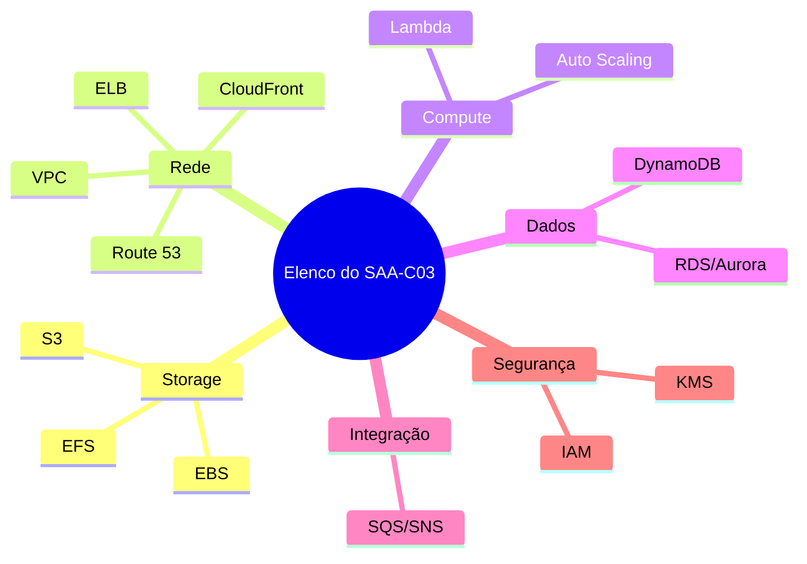
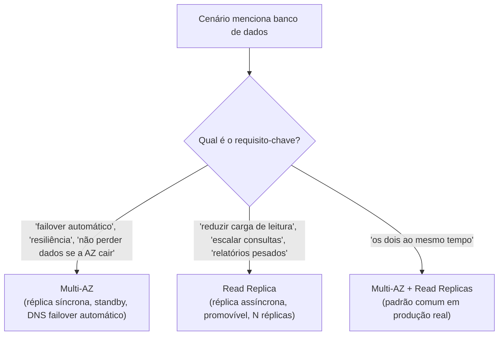
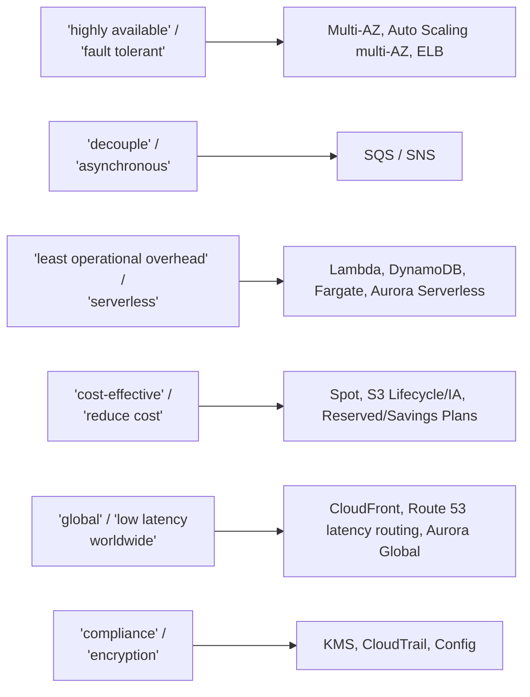

> [!abstract] TL;DR
> O SAA-C03 não testa a AWS inteira — ele testa uma dúzia de serviços, repetidos em roupagens diferentes, e um punhado de *padrões de pegadinha* que se repetem cenário após cenário. Quem decora "Multi-AZ é HA, Read Replica é performance" e treina o olho pra palavras-gatilho como *"highly available"*, *"decouple"* e *"least operational overhead"* já resolve metade da prova antes de ler a segunda frase da questão.

## O problema: 65 questões, infinitos disfarces

Sente numa mesa de exame virtual (ou num centro de testes) e você recebe 65 questões em 130 minutos — pouco menos de dois minutos por questão, contando o tempo de ler um cenário de cinco a oito linhas antes mesmo de olhar as alternativas.

> [!info] Verificado 2026-07-24
> Formato confirmado na página oficial: 65 questões (múltipla escolha ou múltipla resposta), 130 minutos, USD 150, validade de 3 anos. Passing score (geralmente 720/1000 em escala) e o peso exato de cada domínio variam entre versões do guia oficial — confira o *exam guide* PDF vigente antes da prova, ele muda mais que a página de marketing.

A primeira sensação de quem já estudou a trilha inteira — os 23 galhos anteriores deste domínio Cloud — é de excesso: tem gente, filas, bancos, rede, IAM, storage, tudo junto. Mas aí vem o alívio: a prova não pergunta sobre a AWS inteira. Ela pergunta, repetidamente, sobre um elenco fixo de "atores principais", vestidos com um cenário de negócio diferente a cada questão. Uma vez que você reconhece o ator por trás da fantasia, a questão vira exercício de eliminação, não de conhecimento enciclopédico.

Essa nota é o elenco — e o roteiro das armadilhas que o exame usa pra testar se você reconhece o ator ou só decorou nomes.

## Os "queridinhos": por que esses e não outros

Repare no padrão: quase todo serviço "queridinho" do exame é **gerenciado**, tem uma **dimensão de trade-off explícita** (custo vs performance, disponibilidade vs custo, latência vs consistência) e aparece em **mais de um domínio do blueprint** ao mesmo tempo. Isso não é acaso — é exatamente o tipo de serviço que gera uma boa questão de arquitetura: tem decisão real embutida.

### Tabela mestra: serviço → por que o exame ama → pegadinha típica

| Serviço | Por que o exame ama | Pegadinha típica |
|---|---|---|
| **S3** | Base de quase todo cenário de storage/backup/dados estáticos | Confundir classe de storage (Standard vs IA vs Glacier) com o requisito de acesso; esquecer que versioning é pré-requisito de replicação cross-region |
| **VPC** | Rede é pré-requisito silencioso de HA e segurança | Achar que NAT Gateway dá IP público de entrada (ele só permite saída); confundir subnet privada com "sem internet" |
| **Security Group vs NACL** | Par clássico de "quase iguais, mas não são" | SG é *stateful* (resposta volta sem regra explícita), NACL é *stateless* (precisa regra de saída também); SG só permite (allow), NACL permite e nega |
| **IAM (roles vs users, policies)** | Segurança é ~30% do exame — quase todo cenário toca IAM | Usar IAM User com access key onde a resposta certa é IAM Role (permissão temporária, sem credencial fixa) |
| **ELB (ALB/NLB/GWLB)** | Testa se você sabe a camada certa pro requisito | ALB (camada 7, HTTP/HTTPS, path-based routing) vs NLB (camada 4, altíssima performance/IP estático) — cenário troca "preciso de latência ultrabaixa" por ALB errado |
| **Auto Scaling** | Elasticidade é tema central de "cost-optimized" e "resilient" | Confundir scaling policy (target tracking vs step vs scheduled) com o gatilho descrito no cenário |
| **RDS Multi-AZ vs Read Replica** | *A* pegadinha mais repetida do exame inteiro | Ver "alta disponibilidade / failover automático" e responder Read Replica (errado — isso é Multi-AZ); ver "reduzir carga de leitura / performance" e responder Multi-AZ (errado — isso é Read Replica) |
| **Aurora** | "RDS turbinado" com replicação e failover mais rápidos | Achar que Aurora Global Database é a resposta padrão pra qualquer HA (ela é pra *multi-region*, não HA dentro de uma região) |
| **DynamoDB** | NoSQL gerenciado, serverless por natureza | Confundir capacidade provisionada com on-demand quando o cenário pede "tráfego imprevisível" |
| **SQS / SNS** | *O* par de desacoplamento — testa arquitetura event-driven | Confundir fila (SQS, ponto a ponto, pull) com tópico (SNS, pub/sub, push); esquecer SQS FIFO quando o cenário exige ordem |
| **Lambda** | Serverless é resposta-padrão pra "least operational overhead" | Ignorar limite de timeout (15 min) e cold start quando o cenário descreve processamento longo |
| **CloudFront** | CDN é resposta quase automática pra "melhorar performance global" | Esquecer que CloudFront também serve como camada de segurança (com WAF/Shield) além de cache |
| **Route 53** | Routing policies são um mini-blueprint dentro do exame | Confundir Weighted (split de tráfego por peso) com Latency-based (rota pro endpoint mais rápido) com Failover (rota pro secundário só se o primário cair) |
| **KMS** | Encryption at rest/in transit permeia o domínio de segurança | Confundir CMK gerenciada pelo cliente com a gerenciada pela AWS quando o cenário exige rotação/controle de política customizado |
| **EBS vs EFS vs S3** | Testa se você sabe a categoria certa de storage | Usar EBS (block, uma instância) onde o cenário pede acesso compartilhado entre múltiplas instâncias (isso é EFS) |

> [!info] Verificado 2026-07-24
> Limites e comportamentos específicos (timeout do Lambda, classes de storage do S3, políticas de routing do Route 53) foram tratados em profundidade nos galhos de mecânica desta trilha (galhos 08, 10 e 11). Esta nota assume esse conhecimento prévio e foca no *reconhecimento de padrão* pra prova — releia os galhos de origem se algum item da tabela soar novo.

## Os padrões de pegadinha: o roteiro por trás das fantasias

Depois de algumas centenas de questões de prática, um padrão salta aos olhos: o exame não inventa armadilhas novas a cada questão. Ele reusa um punhado de estruturas de confusão, só trocando o serviço.

### 1. Multi-AZ vs Read Replica — a pegadinha-mãe

Essa é a mais citada por quem já fez a prova, e por um motivo simples: os dois mecanismos do RDS resolvem problemas diferentes, mas soam parecidos porque ambos envolvem "outra cópia do banco em outro lugar".

A régua mental: **Multi-AZ existe pra você não perceber que algo quebrou** (é sobre disponibilidade — a réplica standby não aceita leitura direta, só assume em failover). **Read Replica existe pra você distribuir leitura** (é sobre performance — a réplica é assíncrona, pode ficar atrás em replicação, e você escolhe promovê-la manualmente se quiser).

> [!tip] Assista: SAA-C03 Part 11: RDS, RDS Multi-AZ vs Read Replicas & Aurora AWS Solutions Architect Exam Prep
> **Canal:** TechBytes by Sam | **Duração:** ~12min | **Idioma:** EN
>
> Resolve, no formato de questão-comentada, exatamente esta pegadinha-mãe — mesmo padrão de cenário "alta disponibilidade + escala de leitura" que a nota usa, com a explicação técnica do porquê (síncrono vs assíncrono). Trecho de destaque [01:01]: *"Multi-AZ deployments provide synchronous replication to a standby instance in a different availability zone, ensuring high availability and automatic failover. Read replicas are designed for scaling read-heavy database workloads by providing asynchronous copies"*
>
> 🎬 [Assistir no YouTube](https://www.youtube.com/watch?v=VQ4rKQ08C3I)

### 2. Security Group (stateful) vs NACL (stateless)

O segundo par mais confundido. A régua: SG lembra que deixou o tráfego sair, então libera a resposta de volta sem regra explícita. NACL não lembra nada — se você libera entrada na porta 443, precisa liberar *saída* também (geralmente numa porta efêmera alta, tipo 1024-65535), senão a resposta trava.

> [!tip] Assista: Difference between NACL vs Security Group
> **Canal:** Byte Novus | **Duração:** ~11min | **Idioma:** EN
>
> Reforça a mesma régua stateful/stateless desta nota com exemplo de IP específico — bom pra fixar por que "liberar entrada" numa NACL não libera a saída da resposta automaticamente, ao contrário do Security Group. Trecho de destaque [06:43]: *"nacl is stateless where a security group is a stateful (...) in nacl, for a specific IP address, only inbound is allowed but the outbound is not allowed (...) whereas in security group it is stateful"*
>
> 🎬 [Assistir no YouTube](https://www.youtube.com/watch?v=32RRUEv-yt4)

### 3. "A resposta mais barata que atende o requisito" vs superdimensionar

Um terço das questões de "cost-optimized" tem uma alternativa tecnicamente correta mas cara (ex.: Provisioned IOPS onde gp3 resolve, Multi-AZ onde só backup automatizado é exigido, On-Demand onde Spot serve). A régua: leia o requisito até o fim antes de escolher — se ele não pede o SLA mais alto, a resposta mais cara geralmente está errada.

### 4. "Gerenciado" quase sempre vence "você operando"

Entre RDS e "EC2 rodando MySQL", entre Lambda e "EC2 rodando um cron job", entre ECS Fargate e "EC2 com Docker manual" — o exame SAA-C03, alinhado ao Well-Architected Framework, quase sempre recompensa a opção gerenciada quando o cenário menciona operação, manutenção ou equipe enxuta.

### 5. Palavras-gatilho: o dicionário secreto da prova

> [!warning] A palavra-gatilho não é garantia — é hipótese de trabalho
> Um cenário pode conter "highly available" e ainda assim a resposta certa ser sobre outro aspecto se o resto do texto contradisser a leitura óbvia. A palavra-gatilho é o primeiro filtro pra eliminar alternativas obviamente erradas, não uma regra que dispensa ler a questão inteira. Quem responde só pela palavra-chave sem checar as restrições do cenário (orçamento, latência, compliance) cai nas questões desenhadas justamente pra pegar esse atalho.

## Como ler uma questão de cenário

O texto de uma questão SAA-C03 segue quase sempre a mesma anatomia: contexto de negócio (2-4 linhas) → restrição ou requisito explícito (1-2 linhas, geralmente a frase mais importante) → pergunta ("qual solução... com o MENOR esforço operacional / MENOR custo / MAIOR disponibilidade"). O erro mais comum de quem estuda pouco tempo de prova é responder ao contexto, não à restrição.

Um roteiro de leitura que funciona:

1. **Ache a pergunta primeiro** (geralmente a última frase) — ela diz qual variável otimizar: custo, HA, performance ou segurança. Isso já elimina metade das alternativas.
2. **Ache a restrição explícita** no meio do texto — "sem trocar código", "sem downtime", "orçamento limitado", "picos de tráfego imprevisíveis". Ela costuma invalidar a alternativa "óbvia".
3. **Elimine as distratoras estruturais**: alternativas que resolvem um problema diferente do perguntado (ex.: oferecem performance quando a pergunta era sobre custo) saem primeiro, mesmo que sejam tecnicamente corretas em outro contexto.
4. **Entre as sobreviventes, aplique a régua do gerenciado/mais simples**: se duas alternativas resolvem o mesmo requisito, a mais gerenciada e a que exige menos operação geralmente vence.

### Exemplo ilustrativo (questão inventada pra praticar o método)

> Uma empresa roda um e-commerce em uma única instância EC2 atrás de um Application Load Balancer. Durante picos de tráfego sazonais, os clientes relatam lentidão no checkout. A equipe quer garantir que, se a instância atual falhar, o sistema continue disponível sem intervenção manual, mas sem aumentar significativamente o custo operacional em dias normais. Qual solução atende ao requisito com o MENOR esforço operacional?
>
> A. Criar uma segunda instância EC2 manualmente em outra AZ e configurar failover via script B. Colocar a instância em um Auto Scaling Group com mínimo de 2 instâncias em AZs diferentes, atrás do ALB existente C. Migrar o e-commerce para uma única instância EC2 maior (vertical scaling) D. Configurar Multi-AZ no RDS que dá suporte à aplicação

**Resolvendo pelo roteiro**: a pergunta pede "menor esforço operacional" + "sem intervenção manual" + "sem aumentar custo em dias normais". A restrição elimina C (não resolve falha de instância, só aumenta capacidade de uma única) e D (Multi-AZ é sobre o banco, não sobre a camada de aplicação que o cenário descreve). Entre A e B, A tem "script" e "manualmente" — contradiz "sem intervenção manual" e "menor esforço operacional". B é gerenciado (Auto Scaling Group), cobre falha de AZ automaticamente, e escala só quando necessário (custo normal em dias normais). **Resposta: B.**

> [!warning] Armadilhas de quem já sabe a matéria
> Curiosamente, quem domina o conteúdo técnico às vezes erra mais que quem decorou o padrão — porque enxerga soluções tecnicamente válidas demais e hesita entre alternativas corretas em teoria. O exame não pergunta "qual solução funciona", pergunta "qual solução o Well-Architected Framework recomendaria dado ESSE requisito específico". Ignorar a restrição explícita em favor de uma solução "mais robusta" é o erro clássico de quem sabe cloud de verdade mas ainda não calibrou pro formato da prova.

## Mais pares confusos que o exame explora

A tabela mestra cobre o elenco inteiro, mas alguns pares merecem uma segunda passada porque aparecem sob disfarces diferentes em questões separadas — o exame raramente pergunta "qual a diferença entre X e Y" de forma direta; ele descreve um cenário e espera que você *reconheça* qual dos dois se encaixa.

### ALB vs NLB vs Gateway Load Balancer

Os três Elastic Load Balancers do catálogo atual resolvem problemas de camadas diferentes do modelo OSI, e o exame adora testar se você sabe identificar a camada certa pelo *sintoma* descrito no cenário, não pelo nome do produto:

- **Application Load Balancer (ALB)** opera na camada 7 (HTTP/HTTPS). Aparece quando o cenário menciona roteamento por path (`/api` vs `/static`), por host header (multi-tenant), ou por tipo de conteúdo. É a resposta-padrão pra "aplicação web moderna com múltiplos microsserviços atrás do mesmo domínio".
- **Network Load Balancer (NLB)** opera na camada 4 (TCP/UDP). Aparece quando o cenário menciona "latência ultrabaixa", "milhões de requisições por segundo", "IP estático" ou protocolos não-HTTP (ex.: um serviço de gaming via UDP). É fácil confundir com ALB porque ambos "balanceiam carga" — a diferença está no vocabulário de performance extrema e protocolo.
- **Gateway Load Balancer (GWLB)** é o menos citado dos três, e aparece quase exclusivamente em cenários de "appliance de terceiros" — firewall virtual, IDS/IPS — que precisa inspecionar tráfego de forma transparente antes dele chegar ao destino final. Se o cenário menciona "appliance de segurança de rede" no meio do fluxo, é GWLB, não ALB nem NLB.

### EBS vs EFS vs S3 — a régua de granularidade

Um erro recorrente de quem já domina o conteúdo em teoria, mas erra no automático da prova: tratar "armazenamento" como uma categoria única. O exame testa a granularidade:

- **EBS** é *block storage* preso a uma única instância EC2 por vez (mesmo com Multi-Attach, que é exceção rara e vale mencionar só se o cenário citar explicitamente um cluster que precisa dele). Se o cenário fala em "volume de disco da instância", "IOPS provisionados" ou "snapshot", é EBS.
- **EFS** é *file storage* elástico, acessível por múltiplas instâncias simultaneamente via NFS. Se o cenário menciona "vários servidores web precisam acessar os mesmos arquivos" ou "sistema de arquivos compartilhado", é EFS — e essa é a pegadinha mais comum do trio: candidatos que sabem EBS de cor tentam encaixar EBS num cenário de acesso compartilhado, que ele simplesmente não suporta na prática comum.
- **S3** é *object storage*, sem hierarquia real de diretórios (a "pasta" é ilusão da console), acessado via API HTTP, não via sistema de arquivos montado. Se o cenário fala em "site estático", "data lake", "backup de longo prazo" ou qualquer verbo HTTP (GET/PUT via aplicação), é S3.

### S3: classes de storage e o vocabulário de frequência de acesso

Dentro do próprio S3, o exame gosta de testar se você mapeia "frequência de acesso descrita em prosa" pra classe de storage:

| Vocabulário do cenário | Classe indicada |
|---|---|
| "acessado frequentemente, precisa de latência baixa" | S3 Standard |
| "acessado raramente, mas precisa estar disponível em milissegundos quando pedido" | S3 Standard-IA ou One Zone-IA (se tolera perder uma AZ) |
| "padrão de acesso imprevisível, quer otimização automática" | S3 Intelligent-Tiering |
| "arquivo regulatório, recuperação em minutos a horas está OK" | S3 Glacier Flexible Retrieval |
| "arquivo morto, recuperação em até 12h é aceitável, custo mínimo" | S3 Glacier Deep Archive |

> [!warning] Lifecycle sem versioning é meio-caminho
> Uma pegadinha específica de S3: o cenário pede replicação cross-region (CRR) e o candidato monta a arquitetura certa — exceto que esqueceu que **CRR exige versioning habilitado no bucket de origem e destino**. Se uma alternativa da questão "configura CRR" sem mencionar versioning, ou se o cenário diz "o bucket não tem versioning e não pode ter" (raro, mas acontece em questões de restrição), a resposta certa provavelmente não é CRR direto — pode ser S3 Batch Operations ou outra rota.

## Domínio por trás da pegadinha — de volta à trilha

Cada par confuso desta nota tem uma nota-mãe nesta trilha onde o mecanismo foi ensinado em profundidade — a pegadinha só existe porque a prova comprime, em uma frase, uma decisão que a trilha levou uma nota inteira pra justificar. Vale a pena, ao errar uma questão de simulado, voltar à nota de origem em vez de só memorizar a resposta certa daquele item:

- RDS Multi-AZ vs Read Replica → galho 09 (Bancos gerenciados)
- Security Group vs NACL → galho 07 (Rede na nuvem / VPC)
- ALB vs NLB vs GWLB → galho 06 (Compute II — elasticidade e balanceamento)
- SQS vs SNS → galho 13 (Mensageria e eventos gerenciados)
- Route 53 routing policies e CloudFront → galho 10 (DNS, CDN e borda)
- IAM roles vs users, KMS → galho 04 (Identidade e acesso) e galho 18 (Segurança na cloud a fundo)
- EBS vs EFS vs S3 → galho 08 (Armazenamento)

Esse mapeamento nota-a-nota mais completo, cobrindo os 23 galhos anteriores e os quatro domínios do blueprint, é o assunto da nota 03 deste galho ("Mapa da trilha ao blueprint") — se você ainda não passou por ela, vale revisitar antes de simular a prova a sério.

## Segundo exemplo ilustrativo: desacoplamento e custo

> Uma aplicação de processamento de imagens recebe uploads de usuários e precisa redimensioná-los de forma assíncrona. Em horários de pico, o volume de uploads é 20x maior que em horários normais, e picos inesperados às vezes fazem a fila de processamento crescer sem controle, derrubando o serviço downstream. A solução deve absorver picos sem perder uploads e sem exigir que a equipe gerencie servidores.
>
> A. Escrever os uploads direto em uma instância EC2 que processa a fila em memória B. Publicar cada upload em um tópico SNS que aciona diretamente uma função Lambda de redimensionamento C. Enviar cada upload para uma fila SQS Standard; uma função Lambda consome a fila com concorrência controlada D. Escrever os uploads em uma tabela DynamoDB e rodar um cron job em EC2 que varre a tabela a cada minuto

**Resolvendo pelo roteiro**: a restrição-chave é "absorver picos sem perder uploads" + "sem gerenciar servidores". A elimina-se de cara (servidor gerenciado manualmente, sem buffer — "decouple" gritando na cara do candidato). D elimina-se por "cron job em EC2" (servidor gerenciado) e por polling ineficiente. Entre B e C, a diferença é sutil e é exatamente o tipo de nuance que separa quem decorou "SNS = desacoplar" de quem entende o mecanismo: SNS entrega diretamente ao Lambda sem buffer — se o Lambda não conseguir processar no ritmo do pico, o SNS não segura a carga do jeito que uma fila segura. SQS, por ser uma fila real com profundidade configurável, absorve o pico e permite controlar a concorrência do Lambda (via configuração de concorrência reservada), evitando que o downstream seja sobrecarregado. **Resposta: C.**

> [!warning] SNS não é fila — é distribuição
> A confusão SQS/SNS mais perigosa não é "qual dos dois desacopla" (os dois desacoplam), é "qual dos dois amortece picos de carga". SNS entrega no ritmo em que os assinantes conseguem receber, mas não tem o conceito de "profundidade de fila" que segura mensagens em espera indefinidamente do mesmo jeito que SQS segura (SQS Standard guarda mensagens por até 14 dias configuráveis). Quando o cenário menciona explicitamente "amortecer pico" ou "buffer", SQS quase sempre vence SNS puro — a arquitetura combinada (SNS fan-out para múltiplas filas SQS) é o padrão mais robusto e também aparece em questões avançadas.

## E a lente DigitalOcean, nesta nota?

Esta trilha manteve a lente dupla AWS ↔ DigitalOcean do galho 01 ao galho 23 de propósito: entender o mesmo conceito em dois provedores prova que você entende o *conceito*, não decorou um SDK. Mas essa nota é uma exceção honesta — o SAA-C03 é um exame de certificação **da AWS**, sobre **produtos da AWS**, com nomenclatura e limites **da AWS**. Não existe pegadinha de prova sobre "Managed Database vs Standby Node" da DigitalOcean, porque a prova não pergunta sobre DigitalOcean.

O valor da lente dupla aqui é indireto: se você já entende por que o Managed Database da DO tem *standby node* (equivalente conceitual ao Multi-AZ do RDS) mas não tem um análogo direto de *read replica* com a mesma profundidade de configuração que a AWS oferece, você já internalizou a diferença entre "alta disponibilidade" e "escala de leitura" — que é exatamente o eixo conceitual por trás da pegadinha Multi-AZ vs Read Replica. A trilha DO fez o trabalho de generalização; esta nota só cobra o vocabulário específico da AWS de volta.

> [!info] Onde a DO diverge de verdade (não é pegadinha de prova, é honestidade de arquitetura)
> A DigitalOcean não replica o catálogo da AWS ponto a ponto — não há Gateway Load Balancer, não há KMS com a granularidade de política do IAM da AWS, e o Spaces (equivalente a S3) tem só duas classes de armazenamento contra as ~7 classes do S3. Isso não afeta a prova SAA-C03, mas afeta qualquer decisão real de arquitetura fora da prova — e é por isso que o galho 23 (Panorama multi-cloud e portabilidade) desta trilha existe: pra você saber quando um padrão AWS não tem tradução direta em outro provedor.

## Tradução de nomes: Azure e GCP (referência, não hands-on)

Fora do escopo da prova, mas útil pra quem transita entre provedores em conversas de arquitetura ou entrevistas — a tabela abaixo é só tradução de rótulo, não implica paridade funcional completa:

| Conceito | AWS | Azure | GCP | DigitalOcean |
|---|---|---|---|---|
| Object storage | S3 | Blob Storage | Cloud Storage | Spaces |
| Load balancer L7 | ALB | Application Gateway | Cloud Load Balancing (HTTP(S)) | DO Load Balancer |
| Banco relacional gerenciado | RDS / Aurora | Azure SQL Database | Cloud SQL / AlloyDB | Managed Database (PostgreSQL/MySQL) |
| Fila gerenciada | SQS | Azure Queue Storage / Service Bus | Pub/Sub | (sem produto nativo equivalente) |
| Função serverless | Lambda | Azure Functions | Cloud Functions | Functions (DO Functions) |
| Identidade e acesso | IAM | Microsoft Entra ID (ex-Azure AD) + RBAC | Cloud IAM | Teams + API Tokens (modelo mais simples) |
| CDN | CloudFront | Azure CDN / Front Door | Cloud CDN | (integrado via Spaces CDN, mais limitado) |

## Onde cada pegadinha pesa mais no blueprint

Nem toda pegadinha vale o mesmo peso na prova. O exam guide oficial do SAA-C03 define cinco domínios (não quatro, como versões antigas do material de marketing às vezes sugerem):

> [!info] Verificado 2026-07-24 — pesos oficiais do exam guide
> Design Resilient Architectures 26% · Design Secure Applications and Architectures 25% · Design High-Performing Architectures 24% · Design Cost-Optimized Architectures 13% · Accelerate Workload Migration and Modernization 12%. Se você viu em algum lugar a divisão "30/26/24/20" em quatro domínios, é uma versão desatualizada — confira a nota 02 deste galho ("Os quatro domínios do blueprint") pra reconciliar esse número com o exam guide vigente antes de montar seu plano de estudo.

Isso explica o peso relativo das pegadinhas desta nota: **Multi-AZ vs Read Replica** e **SG vs NACL** vivem majoritariamente no domínio Resilient (26%) e Secure (25%) — juntos, mais da metade da prova. **ALB vs NLB** e **EBS vs EFS vs S3** aparecem tanto em Resilient quanto em High-Performing (24%). As pegadinhas de "resposta mais barata" concentram-se no domínio Cost-Optimized, que pesa menos (13%) do que a intuição de quem já trabalhou com FinOps na prática sugeriria — vale calibrar o tempo de estudo proporcionalmente, não pelo quanto o tema importa no mundo real.

## O que vem a seguir

Reconhecer o elenco e o roteiro de pegadinhas é munição — mas munição sem estratégia de tempo e de eliminação sistemática ainda perde prova. A próxima nota deste galho fecha esse ciclo: como gerenciar os 130 minutos, quando marcar pra revisão e seguir em frente, e como usar eliminação estruturada quando duas alternativas parecem igualmente certas.

## Fontes

- AWS. "AWS Certified Solutions Architect - Associate." https://aws.amazon.com/certification/certified-solutions-architect-associate/ (verificado 2026-07-24)
- AWS Documentation. "Amazon RDS Multi-AZ deployments." https://docs.aws.amazon.com/AmazonRDS/latest/UserGuide/Concepts.MultiAZ.html
- AWS Documentation. "Working with read replicas." https://docs.aws.amazon.com/AmazonRDS/latest/UserGuide/USER_ReadRepl.html
- AWS Documentation. "Security groups for your VPC." https://docs.aws.amazon.com/vpc/latest/userguide/vpc-security-groups.html
- AWS Documentation. "Network ACLs." https://docs.aws.amazon.com/vpc/latest/userguide/vpc-network-acls.html
- AWS Documentation. "What is Elastic Load Balancing?" https://docs.aws.amazon.com/elasticloadbalancing/latest/userguide/what-is-load-balancing.html
- AWS Documentation. "Choosing a routing policy — Amazon Route 53." https://docs.aws.amazon.com/Route53/latest/DeveloperGuide/routing-policy.html
- AWS Well-Architected Framework. https://docs.aws.amazon.com/wellarchitected/latest/framework/welcome.html
