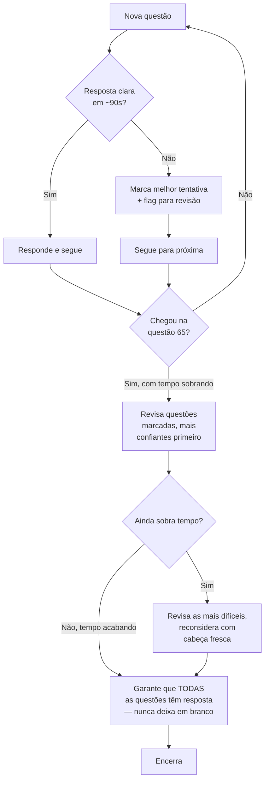

> [!abstract] TL;DR
> Saber os serviços não é a mesma coisa que passar na prova. O SAA-C03 tem 65 questões (50 valem nota, 15 são piloto não identificadas) em 130 minutos — cerca de 2 minutos por questão — e quase toda pergunta tem duas alternativas óbvias erradas e duas plausíveis. A técnica que separa quem passa de quem não passa não é decorar mais serviço: é ler o requisito-chave, eliminar rápido, marcar-e-revisar sem travar, nunca deixar questão em branco e chegar no dia com simulados batendo 80%+ de acerto.

## O problema: você sabe a matéria e ainda assim trava

Imagine duas pessoas estudando para o SAA-C03. Ambas leram sobre EC2, S3, RDS, VPC, leram sobre Multi-AZ e Auto Scaling, fizeram os labs. Na hora da prova, uma termina com 40 minutos sobrando e passa com folga. A outra trava na questão 12, releem o mesmo parágrafo três vezes, o relógio começa a pesar, e ela termina os 130 minutos correndo, adivinhando as últimas dez questões — e reprova por poucos pontos, apesar de saber tanto quanto a primeira.

A diferença não foi conhecimento. Foi **mecânica de prova**. O SAA-C03 não é um teste de "você sabe o que é X", é um teste de "dado um cenário com restrições concorrentes (custo, disponibilidade, performance, operação), você identifica a opção que atende ao requisito-chave enunciado, dentro de um orçamento de tempo apertado, sem se deixar levar por alternativas tecnicamente corretas mas fora de escopo". Isso é uma habilidade separada — e treinável.

Esta nota assume que você já cobriu o conteúdo (galhos 1-23) e já mapeou o blueprint (notas 02, 03 e 04 deste galho). Aqui a pergunta muda: você senta na cadeira, o cronômetro começa, e o que você faz nos próximos 130 minutos?

> [!info] Verificado 2026-07-24 — formato e logística do exame
> AWS Certified Solutions Architect – Associate (**SAA-C03**): 65 perguntas (múltipla escolha ou múltipla resposta), **130 minutos**, custo **USD 150**, validade **3 anos**. Fonte: página oficial do exame (aws.amazon.com/certification/certified-solutions-architect-associate). A AWS não publica a nota de corte exata — o placar é escalado de 100 a 1000 e "definido por análise estatística, sujeito a mudança" (FAQ oficial); o valor 720/1000 circula amplamente na comunidade como referência histórica, mas trate como estimativa, não fato garantido pela AWS. Reprovou: espera obrigatória de **14 dias corridos** pra tentar de novo, sem limite de tentativas (mas cada tentativa é paga). Passou: só pode refazer o mesmo exame depois de **2 anos**.

## Gestão de tempo: o relógio é seu adversário mais previsível

Fazendo a conta simples: 130 minutos para 65 questões dá **exatamente 2 minutos por questão**, em média. Mas "em média" é a palavra chave — algumas questões você resolve em 30 segundos (o requisito é óbvio, você conhece o serviço de cabeça), outras vão exigir 3-4 minutos de leitura cuidadosa de um cenário longo com quatro parágrafos de contexto.

A tática que funciona é **flag-and-review** (marcar e revisar): toda plataforma de exame AWS (Pearson VUE, PSI) tem um botão de "marcar para revisão". A regra prática:

1. Leia a questão uma vez. Se em ~90 segundos você não convergiu para uma resposta com confiança razoável, **marque sua melhor tentativa atual**, ative o flag, e siga em frente.
2. Nunca fique mais de 3 minutos numa única questão na primeira passada. O custo de travar numa questão difícil não é só o tempo perdido nela — é o tempo que falta nas 10 questões fáceis do fim da prova que você nem vai ler direito.
3. Terminada a primeira passada pelas 65, você sabe exatamente quanto tempo sobrou e quantas ficaram marcadas. Reparta esse tempo entre as marcadas, das mais confiantes para as menos confiantes.
4. Nos últimos 5 minutos, garanta que **nenhuma questão ficou sem resposta** — mesmo um chute informado vale mais que branco (mais adiante, por quê).

Uma coisa que ninguém avisa: revisar demais também é armadilha. Trocar uma resposta na segunda passada sem uma razão concreta nova (releu o enunciado e viu um detalhe que passou batido, não "mudei de ideia porque fiquei inseguro") tende a piorar mais do que melhorar — a primeira leitura, feita com a cabeça fresca, costuma capturar melhor o requisito-chave do que a segunda, já cansada.

## Técnica de eliminação: as duas descartáveis e as duas na dúvida

Um padrão quase universal nas questões de certificação AWS: das quatro alternativas, **duas costumam ser eliminação óbvia** — usam um serviço errado para o caso de uso (ex.: propor DynamoDB para uma carga transacional relacional com JOINs complexos), ou violam um princípio básico do Well-Architected (colocar credenciais hardcoded, por exemplo). Essas você descarta em segundos.

Sobram duas alternativas **plausíveis** — ambas tecnicamente corretas, ambas resolveriam o problema de alguma forma. É aqui que a prova te testa de verdade. A técnica é achar o **discriminador**: a palavra ou frase no enunciado que empurra para uma das duas. Os discriminadores mais comuns no SAA-C03, na ordem de frequência que a nota 04 deste galho já catalogou:

| Discriminador no enunciado | O que ele elimina |
|---|---|
| "menor custo" / "custo mínimo" | A opção com HA/replicação desnecessária, mesmo que "mais robusta" |
| "alta disponibilidade" / "sem downtime" | A opção single-AZ, mesmo que mais barata |
| "com o mínimo de gerenciamento operacional" | A opção self-managed (EC2 rodando o banco) em favor da managed |
| "picos de tráfego imprevisíveis" | A opção com capacidade fixa provisionada |
| "sem alterar a aplicação" / "sem refatorar" | A opção que exigiria mudança de SDK/protocolo |
| "dados sensíveis" / "compliance" | A opção sem criptografia ou sem controle de acesso granular |
| "latência mínima para usuários globais" | A opção sem CDN/edge |

Se depois de aplicar o discriminador você ainda estiver em dúvida entre as duas, o desempate secundário costuma ser **overhead operacional**: entre duas soluções que atendem igualmente ao requisito principal, o exame tende a favorecer a que exige menos operação manual — reflexo direto do pilar de Excelência Operacional do Well-Architected Framework, que a nota 03 deste galho já mapeou por trás de boa parte do blueprint.

### Caso prático: aplicando a técnica numa questão típica

Vale ver o mecanismo em ação, com um cenário no estilo do exame (não é uma questão real da prova — dumps violam o NDA, como discutido mais abaixo — mas reproduz fielmente a estrutura):

> *"Uma empresa roda uma aplicação de processamento de imagens que recebe uploads em rajadas imprevisíveis — pode passar horas sem tráfego e depois receber milhares de arquivos em minutos. O time de arquitetura precisa de uma solução que escale automaticamente com a demanda, sem que a equipe precise gerenciar servidores, e que minimize o custo quando não há tráfego. Qual solução atende aos requisitos?"*
>
> A) EC2 Auto Scaling Group com instâncias t3.medium, escalando por métrica de CPU
> B) Uma frota EC2 de tamanho fixo dimensionada para o pico esperado
> C) AWS Lambda acionada por eventos de upload no S3
> D) Um cluster ECS on EC2 com scaling manual configurado pela equipe de operações

Aplicando a eliminação: **(B)** é a descartável óbvia — "tamanho fixo dimensionada para o pico" é exatamente o oposto de "minimize custo quando não há tráfego" (paga o pico o tempo todo). **(D)** também cai rápido — "scaling manual" contradiz "escala automaticamente" e ainda exige EC2 rodando (não é "sem gerenciar servidores"). Sobram **(A)** e **(C)**, ambas tecnicamente capazes de escalar. O discriminador está em duas frases do enunciado: "sem que a equipe precise gerenciar servidores" elimina EC2 (mesmo em Auto Scaling Group, ainda são instâncias para corrigir, atualizar, corrigir vulnerabilidade de SO) e "minimize o custo quando não há tráfego" aponta para um modelo que não cobra em repouso — que é exatamente o modelo de cobrança por invocação do Lambda. Resposta: **(C)**. O padrão "rajadas imprevisíveis + zero servidor + custo zero em repouso" é a assinatura clássica de Lambda que a nota 04 deste galho já cataloga como uma das combinações mais recorrentes do exame.

## Ler o enunciado: onde o requisito-chave se esconde

A maior parte das questões do SAA-C03 são cenários de 3-5 frases antes da pergunta em si. É tentador ler rápido e ir direto para as alternativas — mas o requisito-chave quase sempre está numa frase específica no meio do cenário, não na pergunta final. A pergunta final geralmente é genérica ("Qual solução atende aos requisitos com o menor esforço operacional?") — o requisito real ("a empresa precisa manter os dados de auditoria por 7 anos" ou "o time de segurança exige que nenhum tráfego saia da VPC") está enterrado no parágrafo anterior.

A tática prática: ao ler o cenário, procure ativamente por **palavras-gatilho** — números (RTO, RPO, SLA, prazos de retenção), restrições ("sem downtime", "sem custo adicional", "usando apenas serviços gerenciados") e atores (times de segurança, compliance, financeiro) que sinalizam qual pilar do Well-Architected está sendo testado. A nota 04 deste galho cataloga esse vocabulário de pegadinhas em detalhe — vale reler antes da prova como checklist de "o que procurar".

> [!warning] A questão mais longa não é a mais difícil
> Um erro comum é entrar em pânico com cenários de 5-6 linhas, assumindo que são as questões mais difíceis. Na prática, questões longas costumam ser as mais fáceis de discriminar — o requisito-chave está explícito em algum lugar do texto, você só precisa achá-lo. As questões mais traiçoeiras de verdade costumam ser as **curtas**, onde a ambiguidade está numa única palavra e não há contexto extra para confirmar a leitura.

## Múltipla resposta: conte antes de marcar

Uma fração das 65 questões (a AWS não publica a proporção exata) são de **múltipla resposta** — a interface avisa quantas alternativas marcar ("Selecione DUAS respostas" ou "Selecione TRÊS respostas"). O erro mais bobo e mais evitável da prova é marcar a quantidade errada: a interface aceita, mas a questão é dada como errada mesmo que uma das alternativas marcadas esteja certa.

Antes de confirmar, releia o enunciado e conte: "pediu duas, marquei duas?" Parece óbvio, mas sob pressão de tempo é exatamente o tipo de detalhe que escapa.

E o ponto mais importante desta seção inteira: **o SAA-C03 não tem penalidade por resposta errada**. Uma questão em branco vale zero pontos garantidos; uma questão chutada tem chance de acertar. Isso significa que **nunca, em hipótese alguma, você deve deixar uma questão sem resposta** — mesmo que seja nos últimos 10 segundos do tempo, marque alguma alternativa antes que o relógio zere. Em múltipla resposta, se você eliminou uma alternativa com certeza e está em dúvida entre as outras, marque as que sobraram — a eliminação parcial já melhora sua expectativa.

## Preparação: simulados como termômetro, não como decoreba

Ler a documentação e assistir a vídeos ensina o conteúdo, mas não treina a mecânica de prova descrita acima. Só uma coisa treina isso de verdade: **simulados no formato e no tempo real da prova**. Os dois provedores de simulados mais citados pela comunidade de candidatos ao SAA-C03 são **Tutorials Dojo** e **Whizlabs** — ambos oferecem baterias de questões estilo-exame com explicações detalhadas de por que cada alternativa está certa ou errada, o que é mais valioso que o próprio acerto/erro.

O uso certo de simulados não é "fazer uma vez e ver a nota". É um ciclo:

1. Faça um simulado completo, cronometrado, sem pausar, como se fosse a prova real.
2. Depois, revise **cada questão errada** (e as que você acertou "no chute", sem certeza) — não só a resposta certa, mas por que o discriminador apontava para ela.
3. Agrupe os erros por domínio (Design Seguro, Resiliente, Alta Performance, Custo-Otimizado — nota 02 deste galho). Um padrão de erros concentrado num domínio específico é o sinal mais confiável de onde revisar conteúdo antes da próxima rodada.
4. Repita com um simulado novo depois de fechar as lacunas identificadas.

Uma métrica prática, sem promessa de garantia: candidatos que relatam sucesso no SAA-C03 tipicamente descrevem ter alcançado **80% ou mais de acerto consistente** em múltiplos simulados diferentes (não um único simulado sorte) antes de agendar a prova real. Isso não é uma garantia estatística da AWS — é um padrão observado na comunidade — mas é um sinal muito mais confiável do que "eu me sinto pronto".

> [!warning] Decorar banco de questões vazado não é preparação
> Existem bancos de "dumps" (questões supostamente vazadas da prova real) circulando online. Além de violar o acordo de não-divulgação (NDA) que você assina ao agendar o exame — o que é motivo de banimento permanente da AWS —, memorizar respostas de dump não constrói a habilidade de eliminação e leitura de discriminador que você vai precisar no trabalho real, com questões que o dump nunca viu. Simulados de fornecedores reputados (Tutorials Dojo, Whizlabs) são diferentes: são questões originais, escritas para simular o estilo e a dificuldade do exame real, não cópias da prova.

## Logística: online-proctored vs. centro de testes

O SAA-C03 pode ser feito em duas modalidades, ambas via Pearson VUE (ou PSI, dependendo da região):

- **Centro de testes físico**: você vai até um local credenciado, mostra documento, guarda pertences num armário, faz a prova num computador supervisionado presencialmente. Menos fricção de setup, mas exige deslocamento e agendamento de horário fixo com antecedência.
- **Online proctored (remoto)**: você faz a prova de casa, com webcam e microfone ligados o tempo todo, sob supervisão remota de um proctor humano/software. Mais flexível, mas com requisitos rígidos de ambiente.

Para quem escolhe a modalidade remota, alguns pontos que geram eliminação (você é impedido de começar, ou a prova é invalidada no meio) se não forem seguidos:

- **Sala fechada, mesa vazia**: nada em cima da mesa além do monitor, teclado e mouse — sem papel, caneta, segundo monitor, celular à vista.
- **Documento de identidade válido**, o mesmo nome cadastrado no registro da prova.
- **Sem interrupção**: ninguém pode entrar na sala, você não pode sair da frente da câmera, não pode falar sozinho em voz alta sem justificar ao proctor.
- **Teste de sistema com antecedência**: o software do proctor (geralmente OnVUE, da Pearson) precisa ser testado antes — checagem de webcam, microfone e conexão — para não perder tempo do horário agendado resolvendo problema técnico.
- **Chegue puxando o relógio a seu favor**: logins e verificações de identidade levam alguns minutos; agendar com folga evita começar a prova já ansioso.

Uma diferença prática entre as duas modalidades que pega gente de surpresa: no centro físico, o rascunho é fornecido em papel plastificado apagável (ou quadro branco pequeno) e recolhido ao final; na modalidade online, normalmente não há rascunho físico disponível — a "anotação" precisa ser mental ou, quando permitido pela política vigente, numa lousa digital dentro do próprio software do proctor. Vale confirmar a política atual na confirmação do agendamento, porque isso muda o quanto você pode se apoiar em anotar números de RTO/RPO ou eliminar alternativas por escrito durante a prova.

## O manejo psicológico: o pânico é o verdadeiro adversário

Vale nomear o óbvio: questões longas, jargão técnico em inglês (mesmo em provas com tradução, a tradução às vezes é literal e estranha) e o cronômetro visível no canto da tela geram ansiedade — e ansiedade prejudica leitura e raciocínio exatamente no momento em que você mais precisa deles. A boa notícia, reforçada acima: o requisito-chave quase sempre está numa frase identificável, não espalhado de forma incompreensível pelo texto. Treinar simulados sob tempo real é o que dessensibiliza esse pânico — na hora da prova real, a sensação já é familiar, não uma surpresa.

## Tabela de táticas por situação

| Situação na prova | Tática |
|---|---|
| Não sei nada sobre o serviço citado | Elimine as 2 óbvias, chute entre as 2 plausíveis com base no discriminador mais provável (custo/HA/overhead), nunca deixe em branco |
| Cenário muito longo, travando a leitura | Procure números e palavras-gatilho primeiro (RTO/RPO, "sem downtime", "menor custo"); não releia o texto inteiro do zero |
| Duas alternativas parecem igualmente certas | Aplique o desempate: overhead operacional (a mais gerenciada vence) |
| Já passaram 3 minutos na questão | Marque a melhor tentativa, flag, siga — volte só se sobrar tempo |
| Questão de múltipla resposta | Releia e conte quantas marcar antes de confirmar |
| Faltam 5 minutos e sobrou questão sem resposta | Marque qualquer alternativa — nunca branco, sem penalidade por erro |
| Terminei todas as questões com tempo sobrando | Revise só as marcadas com flag, das mais para as menos confiantes; evite trocar resposta sem razão nova |

> [!tip] Checklist de véspera
> - Confirmar horário e modalidade (online ou centro físico) e testar o software do proctor se for remoto
> - Última revisão: reler as notas 02-04 deste galho (domínios, mapa de serviços, pegadinhas), não estudar conteúdo novo
> - Revisar os erros do último simulado, agrupados por domínio
> - Separar documento de identidade válido com o nome exato do cadastro
> - Dormir cedo — desempenho cognitivo sob pressão de tempo cai visivelmente com privação de sono

> [!tip] Checklist de prova (nos primeiros minutos)
> - Ler as instruções da interface sem pressa — algumas telas têm timer próprio que não conta para os 130 minutos
> - Definir mentalmente o ritmo: ~2 min/questão, com flag-and-review liberado desde a primeira questão
> - Não interpretar uma questão difícil logo no início como sinal de que a prova inteira será assim — o nível varia
> - Respirar: o cronômetro é visível o tempo todo, mas checá-lo a cada questão gera mais ansiedade que ajuda; olhe a cada 10-15 questões

## Honestidade sobre o que garante aprovação

Nada aqui garante aprovação — nem a AWS, nem nenhum provedor de simulado, promete isso honestamente. O que a evidência da comunidade e a lógica do formato sustentam é: **conteúdo sólido (galhos 1-23) + mapa do blueprint (notas 02-04) + mecânica de prova treinada em simulados reais até 80%+ consistente** é o combo com maior taxa de sucesso relatada. Não existe atalho que substitua as três pernas — decorar mecânica sem conteúdo falha nas questões técnicas, e conteúdo sem mecânica falha no relógio e nas pegadinhas de discriminador.

## O que vem a seguir

A peça que falta é transformar tudo isso — conteúdo, mapa e mecânica — num plano de estudo executável: quantas semanas, quanto tempo por domínio, quando começar simulados, quando agendar a prova. Essa é a nota-capstone deste galho, "Capstone — plano de estudo para o SAA-C03", que fecha o Bloco 5 amarrando as quatro notas anteriores num roteiro prático de semana a semana.

## Fontes

- AWS Certified Solutions Architect – Associate — página oficial do exame: https://aws.amazon.com/certification/certified-solutions-architect-associate/
- AWS Certification FAQs (nota de corte, política de reagendamento/retake): https://aws.amazon.com/certification/faqs/
- AWS Certified Solutions Architect – Associate (SAA-C03) Exam Guide (PDF oficial): https://d1.awsstatic.com/training-and-certification/docs-sa-assoc/AWS-Certified-Solutions-Architect-Associate_Exam-Guide.pdf
- Tutorials Dojo — SAA-C03 Practice Exams: https://tutorialsdojo.com/aws-certified-solutions-architect-associate-saa-c03/
- Whizlabs — AWS Certified Solutions Architect Associate: https://www.whizlabs.com/aws-solutions-architect-associate/
