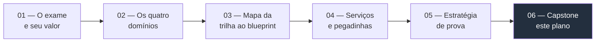

> [!abstract] TL;DR
> As cinco notas anteriores deste galho te deram o *quê* (o exame e seu valor), o *quanto* (os quatro domínios e seus pesos), o *onde* (o mapa da trilha de 23 galhos contra o blueprint), o *o quê especificamente* (os serviços que a prova ama e as pegadinhas recorrentes) e o *como* (a mecânica de sentar e passar). Falta uma peça: transformar tudo isso num cronograma executável. Este capstone propõe um plano de 4 a 6 semanas — ancorado nos galhos que você já tem, não em curso novo — com entregável por semana, critério objetivo de "estou pronto" e o fechamento deste galho 24, que é também o fechamento do Bloco 5 (Provedores e maestria).

## Recapitulando o galho em quatro frases

Antes de montar o cronograma, vale amarrar o que as cinco notas anteriores já estabeleceram, porque o plano desta nota é construído em cima delas, não do zero.

A nota [[03-Dominios/Tecnologia/Cloud/24 - Certificação AWS Solutions Architect Associate/01 - O exame e seu valor|01 — O exame e seu valor]] respondeu "por que fazer": o SAA-C03 não substitui experiência, mas sinaliza domínio de arquitetura pra ATS e recrutadores, e o degrau natural depois de percorrer os galhos 1-23 é formalizar esse conhecimento — não aprendê-lo do zero.

A nota [[03-Dominios/Tecnologia/Cloud/24 - Certificação AWS Solutions Architect Associate/02 - Os quatro domínios do blueprint|02 — Os quatro domínios do blueprint]] traduziu o Exam Guide oficial em quatro pesos concretos: **Design Secure Architectures 30%**, **Design Resilient Architectures 26%**, **Design High-Performing Architectures 24%**, **Design Cost-Optimized Architectures 20%** — e mostrou que esses quatro domínios são, essencialmente, o Well-Architected Framework do galho [[03-Dominios/Tecnologia/Cloud/03 - Well-Architected Framework/index|03 — Well-Architected Framework]] reagrupado numa lente de prova.

> [!info] Verificado 2026-07-24 diretamente no Exam Guide oficial (docs.aws.amazon.com/aws-certification/latest/solutions-architect-associate-03/) para esta nota
> Confirmação direta na fonte primária: **quatro** content domains, pesos **Design Secure Architectures 30% · Design Resilient Architectures 26% · Design High-Performing Architectures 24% · Design Cost-Optimized Architectures 20%**. A prova tem 65 questões, das quais **50 pontuam e 15 são piloto não identificadas** (isso é confirmado oficialmente, ao contrário do que a nota 01 deste galho sugeria como não divulgado). Não há penalidade por chute — questão em branco conta como errada. **Passing score: 720 em escala de 100-1.000**, também confirmado como valor oficial publicado no Exam Guide (não é estimativa de mercado, como a nota 01 havia registrado com cautela). A nota 05 deste galho levantou a hipótese de um blueprint revisado com cinco domínios (26/25/24/13/12, incluindo um domínio de migração) — essa hipótese **não se confirma** na fonte oficial consultada nesta data: o guia vigente em 2026-07-24 continua com quatro domínios e os pesos 30/26/24/20. Se você está lendo isso meses depois, reconfira o Exam Guide antes de montar seu plano — a AWS revisa blueprints periodicamente e o código pode mudar para C04.

A nota [[03-Dominios/Tecnologia/Cloud/24 - Certificação AWS Solutions Architect Associate/03 - Mapa da trilha ao blueprint|03 — Mapa da trilha ao blueprint]] fez o trabalho mais pesado: percorreu os 23 galhos anteriores um a um e classificou cada um como cobertura completa, parcial ou lacuna frente aos quatro domínios. O resultado prático foram seis pontos de atenção concretos — tipos de ELB, S3 storage classes, Route 53 routing policies, RDS/Aurora/DynamoDB, SQS/SNS/Kinesis, e serviços de migração (a única lacuna genuinamente nova, sem galho-mãe nesta trilha).

A nota [[03-Dominios/Tecnologia/Cloud/24 - Certificação AWS Solutions Architect Associate/04 - Serviços que o exame ama e as pegadinhas|04 — Serviços que o exame ama e as pegadinhas]] transformou essas lacunas em conteúdo de estudo: a tabela mestra de serviço → pegadinha, os padrões recorrentes (Multi-AZ vs Read Replica, SG vs NACL, ALB vs NLB vs GWLB, EBS vs EFS vs S3) e o dicionário de palavras-gatilho que sinalizam qual pilar do Well-Architected está sendo testado numa questão.

A nota [[03-Dominios/Tecnologia/Cloud/24 - Certificação AWS Solutions Architect Associate/05 - Estratégia de prova|05 — Estratégia de prova]] fechou o ciclo com a mecânica de sentar na cadeira: gestão dos 130 minutos com flag-and-review, técnica de eliminação por discriminador, e o padrão empírico de 80%+ consistente em simulados como sinal de prontidão.

## O problema que este capstone resolve

Cinco notas de conteúdo sólido não formam, sozinhas, um plano. É o mesmo problema que qualquer pessoa enfrenta ao terminar um curso denso: sabe onde está o material, mas não sabe *quando* estudar o quê, nem *quanto tempo* dedicar a cada parte, nem *quando parar de estudar e agendar a prova*. Sem essas três respostas, a preparação vira revisão difusa — reler tudo de novo, na ordem em que foi escrito, sem levar em conta que Domain 1 pesa 30% e Domain 4 pesa 20%, ou que seis pontos específicos (a lista de lacunas da nota 03) concentram a maior parte do risco de erro.

O plano abaixo resolve isso amarrando três variáveis que já foram estabelecidas nas notas anteriores: **peso do domínio** (nota 02), **lacuna real de cobertura** (nota 03) e **critério objetivo de prontidão** (nota 05). O resultado é um cronograma que aloca tempo de forma proporcional ao produto peso × lacuna, exatamente como a nota 03 recomendou, em vez de dividir o tempo igualmente entre os quatro domínios ou "achismo" de quanto cada pessoa "gosta" de revisar.

## O plano: 4 a 6 semanas, ancoradas na trilha

O plano assume o cenário mais comum de quem chega a este capstone: alguém que já passou pelos 23 galhos anteriores (ou pelo menos pela maior parte deles) e precisa de uma janela de revisão dirigida, não de aprender cloud do zero. Se esse não é o seu caso — se você ainda está devendo galhos inteiros da trilha —, o plano se estende naturalmente: cada semana abaixo pode virar duas, incluindo o estudo original do galho antes da revisão dirigida.

```mermaid
gantt
    title Plano de estudo SAA-C03 (4-6 semanas)
    dateFormat  X
    axisFormat  Sem %d
    section Semana 1
    Well-Architected + Secure (04/07/18) :s1, 0, 1
    section Semana 2
    Resilient + High-Performing (05/06/08/09/10/13/20) :s2, 1, 2
    section Semana 3
    Cost + Serverless + lacunas (11-15, 19, nota 03) :s3, 2, 3
    section Semana 4
    Simulados + revisão de erros por domínio :s4, 3, 4
    section Semana 5-6
    Simulados até 85% + agendar :s5, 4, 6
```

### Semana 1 — Well-Architected e o domínio de maior peso (Secure, 30%)

O ponto de partida é revisitar o galho [[03-Dominios/Tecnologia/Cloud/03 - Well-Architected Framework/index|03 — Well-Architected Framework]], porque ele é a lente que organiza os quatro domínios do exame (nota 02 já traçou essa correspondência quase 1:1). Em seguida, ataque o domínio de maior peso isolado da prova: releia o galho [[03-Dominios/Tecnologia/Cloud/04 - Identidade e acesso (IAM)/index|04 — Identidade e acesso (IAM)]], o galho [[03-Dominios/Tecnologia/Cloud/07 - Rede na nuvem (VPC)/index|07 — Rede na nuvem (VPC)]] e o galho [[03-Dominios/Tecnologia/Cloud/18 - Segurança na cloud a fundo/index|18 — Segurança na cloud a fundo]], que juntos cobrem os quatro task statements de Domain 1 (acesso, dados, rede, segregação) segundo o mapeamento da nota 03.

**Entregável da semana:** conseguir explicar, sem consultar nada, a diferença entre Security Group e NACL (stateful vs stateless), quando usar IAM Role em vez de IAM User, e como restringir acesso a um bucket S3 só a uma VPC específica — os três padrões de questão mais citados na nota 04 para este domínio.

### Semana 2 — Resilient (26%) e High-Performing (24%)

Esses dois domínios juntos somam metade do peso da prova, e é aqui que a maior parte das lacunas "parcial" da nota 03 se concentra — porque ambos são domínios transversais, puxando pedaços de compute, rede, storage, bancos e mensageria ao mesmo tempo, em vez de terem um galho "dono" único.

Para Resilient: releia o galho [[03-Dominios/Tecnologia/Cloud/06 - Compute II — elasticidade e balanceamento/index|06 — Compute II]] (Auto Scaling e ELB cruzando AZs), o galho [[03-Dominios/Tecnologia/Cloud/13 - Mensageria e eventos gerenciados/index|13 — Mensageria e eventos gerenciados]] (desacoplamento com filas) e o galho [[03-Dominios/Tecnologia/Cloud/20 - Resiliência e continuidade/index|20 — Resiliência e continuidade]] (RTO/RPO, estratégias de DR). Para High-Performing: os galhos [[03-Dominios/Tecnologia/Cloud/05 - Compute I — máquinas virtuais/index|05 — Compute I]], [[03-Dominios/Tecnologia/Cloud/06 - Compute II — elasticidade e balanceamento/index|06 — Compute II]] (de novo — ele cai nos dois domínios), [[03-Dominios/Tecnologia/Cloud/08 - Armazenamento (object, block e file)/index|08 — Armazenamento]], [[03-Dominios/Tecnologia/Cloud/09 - Bancos gerenciados/index|09 — Bancos gerenciados]] e [[03-Dominios/Tecnologia/Cloud/10 - DNS, CDN e borda/index|10 — DNS, CDN e borda]].

Esta é também a semana de fechar as três lacunas de maior prioridade que a nota 03 identificou como "peso combinado mais alto": a árvore de decisão RDS vs Aurora vs DynamoDB, os tipos de ELB (ALB vs NLB vs GWLB) e a diferença SQS vs SNS vs Kinesis. A nota 04 tem as tabelas comparativas prontas para essa revisão cirúrgica — não é preciso reler os galhos inteiros de novo, só a seção de decisão.

**Entregável da semana:** resolver de cabeça o padrão "Multi-AZ é sobre disponibilidade, Read Replica é sobre performance" e o padrão "ALB é camada 7 com roteamento por path, NLB é camada 4 com latência ultrabaixa" — os dois pares confusos mais citados nas notas 04 e 05.

### Semana 3 — Cost-Optimized (20%), serverless e as lacunas restantes

O domínio de menor peso individual ainda vale 13 das 65 questões, então merece uma sessão dedicada, não um esquecimento por "é só 20%" — a nota 02 já avisou desse risco especificamente. Releia o galho [[03-Dominios/Tecnologia/Cloud/19 - FinOps — a economia da cloud/index|19 — FinOps — a economia da cloud]], que sozinho cobre a maior parte deste domínio: modelos de precificação (on-demand/RI/Savings Plans/Spot), storage tiering e o raciocínio de custo que o exame testa com cenários de carga temporal ("roda 24/7 por anos" vs "tolerante a interrupção" vs "imprevisível e esparso").

Nesta semana também entra a revisão do bloco serverless, porque "least operational overhead" é uma das palavras-gatilho mais recorrentes da prova (nota 04): os galhos [[03-Dominios/Tecnologia/Cloud/11 - Serverless e FaaS — Lambda a fundo/index|11 — Serverless e FaaS]], 12 (Containers gerenciados), [[03-Dominios/Tecnologia/Cloud/14 - API Gateway e edge de aplicação/index|14 — API Gateway e edge de aplicação]] e 15 (Arquiteturas serverless e event-driven).

Fecha a semana atacando as duas lacunas restantes que a nota 03 catalogou: S3 storage classes com lifecycle rules (a tabela de vocabulário-de-cenário → classe já está pronta na nota 04) e Route 53 routing policies (simple, weighted, latency, failover, geolocation). E, se ainda não estudou, a lacuna genuinamente nova — Snowball/DMS/Migration Hub — que a nota 03 sinalizou como o único item sem base prévia na trilha.

**Entregável da semana:** conseguir mapear um cenário de carga ("processamento em lote tolerante a interrupção", "picos previsíveis de Black Friday", "tráfego imprevisível e esparso") ao modelo de compra certo (Spot, Reserved/Savings Plan, on-demand/serverless) sem hesitar.

### Semana 4 — Simulados e revisão de erros por domínio

Esta é a virada de conteúdo para mecânica de prova, seguindo o ciclo que a nota 05 detalhou: fazer um simulado completo, cronometrado, sem pausar; revisar cada questão errada (e as acertadas no chute) entendendo o discriminador, não só a resposta certa; agrupar os erros por domínio; e voltar à nota-mãe correspondente antes do próximo simulado.

**Entregável da semana:** primeiro simulado completo feito e revisado, com os erros agrupados por domínio — esse agrupamento é o dado mais valioso da semana, porque aponta exatamente onde as semanas 1-3 ainda deixaram lacuna.

### Semana 5-6 (condicional) — simulados até 85% e agendamento

Se o primeiro simulado da semana 4 já bateu 80%+ de forma consistente (o patamar que a nota 05 registrou como padrão empírico de quem relata sucesso), essas semanas extras não são necessárias — pule direto para agendar a prova. Se não bateu, repita o ciclo simulado → revisão → volta à nota-mãe até estabilizar acima de 80-85% em simulados *diferentes* (não o mesmo simulado refeito, que infla o número por familiaridade com as questões específicas, não por domínio real do conteúdo).

**Entregável:** 85% consistente em pelo menos dois simulados novos e diferentes → agendar a prova.

## Tabela-cronograma consolidada

| Semana | Foco | Domínio(s) do exame | Galhos da trilha | Entregável |
|---|---|---|---|---|
| 1 | Well-Architected + Secure | Design Secure (30%) | 03, 04, 07, 18 | Explicar SG vs NACL e IAM Role vs User sem consultar nada |
| 2 | Resilient + High-Performing | Design Resilient (26%) + High-Performing (24%) | 05, 06, 08, 09, 10, 13, 20 | Resolver Multi-AZ vs Read Replica e ALB vs NLB de cabeça |
| 3 | Cost + serverless + lacunas | Design Cost-Optimized (20%) + transversal | 11-15, 19, nota 03 (lacunas) | Mapear cenário de carga ao modelo de compra certo |
| 4 | Simulados + revisão por domínio | Todos | notas 04-05 deste galho | 1º simulado completo, erros agrupados por domínio |
| 5-6 (condicional) | Simulados até 85% + agendar | Todos | notas 04-05 deste galho | 85%+ em 2 simulados novos → prova agendada |

> [!warning] O plano é um esqueleto, não uma camisa de força
> Se as semanas 1-3 revelarem que um galho inteiro está fraco na memória — não só uma lacuna pontual, mas o conceito de base esquecido —, é mais honesto voltar e reler o galho inteiro do que seguir o cronograma às cegas. O objetivo do plano é dar estrutura e evitar procrastinação difusa, não substituir julgamento sobre onde você realmente está fraco. Ajuste a duração de cada semana à sua realidade — alguém que já trabalha com AWS em produção todo dia pode comprimir isso em 2-3 semanas; alguém que fez a trilha há muitos meses e está enferrujado pode precisar do dobro.

## Recursos, além da própria trilha

A trilha (galhos 1-23 mais estas seis notas de certificação) é a espinha dorsal do plano, mas três tipos de recurso externo completam a preparação:

**Documentação oficial.** Para qualquer serviço que a revisão apontar como fraco, a fonte primária é sempre `docs.aws.amazon.com/<serviço>` — os FAQs de serviço específico (ex.: [Amazon RDS FAQs](https://aws.amazon.com/rds/faqs/), [Amazon S3 FAQs](https://aws.amazon.com/s3/faqs/)) costumam responder exatamente o tipo de pergunta comparativa ("quando usar X em vez de Y") que o exame testa, de forma mais concisa que a documentação técnica completa.

**Simulados.** A nota 05 já nomeou os dois provedores mais citados pela comunidade — Tutorials Dojo e Whizlabs — com o aviso de que o valor está na explicação de por que cada alternativa está certa ou errada, não só no placar.

**AWS Skill Builder.** A própria AWS mantém uma plataforma de aprendizado oficial, o [AWS Skill Builder](https://skillbuilder.aws/), com cursos digitais gratuitos e pagos organizados por certificação, incluindo um plano de aprendizagem dedicado ao SAA-C03 e um exame oficial de prática pago (Official Practice Exam) que, ao contrário de simulados de terceiros, usa questões escritas pela própria AWS.

> [!info] Verificado 2026-07-24 — AWS Skill Builder existe e oferece trilha dedicada ao SAA-C03 (confirmado via aws.amazon.com/certification, que referencia skillbuilder.aws como recurso oficial de preparação). Não foi possível confirmar via WebFetch nesta sessão o preço atual do Official Practice Exam pago dentro do Skill Builder — esse preço muda com alguma frequência e não está documentado nas páginas consultadas para esta nota. Confira o valor vigente em skillbuilder.aws antes de decidir se vale a pena além dos simulados de terceiros.

## Critério de "estou pronto"

Juntando os sinais que as notas 02, 03 e 05 já estabeleceram separadamente, a lista de prontidão fica assim:

- **80-85% de acerto consistente** em pelo menos dois simulados diferentes e completos, feitos sob tempo real (não o mesmo simulado refeito, e não questões avulsas sem cronômetro).
- **Confortável com as pegadinhas catalogadas na nota 04** — Multi-AZ vs Read Replica, SG vs NACL, ALB vs NLB vs GWLB, EBS vs EFS vs S3, SQS vs SNS — a ponto de reconhecer o padrão em segundos, não em minutos de raciocínio.
- **Erros de simulado concentrados em detalhes pontuais, não em conceito de base.** Errar porque esqueceu o nome exato de uma classe de storage é normal e esperado; errar porque não sabe por que Multi-AZ existe é sinal de que a semana 1 ou 2 precisa de mais uma passada.
- **Nenhum domínio com taxa de erro desproporcionalmente maior que os outros três**, especialmente Domain 1 (Secure, 30% do peso) — um ponto fraco isolado nesse domínio específico pesa mais que um ponto fraco equivalente em Domain 4.

> [!warning] 85% em simulado não é garantia de 720/1000 na prova real
> Simulados de terceiros são aproximações do estilo e da dificuldade do exame real, não cópias dele — a AWS não divulga as questões reais nem permite que provedores de simulado as reproduzam. Um placar de 85% consistente é o sinal mais confiável disponível fora da AWS, mas ainda é um sinal, não uma garantia estatística. Trate-o como "suficientemente pronto para agendar com confiança razoável", não como certeza matemática.

## Fechando o galho 24 — e o que vem depois, no domínio inteiro

Este capstone fecha o galho 24 (Certificação AWS Solutions Architect Associate), que por sua vez fecha o Bloco 5 (Provedores e maestria) desta trilha Cloud. As seis notas deste galho, lidas em sequência, formam um roteiro completo: por que fazer, o que a prova pesa, onde você já está coberto, o que decorar de propósito, como se comportar na cadeira, e agora, quando e como estudar. Quem seguiu a trilha inteira desde o galho 1 chega a este ponto com a matéria técnica resolvida — o que resta é a disciplina de revisão dirigida que este plano estrutura.

Mas certificação, como a nota 01 deste galho já avisou logo na abertura, não é o destino final — é um degrau de sinalização, formal e útil, mas que não substitui aplicar o conhecimento num sistema real. O próximo passo natural, depois de fechar este galho, não é mais estudo de blueprint: é pegar a arquitetura inteira que esta trilha ensinou — compute, rede, storage, bancos, serverless, mensageria, observabilidade, segurança, FinOps, resiliência — e desenhar um sistema do zero com ela, sob as mesmas restrições reais que o exame só simula em cenários de papel. Esse exercício de síntese final, arquitetar um SaaS do zero da forma como um arquiteto sênior faria em produção, é o horizonte que fecha o domínio Cloud inteiro — o próximo passo depois deste galho, ainda a ser escrito.

## Fontes

- AWS. "AWS Certified Solutions Architect - Associate (SAA-C03)." https://docs.aws.amazon.com/aws-certification/latest/solutions-architect-associate-03/solutions-architect-associate-03.html (verificado 2026-07-24 — confirma quatro domínios, pesos 30/26/24/20, 65 questões com 50 pontuadas e 15 piloto, passing score 720/1.000 publicado oficialmente)
- AWS. "AWS Certified Solutions Architect - Associate." https://aws.amazon.com/certification/certified-solutions-architect-associate/ (verificado 2026-07-24)
- AWS. "AWS Skill Builder." https://skillbuilder.aws/
- AWS. "Amazon RDS FAQs." https://aws.amazon.com/rds/faqs/
- AWS. "Amazon S3 FAQs." https://aws.amazon.com/s3/faqs/
- Tutorials Dojo — SAA-C03 Practice Exams: https://tutorialsdojo.com/aws-certified-solutions-architect-associate-saa-c03/
- Whizlabs — AWS Certified Solutions Architect Associate: https://www.whizlabs.com/aws-solutions-architect-associate/
