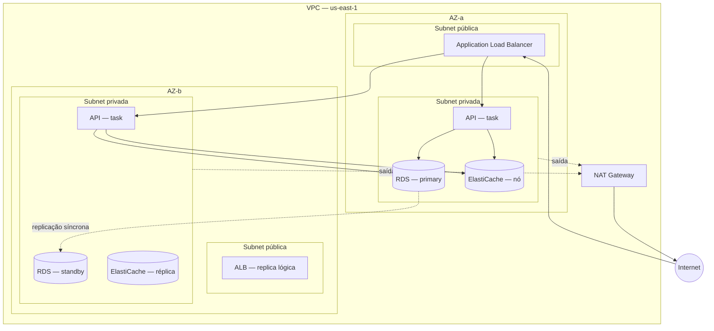
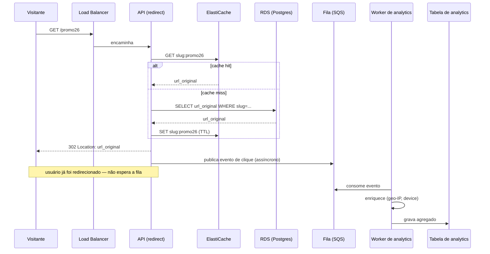
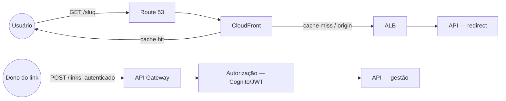

> [!abstract] TL;DR
> Este capítulo desenha, do zero, um encurtador de URLs com analytics — um SaaS pequeno o bastante para caber numa entrevista de 45 minutos, e rico o bastante para tocar todos os pilares da trilha Cloud. Começamos com os requisitos (como num loop real), evoluímos o desenho em camadas — compute, rede, dados, borda, mensageria, resiliência, segurança, custo —, cada camada ancorada num [[03-Dominios/Tecnologia/Cloud/03 - Well-Architected Framework/index|pilar do Well-Architected]] e linkada ao galho que a explica em profundidade. No fim, o mesmo sistema reaparece pequeno, na DigitalOcean, para mostrar que arquitetura boa não é sinônimo de arquitetura grande.

## O problema, como ele chega numa entrevista

Imagine a pergunta chegando assim: *"Desenhe um sistema tipo bit.ly. Usuários encurtam URLs longas, compartilham o link curto, e o dono da conta vê analytics de cliques — de onde vieram, quando, de que dispositivo."* É uma pergunta clássica, mas o que separa uma resposta júnior de uma sênior não é conhecer o algoritmo de encurtamento — é a sequência: **primeiro extrair requisitos, depois estimar escala, só então desenhar**, e desenhar de um jeito que expõe trade-offs, não que empilha serviços da AWS para impressionar.

É essa sequência que este capítulo segue. Se você pulou direto pra cá sem passar pelos 24 galhos anteriores, tudo bem — mas cada decisão aqui invoca a nota que a fundamenta, então este texto funciona também como um mapa de navegação pra trás.

### Requisitos funcionais

| # | Requisito |
|---|---|
| F1 | Usuário autenticado cria um link curto a partir de uma URL longa |
| F2 | Qualquer visitante que acessa o link curto é redirecionado pra URL original |
| F3 | Dono do link vê analytics: cliques por dia, país (via IP), referrer, dispositivo |
| F4 | Usuário pode customizar o slug (`meusite.com/promo26`) ou receber um gerado |
| F5 | Links podem expirar numa data ou após N cliques |

### Requisitos não funcionais — e por que eles decidem a arquitetura

| # | Requisito | Por que importa aqui |
|---|---|---|
| NF1 | Redirecionamento é o caminho quente: precisa ser **rápido** (p99 < 100ms) e **disponível** (99.9%+) | Puxa a leitura pra perto do usuário e pro cache — não pro banco |
| NF2 | Leitura (redirects) domina sobre escrita (criação de link) em ordem de grandeza — típico 100:1 ou mais | Justifica cache agressivo e réplicas de leitura |
| NF3 | Analytics pode ser **eventualmente consistente** — ninguém liga se o contador de cliques atrasa 30 segundos | Abre a porta pra processamento assíncrono, tirando trabalho do caminho quente |
| NF4 | Sistema multi-tenant: dados de um cliente nunca vazam pra outro | Decide modelo de dados e a fronteira de autorização |
| NF5 | Picos de tráfego são possíveis (link viral) | Puxa auto scaling e CDN pra absorver o pico sem acordar ninguém |

### Estimativa de escala (o exercício que a entrevista espera)

Um cálculo de guardanapo, do tipo que se faz em voz alta na entrevista: suponha 10 milhões de links criados por mês e uma proporção de leitura:escrita de 100:1. Isso dá ~333 mil criações/dia (≈4 QPS de escrita, com folga pra picos) e ≈400 QPS de leitura em média — mas o pico pode ser 10-50x isso se um link viralizar. Armazenamento: cada registro de link é pequeno (URL + metadados, digamos 500 bytes); em 5 anos, 600 milhões de links dão ~300GB — trivial para um banco relacional gerenciado. O volume que cresce de verdade é o de **eventos de clique** (um por redirect), que em 1 ano pode passar de bilhões de linhas — por isso analytics não mora na mesma tabela transacional que os links.

Esse é o ponto onde já dá pra prever a forma do sistema: **leitura pesada e latência crítica no redirect, escrita leve na criação, e um rio de eventos separado para analytics.** As próximas seções constroem exatamente isso, camada por camada.

## O desenho evolutivo

### Camada 0 — a versão ingênua (e por que ela quebra)

A resposta mais simples — uma API, um banco relacional, pronto — funciona para 100 usuários e quebra na primeira menção de "pico de tráfego" ou "múltiplos data centers". Ela serve como ponto de partida honesto numa entrevista (mostra que você sabe simplificar antes de complicar), mas o entrevistador vai empurrar os requisitos não funcionais até ela ceder. É aí que cada camada seguinte entra como resposta a uma pressão específica, não como enfeite.

### Camada 1 — compute e a API

O núcleo é uma API que expõe três rotas: `POST /links` (cria), `GET /{slug}` (redireciona — o caminho quente) e `GET /links/{id}/stats` (lê analytics). Rodar isso em containers — não em VMs geridas à mão, não em uma única função Lambda monolítica — é a escolha natural para um serviço com tráfego constante e lógica de negócio não trivial: [[03-Dominios/Tecnologia/Cloud/12 - Containers gerenciados/index|containers gerenciados (ECS Fargate ou EKS)]] dão o meio-termo entre o controle de uma VM e a operação zero de serverless. A API roda atrás de um load balancer que distribui entre múltiplas tarefas em múltiplas zonas — o padrão de elasticidade e balanceamento coberto em [[03-Dominios/Tecnologia/Cloud/06 - Compute II — elasticidade e balanceamento/index|Compute II]], que também decide a política de auto scaling: escalar por CPU não basta para um pico de redirect; escalar por requisições-por-tarefa captura melhor o padrão real.

O caminho de criação de link (F1, F4) é onde a lógica de negócio mora: gerar ou validar o slug, checar duplicidade, gravar. O caminho de redirect (F2) é deliberadamente burro — só lê o cache ou o banco, resolve a URL, dispara um evento assíncrono, e devolve um 302. Essa assimetria é a decisão de arquitetura mais importante da nota inteira: **o redirect nunca deve esperar por nada que não seja essencial ao redirect**.

Para processamento assíncrono mais pesado (gerar relatórios agregados de analytics, expirar links por cron), [[03-Dominios/Tecnologia/Cloud/11 - Serverless e FaaS — Lambda a fundo/index|funções Lambda]] entram como o complemento certo: código que roda sob demanda, disparado por evento, sem servidor pra manter de pé o tempo todo. A mistura containers-para-API-síncrona + serverless-para-jobs-assíncronos é um padrão maduro, não uma indecisão — cada peça no lugar onde seu modelo de custo e escala faz sentido.

### Camada 2 — rede: onde tudo isso mora

Nada do que foi dito acima faz sentido sem uma [[03-Dominios/Tecnologia/Cloud/07 - Rede na nuvem (VPC)/index|VPC]] desenhada com intenção. O desenho clássico de duas camadas se aplica direto aqui: subnets **públicas** em pelo menos duas AZs hospedam só o load balancer (a única coisa que precisa ser alcançável da internet); subnets **privadas**, também espalhadas por duas ou três AZs, hospedam as tarefas da API, o banco de dados e o cache. Nada nas subnets privadas tem IP público — elas alcançam a internet (para, por exemplo, chamar uma API de geolocalização de IP) através de um NAT Gateway, e nunca o contrário.



Repare que o ALB é um único recurso lógico gerenciado pela AWS que já opera em múltiplas AZs — o diagrama separa por clareza didática, não porque existam dois load balancers reais. O ponto que importa: **nenhuma zona de disponibilidade, sozinha, é dona de nada crítico.** Isso é a semente da camada de resiliência, que volta mais abaixo.

Security groups fecham o cerco: o ALB aceita 443 de qualquer origem; a API aceita tráfego só do security group do ALB; o banco aceita conexão só do security group da API. Três portas de entrada, cada uma justificada pela anterior — não uma regra "permitir tudo interno" preguiçosa.

### Camada 3 — dados: banco, cache e o rio de eventos

Aqui o desenho se ramifica em três armazenamentos, cada um respondendo a um requisito diferente:

**Banco relacional para os links.** Um `links` (id, slug, url_original, dono, criado_em, expira_em) é dado transacional clássico — precisa de unicidade de slug, integridade referencial com o dono, e consistência forte na escrita. Um banco gerenciado — RDS PostgreSQL, por exemplo — em modo Multi-AZ é a escolha, coberta em [[03-Dominios/Tecnologia/Cloud/09 - Bancos gerenciados/index|Bancos gerenciados]]. Multi-AZ mantém uma réplica síncrona numa segunda AZ que assume automaticamente se a primária cair — é infraestrutura, não lógica de aplicação, o que resolvida.

> [!info] Verificado 2026-07-24 — RDS Multi-AZ
> A documentação da AWS distingue dois modos: **Multi-AZ DB instance** (uma standby que só faz failover, não serve leitura) e **Multi-AZ DB cluster** (duas standbys que também servem leitura, com failover tipicamente mais rápido). Para este capstone, o modo instance já resolve o requisito de disponibilidade; o modo cluster vale a pena se o volume de leitura justificar réplicas adicionais. Fonte: docs.aws.amazon.com/AmazonRDS/latest/UserGuide/Concepts.MultiAZ.html.

**Cache na frente do redirect.** O requisito NF1 (p99 < 100ms) não sobrevive a uma consulta ao banco a cada clique. Um cache in-memory — ElastiCache Redis — guarda o par `slug → url_original` com TTL curto, e a API só bate no banco em cache miss. Isso é literalmente o padrão que resolve o requisito, e é por isso que a leitura:escrita 100:1 estimada acima importa: quanto mais assimétrica a proporção, mais o cache paga a própria conta.

**Um rio de eventos para analytics.** Cada redirect bem-sucedido dispara um evento (`slug`, `timestamp`, `ip`, `user_agent`, `referrer`) para uma fila — SQS, ou um tópico Kafka/Kinesis se o volume justificar stream em vez de fila ponto-a-ponto —, coberta em [[03-Dominios/Tecnologia/Cloud/13 - Mensageria e eventos gerenciados/index|Mensageria e eventos gerenciados]]. Um consumidor assíncrono (Lambda, ou um worker containerizado) lê a fila, enriquece o evento (geolocaliza o IP, classifica o dispositivo) e grava agregados num data store de analytics — pode ser o mesmo Postgres numa tabela separada para uma escala modesta, ou um data warehouse dedicado se o volume de cliques crescer muito além dos links em si. O ponto crítico de arquitetura: **o redirect dispara o evento e não espera a confirmação de que ele foi processado** — é fire-and-forget na direção da fila, o que mantém o caminho quente rápido mesmo que o consumidor de analytics esteja atrasado ou temporariamente fora do ar.



### Camada 4 — borda: DNS e CDN

Nem todo tráfego precisa chegar à VPC. Uma CDN na frente do domínio curto, coberta em [[03-Dominios/Tecnologia/Cloud/10 - DNS, CDN e borda/index|DNS, CDN e borda]], resolve dois problemas de uma vez: reduz a latência do redirect para usuários geograficamente distantes (a resposta pode ser cacheada perto do visitante, já que a maioria dos redirects para um mesmo slug retorna a mesma URL) e absorve picos de tráfego sem tocar a API — se um link viraliza, é a rede de borda da CloudFront que aguenta o primeiro impacto, não o auto scaling da API correndo atrás do prejuízo. O DNS do domínio custom (`meusite.com`) é gerenciado via Route 53, com um registro apontando para a distribuição CDN, que por sua vez tem o ALB como origem.

Para a API de gestão (criação de link, dashboard de analytics) — que é autenticada e não se beneficia de cache público — o tráfego pode ir direto ao [[03-Dominios/Tecnologia/Cloud/14 - API Gateway e edge de aplicação/index|API Gateway]] em vez da CDN, o que também dá de graça rate limiting, validação de payload e um ponto único para aplicar autenticação antes de a requisição chegar à lógica de negócio.



### Camada 5 — identidade e segurança

Multi-tenancy (NF4) é decidido aqui, não na camada de dados: cada link carrega um `tenant_id`, e toda query passa por esse filtro — mas a garantia estrutural vem de cima, na camada de autenticação e autorização coberta em [[03-Dominios/Tecnologia/Cloud/04 - Identidade e acesso (IAM)/index|Identidade e acesso (IAM)]] e aprofundada em [[03-Dominios/Tecnologia/Cloud/18 - Segurança na cloud a fundo/index|Segurança na cloud a fundo]]. Usuários finais se autenticam via Cognito (ou equivalente), recebem um JWT com o `tenant_id` embutido, e o API Gateway valida esse token antes mesmo de a requisição chegar à lógica de negócio — a autorização nunca é responsabilidade só do código de aplicação.

Um exemplo do tipo de decisão que essa camada obriga: a política IAM que a task da API assume para escrever na fila de eventos deve ser mínima, não um `sqs:*` genérico:

```json
{
  "Version": "2012-10-17",
  "Statement": [
    {
      "Effect": "Allow",
      "Action": ["sqs:SendMessage"],
      "Resource": "arn:aws:sqs:us-east-1:123456789012:link-clicks-queue"
    }
  ]
}
```

Least privilege aplicado literalmente: a task de redirect só pode *enviar* mensagem para *essa* fila — não ler, não deletar, não tocar em nenhuma outra fila da conta. É o mesmo princípio de [[03-Dominios/Tecnologia/Cloud/04 - Identidade e acesso (IAM)/index|IAM]] que separa a role da API (que fala com o banco e a fila) da role do worker de analytics (que fala com a fila e a tabela de analytics, e nada mais).

### Camada 6 — resiliência multi-AZ

A resiliência não é uma camada nova de infraestrutura — é uma releitura do que já foi desenhado, perguntando "o que acontece se isso morrer?" em cada peça. É o assunto de [[03-Dominios/Tecnologia/Cloud/20 - Resiliência e continuidade/index|Resiliência e continuidade]], e aqui ele se traduz assim:

| Componente | Falha considerada | Mitigação já embutida no desenho |
|---|---|---|
| Task da API | Uma tarefa trava ou é substituída | Múltiplas tasks atrás do ALB, em ≥2 AZs; health check remove a instância doente |
| Banco RDS | AZ inteira cai | Multi-AZ com standby síncrona; failover automático (minutos, não horas) |
| Cache ElastiCache | Nó de cache cai | Cache miss é seguro por design — API cai pro banco; réplica de cache reduz o impacto |
| Fila de eventos | Worker de analytics fica indisponível | Mensagens ficam retidas na fila (retenção configurável); nenhum clique é perdido, só atrasado |
| AZ inteira (rede, compute) | Data center fica inacessível | Toda camada crítica (API, banco, cache) já está replicada em ≥2 AZs por desenho, não como acréscimo |
| Região inteira (evento raro) | Fora do escopo do MVP | Discutir como próximo passo: backup cross-region do RDS + réplica de leitura em outra região, ver DR em 20 |

O RTO/RPO que esse desenho entrega no cenário comum (falha de AZ) é de minutos, não de horas — porque o failover é automático e a réplica já está quente. Um RTO de segundos ou uma tolerância a falha de região inteira já é outro orçamento de engenharia, e é honesto dizer isso na entrevista em vez de prometer "zero downtime" sem custo.

### Camada 7 — custo, a variável que ninguém pede mas todo mundo cobra

Nenhuma dessas escolhas é grátis, e uma resposta sênior nomeia o trade-off — não só o serviço. NAT Gateway cobra por hora e por GB processado; um par de NAT Gateways (um por AZ, para não recriar um ponto único de falha) é frequentemente uma das linhas mais caras de uma VPC pequena. Cache reduz custo de banco (menos IOPS, instância menor) mas soma seu próprio custo — só compensa quando a proporção leitura:escrita justifica. Multi-AZ no RDS dobra o custo de compute do banco (paga-se pela standby, mesmo ociosa) em troca de failover automático — o tipo de troca que [[03-Dominios/Tecnologia/Cloud/19 - FinOps — a economia da cloud/index|FinOps]] pede pra explicitar, não esconder atrás de "é o certo a fazer". Para um MVP com poucos usuários, a resposta honesta pode ser: comece sem Multi-AZ, sem NAT redundante, meça o tráfego real, e adicione essas redundâncias quando o SLA prometido a clientes exigir.

## A passada pelos 6 pilares — checklist final

| Pilar | Como este desenho responde |
|---|---|
| **Excelência operacional** | IaC de ponta a ponta (ver [[03-Dominios/Tecnologia/Cloud/16 - Infrastructure as Code/index\|IaC]]) para reproduzir o ambiente; observabilidade (métricas de latência do redirect, profundidade da fila) via [[03-Dominios/Tecnologia/Cloud/17 - Observabilidade na cloud/index\|Observabilidade]] |
| **Segurança** | JWT + Cognito na borda, security groups em camadas, IAM de privilégio mínimo por serviço, tenant_id como fronteira de dados — [[03-Dominios/Tecnologia/Cloud/18 - Segurança na cloud a fundo/index\|Segurança a fundo]] |
| **Confiabilidade** | Multi-AZ em compute, banco e cache; fila absorve pico de escrita assíncrona; nenhum componente crítico é single-AZ — [[03-Dominios/Tecnologia/Cloud/20 - Resiliência e continuidade/index\|Resiliência]] |
| **Eficiência de performance** | Cache na frente do redirect, CDN na borda, auto scaling por carga real — [[03-Dominios/Tecnologia/Cloud/06 - Compute II — elasticidade e balanceamento/index\|Compute II]] e [[03-Dominios/Tecnologia/Cloud/10 - DNS, CDN e borda/index\|CDN]] |
| **Otimização de custo** | Serverless para jobs esparsos, cache dimensionado pela proporção real leitura:escrita, Multi-AZ como escolha explícita e não automática — [[03-Dominios/Tecnologia/Cloud/19 - FinOps — a economia da cloud/index\|FinOps]] |
| **Sustentabilidade** | Auto scaling evita superprovisionamento ocioso; serverless paga só o que roda — reflexo direto do pilar de custo, ponto que o próprio [[03-Dominios/Tecnologia/Cloud/03 - Well-Architected Framework/index\|Well-Architected]] reconhece |

## A mesma ideia na DigitalOcean

Nem toda entrevista — e nem todo cliente real — precisa do vocabulário inteiro da AWS. O mesmo sistema no DO, coberto em [[03-Dominios/Tecnologia/Cloud/22 - DigitalOcean a fundo/index|DigitalOcean a fundo]], perde peças sem perder função:

| Camada AWS | Equivalente DO | O que muda |
|---|---|---|
| ECS Fargate + ALB + Lambda | **App Platform** | Um serviço só junta deploy, load balancing e auto scaling; menos peças pra configurar, menos controle fino |
| VPC com subnets públicas/privadas | **VPC do DO** | Modelo mais simples, sem a mesma granularidade de route tables por subnet |
| RDS Multi-AZ | **Managed Database (Postgres)** com standby | Standby síncrona existe, mas o cardápio de topologias é menor que o da AWS |
| ElastiCache | **Managed Valkey/Redis** | Equivalente direto, catálogo mais enxuto de tamanhos |
| S3 | **Spaces** | API compatível com S3; CDN integrada nativamente no produto |
| SQS/Kinesis | **Managed Kafka** ou fila própria | Sem um serviço de fila leve equivalente ao SQS — Kafka é overkill para uma fila simples; alternativa é rodar um worker com uma lib de fila sobre o Postgres, ou usar Kafka mesmo se o time já domina |
| CloudFront + Route 53 | **Spaces CDN + DNS do DO** | Cobertura de edge menor, mas suficiente pra a maioria dos casos fora de escala hiperglobal |
| IAM granular por serviço | **Tokens de API + roles de projeto** | Modelo mais simples, com menos granularidade de política por recurso |

> [!info] Verificado 2026-07-24 — limites do App Platform
> Documentação da DigitalOcean: build usa até 8 vCPUs / 15GB RAM / 24GB de disco, timeout de build de 1h, cada app suporta até 250 containers (100 com autoscaling baseado em requisição). O sistema de arquivos local do App Platform é efêmero e limitado a 4GB — reforça por que uploads de usuário vão pra Spaces, nunca pro disco do container. CDN embutida via Cloudflare (roteamento) e via Spaces CDN (estáticos). Fonte: docs.digitalocean.com/products/app-platform/details/limits/.

A honestidade de paridade importa: o DO não tem um equivalente direto a SQS/SNS como fila gerenciada leve — Managed Kafka existe, mas é uma ferramenta mais pesada para o mesmo trabalho. Para um MVP nesse porte, um approach pragmático no DO é rodar o worker de analytics consumindo uma tabela de outbox no próprio Postgres gerenciado, em vez de introduzir Kafka só para resolver um requisito de fila simples.

## Como verbalizar isso numa entrevista

A ordem que funciona na frente de um entrevistador segue a mesma ordem deste capítulo: **requisitos → estimativa → desenho simples → evolução guiada pelos NFRs → pilares como checklist de fechamento.** Três frases que carregam peso desproporcional quando ditas no momento certo:

- *"O redirect é o caminho quente — tudo que não é essencial a ele eu tiro do caminho síncrono."* (justifica cache + fila assíncrona de uma vez)
- *"Eu escolho Multi-AZ aqui porque o SLA prometido justifica dobrar o custo do banco — mas eu diria isso em voz alta pro time de produto antes de assumir."* (mostra consciência de custo sem parecer que você está economizando por preguiça)
- *"Eu desenharia isso primeiro sem CDN e sem Multi-AZ, mediria o tráfego real, e adicionaria essas peças quando os números pedissem."* (mostra maturidade: você sabe simplificar, não só empilhar serviços)

> [!warning] Armadilhas comuns
> - Colocar o registro do evento de clique **síncrono** no caminho do redirect — isso viola o próprio requisito de latência que motivou o desenho.
> - Esquecer o `tenant_id` como filtro em toda query — é o tipo de furo que só aparece em produção, com dados de clientes diferentes vazando.
> - Tratar Multi-AZ como decisão binária e automática — é uma decisão de custo, não uma "boa prática" sem preço.
> - Propor CDN + Multi-AZ + auto scaling agressivo + Kafka sem que nenhum requisito peça isso — parece impressionante, mas sinaliza que você não sabe dizer não a complexidade desnecessária.
> - No DO, tentar recriar a granularidade de IAM da AWS onde ela não existe — é melhor nomear a diferença do que fingir paridade.

## O que vem a seguir

Este capstone fecha a trilha Cloud como texto — mas duas frentes continuam abertas para quem quer aprofundar: (1) praticar a mesma pergunta com variações — "e se o pico for 100x maior?", "e se precisar de DR cross-region?" — usando este desenho como ponto de partida; e (2) revisar o [[03-Dominios/Tecnologia/Cloud/24 - Certificação AWS Solutions Architect Associate/index|galho de certificação SAA]], que testa exatamente esse tipo de julgamento de arquitetura em formato de prova. Vale também revisitar [[03-Dominios/Tecnologia/Cloud/23 - Panorama multi-cloud e portabilidade/index|Panorama multi-cloud e portabilidade]] para pensar em quão preso a um provedor este desenho ficou — e o que custaria migrá-lo.

## Fontes

- AWS — RDS Multi-AZ deployments: https://docs.aws.amazon.com/AmazonRDS/latest/UserGuide/Concepts.MultiAZ.html
- DigitalOcean — App Platform limits: https://docs.digitalocean.com/products/app-platform/details/limits/
- AWS Well-Architected Framework: https://docs.aws.amazon.com/wellarchitected/latest/framework/welcome.html
- AWS — Amazon SQS developer guide: https://docs.aws.amazon.com/AWSSimpleQueueService/latest/SQSDeveloperGuide/welcome.html
- AWS — Amazon CloudFront developer guide: https://docs.aws.amazon.com/AmazonCloudFront/latest/DeveloperGuide/Introduction.html
- DigitalOcean — Spaces object storage: https://docs.digitalocean.com/products/spaces/
- DigitalOcean — Managed Databases overview: https://docs.digitalocean.com/products/databases/
