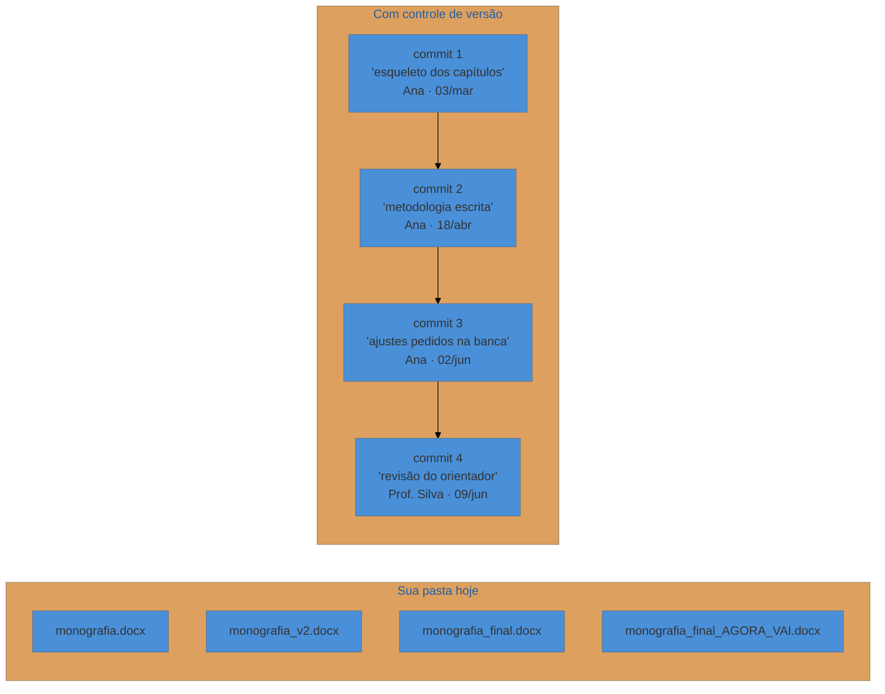
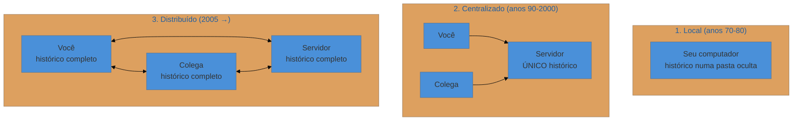
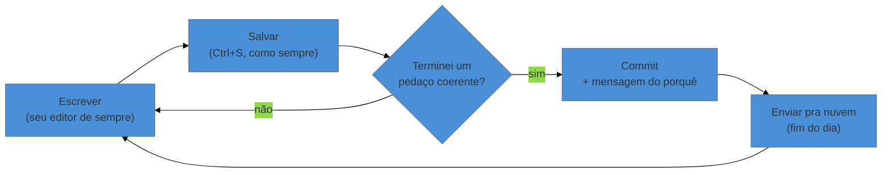

# O problema que o Git resolve

> [!abstract] TL;DR
> Todo mundo que produz arquivo ao longo do tempo já inventou um controle de versão — geralmente ruim, feito de nomes como `tcc_final_v2_AGORA_VAI.docx`. Controle de versão é software que mantém essa linha do tempo direito, respondendo quatro perguntas sobre cada mudança: **o quê, quem, quando e por quê**. O Git é o mais usado deles, e é *distribuído* — cada cópia do projeto é um repositório completo, o que significa que funciona sem internet e que cada colaborador carrega um backup íntegro do histórico. Ele não é mágico: não compara Word ou imagem de forma útil, e não organiza o que você não organizou.

---

## A pasta que todo mundo tem

Abra a pasta onde está sua monografia. É provável que ela se pareça com isto:

```text
monografia.docx
monografia_v2.docx
monografia_v2_revisado.docx
monografia_v2_revisado_ORIENTADOR.docx
monografia_final.docx
monografia_final_2.docx
monografia_final_AGORA_VAI.docx
monografia_final_AGORA_VAI_(1).docx
```

Agora responda, sem abrir nenhum deles: **qual é o bom?**

Você provavelmente vai olhar a data de modificação. Mas a data mais recente é do arquivo que você abriu ontem só pra conferir uma citação, e o Word carimbou como modificado. O arquivo realmente atual é o `AGORA_VAI`, ou o `(1)` que o navegador criou quando você baixou o anexo que a orientadora devolveu?

Essa pasta não é desleixo. Ela é uma tentativa legítima e universal de resolver um problema real: **você precisa do passado**. Precisa poder voltar. Precisa saber o que mudou. Precisa não perder o parágrafo que apagou às duas da manhã e que, hoje, percebeu que era o melhor do capítulo.

O que essa pasta prova é que você **já faz controle de versão**. Só que com uma ferramenta péssima: o nome do arquivo.

> [!question]- Mas por que exatamente o nome do arquivo é uma ferramenta ruim?
> Porque o nome carrega no máximo um rótulo, e você precisa de quatro informações. O nome `monografia_final_2.docx` não diz **o que** mudou em relação ao `final`, nem **quem** mudou (você? a orientadora? o colega do grupo?), nem **quando** de verdade (a data do sistema mente, como vimos), nem **por quê**. Sem essas quatro coisas, a linha do tempo existe fisicamente mas é ilegível — é como ter um álbum de fotos sem legenda, sem data e sem ordem.

---

## Trabalhar sem controle de versão é como trabalhar sem EPI

Numa obra, ninguém usa capacete porque tem certeza de que um tijolo vai cair hoje. Usa porque, ao longo de meses, **alguma coisa vai cair** — e o custo de estar protegido é baixo demais perto do custo de não estar.

Com arquivos é idêntico. Ao longo de uma dissertação de dois anos, alguma dessas coisas *vai* acontecer:

- Você apaga uma seção inteira convencido de que ficou melhor, e três semanas depois quer ela de volta.
- O arquivo corrompe na véspera da entrega.
- Duas pessoas do grupo editam o mesmo capítulo no mesmo dia, e uma sobrescreve a outra sem perceber.
- A orientadora pede pra "voltar àquela versão de março, que estava mais clara".
- Você quer testar uma reestruturação radical dos capítulos, mas não quer arriscar o que já está pronto.

Nenhum desses é um evento raro. São **o percurso normal** de um trabalho longo. O controle de versão é o capacete: você não sente falta até o tijolo cair, e aí ele é a diferença entre um susto e uma semana perdida.

---

## O que é controle de versão, afinal

**Controle de versão é a manutenção da linha do tempo de um projeto.** Um software que, a cada mudança que você decide registrar, guarda as quatro respostas:

| Pergunta | O que fica registrado |
|---|---|
| **O quê** | exatamente quais linhas, parágrafos ou arquivos mudaram |
| **Quem** | o autor daquela mudança |
| **Quando** | data e hora reais do registro |
| **Por quê** | uma mensagem escrita por você explicando a intenção |

A quarta é a que mais gente subestima e a que mais salva. "Por quê" é a informação que nenhuma outra ferramenta guarda: o Google Drive sabe que o parágrafo sumiu, mas não sabe que você o tirou porque a banca achou redundante com o capítulo 2. Daqui a seis meses, essa é justamente a informação de que você vai precisar.

Cada registro desses tem um nome: **commit**. Pense num commit como um *save* de videogame. Você joga um trecho, chega num ponto estável, salva. Se a próxima fase der errado, você carrega o save. A diferença é que aqui os saves não se sobrescrevem — todos ficam, em ordem, com legenda.



Repare no que a linha de baixo tem e a de cima não: **ordem inequívoca, autor e motivo**. Não existe ambiguidade sobre qual é o atual — é o último. E qualquer ponto anterior continua acessível, inteiro.

> **Controle de versão em uma frase:** é o histórico do seu projeto com legenda, ordem e volta.

---

## Por que Git, e não o histórico do Google Drive

Você pode estar pensando: o Drive já guarda versões. O Word tem histórico. O Dropbox recupera arquivo apagado. Por que aprender uma ferramenta nova?

Porque esses sistemas guardam versões **automaticamente e sem intenção**. Eles salvam a cada poucos minutos, gerando dezenas de pontos que não significam nada — nenhum deles é "aqui a metodologia ficou pronta". Você não escolhe o que é um marco, não escreve o porquê, e não consegue pegar só a mudança do capítulo 3 sem levar junto tudo o que mexeu naquele intervalo.

| | Drive / Word / Dropbox | Git |
|---|---|---|
| Quem decide o que é uma versão | o relógio | **você** |
| Mensagem explicando o motivo | não | **sim, obrigatória** |
| Funciona offline | parcialmente | **totalmente** |
| Linhas de trabalho paralelas | não | **sim** (o que veremos no N1) |
| Junta o trabalho de duas pessoas | sobrescreve ou duplica | **funde, e avisa onde houve choque** |
| Depende de uma empresa | sim | não — o formato é aberto |

E há uma diferença de fundo, que é a mais importante para trabalho em grupo: o Drive resolve conflito **escolhendo um vencedor** ou criando uma cópia ("Documento (cópia em conflito de Ana)"). O Git resolve **mostrando exatamente onde as duas edições se cruzaram** e pedindo que um humano decida. Parece mais trabalhoso — e é, nos primeiros dias. Mas é a diferença entre perceber o conflito na hora e descobrir dois meses depois que meio capítulo evaporou.

---

## De onde o Git veio, e por que ele é "distribuído"

Vale conhecer a história, porque ela explica a característica mais estranha e mais útil da ferramenta.

Controle de versão não é novidade — existe desde os anos 1970, e passou por três formatos:



No modelo **local**, o histórico morava só na sua máquina — ótimo pra você, inútil pra equipe. No **centralizado** (CVS, Subversion), o histórico passou a morar num servidor: todo mundo colabora, mas se o servidor cai, ninguém trabalha; e se o servidor queima sem backup, o histórico do projeto inteiro morre.

O Git nasceu em **2005**, das mãos de Linus Torvalds — o criador do Linux. O projeto Linux usava uma ferramenta comercial chamada BitKeeper, cedida gratuitamente. Quando a empresa retirou a licença gratuita, milhares de desenvolvedores ficaram sem ferramenta de trabalho da noite pro dia. Torvalds, em vez de migrar para o que existia (que ele considerava lento demais para um projeto daquele tamanho), escreveu um substituto. A primeira versão funcional saiu em **duas semanas**.

A decisão de projeto que ele tomou foi radical: em vez de um histórico central, **cada cópia do projeto carrega o histórico inteiro**. Isso é o "distribuído".

E é o que mais importa pra você, hoje, escrevendo uma tese:

> [!info] O que "distribuído" significa na prática
> - **Você trabalha offline.** No avião, no ônibus, no interior sem sinal. Salvar versão, ver histórico, voltar no tempo — tudo local, tudo instantâneo. Só sincronizar precisa de internet.
> - **Cada cópia é um backup completo.** Se o servidor sumir, qualquer colaborador tem o histórico íntegro e o projeto continua. Isso não é uma promessa de marketing: é uma consequência estrutural do formato.
> - **É rápido.** Como quase tudo acontece no seu disco, não há espera de rede. Ver o histórico de dois anos leva menos de um segundo.

---

## O que o Git **não** faz

Esta seção existe porque quase nenhum tutorial a escreve, e a falta dela gera frustração no primeiro dia. O Git é excelente numa coisa e medíocre em várias outras.

> [!warning] Ele não compara arquivos do Word, Excel ou PowerPoint de forma útil
> **O que acontece:** você commita duas versões de um `.docx` e pede pra ver a diferença. O Git responde com algo como `Binary files differ` — ou seja: "mudou, não sei dizer onde".
> **Por quê:** o Git compara texto linha a linha. Um `.docx` não é texto: é um pacote comprimido com XML, imagens e metadados dentro. Mudar uma vírgula reescreve o arquivo inteiro em disco.
> **Como conviver:** o Git ainda serve — ele guarda cada versão inteira, e você continua podendo voltar a qualquer ponto e ler a mensagem do commit. Você perde só o "ver o que mudou" automático. Se quiser esse recurso, escreva em formato de texto puro: **LaTeX**, **Markdown**, **R Markdown**, **Quarto**. É por isso que a academia técnica usa esses formatos.

> [!warning] Ele não compara imagens, PDFs, vídeos nem áudio
> **O que acontece:** mesma limitação, pelo mesmo motivo. Vale também para o PDF final do seu trabalho.
> **Por quê:** são formatos binários.
> **Como conviver:** versione a **fonte** (o `.tex`, o `.md`, o script que gera o gráfico), não o produto. O PDF pode ser gerado de novo a partir da fonte; o inverso não é verdade.

> [!warning] Ele não é backup automático
> **O que acontece:** a pessoa instala o Git e acha que está protegida. Não está — enquanto você não fizer um commit e não enviar pra um servidor, o histórico existe só no seu disco.
> **Por quê:** o Git registra o que você mandar registrar, quando mandar. É deliberado, não automático.
> **Como evitar:** é exatamente por isso que a [[03-Dominios/Tecnologia/Controle de Versão/N0 - Sobrevivência/index|nota 05 deste nível]] trata de colocar o repositório na nuvem. Commit sem cópia remota protege contra *seus* erros, não contra o HD queimar.

> [!warning] Ele não organiza o que você não organizou
> **O que acontece:** quem já tinha 40 arquivos soltos passa a ter 40 arquivos soltos com histórico.
> **Por quê:** o Git versiona a estrutura que existe; ele não opina sobre ela.
> **Como evitar:** aproveite o começo do projeto pra decidir uma estrutura de pastas simples. O Git ajuda a mantê-la, não a inventá-la.

E, por fim: o Git **não executa nada**. Ele não compila, não roda, não publica. Ele guarda e recupera. Todo o resto é outra ferramenta.

---

## Onde você pode usar isso

Não é só código. Serve pra qualquer projeto feito de arquivos que mudam ao longo do tempo:

- **Trabalho acadêmico** — monografia, dissertação, tese, artigo, capítulo de livro. Especialmente em LaTeX, Markdown ou Quarto.
- **Trabalho em grupo** — cada pessoa escreve sua parte sem sobrescrever a dos outros, e o histórico mostra quem contribuiu com o quê (o que resolve uma discussão clássica de trabalho em grupo).
- **Pesquisa** — scripts de análise, versões do conjunto de dados tratado, e o registro de qual versão do script gerou qual resultado. Isso tem nome na literatura: **reprodutibilidade**.
- **Aulas e apresentações** — slides em Markdown, material de curso que você reaproveita e ajusta a cada semestre.
- **Software**, claro — que é para o que ele foi criado.
- **Configurações e anotações pessoais** — qualquer coisa em texto puro.

> [!example] Um caso concreto de trabalho em grupo
> Três pessoas escrevem um artigo. Ana mexe na introdução, Bruno nos resultados, Carla na discussão — todos no mesmo dia, cada um na sua máquina, sem combinar nada. No fim do dia, cada um sincroniza. O Git junta as três contribuições **automaticamente**, porque tocaram trechos diferentes. Ninguém sobrescreveu ninguém, e o histórico registra as três autorias separadamente.
> Se dois deles tivessem editado o **mesmo parágrafo**, o Git não escolheria um vencedor: ele marcaria o trecho e pediria que decidissem. Isso se chama conflito, e é o assunto de uma nota inteira do próximo nível.

---

## Git e GitHub não são a mesma coisa

Confusão universal entre iniciantes, e melhor esclarecer agora.

- **Git** é o programa que roda no seu computador e mantém o histórico. Funciona sozinho, offline, para sempre, sem cadastro.
- **GitHub** é um site que hospeda repositórios Git na internet — como o Drive hospeda documentos. Serve pra ter backup remoto, trabalhar de outra máquina e compartilhar.

Você pode usar Git sem GitHub a vida inteira. E o GitHub tem concorrentes que fazem a mesma coisa (GitLab, Bitbucket, Codeberg) — o repositório é o mesmo formato aberto em qualquer um deles, sem aprisionamento.

Uma analogia: **Git está para GitHub assim como o formato `.docx` está para o Google Drive**. Um é o formato e a ferramenta; o outro é um lugar na internet onde guardar.

---

## Como o seu dia a dia vai mudar

Vale saber, desde já, o que essa ferramenta vai pedir de você. Não é muito, mas é diferente do que você faz hoje.

Hoje, seu ciclo é: abrir o arquivo → escrever → salvar → (às vezes) duplicar com outro nome.

Com Git, vira: abrir o arquivo → escrever → salvar → **e, quando terminar um pedaço que faz sentido, registrar um commit com uma frase dizendo o que fez**.



O acréscimo real são **os dois últimos passos**, e eles custam alguns segundos. Note que o Git não substitui seu editor: você continua escrevendo no Word, no Overleaf, no VS Code, no que já usa. Ele é uma camada *em volta* da pasta, não um programa onde você escreve.

A pergunta "quando é um pedaço coerente?" não tem resposta exata, e no começo você vai errar pros dois lados. Uma régua que funciona bem: **commite quando conseguir descrever o que fez numa frase curta**. Se a frase precisa de "e" três vezes, provavelmente eram três commits.

> [!question]- Preciso saber programar pra usar Git?
> Não. Você precisa saber escrever meia dúzia de comandos, do mesmo jeito que sabe usar meia dúzia de atalhos do Word. Nenhum deles envolve lógica, algoritmo ou linguagem de programação. O Git foi *criado* por programadores para programar, e por isso a documentação costuma pressupor esse público — mas a ferramenta em si não pressupõe nada além de saber onde ficam seus arquivos.

> [!question]- Sou obrigado a usar o terminal (aquela tela preta)?
> Não, mas recomendo aprender o mínimo. Existem programas de janela que fazem tudo por você — GitHub Desktop, GitKraken, Sourcetree — e eles funcionam. O problema é que cada um inventa nomes e botões próprios, então quando você procurar ajuda na internet vai encontrar instruções que não batem com a sua tela. Os comandos, ao contrário, são iguais em qualquer máquina do mundo há vinte anos. Aprender os seis comandos básicos custa uma tarde e vale pra sempre; depois disso, use a janela se preferir.

> [!question]- Existe alternativa ao Git?
> Sim, mas hoje a disputa está resolvida. O **Subversion (SVN)** e o **CVS** são centralizados e ainda aparecem em empresas com sistemas antigos. O **Mercurial** é distribuído como o Git, com fama de ser mais simples, mas perdeu adoção. Ferramentas mais novas como o **Jujutsu** vêm ganhando atenção — e, curiosamente, usam repositórios Git por baixo. Na prática: aprender Git é aprender o padrão do mercado, e o que você entender aqui se transfere para qualquer sucessor.

---

## Resumo em uma frase

**O Git é uma máquina do tempo para o seu projeto: você escolhe os pontos de retorno, escreve por que cada um existe, e nenhum deles se perde.**

> [!tip] Pratique
> Ainda não há o que digitar — a instalação é a próxima nota. Mas se quiser ver a máquina do tempo funcionando antes de instalar qualquer coisa, abra o **[Learn Git Branching em português](https://learngitbranching.js.org/?locale=pt_BR)** e faça só o **nível 1 da sequência "Introdução"** (`commit`). São dois minutos, roda no navegador, e você vê os commits aparecendo em fila — exatamente o diagrama que vimos acima, ao vivo.

---

## O que vem a seguir

Você já sabe qual problema o Git resolve e o que esperar dele. O passo seguinte é o mais burocrático de todo o domínio — e o único que você faz uma vez só na vida: colocar o Git na máquina e dizer a ele quem você é, para que ele saiba assinar os seus commits.

- **02 — Instalar e configurar o Git** — instalação no Windows, macOS e Linux, sua identidade, seu editor. Depois disso, nunca mais.
- **03 — Seu primeiro repositório** — onde você finalmente cria a linha do tempo e salva o primeiro ponto.
- [[03-Dominios/Tecnologia/Controle de Versão/Biblioteca de Controle de Versão|Biblioteca de Controle de Versão]] — se quiser, já dá pra abrir o [Guia prático em português](https://rogerdudler.github.io/git-guide/index.pt_BR.html) e deixar aberto numa aba.

## Fontes

- **Scott Chacon & Ben Straub** — [*Pro Git*, cap. 1 — "Sobre Controle de Versão"](https://git-scm.com/book/pt-br/v2/Come%C3%A7ando-Sobre-Controle-de-Vers%C3%A3o) — livro oficial do Git, gratuito e em português; é a fonte da distinção local/centralizado/distribuído usada aqui.
- **Pro Git**, cap. 1 — [*Uma Breve História do Git*](https://git-scm.com/book/pt-br/v2/Come%C3%A7ando-Uma-Breve-Hist%C3%B3ria-do-Git) — o episódio BitKeeper e os objetivos de projeto de Torvalds.
- **Roger Dudler** — [*Git — Guia prático (PT-BR)*](https://rogerdudler.github.io/git-guide/index.pt_BR.html) — a referência de uma página, útil desde o primeiro dia.
- **Josenaldo Matos** — [*Escrita sem medo com Git e GitHub*](https://github.com/josenaldo/escrita-sem-medo-com-git-e-github) (2021) — workshop para público acadêmico; a analogia do EPI, a ideia de "linha do tempo" e a seção de limitações vêm daqui.
- **Josenaldo Matos** — [*curso-git-github*](https://github.com/josenaldo/curso-git-github) (2017) — a narrativa histórica de origem do Git.
