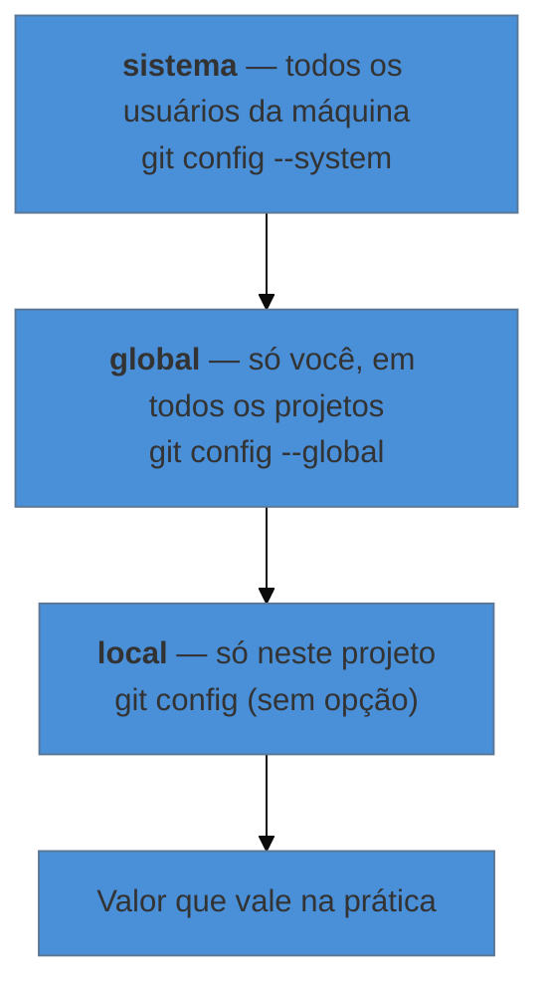

# Instalar e configurar o Git

> [!abstract] TL;DR
> Instalar o Git leva cinco minutos e você faz uma vez por máquina. Configurar leva outros cinco, e também é uma vez só — mas é onde nasce metade dos problemas de quem está começando. Três ajustes importam de verdade: **quem é você** (`user.name` e `user.email`, que assinam cada commit), **qual editor abre** quando o Git pedir um texto, e **como chamar a linha principal** (`main`, hoje o padrão). O resto é conforto.

---

## O único dia em que você faz isso

Diferente de quase todo software, o Git não tem tela de boas-vindas, não pede login e não roda em janela. Você instala e, aparentemente, nada acontece. Isso assusta — mas é o comportamento certo: ele é uma ferramenta de linha de comando que fica esperando ser chamada de dentro da pasta do seu projeto.

A configuração inicial existe por um motivo concreto. Lembra das quatro perguntas que o controle de versão responde — *o quê, quem, quando e por quê*? O "quando" o computador sabe. O "o quê" e o "por quê" você fornece a cada commit. Mas o **"quem"** o Git não tem como adivinhar. Por isso ele se recusa a registrar qualquer coisa antes de você dizer seu nome e seu e-mail.

Essa é toda a burocracia. Vamos passar por ela.

---

## Instalar

### Windows

Baixe em **[git-scm.com/download/win](https://git-scm.com/download/win)** e instale aceitando as opções padrão — elas são sensatas e você pode mudar depois.

A instalação traz junto um programa chamado **Git Bash**, uma janela de terminal que entende os mesmos comandos de Linux e macOS. Use-o. É o que faz as instruções da internet funcionarem na sua máquina sem tradução.

> [!info] Uma opção do instalador que vale reparar
> Numa das telas o instalador pergunta qual editor usar como padrão do Git. Se você não conhece o **Vim** — que costuma ser a opção pré-selecionada em versões antigas —, escolha outra coisa (Notepad++ ou VS Code). Sair do Vim sem saber como é uma experiência de iniciante clássica e desnecessária. Se já passou disso, a seção sobre editor mais abaixo resolve.

### macOS

Abra o Terminal e digite `git --version`. Se o Git não estiver instalado, o próprio sistema oferece instalar as ferramentas de linha de comando — aceite. Alternativa, se você usa [Homebrew](https://brew.sh):

```bash
brew install git
```

### Linux

Pelo gerenciador de pacotes da sua distribuição:

```bash
sudo apt install git      # Debian, Ubuntu, Mint
sudo dnf install git      # Fedora, RHEL
sudo pacman -S git        # Arch, Manjaro
```

### Conferir que deu certo

Em qualquer sistema, abra o terminal (no Windows, o Git Bash) e digite:

```bash
git --version
```

Se aparecer algo como `git version 2.51.0`, está pronto. Se aparecer "comando não encontrado", feche e reabra o terminal antes de concluir que falhou — programas recém-instalados só entram no caminho de busca em janelas novas.

---

## Quem é você

Estes dois comandos são os únicos verdadeiramente obrigatórios:

```bash
git config --global user.name "Ana Ribeiro"
git config --global user.email "ana.ribeiro@universidade.br"
```

O nome pode ser o seu nome mesmo, com espaço e acento — ele vai aparecer no histórico como autoria. Não é usuário de login, não tem senha, não precisa ser único.

> [!warning] Use o mesmo e-mail que você vai usar no serviço de hospedagem
> **O que acontece:** meses depois, você percebe que seus commits aparecem no GitHub como de um autor desconhecido, sem foto e sem link pro seu perfil. Todo o trabalho está lá, mas não é creditado a você.
> **Por quê:** o GitHub liga commits à sua conta comparando o campo de e-mail. Se o e-mail do commit não estiver cadastrado na conta, ele não consegue fazer a ligação.
> **Como evitar:** use aqui o mesmo e-mail que você usará ao criar a conta na nota 05 — ou cadastre ambos os endereços na conta depois. E note: **esse e-mail fica visível** para quem tiver acesso ao repositório. Se isso for um problema, o GitHub oferece um endereço mascarado (`...@users.noreply.github.com`); vale decidir isso antes do primeiro commit, porque corrigir depois exige reescrever o histórico.

---

## Onde essa configuração mora

O `--global` que aparece nos comandos acima não é decoração. O Git guarda configuração em três camadas, e a mais específica sempre vence:



Na prática, você usa `--global` para tudo — é o "meus ajustes, em todos os meus projetos". A camada local existe para casos como: seus projetos pessoais assinam com o e-mail pessoal, mas o projeto do laboratório precisa assinar com o e-mail institucional. Aí, dentro daquela pasta específica, você roda `git config user.email "..."` sem o `--global`, e só ali o valor muda.

Para ver tudo o que está valendo, e de onde cada coisa veio:

```bash
git config --list --show-origin
```

E para conferir um valor só:

```bash
git config user.name
```

---

## Chamar a linha principal de `main`

Todo repositório tem uma linha de trabalho principal. Por décadas, o nome padrão dela foi `master`. Em 2020, a comunidade migrou para `main` — uma mudança de vocabulário adotada pelo GitHub, pelo GitLab e pelo próprio Git.

Configure isso agora, para não misturar os dois nomes na sua própria máquina:

```bash
git config --global init.defaultBranch main
```

Você vai encontrar `master` em tutoriais antigos, em vídeos e em projetos que começaram antes de 2020 — inclusive em [material meu, de 2016](https://github.com/josenaldo/workshop-git). Quando encontrar, é só ler como sinônimo: é o mesmo conceito com outro nome.

---

## O editor que abre quando o Git pede um texto

Em alguns momentos o Git precisa que você escreva um texto mais longo do que cabe numa linha — a mensagem de um commit, por exemplo. Ele abre um editor para isso. Se você não escolher qual, ele abre o padrão do sistema, que em muitas máquinas é o Vim.

Para evitar surpresa, escolha:

```bash
# VS Code (o --wait é essencial: faz o Git esperar você fechar a aba)
git config --global core.editor "code --wait"

# Nano — simples, roda no terminal, mostra os atalhos na tela
git config --global core.editor "nano"

# Bloco de Notas, no Windows
git config --global core.editor "notepad"
```

> [!question]- O Vim abriu e eu não consigo sair. E agora?
> Acontece com todo mundo. O Vim tem dois modos, e ao abrir você está no modo de comandos — por isso digitar não escreve nada. Para sair **descartando**: pressione `Esc`, digite `:q!` e tecle Enter. Para **salvar e sair**: `Esc`, depois `:wq`, Enter. Feito isso, configure outro editor com um dos comandos acima e siga a vida.

---

## Fim de linha: o ajuste que só importa se você colaborar

Este é técnico e chato, mas evita um problema real. Windows e Unix (macOS/Linux) marcam o fim de uma linha de texto de formas diferentes. Quando pessoas dos dois mundos editam o mesmo arquivo, o Git pode passar a enxergar **o arquivo inteiro como modificado** só por causa dessas marcas invisíveis — o que polui o histórico e torna impossível ver o que de fato mudou.

O ajuste preventivo:

```bash
git config --global core.autocrlf true    # Windows
git config --global core.autocrlf input   # macOS e Linux
```

Se você trabalha sozinho e sempre na mesma máquina, isso nunca vai te incomodar. Configure mesmo assim — custa um comando, e o dia em que alguém entrar no projeto você já estará protegido.

---

## Pedir ajuda sem sair do lugar

O Git traz o manual inteiro embutido, offline:

```bash
git help commit     # manual completo do comando, no navegador ou no terminal
git commit -h       # resumo curto das opções, direto na tela
```

O `-h` é o que você mais vai usar na prática: é rápido e cabe na tela.

---

## E as interfaces gráficas?

Existem e funcionam. **GitHub Desktop** (gratuito, o mais simples), **Sourcetree**, **GitKraken** e a integração nativa do **VS Code** e do **Word via Overleaf** cobrem o dia a dia sem terminal.

A recomendação deste material é aprender os comandos primeiro e usar a janela depois, por um motivo prático: os comandos são idênticos em qualquer máquina e em qualquer tutorial da internet, enquanto cada programa gráfico inventa seus próprios nomes e botões. Quem aprende pela janela costuma travar quando a ajuda encontrada não corresponde ao que está vendo.

Quando quiser uma camada visual sem abrir mão do terminal, o vault cobre o **Lazygit** em [[03-Dominios/Tecnologia/Terminal/index|Terminal]] — mas isso é assunto para bem depois deste nível.

---

## Resumo em uma frase

**Instalar é copiar um programa; configurar é dizer ao Git quem assina o seu trabalho — e sem isso ele se recusa a registrar qualquer coisa.**

> [!tip] Pratique
> Rode `git config --list --show-origin` na sua máquina agora e leia a saída linha por linha. Você deve encontrar `user.name`, `user.email` e `init.defaultBranch` apontando para um arquivo chamado `.gitconfig` na sua pasta pessoal. Abra esse arquivo num editor de texto: ele é legível, tem umas dez linhas, e ver que "a configuração do Git" é só isso desmistifica bastante coisa.

---

## O que vem a seguir

A máquina está pronta e o Git sabe quem você é. Falta o principal: criar a linha do tempo de um projeto de verdade e salvar o primeiro ponto nela. É a próxima nota, e é onde o Git finalmente faz alguma coisa visível.

- **03 — Seu primeiro repositório** — transformar uma pasta comum num projeto versionado, e entender os três lugares onde um arquivo pode estar.
- [[03-Dominios/Tecnologia/Controle de Versão/N0 - Sobrevivência/01 - O problema que o Git resolve|01 — O problema que o Git resolve]] — se pulou direto pra cá, vale ler antes por que estamos fazendo isso.

## Fontes

- **Scott Chacon & Ben Straub** — [*Pro Git*, cap. 1 — "Configuração Inicial do Git"](https://git-scm.com/book/pt-br/v2/Come%C3%A7ando-Configura%C3%A7%C3%A3o-Inicial-do-Git) — a referência oficial para `user.name`, `user.email`, editor e níveis de configuração.
- **Git** — [*git-config — documentação*](https://git-scm.com/docs/git-config) — lista completa das chaves, incluindo `init.defaultBranch` e `core.autocrlf`.
- **GitHub Docs** — [*Setting your commit email address*](https://docs.github.com/en/account-and-profile/setting-up-and-managing-your-personal-account-on-github/managing-email-preferences/setting-your-commit-email-address) — como o e-mail liga commits à conta, e o endereço mascarado.
- **Josenaldo Matos** — [*workshop-git*](https://github.com/josenaldo/workshop-git) (2016), Tomo 3 — a sequência de configuração inicial (identidade, editor, ferramenta de diff, ajuda) que estrutura esta nota.
