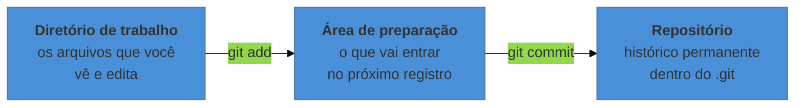
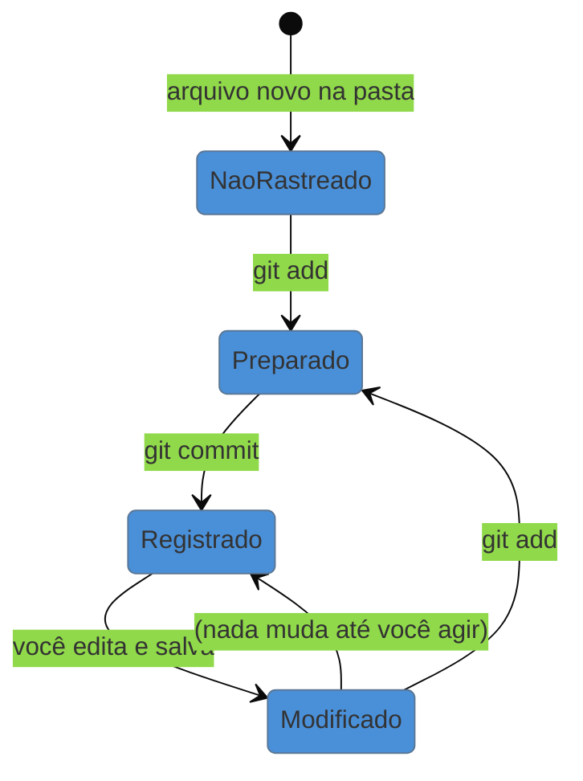

# Seu primeiro repositório

> [!abstract] TL;DR
> Um repositório é uma pasta comum com uma subpasta oculta `.git` dentro, onde mora todo o histórico. Você cria com `git init` e passa a usar quatro comandos pro resto da vida: `git status` (onde estou?), `git add` (o que entra no próximo registro), `git commit` (registra, com o motivo escrito) e `git log` (o que já registrei). O detalhe que confunde todo iniciante é que salvar o arquivo **não** é registrar no Git — são duas ações separadas, e essa separação é deliberada.

---

## Transformando uma pasta comum em projeto versionado

Vamos usar um caso concreto: a pasta da sua monografia. Digamos que ela esteja em `Documentos/monografia` e contenha o capítulo 1 já começado.

Abra o terminal **dentro dessa pasta** (no Windows: clique com o botão direito na pasta e escolha "Git Bash Here"; no macOS e Linux, `cd Documentos/monografia`). Então:

```bash
git init
```

A resposta é uma linha só, algo como `Initialized empty Git repository in .../monografia/.git/`. E, aparentemente, nada mudou — seus arquivos continuam lá, intocados.

Mudou uma coisa: apareceu uma pasta oculta chamada **`.git`**. É ali que o histórico inteiro vai morar, e é o que diferencia uma pasta comum de um repositório.

> [!info] A regra de ouro sobre a pasta `.git`
> Não mexa nela, não a apague, não a mova para fora, não a renomeie. Ela é o repositório. Se você copiar a pasta `monografia` para um pendrive e a `.git` for junto, você levou o projeto inteiro com todo o histórico. Se apagar a `.git`, sobram apenas os arquivos na versão atual — o passado inteiro se perde, e não há como recuperar.

---

## Os três lugares onde um arquivo pode estar

Aqui está o conceito que faz o Git parecer estranho no primeiro dia. Ele não trabalha com dois estados ("salvo" e "não salvo"), e sim com três lugares:



A pergunta óbvia é: **por que três, e não dois?** Por que não simplesmente "registrar tudo o que mudou"?

Porque nem tudo o que você mudou pertence ao mesmo assunto. Numa tarde de trabalho você pode ter corrigido três erros de digitação no capítulo 1, reescrito a metodologia inteira e ajustado a formatação da bibliografia. São três coisas distintas. Se o Git registrasse tudo de uma vez, seu histórico teria um único ponto chamado "mexi em várias coisas" — que é quase tão inútil quanto `monografia_final_v2.docx`.

A área de preparação existe pra você **montar cada registro deliberadamente**: separo primeiro o que é a metodologia, registro com a mensagem certa; depois separo a formatação, registro com outra mensagem.

> [!example] A analogia da mudança
> Pense em empacotar uma casa. O **diretório de trabalho** é a casa com tudo espalhado. A **área de preparação** é a caixa aberta no chão, onde você vai colocando o que pertence junto. O **commit** é fechar a caixa e escrever na tampa: "cozinha — panelas e talheres".
>
> Ninguém joga a casa inteira numa caixa só. E ninguém escreve "coisas" na tampa.

---

## O comando que você mais vai usar

`git status` responde "onde eu estou e o que está pendente". Rode-o sempre que estiver em dúvida — ele é a bússola, e é impossível estragar nada com ele.

```bash
git status
```

Logo depois do `git init`, a resposta será algo assim:

```text
No commits yet

Untracked files:
  (use "git add <file>..." to include in what will be committed)
        capitulo-1.tex
        referencias.bib
```

**Untracked** ("não rastreado") significa: "vejo esse arquivo na pasta, mas nunca me pediram pra cuidar dele". É o estado inicial de tudo.

---

## Registrando o primeiro ponto na linha do tempo

Primeiro, coloque na caixa:

```bash
git add capitulo-1.tex referencias.bib
```

Rode `git status` de novo. Os arquivos agora aparecem sob **"Changes to be committed"** — estão na área de preparação, prontos.

Agora feche a caixa e escreva na tampa:

```bash
git commit -m "Estrutura inicial: capítulo 1 e arquivo de referências"
```

Pronto. Existe um ponto na linha do tempo ao qual você pode voltar para sempre.

O `-m` é a mensagem. Sem ele, o Git abre aquele editor que configuramos na nota anterior para você escrever um texto mais longo. Para começar, `-m` com uma frase basta.

---

## Vendo o que já foi registrado

```bash
git log
```

Mostra os commits do mais recente para o mais antigo, cada um com autor, data, uma sequência longa de letras e números (o identificador do commit) e a sua mensagem. Para uma visão compacta:

```bash
git log --oneline
```

```text
a3f1c9d Estrutura inicial: capítulo 1 e arquivo de referências
```

Essa lista é a resposta às quatro perguntas da nota 01, materializada.

---

## O ciclo que se repete pra sempre

Você editou o capítulo 1. Salvou no seu editor. Rode `git status`:

```text
Changes not staged for commit:
        modified:   capitulo-1.tex
```

Repare: o arquivo aparece como **modified**, não como untracked. O Git já conhece esse arquivo e percebeu que ele mudou desde o último commit — mas **não** registrou nada. Salvar no editor e registrar no Git são ações separadas, e é isso que dá a você o controle sobre o que entra em cada ponto do histórico.

O ciclo diário completo, então:



Quatro comandos, em ordem: `status` para ver, `add` para separar, `commit` para registrar, `log` para conferir. É literalmente isso, todos os dias, para sempre. Tudo o que vem nos próximos níveis é variação em cima desse ciclo.

---

## Escrevendo mensagens que servem pra alguma coisa

A mensagem é para o **você do futuro**, que não vai lembrar de nada. Uma régua simples: a mensagem deve completar a frase "*este commit, se aplicado, vai...*".

| Mensagem ruim | Por que falha | Melhor |
|---|---|---|
| `att` | não diz nada | `Revisa a introdução após leitura da banca` |
| `mudanças` | idem | `Adiciona seção de limitações no capítulo 3` |
| `capitulo3.tex` | repete o que o Git já sabe | `Reescreve a análise dos dados de 2024` |
| `correções e ajustes e mais coisas` | são vários commits em um | separe em três |

Não precisa ser bonito nem longo. Precisa dizer **o que mudou e, quando não for óbvio, por quê**. Existe um formato padronizado de mensagens muito usado no mercado — mas isso é assunto de um nível bem mais adiante; por ora, uma frase clara em português resolve.

---

## Armadilhas comuns

> [!warning] `git add .` varre coisa que você não queria
> **O que acontece:** o ponto significa "tudo nesta pasta e nas subpastas". Você acaba registrando arquivos temporários do LaTeX, backups do Word (`~$arquivo.docx`), PDFs gerados, bases de dados pesadas e — o caso perigoso — arquivos com dados sensíveis. **Por quê:** o Git não julga o conteúdo; ele obedece. **Como evitar:** no começo, prefira listar os arquivos por nome. Quando a pasta ficar grande demais pra isso, a solução é o arquivo `.gitignore`, que é a primeira nota do próximo nível.

> [!warning] Editar e achar que está registrado
> **O que acontece:** você trabalha a semana inteira, salvando no editor a cada parágrafo, e no fim descobre que o histórico não tem nada desde segunda-feira. **Por quê:** `Ctrl+S` fala com o seu editor. `git commit` fala com o Git. São canais independentes. **Como evitar:** crie o hábito de rodar `git status` ao terminar uma sessão de trabalho. Se aparecer qualquer coisa em vermelho, você tem trabalho não registrado.

> [!warning] O commit gigante de fim de semana
> **O que acontece:** um único commit com 40 arquivos e a mensagem "trabalho do fim de semana". Quando você precisar voltar atrás, vai ter que escolher entre desfazer *tudo* ou *nada*. **Por quê:** a unidade de volta é o commit. Commit grande, volta grosseira. **Como evitar:** commite ao terminar cada pedaço que você consegue descrever numa frase. Vários commits pequenos não custam nada — o Git foi feito pra isso.

> [!warning] Versionar o PDF gerado junto com a fonte
> **O que acontece:** o repositório engorda rápido e cada commit mostra "o PDF mudou", sem informação útil. **Por quê:** PDF é binário, e é *derivado* — pode ser gerado de novo a partir do `.tex` ou `.md`. **Como evitar:** versione a fonte; deixe o produto de fora (de novo: `.gitignore`, próximo nível). A exceção razoável é a versão final entregue, que às vezes vale guardar como registro.

---

## Resumo em uma frase

**Repositório é uma pasta com memória: `add` escolhe o que entra na próxima lembrança, `commit` a grava com uma legenda, e nada disso acontece só porque você salvou o arquivo.**

> [!tip] Vídeo — o ciclo de vida dos arquivos
> [**09. Ciclo de vida dos arquivos - Git e Github para Iniciantes**](https://www.youtube.com/watch?v=MOuN_cYcsJ4) (Willian Justen, 11 min) mostra na tela a transição untracked → staged → committed → modified. É a versão animada do diagrama de estados desta nota.

> [!tip] Pratique
> Faça os níveis **1 e 2 da sequência "Introdução"** do [Learn Git Branching em português](https://learngitbranching.js.org/?locale=pt_BR) — são os dois primeiros, sobre `git commit`. Leva cinco minutos e você vê os commits se enfileirando na tela conforme digita, o que fixa a ideia de "linha do tempo" muito mais rápido do que ler sobre ela.
>
> Depois, no seu próprio projeto: faça três commits pequenos em vez de um grande e rode `git log --oneline`. A lista que aparece é o índice do seu trabalho.

---

## O que vem a seguir

Você já registra pontos na linha do tempo. Mas a razão de ter feito tudo isso era poder **voltar** — e é aí que mora o medo de quem está começando: "e se eu apagar alguma coisa sem querer?". A próxima nota é sobre desfazer, que é onde o Git deixa de ser burocracia e passa a valer a pena.

- **04 — Desfazer sem susto** — descartar uma edição ruim, tirar um arquivo da caixa antes de fechá-la, e corrigir a última mensagem.
- [[03-Dominios/Tecnologia/Controle de Versão/N0 - Sobrevivência/02 - Instalar e configurar o Git|02 — Instalar e configurar o Git]] — se o `git commit` reclamou de identidade, a solução está aqui.

## Fontes

- **Scott Chacon & Ben Straub** — [*Pro Git*, cap. 2 — "Gravando Alterações no Repositório"](https://git-scm.com/book/pt-br/v2/Fundamentos-de-Git-Gravando-Altera%C3%A7%C3%B5es-no-Reposit%C3%B3rio) — a fonte do ciclo de vida do arquivo e dos três estados.
- **Git** — [*git-status*](https://git-scm.com/docs/git-status) · [*git-add*](https://git-scm.com/docs/git-add) · [*git-commit*](https://git-scm.com/docs/git-commit) — documentação oficial dos comandos usados aqui.
- **Roger Dudler** — [*Git — Guia prático (PT-BR)*](https://rogerdudler.github.io/git-guide/index.pt_BR.html) — o mesmo ciclo em uma página, útil como cola.
- **Josenaldo Matos** — [*workshop-git*](https://github.com/josenaldo/workshop-git) (2016), Tomo 4 — "Git essencial": o ciclo de vida do arquivo e a sequência status/add/commit/log.
