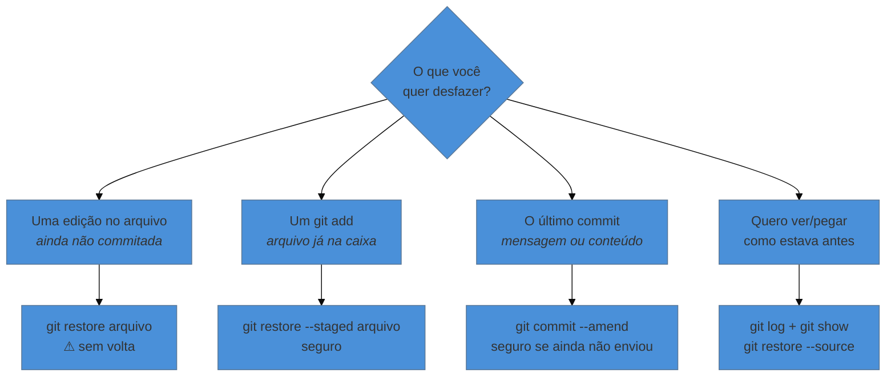

# Desfazer sem susto

> [!abstract] TL;DR
> Quatro situações cobrem 95% dos arrependimentos de quem está começando: descartar uma edição que ainda não foi registrada (`git restore`), tirar um arquivo da caixa antes de fechá-la (`git restore --staged`), corrigir a mensagem do último commit ou incluir um arquivo esquecido nele (`git commit --amend`), e recuperar um arquivo como ele estava num ponto anterior. A regra que organiza tudo: **depois de um commit, é quase impossível perder trabalho; antes dele, é fácil**.

---

## O medo que trava todo mundo

Quem está começando com Git costuma travar no mesmo ponto: "e se eu digitar o comando errado e apagar meu trabalho?".

O medo é legítimo, mas está mirando no lugar errado. A verdade prática é o contrário do que parece:

> **Trabalho que virou commit é extremamente difícil de perder. Trabalho que nunca virou commit não tem proteção nenhuma.**

O Git é conservador por natureza: quase tudo o que ele faz **acrescenta** informação, e ele mantém rastros até do que você "apagou". Existe um comando específico para recuperar coisas que pareciam perdidas — inclusive commits que você deletou de propósito. Ele se chama `reflog`, e tem uma nota inteira dedicada a ele em um nível bem mais adiante.

Portanto, a lição de segurança do nível 0 é curta: **commite com frequência**. Cada commit é um ponto de retorno garantido. O resto desta nota é sobre como voltar a eles.

---

## As quatro situações



---

### 1. "Estraguei este arquivo e quero como estava no último commit"

Você reescreveu uma seção, não gostou, e quer simplesmente jogar fora o que fez desde o último registro:

```bash
git restore capitulo-1.tex
```

O arquivo volta exatamente ao estado do último commit. Para descartar as edições de **todos** os arquivos de uma vez:

```bash
git restore .
```

> [!warning] Este é o único comando genuinamente perigoso do nível 0
> **O que acontece:** o trabalho descartado **some para sempre**. Não vai pro reflog, não vai pra lixeira, não tem `Ctrl+Z`. **Por quê:** aquelas edições nunca chegaram a entrar no Git — ele não tem cópia delas para devolver. Você está pedindo pra sobrescrever o arquivo com a versão que ele *tem*. **Como evitar:** antes de rodar, confira com `git status` (o que está pendente?) e `git diff` (o que exatamente vou perder?). E, na dúvida, faça um commit em vez de descartar: commit ruim se conserta depois; trabalho descartado, não.

---

### 2. "Fiz `git add` num arquivo que não devia entrar"

Você separou arquivos para o próximo commit e percebeu que um deles não pertence ali:

```bash
git restore --staged pdf-gerado.pdf
```

O arquivo sai da área de preparação e volta a ser apenas "modificado". **Suas edições continuam intactas** — o comando só desfaz a escolha de incluí-lo, não o conteúdo. É uma operação totalmente segura.

> [!question]- Por que os dois comandos são quase iguais, se um é perigoso e o outro não?
> Porque a diferença está em *de onde* o Git copia para *onde*. Sem o `--staged`, ele copia do último commit por cima do seu arquivo — e o que estava no arquivo se perde. Com o `--staged`, ele copia do último commit por cima da **área de preparação**, e o seu arquivo nem é tocado. Se essa proximidade te incomoda, você não está sozinho: até 2019 as duas operações eram feitas pelo mesmo comando (`git checkout`), que fazia meia dúzia de coisas diferentes conforme os argumentos — motivo de confusão histórica. O `restore` foi criado justamente para separar essas responsabilidades. Você ainda vai encontrar `git checkout -- arquivo` em tutoriais antigos; é a forma antiga do primeiro caso.

---

### 3. "Commitei, mas a mensagem está errada" (ou esqueci um arquivo)

Para corrigir a mensagem do último commit:

```bash
git commit --amend -m "Revisa a introdução após leitura da banca"
```

Para incluir um arquivo que você esqueceu, sem criar um commit novo:

```bash
git add referencias.bib
git commit --amend --no-edit
```

O `--no-edit` significa "mantenha a mensagem que já estava lá".

> [!warning] `--amend` só é seguro antes de compartilhar
> **O que acontece:** se você já enviou o commit para a nuvem e depois usa `--amend`, o Git vai recusar o próximo envio, reclamando que as histórias divergiram. **Por quê:** o `--amend` não edita o commit; ele **cria um commit novo** no lugar do antigo. Se outra pessoa (ou o servidor) já tinha o antigo, agora existem duas versões incompatíveis da mesma história. **Como evitar:** guarde a regra — **antes de enviar, a história é sua e você pode reescrever; depois de enviar, ela é de todos**. Essa regra vai reaparecer com nome próprio bem mais adiante ("a regra de ouro do rebase"); por ora, ela basta como hábito.

---

### 4. "Quero ver — ou recuperar — como estava antes"

Primeiro, ache o ponto no tempo:

```bash
git log --oneline
```

```text
c4d2e1a Adiciona seção de limitações
a3f1c9d Estrutura inicial: capítulo 1 e referências
```

Aquele código curto na frente (`a3f1c9d`) é o endereço do commit. Com ele, você pode **ver** o que aconteceu naquele ponto:

```bash
git show a3f1c9d
```

Ou trazer **um arquivo específico** de volta como ele estava lá, sem mexer no resto do projeto:

```bash
git restore --source=a3f1c9d capitulo-1.tex
```

Esse último é o comando que resolve o caso clássico: *"aquele parágrafo que eu apaguei em abril era melhor, quero ele de volta"*. Você não precisa desfazer nada do que veio depois — só puxa a versão antiga daquele arquivo, olha, e decide o que aproveitar.

> [!info] E se eu quiser voltar o projeto inteiro para um ponto antigo?
> Dá, e há mais de uma forma — algumas seguras, outras destrutivas, e a escolha certa depende de você já ter compartilhado ou não a história. Esse é justamente o tipo de decisão que merece uma árvore de decisão inteira, e por isso ela tem nota própria (`22 — A árvore de decisão do desfazer`) num nível mais avançado. Enquanto você não chegar lá: para **consultar** o passado, os comandos desta seção bastam e são seguros. Para **reverter** o projeto todo, evite copiar comandos da internet sem entender — é exatamente aí que as pessoas perdem trabalho.

---

## Um hábito que substitui metade dos desfazeres

Antes de qualquer coisa arriscada, pergunte ao Git o que está em jogo:

```bash
git status    # o que está pendente e em que estado
git diff      # exatamente quais linhas mudaram e ainda não foram preparadas
```

`git diff` mostra linha a linha o que você alterou desde o último commit — o que sai com `-` some, o que entra com `+` fica. Ler essa saída antes de descartar qualquer coisa é o equivalente a olhar dentro da lixeira antes de esvaziá-la.

E o hábito que resolve o resto: **commite antes de tentar algo grande**. Vai reestruturar os capítulos? Commite o estado atual primeiro. Se der errado, um `git restore .` te devolve intacto ao ponto anterior — e você acabou de transformar uma operação de risco em uma operação reversível.

---

## Resumo em uma frase

**Commit é o ponto de retorno: antes dele você desfaz descartando (e perde), depois dele você desfaz voltando (e não perde).**

> [!tip] Vídeo — desfazer sem perder trabalho
> [**Curso de Git - Como desfazer mudanças com git reset**](https://www.youtube.com/watch?v=7V2fQBLLVts) (Boson Treinamentos, 17 min) vai além do que esta nota cobre (entra em `reset`, assunto da nota 22), mas a primeira metade é exatamente o desfazer seguro do nível 0.

> [!tip] Pratique
> No seu projeto, faça o exercício completo: edite um arquivo, rode `git diff` pra ver a mudança, e descarte com `git restore`. Depois edite de novo, faça `git add`, e tire da caixa com `git restore --staged` — confirmando com `git status` que a edição continua lá. Fazer os dois em sequência é o que fixa a diferença entre eles.
>
> Para treinar o caso 3 num ambiente onde não há nada a perder, o **[Visualizing Git](https://git-school.github.io/visualizing-git/)** aceita `git commit --amend` e mostra o commit antigo sendo substituído por um novo — ver isso desenhado explica o aviso acima melhor do que qualquer parágrafo.

---

## O que vem a seguir

Você cria pontos na linha do tempo e sabe voltar a eles. Falta o que protege contra o problema que nenhum comando resolve: o computador quebrar. Tudo o que fizemos até aqui vive numa única pasta, numa única máquina. A próxima nota coloca uma cópia na internet — e, de quebra, abre a porta pra trabalhar de outro lugar e com outras pessoas.

- **05 — GitHub: colocar o repositório na nuvem** — conta, repositório remoto, `push` e `clone`.
- [[03-Dominios/Tecnologia/Controle de Versão/N0 - Sobrevivência/03 - Seu primeiro repositório|03 — Seu primeiro repositório]] — se os três lugares (trabalho / preparação / repositório) ainda não estão claros, esta nota depende deles.

## Fontes

- **Scott Chacon & Ben Straub** — [*Pro Git*, cap. 2 — "Desfazendo Coisas"](https://git-scm.com/book/pt-br/v2/Fundamentos-de-Git-Desfazendo-Coisas) — a referência oficial de `--amend` e do desfazer básico, incluindo os avisos sobre história já publicada.
- **Git** — [*git-restore*](https://git-scm.com/docs/git-restore) — comando introduzido no Git 2.23 (2019) para separar as responsabilidades que antes se acumulavam em `git checkout`.
- **Oh Shit, Git!?! (PT-BR)** — [ohshitgit.com/pt_BR](https://ohshitgit.com/pt_BR) — receitas curtas para os arrependimentos mais comuns; útil manter aberto nos primeiros meses.
- **Josenaldo Matos** — [*workshop-git*](https://github.com/josenaldo/workshop-git) (2016), Tomo 4 — a seção "Desfazendo coisas no git", que já abria com o aviso de que esta é uma das poucas áreas onde se pode perder trabalho.
