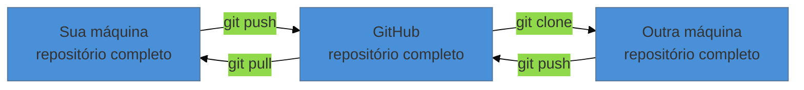

# GitHub — colocar o repositório na nuvem

> [!abstract] TL;DR
> Até aqui, todo o seu histórico vive num único disco — e disco quebra. O GitHub (ou GitLab, ou Bitbucket) hospeda uma cópia completa do repositório na internet: vira backup, vira acesso de qualquer máquina, e vira o canal por onde outras pessoas colaboram. São três comandos novos: `git remote add` (uma vez), `git push` (sempre que quiser sincronizar) e `git clone` (para baixar em outra máquina). O ponto de atenção não é técnico: é **escolher entre repositório público e privado com consciência** — e nunca subir dado sensível.

---

## O problema que ainda não resolvemos

Você tem uma linha do tempo impecável do seu trabalho: dezenas de commits, cada um com mensagem, autor e data. Consegue voltar a qualquer ponto.

Tudo isso está numa pasta oculta chamada `.git`, dentro de uma pasta, dentro de um computador. Se esse computador for roubado, se o disco falhar, ou se você derramar café no teclado na semana da defesa, você perde o trabalho **e** o histórico inteiro de uma vez só.

O commit protege você dos **seus próprios erros**. Ele não protege de nada que aconteça com a máquina. É por isso que esta nota existe — e é a razão pela qual ela é a última do nível de sobrevivência.

---

## Git e GitHub, de novo

Vale repetir a distinção da nota 01, porque é aqui que ela vira prática:

- **Git** é o programa no seu computador. Faz commits, guarda histórico, funciona offline.
- **GitHub** é um site que guarda repositórios Git. É um lugar, não uma ferramenta.

A relação é a mesma entre um arquivo `.docx` e o Google Drive: o formato funciona sozinho; o serviço é onde você guarda uma cópia e compartilha.

E há alternativas equivalentes — **GitLab**, **Bitbucket**, **Codeberg**, ou um servidor da sua própria universidade. Como o formato é aberto, mudar de serviço depois é indolor: o repositório é o mesmo em qualquer um deles. Este material usa o GitHub por ser o mais comum, não por ser obrigatório.

---

## Criar a conta e o repositório

1. Crie a conta em [github.com](https://github.com). **Use o mesmo e-mail** que você configurou na nota 02 — é o que faz seus commits aparecerem creditados a você.
2. No canto superior direito, **New repository**.
3. Dê um nome (`monografia`, por exemplo). Não crie README, `.gitignore` nem licença por enquanto — seu repositório local já existe, e criar arquivos do lado de lá complica o primeiro envio.
4. **Escolha entre público e privado.** Leia a próxima seção antes de decidir.

> [!warning] Público significa público para o mundo inteiro, para sempre
> **O que acontece:** um repositório público pode ser lido, baixado e copiado por qualquer pessoa — e por robôs, que indexam repositórios continuamente. Se você subir algo por engano e apagar dez minutos depois, presuma que já foi copiado. **Por quê:** não há como retirar da circulação o que foi publicado; e mesmo dentro do seu próprio repositório, apagar um arquivo num commit novo **não o remove do histórico** — ele continua acessível nos commits anteriores. **Como evitar:** em caso de dúvida, **comece privado**. Você pode tornar público depois com dois cliques; o contrário não existe. Isso vale especialmente para: tese ainda não defendida, dados de pesquisa com informação de participantes, material sob embargo editorial, e qualquer arquivo com senha ou chave de acesso.

Para trabalho acadêmico, uma régua simples: **privado enquanto está em construção; público quando (e se) for publicado.**

---

## Conectar o seu repositório ao remoto

Depois de criar, o GitHub mostra uma tela com comandos. São estes:

```bash
git remote add origin https://github.com/seu-usuario/monografia.git
git branch -M main
git push -u origin main
```

Traduzindo linha por linha:

- **`git remote add origin <url>`** — "guarde este endereço com o apelido `origin`". `origin` é só uma convenção de nome para "o servidor principal deste projeto"; não tem nada de especial nele.
- **`git branch -M main`** — garante que sua linha principal se chame `main` (assunto da nota 02). Se você já configurou `init.defaultBranch`, esta linha não faz nada.
- **`git push -u origin main`** — envia. O `-u` grava a associação, de modo que daqui em diante basta `git push`.



Repare que as três caixas dizem a mesma coisa: **repositório completo**. Isso é o "distribuído" da nota 01 aparecendo na prática — o GitHub não é um lugar privilegiado que tem o "original". Ele é só mais uma cópia, que por acaso está sempre ligada.

---

## A autenticação, que confunde todo mundo

Ao rodar o primeiro `git push`, o Git vai querer saber quem você é perante o GitHub. E aqui há uma pegadinha histórica:

> [!warning] Sua senha do GitHub não funciona no `git push`
> **O que acontece:** você digita usuário e senha e recebe um erro de autenticação, mesmo com a senha certa. **Por quê:** o GitHub desativou autenticação por senha para operações de Git em **agosto de 2021**, por segurança. A senha continua valendo para entrar no site — só não para o `push`. **Como resolver:** escolha um dos caminhos abaixo.

**Caminho 1 — deixe uma ferramenta cuidar disso (mais simples).** No Windows, o instalador do Git já inclui o *Git Credential Manager*: o primeiro `push` abre uma janela do navegador, você autoriza, e nunca mais pensa no assunto. No macOS e Linux, instalar o [GitHub CLI](https://cli.github.com) e rodar `gh auth login` resolve do mesmo jeito.

**Caminho 2 — token de acesso pessoal.** Nas configurações do GitHub, gere um *Personal Access Token* e use-o **no lugar da senha** quando o Git perguntar. Guarde-o num gerenciador de senhas: ele não é exibido de novo.

**Caminho 3 — chaves SSH.** Mais robusto e sem digitar nada depois de configurado, mas exige alguns passos a mais. É o que a maioria dos desenvolvedores usa no longo prazo; não é necessário agora.

---

## O ciclo diário, agora completo

```bash
git status                       # o que mudou?
git add capitulo-2.tex           # separa o que entra
git commit -m "Escreve a seção de metodologia"
git push                         # manda pra nuvem
```

O `push` no fim da sessão de trabalho é o novo hábito. Uma boa regra: **commite quantas vezes quiser durante o dia; envie pelo menos uma vez ao fim dele.** Enquanto você não enviar, o backup não existe.

E, ao começar a trabalhar numa máquina diferente da que você usou por último:

```bash
git pull                         # traz o que estiver no servidor
```

---

## Trabalhar de outra máquina

No computador do laboratório, ou no notebook novo:

```bash
git clone https://github.com/seu-usuario/monografia.git
```

Isso baixa a pasta **com todo o histórico junto** — não só os arquivos atuais. Você pode ver commits de meses atrás, comparar versões e voltar no tempo, tudo offline, a partir de uma cópia recém-baixada.

É aqui que a diferença entre `clone` e "baixar o ZIP" fica clara: o ZIP traz o presente; o clone traz a memória.

---

## O README, e por que ele importa

Se você criar um arquivo chamado `README.md` na raiz do projeto, o GitHub o exibe formatado na página inicial do repositório. É a capa do trabalho.

Para um projeto acadêmico, três parágrafos bastam: o que é este trabalho, quem são os autores, e como reproduzir/compilar (por exemplo, qual comando gera o PDF). O formato é **Markdown** — texto puro com marcações simples, `# ` para título e `**negrito**` para negrito.

> [!info] Um bônus para quem publica pesquisa
> O GitHub tem integração com o **[Zenodo](https://zenodo.org)**, repositório mantido pelo CERN: ao publicar uma versão do seu repositório, você recebe um **DOI** — o identificador que torna o material citável formalmente em publicações. É o caminho usual para citar código, dados e material suplementar de um artigo. Guarde a informação para quando o trabalho estiver pronto.

---

## Armadilhas comuns

> [!warning] Arquivos grandes travam o envio
> **O que acontece:** o `push` falha com uma reclamação sobre tamanho de arquivo. **Por quê:** o GitHub avisa acima de 50 MB e **bloqueia arquivos acima de 100 MB**. Bases de dados brutas, vídeos e imagens de microscopia estouram isso com facilidade. **Como evitar:** não versione dados brutos pesados — versione o script que os processa e guarde os dados em um repositório de dados apropriado (Zenodo, OSF, Figshare, ou o servidor da instituição). Existe uma extensão para arquivos grandes (Git LFS), mas ela é assunto de um nível bem avançado.

> [!warning] Commitar segredo em repositório público
> **O que acontece:** uma senha, uma chave de API ou um arquivo de configuração com credenciais vai junto no commit. **Por quê:** o `git add .` não distingue conteúdo, e robôs varrem repositórios públicos procurando exatamente isso — em minutos, não em dias. **Como evitar:** se acontecer, **troque a credencial imediatamente** — apagar o arquivo não basta, porque o histórico guarda tudo. A remoção do histórico é possível, mas trabalhosa, e tem nota própria num nível avançado. Prevenção: repositório privado por padrão e, mais adiante, `.gitignore`.

> [!warning] Achar que commit é backup
> **O que acontece:** meses de commits impecáveis, zero `push`. O HD falha e leva tudo. **Por quê:** commit grava no seu disco. Só o `push` copia para outro lugar. **Como evitar:** o hábito do fim do dia. Se quiser garantia extra, nada impede ter **dois remotos** (GitHub e GitLab, por exemplo) — o Git aceita quantos você quiser, e enviar para ambos é literalmente outro `git push`.

---

## Resumo em uma frase

**`commit` protege você de você; `push` protege você do mundo físico — e só depois dos dois o trabalho está de fato seguro.**

> [!tip] Vídeo — do repositório local à nuvem
> [**GitHub + GitHub Desktop: criar repositório, clonar, commit e push**](https://www.youtube.com/watch?v=nAHVEzDBVeo) (Professor Edson Maia, 7 min) faz o caminho completo desta nota pela interface gráfica — útil se você preferir ver antes de digitar.

> [!tip] Pratique
> Faça o teste que prova que funcionou: depois do primeiro `push`, apague a pasta do projeto do seu computador (sim, apague — você acabou de subir tudo) e rode `git clone` do zero em outro diretório. Abra o resultado, rode `git log --oneline` e confirme que todos os commits estão lá.
>
> Fazer isso uma vez, de propósito e sem risco, é o que transforma "acho que está salvo" em "sei que está salvo".
>
> Para praticar o lado plataforma com correção automática, o **[GitHub Skills](https://skills.github.com/)** roda cursos dentro de um repositório seu — comece pelo *Introduction to GitHub*.

---

## O que vem a seguir

Você chegou ao fim do nível 0. Recapitulando o que você sabe fazer agora: entender por que versionar, instalar e configurar, criar um repositório, registrar commits com mensagem, desfazer os erros mais comuns, e manter uma cópia segura na nuvem. **Isso é suficiente para nunca mais perder um trabalho** — que era a promessa deste nível.

O nível 1 é sobre operar isso num projeto de verdade: parar de versionar lixo, ler o histórico com proveito, criar linhas de trabalho paralelas para testar ideias sem medo, e resolver o momento em que duas pessoas mexem no mesmo parágrafo.

- **06 — Ignorar arquivos: `.gitignore` e suas regras** — a primeira nota do N1, e a solução para os PDFs, temporários e dados pesados que apareceram como armadilha em três notas seguidas.
- [[03-Dominios/Tecnologia/Controle de Versão/N0 - Sobrevivência/index|N0 — Sobrevivência]] — o índice do nível, se quiser revisar algo.
- [[03-Dominios/Tecnologia/Controle de Versão/Biblioteca de Controle de Versão|Biblioteca de Controle de Versão]] — simuladores e material em português para fixar o que viu aqui.

## Fontes

- **Scott Chacon & Ben Straub** — [*Pro Git*, cap. 2 — "Trabalhando com Remotos"](https://git-scm.com/book/pt-br/v2/Fundamentos-de-Git-Trabalhando-com-Remotos) — `remote`, `push`, `pull` e a ideia de múltiplos remotos.
- **GitHub Docs** — [*About remote repositories*](https://docs.github.com/en/get-started/git-basics/about-remote-repositories) — autenticação por HTTPS e SSH, e o fim da autenticação por senha em 2021.
- **GitHub Docs** — [*About large files on GitHub*](https://docs.github.com/en/repositories/working-with-files/managing-large-files/about-large-files-on-github) — os limites de 50 MB (aviso) e 100 MB (bloqueio).
- **GitHub Docs** — [*Referencing and citing content*](https://docs.github.com/en/repositories/archiving-a-github-repository/referencing-and-citing-content) — a integração com o Zenodo e a emissão de DOI.
- **Josenaldo Matos** — [*curso-git-github*](https://github.com/josenaldo/curso-git-github) (2017), Tomos 3 e 4 — o workflow remoto e a apresentação do GitHub que estruturam esta nota.
