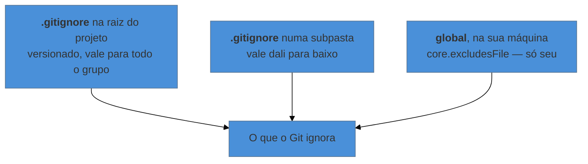

# Ignorar arquivos — o `.gitignore` e suas regras

> [!abstract] TL;DR
> Nem tudo que está na pasta merece entrar no histórico: arquivos temporários, PDFs gerados, backups do editor e dados pesados só fazem barulho. O arquivo `.gitignore` lista o que o Git deve fingir que não existe. Duas coisas surpreendem quem está começando: ele **não tem efeito sobre arquivos que o Git já rastreia** (aí é preciso `git rm --cached`), e ignorar **não é o mesmo que proteger** — o que já entrou no histórico continua lá.

---

## O `git status` que virou ruído

Compile um documento LaTeX uma vez e olhe a pasta:

```text
capitulo-1.tex   capitulo-1.aux   capitulo-1.log   capitulo-1.out
capitulo-1.toc   capitulo-1.synctex.gz   monografia.pdf   ~$notas.docx
```

De oito arquivos, **um** é seu trabalho. Os outros são subprodutos que a ferramenta recria a cada compilação. Se você não fizer nada, o `git status` vai listar todos eles como pendentes, para sempre.

E aí acontece o pior desfecho possível: você para de ler o `git status`. Quando a saída de um comando é 90% ruído, o cérebro passa a ignorá-la — e no dia em que aparecer ali algo que importava, você não vai ver.

Manter o `status` limpo não é preciosismo. É o que mantém o comando útil.

---

## Como funciona

Crie um arquivo chamado `.gitignore` na raiz do projeto — o ponto no começo faz parte do nome. Cada linha é um padrão do que ignorar:

```gitignore
# Subprodutos do LaTeX
*.aux
*.log
*.out
*.toc
*.synctex.gz

# O PDF é gerado a partir do .tex
monografia.pdf

# Backups do Word e do sistema
~$*
.DS_Store
Thumbs.db

# Dados brutos pesados (moram no servidor do laboratório)
dados/brutos/
```

A partir daí, o Git para de mencionar esses arquivos no `status` e se recusa a incluí-los num `add` acidental. Eles continuam existindo normalmente na pasta — o Git só deixa de enxergá-los.

O próprio `.gitignore` **deve ser versionado**: ele faz parte do projeto, e é assim que todo mundo do grupo herda as mesmas regras.

---

## As regras, em uma tabela

| Padrão | O que casa | Observação |
|---|---|---|
| `arquivo.pdf` | esse nome, em qualquer pasta do projeto | |
| `*.log` | qualquer arquivo terminado em `.log` | o mais comum |
| `/temp` | `temp` **só na raiz** | a barra inicial fixa o lugar |
| `temp/` | a pasta `temp` e tudo dentro, em qualquer nível | a barra final significa "é pasta" |
| `dados/**/*.csv` | `.csv` em qualquer subnível dentro de `dados` | `**` atravessa pastas |
| `!importante.log` | **exceção**: não ignore este | a negação com `!` |
| `# comentário` | nada — é só comentário | |

A ordem importa: as regras são aplicadas de cima para baixo, e a última que casar decide. Por isso a exceção vem depois da regra geral:

```gitignore
*.csv                 # ignora todos os CSV
!dados/amostra.csv    # ...menos este, que é pequeno e serve de exemplo
```

> [!warning] A negação não funciona se a pasta inteira estiver ignorada
> **O que acontece:** você escreve `dados/` e depois `!dados/amostra.csv`, e o arquivo continua ignorado.
> **Por quê:** quando o Git ignora uma **pasta**, ele nem entra nela para avaliar o conteúdo. A exceção nunca é lida.
> **Como evitar:** ignore o conteúdo em vez da pasta — `dados/*` no lugar de `dados/`. Aí a negação passa a ser avaliada.

---

## Onde a regra pode morar



O terceiro merece atenção. Coisas que sujam a pasta por causa do **seu** sistema ou do **seu** editor — `.DS_Store` no macOS, `Thumbs.db` no Windows, arquivos da sua IDE — não são problema do projeto: são seus. Colocá-los no `.gitignore` do repositório obriga o grupo inteiro a carregar a sua configuração.

O lugar certo é um ignore global:

```bash
git config --global core.excludesFile ~/.gitignore_global
```

E dentro de `~/.gitignore_global`, as suas sujeiras pessoais.

---

## A pegadinha número um

> [!warning] O `.gitignore` não afeta arquivos que o Git já rastreia
> **O que acontece:** você commitou o `monografia.pdf` na semana passada. Hoje adiciona `monografia.pdf` ao `.gitignore` — e ele continua aparecendo como modificado a cada compilação.
> **Por quê:** o `.gitignore` só decide sobre arquivos **não rastreados**. Uma vez que um arquivo entrou no histórico, o Git assume que você quer continuar acompanhando as mudanças dele; ignorá-lo silenciosamente seria perigoso.
> **Como resolver:** peça explicitamente para parar de rastrear, mantendo o arquivo em disco:
> ```bash
> git rm --cached monografia.pdf
> git commit -m "Para de versionar o PDF gerado"
> ```
> O `--cached` é essencial: sem ele, o comando apaga o arquivo do disco também. Para uma pasta inteira, acrescente `-r`.

---

## A pegadinha número dois

> [!warning] Ignorar não é proteger
> **O que acontece:** alguém commita um arquivo com senha, percebe, adiciona ao `.gitignore` e acha que resolveu.
> **Por quê:** o `.gitignore` só age sobre o futuro. O commit onde o arquivo entrou continua existindo, e o conteúdo é recuperável por qualquer pessoa com acesso ao repositório — inclusive num repositório público, onde robôs varrem exatamente isso.
> **Como resolver:** **troque a credencial imediatamente.** Essa é a ação que realmente importa; a limpeza do histórico é secundária, trabalhosa, e tem nota própria mais adiante (`25 — Segredos no histórico`). Prevenção vale muito mais que remédio aqui.

---

## Não escreva do zero

Existem coleções prontas e boas para praticamente qualquer contexto:

- **[gitignore.io](https://www.toptal.com/developers/gitignore)** — você digita "latex, macos, visualstudiocode" e ele gera o arquivo combinado.
- **[github/gitignore](https://github.com/github/gitignore)** — a coleção oficial, um arquivo por linguagem e ferramenta.
- Ao criar um repositório no GitHub, há um seletor de template de `.gitignore` na própria tela.

Comece por um template e ajuste. Ninguém decora essas listas.

---

## Quando o Git ignora e você não sabe por quê

Um arquivo sumiu do `status` e você não entende qual regra o pegou:

```bash
git check-ignore -v caminho/do/arquivo
```

A resposta diz o arquivo de regras, a linha e o padrão responsável. É o comando que resolve a discussão em dez segundos.

Para ver tudo o que está sendo ignorado no projeto:

```bash
git status --ignored
```

E, se você precisar mesmo incluir um arquivo ignorado — com consciência do que está fazendo:

```bash
git add -f arquivo-ignorado.pdf
```

---

## Resumo em uma frase

**O `.gitignore` mantém o `git status` legível, decidindo o que o Git nem chega a olhar — mas só sobre arquivos que ele ainda não rastreia, e só daqui pra frente.**

> [!tip] Pratique
> No seu projeto: crie o `.gitignore` a partir do [gitignore.io](https://www.toptal.com/developers/gitignore), commite-o, e rode `git status`. A saída deve caber em poucas linhas e conter só trabalho de verdade.
>
> Depois force o erro de propósito para ver a pegadinha em ação: commite um arquivo qualquer, adicione-o ao `.gitignore`, e confirme que ele **continua** aparecendo como modificado quando você o edita. Resolva com `git rm --cached`. Ter feito isso uma vez economiza uma hora de confusão no futuro.

---

## O que vem a seguir

Com o `status` limpo, dá para começar a usar o histórico como fonte de informação em vez de só como seguro. A próxima nota é sobre fazer perguntas ao passado do projeto: quando essa seção mudou, o que exatamente mudou naquele commit, e quem escreveu o quê.

- **07 — Ler o histórico: `log` e `diff`** — as perguntas que o histórico responde, e como ler a saída.
- [[03-Dominios/Tecnologia/Controle de Versão/N0 - Sobrevivência/03 - Seu primeiro repositório|03 — Seu primeiro repositório]] — a armadilha do `git add .` que esta nota resolve.

## Fontes

- **Git** — [*gitignore — documentação*](https://git-scm.com/docs/gitignore) — a especificação completa dos padrões, incluindo `**`, negação e precedência.
- **Scott Chacon & Ben Straub** — [*Pro Git*, cap. 2 — "Ignorando Arquivos"](https://git-scm.com/book/pt-br/v2/Fundamentos-de-Git-Gravando-Altera%C3%A7%C3%B5es-no-Reposit%C3%B3rio) — a apresentação canônica, com exemplos.
- **GitHub** — [*coleção github/gitignore*](https://github.com/github/gitignore) — templates oficiais por linguagem e ferramenta.
- **Josenaldo Matos** — [*workshop-git*](https://github.com/josenaldo/workshop-git) (2016), Tomo 4 — a seção "Ignorando arquivos" e suas regras.
