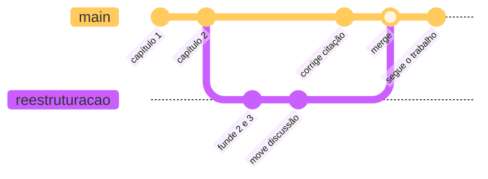

# Branches na prática

> [!abstract] TL;DR
> Um **branch** (ramo) é uma linha de trabalho paralela: você sai do estado atual, experimenta à vontade, e depois decide se incorpora ou joga fora — sem nunca ter posto o trabalho principal em risco. São três comandos (`switch -c` para criar, `switch` para trocar, `merge` para juntar) e uma mudança de mentalidade: com ramos, **experimentar deixa de ser arriscado**. É a funcionalidade que mais devolve o tempo investido em aprender Git.

---

## A reestruturação que você não teve coragem de fazer

Seu texto está em pé. Não é ótimo, mas funciona. E você teve uma ideia: e se os capítulos 2 e 3 fossem fundidos, e a discussão viesse antes dos resultados?

Pode dar muito certo. Pode ser um desastre de duas semanas.

Sem controle de versão, essa decisão é apostada de uma vez — ou você mexe e reza, ou não mexe. A saída caseira é duplicar a pasta (`monografia-teste-reestruturacao`), e aí começam os problemas: se você corrigir um erro de digitação na pasta velha, a nova não recebe; se decidir adotar a nova, precisa conferir manualmente o que divergiu.

Um branch resolve exatamente isso, e resolve bem: é uma cópia da linha do tempo que compartilha todo o passado e diverge só a partir de agora.

> [!example] Duas linhas temporais, o mesmo passado
> A metáfora da nota 01 — o Git como máquina do tempo — completa-se aqui: você não viaja só para trás, viaja para **linhas temporais alternativas**. Cria uma realidade onde a reestruturação aconteceu, vive nela por duas semanas, e no fim decide qual das duas é a real. Nenhuma das duas custou o preço da outra.

---

## Os três comandos

```bash
git switch -c reestruturacao      # cria o ramo e já muda pra ele
# ... trabalha, commita quantas vezes quiser ...
git switch main                   # volta pra linha principal
git merge reestruturacao          # traz o trabalho do ramo pra cá
git branch -d reestruturacao      # apaga o ramo, já incorporado
```

Para ver onde você está e o que existe:

```bash
git branch          # lista os ramos; um asterisco marca o atual
git status          # a primeira linha sempre diz "On branch ..."
```

> [!info] `switch` e `checkout`
> Você vai encontrar `git checkout -b nome` em tutoriais — é a forma antiga da mesma coisa. O `switch` foi criado em 2019 (Git 2.23) para separar "trocar de ramo" de "restaurar arquivo", duas operações que o `checkout` acumulava e que confundiam meio mundo. Prefira `switch`; entenda `checkout` quando encontrar.

---

## O que acontece com os seus arquivos

Este é o ponto que costuma assustar: ao trocar de ramo, **os arquivos na sua pasta mudam**. Se no ramo `reestruturacao` você criou um `capitulo-fundido.tex`, ele desaparece da pasta quando você volta para `main` — e reaparece quando volta ao ramo.

Isso não é perda. É o Git colocando na sua frente a versão daquela linha temporal. Tudo o que estava commitado continua guardado; ele só troca o que está visível.

> [!warning] Trocar de ramo com trabalho não commitado dá problema
> **O que acontece:** o Git recusa a troca com uma mensagem sobre mudanças locais que seriam sobrescritas — ou, pior, deixa você trocar carregando as edições para o ramo errado. **Por quê:** ele não sabe a qual das duas linhas aquelas edições pendentes pertencem. **Como evitar:** **commite antes de trocar de ramo.** Se o trabalho ainda não merece um commit "de verdade", commite mesmo assim com uma mensagem tipo `wip: metade da seção 3` — você conserta a mensagem depois com `--amend`. A alternativa é o `git stash`, que é o assunto da nota 10.

---

## Juntar de volta: o `merge`

Terminada a experiência, você volta para a linha principal e traz o trabalho:

```bash
git switch main
git merge reestruturacao
```

Dois desfechos possíveis, e vale entender a diferença porque ela explica coisas que você vai ver depois:

**Fast-forward.** Se `main` não recebeu nenhum commit novo enquanto você trabalhava no ramo, não há o que combinar — o Git simplesmente avança o ponteiro de `main` para onde o ramo está. É uma operação instantânea e sem risco.

**Merge de verdade.** Se as duas linhas avançaram, o Git combina as duas e cria um **commit de merge**, que é um commit especial com dois pais. Se as mudanças tocaram trechos diferentes, isso acontece automaticamente. Se tocaram o mesmo trecho, você tem um conflito — e é exatamente por isso que a próxima nota existe.



Repare no desenho: a linha `main` nunca deixou de funcionar. Enquanto a reestruturação acontecia em paralelo, você ainda corrigiu uma citação na linha principal — e, se a orientadora tivesse pedido o PDF naquele dia, você entregaria a versão estável sem nada pela metade.

---

## E se der errado?

Essa é a melhor parte. Se a reestruturação não funcionou:

```bash
git switch main
git branch -D reestruturacao     # -D maiúsculo: apaga mesmo sem ter sido incorporado
```

Duas semanas de experimento evaporam e a linha principal nunca soube que aquilo existiu. **O custo de tentar caiu para quase zero** — e é essa mudança que faz gente que aprende branches parar de ter medo de mexer no próprio trabalho.

> [!warning] `-d` minúsculo protege, `-D` maiúsculo não
> **O que acontece:** `git branch -d nome` recusa apagar um ramo cujo trabalho ainda não foi incorporado. O `-D` apaga assim mesmo. **Por quê:** o minúsculo é a versão segura, feita para o caso normal de "já mergeei, pode limpar". **Como conviver:** use `-d` sempre. Quando ele reclamar, pare e pense se você quer mesmo descartar aquilo. E, mesmo tendo usado `-D` por engano, os commits continuam recuperáveis por um tempo — via `reflog`, assunto de um nível adiante.

---

## Como nomear os ramos

Não há regra do Git, mas há convenção que ajuda:

| Bom | Ruim |
|---|---|
| `reestruturacao-capitulos` | `teste` |
| `revisao-banca-julho` | `novo` |
| `artigo-revista-b` | `branch2` |
| `correcoes-ortografia` | `asdasd` |

A régua é a mesma das mensagens de commit: daqui a três semanas, `git branch` vai listar esses nomes e você precisa saber o que cada um é sem abrir.

Evite espaços e acentos — funcionam, mas complicam a vida no terminal.

---

## Quando usar ramo, e quando não

**Vale a pena ramificar quando:**

- a mudança é grande, arriscada ou pode ser abandonada (reestruturação, mudança de abordagem);
- você precisa manter uma versão estável disponível enquanto trabalha (a versão que vai pro orientador na sexta);
- duas pessoas vão mexer em áreas diferentes ao mesmo tempo;
- existem duas variantes legítimas e duradouras do mesmo trabalho — o mesmo artigo formatado para duas revistas, por exemplo.

**Não vale a pena quando:** você está corrigindo dois erros de digitação. Ramo tem custo mental; para mudança pequena e certa, commite direto na linha principal.

Existe uma discussão inteira sobre *estratégias* de ramificação em equipe — quantos ramos, com que ciclo de vida, quem integra o quê. Isso é assunto do nível 2, quando entrar colaboração de verdade. Por ora: ramifique quando o trabalho for grande ou incerto.

---

## Resumo em uma frase

**Branch é uma linha temporal alternativa que compartilha todo o passado: você experimenta nela, e depois decide se ela vira realidade ou nunca existiu.**

> [!tip] Vídeo — branches com calma
> [**Git Branches de forma fácil e com exemplo**](https://www.youtube.com/watch?v=xAOBQtSVI_k) (Curso em Vídeo, 50 min) aula longa e didática sobre ramificação; vale pelo tempo dedicado a *por que* ramificar, não só como.

> [!tip] Pratique
> Este é o assunto para o qual o simulador foi feito. Faça a sequência **"Introdução"** inteira do [Learn Git Branching em português](https://learngitbranching.js.org/?locale=pt_BR) — os quatro níveis cobrem exatamente commit, branch, merge e a troca entre ramos, e você **vê o grafo se ramificando** conforme digita. É a meia hora mais bem investida deste nível inteiro.
>
> Depois, no seu projeto: crie um ramo, faça duas mudanças que você vinha adiando por medo, e então decida — `merge` ou `branch -D`. Fazer isso uma vez muda sua relação com o próprio trabalho.

---

## O que vem a seguir

Você viu que o merge é automático quando as mudanças tocam trechos diferentes. A pergunta óbvia é: e quando tocam o mesmo trecho? Aí acontece um conflito — a situação que mais assusta iniciantes e que, entendida, é bem menos dramática do que parece.

- **09 — Conflito: por que acontece e como resolver** — os marcadores, o passo a passo, e a saída de emergência.
- [[03-Dominios/Tecnologia/Controle de Versão/N1 - O fluxo diário/07 - Ler o histórico - log e diff|07 — Ler o histórico]] — o `git log --graph` fica muito mais interessante agora que existem ramos.

## Fontes

- **Scott Chacon & Ben Straub** — [*Pro Git*, cap. 3 — "Ramificação Básica e Mesclagem"](https://git-scm.com/book/pt-br/v2/Ramifica%C3%A7%C3%A3o-Git-Ramifica%C3%A7%C3%A3o-B%C3%A1sica-e-Mesclagem) — o fluxo criar/trocar/mesclar e a distinção fast-forward × merge commit.
- **Git** — [*git-switch*](https://git-scm.com/docs/git-switch) · [*git-branch*](https://git-scm.com/docs/git-branch) · [*git-merge*](https://git-scm.com/docs/git-merge) — documentação oficial.
- **Josenaldo Matos** — [*workshop-git*](https://github.com/josenaldo/workshop-git) (2016), Tomo 7 — a sequência de diagramas "Entendendo o branch", que nesta trilha reaparece com todo o mecanismo na nota 19.
- **Josenaldo Matos** — [*escrita-sem-medo-com-git-e-github*](https://github.com/josenaldo/escrita-sem-medo-com-git-e-github) (2021) — a metáfora das múltiplas linhas temporais aplicada a trabalho acadêmico.
