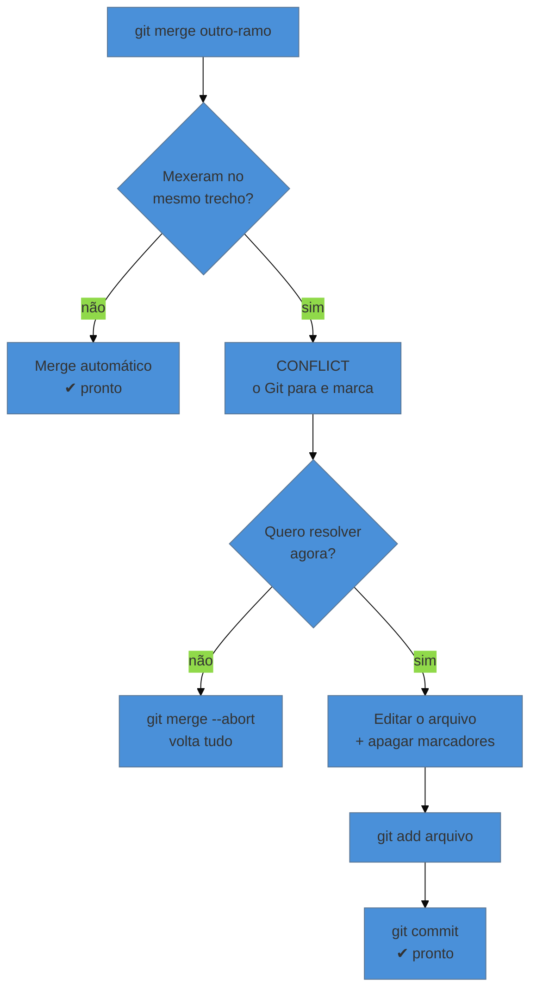

# Conflito — por que acontece e como resolver

> [!abstract] TL;DR
> Conflito não é erro, é pergunta: duas edições mexeram no **mesmo trecho** a partir do mesmo ponto de partida, e o Git se recusa a escolher por você. Ele marca o local com `<<<<<<<`, `=======` e `>>>>>>>`, e espera. Você edita o arquivo até deixá-lo como deve ficar, remove os marcadores, `git add` e `git commit`. E existe uma saída de emergência que devolve tudo ao estado anterior: `git merge --abort`.

---

## Por que o Git para e pergunta

Ana e Bruno escrevem o mesmo artigo. Ambos partem da mesma versão da introdução. Ana reescreve o primeiro parágrafo para enfatizar o recorte metodológico; Bruno reescreve o mesmo parágrafo para enfatizar o contexto histórico.

Quando as duas versões se encontram, o Git tem três opções:

1. Ficar com a de Ana e descartar a de Bruno.
2. Ficar com a de Bruno e descartar a de Ana.
3. Parar e perguntar.

O Google Drive escolhe (1) ou (2) — ou cria uma "cópia em conflito" que ninguém abre. O Git escolhe **(3)**, sempre. E essa é uma das melhores decisões de projeto da ferramenta: nenhum trabalho é descartado por uma máquina que não tem como saber qual dos dois parágrafos é o certo.

> **Conflito é o Git dizendo: "eu não tenho como saber isso — decida você."**

---

## Quando NÃO há conflito

Vale saber, porque a maioria das integrações passa sem drama:

- Ana mexeu no capítulo 1, Bruno no capítulo 3 → **sem conflito**, o Git junta os dois.
- Ana mexeu no início do capítulo 2, Bruno no fim do mesmo arquivo → **sem conflito**, desde que os trechos não se toquem.
- Ana e Bruno editaram a **mesma linha** → conflito.
- Ana apagou um arquivo que Bruno editou → conflito.

O Git compara os dois lados contra o **ancestral comum** — o último ponto em que as duas linhas eram idênticas. É por isso que ele consegue distinguir "esta linha mudou de um lado só" de "esta linha mudou dos dois lados". O mecanismo tem nome (*three-way merge*) e ganha uma nota inteira no nível 3; por ora, o efeito prático basta.

---

## Como o conflito aparece

Você roda um `git merge` (ou um `git pull`, que traz o merge junto) e recebe:

```text
Auto-merging introducao.tex
CONFLICT (content): Merge conflict in introducao.tex
Automatic merge failed; fix conflicts and then commit the result.
```

Note que ele **fez** o que conseguia sozinho ("auto-merging") e parou só onde precisou de você. `git status` mostra a lista sob "Unmerged paths".

Abrindo o arquivo, o trecho problemático está assim:

```text
<<<<<<< HEAD
Este trabalho investiga a evasão escolar a partir de um recorte
metodológico misto, combinando dados quantitativos e entrevistas.
=======
Este trabalho investiga a evasão escolar no contexto da expansão
do ensino superior brasileiro a partir dos anos 2000.
>>>>>>> bruno-introducao
```

Traduzindo os três marcadores:

| Marcador | Significa |
|---|---|
| `<<<<<<< HEAD` | daqui começa **a sua versão** (a do ramo em que você está) |
| `=======` | fim da sua, começa a do outro lado |
| `>>>>>>> bruno-introducao` | fim da versão vinda daquele ramo |

O resto do arquivo está intacto. Só os trechos em disputa recebem marcadores — pode haver vários no mesmo arquivo.

---

## Resolver, passo a passo

**1. Decida como o texto deve ficar.** Você não é obrigado a escolher um lado. Nas três opções legítimas:

```text
# ficar com o seu
Este trabalho investiga a evasão escolar a partir de um recorte
metodológico misto, combinando dados quantitativos e entrevistas.

# ficar com o dele
Este trabalho investiga a evasão escolar no contexto da expansão
do ensino superior brasileiro a partir dos anos 2000.

# combinar (quase sempre a melhor)
Este trabalho investiga a evasão escolar no contexto da expansão
do ensino superior brasileiro a partir dos anos 2000, a partir de
um recorte metodológico misto que combina dados quantitativos
e entrevistas.
```

**2. Apague os três marcadores.** Eles não podem sobrar no arquivo final.

**3. Marque como resolvido e conclua:**

```bash
git add introducao.tex
git commit          # a mensagem já vem preenchida; pode aceitar
```

Pronto. O merge está completo.

> [!info] A saída de emergência
> Se você abriu o arquivo, viu quinze conflitos e concluiu que não é hora disso:
> ```bash
> git merge --abort
> ```
> Tudo volta ao estado exatamente anterior ao merge, como se você nunca tivesse tentado. Nada se perde. Saber que essa porta existe é o que permite tentar sem medo.

---

## O fluxo completo, em diagrama



---

## Ferramentas que ajudam

Editar os marcadores na mão funciona e é bom para entender o que está acontecendo. Depois disso, use ferramenta:

- **VS Code** detecta o conflito e mostra botões *Accept Current* / *Accept Incoming* / *Accept Both*, com destaque colorido dos dois lados.
- **`git mergetool`** abre a ferramenta gráfica configurada (Meld, KDiff3, Beyond Compare) em três painéis: o seu, o deles e o resultado.
- Para conferir o que cada lado fez antes de decidir:
  ```bash
  git diff --ours     # o que a minha versão mudou
  git diff --theirs   # o que a versão que está chegando mudou
  ```

E, no caso de arquivo binário — onde combinar é impossível —, você escolhe um lado inteiro:

```bash
git checkout --ours grafico.png     # fico com a minha versão
git checkout --theirs grafico.png   # fico com a que chegou
git add grafico.png
```

---

## Armadilhas comuns

> [!warning] Commitar com os marcadores dentro
> **O que acontece:** o `<<<<<<< HEAD` vai para o histórico e, no caso de LaTeX ou código, quebra a compilação — às vezes só semanas depois, quando alguém abre aquele arquivo. **Por quê:** o Git não valida o que você escreveu; se você deu `add` e `commit`, ele registra. **Como evitar:** antes de commitar uma resolução, procure por `<<<<` no projeto. `git diff --staged` também mostra: marcadores aparecem como conteúdo adicionado, e saltam aos olhos.

> [!warning] Resolver escolhendo sempre "o meu"
> **O que acontece:** por pressa ou insegurança, a pessoa aceita sempre o próprio lado. O trabalho do colega é descartado silenciosamente — e ele só descobre dias depois, ao notar que a alteração sumiu. **Por quê:** o Git obedece; ele não avisa que o outro lado foi ignorado. **Como evitar:** leia os dois lados antes de decidir. E, se o conflito for sobre conteúdo intelectual (a redação de um parágrafo), **fale com a pessoa** em vez de decidir sozinho. O Git resolve o conflito de texto; ele não resolve o desacordo.

> [!warning] Deixar o merge pela metade e ir embora
> **O que acontece:** você para no meio, fecha o terminal, e no dia seguinte o repositório está num estado estranho — `git status` fala de "unmerged paths" e comandos normais reclamam. **Por quê:** o merge é uma operação em duas etapas, e o repositório fica num estado intermediário entre elas. **Como evitar:** termine ou aborte. `git merge --abort` a qualquer momento devolve o estado limpo, e amanhã você recomeça com a cabeça fresca.

---

## Prevenir vale mais que resolver

Quatro hábitos reduzem drasticamente a frequência de conflitos:

1. **Sincronize cedo e com frequência.** Conflito cresce com o tempo de divergência: dois dias separados geram um conflito pequeno; dois meses geram um pesadelo.
2. **Combinem quem mexe onde.** A maior parte dos conflitos de trabalho em grupo é organizacional, não técnica.
3. **Um arquivo por capítulo.** Em vez de `monografia.tex` com tudo dentro, use `cap-1.tex`, `cap-2.tex`, `cap-3.tex` incluídos por um arquivo principal. Duas pessoas em capítulos diferentes deixam de colidir por completo. Esta é, de longe, a dica que mais reduz conflito em trabalho acadêmico.
4. **Uma frase por linha** nos arquivos de texto (a dica da nota 07). Como o Git compara linha a linha, frases separadas fazem com que duas pessoas editando parágrafos vizinhos não conflitem.

---

## Resumo em uma frase

**Conflito é o Git recusando-se a escolher entre dois trabalhos legítimos — e a resolução é você escrevendo como o texto deve ficar, não apertando um botão.**

> [!tip] Vídeo — resolvendo um conflito real
> [**Como Resolver Conflitos de Merge no Git (Passo a Passo)**](https://www.youtube.com/watch?v=B1zzccb_e4E) (PERAI DEV, 12 min) provoca um conflito de propósito e resolve na tela — que é exatamente o exercício sugerido aqui.

> [!tip] Pratique
> Provoque um conflito de propósito, num projeto de teste: crie um ramo, edite a linha 1 de um arquivo, volte pra `main`, edite a **mesma** linha de outro jeito, e faça o merge. Resolva. Depois provoque de novo e use `git merge --abort` para ver que dá pra sair.
>
> Fazer isso com calma, sem prazo e sem trabalho real em risco, é o que remove o pânico da primeira vez que acontecer de verdade. Os **[git-katas](https://github.com/eficode-academy/git-katas)** têm cenários de conflito prontos (`basic-branching`, `merge-conflict`) se você preferir um exercício montado.

---

## O que vem a seguir

Você já sabe abrir linhas paralelas e juntá-las. Falta o caso do meio do caminho: está no meio de uma edição, nada pronto pra commitar, e precisa **agora** voltar ao estado limpo — porque a orientadora pediu o PDF atual, ou porque um erro precisa ser corrigido já.

- **10 — Guardar trabalho pela metade: stash e worktrees** — como interromper sem perder nem commitar lixo.
- [[03-Dominios/Tecnologia/Controle de Versão/N1 - O fluxo diário/08 - Branches na prática|08 — Branches na prática]] — o merge que gera o conflito vem de lá.

## Fontes

- **Scott Chacon & Ben Straub** — [*Pro Git*, cap. 3 — "Conflitos básicos de mesclagem"](https://git-scm.com/book/pt-br/v2/Ramifica%C3%A7%C3%A3o-Git-Ramifica%C3%A7%C3%A3o-B%C3%A1sica-e-Mesclagem) — os marcadores e o fluxo de resolução.
- **Git** — [*git-merge*, seção "How Conflicts Are Presented"](https://git-scm.com/docs/git-merge#_how_conflicts_are_presented) — a especificação dos marcadores, incluindo o modo `diff3`.
- **Git** — [*git-mergetool*](https://git-scm.com/docs/git-mergetool) — configuração de ferramentas gráficas de resolução.
- **Josenaldo Matos** — [*workshop-git*](https://github.com/josenaldo/workshop-git) (2016), Tomo 7 — "Resolução de conflitos".
