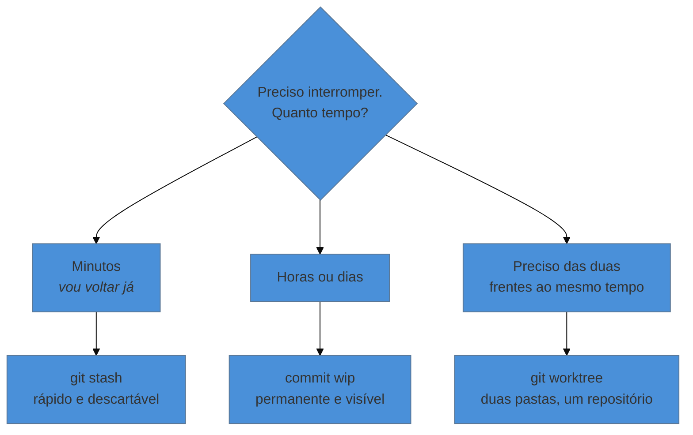

# Guardar trabalho pela metade — stash e worktrees

> [!abstract] TL;DR
> Três formas de interromper no meio de uma edição sem perder nada: **commitar um "wip"** (a mais simples e a mais segura), **`git stash`** (guarda as mudanças numa pilha lateral e limpa a pasta) e **`git worktree`** (abre uma segunda pasta ligada ao mesmo repositório, para você trabalhar nas duas ao mesmo tempo). O stash é o mais famoso e o mais fácil de esquecer — trabalho stashado não aparece em lugar nenhum e some do radar.

---

## O telefonema no meio da frase

São quatro da tarde. Você está no meio da reescrita da seção 3 — nada terminado, o arquivo num estado que não compila. Chega a mensagem: *"consegue me mandar o PDF atual hoje?"*.

Você precisa, agora, do projeto no último estado bom. Mas não quer jogar fora a meia reescrita, e ela também não está pronta para virar um commit de verdade.

As três saídas abaixo resolvem isso. Elas não são equivalentes, e a mais recomendada não é a mais famosa.

---

## Saída 1: commite um "wip" (a mais simples)

```bash
git add .
git commit -m "wip: reescrita da seção 3, metade do caminho"
```

Aí você resolve o que precisava, e depois retoma. Quando a seção ficar pronta, junte tudo num commit decente:

```bash
git commit --amend -m "Reescreve a seção 3 com foco no componente institucional"
```

**Por que essa costuma ser a melhor opção:** commit é a única forma de armazenamento do Git que é permanente, visível e recuperável. Ele aparece no `log`, sobrevive a qualquer coisa, e você já sabe desfazê-lo (nota 04). "Não commitar porque não está pronto" é um pudor que custa caro — a história você limpa depois; trabalho perdido, não.

> [!info] "Mas vai poluir meu histórico"
> Só se você deixar. Enquanto o commit não foi enviado pra nuvem, ele é seu e você reescreve à vontade — `--amend` para juntar ao próximo, ou ferramentas mais poderosas que aparecem no nível 4. A regra continua a mesma: **antes de compartilhar, a história é sua**.

---

## Saída 2: `git stash`

O stash guarda suas mudanças numa pilha lateral e **devolve a pasta ao estado do último commit**:

```bash
git stash                       # guarda e limpa a pasta
git stash -u                    # ...incluindo arquivos novos, não rastreados
git stash push -m "meia seção 3"   # guarda com um nome descritivo

# ... você faz o que precisava ...

git stash list                  # o que está guardado
git stash pop                   # devolve o mais recente e remove da pilha
git stash apply stash@{1}       # devolve um específico, mantendo na pilha
git stash drop stash@{0}        # descarta um item
```

É rápido e resolve o caso do telefonema em dois comandos. Mas tem características que mordem:

> [!warning] O stash é invisível e fácil de esquecer
> **O que acontece:** semanas depois, você descobre três stashes antigos e não faz ideia do que são nem de qual ramo saíram.
> **Por quê:** o stash não aparece no `git log`, não aparece no `git status`, e a pilha é **global** — ela não pertence ao ramo onde você estava. Nada te lembra de que ele existe.
> **Como evitar:** sempre com `-m` e uma descrição. E crie o hábito de rodar `git stash list` de vez em quando. Se o stash tem mais de um dia de vida, provavelmente deveria ter sido um commit.

> [!warning] `git stash` sem `-u` deixa arquivos novos para trás
> **O que acontece:** você stasha, troca de ramo, e os arquivos que tinha acabado de criar continuam ali, "vazando" para o ramo errado.
> **Por quê:** por padrão o stash só guarda arquivos que o Git já rastreia. Arquivos não rastreados não são problema dele.
> **Como evitar:** use `git stash -u` quando houver arquivo novo no meio.

> [!warning] `pop` com conflito não remove o stash
> **O que acontece:** o `git stash pop` gera conflito, você resolve, e depois descobre que o item continua na pilha — e acaba aplicando duas vezes.
> **Por quê:** o Git só remove o item da pilha quando a aplicação termina limpa.
> **Como evitar:** depois de resolver um conflito de `pop`, confira com `git stash list` e remova com `git stash drop` se ainda estiver lá.

---

## Saída 3: `git worktree` (a mais confortável)

E se você não precisasse guardar nada — se pudesse ter as **duas coisas abertas ao mesmo tempo**, em duas pastas?

```bash
git worktree add ../monografia-entrega main
```

Isso cria a pasta `monografia-entrega` ao lado da sua, já posicionada no ramo `main`, ligada ao **mesmo repositório**. Você compila o PDF lá, manda pra orientadora, e volta pra sua pasta original — onde a meia reescrita continua exatamente como estava, intocada.

Quando terminar:

```bash
git worktree list                          # quais existem
git worktree remove ../monografia-entrega  # limpa
```

**Por que isso é melhor que o stash na maior parte dos casos:** não há nada guardado em lugar nenhum, nada para lembrar de recuperar, nada de invisível. As duas frentes de trabalho estão abertas, visíveis, cada uma na sua pasta. Especialmente bom quando a interrupção vai durar horas, ou quando você precisa **comparar** as duas versões lado a lado.

> [!warning] Não apague a pasta de um worktree na mão
> **O que acontece:** você apaga a pasta pelo explorador de arquivos e o Git continua listando o worktree, reclamando que ele sumiu.
> **Por quê:** o repositório guarda um registro dos worktrees ativos.
> **Como resolver:** `git worktree remove` faz certo. Se já apagou na mão, `git worktree prune` limpa os registros órfãos.

---

## Qual usar



| | Stash | Commit "wip" | Worktree |
|---|---|---|---|
| Velocidade | instantâneo | instantâneo | alguns segundos |
| Fica visível | ❌ | ✅ no `log` | ✅ é uma pasta |
| Sobrevive ao esquecimento | ❌ | ✅ | ✅ |
| Permite as duas frentes juntas | ❌ | ❌ | ✅ |
| Ocupa espaço em disco | pouco | pouco | uma cópia dos arquivos |

---

## Resumo em uma frase

**Stash é uma gaveta rápida que você esquece que tem; commit é permanente e visível; worktree é abrir uma segunda janela para o mesmo projeto.**

> [!tip] Pratique
> Simule o telefonema no seu projeto: edite um arquivo sem terminar, e resolva a interrupção das três formas, uma depois da outra — `stash` + `stash pop`; depois commit `wip` + `--amend`; depois `worktree add` numa pasta vizinha, olhando as duas pastas abertas no explorador de arquivos ao mesmo tempo.
>
> Ver as duas pastas convivendo é o que faz o worktree "clicar" — e é o momento em que muita gente para de usar stash.

---

## O que vem a seguir

Falta a última peça do fluxo diário, e é a que envolve outras pessoas: manter sua cópia e a do servidor em dia sem sobrescrever ninguém. Você já usa `push` desde o nível 0; agora vale entender a diferença entre buscar e integrar, e o que fazer quando o `push` é recusado.

- **11 — Sincronizar com o time** — `fetch` × `pull`, push recusado, e por que o Git aceita vários remotos.
- [[03-Dominios/Tecnologia/Controle de Versão/N1 - O fluxo diário/09 - Conflito - por que acontece e como resolver|09 — Conflito]] — sincronizar é a principal fonte de conflitos; vale ter lido antes.

## Fontes

- **Scott Chacon & Ben Straub** — [*Pro Git*, cap. 7 — "Stashing e Cleaning"](https://git-scm.com/book/pt-br/v2/Ferramentas-do-Git-Stashing-e-Cleaning) — o comportamento da pilha, `-u` e os casos de conflito ao aplicar.
- **Git** — [*git-stash*](https://git-scm.com/docs/git-stash) · [*git-worktree*](https://git-scm.com/docs/git-worktree) — documentação oficial dos dois comandos.
- **Git** — [*git-worktree*, seção "Description"](https://git-scm.com/docs/git-worktree#_description) — como múltiplas árvores de trabalho compartilham um único repositório.
