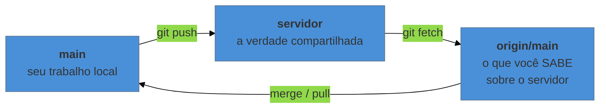

# Sincronizar com o time

> [!abstract] TL;DR
> `fetch` **busca** o que há no servidor sem mexer no seu trabalho; `pull` busca **e integra** de uma vez. Quando o `push` é recusado, quase sempre significa "o servidor tem coisa que você não tem" — a solução é trazer antes de enviar, nunca forçar. E vale saber que `origin` não tem nada de especial: o Git aceita quantos remotos você quiser, inclusive um pendrive.

---

## O erro que assusta na primeira vez

```text
! [rejected]        main -> main (fetch first)
error: failed to push some refs to 'https://github.com/...'
hint: Updates were rejected because the remote contains work that you do
hint: not have locally.
```

Traduzindo: *"o servidor tem commits que você não tem. Se eu aceitasse o seu envio, eles sumiriam."*

O Git está protegendo o trabalho de outra pessoa — provavelmente a colega que commitou de manhã enquanto você estava offline. A recusa é o comportamento correto, e a solução nunca é forçar.

Para entender o que fazer, é preciso separar duas coisas que o nível 0 tratou como uma só.

---

## `fetch` e `pull` não são a mesma coisa

```bash
git fetch     # baixa o que há no servidor. NÃO toca nos seus arquivos.
git pull      # = git fetch + integra o que veio ao seu trabalho
```

O `fetch` é **sempre seguro**. Ele atualiza o que o Git sabe sobre o servidor, sem alterar uma vírgula do que você está editando. Depois dele, você pode inspecionar o que chegou antes de decidir:

```bash
git fetch
git log --oneline HEAD..origin/main     # o que eles têm que eu não tenho
git diff HEAD origin/main               # o que exatamente mudou
git pull                                # ok, agora integra
```

O `pull` faz as duas coisas de uma vez. É o atalho do dia a dia — e é ótimo, desde que você entenda que ele pode gerar conflito, e que conflito no meio de um trabalho pela metade é desconfortável.

> [!info] O hábito que evita 90% dos problemas
> **Dê `pull` ao começar a trabalhar, não quando terminar.** Integrar cedo significa integrar pouco; integrar tarde significa resolver de uma vez tudo o que divergiu. É o mesmo princípio da nota 09: conflito cresce com o tempo de separação.

---

## `origin/main`: a sua memória do servidor

Ao rodar `git branch -a` você vai ver, além dos seus ramos, coisas como `remotes/origin/main`. Isso é um **ramo de rastreamento remoto**: a fotografia do que o servidor tinha na última vez que você falou com ele.



Três coisas distintas, e a confusão entre elas explica quase todo mal-entendido com Git remoto:

- **`main`** — onde você está trabalhando.
- **`origin/main`** — o que você sabe do servidor. Só muda quando você faz `fetch` ou `pull`.
- **o servidor de verdade** — que pode ter avançado sem você saber, porque o Git nunca consulta a rede sozinho.

É por isso que o `push` pode ser recusado mesmo com tudo "aparentemente em dia": o seu `origin/main` está desatualizado.

---

## Resolvendo o push recusado

```bash
git pull        # traz o trabalho deles e integra ao seu
# (se houver conflito, resolva como na nota 09)
git push        # agora aceita
```

É isso. Não há truque.

> [!warning] Nunca resolva um push recusado com `--force`
> **O que acontece:** `git push --force` manda o servidor descartar o que ele tem e aceitar a sua versão. O trabalho da outra pessoa **é apagado do servidor** — e se ela ainda não tinha a cópia em outro lugar, é perda real.
> **Por quê:** o `--force` desliga exatamente a proteção que gerou a mensagem de erro.
> **Como conviver:** existe uma situação legítima para forçar (quando você reescreveu a própria história de propósito, assunto do nível 4), e nela usa-se `--force-with-lease`, que recusa se alguém tiver publicado algo desde a sua última sincronização. Como regra deste nível: **se você não sabe exatamente por que está forçando, não force.**

> [!warning] `git pull` com trabalho não commitado
> **O que acontece:** o Git recusa a integração, ou aceita e gera um conflito que se mistura com suas edições pela metade.
> **Por quê:** ele precisa mexer nos mesmos arquivos que você está editando.
> **Como evitar:** commite (ou stashe, ou use um worktree — nota 10) antes de dar `pull`. "Pasta limpa antes de sincronizar" é uma regra que economiza muita confusão.

---

## `merge` ou `rebase` no pull?

Ao integrar, o Git pode juntar as duas histórias de duas maneiras. A padrão cria um **commit de merge** ("Merge branch 'main' of github.com..."), que aparece bastante no histórico e incomoda algumas pessoas. A alternativa reaplica os seus commits por cima dos que chegaram, deixando a história em linha reta:

```bash
git pull --rebase
```

Para adotar como padrão:

```bash
git config --global pull.rebase true
```

**A recomendação para este nível:** se você trabalha sozinho ou em grupo pequeno, `--rebase` deixa o histórico bem mais legível e é seguro, porque só reescreve commits **seus que ainda não foram enviados**. Mas o mecanismo por trás disso — o que "reaplicar commits" significa de verdade, e a regra de ouro que limita seu uso — só é explicado direito no nível 3. Por ora, use e saiba que há uma explicação vindo.

> [!info] Se o Git reclamar na primeira vez
> Versões recentes se recusam a dar `pull` sem saber sua preferência, com uma mensagem sobre "divergent branches". Ela está pedindo exatamente que você escolha entre as duas estratégias acima. Configure `pull.rebase` (true ou false) e a mensagem some.

---

## `origin` não tem nada de especial

`origin` é só um apelido — uma convenção para "o servidor principal deste projeto". Você pode ter quantos remotos quiser:

```bash
git remote -v                                          # quais existem
git remote add backup https://gitlab.com/voce/proj.git # adiciona outro
git push backup main                                   # envia pra ele
git remote remove backup
```

Isso é útil de imediato: manter uma cópia no GitHub **e** no GitLab custa um comando a mais e protege contra o serviço sair do ar, mudar de política ou suspender sua conta.

> [!example] O pendrive como servidor Git
> Este exercício, do meu workshop de 2017, é o que melhor desfaz a mágica: um "servidor Git" não precisa ser um site. Pode ser uma pasta.
> ```bash
> # no pendrive, cria um repositório sem área de trabalho
> git init --bare /media/pendrive/monografia.git
>
> # no seu projeto
> git remote add pendrive /media/pendrive/monografia.git
> git push pendrive main
> ```
> Pronto: o pendrive é um remoto legítimo. Você pode `clone`, `push` e `pull` dele, sem internet e sem conta em serviço nenhum. Fazer isso uma vez elimina a impressão de que o GitHub é parte do Git.
>
> O `--bare` significa "repositório sem pasta de trabalho" — só o histórico. É assim que todo servidor Git é, inclusive o GitHub.

---

## O ciclo diário completo, com outras pessoas

```bash
git pull                       # 1. começa o dia trazendo o que mudou
# ... trabalha ...
git add capitulo-2.tex         # 2. separa
git commit -m "..."            # 3. registra
git pull                       # 4. traz de novo (alguém pode ter enviado)
git push                       # 5. envia
```

Os passos 4 e 5 quase sempre podem ser feitos juntos — se o `push` falhar, você dá `pull` e repete. Com o tempo isso vira reflexo.

---

## Resumo em uma frase

**`fetch` pergunta, `pull` pergunta e integra, `push` só é aceito se você já souber de tudo que o servidor sabe — e forçar não é resolver, é sobrescrever.**

> [!tip] Vídeo — fetch × pull, visualmente
> [**Git Pull vs Fetch: When To Use Each**](https://www.youtube.com/watch?v=T13gDBXarj0) (The Modern Coder, 7 min) mostra o efeito de cada um sobre `origin/main` e sobre o seu ramo, que é a distinção central desta nota.

> [!tip] Pratique
> O exercício do pendrive acima é o melhor deste nível, e leva cinco minutos. Se não tiver pendrive, uma pasta qualquer do seu computador serve — `git init --bare ~/teste-servidor.git` funciona igual.
>
> Depois, para o lado colaborativo com correção automática, faça o curso *Introduction to GitHub* do **[GitHub Skills](https://skills.github.com/)** — ele roda dentro de um repositório seu e cobre o ciclo com outras pessoas.

---

## O que vem a seguir

Você fecha aqui o **nível 1**. Agora consegue trabalhar num projeto real todo dia: `status` limpo, histórico consultável, ramos para experimentar, conflitos resolvidos com calma, interrupções sem perda e sincronização com outras pessoas.

O nível 2 é sobre colaborar de verdade, com as práticas que as equipes usam: propor mudanças para revisão antes de integrar (*pull requests*), escolher uma estratégia de ramificação, escrever mensagens de commit num padrão que gera changelog automático, e usar a plataforma além do `push`.

- **12 — Pull requests e a cultura de code review** — a primeira nota do N2.
- [[03-Dominios/Tecnologia/Controle de Versão/N1 - O fluxo diário/index|N1 — O fluxo diário]] — o índice do nível, para revisar.
- [[03-Dominios/Tecnologia/Controle de Versão/index|Controle de Versão]] — o mapa completo dos 7 níveis.

## Fontes

- **Scott Chacon & Ben Straub** — [*Pro Git*, cap. 2 — "Trabalhando com Remotos"](https://git-scm.com/book/pt-br/v2/Fundamentos-de-Git-Trabalhando-com-Remotos) — `fetch` × `pull`, múltiplos remotos, inspeção.
- **Scott Chacon & Ben Straub** — [*Pro Git*, cap. 3 — "Ramos Remotos"](https://git-scm.com/book/pt-br/v2/Ramifica%C3%A7%C3%A3o-Git-Ramos-Remotos) — a natureza de `origin/main` como fotografia local do servidor.
- **Git** — [*git-push*](https://git-scm.com/docs/git-push) — a seção sobre `--force-with-lease` e por que ela é preferível a `--force`.
- **Josenaldo Matos** — [*curso-git-github*](https://github.com/josenaldo/curso-git-github) (2017), Tomo 6 — "Usando um pendrive como servidor Git", exercício reproduzido aqui.
- **Josenaldo Matos** — [*workshop-git*](https://github.com/josenaldo/workshop-git) (2016), Tomo 5 — "Trabalhando com repositórios remotos", incluindo múltiplos remotos.
