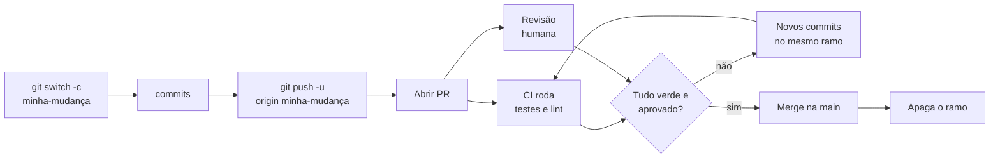

# Pull requests e a cultura de code review

> [!abstract] TL;DR
> Um *pull request* é uma proposta de merge com espaço para conversa: você publica um ramo, pede que integrem, e antes disso alguém lê. O fator que mais determina se a revisão funciona não é a ferramenta nem o processo — é **o tamanho da proposta**. PR pequeno recebe revisão de verdade; PR de dois mil linhas recebe "LGTM". E boa parte do que se revisa manualmente (formatação, estilo, lint) deveria ser tarefa da máquina, para sobrar atenção humana onde ela é insubstituível.

---

## Por que não simplesmente mergear

Sozinho, o fluxo do nível 1 basta: ramo, trabalho, `merge`, `push`. Em equipe, ele tem um buraco — **ninguém olhou**.

O pull request (no GitLab, *merge request*; o conceito é o mesmo) preenche esse buraco criando um estado intermediário entre "pronto no meu ramo" e "integrado". Nesse intervalo cabem quatro coisas que não cabem em nenhum outro lugar:

1. **Revisão humana** — alguém que não escreveu aquilo lê antes de virar oficial.
2. **Verificação automática** — testes, lint e build rodam sobre a proposta.
3. **Registro da decisão** — a discussão fica anexada à mudança, para sempre. Seis meses depois, o "por que fizeram assim?" tem resposta.
4. **Uma porta controlada** — a linha principal deixa de aceitar qualquer coisa que alguém empurre.

Esse quarto ponto é o que transforma acordo em regra executável, e ele depende de configuração de plataforma — assunto da nota 15.

---

## O fluxo

O detalhe que costuma surpreender: **você não abre um PR novo a cada correção**. Novos commits empurrados para o mesmo ramo aparecem automaticamente no PR aberto, e a CI roda de novo. O PR é uma conversa viva sobre um ramo, não um pacote imutável.

---

## Tamanho é o fator dominante

Se você levar uma única ideia desta nota, que seja esta.

A capacidade de encontrar problemas lendo código cai bruscamente com o volume. Uma revisão de 50 linhas recebe comentários específicos e úteis; a mesma pessoa, diante de 1500 linhas, encontra proporcionalmente muito menos — e a partir de certo ponto para de tentar. Aparece o **"LGTM"** (*looks good to me*) que não olhou nada, e o processo inteiro vira teatro.

Pior: o custo de um problema encontrado tarde é maior. Num PR pequeno, um comentário de arquitetura custa refazer uma tarde. No PR de duas semanas, o mesmo comentário custa refazer duas semanas — e por isso ele frequentemente não é feito, mesmo quando a pessoa percebe. **PR grande compra aprovação por exaustão.**

| Se o PR tem… | O que costuma acontecer |
|---|---|
| < 100 linhas | revisão específica, comentários úteis, ciclo rápido |
| 100–400 linhas | ainda funciona, exige atenção deliberada |
| 400–1000 linhas | revisão superficial; problemas estruturais passam |
| > 1000 linhas | carimbo |

**Como manter pequeno:** quebre por camada ou por etapa, entregue refatoração e funcionalidade em PRs separados, e use PRs encadeados quando a mudança é grande de verdade. Uma renomeação em massa e uma mudança de comportamento **nunca** deveriam vir no mesmo PR — o ruído da primeira esconde o risco da segunda.

---

## O que revisar (e o que não)

> [!warning] Não gaste revisão humana com o que a máquina faz melhor
> **O que acontece:** metade dos comentários do PR é sobre espaçamento, aspas simples × duplas, ordem de importações. **Por quê:** são coisas objetivas e verificáveis — exatamente o perfil do que uma ferramenta resolve. **Como evitar:** formatador automático e linter na CI, com regra acordada uma vez. Discussão de estilo em PR é conflito interpessoal disfarçado de técnica, e some quando a máquina passa a ser a autoridade.

O que sobra para gente, que é o que importa:

- **Está correto?** Casos de borda, condições invertidas, erro não tratado.
- **Faz o que o PR diz que faz?** E só isso — mudança fora do escopo declarado é um pedido de PR separado.
- **Alguém vai entender isso daqui a um ano?** Nomes, ausência de comentário onde a intenção não é óbvia.
- **Está testado no que importa?** Não cobertura como número, mas o caso que quebraria.
- **Existe algo aqui que é difícil de mudar depois?** Formato de dado, contrato de API, esquema de banco. É o comentário de maior valor e o mais raro.

---

## Como revisar sem estragar a relação

Revisão é onde mais se estraga clima em equipe, e o motivo quase sempre é forma, não conteúdo.

- **Pergunte em vez de mandar.** "O que acontece se a lista vier vazia aqui?" abre investigação; "trate a lista vazia" fecha em ordem. Quando você pergunta e está errado, ninguém se machuca.
- **Marque o que é opcional.** O prefixo `nit:` (de *nitpick*) para preferências pessoais diz explicitamente "não bloqueia". Sem essa marcação, todo comentário parece exigência.
- **Diga o que está bom.** Revisão só com defeito treina as pessoas a temerem o processo.
- **Seja específico e explique o porquê.** "Isso não escala" é inútil; "isso faz uma consulta por item da lista, o que fica lento acima de umas centenas" é acionável.
- **Ataque o código, nunca a pessoa.** "Este método faz três coisas", não "você fez confusão aqui".
- **Se forem mais de três idas e voltas, converse.** Texto assíncrono é péssimo para desacordo de fundo. Cinco minutos de conversa resolvem o que dez comentários não resolvem.

E do outro lado, recebendo: **o código não é você**. Responda a todos os comentários, mesmo que seja "boa, resolvido" — comentário sem resposta parece ignorado. Se discordar, discorde com argumento; revisor também erra, e um PR onde o autor nunca discorda é sinal de hierarquia, não de qualidade.

---

## Antes de pedir revisão

Duas práticas que economizam ciclos:

- **Revise você mesmo primeiro.** Abra o diff do próprio PR na interface e leia como se fosse de outra pessoa. Você vai encontrar restos de depuração, comentários esquecidos e nomes ruins — e cada um desses que você acha é um ciclo de revisão que não acontece.
- **Escreva uma descrição decente.** O que muda, por quê, e o que o revisor deve olhar com atenção. Se houver decisão discutível, aponte-a você mesmo: "optei por X em vez de Y por causa de Z" antecipa metade dos comentários.
- **Use rascunho (*draft*)** enquanto não estiver pronto. Sinaliza "estou trabalhando, pode olhar mas não aprove".

---

## Como integrar: as três formas de merge

Na hora de fechar o PR, a plataforma oferece três botões. A escolha muda o histórico da linha principal:

| Estratégia | O que faz na `main` | Bom quando |
|---|---|---|
| **Merge commit** | preserva todos os commits do ramo + um commit de junção | o histórico detalhado do ramo tem valor |
| **Squash** | comprime o ramo inteiro num único commit | ramos com commits de "wip", "corrige typo", "agora vai" |
| **Rebase** | reaplica os commits do ramo, sem commit de junção | ramos com commits já limpos e independentes |

Para a maioria das equipes, **squash** é o padrão razoável: a `main` fica com um commit por mudança lógica, legível e revertível de uma vez, e a bagunça do desenvolvimento não polui a história compartilhada. A contrapartida é perder a granularidade interna do ramo — que raramente faz falta depois.

> [!info] Isso é uma escolha de time, não de gosto
> A estratégia precisa ser a mesma para todo mundo, e é configurável no repositório (a plataforma permite desabilitar as opções que o time não usa). Metade dos históricos confusos que você vai encontrar em projetos antigos vem de cada pessoa ter escolhido um botão diferente durante anos.

---

## Armadilhas comuns

> [!warning] O PR que fica aberto duas semanas
> **O que acontece:** enquanto espera revisão, a `main` avança; o ramo diverge; aparecem conflitos que não existiam; a pessoa sincroniza e a revisão recomeça do zero. **Por quê:** custo de integração cresce com o tempo de separação — o mesmo princípio da nota 09. **Como evitar:** trate revisão como interrupção legítima, não como algo para "quando sobrar tempo". Muitas equipes adotam um acordo de responder a PRs em menos de 24 horas. E PR pequeno é revisado rápido, o que fecha o círculo.

> [!warning] Aprovar sem ler
> **O que acontece:** o "LGTM" em 30 segundos num PR de 800 linhas. A aprovação vira um carimbo, e quando algo quebra ninguém se sente responsável. **Por quê:** normalmente é sintoma de PR grande demais, não de má-fé. **Como evitar:** se você não consegue revisar de verdade, diga isso em vez de aprovar — "não tenho contexto para avaliar a parte X" é uma resposta honesta e útil.

> [!warning] Confundir revisão com aprovação de pessoa
> **O que acontece:** um mesmo comentário é aceito de uma pessoa e contestado de outra; revisões viram medição de status. **Por quê:** falta de critério explícito. Sem regra escrita, prevalece hierarquia. **Como evitar:** acorde e escreva o que bloqueia um merge (teste falhando, bug, decisão irreversível) e o que não bloqueia (preferência de estilo). Um `CONTRIBUTING.md` de uma página resolve mais conflito que qualquer ferramenta.

---

## Resumo em uma frase

**Pull request é o intervalo em que uma mudança pode ser lida antes de virar oficial — e ele só funciona se a mudança for pequena o bastante para caber numa leitura de verdade.**

> [!tip] Vídeo — o tamanho do PR importa
> [**Small PRs, Big Impact: The Art of Code Reviews**](https://www.youtube.com/watch?v=AYUNI2Pm6_w) (GOTO Conferences, 44 min) palestra inteira sobre a tese central desta nota: revisão só funciona quando a proposta cabe numa leitura de verdade.

> [!tip] Pratique
> Faça o curso **[Reviewing pull requests](https://skills.github.com/)** do GitHub Skills — ele roda dentro de um repositório seu, com PRs reais para comentar e aprovar, e cobre sugestões de código, revisão em rascunho e resolução de comentários.
>
> No seu projeto: pegue a próxima mudança que você faria direto na `main` e transforme-a num PR, mesmo trabalhando sozinho. Revise o próprio diff antes de mergear. É o exercício que mais rápido revela quantos restos de depuração escapam.

---

## O que vem a seguir

O PR pressupõe uma pergunta que ainda não respondemos: **de onde sai e para onde vai o ramo?** Quantos ramos de longa duração o projeto mantém, se existe uma linha de release separada, o que acontece com uma correção urgente. Isso é a estratégia de ramificação, e a escolha errada é uma das principais fontes de sofrimento em projetos antigos.

- **13 — Estratégias de branching** — GitHub Flow, Git Flow, trunk-based, e o que você vai encontrar no legado.
- [[03-Dominios/Tecnologia/Controle de Versão/N1 - O fluxo diário/08 - Branches na prática|08 — Branches na prática]] — a mecânica do ramo, que aqui vira processo.

## Fontes

- **GitHub Docs** — [*About pull requests*](https://docs.github.com/en/pull-requests/collaborating-with-pull-requests/proposing-changes-to-your-work-with-pull-requests/about-pull-requests) — o modelo de PR, revisões, rascunhos e as três estratégias de merge.
- **Google** — [*Engineering Practices: Code Review Developer Guide*](https://google.github.io/eng-practices/review/) — a referência mais citada sobre o que revisar, velocidade de resposta e como escrever comentários; origem da convenção `nit:`.
- **SmartBear / Cisco** — [*Best Practices for Code Review*](https://smartbear.com/learn/code-review/best-practices-for-peer-code-review/) — o estudo clássico sobre queda de eficácia da revisão conforme o volume de linhas.
- **GitHub Docs** — [*About merge methods on GitHub*](https://docs.github.com/en/pull-requests/collaborating-with-pull-requests/incorporating-changes-from-a-pull-request/about-merge-methods-on-github) — merge commit, squash e rebase, e como restringi-los no repositório.
