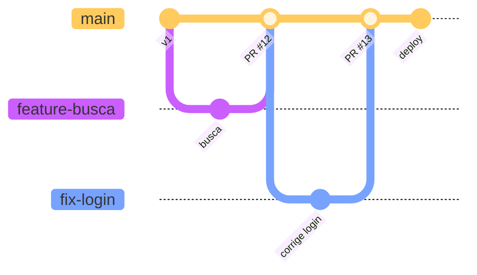
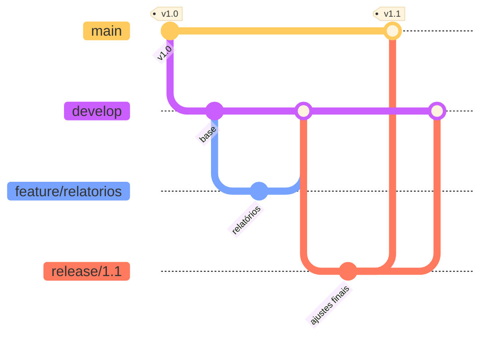

# Estratégias de branching

> [!abstract] TL;DR
> Três modelos cobrem quase tudo o que existe: **GitHub Flow** (uma linha principal + ramos curtos com PR — o padrão para quem entrega continuamente), **Git Flow** (`main` + `develop` + ramos de release e hotfix — feito para produto com versões numeradas e ciclo de release), e **trunk-based** (todo mundo integra na linha principal quase todo dia, com feature flags — o extremo da integração contínua). A variável que decide não é gosto: é **como o software chega ao usuário**. E o custo comum a todos os modelos é o mesmo: **ramo de longa duração é dívida que rende juros**.

---

## A pergunta que a estratégia responde

Quando um time cresce, aparecem perguntas que o Git sozinho não responde:

- Existe uma linha "estável" separada da linha "em desenvolvimento"?
- Uma correção urgente em produção sai de onde?
- Quando alguém pergunta "o que exatamente está no ar agora?", qual ramo responde?
- Quanto tempo um ramo pode viver antes de virar problema?

Uma estratégia de ramificação é o conjunto de respostas acordadas para isso. É documentação e disciplina — o Git aceita qualquer arranjo.

E o critério que decide não é preferência estética. É **como o software chega ao usuário**: um serviço web que você atualiza cinco vezes por dia e um aplicativo instalado que lança a versão 3.2 uma vez por trimestre têm necessidades opostas.

---

## GitHub Flow — o padrão para quem entrega contínuo

Um único ramo de longa duração (`main`), sempre publicável. Todo trabalho sai dele em ramos curtos, volta por PR, e é publicado logo depois.

**Regras:** `main` está sempre pronta para ir ao ar · ramo por mudança, com nome descritivo · nada entra sem PR e CI verde · integrou, publicou · ramo morre depois do merge.

**Bom quando:** serviço web ou API, uma versão em produção, deploy frequente, time pequeno ou médio. É o modelo certo para a maioria esmagadora dos projetos hoje.

**Custa:** exige CI confiável de verdade. Sem testes automatizados em que se confia, "main sempre publicável" vira promessa vazia.

---

## Git Flow — feito para release numerada

Dois ramos permanentes (`main` com o que está publicado, `develop` com o que vem na próxima versão) e três tipos temporários (`feature/*`, `release/*`, `hotfix/*`).

O ramo de release é o ponto: ele congela o escopo da versão 1.1 e permite estabilizá-la (só correções) **enquanto** o time já desenvolve a 1.2 na `develop`. Correção urgente em produção sai de `hotfix/*` a partir da `main`, e volta para os dois lados.

**Bom quando:** existem versões numeradas mantidas em paralelo, o cliente instala o software, há janela de homologação formal, ou você precisa dar suporte à 2.x enquanto desenvolve a 3.0. Bibliotecas, software embarcado, produto vendido em licença.

> [!info] Por que Git Flow saiu de moda — e por que ainda existe
> O modelo foi proposto por Vincent Driessen em 2010, quando publicar software significava lançar versões. O próprio autor acrescentou depois uma nota ao artigo original recomendando GitHub Flow para quem entrega continuamente. Ele não é "errado": é caro. Dois ramos permanentes significam merges constantes entre eles, e a chance de algo estar na `develop` mas não na `main` (ou o contrário) é permanente. Se você entrega toda semana, está pagando um preço por um problema que não tem. **Mas você vai encontrá-lo no legado, muito.** Projetos iniciados entre 2011 e 2018 adotaram Git Flow em massa, com frequência por cargo cult. Ao assumir um projeto assim, a pergunta útil não é "por que usam isso?", e sim **"o que hoje ainda depende disso?"** — se a resposta for nada, migrar é possível; se houver contrato de suporte a versões antigas, o modelo está fazendo o seu trabalho.

---

## Trunk-based — o extremo da integração

Todo mundo integra na linha principal continuamente: ou commit direto, ou ramos que vivem **menos de um dia**. Funcionalidade incompleta vai para produção desligada por *feature flag*, e é ligada depois.

**Bom quando:** o time é grande, o deploy é muitas vezes ao dia, e existe suíte de testes forte. É o modelo do Google e da Meta, e o recomendado pela literatura de entrega contínua.

**Custa caro em pré-requisitos:** testes automatizados rápidos e confiáveis, feature flags (com o custo de manutenção e limpeza que elas trazem), e cultura de commits pequenos. Sem isso, "todo mundo na main" vira "main quebrada o tempo todo".

---

## Comparando

| | GitHub Flow | Git Flow | Trunk-based |
|---|---|---|---|
| Ramos permanentes | 1 (`main`) | 2 (`main`, `develop`) | 1 (`main`) |
| Vida de um ramo | dias | dias a semanas | horas |
| Versões paralelas | não | **sim** | não |
| Exige CI forte | sim | menos | **muito** |
| Exige feature flags | não | não | **sim** |
| Complexidade | baixa | alta | baixa (no Git) / alta (na disciplina) |
| Encaixe típico | serviço web | produto instalado, biblioteca | escala grande, deploy contínuo |

**Se você está começando um projeto hoje:** GitHub Flow. Migre para trunk-based se a escala exigir; adote release branches se e quando precisar sustentar versões em paralelo. Não comece pelo modelo mais complexo esperando crescer até ele.

---

## O custo comum: ramo de longa duração

Independente do modelo escolhido, existe uma lei que não perdoa: **o custo de integrar cresce com o tempo de separação, e cresce mais que linearmente.**

Um ramo de dois dias integra sozinho. Um de duas semanas gera conflitos. Um de três meses vira um projeto próprio — e frequentemente é abandonado, porque integrá-lo custa mais do que refazer.

> [!warning] O ramo "refatoração" que ninguém mergeia
> **O que acontece:** alguém abre um ramo para reescrever um módulo. Passam semanas. Enquanto isso a `main` recebe cinquenta commits. Quando chega a hora de integrar, o conflito é intratável e o ramo é silenciosamente abandonado — junto com o trabalho. **Por quê:** as duas linhas divergiram além do ponto em que a ferramenta ajuda. **Como evitar:** fatie. Refatoração entra em pedaços pequenos e seguros, integrados continuamente, não em um ramo paralelo gigante. Se for inevitável manter um ramo longo, **traga a `main` para dentro dele com frequência** (`git merge main`, semanalmente) — assim você paga o conflito em parcelas.

> [!warning] Um ramo permanente por ambiente
> **O que acontece:** o time cria `develop`, `homologacao`, `staging` e `producao` como ramos permanentes, e passa a promover código de um para o outro com merges. **Por quê:** parece intuitivo espelhar os ambientes no repositório. **Como evitar:** ambiente é **deploy**, não ramo. O que vai para homologação é um commit específico (identificado por tag), promovido pelo pipeline. Ramo-por-ambiente produz divergência entre eles — o clássico "está em homologação mas não em produção, e ninguém sabe o que exatamente falta". A alternativa correta é tratada em [[03-Dominios/Engenharia/Operação/index|Engenharia/Operação]], que é a casa da disciplina de entrega.

---

## O que você vai encontrar no legado

Assumir um projeto antigo significa herdar decisões de ramificação de gente que não está mais lá. Três padrões recorrentes:

- **Git Flow adotado por cargo cult**, com `develop` idêntica à `main` há dois anos. O ramo extra só custa: nenhuma versão paralela é mantida.
- **Ramos de release fósseis** — `release/2.3`, `release/2.4`, `release/3.0` abertos, nenhum tocado desde 2019. Ninguém sabe se podem ser apagados. (A resposta costuma estar em tags, não em ramos: se a versão foi taggeada, o ramo é descartável.)
- **Herança de era centralizada** — projetos que vieram de SVN frequentemente trazem estrutura de ramificação pensada para uma ferramenta onde ramificar era caro e raro. No Git, ramificar é barato, e a estrutura herdada não faz mais sentido.

A pergunta de diagnóstico é sempre a mesma: **quais desses ramos alguém realmente usa?** `git branch -r --sort=-committerdate` responde em segundos — e costuma revelar que 90% do que existe está morto.

---

## Resumo em uma frase

**A estratégia de ramificação é decidida por como o software chega ao usuário — e qualquer que seja a escolhida, ramo longo é dívida com juros.**

> [!tip] Vídeo — os três fluxos comparados
> [**3 Git Workflows Every Developer Should Know**](https://www.youtube.com/watch?v=GQQqf-C2ha4) (TechWorld with Nana, 32 min) compara GitHub Flow, Git Flow e trunk-based com diagramas e critérios de escolha.

> [!tip] Pratique
> No sandbox do **[Learn Git Branching em português](https://learngitbranching.js.org/?locale=pt_BR)** (modo livre, `?NODEMO`), monte o Git Flow à mão: crie `develop`, um `feature/x` que volta para ela, um `release/1.0` que vai para `main` **e** para `develop`, e um `hotfix` que sai da `main`. Ver o grafo resultante explica em dois minutos por que esse modelo é caro.
>
> No seu trabalho: rode `git branch -r --sort=-committerdate | head -30` e olhe a data do último commit de cada ramo. A quantidade de ramos mortos costuma ser uma surpresa desconfortável.

---

## O que vem a seguir

Com o fluxo de ramos definido, o que entra na linha principal passa a ser um registro público — e vale que ele seja legível por máquina, não só por gente. A próxima nota é sobre transformar mensagens de commit em changelog e número de versão automáticos.

- **14 — Anatomia de um bom commit** — commit atômico, Conventional Commits, semver e tags.
- [[03-Dominios/Tecnologia/Controle de Versão/N2 - Colaborar/12 - Pull requests e a cultura de code review|12 — Pull requests]] — o portão pelo qual os ramos deste modelo passam.

## Fontes

- **Vincent Driessen** — [*A successful Git branching model*](https://nvie.com/posts/a-successful-git-branching-model/) (2010) — o artigo original do Git Flow, com a nota do autor recomendando modelos mais simples para entrega contínua.
- **GitHub Docs** — [*GitHub flow*](https://docs.github.com/en/get-started/using-github/github-flow) — a descrição oficial do modelo de ramo curto + PR.
- **Paul Hammant e col.** — [*Trunk Based Development*](https://trunkbaseddevelopment.com/) — a referência do modelo, incluindo release branches "de leitura" e o papel das feature flags.
- **Martin Fowler** — [*Patterns for Managing Source Code Branches*](https://martinfowler.com/articles/branching-patterns.html) — o tratamento mais completo do tema; a fonte da ideia de que o custo de integração cresce com o tempo de divergência.
