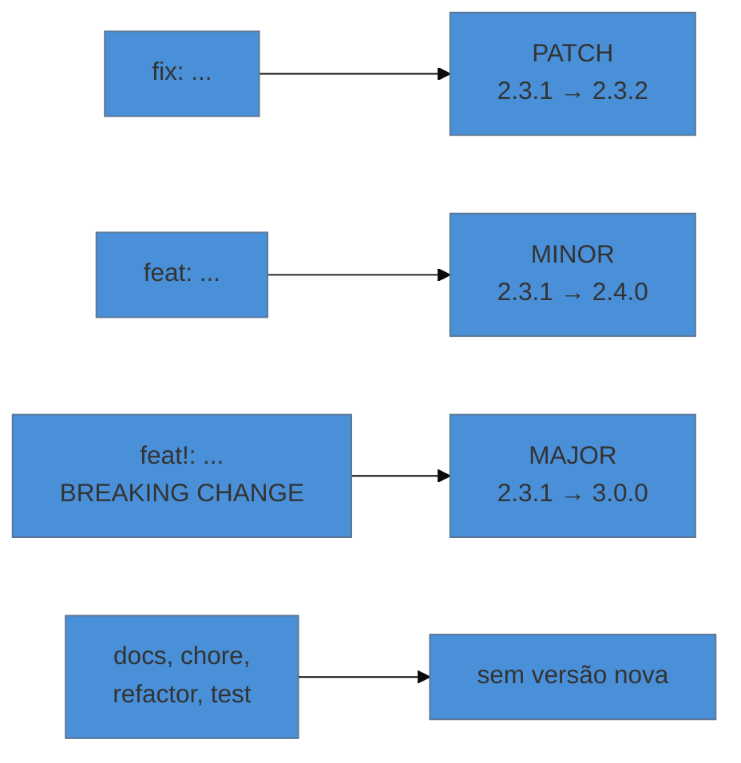

# Anatomia de um bom commit

> [!abstract] TL;DR
> Um commit bom é **atômico** (uma mudança lógica, revertível sozinha) e tem mensagem que explica **o porquê** — o "o quê" o diff já conta. O padrão **Conventional Commits** dá a essa mensagem um formato legível por máquina (`feat:`, `fix:`, `BREAKING CHANGE:`), o que permite derivar automaticamente o número da versão (**semver**) e o changelog. A armadilha é adotar o formato sem a automação: aí ele vira cerimônia sem retorno.

---

## Duas coisas separadas que costumam ser confundidas

Um commit tem **conteúdo** (o recorte de mudança que ele carrega) e **mensagem** (o texto que o descreve). As duas precisam de disciplina, e a primeira importa mais.

**Conteúdo: commit atômico.** Uma mudança lógica por commit. O teste é: *este commit pode ser revertido sozinho sem quebrar nada e sem levar junto o que não deveria?* Se a resposta for não, eram dois commits.

O contra-exemplo canônico é misturar refatoração e comportamento. Você renomeia trinta ocorrências de uma variável **e** corrige um bug no mesmo commit. Seis meses depois, o bug volta e alguém quer reverter — mas a reversão arrasta a renomeação inteira. Pior: durante a revisão, ninguém viu a correção, porque ela estava soterrada em trinta linhas de renomeação.

**Mensagem: explique o porquê.** O diff mostra o quê. Ele não mostra qual alternativa você descartou, que relato de erro motivou aquilo, ou que restrição te obrigou a fazer daquele jeito. Essa é a informação que evapora — e a única chance de registrá-la é agora.

---

## O formato clássico

```text
Corrige timeout na busca de pacientes por especialidade

A consulta fazia um acesso ao banco por item da lista, o que
passava de 30s acima de ~500 registros. Substituída por uma
única consulta com join.

Considerada também a inclusão de cache, descartada porque os
dados mudam a cada consulta agendada.

Refs #482
```

As regras convencionais, que existem por motivo prático:

- **Assunto curto** (~50 caracteres) — é o que aparece em `git log --oneline`, na lista de PRs e na interface da plataforma. Longo demais, é cortado.
- **Modo imperativo** — "Corrige", não "Corrigido" nem "Corrigindo". A mensagem completa a frase *"este commit, se aplicado, vai…"*, e é o mesmo tempo verbal que o Git usa nas mensagens que ele mesmo gera.
- **Linha em branco** antes do corpo. Sem ela, o Git trata tudo como assunto.
- **Corpo explicando o porquê**, quebrado em ~72 colunas.
- **Rodapé** para referências a issues e metadados.

Para escrever mensagem com corpo, use `git commit` sem `-m`: o editor que você configurou na nota 02 abre.

---

## Conventional Commits

O padrão acrescenta um prefixo estruturado ao assunto, tornando a mensagem legível por máquina:

```text
<tipo>[escopo opcional]: <descrição>

[corpo opcional]

[rodapé opcional]
```

Os tipos usados na prática:

| Tipo | Quando | Efeito na versão |
|---|---|---|
| `feat` | funcionalidade nova | **MINOR** |
| `fix` | correção de bug | **PATCH** |
| `docs` | só documentação | nenhum |
| `refactor` | reestrutura sem mudar comportamento | nenhum |
| `perf` | melhora de desempenho | PATCH |
| `test` | adiciona ou corrige teste | nenhum |
| `build` | build, dependências | nenhum |
| `ci` | pipeline | nenhum |
| `chore` | manutenção geral | nenhum |
| `style` | formatação sem mudar lógica | nenhum |

E a marcação de ruptura, que é a parte mais importante do padrão:

```text
feat!: troca autenticação de sessão para JWT

BREAKING CHANGE: o endpoint /login deixa de devolver cookie de
sessão; clientes precisam armazenar e enviar o token.
```

Tanto o `!` quanto o rodapé `BREAKING CHANGE:` sinalizam incompatibilidade — e disparam **MAJOR**.

---

## Semver, e a ligação com as mensagens

O versionamento semântico dá significado a cada parte de `MAJOR.MINOR.PATCH`:

- **MAJOR** — quebrou compatibilidade. Quem usa precisa mudar alguma coisa.
- **MINOR** — funcionalidade nova, compatível com o que existia.
- **PATCH** — correção compatível.

A promessa é para quem consome: subir de `2.3.1` para `2.3.4` deveria ser seguro; subir para `3.0.0` exige ler o que mudou.



É essa correspondência que fecha o ciclo: se as mensagens seguem o padrão, uma ferramenta lê os commits desde a última tag, calcula o próximo número, gera o changelog e cria a release. Ninguém decide manualmente, e ninguém esquece de anotar.

Ferramentas que fazem isso: **release-please**, **semantic-release**, **changesets** (bom para monorepos) e **git-cliff** (só changelog, agnóstico de linguagem).

> [!warning] Conventional Commits sem automação é cerimônia vazia
> **O que acontece:** o time adota o formato, briga em revisão sobre `chore` × `refactor`, e no fim escreve o changelog na mão do mesmo jeito.
> **Por quê:** o padrão não tem valor intrínseco — o valor está no que se deriva dele.
> **Como evitar:** adote o formato **junto** com a ferramenta que o consome. Se você não vai gerar changelog nem versão automaticamente, uma mensagem clara em português vale tanto quanto, e custa menos discussão. Quando adotar, coloque um verificador na CI (`commitlint`) — padrão não verificado degrada em semanas.

---

## Tags: marcando pontos na história

Tag é um nome fixo apontando para um commit. Enquanto um ramo se move a cada commit, a tag fica onde está — é o que faz dela o instrumento certo para marcar versões.

```bash
git tag -a v1.2.0 -m "Versão 1.2.0"    # anotada — a que você deve usar
git tag v1.2.0                          # leve — só um apelido
git tag                                 # lista
git show v1.2.0                         # o que há naquele ponto
```

**Anotada × leve:** a anotada é um objeto completo no repositório, com autor, data e mensagem próprios (e pode ser assinada). A leve é apenas um ponteiro. Para versão publicada, use **sempre anotada** — a leve não registra quem marcou nem quando.

> [!warning] Tag não vai junto no `git push`
> **O que acontece:** você cria a tag `v1.2.0`, dá `push`, e ela não aparece no servidor. A release não existe para mais ninguém.
> **Por quê:** por padrão o `push` envia commits de ramos, não tags.
> **Como evitar:**
> ```bash
> git push origin v1.2.0     # uma tag específica
> git push --follow-tags     # commits + tags anotadas alcançáveis
> ```
> O `--follow-tags` é o que vale configurar como hábito. E **não mova uma tag já publicada**: quem já baixou continua com a antiga, e as duas versões do "v1.2.0" passam a coexistir no mundo. Se errou, crie `v1.2.1`.

Nas plataformas, a tag é o gatilho: criar uma tag costuma disparar o pipeline de release, e a *release* do GitHub é uma camada por cima dela, com notas e binários anexados.

---

## Armadilhas comuns

> [!warning] `fix: fix`
> **O que acontece:** o formato é obedecido e a mensagem não diz nada. `fix: correções`, `feat: melhorias`, `chore: ajustes`.
> **Por quê:** o padrão disciplina o prefixo, não o conteúdo.
> **Como evitar:** a descrição depois do prefixo continua tendo que passar no teste do "este commit, se aplicado, vai…". Prefixo não substitui pensar.

> [!warning] Commit que mistura refatoração e comportamento
> **O que acontece:** já descrito acima — a reversão fica impossível e a revisão, cega.
> **Por quê:** é mais rápido no momento de commitar.
> **Como evitar:** `git add -p` permite separar em partes o que você editou junto, escolhendo trecho por trecho o que entra em cada commit. É o comando que torna o commit atômico viável na prática, mesmo quando você trabalhou de forma desorganizada.

> [!warning] Deixar a disciplina só para o final
> **O que acontece:** o time decide "limpar o histórico antes do merge" e nunca limpa.
> **Por quê:** limpeza retroativa é trabalho chato e sem prazo.
> **Como evitar:** se a estratégia de merge do time é **squash** (nota 12), a mensagem que importa é a do squash — e ela é editável no momento do merge. Nesse arranjo, commits internos do ramo podem ser bagunçados sem custo, e a disciplina se concentra num único ponto. É a combinação mais realista para a maioria das equipes.

---

## Resumo em uma frase

**Commit atômico com mensagem que explica o porquê é o que torna o histórico consultável — e Conventional Commits só vale a pena quando alguma máquina lê o que você escreveu.**

> [!tip] Vídeo — commits que geram versão sozinhos
> [**Como Utilizar Semantic Versioning e Conventional Commits**](https://www.youtube.com/watch?v=v4jeVNfsJnc) (Caio Delgado, 10 min) mostra a cadeia completa em português: mensagem padronizada → número de versão → changelog automático.

> [!tip] Pratique
> Use `git add -p` no seu próximo trabalho. Ele mostra pedaço por pedaço do que você mudou e pergunta se entra ou não no commit — respondendo `y`, `n` ou `s` (dividir ainda mais). É a ferramenta que transforma "trabalhei em três coisas ao mesmo tempo" em três commits limpos, e quase ninguém a conhece.
>
> Depois, rode `git log --oneline -30` num projeto seu antigo e pergunte de cada linha: eu saberia o que isso fez sem abrir o diff? A taxa de acerto costuma ser humilhante — e é a melhor motivação para mudar o hábito.

---

## O que vem a seguir

Você já tem fluxo de ramos, revisão e um histórico legível. O que falta é fazer com que esses acordos deixem de depender de boa vontade: exigir revisão antes do merge, exigir CI verde, definir quem aprova o quê. Isso mora na plataforma.

- **15 — GitHub como plataforma** — issues e projects, rulesets, CODEOWNERS, Actions como contrato e segurança do repositório.
- [[03-Dominios/Tecnologia/Controle de Versão/N2 - Colaborar/12 - Pull requests e a cultura de code review|12 — Pull requests]] — a estratégia de merge escolhida lá muda onde a disciplina de mensagem se aplica.

## Fontes

- **Conventional Commits** — [*Especificação v1.0.0 (PT-BR)*](https://www.conventionalcommits.org/pt-br/v1.0.0/) — os tipos, o `!`, o rodapé `BREAKING CHANGE` e a correspondência com semver.
- **Semantic Versioning** — [*semver.org (PT-BR)*](https://semver.org/lang/pt-BR/) — a especificação de MAJOR.MINOR.PATCH e as garantias que ela promete.
- **Chris Beams** — [*How to Write a Git Commit Message*](https://cbea.ms/git-commit/) — as sete regras clássicas, incluindo o imperativo e o limite de 50/72 colunas.
- **Scott Chacon & Ben Straub** — [*Pro Git*, cap. 2 — "Tagging"](https://git-scm.com/book/pt-br/v2/Fundamentos-de-Git-Criando-Tags) — tags leves × anotadas e o envio de tags.
- **Nota interna** — [[03-Dominios/Tecnologia/Ferramentas/Versionamento|Ferramentas/Versionamento]] — monólito do vault (2026-04) cujas seções de Conventional Commits, boas práticas e merge × rebase foram absorvidas por esta nota e pela 13.
