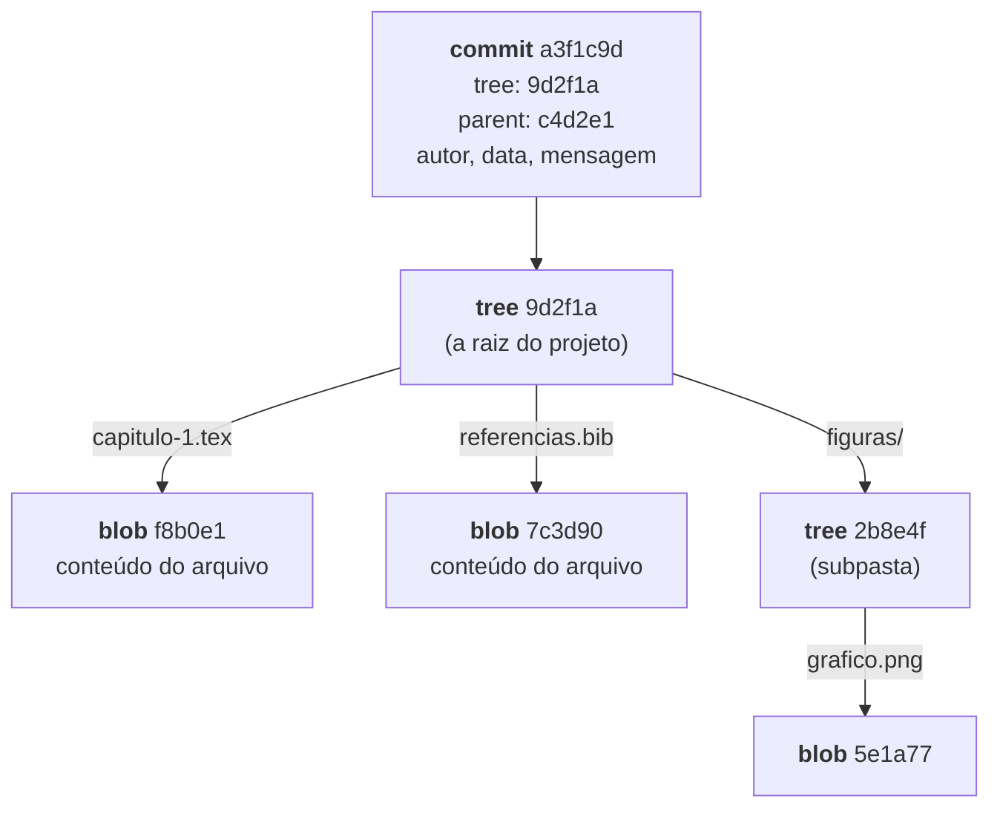

# Tudo tem hash — o modelo de objetos

> [!abstract] TL;DR
> Por baixo, o Git é um banco de dados chave-valor com uma regra peculiar: **a chave é o hash do próprio conteúdo**. Existem quatro tipos de objeto — `blob` (conteúdo de arquivo), `tree` (uma pasta: nomes apontando para blobs e outras trees), `commit` (um tree + pais + autoria + mensagem) e `tag` (uma tag anotada). Nada nunca é modificado: mudar qualquer coisa produz um objeto novo, com hash novo. É daí que vêm quase todas as propriedades do Git — integridade, deduplicação, velocidade e o fato de que reescrever história significa literalmente criar objetos novos.

---

## O experimento que explica tudo

Faça isto num repositório de teste:

```bash
echo "olá" > a.txt
cp a.txt b.txt
git add a.txt b.txt
git ls-files -s
```

```text
100644 f8b0e1d5... 0	a.txt
100644 f8b0e1d5... 0	b.txt
```

Dois arquivos, **o mesmo hash**. O Git guardou o conteúdo `olá` uma única vez, e os dois nomes apontam para ele.

Agora edite `b.txt` e repita: o hash de `b.txt` muda, o de `a.txt` não. E se você desfizer a edição, o hash volta a ser o antigo — e nenhum objeto novo é criado, porque aquele conteúdo já existe no banco.

Essa é a ideia inteira: **o Git identifica conteúdo pelo hash do conteúdo**. Não pelo nome, não pela data, não por número de versão. Isso se chama armazenamento endereçado por conteúdo, e é a decisão de projeto da qual todo o resto decorre.

---

## Os quatro tipos de objeto



- **blob** — o conteúdo de um arquivo. Só o conteúdo: um blob não sabe seu nome nem sua permissão.
- **tree** — uma pasta. Uma lista de entradas, cada uma com nome, modo (permissão) e o hash do blob ou tree correspondente. **É o tree que conhece os nomes.**
- **commit** — aponta para **um** tree (o estado completo do projeto naquele momento), para zero ou mais commits pais, e carrega autor, committer, datas e mensagem.
- **tag anotada** — aponta para um objeto (normalmente um commit) e carrega quem marcou, quando e por quê. A tag leve não é objeto nenhum: é só uma ref, assunto da nota 19.

Repare na consequência: como o blob não guarda o nome, **renomear um arquivo sem alterar o conteúdo não cria blob novo** — cria um tree novo, com o nome diferente apontando para o mesmo blob. É por isso que o Git não precisa registrar renomeações: ele as *deduz* comparando trees, e é isso que o `--follow` da nota 07 faz.

---

## Vendo com as próprias mãos

Três comandos abrem o banco de objetos:

```bash
git cat-file -t a3f1c9d     # que tipo de objeto é este?
git cat-file -p a3f1c9d     # imprima o conteúdo dele
git rev-parse HEAD          # qual o hash do commit atual?
```

Percorrendo a partir de um commit:

```bash
$ git cat-file -p HEAD
tree 9d2f1ae4c8b7...
parent c4d2e1a9f3b2...
author Ana Ribeiro <ana@u.br> 1753920000 -0300
committer Ana Ribeiro <ana@u.br> 1753920000 -0300

Adiciona seção de limitações

$ git cat-file -p 9d2f1ae4
100644 blob f8b0e1d5...	capitulo-1.tex
100644 blob 7c3d9012...	referencias.bib
040000 tree 2b8e4f77...	figuras
```

É literalmente texto. Um commit é um arquivinho com cinco campos, e um tree é uma listinha de entradas. Não há nada de mágico escondido — e ver isso costuma ser o momento em que o Git deixa de parecer sobrenatural.

> [!question]- Onde isso fica no disco?
> Em `.git/objects/`. Cada objeto vira um arquivo comprimido cujo caminho são os dois primeiros caracteres do hash como pasta e o resto como nome — `.git/objects/a3/f1c9d...`. São os chamados objetos *soltos*. Com o tempo, o Git empacota milhares deles em arquivos `.pack`, aplicando compressão entre objetos parecidos (aí sim guardando diferenças, como otimização de armazenamento — o que **não** contradiz o modelo: conceitualmente cada objeto continua completo, e o `git gc` faz esse empacotamento nos bastidores).

---

## Como o hash é calculado

Não é o hash do arquivo puro. O Git monta um cabeçalho antes:

```text
<tipo> <tamanho em bytes>\0<conteúdo>
```

e passa isso pela função de hash. Você pode reproduzir:

```bash
$ echo "olá" | git hash-object --stdin
f8b0e1d5...
```

Duas consequências práticas: um blob e um tree com os mesmos bytes teriam hashes diferentes (o cabeçalho difere), e o mesmo conteúdo produz o mesmo hash **em qualquer máquina do mundo** — o que é o que permite dois repositórios verificarem que têm exatamente a mesma coisa trocando 40 caracteres.

---

## Integridade: por que isso importa mais do que parece

Como o commit contém o hash do tree, e o tree contém os hashes dos blobs, e o commit contém o hash do pai — **qualquer alteração em qualquer ponto do passado muda o hash de tudo o que veio depois**.

Isso significa que o identificador de um commit não é um número de série: é uma **impressão digital de todo o histórico até ali**. Se duas pessoas em máquinas diferentes têm o commit `a3f1c9d`, elas têm com certeza matemática a mesma árvore de arquivos e a mesma história — bit a bit.

É por isso que o Git detecta corrupção de disco (`git fsck` recalcula e compara) e por isso que assinar um único commit ou tag atesta tudo o que está atrás dele.

> [!info] SHA-1, colisões e SHA-256
> O Git nasceu usando **SHA-1**, que hoje é considerado quebrado para uso criptográfico — em 2017 o ataque *SHAttered* produziu duas entradas diferentes com o mesmo hash. Duas ressalvas importam. Primeira: o Git incorporou desde a versão 2.13 uma **detecção de colisão** (a implementação `sha1dc`), que rejeita conteúdos construídos com esse tipo de ataque. Segunda: a segurança do Git nunca dependeu só do hash — ela depende também de quem tem acesso de escrita ao repositório. Existe suporte a repositórios em **SHA-256** desde o Git 2.29, mas a adoção é baixa porque a interoperabilidade entre repositórios dos dois formatos ainda não está completa, e as plataformas de hospedagem seguem majoritariamente em SHA-1. Na prática: você vai trabalhar com SHA-1 e está tudo bem.

---

## O que isso explica dos níveis anteriores

Agora várias regras deixam de ser arbitrárias:

| Você aprendeu como regra | O mecanismo |
|---|---|
| `--amend` "não edita, cria outro commit" (nota 04) | objetos são imutáveis; mudar a mensagem muda o conteúdo do commit, logo muda o hash, logo é **outro objeto** |
| "o Git só adiciona dados" (nota 04) | escrever um objeto não apaga nenhum; o antigo continua no banco até a coleta de lixo |
| "commit é ponto de retorno garantido" (nota 04) | o commit referencia um tree completo do projeto, não uma diferença |
| Renomear arquivo não perde histórico (nota 07) | o blob é o mesmo; só o tree mudou, e o Git deduz a renomeação |
| Repositórios idênticos têm hashes idênticos (nota 05) | endereçamento por conteúdo, com cabeçalho canônico |

---

## Armadilhas comuns

> [!warning] Achar que o hash é aleatório ou sequencial
> **O que acontece:** a pessoa tenta "ordenar por hash" ou supõe que um hash maior é mais recente. **Por quê:** ele parece um número arbitrário. **Como pensar:** o hash não tem ordem nem tempo — é uma função do conteúdo. Cronologia vem dos **pais** do commit (nota 18), nunca do valor do hash.

> [!warning] Commitar arquivo grande "só uma vez"
> **O que acontece:** alguém commita um arquivo de 300 MB, percebe o erro e o remove no commit seguinte. O repositório continua com 300 MB para sempre, e todo mundo que clonar vai baixar isso. **Por quê:** o blob foi criado e continua alcançável pelo commit antigo, que continua no histórico. **Como evitar:** `.gitignore` (nota 06) e atenção antes de commitar. Remover de verdade exige reescrever o histórico — mesma família de operação da nota 25.

> [!warning] Confundir "endereçado por conteúdo" com "sem duplicação nenhuma"
> **O que acontece:** espera-se que trocar uma linha num arquivo de 10 MB custe alguns bytes. **Por quê:** conceitualmente, o Git cria um **blob novo e completo**. **Na prática:** o empacotamento (`git gc`) aplica compressão de diferenças entre objetos parecidos, então o custo real em disco costuma ser pequeno **para texto**. Para binário, que não comprime bem entre versões, o custo é real — e é a raiz do problema de repositório inchado.

---

## Resumo em uma frase

**O Git é um banco de objetos onde o nome de cada coisa é o hash do que ela contém — e como conteúdo diferente nunca cabe no mesmo nome, nada é editado: tudo é recriado.**

> [!tip] Vídeo — abrindo os objetos
> [**Git Internals - Git Objects**](https://www.youtube.com/watch?v=MyvyqdQ3OjI) (Brief, 7 min) escava blob, tree e commit com `cat-file`, que é a mesma escavação sugerida no Pratique desta nota.

> [!tip] Pratique
> Faça a escavação completa num repositório de teste, sem pular passos:
> ```bash
> git rev-parse HEAD          # pegue o hash do commit
> git cat-file -p <hash>      # veja o tree e o parent
> git cat-file -p <tree>      # veja os arquivos
> git cat-file -p <blob>      # veja o conteúdo
> ```
> Quatro comandos e você percorreu o modelo inteiro à mão. Depois, o teste dos dois arquivos idênticos do começo desta nota — ver o mesmo hash aparecer duas vezes é o que faz a ficha cair.
>
> Para leitura, é o momento do capítulo **10 do [Pro Git](https://git-scm.com/book/pt-br/v2)** ("Git Internals"), que é a fonte primária deste nível inteiro.

---

## O que vem a seguir

Você viu que um commit aponta para um tree e para seus pais. É esse segundo ponteiro que constrói a história — e a estrutura que ele forma não é uma lista, é um grafo. A próxima nota mostra por que essa distinção importa e por que o Git guarda fotografias, não diferenças.

- **18 — Commit é snapshot, não diff: o DAG** — a forma do histórico.
- [[03-Dominios/Tecnologia/Controle de Versão/N0 - Sobrevivência/03 - Seu primeiro repositório|03 — Seu primeiro repositório]] — os três lugares, que a nota 20 vai reexplicar em termos de objetos.

## Fontes

- **Scott Chacon & Ben Straub** — [*Pro Git*, cap. 10 — "Git Internals: Objetos do Git"](https://git-scm.com/book/pt-br/v2/Git-Internals-Objetos-do-Git) — a fonte canônica: blob, tree, commit, `hash-object`, `cat-file`.
- **Git** — [*git-cat-file*](https://git-scm.com/docs/git-cat-file) · [*git-hash-object*](https://git-scm.com/docs/git-hash-object) — as ferramentas de inspeção usadas aqui.
- **Git** — [*Hash Function Transition*](https://git-scm.com/docs/hash-function-transition) — o plano de migração para SHA-256 e o estado da interoperabilidade.
- **Marc Stevens e col.** — [*SHAttered*](https://shattered.io/) (2017) — a colisão prática de SHA-1 que motivou a detecção embutida no Git.
- **Josenaldo Matos** — [*curso-git-github*](https://github.com/josenaldo/curso-git-github) (2017), Tomo 6 — "Tudo tem checksum SHA-1" e "Git só adiciona dados", cujo argumento esta nota desenvolve.
