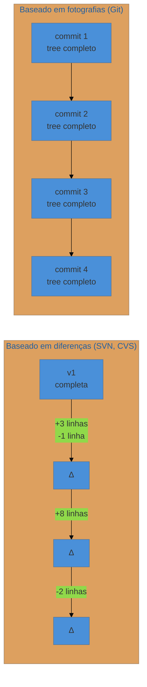
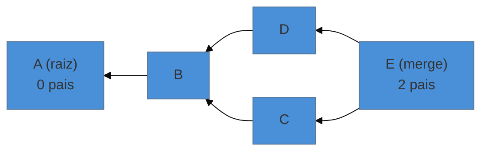

# Commit é snapshot, não diff — o DAG

> [!abstract] TL;DR
> Sistemas antigos guardavam **a diferença entre versões**; o Git guarda **o estado inteiro do projeto** a cada commit, e calcula a diferença na hora em que você pede. Como cada commit aponta para seus pais, o conjunto forma um **grafo dirigido acíclico** (DAG): dirigido porque as setas só apontam para o passado, acíclico porque nada pode ser ancestral de si mesmo. Quase toda operação do Git — merge, log, bisect, blame, rebase — é uma travessia desse grafo.

---

## As duas formas de guardar história

Imagine que você precisa guardar cinco versões de um documento.

**Estratégia diferença:** guarde a versão 1 inteira e, depois, só o que mudou entre uma e outra. Economiza espaço. Para reconstruir a versão 5, aplique as quatro diferenças em sequência.

**Estratégia fotografia:** guarde as cinco versões completas. Para obter a versão 5, pegue a versão 5.

O CVS e o Subversion adotaram a primeira; o Git adotou a segunda.



A escolha parece desperdício, e não é — pelo que vimos na nota 17: o tree de um commit reaproveita todos os blobs que não mudaram. Um commit que altera um arquivo entre cem cria **um** blob novo, alguns trees, e um commit. Os outros noventa e nove blobs são os mesmos objetos de antes, referenciados de novo.

E o ganho é grande:

- **Recuperar qualquer versão é imediato** — não é preciso aplicar uma cadeia de diferenças desde o começo. Vinte anos de projeto não tornam o checkout de um commit antigo mais lento.
- **`git blame`, `bisect` e `checkout` de commits antigos** são operações locais e rápidas.
- **A integridade se verifica ponto a ponto** — cada commit descreve um estado completo e conferível.

> [!question]- Então o Git não guarda diffs em lugar nenhum?
> Conceitualmente, não. Fisicamente, sim — como otimização. Quando o Git empacota objetos (`git gc`), ele guarda alguns como diferenças em relação a outros parecidos, para economizar disco. A distinção importa: essa compressão é invisível e reversível, e **não** é a estrutura da história. Um commit continua sendo "o projeto inteiro naquele instante", e o Git pode reescrever o empacotamento quando quiser sem alterar hash nenhum. Modelo e armazenamento são camadas diferentes.

---

## O diff é calculado, não guardado

Uma consequência que muita gente demora a perceber: quando você roda `git show a3f1c9d`, o Git **não** está lendo um diff armazenado. Ele pega o tree daquele commit, pega o tree do pai, compara os dois, e produz a diferença na hora.

Isso explica coisas do dia a dia:

- Você pode pedir a diferença entre **quaisquer dois commits**, mesmo distantes e em ramos diferentes — nunca existiu um "diff entre eles" gravado, ele é gerado sob demanda.
- Detecção de renomeação é heurística (`-M`), baseada em semelhança de conteúdo, e não um fato registrado.
- Você pode mudar como o diff é apresentado (por palavra, ignorando espaços, com mais contexto) sem alterar nada no repositório — a apresentação é produto, não dado.

---

## O grafo

Cada commit guarda o hash de seus pais. Ligando todos, você tem um **DAG — grafo dirigido acíclico**:

- **Dirigido** — a seta vai do commit para o pai. Um commit sabe de onde veio; ele **não sabe** quem vem depois. (É por isso que o Git precisa percorrer o grafo de trás para frente, e por isso que `git log` começa pelo mais recente.)
- **Acíclico** — não há como voltar ao ponto de partida seguindo as setas. Estruturalmente impossível: o hash de um commit depende do hash do pai, então um ciclo exigiria que um hash contivesse a si mesmo.

Os casos possíveis de paternidade:

| Pais | O que é |
|---|---|
| 0 | commit inicial (raiz) — o primeiro do repositório |
| 1 | commit comum |
| 2 | **commit de merge** — junta duas linhas |
| 3+ | merge *octopus*, juntando várias de uma vez (raro) |



Leia as setas como "tem como pai". O commit `E` é um merge: ele tem dois pais, `D` e `C`, e por isso a história de ambos os lados está preservada e alcançável a partir dele.

---

## Alcançabilidade — o conceito que organiza tudo

Um commit está **alcançável** a partir de outro se existe um caminho de setas até ele. Essa única ideia é a base de operações que pareciam não ter relação:

- **`git log`** lista os commits alcançáveis a partir de onde você está.
- **`git log main..feature`** lista o que é alcançável de `feature` mas não de `main` — ou seja: "o que este ramo tem de novo". É o cálculo por trás do que um PR mostra.
- **`git merge-base A B`** encontra o ancestral comum mais próximo — o ponto onde as duas histórias se separaram. É o insumo do merge (nota 21).
- **`git bisect`** faz busca binária **no grafo** entre um commit bom e um ruim.
- **Coleta de lixo**: objetos que deixaram de ser alcançáveis por qualquer ref viram candidatos a remoção. É exatamente o que acontece com os commits que um `--amend` ou um rebase "descartam" — eles ficam órfãos, não apagados, e o `reflog` (nota 23) ainda os alcança por um tempo.

> **Alcançabilidade em uma frase:** para o Git, "existir" é "ser alcançável a partir de alguma referência".

---

## O tempo não vem do relógio

O commit carrega duas datas (autoria e commit), mas **elas não determinam a ordem da história** — a ordem vem das arestas do grafo.

Isso não é curiosidade acadêmica. Depois de um rebase, é comum que a data de autoria de um commit seja anterior à do commit que está atrás dele no grafo. O `git log` até aceita ordenar por data (`--date-order`), mas a topologia (`--topo-order`) é a verdade estrutural.

E é por isso que a lista de commits que o Git te mostra pode não bater com "a ordem em que as coisas foram escritas" — ela reflete a ordem em que foram **integradas**.

---

## Armadilhas comuns

> [!warning] Imaginar a história como uma linha
> **O que acontece:** a pessoa espera que "o commit anterior" seja sempre único e bem definido, e se confunde ao encontrar um merge — onde `HEAD~1` e `HEAD^2` apontam para lugares diferentes. **Por quê:** num merge, há dois pais. `HEAD^1` é o primeiro (o ramo em que você estava), `HEAD^2` é o segundo (o que foi incorporado). E `HEAD~2` significa "dois passos para trás seguindo sempre o primeiro pai" — que é diferente de `HEAD^2`. **Como evitar:** `~` anda gerações pelo primeiro pai; `^` escolhe **qual** pai. Guardar essa distinção evita erros com consequências reais em `reset` e `revert`.

> [!warning] Reverter um merge sem escolher o lado
> **O que acontece:** `git revert` num commit de merge falha pedindo `-m`. **Por quê:** desfazer um merge significa "voltar a ser como qual dos dois pais?" — e o Git não tem como adivinhar. **Como evitar:** `git revert -m 1 <merge>` mantém a linha principal (o primeiro pai). E saiba que reverter um merge tem um efeito de segunda ordem desagradável: o ramo revertido não pode simplesmente ser mergeado de novo depois, porque o Git o considera já integrado.

> [!warning] Achar que `git log` mostra tudo que existe
> **O que acontece:** um commit "sumiu" depois de um rebase ou de um reset. **Por quê:** o `log` mostra o que é **alcançável a partir de onde você está**. Objetos órfãos continuam no banco, mas fora do alcance. **Como resolver:** `git reflog` (nota 23) alcança o que o `log` não vê, e `git fsck --lost-found` encontra órfãos de verdade.

---

## Resumo em uma frase

**Cada commit é uma fotografia completa ligada às fotografias anteriores; a história é o grafo dessas ligações, e o diff é uma conta feita na hora.**

> [!tip] Vídeo — o modelo em quatro minutos
> [**How Git Works: Explained in 4 Minutes**](https://www.youtube.com/watch?v=e9lnsKot_SQ) (ByteByteGo, 4 min) resume snapshot × diff e a forma de grafo do histórico com animação — bom como revisão depois de ler.

> [!tip] Pratique
> Veja a estrutura com os próprios olhos, num repositório com alguns merges:
> ```bash
> git log --graph --oneline --all      # o grafo desenhado
> git log --oneline main..outro-ramo   # só o que o ramo tem a mais
> git merge-base main outro-ramo       # onde eles se separaram
> git cat-file -p <hash-de-um-merge>   # veja as DUAS linhas "parent"
> ```
> O último é o mais revelador: ver dois `parent` num mesmo objeto é o que transforma "merge commit" de jargão em estrutura.
>
> E, para fixar a diferença entre `~` e `^`, o nível **"Relative Refs"** do [Learn Git Branching em português](https://learngitbranching.js.org/?locale=pt_BR) é exatamente isso, com o grafo desenhado.

---

## O que vem a seguir

O grafo existe, mas alguém precisa apontar para ele — senão nada é alcançável. Esses ponteiros são as refs, e é aí que se descobre que um branch, aquela coisa que parecia pesada, é um arquivo de texto com 41 bytes.

- **19 — Refs, HEAD e branch como ponteiro** — o que é um ramo, de verdade.
- [[03-Dominios/Tecnologia/Controle de Versão/N3 - O modelo por baixo/17 - Tudo tem hash - o modelo de objetos|17 — Tudo tem hash]] — os objetos que compõem os nós deste grafo.

## Fontes

- **Scott Chacon & Ben Straub** — [*Pro Git*, cap. 1 — "Fundamentos do Git"](https://git-scm.com/book/pt-br/v2/Come%C3%A7ando-O-que-%C3%A9-Git%3F) — a comparação explícita entre armazenamento por diferenças e por fotografias.
- **Git** — [*gitrevisions*](https://git-scm.com/docs/gitrevisions) — a semântica de `~`, `^`, `..` e `...`, e a definição de alcançabilidade.
- **Git** — [*git-merge-base*](https://git-scm.com/docs/git-merge-base) — ancestral comum e os casos de múltiplas bases.
- **Sam Livingston-Gray** — [*Think Like (a) Git*](https://think-like-a-git.net/) — o tratamento do Git pela teoria dos grafos; a fonte da ênfase em alcançabilidade.
- **Josenaldo Matos** — [*workshop-git*](https://github.com/josenaldo/workshop-git) (2016), Tomo 2 — "Snapshots x diferenças".
