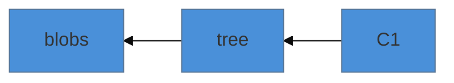
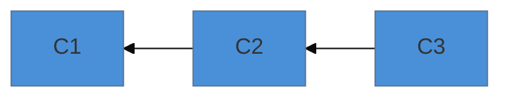
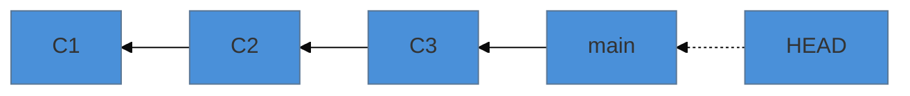
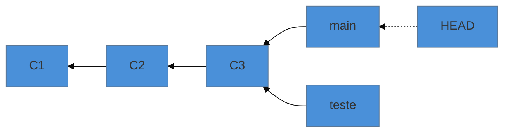
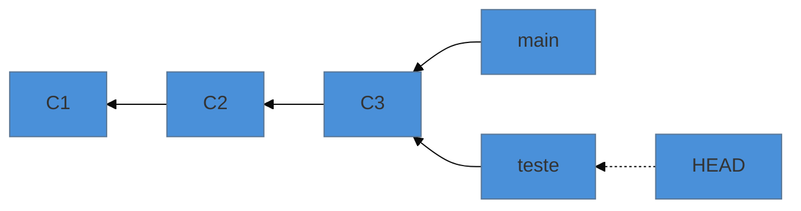
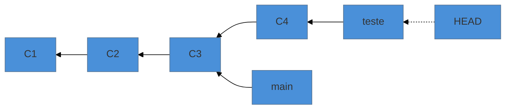
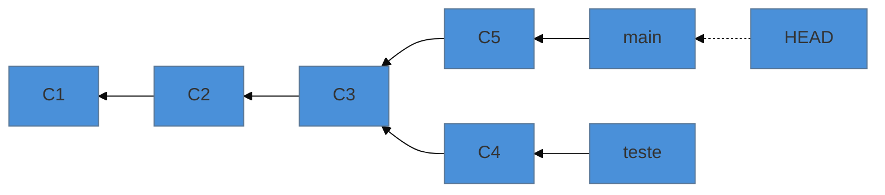

# Refs, HEAD e branch como ponteiro

> [!abstract] TL;DR
> Um branch não é uma cópia, nem uma pasta, nem um pedaço do repositório: é **um arquivo de texto com 41 bytes** contendo o hash de um commit. Criar um ramo é escrever esse arquivo — por isso é instantâneo mesmo num repositório de vinte anos. O `HEAD` é outro arquivo, que normalmente contém o **nome** de um ramo (por isso commitar move o ramo junto) e, quando contém um hash direto, produz o estado que assusta com nome ruim: *detached HEAD*.

---

## A pergunta que quase ninguém faz

Ramificar no Git é instantâneo. Num repositório com dez anos de história e cem mil arquivos, `git switch -c experimento` responde antes de você tirar a mão do teclado.

Como? Se um ramo fosse uma cópia do projeto, isso seria impossível.

```bash
$ cat .git/refs/heads/main
a3f1c9d5e2b8471f0c6d9a3e7b52814f6d0e9c2a
```

Quarenta caracteres hexadecimais e uma quebra de linha. **Quarenta e um bytes.** É isso que um branch é.

Criar um ramo é escrever um arquivo desses. Apagar um ramo é apagar o arquivo — o que explica por que apagar um ramo **não apaga commit nenhum**: você removeu um ponteiro, e os objetos continuam no banco, apenas possivelmente inalcançáveis (nota 18).

---

## Refs: os três tipos que importam

Uma **ref** é um nome legível apontando para um hash. Elas moram em `.git/refs/`:

| Onde | O que é | Exemplo |
|---|---|---|
| `refs/heads/` | seus ramos locais | `refs/heads/main` |
| `refs/remotes/` | ramos de rastreamento remoto | `refs/remotes/origin/main` |
| `refs/tags/` | tags | `refs/tags/v1.2.0` |

Aquele `origin/main` da nota 11 — "o que você sabe sobre o servidor" — agora tem endereço físico: é um arquivo em `refs/remotes/origin/main`, atualizado quando você faz `fetch`. Ele não é atualizado por mágica nem por consulta à rede, porque é só um arquivo que alguém precisa escrever.

Uma tag leve é uma ref em `refs/tags/` apontando direto para o commit. Uma tag anotada é uma ref apontando para um **objeto tag** (nota 17), que por sua vez aponta para o commit. Daí a diferença: a anotada tem autor, data e mensagem próprios porque é um objeto; a leve é só o ponteiro.

> [!info] Se você não encontrar o arquivo
> Depois de um `git gc`, o Git compacta as refs num único arquivo `.git/packed-refs` para não ter milhares de arquivinhos. Se `cat .git/refs/heads/algum-ramo` disser que não existe, olhe lá — ou use o comando certo, que funciona nos dois casos:
> ```bash
> git rev-parse main          # o hash para onde a ref aponta
> git show-ref                # todas as refs
> git symbolic-ref HEAD       # para qual ramo o HEAD aponta
> ```

---

## HEAD: o ponteiro para o ponteiro

```bash
$ cat .git/HEAD
ref: refs/heads/main
```

O `HEAD` normalmente **não** contém um hash: contém o *nome de uma ref*. É um ponteiro para um ponteiro, e essa indireção é a peça que faz o mecanismo todo funcionar.

Quando você commita, o Git:

1. cria o objeto commit, com o `HEAD` atual como pai;
2. descobre para qual ref o `HEAD` aponta;
3. **escreve o novo hash naquela ref.**

É o passo 3 que faz o ramo "avançar". O ramo não segue você por vontade própria: ele é atualizado porque o `HEAD` disse qual arquivo reescrever.

---

## A sequência que explica tudo

Sete passos, do primeiro commit à divergência. Vale acompanhar um a um — esta é a espinha conceitual do nível inteiro.

**1. Um commit existe.** Ele aponta para um tree, que aponta para os blobs.



**2. Um commit novo aponta para o anterior.** A história é essa corrente.



**3. `main` é só uma ref apontando para o último commit** — e `HEAD` aponta para `main`.



**4. `git branch teste` cria outra ref**, apontando para o mesmo commit. Nada foi copiado: escreveram-se 41 bytes. E repare que o `HEAD` **não** se moveu.



**5. `git switch teste` move o `HEAD`** — só o `HEAD`, e ele passa a conter `ref: refs/heads/teste`. Os arquivos da pasta são atualizados para o tree daquele commit (que aqui é o mesmo, então nada visível muda).



**6. Um commit faz avançar o ramo para onde o `HEAD` aponta.** `teste` avança; `main` fica onde estava.



**7. Volte para `main` e commite: as histórias divergem.** Agora existem duas linhas com um ancestral comum em `C3` — que é exatamente o que o merge da nota 21 vai precisar encontrar.



Nesses sete passos, o único conteúdo que mudou foram **arquivos de 41 bytes e o `HEAD`**. Nenhuma cópia de projeto, nenhuma pasta duplicada. Ramificar é barato porque não há nada caro acontecendo.

---

## `detached HEAD`: o susto que não era

Quando você faz `git checkout a3f1c9d` (um hash, não um nome de ramo), o `HEAD` deixa de conter `ref: refs/heads/...` e passa a conter o hash direto. O Git avisa com um parágrafo alarmante sobre estar "detached".

Não há nada de errado nesse estado. Ele é exatamente o que você pediu: *"me leve a este ponto da história"*. Você pode olhar, compilar, rodar testes.

O risco é específico e só um: **commits feitos ali não pertencem a nenhum ramo**. Se você commitar e depois trocar de ramo, aqueles commits ficam órfãos — inalcançáveis a partir de qualquer ref, e portanto candidatos à coleta de lixo.

A solução é trivial e vale memorizar antes de precisar:

```bash
git switch -c nome-para-esse-trabalho    # cria uma ref apontando pra cá
```

E, se você já saiu e perdeu o hash, o `reflog` (nota 23) tem o histórico dos lugares onde o `HEAD` esteve.

> [!question]- Então por que o `bisect` deixa meu repositório "detached" o tempo todo?
> Porque o `bisect` está te movendo por pontos arbitrários do grafo para você testar cada um. Ele não tem por que criar um ramo em cada parada. Ao terminar, `git bisect reset` devolve o `HEAD` para onde estava. Mesma coisa com `git checkout <tag>`: uma tag aponta para um commit, não para um ramo.

---

## O que isso explica dos níveis anteriores

| Você aprendeu como regra | O mecanismo |
|---|---|
| ramificar é barato (nota 08) | escrever 41 bytes |
| apagar ramo não apaga trabalho (nota 08) | remove-se um ponteiro; objetos continuam no banco |
| `origin/main` só muda com `fetch` (nota 11) | é um arquivo em `refs/remotes/`, atualizado por comando |
| tag não vai junto no push (nota 14) | tags são refs em outro espaço (`refs/tags/`), fora do que o push envia por padrão |
| não mover tag publicada (nota 14) | mover a tag reescreve a ref; quem já baixou continua com a antiga |
| `push --force` apaga trabalho alheio (nota 11) | force reescreve a ref do servidor para o seu hash, tornando o que havia inalcançável |

Essa última linha é a mais importante do nível até aqui: **force push não "apaga commits"; ele reescreve um ponteiro**. Os objetos continuam no servidor por um tempo — mas ninguém consegue mais alcançá-los, e é isso que na prática significa perda.

---

## Armadilhas comuns

> [!warning] Editar arquivos dentro de `.git/` na mão
> **O que acontece:** dá certo, até o dia em que não dá — refs empacotadas, `reflog` incoerente, estado inconsistente.
> **Por quê:** o Git mantém invariantes (reflog, packed-refs, index) que os comandos atualizam juntos.
> **Como evitar:** inspecione à vontade (`cat` é inofensivo), mas escreva sempre por comando — `git update-ref`, `git symbolic-ref`, `git branch -f`.

> [!warning] `git branch -f main <hash>` com o ramo em uso
> **O que acontece:** você move a ref à força e o repositório fica com a árvore de trabalho descasada do que a ref diz.
> **Por quê:** mover a ref não atualiza os arquivos; `reset` faz as duas coisas de forma coordenada.
> **Como evitar:** para reposicionar o ramo em que você está, use `git reset --hard <hash>` (com todos os cuidados da nota 22), não `branch -f`.

> [!warning] Confundir `origin/main` com `main`
> **O que acontece:** a pessoa faz `git merge origin/main` esperando que o servidor tenha sido consultado, e integra uma versão antiga.
> **Por quê:** `origin/main` é a fotografia da última sincronização, não o servidor.
> **Como evitar:** `git fetch` antes. E lembre que `origin/main` é uma ref **somente leitura** do seu lado: você nunca commita nela.

---

## Resumo em uma frase

**Branch é um arquivo de 41 bytes com o hash de um commit; `HEAD` é o arquivo que diz qual desses ponteiros o próximo commit vai empurrar para frente.**

> [!tip] Vídeo — HEAD, refs e o modelo de objetos
> [**Git Internals Explained: HEAD, Hashes, Refs & the Object Model**](https://www.youtube.com/watch?v=Xzj7BhGlDFU) (Learn In Minutes, 8 min) cobre exatamente a sequência desta nota: o que é uma ref, o que o `HEAD` contém e como o commit move o ramo.

> [!tip] Pratique
> Escave o seu próprio repositório e confirme cada afirmação desta nota:
> ```bash
> cat .git/HEAD                  # deve dizer: ref: refs/heads/main
> cat .git/refs/heads/main       # 40 caracteres
> git rev-parse main             # o mesmo valor, pelo comando certo
> git switch -c teste
> cat .git/HEAD                  # agora aponta para teste
> ```
> Depois faça um commit no ramo `teste` e olhe de novo os dois arquivos de ref: só um deles mudou.
>
> E para a versão animada da sequência de sete passos, o **[Visualizing Git](https://git-school.github.io/visualizing-git/)** desenha exatamente isto: digite `git branch teste`, `git checkout teste`, `git commit` e veja os rótulos se moverem.

---

## O que vem a seguir

Falta explicar o lugar mais estranho do Git — aquele terceiro espaço entre seus arquivos e o repositório, que a nota 03 apresentou como "área de preparação" sem dizer o que ele realmente é. A resposta surpreende: é um arquivo binário que também serve de cache, e é por causa dele que o `git status` é rápido.

- **20 — O index por dentro** — o que `git add` realmente faz.
- [[03-Dominios/Tecnologia/Controle de Versão/N1 - O fluxo diário/08 - Branches na prática|08 — Branches na prática]] — a mecânica de uso que esta nota acabou de explicar por dentro.

## Fontes

- **Scott Chacon & Ben Straub** — [*Pro Git*, cap. 10 — "Referências Git"](https://git-scm.com/book/pt-br/v2/Git-Internals-Refer%C3%AAncias-Git) — refs, `HEAD`, refs remotas e tags como arquivos.
- **Scott Chacon & Ben Straub** — [*Pro Git*, cap. 3 — "Ramificação Git é Simples"](https://git-scm.com/book/pt-br/v2/Ramifica%C3%A7%C3%A3o-Git-Ramifica%C3%A7%C3%A3o-Branches-em-poucas-palavras) — a sequência ponteiro→HEAD→divergência.
- **Git** — [*git-update-ref*](https://git-scm.com/docs/git-update-ref) · [*git-symbolic-ref*](https://git-scm.com/docs/git-symbolic-ref) — a forma correta de escrever refs.
- **Git** — [*gitrepository-layout*](https://git-scm.com/docs/gitrepository-layout) — o que é cada arquivo dentro de `.git/`, incluindo `packed-refs`.
- **Josenaldo Matos** — [*workshop-git*](https://github.com/josenaldo/workshop-git) (2016), Tomo 7 — a sequência de diagramas "Entendendo o branch", que esta nota redesenha e explica em termos de arquivos.
